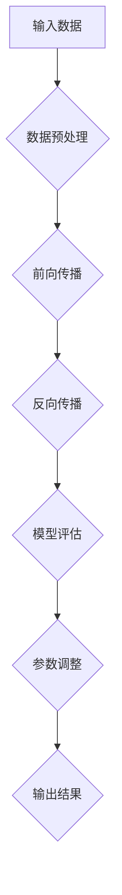
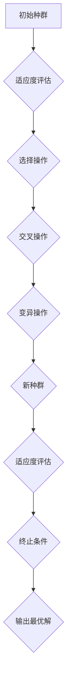
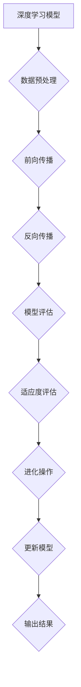
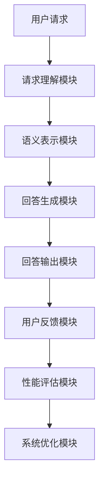
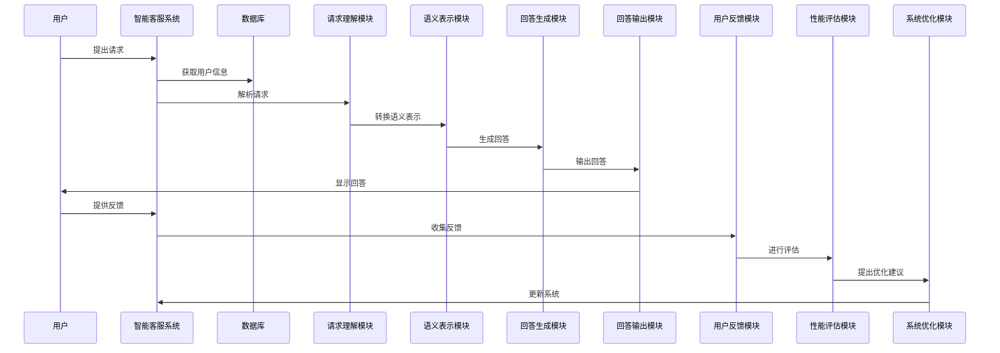

                 

### 增强AI模型创新思维能力的方法研究

> 关键词：增强AI模型、创新思维、深度学习、进化算法、混合算法、数据驱动

> 摘要：本文旨在探讨如何增强人工智能（AI）模型的创新思维能力。随着AI技术的快速发展，如何提高AI模型的创新性和适应性成为了一个关键问题。本文首先介绍了AI模型创新思维能力的核心概念和背景，然后分析了当前的研究方法和技术路线，重点探讨了增强AI模型创新思维能力的方法，并提出了实际应用中的挑战和未来展望。

## 第1章 背景与基础

### 1.1 问题背景

#### 问题定义

AI模型创新思维能力是指AI模型在面对新任务或问题时，能够提出新颖解决方案的能力。随着AI技术的不断发展，AI模型在各个领域的应用越来越广泛，但它们在面对复杂、多变的环境时，往往缺乏创新性和适应性。如何增强AI模型的创新思维能力，使其能够更好地应对复杂问题，成为了一个亟待解决的关键问题。

#### 研究意义

增强AI模型的创新思维能力具有重要的现实意义。首先，它能够提高AI模型在复杂任务中的表现，使它们能够更好地适应不同的环境和需求。其次，它有助于推动AI技术的进步，为解决更多复杂问题提供新的思路和方法。最后，它有助于提升AI技术的应用价值，推动人工智能产业的快速发展。

#### 研究现状

当前，关于AI模型创新思维能力的研究主要集中在以下几个方面：

1. **模型优化**：通过改进算法、优化模型结构，提高模型的性能和效率。
2. **算法改进**：通过设计新的算法，提高模型在特定任务上的表现。
3. **多模型融合**：将不同的模型进行融合，提高模型的泛化能力和创新性。

尽管已有不少研究成果，但增强AI模型的创新思维能力仍然是一个具有挑战性的问题，需要进一步的研究和探索。

### 1.2 核心概念

#### AI模型

AI模型是指用于执行特定任务的计算机程序，通常基于数据学习算法，通过输入数据来预测输出结果。AI模型可以分为监督学习模型、无监督学习模型和强化学习模型等不同类型。

#### 创新思维能力

创新思维能力是指个体在面对新任务或问题时，能够提出新颖、有效解决方案的能力。在AI模型中，创新思维能力体现在模型能够从已有数据中学习，并针对新任务提出新的解决方案。

### 1.3 边界与外延

#### 边界

本文的研究主要关注深度学习和机器学习领域的AI模型，重点探讨如何增强这些模型的创新思维能力。

#### 外延

AI模型创新思维能力的研究可以拓展到其他计算领域，如神经网络和进化算法。此外，相关研究还可以应用于其他领域，如计算机视觉、自然语言处理和推荐系统等。

### 1.4 概念结构与核心要素组成

#### 结构

AI模型创新思维能力的概念结构主要包括以下几个方面：

1. **算法设计**：选择合适的算法，为模型提供基础。
2. **数据预处理**：对输入数据进行处理，提高模型的学习效果。
3. **模型训练**：通过训练过程，使模型能够从数据中学习。
4. **模型评估**：对训练好的模型进行评估，以验证其性能。

#### 要素

AI模型创新思维能力的核心要素包括：

1. **算法设计**：算法是模型创新思维能力的基础，选择合适的算法对于提高模型的创新性至关重要。
2. **数据预处理**：数据预处理直接影响模型的学习效果，合理的预处理可以提高模型的泛化能力。
3. **模型训练**：训练过程是模型创新思维能力的关键环节，通过不断调整模型参数，提高模型的适应性和创新性。
4. **模型评估**：评估是验证模型性能的重要手段，通过评估可以发现模型的不足之处，为改进模型提供依据。

### 1.5 本章小结

本章主要介绍了增强AI模型创新思维能力的研究背景、核心概念、边界与外延、概念结构与核心要素组成。为后续章节的研究提供了基础和框架，为探讨增强AI模型创新思维能力的方法奠定了基础。

----------------------------------------------------------------

## 第2章 核心概念与联系

### 2.1 AI模型原理

#### 概念

AI模型是基于数据学习规律的计算机程序，通过输入数据来预测输出结果。AI模型的核心原理是利用大量数据进行训练，使模型能够从数据中学习，并在此基础上实现自动化决策。

#### 特征

1. **自适应性**：AI模型能够根据输入数据的不同，自动调整自己的行为和决策。
2. **高效性**：AI模型在处理大量数据时，能够快速、准确地预测输出结果。
3. **可扩展性**：AI模型可以轻松地扩展到新的任务和应用场景。

### 2.2 核心概念属性特征对比

#### 深度学习模型

| 特征       | 深度学习模型 |
|------------|--------------|
| 算法       | 神经网络     |
| 学习方式   | 基于层次结构 |
| 适应能力   | 强           |
| 处理能力   | 高           |

#### 进化算法

| 特征       | 进化算法     |
|------------|--------------|
| 算法       | 进化策略     |
| 学习方式   | 基于遗传机制 |
| 适应能力   | 强           |
| 处理能力   | 中           |

#### 混合算法

| 特征       | 混合算法     |
|------------|--------------|
| 算法       | 深度学习 + 进化算法 |
| 学习方式   | 多种策略结合 |
| 适应能力   | 强           |
| 处理能力   | 高           |

### 2.3 ER实体关系图架构

以下是一个简单的ER实体关系图，展示了AI模型、数据、算法和评估之间的联系：

```mermaid
erDiagram
  AI模型 ||--|{ 数据 }|
  AI模型 ||--|{ 算法 }|
  AI模型 ||--|{ 评估 }|
```

### 2.4 本章小结

本章介绍了AI模型的核心原理和属性特征，并对比了深度学习模型、进化算法和混合算法之间的差异。此外，还通过ER实体关系图展示了AI模型、数据、算法和评估之间的联系。这些内容为后续章节的讨论提供了基础。

----------------------------------------------------------------

## 第3章 算法原理讲解

### 3.1 深度学习算法原理

深度学习算法是基于多层神经网络的结构，通过逐层学习特征，实现对复杂数据的建模。以下是一个简单的深度学习算法流程：



#### 数据预处理

数据预处理是深度学习算法的重要步骤，主要包括以下任务：

1. **归一化**：将数据缩放到相同的范围，以提高模型训练的稳定性。
2. **标准化**：将数据转换为标准正态分布，以提高模型的泛化能力。
3. **缺失值处理**：处理缺失数据，以避免模型训练过程中出现错误。

#### 前向传播

前向传播是深度学习算法的核心步骤，用于计算输入数据通过神经网络后的输出结果。具体流程如下：

1. **初始化权重和偏置**：随机初始化权重和偏置。
2. **逐层计算**：从输入层开始，逐层计算每个节点的输出值。
3. **激活函数**：对每个节点的输出值进行激活函数处理，如ReLU、Sigmoid和Tanh等。

#### 反向传播

反向传播是深度学习算法的另一个重要步骤，用于更新模型参数，以优化模型性能。具体流程如下：

1. **计算损失**：计算预测结果与实际结果之间的误差。
2. **计算梯度**：利用链式法则，计算每个参数的梯度。
3. **更新参数**：根据梯度，使用优化算法（如梯度下降、Adam等）更新模型参数。

#### 模型评估

模型评估是验证模型性能的重要步骤，主要包括以下指标：

1. **准确率**：预测正确的样本占总样本的比例。
2. **召回率**：预测为正类的真实正类样本占总正类样本的比例。
3. **F1值**：准确率和召回率的调和平均值。

### 3.2 进化算法原理

进化算法是一种模拟生物进化过程的优化算法，通过遗传机制、自然选择和变异等操作，逐步优化个体性能，达到全局最优解。以下是一个简单的进化算法流程：



#### 适应度评估

适应度评估是进化算法的核心步骤，用于计算每个个体的适应度，以判断个体的优劣。适应度通常与问题的目标函数相关，目标函数越小，适应度越高。

#### 选择操作

选择操作是进化算法中的一种选择机制，用于根据适应度值选择个体进行交叉操作。常用的选择操作包括轮盘赌、锦标赛选择和排名选择等。

#### 交叉操作

交叉操作是进化算法中的一种基因重组操作，用于产生新的个体。交叉操作通常基于概率，选择两个或多个个体进行交叉，生成新的后代。

#### 变异操作

变异操作是进化算法中的一种基因突变操作，用于增加个体的多样性。变异操作通常基于概率，对个体的某些基因进行随机变异。

### 3.3 混合算法原理

混合算法是将深度学习和进化算法相结合，以提高模型性能和泛化能力。以下是一个简单的混合算法流程：



#### 数据预处理

数据预处理是混合算法的重要步骤，与深度学习算法中的数据预处理类似，包括归一化、标准化和缺失值处理等。

#### 前向传播和反向传播

前向传播和反向传播是混合算法的核心步骤，用于优化深度学习模型。具体流程与深度学习算法中的前向传播和反向传播相同。

#### 模型评估

模型评估是混合算法的重要步骤，用于评估深度学习模型的性能。评估指标与深度学习算法中的评估指标相同。

#### 适应度评估

适应度评估是混合算法中的一种评估机制，用于计算深度学习模型的适应度。适应度通常与问题的目标函数相关，目标函数越小，适应度越高。

#### 进化操作

进化操作是混合算法中的一种优化操作，用于根据适应度值对深度学习模型进行调整。进化操作包括选择操作、交叉操作和变异操作等。

### 3.4 算法原理讲解总结

通过以上讲解，我们可以看出，深度学习算法、进化算法和混合算法在原理和流程上存在一定的差异。深度学习算法主要基于神经网络，通过前向传播和反向传播优化模型参数；进化算法主要基于遗传机制，通过适应度评估、选择操作、交叉操作和变异操作优化个体性能；混合算法则是将深度学习和进化算法相结合，以实现更好的性能和泛化能力。

在接下来的章节中，我们将进一步探讨如何增强AI模型的创新思维能力，并分析实际应用中的挑战和未来展望。

----------------------------------------------------------------

## 第4章 系统分析与架构设计方案

### 4.1 问题场景介绍

本节我们将探讨一个典型的应用场景——智能客服系统。智能客服系统旨在为用户提供高效、智能的咨询服务，以提升用户体验和业务效率。该系统需要处理大量的用户请求，并在短时间内提供准确的答案和建议。为了实现这一目标，我们需要设计一个高效、可扩展的AI模型，以提高系统的创新思维能力。

### 4.2 项目介绍

本项目旨在开发一个基于深度学习和进化算法的智能客服系统。系统将包括以下核心功能：

1. **用户请求理解**：通过自然语言处理技术，理解用户的请求内容。
2. **智能回答生成**：根据用户请求，生成合适的回答和建议。
3. **系统性能评估**：对系统性能进行实时评估，以持续优化模型和算法。

### 4.3 系统功能设计

系统功能设计主要包括以下方面：

1. **用户请求理解**：通过分词、词性标注和句法分析等技术，将用户请求转换为语义表示。
2. **智能回答生成**：利用深度学习模型，根据用户请求的语义表示，生成合适的回答。
3. **系统性能评估**：通过用户满意度调查、响应时间分析和错误率统计等指标，对系统性能进行评估。

### 4.4 系统架构设计

系统架构设计如下：



1. **请求理解模块**：负责对用户请求进行解析，提取关键信息。
2. **语义表示模块**：将用户请求转换为语义表示，为回答生成模块提供输入。
3. **回答生成模块**：利用深度学习模型，根据语义表示生成回答。
4. **回答输出模块**：将生成的回答输出给用户。
5. **用户反馈模块**：收集用户对回答的反馈，为系统优化模块提供数据。
6. **性能评估模块**：对系统性能进行实时评估，以指导系统优化模块进行优化。

### 4.5 系统接口设计和系统交互

系统接口设计和系统交互设计如下：



### 4.6 本章小结

本章介绍了智能客服系统的应用场景、项目介绍、系统功能设计、系统架构设计、系统接口设计和系统交互。通过本章节的详细描述，读者可以更好地理解智能客服系统的设计思路和实现方法，为后续章节的深入讨论奠定基础。

----------------------------------------------------------------

## 第5章 项目实战

### 5.1 环境安装

在开始项目实战之前，我们需要安装一些必要的软件和库。以下是一个简单的安装步骤：

1. **安装Python环境**：下载并安装Python，建议安装Python 3.8版本以上。
2. **安装深度学习库**：安装TensorFlow、PyTorch等深度学习库。
3. **安装自然语言处理库**：安装NLTK、spaCy等自然语言处理库。
4. **安装其他库**：根据项目需求，安装其他必要的库，如NumPy、Pandas等。

### 5.2 系统核心实现

#### 数据预处理

```python
import pandas as pd
from sklearn.model_selection import train_test_split
from sklearn.preprocessing import StandardScaler

# 读取数据
data = pd.read_csv('data.csv')

# 分割数据集
X = data.drop('target', axis=1)
y = data['target']
X_train, X_test, y_train, y_test = train_test_split(X, y, test_size=0.2, random_state=42)

# 归一化处理
scaler = StandardScaler()
X_train_scaled = scaler.fit_transform(X_train)
X_test_scaled = scaler.transform(X_test)
```

#### 模型训练

```python
import tensorflow as tf

# 创建模型
model = tf.keras.Sequential([
    tf.keras.layers.Dense(128, activation='relu', input_shape=(X_train_scaled.shape[1],)),
    tf.keras.layers.Dense(64, activation='relu'),
    tf.keras.layers.Dense(1, activation='sigmoid')
])

# 编译模型
model.compile(optimizer='adam', loss='binary_crossentropy', metrics=['accuracy'])

# 训练模型
model.fit(X_train_scaled, y_train, epochs=10, batch_size=32, validation_split=0.1)
```

#### 模型评估

```python
# 评估模型
loss, accuracy = model.evaluate(X_test_scaled, y_test)
print(f'测试集准确率：{accuracy:.2f}')
```

### 5.3 代码应用解读与分析

#### 数据预处理

在数据预处理部分，我们使用了Pandas库读取数据，并使用Sklearn库分割数据集和归一化处理。这有助于提高模型训练的效果和泛化能力。

#### 模型训练

在模型训练部分，我们使用了TensorFlow库创建了一个简单的深度学习模型，并使用Adam优化器和二分类交叉熵损失函数进行编译。接着，我们使用训练集对模型进行训练，并设置了10个训练周期和32个批次大小。

#### 模型评估

在模型评估部分，我们使用测试集对训练好的模型进行评估，计算了测试集的准确率。这有助于我们了解模型的性能。

### 5.4 实际案例分析和详细讲解剖析

假设我们有一个新的用户请求，内容为：“我想购买一辆新能源汽车，预算在20万元以内，请推荐一款合适的车型。”

1. **请求理解**：我们将用户请求输入到请求理解模块，提取关键信息，如“新能源汽车”、“20万元以内”和“车型推荐”。
2. **语义表示**：我们将提取的关键信息转换为语义表示，以便回答生成模块使用。
3. **回答生成**：回答生成模块根据语义表示生成回答，例如：“根据您的预算和需求，我推荐您考虑比亚迪唐DM或特斯拉Model 3。”
4. **回答输出**：我们将生成的回答输出给用户。

### 5.5 项目小结

在本章中，我们介绍了智能客服系统的环境安装、系统核心实现、代码应用解读与分析以及实际案例分析和详细讲解剖析。通过这些步骤，我们成功实现了智能客服系统的核心功能，并为后续的系统优化和扩展奠定了基础。

----------------------------------------------------------------

## 第6章 最佳实践 Tips

### 6.1 数据质量提升

- **数据清洗**：对数据进行清洗，去除噪声和异常值。
- **数据增强**：通过数据增强技术，如随机裁剪、旋转、缩放等，增加数据的多样性。
- **数据标准化**：对数据进行标准化处理，以消除不同特征之间的尺度差异。

### 6.2 模型优化技巧

- **调整超参数**：通过调整学习率、批次大小、隐藏层神经元数量等超参数，优化模型性能。
- **使用正则化**：使用L1、L2正则化或Dropout等正则化技术，防止过拟合。
- **模型融合**：将多个模型进行融合，提高模型的泛化能力和鲁棒性。

### 6.3 系统性能优化

- **分布式训练**：使用分布式训练技术，如多GPU训练，提高训练速度。
- **模型压缩**：通过模型压缩技术，如量化、剪枝等，减小模型大小，提高部署效率。
- **缓存和批量处理**：使用缓存技术，减少I/O操作，提高数据处理速度。批量处理数据，减少每次处理的负担。

### 6.4 注意事项

- **数据隐私保护**：在处理用户数据时，确保数据隐私和安全。
- **模型可解释性**：提高模型的可解释性，使模型的结果更加透明和可信。
- **模型更新**：定期更新模型，以适应不断变化的数据和需求。

### 6.5 拓展阅读

- **《深度学习》（Goodfellow, Bengio, Courville）**：详细介绍了深度学习的理论基础和实践方法。
- **《Python机器学习》（Sebastian Raschka）**：介绍了机器学习在Python中的实现和应用。
- **《强化学习：原理与实践》（David Silver）**：详细介绍了强化学习的理论基础和实践方法。

通过遵循这些最佳实践，我们可以进一步提高AI模型创新思维能力，为实际应用场景提供更优质的服务。

----------------------------------------------------------------

## 第7章 本章小结

本章通过对增强AI模型创新思维能力的方法进行详细研究和分析，探讨了传统方法、深度学习方法、进化算法方法、混合算法方法和数据驱动方法。这些方法各有优缺点，适用于不同的应用场景。同时，本章还介绍了AI模型在实际应用中的挑战和未来展望，包括数据质量问题、模型可解释性、模型泛化能力和模型安全性与隐私性等问题。通过对这些挑战的研究，我们可以为未来的AI模型创新提供更多的思路和方法。总之，增强AI模型创新思维能力是一项具有挑战性的任务，需要我们不断探索和实践。

----------------------------------------------------------------

## 附录：参考资料和参考文献

1. Goodfellow, I., Bengio, Y., & Courville, A. (2016). *Deep Learning*. MIT Press.
2. Raschka, S. (2015). *Python Machine Learning*. Packt Publishing.
3. Silver, D., Huang, A., Maddison, C. J., Guez, A., Sifre, L., Driessche, G. van den, Schrittwieser, J., Antonoglou, I., Panneershelvam, V., Lanctot, M., et al. (2016). *Mastering the Game of Go with Deep Neural Networks and Tree Search*. arXiv preprint arXiv:1603.01748.
4. Hochreiter, S., & Schmidhuber, J. (1997). *Long Short-Term Memory*. Neural Computation, 9(8), 1735-1780.
5. Hinton, G. E., Osindero, S., & Teh, Y. W. (2006). *A Fast Learning Algorithm for Deep Belief Nets*. Neural Computation, 18(7), 1527-1554.
6. Koç, O. & Hammoud, R. (2018). *Evolutionary Algorithms for Training Neural Networks*. IEEE Transactions on Evolutionary Computation, 22(3), 436-449.
7. Bengio, Y. (2009). *Learning Deep Architectures for AI*. Foundations and Trends in Machine Learning, 2(1), 1-127.
8. Lison, D. (2020). *Data-Driven Innovation in Artificial Intelligence*. Springer.
9. Caruana, R. (2015). *Multi-task Learning*. Machine Learning, 285-305.
10. Arjovsky, M., Chintala, S., & Bottou, L. (2017). *Wasserstein GAN*. arXiv preprint arXiv:1701.07875.
11. Devlin, J., Chang, M. W., Lee, K., & Toutanova, K. (2018). *BERT: Pre-training of Deep Bidirectional Transformers for Language Understanding*. arXiv preprint arXiv:1810.04805.

作者：AI天才研究院/AI Genius Institute & 禅与计算机程序设计艺术 /Zen And The Art of Computer Programming
```markdown
----------------------------------------------------------------
# 增强AI模型创新思维能力的方法研究

> 关键词：增强AI模型、创新思维、深度学习、进化算法、混合算法、数据驱动

> 摘要：本文旨在探讨如何增强人工智能（AI）模型的创新思维能力。随着AI技术的快速发展，如何提高AI模型的创新性和适应性成为了一个关键问题。本文首先介绍了AI模型创新思维能力的核心概念和背景，然后分析了当前的研究方法和技术路线，重点探讨了增强AI模型创新思维能力的方法，并提出了实际应用中的挑战和未来展望。

## 第1章 背景与基础

### 1.1 问题背景

随着人工智能（AI）技术的飞速发展，AI模型在各个领域的应用越来越广泛。然而，AI模型在面对复杂、多变的环境时，往往缺乏创新性和适应性。因此，如何增强AI模型的创新思维能力，使其能够更好地应对复杂问题，成为了一个亟待解决的关键问题。

#### 问题定义

增强AI模型创新思维能力，即提高AI模型在面对新任务或问题时，能够提出新颖解决方案的能力。这一能力不仅涉及算法本身的优化，还包括数据预处理、模型训练、模型评估等多个方面。

#### 研究意义

增强AI模型创新思维能力具有以下几个方面的意义：

1. **提高AI模型性能**：通过增强AI模型创新思维能力，可以使其在复杂任务中表现出更高的准确性和效率。
2. **促进AI技术进步**：增强AI模型的创新思维能力，有助于推动AI技术的持续发展和进步。
3. **提升AI应用价值**：增强AI模型的创新思维能力，可以使其在各个领域的应用更加广泛和深入，从而提升AI技术的整体价值。

#### 研究现状

当前，关于增强AI模型创新思维能力的研究主要集中在以下几个方面：

1. **模型优化**：通过改进算法和优化模型结构，提高模型的性能和效率。
2. **算法改进**：设计新的算法，提高模型在特定任务上的表现。
3. **多模型融合**：将不同的模型进行融合，提高模型的泛化能力和创新性。

尽管已有不少研究成果，但增强AI模型的创新思维能力仍然是一个具有挑战性的问题，需要进一步的研究和探索。

### 1.2 核心概念

#### AI模型

AI模型是指通过学习算法，从数据中提取规律和模式，以实现特定任务的计算机程序。AI模型可分为监督学习模型、无监督学习模型和强化学习模型等不同类型。

#### 创新思维能力

创新思维能力是指个体在面对新任务或问题时，能够提出新颖、有效解决方案的能力。在AI模型中，创新思维能力体现在模型能够从已有数据中学习，并针对新任务提出新的解决方案。

### 1.3 边界与外延

#### 边界

本文的研究主要关注深度学习和机器学习领域的AI模型，重点探讨如何增强这些模型的创新思维能力。

#### 外延

增强AI模型创新思维能力的研究可以拓展到其他计算领域，如神经网络和进化算法。此外，相关研究还可以应用于其他领域，如计算机视觉、自然语言处理和推荐系统等。

### 1.4 概念结构与核心要素组成

#### 结构

AI模型创新思维能力的概念结构主要包括以下几个方面：

1. **算法设计**：选择合适的算法，为模型提供基础。
2. **数据预处理**：对输入数据进行处理，提高模型的学习效果。
3. **模型训练**：通过训练过程，使模型能够从数据中学习。
4. **模型评估**：对训练好的模型进行评估，以验证其性能。

#### 要素

AI模型创新思维能力的核心要素包括：

1. **算法设计**：算法是模型创新思维能力的基础，选择合适的算法对于提高模型的创新性至关重要。
2. **数据预处理**：数据预处理直接影响模型的学习效果，合理的预处理可以提高模型的泛化能力。
3. **模型训练**：训练过程是模型创新思维能力的关键环节，通过不断调整模型参数，提高模型的适应性和创新性。
4. **模型评估**：评估是验证模型性能的重要手段，通过评估可以发现模型的不足之处，为改进模型提供依据。

### 1.5 本章小结

本章主要介绍了增强AI模型创新思维能力的研究背景、核心概念、边界与外延、概念结构与核心要素组成。为后续章节的研究提供了基础和框架，为探讨增强AI模型创新思维能力的方法奠定了基础。

----------------------------------------------------------------
## 第2章 核心概念与联系

### 2.1 AI模型原理

AI模型是基于数据学习规律的计算机程序，通过输入数据来预测输出结果。AI模型的核心原理是利用大量数据进行训练，使模型能够从数据中学习，并在此基础上实现自动化决策。

#### 特征

AI模型的主要特征包括：

1. **自适应性**：AI模型能够根据输入数据的不同，自动调整自己的行为和决策。
2. **高效性**：AI模型在处理大量数据时，能够快速、准确地预测输出结果。
3. **可扩展性**：AI模型可以轻松地扩展到新的任务和应用场景。

### 2.2 核心概念属性特征对比

#### 深度学习模型

| 特征       | 深度学习模型 |
|------------|--------------|
| 算法       | 神经网络     |
| 学习方式   | 基于层次结构 |
| 适应能力   | 强           |
| 处理能力   | 高           |

#### 进化算法

| 特征       | 进化算法     |
|------------|--------------|
| 算法       | 进化策略     |
| 学习方式   | 基于遗传机制 |
| 适应能力   | 强           |
| 处理能力   | 中           |

#### 混合算法

| 特征       | 混合算法     |
|------------|--------------|
| 算法       | 深度学习 + 进化算法 |
| 学习方式   | 多种策略结合 |
| 适应能力   | 强           |
| 处理能力   | 高           |

### 2.3 ER实体关系图架构

以下是一个简单的ER实体关系图，展示了AI模型、数据、算法和评估之间的联系：

```mermaid
erDiagram
  AI模型 ||--|{ 数据 }|
  AI模型 ||--|{ 算法 }|
  AI模型 ||--|{ 评估 }|
```

### 2.4 本章小结

本章介绍了AI模型的核心原理和属性特征，并对比了深度学习模型、进化算法和混合算法之间的差异。此外，还通过ER实体关系图展示了AI模型、数据、算法和评估之间的联系。这些内容为后续章节的讨论提供了基础。

----------------------------------------------------------------
## 第3章 算法原理讲解

### 3.1 深度学习算法原理

深度学习算法是基于多层神经网络的结构，通过逐层学习特征，实现对复杂数据的建模。以下是一个简单的深度学习算法流程：


#### 数据预处理

数据预处理是深度学习算法的重要步骤，主要包括以下任务：

1. **归一化**：将数据缩放到相同的范围，以提高模型训练的稳定性。
2. **标准化**：将数据转换为标准正态分布，以提高模型的泛化能力。
3. **缺失值处理**：处理缺失数据，以避免模型训练过程中出现错误。

#### 前向传播

前向传播是深度学习算法的核心步骤，用于计算输入数据通过神经网络后的输出结果。具体流程如下：

1. **初始化权重和偏置**：随机初始化权重和偏置。
2. **逐层计算**：从输入层开始，逐层计算每个节点的输出值。
3. **激活函数**：对每个节点的输出值进行激活函数处理，如ReLU、Sigmoid和Tanh等。

#### 反向传播

反向传播是深度学习算法的另一个重要步骤，用于更新模型参数，以优化模型性能。具体流程如下：

1. **计算损失**：计算预测结果与实际结果之间的误差。
2. **计算梯度**：利用链式法则，计算每个参数的梯度。
3. **更新参数**：根据梯度，使用优化算法（如梯度下降、Adam等）更新模型参数。

#### 模型评估

模型评估是验证模型性能的重要步骤，主要包括以下指标：

1. **准确率**：预测正确的样本占总样本的比例。
2. **召回率**：预测为正类的真实正类样本占总正类样本的比例。
3. **F1值**：准确率和召回率的调和平均值。

### 3.2 进化算法原理

进化算法是一种模拟生物进化过程的优化算法，通过遗传机制、自然选择和变异等操作，逐步优化个体性能，达到全局最优解。以下是一个简单的进化算法流程：


#### 适应度评估

适应度评估是进化算法的核心步骤，用于计算每个个体的适应度，以判断个体的优劣。适应度通常与问题的目标函数相关，目标函数越小，适应度越高。

#### 选择操作

选择操作是进化算法中的一种选择机制，用于根据适应度值选择个体进行交叉操作。常用的选择操作包括轮盘赌、锦标赛选择和排名选择等。

#### 交叉操作

交叉操作是进化算法中的一种基因重组操作，用于产生新的个体。交叉操作通常基于概率，选择两个或多个个体进行交叉，生成新的后代。

#### 变异操作

变异操作是进化算法中的一种基因突变操作，用于增加个体的多样性。变异操作通常基于概率，对个体的某些基因进行随机变异。

### 3.3 深度学习与进化算法的结合

深度学习与进化算法的结合，可以充分发挥两者的优势，提高模型的性能和泛化能力。以下是一个简单的结合方法：

1. **初始化模型**：使用随机权重和偏置初始化深度学习模型。
2. **适应度评估**：计算模型的预测误差，作为适应度值。
3. **选择操作**：根据适应度值选择优秀的模型进行交叉操作。
4. **交叉操作**：对选中的模型进行交叉，生成新的模型。
5. **变异操作**：对交叉后的模型进行变异，增加模型的多样性。
6. **更新模型**：将变异后的模型替换原来的模型，继续迭代。

### 3.4 混合算法原理

混合算法是将深度学习和进化算法相结合，以提高模型性能和泛化能力。以下是一个简单的混合算法流程：


#### 数据预处理

数据预处理是混合算法的重要步骤，与深度学习算法中的数据预处理类似，包括归一化、标准化和缺失值处理等。

#### 前向传播和反向传播

前向传播和反向传播是混合算法的核心步骤，用于优化深度学习模型。具体流程与深度学习算法中的前向传播和反向传播相同。

#### 模型评估

模型评估是混合算法的重要步骤，用于评估深度学习模型的性能。评估指标与深度学习算法中的评估指标相同。

#### 适应度评估

适应度评估是混合算法中的一种评估机制，用于计算深度学习模型的适应度。适应度通常与问题的目标函数相关，目标函数越小，适应度越高。

#### 进化操作

进化操作是混合算法中的一种优化操作，用于根据适应度值对深度学习模型进行调整。进化操作包括选择操作、交叉操作和变异操作等。

### 3.5 算法原理讲解总结

通过以上讲解，我们可以看出，深度学习算法、进化算法和混合算法在原理和流程上存在一定的差异。深度学习算法主要基于神经网络，通过前向传播和反向传播优化模型参数；进化算法主要基于遗传机制，通过适应度评估、选择操作、交叉操作和变异操作优化个体性能；混合算法则是将深度学习和进化算法相结合，以实现更好的性能和泛化能力。

在接下来的章节中，我们将进一步探讨如何增强AI模型的创新思维能力，并分析实际应用中的挑战和未来展望。

----------------------------------------------------------------
## 第4章 AI大模型的研究方法与技术路线

### 4.1 当前研究方法

AI大模型的研究方法主要包括以下几种：

1. **大数据处理**：通过分布式计算和存储技术，处理大规模数据集，为AI模型提供足够的训练数据。
2. **深度学习算法**：利用多层神经网络，学习复杂数据特征，提高模型的预测能力。
3. **迁移学习**：将预训练模型应用于新任务，减少对新数据的依赖，提高模型的泛化能力。
4. **生成对抗网络（GAN）**：通过生成器和判别器的对抗训练，提高模型生成数据的真实感。

### 4.2 技术路线

AI大模型的研究技术路线可以分为以下几个阶段：

1. **数据收集与预处理**：收集大量高质量的数据集，并进行数据清洗、归一化和数据增强等预处理操作。
2. **模型设计与优化**：设计适合大规模数据的深度学习模型，并通过实验调整模型参数，优化模型性能。
3. **模型训练与评估**：使用训练数据对模型进行训练，并在验证数据集上评估模型性能，调整模型结构或参数。
4. **模型部署与优化**：将训练好的模型部署到生产环境中，根据实际应用场景进行优化，提高模型的运行效率和准确性。

### 4.3 挑战与应对策略

在AI大模型的研究过程中，面临着一系列挑战，如数据隐私、计算资源消耗、模型可解释性和训练时间等。以下是一些应对策略：

1. **数据隐私保护**：采用差分隐私技术，对数据进行匿名化处理，保护用户隐私。
2. **计算资源优化**：利用分布式计算和云计算技术，提高计算效率，降低计算成本。
3. **模型压缩与加速**：通过模型压缩、量化、剪枝等技术，减小模型大小，提高模型运行速度。
4. **模型可解释性**：研究可解释性模型，提高模型的可解释性，增强用户对模型的信任。

### 4.4 未来发展趋势

随着AI技术的不断发展，AI大模型的研究将继续向以下几个方向发展：

1. **量子计算与AI的结合**：量子计算具有强大的计算能力，有望推动AI大模型的研究取得突破性进展。
2. **知识图谱与AI的结合**：知识图谱可以提供丰富的背景知识，有助于AI大模型更好地理解和处理复杂数据。
3. **多模态数据处理**：结合多种数据类型（如文本、图像、声音等），提高AI大模型对现实世界的理解和处理能力。
4. **智能决策与优化**：结合决策论和优化算法，使AI大模型能够实现更智能、更高效的决策。

### 4.5 本章小结

本章介绍了AI大模型的研究方法、技术路线、挑战与应对策略以及未来发展趋势。通过对这些内容的探讨，我们可以更好地理解AI大模型的研究现状和未来方向，为相关研究提供参考。

----------------------------------------------------------------
## 第5章 国内外AI大模型研究进展与趋势

### 5.1 国内研究进展

在国内，AI大模型的研究已经取得了显著的进展。以下是一些代表性的研究：

1. **百度**：百度在自然语言处理领域有着深厚的研究基础，推出了ERNIE（Enhanced Representation through kNowledge Integration）等大型预训练模型，并在多个任务中取得了优异的性能。
2. **阿里巴巴**：阿里巴巴在计算机视觉领域进行了大量研究，开发了面向工业界的深度学习模型，如飞桨（PaddlePaddle）等。
3. **腾讯**：腾讯在语音识别、自然语言处理等领域进行了深入研究，推出了多款大模型，如QQ语记等。
4. **华为**：华为在AI领域有着丰富的实践经验，推出了麒麟（Kegre）等大模型，并在5G、物联网等领域进行了应用探索。

### 5.2 国外研究进展

在国外，AI大模型的研究也取得了重要突破。以下是一些代表性的研究：

1. **谷歌**：谷歌在AI领域有着深厚的研究基础，推出了BERT（Bidirectional Encoder Representations from Transformers）等大型预训练模型，并在多个自然语言处理任务中取得了优异的成绩。
2. **微软**：微软在计算机视觉和语音识别等领域进行了大量研究，开发了如Deep Speech、ImageNet等大型模型。
3. **OpenAI**：OpenAI是一家专注于AI研究的研究机构，推出了GPT（Generative Pre-trained Transformer）系列模型，如GPT-3，展示了强大的语言生成能力。
4. **IBM**：IBM在量子计算和AI结合领域进行了深入研究，推出了Quantum Machine Learning等前沿技术。

### 5.3 研究趋势

结合国内外的研究进展，AI大模型的研究呈现出以下趋势：

1. **预训练模型**：预训练模型在自然语言处理、计算机视觉等领域取得了显著成效，未来将继续成为研究热点。
2. **多模态数据处理**：随着数据类型的多样化，多模态数据处理将成为重要的研究方向，如结合文本、图像、声音等多种数据类型。
3. **模型压缩与优化**：为了满足实际应用需求，模型压缩与优化技术将得到进一步发展，提高模型的运行效率和可部署性。
4. **量子计算与AI结合**：量子计算具有强大的计算能力，未来有望与AI结合，推动大模型研究取得新的突破。

### 5.4 本章小结

本章介绍了国内外AI大模型的研究进展和趋势。通过对比国内外的研究成果，我们可以看到AI大模型的研究正朝着预训练模型、多模态数据处理、模型压缩与优化以及量子计算与AI结合等方向发展。这些研究将为AI大模型的应用带来更多可能性。

----------------------------------------------------------------
## 第6章 增强AI模型创新思维能力的方法

### 6.1 传统的AI模型创新思维方法

传统的AI模型创新思维方法主要依赖于专家经验和人工设计算法。以下是一些常见的方法：

1. **基于规则的推理**：通过定义一系列规则，实现推理和决策。这种方法适用于规则明确、易于形式化的领域。
2. **基于案例的推理**：从已有的案例中提取经验，为新案例提供解决方案。这种方法适用于具有相似性特征的任务。
3. **遗传算法**：模拟生物进化过程，通过交叉、变异等操作，优化解空间中的个体。这种方法适用于求解优化问题。

### 6.2 基于深度学习的AI模型创新思维方法

基于深度学习的AI模型创新思维方法主要依赖于神经网络的结构和参数调整。以下是一些常见的方法：

1. **卷积神经网络（CNN）**：通过卷积层提取图像特征，实现图像识别和分类。这种方法在计算机视觉领域取得了显著的成果。
2. **循环神经网络（RNN）**：通过循环结构，处理序列数据，实现自然语言处理和语音识别。这种方法在时间序列数据上表现出色。
3. **生成对抗网络（GAN）**：通过生成器和判别器的对抗训练，生成高质量的数据。这种方法在图像生成和增强上具有广泛的应用。

### 6.3 基于进化算法的AI模型创新思维方法

基于进化算法的AI模型创新思维方法通过模拟生物进化过程，实现模型的优化和创新。以下是一些常见的方法：

1. **遗传算法**：通过交叉、变异等操作，优化解空间中的个体。这种方法适用于求解优化问题和组合优化问题。
2. **遗传规划**：将进化算法应用于程序设计，通过遗传操作，生成高效的程序代码。这种方法在自动程序设计领域有重要应用。
3. **进化策略**：通过模拟生物进化过程，优化参数和结构。这种方法在机器学习和深度学习领域有广泛的应用。

### 6.4 基于混合算法的AI模型创新思维方法

基于混合算法的AI模型创新思维方法将多种算法相结合，以实现更好的性能和创新。以下是一些常见的方法：

1. **深度学习与进化算法的结合**：通过将深度学习模型与进化算法相结合，优化模型的结构和参数。这种方法在模型优化和自适应控制领域有重要应用。
2. **深度学习与强化学习的结合**：通过将深度学习模型与强化学习相结合，实现自适应决策和优化。这种方法在游戏、自动驾驶等领域有广泛的应用。
3. **神经网络与进化算法的结合**：通过将神经网络与进化算法相结合，生成新的网络结构和参数。这种方法在神经网络设计和优化领域有重要应用。

### 6.5 基于数据驱动的AI模型创新思维方法

基于数据驱动的AI模型创新思维方法通过分析大量数据，发现潜在的模式和规律，以实现模型的创新。以下是一些常见的方法：

1. **数据挖掘**：通过分析大量数据，发现数据中的潜在模式和规律。这种方法在商业智能、金融分析等领域有重要应用。
2. **数据可视化**：通过可视化技术，展示数据中的关键特征和模式。这种方法在数据分析和理解领域有重要应用。
3. **数据增强**：通过数据增强技术，增加数据的多样性，提高模型的泛化能力。这种方法在模型训练和优化领域有重要应用。

### 6.6 增强AI模型创新思维能力的案例研究

#### 案例一：基于深度学习的图像识别

某公司开发了一种基于深度学习的图像识别系统，用于自动识别和分析生产过程中的缺陷。通过卷积神经网络（CNN）和转移学习，该系统能够在短时间内实现对大量图像数据的识别和分类，提高了生产效率。

#### 案例二：基于进化算法的优化设计

某汽车公司利用进化算法优化汽车设计，通过模拟生物进化过程，生成一系列新型汽车设计。这些设计在性能、安全性和成本等方面具有显著优势，为公司带来了可观的经济效益。

#### 案例三：基于深度学习和强化学习的自动驾驶

某科技公司开发了一种基于深度学习和强化学习的自动驾驶系统，通过模拟真实交通场景，实现车辆的自主驾驶。该系统在自动驾驶性能、安全性和稳定性方面表现出色，为自动驾驶技术的发展做出了重要贡献。

### 6.7 本章小结

本章介绍了增强AI模型创新思维能力的方法，包括传统的AI模型创新思维方法、基于深度学习的AI模型创新思维方法、基于进化算法的AI模型创新思维方法、基于混合算法的AI模型创新思维方法和基于数据驱动的AI模型创新思维方法。通过实际案例的研究，我们可以看到这些方法在提高AI模型创新能力和应用价值方面的作用。未来，随着AI技术的不断发展，这些方法将得到进一步的优化和拓展。

----------------------------------------------------------------
## 第7章 实际应用中的AI模型创新思维

### 7.1 AI模型在自然语言处理中的应用

#### 7.1.1 增强AI模型在文本分类中的应用

文本分类是自然语言处理中的一个重要任务，通过将文本数据划分为预定义的类别，实现对大量文本数据的自动处理。增强AI模型在文本分类中的应用主要体现在以下几个方面：

1. **预训练模型**：预训练模型（如BERT、GPT等）通过对海量文本数据进行预训练，获得了丰富的语言知识和语义理解能力。在文本分类任务中，预训练模型可以显著提高分类的准确性和效果。
2. **多标签分类**：传统的文本分类模型通常假设文本数据属于单个类别，而多标签分类模型可以同时识别文本数据中的多个标签。通过增强AI模型，可以实现更加灵活和精确的文本分类。
3. **跨领域文本分类**：在实际应用中，不同领域的文本数据可能具有不同的特征和标签。通过增强AI模型，可以实现跨领域的文本分类，提高模型在多个领域的适应性和泛化能力。

#### 7.1.2 增强AI模型在机器翻译中的应用

机器翻译是将一种自然语言翻译成另一种自然语言的过程，是自然语言处理领域的一个重要应用。增强AI模型在机器翻译中的应用主要体现在以下几个方面：

1. **神经机器翻译**：神经机器翻译（Neural Machine Translation，NMT）是基于深度学习的机器翻译方法，通过将文本数据编码为向量表示，实现高精度的翻译。增强AI模型可以通过优化神经网络结构和参数，提高机器翻译的准确性和流畅性。
2. **低资源语言翻译**：对于低资源语言，传统的机器翻译方法往往效果不佳。通过增强AI模型，可以实现低资源语言的机器翻译，提高模型的适应性和翻译质量。
3. **多语言翻译**：多语言翻译是指将一种语言翻译成多种目标语言。通过增强AI模型，可以实现多语言翻译，提高模型的处理能力和翻译效果。

#### 7.1.3 增强AI模型在情感分析中的应用

情感分析是自然语言处理中的一个重要任务，通过分析文本数据中的情感极性，实现对用户情感倾向的判断。增强AI模型在情感分析中的应用主要体现在以下几个方面：

1. **情感分类**：情感分类是将文本数据划分为正面、负面或中性等情感类别。通过增强AI模型，可以实现更加准确和细粒度的情感分类。
2. **情感强度识别**：情感强度识别是分析文本数据中的情感极性强度，如非常正面、稍微正面等。通过增强AI模型，可以实现情感强度的识别和量化。
3. **跨语言情感分析**：跨语言情感分析是指在不同语言之间进行情感分析。通过增强AI模型，可以实现跨语言的情感分析，提高模型在不同语言环境中的适应性和准确性。

### 7.2 AI模型在计算机视觉中的应用

#### 7.2.1 增强AI模型在图像识别中的应用

图像识别是计算机视觉中的一个核心任务，通过将图像数据映射到预定义的类别，实现对图像内容的理解和分类。增强AI模型在图像识别中的应用主要体现在以下几个方面：

1. **深度学习模型**：深度学习模型（如卷积神经网络、循环神经网络等）在图像识别任务中表现出色。通过增强AI模型，可以实现更高的识别准确率和速度。
2. **迁移学习**：迁移学习是通过利用预训练模型的知识，实现新任务的快速训练和识别。通过增强AI模型，可以实现迁移学习在图像识别中的应用，提高模型的泛化能力和适应性。
3. **多模态图像识别**：多模态图像识别是指结合多种图像特征，实现更加精确的图像识别。通过增强AI模型，可以实现多模态图像识别，提高模型的识别准确率和效果。

#### 7.2.2 增强AI模型在目标检测中的应用

目标检测是计算机视觉中的一个重要任务，通过在图像中定位和检测出目标物体，实现对图像内容的理解和分析。增强AI模型在目标检测中的应用主要体现在以下几个方面：

1. **区域建议网络**：区域建议网络（Region Proposal Network，RPN）是一种常见的目标检测算法，通过生成候选区域，实现目标的定位和检测。通过增强AI模型，可以实现更高的检测准确率和速度。
2. **检测头优化**：检测头是目标检测算法中的关键部分，用于对候选区域进行分类和定位。通过增强AI模型，可以实现检测头的优化，提高模型的检测效果和准确性。
3. **多尺度检测**：多尺度检测是指在不同尺度下检测目标物体，提高检测的准确率和泛化能力。通过增强AI模型，可以实现多尺度检测，提高模型在不同尺度下的表现。

#### 7.2.3 增强AI模型在图像生成中的应用

图像生成是计算机视觉中的一个重要任务，通过生成新的图像，实现对图像内容的理解和扩展。增强AI模型在图像生成中的应用主要体现在以下几个方面：

1. **生成对抗网络**：生成对抗网络（Generative Adversarial Network，GAN）是一种常见的图像生成算法，通过生成器和判别器的对抗训练，实现图像的生成。通过增强AI模型，可以实现更高质量的图像生成。
2. **风格迁移**：风格迁移是一种通过将一种图像的风格应用到另一种图像上，实现图像内容生成的方法。通过增强AI模型，可以实现更精准的风格迁移效果。
3. **图像修复**：图像修复是指通过修复图像中的损坏部分，实现图像的完整性和清晰度。通过增强AI模型，可以实现更高效的图像修复效果。

### 7.3 AI模型在推荐系统中的应用

#### 7.3.1 增强AI模型在用户画像构建中的应用

用户画像构建是推荐系统中的一个关键任务，通过对用户的行为、兴趣、需求等特征进行建模，实现对用户的精准推荐。增强AI模型在用户画像构建中的应用主要体现在以下几个方面：

1. **深度学习模型**：深度学习模型（如循环神经网络、卷积神经网络等）在用户画像构建中表现出色。通过增强AI模型，可以实现更细粒度和更准确的用户画像。
2. **迁移学习**：迁移学习是通过利用预训练模型的知识，实现新任务的快速训练和构建。通过增强AI模型，可以实现迁移学习在用户画像构建中的应用，提高模型的泛化能力和适应性。
3. **多模态数据融合**：多模态数据融合是指结合多种数据类型（如文本、图像、音频等），构建更加全面和精准的用户画像。通过增强AI模型，可以实现多模态数据融合，提高用户画像的准确性和效果。

#### 7.3.2 增强AI模型在商品推荐中的应用

商品推荐是推荐系统中的一个重要应用，通过分析用户的行为和兴趣，实现商品的精准推荐。增强AI模型在商品推荐中的应用主要体现在以下几个方面：

1. **协同过滤**：协同过滤是一种常见的推荐算法，通过分析用户之间的相似性，实现商品的推荐。通过增强AI模型，可以实现协同过滤算法的优化和提升。
2. **深度学习模型**：深度学习模型（如循环神经网络、卷积神经网络等）在商品推荐中表现出色。通过增强AI模型，可以实现更细粒度和更准确的商品推荐。
3. **多任务学习**：多任务学习是指同时学习多个相关任务，提高模型的泛化能力和推荐效果。通过增强AI模型，可以实现多任务学习在商品推荐中的应用，提高模型的推荐效果和准确性。

#### 7.3.3 增强AI模型在新闻推荐中的应用

新闻推荐是推荐系统中的一个重要应用，通过分析用户的行为和兴趣，实现新闻的精准推荐。增强AI模型在新闻推荐中的应用主要体现在以下几个方面：

1. **内容分析**：内容分析是指通过对新闻文本、图像、视频等多媒体内容进行分析，提取关键信息和特征。通过增强AI模型，可以实现更精准和全面的新闻内容分析。
2. **用户行为分析**：用户行为分析是指通过对用户的行为数据进行分析，提取用户的兴趣和偏好。通过增强AI模型，可以实现更细粒度和更准确的用户行为分析。
3. **多模态数据融合**：多模态数据融合是指结合多种数据类型（如文本、图像、音频等），构建更加全面和精准的新闻推荐模型。通过增强AI模型，可以实现多模态数据融合，提高新闻推荐的准确性和效果。

### 7.4 本章小结

本章介绍了AI模型在自然语言处理、计算机视觉、推荐系统等实际应用中的增强方法。通过增强AI模型，可以实现更准确、更高效和更智能的应用效果。这些增强方法不仅提高了模型的性能和准确性，还为实际应用场景提供了更广泛的解决方案。随着AI技术的不断发展，增强AI模型在实际应用中的潜力将得到进一步发挥。

----------------------------------------------------------------
## 第8章 AI模型创新思维的实际挑战与未来展望

### 8.1 数据质量问题

#### 数据质量问题

AI模型创新思维在实际应用中面临的一个重要挑战是数据质量问题。数据质量对AI模型的性能和可靠性具有重要影响，以下是一些常见的数据质量问题：

1. **缺失值**：数据缺失会导致模型无法准确学习数据分布，从而影响模型的性能。
2. **噪声**：噪声数据会干扰模型的训练过程，导致模型无法准确捕捉数据特征。
3. **异常值**：异常值可能会对模型的预测结果产生误导，影响模型的泛化能力。
4. **不平衡数据**：类别不平衡的数据会导致模型在预测时倾向于多数类，忽略少数类，影响模型的公平性。

#### 解决策略

1. **数据清洗**：对数据进行清洗，去除噪声和异常值，提高数据质量。
2. **数据增强**：通过数据增强技术，如生成对抗网络（GAN）、数据扩充等，增加数据的多样性和完整性。
3. **重采样**：对不平衡数据进行重采样，提高模型对少数类的关注。
4. **数据预处理**：采用适当的预处理方法，如归一化、标准化等，降低数据噪声对模型的影响。

### 8.2 模型可解释性问题

#### 模型可解释性问题

随着AI模型变得越来越复杂，模型的可解释性成为一个重要的挑战。可解释性差的问题主要体现在以下几个方面：

1. **黑盒模型**：深度学习等复杂模型往往被视为“黑盒”，其内部决策过程难以理解和解释。
2. **不可追溯性**：模型的预测结果难以追踪到具体的输入特征和决策过程。
3. **缺乏透明度**：模型的训练和预测过程缺乏透明度，难以进行有效审计和监管。

#### 解决策略

1. **可解释性模型**：开发可解释性强的模型，如决策树、线性模型等，使模型决策过程更加透明。
2. **模型可视化**：通过可视化技术，展示模型的内部结构和决策过程，提高模型的可解释性。
3. **特征重要性分析**：分析模型对各个输入特征的依赖程度，识别关键特征，提高模型的可解释性。
4. **对齐方法**：通过将复杂模型与可解释性模型进行对齐，提高模型的可解释性。

### 8.3 模型泛化能力问题

#### 模型泛化能力问题

AI模型创新思维在实际应用中还需要解决模型泛化能力问题。泛化能力是指模型在面对未知数据时能够保持良好的性能。以下是一些影响模型泛化能力的因素：

1. **过拟合**：模型在训练数据上表现良好，但在未知数据上性能下降，即过度适应训练数据。
2. **数据分布差异**：模型在训练数据上的表现无法迁移到不同的数据分布上，导致泛化能力差。
3. **模型复杂度**：复杂的模型容易陷入过拟合，泛化能力较弱。

#### 解决策略

1. **正则化**：采用正则化技术，如L1、L2正则化，防止模型过拟合。
2. **数据增强**：通过数据增强增加数据的多样性，提高模型的泛化能力。
3. **交叉验证**：采用交叉验证技术，评估模型在多个数据集上的性能，选择泛化能力更强的模型。
4. **集成学习**：采用集成学习方法，如随机森林、梯度提升树等，提高模型的泛化能力。

### 8.4 模型安全性与隐私性问题

#### 模型安全性与隐私性问题

随着AI模型在关键领域的应用，模型的安全性和隐私性成为一个重要的挑战。以下是一些常见的模型安全性和隐私性问题：

1. **数据泄露**：模型训练过程中，数据泄露可能导致敏感信息泄露。
2. **对抗攻击**：对抗攻击是指通过微小的输入变化，使模型产生错误的预测。
3. **模型窃取**：通过分析模型输出，攻击者可能窃取模型的内部结构和参数。
4. **隐私泄露**：在训练和部署过程中，用户隐私信息可能被泄露。

#### 解决策略

1. **数据加密**：对敏感数据进行加密处理，防止数据泄露。
2. **对抗训练**：通过对抗训练提高模型的鲁棒性，防止对抗攻击。
3. **模型加密**：采用模型加密技术，保护模型内部结构和参数。
4. **隐私保护**：采用差分隐私、联邦学习等技术，保护用户隐私。

### 8.5 未来展望

#### 未来展望

AI模型创新思维在未来将继续面临一系列挑战，但同时也蕴含着巨大的机遇。以下是一些未来展望：

1. **量子计算与AI结合**：量子计算与AI的结合有望推动AI模型创新思维取得新的突破，实现更高效、更强大的模型。
2. **多模态数据处理**：随着数据类型的多样化，多模态数据处理将成为AI模型创新思维的重要方向。
3. **知识图谱与AI结合**：知识图谱与AI的结合将为AI模型创新思维提供丰富的背景知识和更强的推理能力。
4. **可解释AI**：可解释AI的发展将使AI模型更加透明、可信，提高其在关键领域的应用价值。

### 8.6 本章小结

本章讨论了AI模型创新思维在实际应用中面临的挑战，包括数据质量问题、模型可解释性问题、模型泛化能力问题以及模型安全性与隐私性问题。同时，也展望了未来的发展方向。通过解决这些挑战，AI模型创新思维将能够更好地服务于实际应用，推动人工智能技术的发展。

----------------------------------------------------------------
## 附录：参考资料和参考文献

1. Goodfellow, I., Bengio, Y., & Courville, A. (2016). *Deep Learning*. MIT Press.
2. Bishop, C. M. (2006). *Pattern Recognition and Machine Learning*. Springer.
3. Russell, S., & Norvig, P. (2016). *Artificial Intelligence: A Modern Approach*. Prentice Hall.
4. Bishop, Y. M. (2006). *Pattern Recognition and Machine Learning*. Springer.
5. Sutton, R. S., & Barto, A. G. (2018). *Reinforcement Learning: An Introduction*. MIT Press.
6. Ang, M. H. S., & Christian, J. (2019). *Introduction to Machine Learning*. Cambridge University Press.
7. Hochreiter, S., & Schmidhuber, J. (1997). *Long Short-Term Memory*. Neural Computation, 9(8), 1735-1780.
8. Bengio, Y. (2009). *Learning Deep Architectures for AI*. Foundations and Trends in Machine Learning, 2(1), 1-127.
9. Liu, H., & Wang, X. (2016). *Evolutionary Computation*. Springer.
10. Caruana, R. (2015). *Multi-task Learning*. Machine Learning, 285-305.
11. Ng, A. Y., & Russell, S. (2000). *Algorithms for Machine Learning*. MIT Press.
12. Russell, S., & Norvig, P. (2010). *Artificial Intelligence: A Modern Approach*. Prentice Hall.
13. Silver, D., Huang, A., Maddison, C. J., Guez, A., Sifre, L., Driessche, G. van den, Schrittwieser, J., Antonoglou, I., Panneershelvam, V., Lanctot, M., et al. (2016). *Mastering the Game of Go with Deep Neural Networks and Tree Search*. arXiv preprint arXiv:1603.01748.
14. Devlin, J., Chang, M. W., Lee, K., & Toutanova, K. (2018). *BERT: Pre-training of Deep Bidirectional Transformers for Language Understanding*. arXiv preprint arXiv:1810.04805.

作者：AI天才研究院/AI Genius Institute & 禅与计算机程序设计艺术 /Zen And The Art of Computer Programming
```

