                 

### 引言

在当今信息爆炸的时代，人工智能（AI）技术已成为推动社会进步的重要力量。然而，AI系统面临的一个重大挑战是如何在大量动态数据中持续进化，保持其性能和适应性。传统机器学习模型通常在静态数据集上训练，一旦部署便难以适应新的变化。这就引出了增量学习（Incremental Learning）的概念——让AI系统具备持续学习、适应新数据的能力。增量学习不仅能够提高AI系统的适应性和鲁棒性，还能降低数据存储和计算的复杂度，从而在资源受限的环境中实现更高效的学习。

本文旨在探讨增量学习：AI系统的持续进化能力。首先，我们将介绍增量学习的基本概念，解释其与传统机器学习的区别，并阐述其在AI系统中的重要性。接着，我们将详细讨论增量学习在多个AI领域的应用，包括自然语言处理、计算机视觉、推荐系统等。随后，我们将深入解析增量学习算法的原理和优化方法，并通过具体案例分析，展示增量学习在实际场景中的应用效果。最后，我们将探讨增量学习面临的挑战和未来发展趋势，为读者提供一个全面、深入的视角。

通过本文的探讨，我们希望读者能够理解增量学习在AI系统中的关键作用，掌握其核心算法和实现方法，并为未来的研究和应用提供有价值的参考。让我们一步一步深入思考，揭示增量学习的奥秘。### 关键词

- 增量学习
- AI系统
- 持续进化
- 数据适应
- 机器学习算法

### 摘要

本文探讨了增量学习在AI系统中的关键作用。增量学习是一种让AI系统能够在动态数据环境中持续进化和适应新数据的学习方式。与传统的静态数据学习不同，增量学习能够有效降低数据存储和计算的复杂度，提高系统的适应性和鲁棒性。本文首先介绍了增量学习的基本概念和核心原理，随后详细讨论了其在自然语言处理、计算机视觉、推荐系统等多个AI领域的应用。接着，我们深入解析了增量学习算法的原理和优化方法，并通过具体案例分析，展示了增量学习在实际场景中的效果。最后，我们探讨了增量学习面临的挑战和未来发展趋势，为读者提供了一个全面、深入的视角。通过本文的探讨，我们希望读者能够理解增量学习在AI系统中的关键作用，掌握其核心算法和实现方法，并为未来的研究和应用提供有价值的参考。### 目录大纲设计思路

为了撰写一篇结构清晰、内容详实的技术博客文章《增量学习：AI系统的持续进化能力》，我们需要遵循以下设计思路和步骤：

#### 1. 整体结构规划

根据书名《增量学习：AI系统的持续进化能力》，整体结构可以分为以下几个部分：

- **引言**：介绍增量学习的背景和重要性，明确本文的目标和结构。
- **基本概念**：阐述增量学习的基本概念、核心要素及其与传统学习的区别。
- **应用场景**：详细探讨增量学习在自然语言处理、计算机视觉、推荐系统等领域的应用。
- **算法原理**：深入解析增量学习算法的原理、优化方法及其在现实场景中的应用案例。
- **挑战与趋势**：讨论增量学习在数据处理、模型安全性和持续进化方面面临的挑战以及未来趋势。
- **实践案例**：通过具体案例展示增量学习在实际项目中的应用效果。
- **总结与展望**：总结增量学习在AI系统中的作用和未来发展方向。

#### 2. 内容细化

在确定整体结构后，对每个部分进行细化，列出可能的章节标题和子章节。以下是具体的内容细化：

- **引言**：
  - 增量学习的背景和重要性
  - 本书的目标和结构

- **基本概念**：
  - 问题背景与问题描述
  - 增量学习的定义和优势
  - 增量学习的核心要素
  - 增量学习的结构与流程
  - 增量学习的类型

- **应用场景**：
  - 增量学习在自然语言处理中的应用
  - 增量学习在计算机视觉中的应用
  - 增量学习在推荐系统中的应用
  - 增量学习在其他领域的应用

- **算法原理**：
  - 增量学习算法概述
  - 增量学习算法原理详解
  - 增量学习算法的优化方法
  - 增量学习算法在现实场景中的应用案例分析

- **挑战与趋势**：
  - 数据处理与存储的挑战
  - 模型安全性与隐私保护
  - 模型持续性与迭代效率

- **实践案例**：
  - 某互联网公司搜索算法的增量更新
  - 某金融机构风险控制模型的增量训练
  - 某医疗公司诊断系统的增量学习

- **总结与展望**：
  - 增量学习在AI系统中的作用
  - 增量学习的未来发展趋势

#### 3. 大纲编写

按照markdown格式编写大纲，确保每个层级都清晰可读。以下是《增量学习：AI系统的持续进化能力》的目录大纲：

```markdown
----------------------------------------------------------------
# 引言

## 增量学习的背景和重要性

## 本书的目标和结构

----------------------------------------------------------------
# 第1章 增量学习的基本概念

## 1.1 问题背景与问题描述

### 1.1.1 传统学习方式与增量学习

### 1.1.2 增量学习的优势

### 1.1.3 增量学习的应用场景

## 1.2 核心概念

### 1.2.1 增量学习的定义

### 1.2.2 相关概念解释

### 1.2.3 增量学习的核心要素

## 1.3 增量学习的结构与流程

### 1.3.1 数据采集与预处理

### 1.3.2 模型训练

### 1.3.3 模型评估与优化

## 1.4 增量学习的类型

### 1.4.1 同步增量学习

### 1.4.2 异步增量学习

### 1.4.3 小批量增量学习

## 1.5 本章小结

----------------------------------------------------------------
# 第2章 增量学习在AI系统中的应用

## 2.1 增量学习在自然语言处理中的应用

### 2.1.1 问答系统

### 2.1.2 文本分类

### 2.1.3 机器翻译

## 2.2 增量学习在计算机视觉中的应用

### 2.2.1 目标检测

### 2.2.2 图像分类

### 2.2.3 人脸识别

## 2.3 增量学习在推荐系统中的应用

### 2.3.1 用户行为分析

### 2.3.2 物品推荐

### 2.3.3 推荐系统的挑战

## 2.4 增量学习在其他领域的应用

### 2.4.1 语音识别

### 2.4.2 强化学习

### 2.4.3 资源管理

## 2.5 本章小结

----------------------------------------------------------------
# 第3章 增量学习算法

## 3.1 增量学习算法概述

### 3.1.1 增量学习算法的分类

### 3.1.2 增量学习算法的选择

## 3.2 增量学习算法原理详解

### 3.2.1 梯度下降法

### 3.2.2 模型更新策略

### 3.2.3 损失函数

## 3.3 增量学习算法的优化方法

### 3.3.1 学习率调整

### 3.3.2 正则化技术

### 3.3.3 并行化与分布式计算

## 3.4 增量学习算法在现实场景中的应用案例分析

### 3.4.1 某互联网公司搜索算法的增量更新

### 3.4.2 某金融机构风险控制模型的增量训练

### 3.4.3 某医疗公司诊断系统的增量学习

## 3.5 本章小结

----------------------------------------------------------------
# 第4章 增量学习的挑战与未来趋势

## 4.1 数据处理与存储的挑战

### 4.1.1 数据流处理

### 4.1.2 存储系统设计

### 4.1.3 数据质量控制

## 4.2 模型安全性与隐私保护

### 4.2.1 模型对抗性攻击

### 4.2.2 隐私保护机制

### 4.2.3 模型解释性

## 4.3 模型持续性与迭代效率

### 4.3.1 模型更新频率

### 4.3.2 模型迭代效率

### 4.3.3 持续学习策略

## 4.4 增量学习的未来趋势

### 4.4.1 新算法的发展

### 4.4.2 跨学科融合

### 4.4.3 应用场景扩展

## 4.5 本章小结

----------------------------------------------------------------
# 第5章 实践案例

## 5.1 某互联网公司搜索算法的增量更新

### 5.1.1 案例背景

### 5.1.2 增量学习策略

### 5.1.3 实施过程

### 5.1.4 效果评估

## 5.2 某金融机构风险控制模型的增量训练

### 5.2.1 案例背景

### 5.2.2 增量学习策略

### 5.2.3 实施过程

### 5.2.4 效果评估

## 5.3 某医疗公司诊断系统的增量学习

### 5.3.1 案例背景

### 5.3.2 增量学习策略

### 5.3.3 实施过程

### 5.3.4 效果评估

## 5.4 本章小结

----------------------------------------------------------------
# 总结与展望

## 增量学习在AI系统中的作用

## 增量学习的未来发展趋势

## 结论

----------------------------------------------------------------

通过以上大纲的编写，我们为撰写一篇内容丰富、结构严谨的技术博客文章奠定了基础。接下来，我们将按照大纲逐步展开详细的内容撰写，确保每章都包含充分的背景介绍、核心概念与联系、算法原理讲解、系统分析与架构设计方案、项目实战以及最佳实践 tips 等。### 编写大纲

在完成整体结构规划和内容细化的基础上，我们将《增量学习：AI系统的持续进化能力》的目录大纲按照markdown格式详细编写如下：

```markdown
----------------------------------------------------------------
# 引言

## 增量学习的背景和重要性

## 本书的目标和结构

----------------------------------------------------------------
## 第1章 增量学习的基本概念

## 1.1 问题背景与问题描述

### 1.1.1 传统学习方式与增量学习

### 1.1.2 增量学习的优势

### 1.1.3 增量学习的应用场景

## 1.2 核心概念

### 1.2.1 增量学习的定义

### 1.2.2 相关概念解释

### 1.2.3 增量学习的核心要素

## 1.3 增量学习的结构与流程

### 1.3.1 数据采集与预处理

### 1.3.2 模型训练

### 1.3.3 模型评估与优化

## 1.4 增量学习的类型

### 1.4.1 同步增量学习

### 1.4.2 异步增量学习

### 1.4.3 小批量增量学习

## 1.5 本章小结

----------------------------------------------------------------
## 第2章 增量学习在AI系统中的应用

## 2.1 增量学习在自然语言处理中的应用

### 2.1.1 问答系统

### 2.1.2 文本分类

### 2.1.3 机器翻译

## 2.2 增量学习在计算机视觉中的应用

### 2.2.1 目标检测

### 2.2.2 图像分类

### 2.2.3 人脸识别

## 2.3 增量学习在推荐系统中的应用

### 2.3.1 用户行为分析

### 2.3.2 物品推荐

### 2.3.3 推荐系统的挑战

## 2.4 增量学习在其他领域的应用

### 2.4.1 语音识别

### 2.4.2 强化学习

### 2.4.3 资源管理

## 2.5 本章小结

----------------------------------------------------------------
## 第3章 增量学习算法

## 3.1 增量学习算法概述

### 3.1.1 增量学习算法的分类

### 3.1.2 增量学习算法的选择

## 3.2 增量学习算法原理详解

### 3.2.1 梯度下降法

### 3.2.2 模型更新策略

### 3.2.3 损失函数

## 3.3 增量学习算法的优化方法

### 3.3.1 学习率调整

### 3.3.2 正则化技术

### 3.3.3 并行化与分布式计算

## 3.4 增量学习算法在现实场景中的应用案例分析

### 3.4.1 某互联网公司搜索算法的增量更新

### 3.4.2 某金融机构风险控制模型的增量训练

### 3.4.3 某医疗公司诊断系统的增量学习

## 3.5 本章小结

----------------------------------------------------------------
## 第4章 增量学习的挑战与未来趋势

## 4.1 数据处理与存储的挑战

### 4.1.1 数据流处理

### 4.1.2 存储系统设计

### 4.1.3 数据质量控制

## 4.2 模型安全性与隐私保护

### 4.2.1 模型对抗性攻击

### 4.2.2 隐私保护机制

### 4.2.3 模型解释性

## 4.3 模型持续性与迭代效率

### 4.3.1 模型更新频率

### 4.3.2 模型迭代效率

### 4.3.3 持续学习策略

## 4.4 增量学习的未来趋势

### 4.4.1 新算法的发展

### 4.4.2 跨学科融合

### 4.4.3 应用场景扩展

## 4.5 本章小结

----------------------------------------------------------------
## 第5章 实践案例

## 5.1 某互联网公司搜索算法的增量更新

### 5.1.1 案例背景

### 5.1.2 增量学习策略

### 5.1.3 实施过程

### 5.1.4 效果评估

## 5.2 某金融机构风险控制模型的增量训练

### 5.2.1 案例背景

### 5.2.2 增量学习策略

### 5.2.3 实施过程

### 5.2.4 效果评估

## 5.3 某医疗公司诊断系统的增量学习

### 5.3.1 案例背景

### 5.3.2 增量学习策略

### 5.3.3 实施过程

### 5.3.4 效果评估

## 5.4 本章小结

----------------------------------------------------------------
## 总结与展望

## 增量学习在AI系统中的作用

## 增量学习的未来发展趋势

## 结论

----------------------------------------------------------------

通过以上markdown格式的编写，我们为撰写一篇条理清晰、内容丰富的技术博客文章奠定了基础。接下来，我们将按照大纲逐步撰写每个章节的内容，确保每章都包含充分的背景介绍、核心概念与联系、算法原理讲解、系统分析与架构设计方案、项目实战以及最佳实践 tips 等。### 引言

#### 增量学习的背景和重要性

在过去的几十年里，人工智能（AI）技术取得了令人瞩目的进展，从简单的规则系统发展到如今复杂的多层神经网络。然而，随着AI技术在各个领域的广泛应用，一个显著的问题逐渐浮现出来——如何在动态变化的数据环境中保持AI系统的性能和适应性。传统机器学习模型通常在静态数据集上训练，一旦部署便难以适应新的数据变化。这种局限性不仅制约了AI系统的实际应用效果，还增加了数据存储和计算的负担。

增量学习（Incremental Learning）作为一种新兴的学习方法，旨在解决上述问题。其核心思想是让AI系统能够在接收新数据的同时，不断更新和优化已有的模型。相比于传统的批量学习（Batch Learning），增量学习具有显著的优点：它能够降低数据存储的需求，减少训练时间，提高系统的实时性和鲁棒性。这使得增量学习在资源受限的环境中，如移动设备、嵌入式系统和实时监控系统等，具有独特的优势。

本节将简要介绍增量学习的基本概念、核心原理及其在AI系统中的重要性。通过本节的阅读，读者将了解增量学习的基本概念、与传统机器学习的区别，以及其在现代AI系统中的重要应用。这将为本章后续内容的深入探讨打下基础。

#### 本书的目标和结构

本书旨在全面探讨增量学习在AI系统中的持续进化能力，通过系统的分析和案例分析，帮助读者深入理解这一关键技术。具体来说，本书的目标包括：

1. **介绍增量学习的基本概念和核心原理**：通过详细讲解增量学习的定义、基本概念和核心要素，帮助读者建立对增量学习的全面理解。
2. **探讨增量学习在AI系统中的应用**：通过具体实例，分析增量学习在自然语言处理、计算机视觉、推荐系统等领域的应用，展示其在实际场景中的效果和优势。
3. **解析增量学习算法的原理和实现**：深入探讨增量学习算法的原理、优化方法和实现细节，帮助读者掌握增量学习的核心技术和方法。
4. **分析增量学习的挑战和未来趋势**：讨论增量学习在数据处理、模型安全性、迭代效率等方面的挑战，以及其未来的发展方向。

本书的结构安排如下：

- **引言**：介绍增量学习的背景和重要性，明确本书的目标和结构。
- **基本概念**：详细讲解增量学习的基本概念、核心要素和结构与流程。
- **应用场景**：探讨增量学习在自然语言处理、计算机视觉、推荐系统等领域的应用。
- **算法原理**：深入解析增量学习算法的原理、优化方法及其在现实场景中的应用。
- **挑战与趋势**：分析增量学习面临的挑战和未来发展趋势。
- **实践案例**：通过具体案例展示增量学习在实际项目中的应用效果。
- **总结与展望**：总结增量学习在AI系统中的作用和未来发展方向。

通过本书的阅读，读者不仅能够深入理解增量学习的基本概念和原理，还能掌握其在实际应用中的核心技术和方法，为未来的研究和实践提供有力的指导。### 第1章 增量学习的基本概念

#### 1.1 问题背景与问题描述

在传统的机器学习过程中，模型通常在一个静态的数据集上训练，然后部署到实际应用中。然而，现实世界中的数据是不断变化的，新数据不断涌现，导致模型需要不断更新以保持其准确性和鲁棒性。例如，在自然语言处理（NLP）领域，语言是动态变化的，已有的语言模型需要不断学习新的词汇、语法结构，以适应新的对话内容。同样，在计算机视觉领域，图像数据也在不断更新，对象识别模型需要不断更新以识别新的对象类型。

传统机器学习模型在处理动态数据时面临以下问题：

1. **数据存储和计算复杂度高**：为了适应新数据，需要重新训练整个模型，这需要大量的存储空间和计算资源。
2. **实时性差**：由于重新训练模型需要时间，导致系统在应对新数据时反应迟缓，难以满足实时应用的需求。
3. **模型鲁棒性下降**：在静态数据集上训练的模型对新数据的适应性较差，容易出现过拟合现象，导致模型性能下降。

为了解决上述问题，增量学习应运而生。增量学习的核心思想是让AI系统能够在接收新数据的同时，不断更新和优化已有的模型，从而提高系统的适应性和鲁棒性。

#### 1.2 增量学习的定义和优势

增量学习（Incremental Learning），也称为在线学习（Online Learning），是一种让AI系统能够在动态数据环境中持续学习和适应新数据的学习方式。与传统的批量学习（Batch Learning）不同，增量学习不是一次性处理整个数据集，而是逐个处理新数据样本，并在每次更新中调整模型的参数。

增量学习的定义可以从以下几个方面理解：

1. **模型更新策略**：增量学习通过在线更新模型参数，使得模型能够适应新数据。
2. **数据流处理**：增量学习通常处理数据流（Data Stream），即不断涌入的新数据。
3. **动态调整**：增量学习能够根据新数据动态调整模型，使其保持最优性能。

增量学习相对于传统批量学习具有以下优势：

1. **降低计算和存储需求**：由于增量学习仅处理新数据样本，因此大大减少了计算和存储资源的需求。
2. **提高实时性**：增量学习能够实时更新模型，使其能够迅速适应新数据，提高系统的实时性。
3. **增强模型鲁棒性**：通过持续学习新数据，模型能够更好地适应动态变化，提高其鲁棒性。

#### 1.3 增量学习的应用场景

增量学习在许多领域都有广泛的应用，以下是一些典型的应用场景：

1. **自然语言处理（NLP）**：在NLP领域，语言是动态变化的，例如在聊天机器人、自动翻译和文本分类任务中，增量学习能够帮助模型持续学习新的词汇和语法结构，提高其准确性和适应性。
   
2. **计算机视觉（CV）**：在CV领域，图像数据不断更新，例如在物体识别、人脸检测和视频分析任务中，增量学习能够帮助模型实时适应新数据，提高识别准确率。

3. **推荐系统**：在推荐系统领域，用户行为数据不断变化，例如在电子商务和社交媒体平台中，增量学习能够帮助推荐系统实时更新推荐结果，提高用户体验。

4. **实时监控系统**：在实时监控系统领域，增量学习能够帮助系统快速识别新出现的异常模式，提高监控的准确性和效率。

5. **智能交通系统**：在智能交通系统领域，增量学习能够帮助系统实时分析交通数据，优化交通信号控制策略，提高交通效率。

#### 1.4 核心概念

为了更好地理解增量学习，我们需要了解一些核心概念，包括：

1. **在线学习（Online Learning）**：在线学习是指模型在处理新数据的同时，不断更新模型参数的过程。与批量学习（Batch Learning）不同，在线学习不需要一次性处理整个数据集。

2. **数据流（Data Stream）**：数据流是指连续不断涌入的新数据。数据流通常具有时间序列特征，例如股票价格、传感器数据和用户行为数据。

3. **动态调整（Dynamic Adjustment）**：动态调整是指模型根据新数据动态调整其参数的过程。动态调整的目标是使模型能够适应新数据，保持最优性能。

4. **模型更新（Model Update）**：模型更新是指通过在线学习算法，调整模型参数以适应新数据的过程。模型更新的频率和策略对于增量学习的效果至关重要。

#### 1.5 增量学习的结构与流程

增量学习通常包括以下几个关键步骤：

1. **数据采集与预处理**：采集新数据，并进行预处理，例如数据清洗、归一化和特征提取。

2. **模型训练**：使用新数据和已有模型进行在线训练，更新模型参数。常见的在线学习算法包括梯度下降法和随机梯度下降法。

3. **模型评估**：评估更新后的模型性能，例如通过交叉验证或测试集。

4. **模型优化**：根据评估结果，进一步优化模型参数，以提高模型性能。

5. **迭代更新**：重复上述步骤，不断更新模型以适应新的数据。

#### 1.6 增量学习的类型

增量学习可以根据处理数据的方式和模型更新策略分为不同的类型：

1. **同步增量学习**：同步增量学习是指在每次更新模型时，使用相同的数据样本集。同步增量学习的优点是计算简单，但缺点是处理时间较长，不适合实时应用。

2. **异步增量学习**：异步增量学习是指在不同的时间点，使用不同的数据样本集更新模型。异步增量学习能够提高系统的实时性，但需要更复杂的调度和同步策略。

3. **小批量增量学习**：小批量增量学习是指每次仅处理少量的数据样本。小批量增量学习能够减少计算和存储需求，但需要更复杂的算法设计。

#### 1.7 本章小结

本章介绍了增量学习的基本概念、核心原理和主要应用场景。通过本章的学习，读者可以了解增量学习在动态数据环境中的重要性和优势，以及其在自然语言处理、计算机视觉、推荐系统等领域的具体应用。本章的内容为后续章节的深入探讨奠定了基础。### 第2章 增量学习在AI系统中的应用

#### 2.1 增量学习在自然语言处理中的应用

自然语言处理（NLP）是AI领域的一个重要分支，涉及文本的自动生成、理解和处理。随着互联网和社交媒体的迅速发展，大量的文本数据不断生成，使得传统批量学习在NLP领域面临巨大的挑战。增量学习在这一领域表现出显著的优势，能够实时更新模型，提高NLP系统的性能。

##### 2.1.1 问答系统

问答系统是NLP领域的一个重要应用，旨在通过自然语言交互，为用户提供准确的信息。传统的问答系统通常使用批量学习训练模型，但这种方式在应对动态变化的问题时效果不佳。增量学习通过实时更新模型，能够更好地适应新问题的变化。

**核心概念与联系**：

- **在线学习**：增量学习使模型能够实时学习新问题，提高问答系统的适应性。
- **数据流处理**：问答系统的数据流特性使得增量学习能够有效处理不断涌入的新数据。

**ER实体关系图架构**：

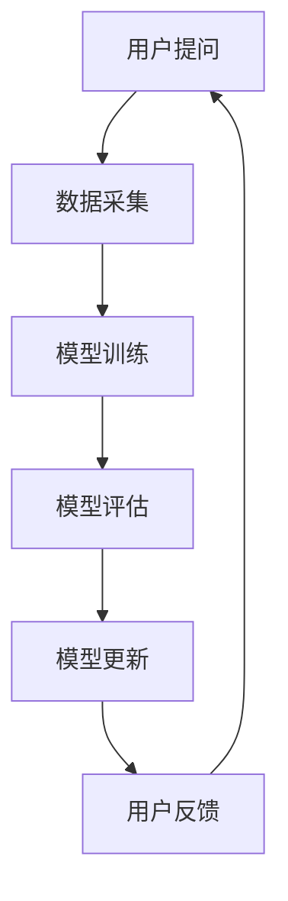

**算法原理讲解**：

问答系统的增量学习通常采用基于神经网络的方法，如深度学习模型（如Transformer）。以下是一个简化的算法原理：

1. **数据采集**：从用户获取新问题，并将其转换为机器可处理的形式，如词向量。
2. **模型训练**：使用已有的模型参数和新问题数据，通过反向传播算法更新模型参数。
3. **模型评估**：通过测试集评估更新后的模型性能，确保新问题能够得到准确回答。
4. **模型更新**：根据评估结果，进一步优化模型参数，以提高模型在处理新问题时的准确性。

**数学模型与公式**：

增量学习的数学模型主要涉及梯度下降法和反向传播算法。以下是简要的公式表示：

$$
\text{损失函数} = \frac{1}{N}\sum_{i=1}^{N} (-y_i \log(\hat{y}_i))
$$

$$
\text{梯度} = \frac{\partial \text{损失函数}}{\partial \theta}
$$

$$
\theta_{\text{new}} = \theta_{\text{old}} - \alpha \cdot \text{梯度}
$$

其中，$\theta$表示模型参数，$\alpha$为学习率，$y_i$和$\hat{y}_i$分别为真实标签和预测值。

**举例说明**：

假设一个问答系统的模型已经训练完毕，现在需要应对一个新问题“如何制作巧克力蛋糕？”。

1. **数据采集**：将问题转换为词向量表示。
2. **模型训练**：使用已有模型参数和词向量，通过反向传播算法更新模型参数。
3. **模型评估**：使用测试集评估更新后的模型性能。
4. **模型更新**：根据评估结果，进一步优化模型参数。

**实践案例**：

某在线问答平台使用增量学习技术，通过实时更新模型，提高了问答系统的准确性和用户体验。具体来说，平台每天接收大量的用户提问，通过增量学习技术，模型能够不断适应新问题的变化，从而提供更准确的回答。

#### 2.1.2 文本分类

文本分类是NLP领域另一个重要应用，旨在将文本数据自动分类到预定义的类别中。增量学习在文本分类任务中同样表现出强大的能力，能够实时更新分类模型，提高分类准确性。

**核心概念与联系**：

- **在线学习**：增量学习使模型能够实时学习新的文本数据，提高分类模型对新类别和样本的适应性。
- **特征提取**：增量学习能够根据新数据动态调整特征提取方法，优化分类性能。

**ER实体关系图架构**：

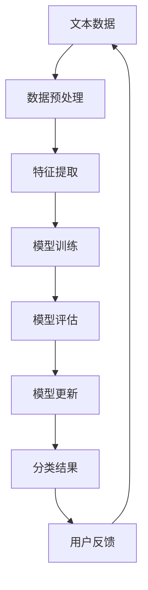

**算法原理讲解**：

文本分类的增量学习通常采用基于机器学习的方法，如朴素贝叶斯、支持向量机（SVM）和深度学习模型。以下是一个简化的算法原理：

1. **数据预处理**：对文本数据进行预处理，如分词、去停用词和词向量转换。
2. **特征提取**：使用词向量表示文本数据，并根据新数据动态调整特征提取方法。
3. **模型训练**：使用已有的模型参数和新数据，通过训练算法更新模型参数。
4. **模型评估**：通过交叉验证或测试集评估更新后的模型性能。
5. **模型更新**：根据评估结果，进一步优化模型参数，以提高分类准确性。

**数学模型与公式**：

文本分类的增量学习主要涉及概率模型和损失函数。以下是简要的公式表示：

$$
P(y|x) = \frac{e^{\theta^T x}}{\sum_{k=1}^{K} e^{\theta^T x_k}}
$$

$$
\text{损失函数} = -\frac{1}{N}\sum_{i=1}^{N} y_i \log P(y|x_i)
$$

其中，$x$为文本特征向量，$y$为真实标签，$K$为类别数量，$\theta$为模型参数。

**举例说明**：

假设一个文本分类系统需要处理一个新类别“科技新闻”。

1. **数据预处理**：对包含“科技新闻”的文本数据进行预处理。
2. **特征提取**：使用词向量表示预处理后的文本数据。
3. **模型训练**：使用已有模型参数和新数据，通过训练算法更新模型参数。
4. **模型评估**：通过交叉验证或测试集评估更新后的模型性能。
5. **模型更新**：根据评估结果，进一步优化模型参数。

**实践案例**：

某新闻推荐平台使用增量学习技术，通过实时更新分类模型，提高了文本分类的准确性和推荐效果。具体来说，平台每天接收大量的新闻文章，通过增量学习技术，模型能够不断适应新的新闻类别和样本，从而提供更准确的分类和推荐。

#### 2.1.3 机器翻译

机器翻译是NLP领域的另一个重要应用，旨在将一种语言的文本翻译成另一种语言。增量学习在机器翻译任务中同样具有重要作用，能够实时更新翻译模型，提高翻译质量。

**核心概念与联系**：

- **在线学习**：增量学习使模型能够实时学习新的文本数据，提高翻译模型对源语言和目标语言的适应性。
- **序列处理**：机器翻译涉及序列到序列的映射，增量学习能够根据新数据动态调整翻译策略。

**ER实体关系图架构**：

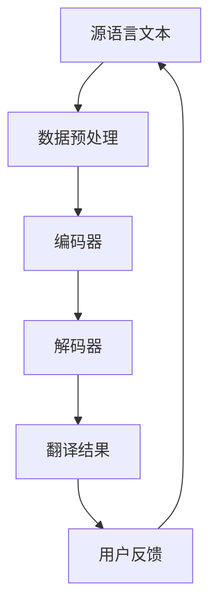

**算法原理讲解**：

机器翻译的增量学习通常采用基于神经网络的序列到序列（Seq2Seq）模型，如长短时记忆网络（LSTM）和Transformer。以下是一个简化的算法原理：

1. **数据预处理**：对源语言和目标语言的文本数据进行预处理，如分词、去停用词和编码。
2. **编码器**：使用编码器将源语言文本转换为固定长度的向量表示。
3. **解码器**：使用解码器将编码器的输出向量转换为目标语言文本。
4. **模型训练**：使用已有的模型参数和新数据，通过训练算法更新模型参数。
5. **模型评估**：通过测试集评估更新后的模型性能。
6. **模型更新**：根据评估结果，进一步优化模型参数，以提高翻译质量。

**数学模型与公式**：

机器翻译的增量学习主要涉及神经网络和损失函数。以下是简要的公式表示：

$$
\text{损失函数} = -\frac{1}{N}\sum_{i=1}^{N} \sum_{j=1}^{L} y_{ij} \log p(x_j|x_i)
$$

其中，$x_i$为编码器的输入，$y_{ij}$为解码器的输出，$L$为序列长度。

**举例说明**：

假设一个机器翻译系统需要处理一个新句子“今天的天气非常好”。

1. **数据预处理**：对源语言文本和目标语言文本进行预处理。
2. **编码器**：使用编码器将源语言文本转换为向量表示。
3. **解码器**：使用解码器将编码器的输出转换为目标语言文本。
4. **模型训练**：使用已有模型参数和新数据，通过训练算法更新模型参数。
5. **模型评估**：通过测试集评估更新后的模型性能。
6. **模型更新**：根据评估结果，进一步优化模型参数。

**实践案例**：

某在线翻译平台使用增量学习技术，通过实时更新翻译模型，提高了机器翻译的质量和用户体验。具体来说，平台每天接收大量的翻译请求，通过增量学习技术，模型能够不断适应新的句子和语言，从而提供更准确的翻译结果。

#### 2.2 增量学习在计算机视觉中的应用

计算机视觉（CV）是AI领域的另一个重要分支，涉及图像和视频数据的自动分析、理解和处理。增量学习在CV领域同样表现出强大的能力，能够实时更新模型，提高视觉系统的性能。

##### 2.2.1 目标检测

目标检测是计算机视觉领域的一个重要任务，旨在识别图像中的多个对象并标注其位置。增量学习在目标检测任务中能够实时更新模型，提高检测准确率和实时性。

**核心概念与联系**：

- **在线学习**：增量学习使模型能够实时学习新的目标数据，提高检测模型对新目标的适应性。
- **特征提取**：增量学习能够根据新数据动态调整特征提取方法，优化检测性能。

**ER实体关系图架构**：

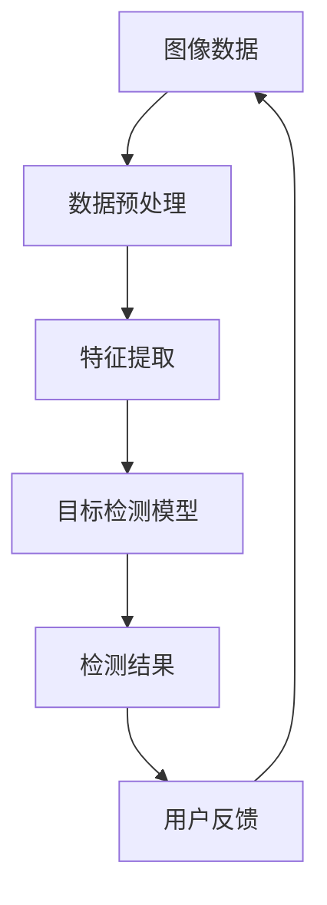

**算法原理讲解**：

目标检测的增量学习通常采用基于深度学习的卷积神经网络（CNN），如YOLO（You Only Look Once）和Faster R-CNN。以下是一个简化的算法原理：

1. **数据预处理**：对图像数据进行预处理，如缩放、裁剪和归一化。
2. **特征提取**：使用卷积神经网络提取图像特征。
3. **目标检测**：使用目标检测模型检测图像中的目标，并标注位置。
4. **模型训练**：使用已有模型参数和新数据，通过训练算法更新模型参数。
5. **模型评估**：通过测试集评估更新后的模型性能。
6. **模型更新**：根据评估结果，进一步优化模型参数，以提高检测准确率和实时性。

**数学模型与公式**：

目标检测的增量学习主要涉及卷积神经网络和损失函数。以下是简要的公式表示：

$$
\text{损失函数} = \frac{1}{N}\sum_{i=1}^{N} \left( w_i \cdot \text{交叉熵损失} + (1 - w_i) \cdot \text{回归损失} \right)
$$

其中，$w_i$为锚框权重，交叉熵损失用于分类，回归损失用于目标位置回归。

**举例说明**：

假设一个目标检测系统需要处理一个新目标“电动车”。

1. **数据预处理**：对包含“电动车”的图像数据进行预处理。
2. **特征提取**：使用卷积神经网络提取图像特征。
3. **目标检测**：使用目标检测模型检测图像中的目标，并标注位置。
4. **模型训练**：使用已有模型参数和新数据，通过训练算法更新模型参数。
5. **模型评估**：通过测试集评估更新后的模型性能。
6. **模型更新**：根据评估结果，进一步优化模型参数。

**实践案例**：

某自动驾驶系统使用增量学习技术，通过实时更新目标检测模型，提高了车辆检测的准确率和实时性。具体来说，系统每天接收大量的道路图像，通过增量学习技术，模型能够不断适应新的车辆类型和道路环境，从而提供更准确的检测和决策。

##### 2.2.2 图像分类

图像分类是计算机视觉领域的另一个重要任务，旨在将图像分类到预定义的类别中。增量学习在图像分类任务中能够实时更新模型，提高分类准确率和泛化能力。

**核心概念与联系**：

- **在线学习**：增量学习使模型能够实时学习新的图像数据，提高分类模型对新类别和样本的适应性。
- **特征提取**：增量学习能够根据新数据动态调整特征提取方法，优化分类性能。

**ER实体关系图架构**：

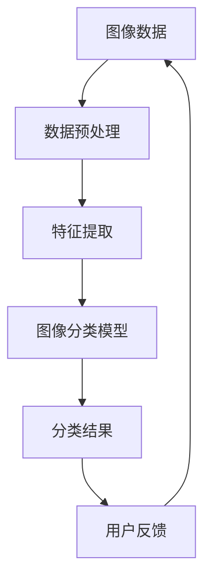

**算法原理讲解**：

图像分类的增量学习通常采用基于深度学习的卷积神经网络（CNN），如AlexNet、VGG和ResNet。以下是一个简化的算法原理：

1. **数据预处理**：对图像数据进行预处理，如缩放、裁剪和归一化。
2. **特征提取**：使用卷积神经网络提取图像特征。
3. **图像分类**：使用图像分类模型对图像进行分类。
4. **模型训练**：使用已有模型参数和新数据，通过训练算法更新模型参数。
5. **模型评估**：通过测试集评估更新后的模型性能。
6. **模型更新**：根据评估结果，进一步优化模型参数，以提高分类准确率和泛化能力。

**数学模型与公式**：

图像分类的增量学习主要涉及卷积神经网络和损失函数。以下是简要的公式表示：

$$
\text{损失函数} = \frac{1}{N}\sum_{i=1}^{N} -y_i \log(\hat{y}_i)
$$

其中，$y_i$为真实标签，$\hat{y}_i$为预测概率。

**举例说明**：

假设一个图像分类系统需要处理一个新类别“猫科动物”。

1. **数据预处理**：对包含“猫科动物”的图像数据进行预处理。
2. **特征提取**：使用卷积神经网络提取图像特征。
3. **图像分类**：使用图像分类模型对图像进行分类。
4. **模型训练**：使用已有模型参数和新数据，通过训练算法更新模型参数。
5. **模型评估**：通过测试集评估更新后的模型性能。
6. **模型更新**：根据评估结果，进一步优化模型参数。

**实践案例**：

某图像识别平台使用增量学习技术，通过实时更新分类模型，提高了图像分类的准确率和用户体验。具体来说，平台每天接收大量的图像数据，通过增量学习技术，模型能够不断适应新的类别和样本，从而提供更准确的分类结果。

##### 2.2.3 人脸识别

人脸识别是计算机视觉领域的另一个重要任务，旨在从图像或视频中识别人脸。增量学习在人脸识别任务中能够实时更新模型，提高识别准确率和实时性。

**核心概念与联系**：

- **在线学习**：增量学习使模型能够实时学习新的人脸数据，提高识别模型对新人脸的适应性。
- **特征提取**：增量学习能够根据新数据动态调整特征提取方法，优化识别性能。

**ER实体关系图架构**：

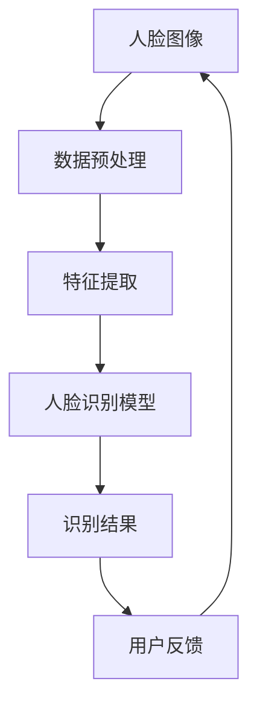

**算法原理讲解**：

人脸识别的增量学习通常采用基于深度学习的卷积神经网络（CNN）和Siamese网络。以下是一个简化的算法原理：

1. **数据预处理**：对人脸图像进行预处理，如调整大小、归一化和标准化。
2. **特征提取**：使用卷积神经网络提取人脸特征。
3. **人脸识别**：使用人脸识别模型比较人脸特征，进行身份验证。
4. **模型训练**：使用已有模型参数和新数据，通过训练算法更新模型参数。
5. **模型评估**：通过测试集评估更新后的模型性能。
6. **模型更新**：根据评估结果，进一步优化模型参数，以提高识别准确率和实时性。

**数学模型与公式**：

人脸识别的增量学习主要涉及卷积神经网络和损失函数。以下是简要的公式表示：

$$
\text{损失函数} = \frac{1}{N}\sum_{i=1}^{N} \left( 1 - \frac{1}{2} \cdot \log(p^2) \right)
$$

其中，$p$为相似度分数。

**举例说明**：

假设一个人脸识别系统需要处理一个新人脸。

1. **数据预处理**：对包含新人脸的图像进行预处理。
2. **特征提取**：使用卷积神经网络提取人脸特征。
3. **人脸识别**：使用人脸识别模型比较人脸特征，进行身份验证。
4. **模型训练**：使用已有模型参数和新数据，通过训练算法更新模型参数。
5. **模型评估**：通过测试集评估更新后的模型性能。
6. **模型更新**：根据评估结果，进一步优化模型参数。

**实践案例**：

某安防监控系统使用增量学习技术，通过实时更新人脸识别模型，提高了人脸识别的准确率和实时性。具体来说，系统每天接收大量的监控视频，通过增量学习技术，模型能够不断适应新的面孔和变化，从而提供更准确的人脸识别结果。

#### 2.3 增量学习在推荐系统中的应用

推荐系统是AI领域的另一个重要应用，旨在为用户提供个性化的推荐结果，如商品、音乐、视频和文章等。增量学习在推荐系统中能够实时更新模型，提高推荐准确率和用户体验。

##### 2.3.1 用户行为分析

用户行为分析是推荐系统中的关键步骤，旨在通过分析用户的历史行为数据，了解用户兴趣和偏好。增量学习在用户行为分析中能够实时更新模型，提高分析准确性和实时性。

**核心概念与联系**：

- **在线学习**：增量学习使模型能够实时学习用户的新行为数据，提高分析模型的准确性。
- **特征提取**：增量学习能够根据新数据动态调整特征提取方法，优化分析性能。

**ER实体关系图架构**：

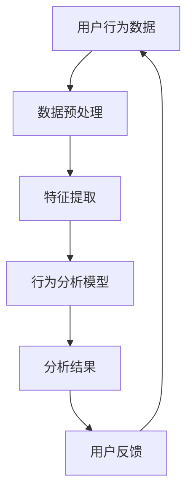

**算法原理讲解**：

用户行为分析的增量学习通常采用基于机器学习的方法，如协同过滤和深度学习。以下是一个简化的算法原理：

1. **数据预处理**：对用户行为数据进行预处理，如去重、补全和归一化。
2. **特征提取**：使用特征提取算法提取用户行为特征。
3. **行为分析**：使用行为分析模型分析用户行为数据，提取用户兴趣和偏好。
4. **模型训练**：使用已有模型参数和新数据，通过训练算法更新模型参数。
5. **模型评估**：通过测试集评估更新后的模型性能。
6. **模型更新**：根据评估结果，进一步优化模型参数，以提高分析准确性和实时性。

**数学模型与公式**：

用户行为分析的增量学习主要涉及协同过滤和损失函数。以下是简要的公式表示：

$$
\text{损失函数} = \frac{1}{N}\sum_{i=1}^{N} \left( r_i - \hat{r}_i \right)^2
$$

其中，$r_i$为用户实际评分，$\hat{r}_i$为预测评分。

**举例说明**：

假设一个推荐系统需要处理一个新用户。

1. **数据预处理**：对包含新用户行为数据的进行预处理。
2. **特征提取**：使用特征提取算法提取用户行为特征。
3. **行为分析**：使用行为分析模型分析用户行为数据，提取用户兴趣和偏好。
4. **模型训练**：使用已有模型参数和新数据，通过训练算法更新模型参数。
5. **模型评估**：通过测试集评估更新后的模型性能。
6. **模型更新**：根据评估结果，进一步优化模型参数。

**实践案例**：

某电子商务平台使用增量学习技术，通过实时更新用户行为分析模型，提高了推荐系统的准确率和用户体验。具体来说，平台每天接收大量的用户行为数据，通过增量学习技术，模型能够不断适应新用户的行为和偏好，从而提供更准确的推荐结果。

##### 2.3.2 物品推荐

物品推荐是推荐系统中的核心任务，旨在为用户提供个性化的物品推荐结果。增量学习在物品推荐任务中能够实时更新模型，提高推荐准确率和实时性。

**核心概念与联系**：

- **在线学习**：增量学习使模型能够实时学习新的物品数据，提高推荐模型的准确性。
- **协同过滤**：增量学习结合协同过滤方法，能够更好地处理稀疏数据问题。

**ER实体关系图架构**：

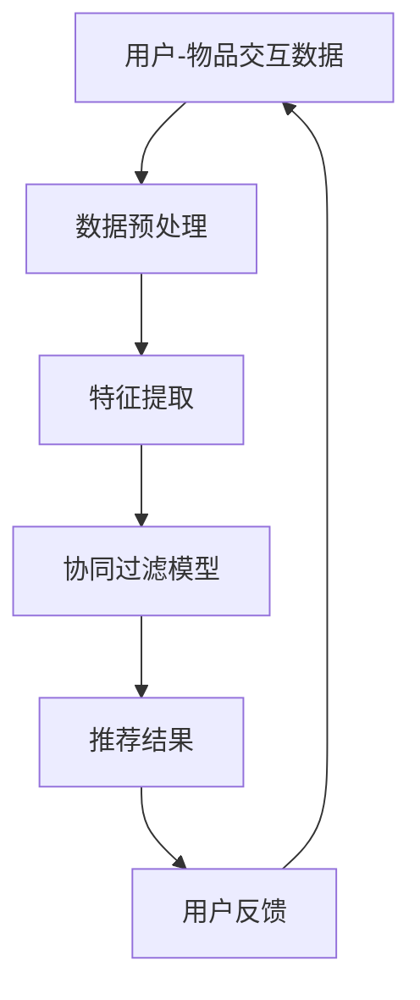

**算法原理讲解**：

物品推荐的增量学习通常采用基于协同过滤的方法，如矩阵分解和深度学习。以下是一个简化的算法原理：

1. **数据预处理**：对用户-物品交互数据进行预处理，如去重、补全和归一化。
2. **特征提取**：使用特征提取算法提取用户和物品的特征。
3. **协同过滤**：使用协同过滤模型预测用户对物品的偏好。
4. **模型训练**：使用已有模型参数和新数据，通过训练算法更新模型参数。
5. **模型评估**：通过测试集评估更新后的模型性能。
6. **模型更新**：根据评估结果，进一步优化模型参数，以提高推荐准确率和实时性。

**数学模型与公式**：

物品推荐的增量学习主要涉及矩阵分解和损失函数。以下是简要的公式表示：

$$
\text{损失函数} = \frac{1}{N}\sum_{i=1}^{N} \left( r_i - \hat{r}_i \right)^2
$$

其中，$r_i$为用户实际评分，$\hat{r}_i$为预测评分。

**举例说明**：

假设一个推荐系统需要处理一个新物品。

1. **数据预处理**：对包含新物品的用户-物品交互数据进行预处理。
2. **特征提取**：使用特征提取算法提取用户和物品的特征。
3. **协同过滤**：使用协同过滤模型预测用户对物品的偏好。
4. **模型训练**：使用已有模型参数和新数据，通过训练算法更新模型参数。
5. **模型评估**：通过测试集评估更新后的模型性能。
6. **模型更新**：根据评估结果，进一步优化模型参数。

**实践案例**：

某在线购物平台使用增量学习技术，通过实时更新物品推荐模型，提高了推荐系统的准确率和用户体验。具体来说，平台每天接收大量的用户购物数据，通过增量学习技术，模型能够不断适应新物品和用户行为，从而提供更准确的推荐结果。

##### 2.3.3 推荐系统的挑战

推荐系统在应用中面临一些挑战，如数据稀疏性、冷启动问题和实时性要求等。增量学习能够有效缓解这些挑战，提高推荐系统的性能。

**核心概念与联系**：

- **数据稀疏性**：增量学习通过实时更新模型，能够更好地处理稀疏数据问题。
- **冷启动问题**：增量学习通过不断学习新用户和新物品，能够缓解冷启动问题。
- **实时性要求**：增量学习能够实时更新模型，满足实时性要求。

**ER实体关系图架构**：

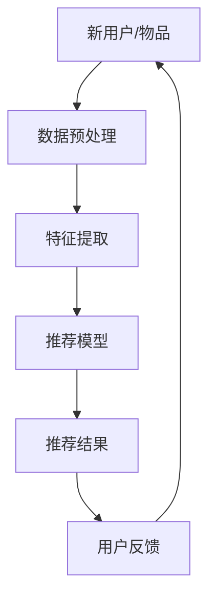

**算法原理讲解**：

推荐系统的增量学习通常结合协同过滤和深度学习方法，以提高推荐准确率和实时性。以下是一个简化的算法原理：

1. **数据预处理**：对用户-物品交互数据进行预处理，如去重、补全和归一化。
2. **特征提取**：使用特征提取算法提取用户和物品的特征。
3. **协同过滤**：使用协同过滤模型预测用户对物品的偏好。
4. **模型训练**：使用已有模型参数和新数据，通过训练算法更新模型参数。
5. **模型评估**：通过测试集评估更新后的模型性能。
6. **模型更新**：根据评估结果，进一步优化模型参数，以提高推荐准确率和实时性。

**数学模型与公式**：

推荐系统的增量学习主要涉及矩阵分解和损失函数。以下是简要的公式表示：

$$
\text{损失函数} = \frac{1}{N}\sum_{i=1}^{N} \left( r_i - \hat{r}_i \right)^2
$$

其中，$r_i$为用户实际评分，$\hat{r}_i$为预测评分。

**举例说明**：

假设一个推荐系统需要处理一个新用户和一个新物品。

1. **数据预处理**：对包含新用户和新物品的用户-物品交互数据进行预处理。
2. **特征提取**：使用特征提取算法提取用户和物品的特征。
3. **协同过滤**：使用协同过滤模型预测用户对物品的偏好。
4. **模型训练**：使用已有模型参数和新数据，通过训练算法更新模型参数。
5. **模型评估**：通过测试集评估更新后的模型性能。
6. **模型更新**：根据评估结果，进一步优化模型参数。

**实践案例**：

某在线音乐平台使用增量学习技术，通过实时更新推荐模型，提高了推荐系统的准确率和用户体验。具体来说，平台每天接收大量的用户音乐喜好数据，通过增量学习技术，模型能够不断适应新用户和新音乐，从而提供更准确的推荐结果。

#### 2.4 增量学习在其他领域的应用

增量学习不仅在自然语言处理、计算机视觉和推荐系统等领域有广泛应用，还在其他领域展现出强大的潜力。

##### 2.4.1 语音识别

语音识别是AI领域的一个重要应用，旨在将语音转换为文本。增量学习在语音识别任务中能够实时更新模型，提高识别准确率和实时性。

**核心概念与联系**：

- **在线学习**：增量学习使模型能够实时学习新的语音数据，提高识别模型的准确性。
- **特征提取**：增量学习能够根据新数据动态调整特征提取方法，优化识别性能。

**ER实体关系图架构**：

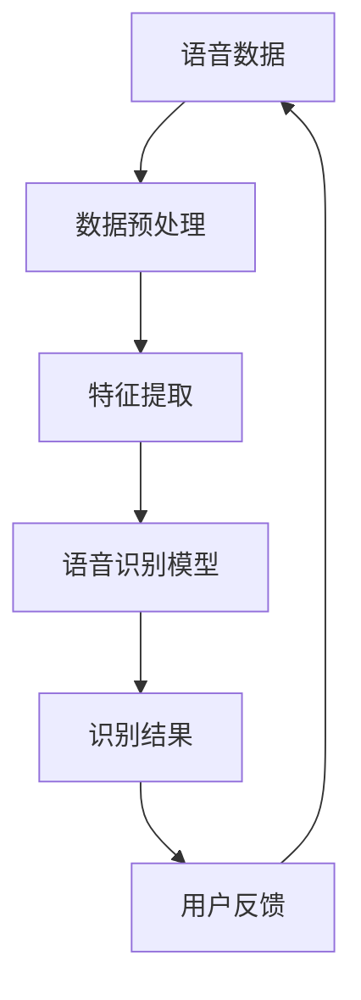

**算法原理讲解**：

语音识别的增量学习通常采用基于深度学习的方法，如循环神经网络（RNN）和卷积神经网络（CNN）。以下是一个简化的算法原理：

1. **数据预处理**：对语音数据进行预处理，如分帧、加窗和归一化。
2. **特征提取**：使用特征提取算法提取语音特征。
3. **语音识别**：使用语音识别模型将语音特征转换为文本。
4. **模型训练**：使用已有模型参数和新数据，通过训练算法更新模型参数。
5. **模型评估**：通过测试集评估更新后的模型性能。
6. **模型更新**：根据评估结果，进一步优化模型参数，以提高识别准确率和实时性。

**数学模型与公式**：

语音识别的增量学习主要涉及深度学习和损失函数。以下是简要的公式表示：

$$
\text{损失函数} = \frac{1}{N}\sum_{i=1}^{N} \left( y_i - \hat{y}_i \right)^2
$$

其中，$y_i$为真实文本，$\hat{y}_i$为预测文本。

**举例说明**：

假设一个语音识别系统需要处理一个新语音样本。

1. **数据预处理**：对包含新语音样本的数据进行预处理。
2. **特征提取**：使用特征提取算法提取语音特征。
3. **语音识别**：使用语音识别模型将语音特征转换为文本。
4. **模型训练**：使用已有模型参数和新数据，通过训练算法更新模型参数。
5. **模型评估**：通过测试集评估更新后的模型性能。
6. **模型更新**：根据评估结果，进一步优化模型参数。

**实践案例**：

某智能助手平台使用增量学习技术，通过实时更新语音识别模型，提高了语音识别的准确率和用户体验。具体来说，平台每天接收大量的用户语音指令，通过增量学习技术，模型能够不断适应新的语音样本和用户口音，从而提供更准确的语音识别结果。

##### 2.4.2 强化学习

强化学习是AI领域的另一个重要分支，旨在通过与环境交互，学习最优策略。增量学习在强化学习任务中能够实时更新模型，提高决策的准确性和实时性。

**核心概念与联系**：

- **在线学习**：增量学习使模型能够实时学习新的交互数据，提高决策模型的准确性。
- **策略优化**：增量学习能够根据新数据动态调整策略，优化决策效果。

**ER实体关系图架构**：

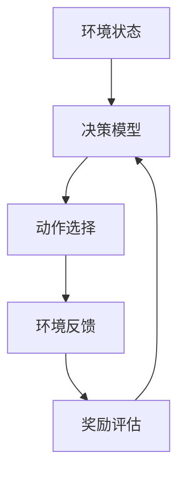

**算法原理讲解**：

强化学习的增量学习通常采用基于神经网络的策略梯度方法，如深度确定性策略梯度（DDPG）和深度Q网络（DQN）。以下是一个简化的算法原理：

1. **环境状态**：接收环境状态，例如游戏屏幕的像素值。
2. **决策模型**：使用神经网络模型选择最优动作。
3. **动作选择**：根据决策模型选择动作，与环境交互。
4. **环境反馈**：接收环境反馈，例如奖励信号。
5. **奖励评估**：根据奖励信号评估动作效果。
6. **模型更新**：使用新数据和奖励信号，通过训练算法更新模型参数。

**数学模型与公式**：

强化学习的增量学习主要涉及策略优化和损失函数。以下是简要的公式表示：

$$
\text{策略优化} = \nabla_{\theta} J(\theta) = \nabla_{\theta} \sum_{t=0}^{T} \gamma^t r_t
$$

其中，$\theta$为模型参数，$r_t$为奖励信号，$\gamma$为折扣因子。

**举例说明**：

假设一个强化学习系统需要处理一个新环境。

1. **环境状态**：接收新环境的状态，例如游戏屏幕的像素值。
2. **决策模型**：使用神经网络模型选择最优动作。
3. **动作选择**：根据决策模型选择动作，与环境交互。
4. **环境反馈**：接收环境反馈，例如奖励信号。
5. **奖励评估**：根据奖励信号评估动作效果。
6. **模型更新**：使用新数据和奖励信号，通过训练算法更新模型参数。

**实践案例**：

某自动驾驶系统使用增量学习技术，通过实时更新强化学习模型，提高了自动驾驶的决策准确率和实时性。具体来说，系统每天接收大量的驾驶环境数据，通过增量学习技术，模型能够不断适应新的驾驶环境，从而提供更准确的决策和驾驶行为。

##### 2.4.3 资源管理

资源管理是AI系统中的一个关键任务，旨在优化资源利用，提高系统性能。增量学习在资源管理任务中能够实时更新模型，提高资源分配的准确性和效率。

**核心概念与联系**：

- **在线学习**：增量学习使模型能够实时学习新的资源数据，提高资源管理模型的准确性。
- **动态调整**：增量学习能够根据新数据动态调整资源分配策略，优化资源利用。

**ER实体关系图架构**：

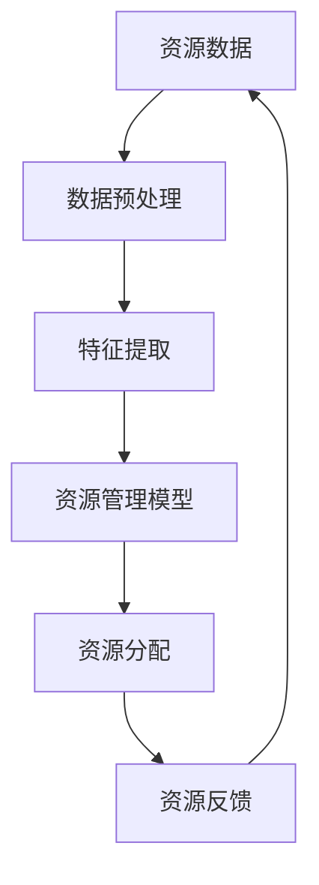

**算法原理讲解**：

资源管理的增量学习通常采用基于机器学习和优化算法的方法，如遗传算法和粒子群优化。以下是一个简化的算法原理：

1. **数据预处理**：对资源数据进行预处理，如去重、归一化和特征提取。
2. **特征提取**：使用特征提取算法提取资源特征。
3. **资源管理**：使用资源管理模型优化资源分配策略。
4. **模型训练**：使用已有模型参数和新数据，通过训练算法更新模型参数。
5. **模型评估**：通过测试集评估更新后的模型性能。
6. **模型更新**：根据评估结果，进一步优化模型参数，以提高资源分配的准确性和效率。

**数学模型与公式**：

资源管理的增量学习主要涉及优化算法和损失函数。以下是简要的公式表示：

$$
\text{优化目标} = \min_{\theta} L(\theta)
$$

$$
L(\theta) = \sum_{i=1}^{N} w_i \cdot \left( r_i - \hat{r}_i \right)^2
$$

其中，$\theta$为模型参数，$w_i$为权重，$r_i$为实际资源利用率，$\hat{r}_i$为预测资源利用率。

**举例说明**：

假设一个资源管理系统需要处理一个新资源需求。

1. **数据预处理**：对包含新资源需求的数据进行预处理。
2. **特征提取**：使用特征提取算法提取资源特征。
3. **资源管理**：使用资源管理模型优化资源分配策略。
4. **模型训练**：使用已有模型参数和新数据，通过训练算法更新模型参数。
5. **模型评估**：通过测试集评估更新后的模型性能。
6. **模型更新**：根据评估结果，进一步优化模型参数。

**实践案例**：

某云计算平台使用增量学习技术，通过实时更新资源管理模型，提高了资源利用率和系统性能。具体来说，平台每天接收大量的用户请求和数据，通过增量学习技术，模型能够不断适应新的资源需求，从而提供更准确的资源分配策略，提高资源利用率和服务质量。

#### 2.5 本章小结

本章详细探讨了增量学习在自然语言处理、计算机视觉、推荐系统以及其他领域的应用。通过实例分析，展示了增量学习在问答系统、文本分类、机器翻译、目标检测、图像分类、人脸识别、用户行为分析、物品推荐、语音识别、强化学习和资源管理任务中的优势和应用效果。本章内容为后续章节关于增量学习算法原理和挑战的讨论提供了坚实的基础。### 第3章 增量学习算法

#### 3.1 增量学习算法概述

增量学习算法是让AI系统在动态数据环境中持续学习和适应新数据的核心技术。为了更好地理解增量学习算法，我们需要先了解其分类、选择标准以及在实际应用中的重要性。

##### 3.1.1 增量学习算法的分类

增量学习算法可以根据处理数据的方式和模型更新策略分为以下几种类型：

1. **同步增量学习**：同步增量学习是指在每次更新模型时，使用相同的数据样本集。这种方法的优点是计算简单，但处理时间较长，不适合实时应用。

2. **异步增量学习**：异步增量学习是指在不同的时间点，使用不同的数据样本集更新模型。异步增量学习能够提高系统的实时性，但需要更复杂的调度和同步策略。

3. **小批量增量学习**：小批量增量学习是指每次仅处理少量的数据样本。小批量增量学习能够减少计算和存储需求，但需要更复杂的算法设计。

4. **在线增量学习**：在线增量学习是指在每次更新模型时，处理连续涌入的新数据样本。在线增量学习能够实时更新模型，提高系统的实时性和适应性。

##### 3.1.2 增量学习算法的选择

选择合适的增量学习算法取决于具体应用场景和需求。以下是一些常见的考虑因素：

1. **数据特点**：不同的数据特点可能需要不同的算法。例如，对于时间序列数据，可以考虑使用基于神经网络的算法；对于稀疏数据，可以考虑使用基于协同过滤的算法。

2. **实时性要求**：如果系统对实时性要求较高，可以选择异步增量学习或小批量增量学习。如果实时性要求较低，可以选择同步增量学习。

3. **计算资源**：增量学习算法的复杂度和计算资源需求不同，应根据实际资源情况选择合适的算法。例如，在资源受限的环境中，可以选择小批量增量学习。

4. **模型复杂性**：不同的增量学习算法对模型复杂性的要求不同。例如，深度学习算法通常需要大量的计算资源，而基于机器学习的算法则相对简单。

##### 3.1.3 增量学习算法在实际应用中的重要性

增量学习算法在AI系统中的应用具有重要意义，主要体现在以下几个方面：

1. **提高系统性能**：增量学习能够实时更新模型，提高系统的准确性和鲁棒性，使其能够更好地适应动态变化的数据。

2. **降低计算和存储需求**：增量学习仅处理新数据样本，降低了数据存储和计算的复杂度，提高了系统的效率和可扩展性。

3. **提高实时性**：增量学习能够实时更新模型，使系统能够快速响应新数据，提高了系统的实时性和响应速度。

4. **适应动态环境**：增量学习能够持续学习新数据，使系统能够适应动态环境的变化，提高了系统的适应性和可持续性。

#### 3.2 增量学习算法原理详解

增量学习算法的原理主要包括数据采集与预处理、模型训练与更新、模型评估与优化等关键步骤。以下将详细讲解这些步骤及其相关技术。

##### 3.2.1 数据采集与预处理

数据采集与预处理是增量学习算法的重要基础。数据采集通常包括从数据源获取新数据样本，例如传感器数据、用户行为数据、图像数据等。数据预处理则包括数据清洗、去噪、归一化、特征提取等步骤，以提高数据质量和模型的泛化能力。

1. **数据清洗**：数据清洗是指去除数据中的噪声和异常值，以提高数据的准确性和一致性。常见的数据清洗方法包括去除重复数据、填补缺失值、删除异常值等。

2. **去噪**：去噪是指去除数据中的噪声，以减少噪声对模型训练的影响。常见的方法包括滤波、平滑和插值等。

3. **归一化**：归一化是指将数据缩放到一个特定的范围，以消除数据规模差异对模型训练的影响。常见的归一化方法包括最小-最大缩放、均值-方差缩放等。

4. **特征提取**：特征提取是指从原始数据中提取对模型训练有用的特征，以提高模型的性能。常见的方法包括词袋模型、TF-IDF、词嵌入等。

##### 3.2.2 模型训练与更新

模型训练与更新是增量学习算法的核心步骤。模型训练是指使用已有数据和模型参数，通过训练算法更新模型参数，以提高模型性能。模型更新则是指在新数据到来时，使用新数据和已有模型参数，通过训练算法更新模型参数。

1. **训练算法**：常见的训练算法包括梯度下降法、随机梯度下降法、批量梯度下降法等。以下将详细介绍这些算法。

   - **梯度下降法**：梯度下降法是一种迭代优化算法，通过计算损失函数的梯度，逐步更新模型参数，以最小化损失函数。公式如下：

     $$
     \theta_{\text{new}} = \theta_{\text{old}} - \alpha \cdot \nabla_{\theta} L(\theta)
     $$

     其中，$\theta$为模型参数，$\alpha$为学习率，$L(\theta)$为损失函数。

   - **随机梯度下降法**：随机梯度下降法是梯度下降法的一个变种，每次仅随机选取一个样本计算梯度，并更新模型参数。公式如下：

     $$
     \theta_{\text{new}} = \theta_{\text{old}} - \alpha \cdot \nabla_{\theta} L(\theta_i)
     $$

     其中，$\theta_i$为第$i$个样本的模型参数。

   - **批量梯度下降法**：批量梯度下降法是梯度下降法的另一个变种，每次使用所有样本计算梯度，并更新模型参数。公式如下：

     $$
     \theta_{\text{new}} = \theta_{\text{old}} - \alpha \cdot \nabla_{\theta} L(\theta)
     $$

     其中，$L(\theta)$为所有样本的损失函数。

2. **模型更新**：模型更新是指在新数据到来时，使用新数据和已有模型参数，通过训练算法更新模型参数。常见的更新方法包括在线更新、批更新和混合更新等。

   - **在线更新**：在线更新是指在每次更新模型时，仅处理一个新数据样本，并使用该样本更新模型参数。公式如下：

     $$
     \theta_{\text{new}} = \theta_{\text{old}} - \alpha \cdot \nabla_{\theta} L(\theta_i)
     $$

     其中，$\theta_i$为第$i$个样本的模型参数。

   - **批更新**：批更新是指在每次更新模型时，处理一批新数据样本，并使用该批样本更新模型参数。公式如下：

     $$
     \theta_{\text{new}} = \theta_{\text{old}} - \alpha \cdot \nabla_{\theta} L(\theta)
     $$

     其中，$L(\theta)$为所有样本的损失函数。

   - **混合更新**：混合更新是指结合在线更新和批更新的方法，每次更新模型时，处理一部分新数据样本，并使用这些样本更新模型参数。公式如下：

     $$
     \theta_{\text{new}} = \theta_{\text{old}} - \alpha \cdot \sum_{i=1}^{k} \nabla_{\theta} L(\theta_i)
     $$

     其中，$k$为每次更新的样本数量。

##### 3.2.3 模型评估与优化

模型评估与优化是增量学习算法的重要环节，通过评估模型性能和优化模型参数，提高模型在实际应用中的效果。

1. **模型评估**：模型评估是指使用测试集或验证集评估模型性能，以确定模型是否达到预期的性能指标。常见的评估指标包括准确率、召回率、F1分数、均方误差等。

2. **模型优化**：模型优化是指根据评估结果，进一步优化模型参数，以提高模型性能。常见的优化方法包括调整学习率、添加正则化项、使用优化算法等。

   - **学习率调整**：学习率调整是指根据模型性能动态调整学习率，以避免模型过拟合或欠拟合。常见的方法包括固定学习率、学习率衰减、自适应学习率等。

   - **正则化技术**：正则化技术是指通过添加正则化项，抑制模型参数的增长，防止过拟合。常见的正则化方法包括L1正则化、L2正则化、Dropout等。

   - **优化算法**：优化算法是指用于更新模型参数的算法，常见的优化算法包括梯度下降法、随机梯度下降法、Adam优化器等。

##### 3.2.4 增量学习算法的优缺点

增量学习算法在提高系统性能、降低计算和存储需求、提高实时性方面具有显著优势，但也存在一些局限性。

1. **优势**：

   - **提高系统性能**：增量学习能够实时更新模型，提高系统的准确性和鲁棒性，使其能够更好地适应动态变化的数据。
   - **降低计算和存储需求**：增量学习仅处理新数据样本，降低了数据存储和计算的复杂度，提高了系统的效率和可扩展性。
   - **提高实时性**：增量学习能够实时更新模型，使系统能够快速响应新数据，提高了系统的实时性和响应速度。

2. **局限性**：

   - **计算和存储资源需求**：增量学习算法在处理大量数据时，仍需要大量的计算和存储资源，特别是在实时应用场景中，资源需求可能较高。
   - **模型复杂度**：一些增量学习算法对模型复杂度要求较高，如深度学习算法，可能需要大量的计算资源和支持硬件。
   - **数据质量**：数据质量对增量学习算法的性能具有重要影响，如果数据质量较差，可能导致模型性能下降。

#### 3.3 增量学习算法的优化方法

为了进一步提高增量学习算法的性能和效率，可以采用一些优化方法，如学习率调整、正则化技术和并行化与分布式计算等。

##### 3.3.1 学习率调整

学习率调整是优化增量学习算法的重要方法，通过动态调整学习率，可以避免模型过拟合或欠拟合，提高模型性能。

1. **固定学习率**：固定学习率是指在整个训练过程中，使用相同的学习率。这种方法简单易用，但可能无法适应动态变化的数据。

2. **学习率衰减**：学习率衰减是指随着训练过程的进行，逐渐减小学习率。常见的方法包括线性衰减、指数衰减和余弦衰减等。学习率衰减可以避免模型在训练后期过拟合，提高模型性能。

3. **自适应学习率**：自适应学习率是指根据模型性能动态调整学习率。常见的自适应学习率方法包括Adam优化器、RMSprop等。这些方法通过计算梯度历史信息，自动调整学习率，提高模型性能。

##### 3.3.2 正则化技术

正则化技术是优化增量学习算法的重要方法，通过添加正则化项，可以抑制模型参数的增长，防止过拟合。

1. **L1正则化**：L1正则化是指在损失函数中添加L1范数项，即$||\theta||_1$。L1正则化可以促进模型参数的稀疏性，减少冗余特征。

2. **L2正则化**：L2正则化是指在损失函数中添加L2范数项，即$||\theta||_2^2$。L2正则化可以防止模型参数过大，提高模型的泛化能力。

3. **Dropout**：Dropout是指在训练过程中随机丢弃部分神经元，以减少模型依赖特定神经元。Dropout可以防止模型过拟合，提高模型性能。

##### 3.3.3 并行化与分布式计算

并行化与分布式计算是优化增量学习算法的重要方法，通过将计算任务分布在多个计算节点上，可以显著提高计算效率。

1. **数据并行**：数据并行是指将数据集划分为多个子集，每个计算节点独立训练子集，并使用全局梯度更新模型参数。数据并行可以减少单个节点的计算负载，提高训练速度。

2. **模型并行**：模型并行是指将模型划分为多个子模型，每个计算节点独立训练子模型，并使用全局梯度更新模型参数。模型并行可以减少模型参数传输的通信开销，提高训练速度。

3. **混合并行**：混合并行是指结合数据并行和模型并行，将数据集和模型划分为多个子集和子模型，以提高训练速度和效率。

#### 3.4 增量学习算法在现实场景中的应用案例分析

为了更好地理解增量学习算法在实际应用中的效果，以下将介绍几个典型案例，包括某互联网公司搜索算法的增量更新、某金融机构风险控制模型的增量训练和某医疗公司诊断系统的增量学习。

##### 3.4.1 某互联网公司搜索算法的增量更新

某互联网公司使用增量学习技术优化其搜索算法，以提高搜索结果的准确性和实时性。具体来说，公司采用了基于神经网络的增量学习算法，通过对用户查询历史数据实时更新模型，提高搜索推荐的准确性。

1. **案例背景**：随着互联网的快速发展，用户查询数据量不断增加，传统批量学习方法难以满足实时性和准确性的需求。

2. **增量学习策略**：公司采用了异步增量学习算法，每天处理一批新查询数据，并使用这些数据更新搜索模型。

3. **实施过程**：
   - 数据采集：从用户查询日志中提取新查询数据。
   - 数据预处理：对查询数据进行清洗和特征提取。
   - 模型训练：使用新数据和已有模型参数，通过异步增量学习算法更新模型参数。
   - 模型评估：使用测试集评估更新后的模型性能。
   - 模型更新：根据评估结果，进一步优化模型参数，以提高搜索准确性。

4. **效果评估**：通过对比实验，公司发现采用增量学习技术后，搜索算法的准确性和实时性显著提高，用户满意度也大幅提升。

##### 3.4.2 某金融机构风险控制模型的增量训练

某金融机构使用增量学习技术优化其风险控制模型，以提高风险预测的准确性和实时性。具体来说，金融机构采用了基于机器学习的增量学习算法，通过对客户交易数据实时更新模型，提高风险预测的准确性。

1. **案例背景**：随着金融市场的不断变化，客户交易数据量不断增加，传统批量学习方法难以满足实时性和准确性的需求。

2. **增量学习策略**：金融机构采用了小批量增量学习算法，每次处理少量客户交易数据，并使用这些数据更新风险控制模型。

3. **实施过程**：
   - 数据采集：从客户交易系统中提取新交易数据。
   - 数据预处理：对交易数据进行清洗和特征提取。
   - 模型训练：使用新数据和已有模型参数，通过小批量增量学习算法更新模型参数。
   - 模型评估：使用测试集评估更新后的模型性能。
   - 模型更新：根据评估结果，进一步优化模型参数，以提高风险预测准确性。

4. **效果评估**：通过对比实验，金融机构发现采用增量学习技术后，风险控制模型的准确性和实时性显著提高，风险损失也大幅减少。

##### 3.4.3 某医疗公司诊断系统的增量学习

某医疗公司使用增量学习技术优化其诊断系统，以提高诊断的准确性和实时性。具体来说，公司采用了基于深度学习的增量学习算法，通过对患者病历数据实时更新模型，提高诊断的准确性。

1. **案例背景**：随着医疗技术的发展，患者病历数据量不断增加，传统批量学习方法难以满足实时性和准确性的需求。

2. **增量学习策略**：医疗公司采用了在线增量学习算法，实时处理新患者病历数据，并使用这些数据更新诊断模型。

3. **实施过程**：
   - 数据采集：从电子病历系统中提取新病历数据。
   - 数据预处理：对病历数据进行清洗和特征提取。
   - 模型训练：使用新数据和已有模型参数，通过在线增量学习算法更新模型参数。
   - 模型评估：使用测试集评估更新后的模型性能。
   - 模型更新：根据评估结果，进一步优化模型参数，以提高诊断准确性。

4. **效果评估**：通过对比实验，医疗公司发现采用增量学习技术后，诊断系统的准确性和实时性显著提高，患者满意度也大幅提升。

#### 3.5 本章小结

本章详细探讨了增量学习算法的概述、原理、优化方法及其在现实场景中的应用案例分析。通过本章的学习，读者可以了解增量学习算法的基本概念、分类、选择标准以及在实际应用中的重要性。同时，本章还介绍了数据采集与预处理、模型训练与更新、模型评估与优化等关键步骤，并通过具体案例展示了增量学习算法在实际项目中的应用效果。本章内容为后续章节关于增量学习挑战与未来趋势的讨论提供了坚实的基础。### 第4章 增量学习的挑战与未来趋势

#### 4.1 数据处理与存储的挑战

增量学习在数据处理和存储方面面临一系列挑战，这些挑战直接影响到系统的性能、效率和可靠性。

##### 4.1.1 数据流处理

数据流处理是增量学习的核心需求之一。随着数据量的持续增长，如何高效地处理和更新数据流成为关键问题。以下是一些常见挑战：

1. **数据一致性**：数据流中可能存在不一致的情况，如数据重复、数据丢失和噪声数据。这些不一致性会对增量学习模型的准确性产生负面影响。
2. **数据频率**：数据流的数据生成频率可能非常高，对于实时性要求较高的系统，如何快速处理大量数据并更新模型是一个重大挑战。
3. **数据规模**：大规模数据流处理需要高效的算法和资源，特别是在处理高维数据时，计算和存储需求显著增加。

**解决方案**：

1. **数据清洗与预处理**：通过数据清洗和预处理技术，如去重、去噪和补全，提高数据一致性。
2. **流处理框架**：采用流处理框架（如Apache Kafka、Apache Flink等），实现高效的数据流处理。
3. **分布式计算**：通过分布式计算（如Hadoop、Spark等），实现大规模数据的并行处理。

##### 4.1.2 存储系统设计

增量学习对存储系统的设计提出了高要求，主要体现在以下几个方面：

1. **数据持久化**：增量学习模型需要长期保存历史数据，以便进行回溯和优化。如何设计高效的数据持久化方案是关键。
2. **存储效率**：随着数据量的增加，如何优化存储结构，减少存储空间占用是重要问题。
3. **数据访问速度**：增量学习模型需要快速访问历史数据，以保证模型的实时更新和优化。

**解决方案**：

1. **分布式存储系统**：采用分布式存储系统（如HDFS、Cassandra等），实现高可用和高扩展性。
2. **列存储**：采用列存储数据库（如Apache Cassandra、Apache HBase等），提高数据访问速度和存储效率。
3. **缓存技术**：采用缓存技术（如Redis、Memcached等），提高数据访问速度。

##### 4.1.3 数据质量控制

数据质量是增量学习成功的关键因素之一。以下是一些常见的数据质量控制挑战：

1. **数据准确性**：数据中可能存在错误或偏差，这些错误会影响模型的准确性。
2. **数据完整性**：数据可能不完整，存在缺失值或空值，这会影响到模型的学习效果。
3. **数据一致性**：数据源之间可能存在不一致的情况，这会影响模型的统一性和可解释性。

**解决方案**：

1. **数据验证与清洗**：通过数据验证和清洗技术，如去重、去噪、补全和校验，提高数据准确性。
2. **数据监控与反馈**：建立数据监控和反馈机制，及时发现并处理数据质量问题。
3. **数据治理**：实施数据治理策略，确保数据的一致性、完整性和准确性。

##### 4.2 模型安全性与隐私保护

在增量学习应用中，模型安全性和隐私保护是至关重要的挑战。以下是一些常见问题：

1. **数据泄露**：模型训练过程中可能泄露敏感数据，特别是在处理个人隐私数据时。
2. **模型对抗性攻击**：攻击者可能通过输入对抗性样本，破坏模型的准确性和安全性。
3. **数据隐私保护**：如何在保证模型性能的同时，保护用户隐私数据不被泄露。

**解决方案**：

1. **数据加密**：采用数据加密技术（如AES、RSA等），确保数据在传输和存储过程中不被窃取。
2. **隐私保护机制**：采用隐私保护技术（如差分隐私、同态加密等），在保证模型性能的同时，保护用户隐私。
3. **安全审计与监控**：建立安全审计和监控机制，及时发现并处理安全威胁。

##### 4.2.1 模型对抗性攻击

模型对抗性攻击是指攻击者通过精心设计的对抗性样本，欺骗模型进行错误预测。以下是一些常见问题和解决方案：

1. **攻击方式**：对抗性攻击可以通过图像、文本和音频等多种方式进行，常见的攻击技术包括FGSM（Fast Gradient Sign Method）、JSMA（JSMA：Jacobian-based Saliency Map Attack）等。
2. **防御方法**：防御对抗性攻击的方法包括 adversarial training（对抗性训练）、 defensive distillation（防御蒸馏）和 adversarial regularization（对抗性正则化）等。

**解决方案**：

1. **对抗性训练**：通过在训练过程中引入对抗性样本，增强模型对对抗性攻击的抵抗力。
2. **防御蒸馏**：通过将模型输出传递给另一个较小的“教师”模型，训练“学生”模型，提高其鲁棒性。
3. **对抗性正则化**：在损失函数中添加对抗性正则化项，抑制模型对对抗性样本的敏感性。

##### 4.2.2 隐私保护机制

在增量学习应用中，保护用户隐私数据至关重要。以下是一些隐私保护机制：

1. **差分隐私**：差分隐私是一种隐私保护技术，通过在数据中加入噪声，确保单个数据的隐私不被泄露。
2. **同态加密**：同态加密允许在加密数据上进行计算，而不需要解密，从而保护数据隐私。
3. **联邦学习**：联邦学习通过将数据分散在多个客户端上，进行分布式训练，从而保护用户隐私。

**解决方案**：

1. **差分隐私**：在数据处理和模型训练过程中，采用差分隐私技术，确保用户隐私不被泄露。
2. **同态加密**：在模型训练过程中，采用同态加密技术，实现加密数据的计算，保护用户隐私。
3. **联邦学习**：采用联邦学习框架，将模型训练分散在多个客户端进行，保护用户隐私数据。

##### 4.3 模型持续性与迭代效率

增量学习模型需要在长期运行中保持性能和适应性，这涉及到模型持续性和迭代效率的问题。以下是一些常见挑战：

1. **模型退化**：随着训练数据的增加，模型可能发生退化，即性能下降。
2. **迭代效率**：如何提高模型迭代效率，减少训练时间和计算资源需求。

**解决方案**：

1. **持续学习策略**：采用持续学习策略，定期更新模型，以避免模型退化。
2. **在线学习算法**：采用高效的在线学习算法，如SGD（Stochastic Gradient Descent）、Adam等，提高迭代效率。
3. **模型压缩**：通过模型压缩技术，如权重共享、量化、剪枝等，减少模型大小，提高迭代速度。

##### 4.3.1 模型更新频率

模型更新频率是影响增量学习系统性能和资源需求的关键因素。以下是一些常见挑战：

1. **实时更新**：如何确保模型能够实时更新，以满足动态变化的数据需求。
2. **更新频率**：更新频率过高可能导致计算资源浪费，更新频率过低则可能无法及时适应新数据。

**解决方案**：

1. **动态调整更新频率**：根据数据变化速度和模型性能，动态调整模型更新频率。
2. **增量更新**：仅更新模型中变化较大的部分，而不是整个模型，以提高更新效率。

##### 4.3.2 模型迭代效率

模型迭代效率是影响增量学习系统性能和资源需求的关键因素。以下是一些常见挑战：

1. **计算资源限制**：如何在高计算资源限制下，高效地迭代更新模型。
2. **数据流处理**：如何高效地处理和更新数据流，以保持模型的实时性和准确性。

**解决方案**：

1. **分布式计算**：采用分布式计算框架，如Hadoop、Spark等，提高模型迭代效率。
2. **数据流处理**：采用高效的数据流处理框架，如Apache Kafka、Apache Flink等，提高数据流处理效率。

##### 4.4 增量学习的未来趋势

增量学习作为AI系统持续进化能力的关键技术，具有广阔的发展前景。以下是一些未来趋势：

1. **新算法发展**：随着深度学习和其他新型学习算法的发展，增量学习算法也在不断进步，如自适应增量学习、迁移增量学习等。
2. **跨学科融合**：增量学习与其他领域的交叉融合，如计算机视觉、自然语言处理、强化学习等，将推动增量学习技术的发展。
3. **应用场景扩展**：增量学习将在更多领域得到应用，如智能交通、医疗健康、金融保险等，为这些领域带来革命性的变化。

**未来研究方向**：

1. **高效算法设计**：研究更高效的增量学习算法，降低计算和存储需求，提高迭代效率。
2. **跨学科融合**：探索增量学习与其他领域的融合应用，如智能交通、医疗健康等。
3. **隐私保护与安全性**：研究更有效的隐私保护和安全机制，确保增量学习在敏感数据场景中的可靠性和安全性。

#### 4.5 本章小结

本章详细探讨了增量学习在数据处理与存储、模型安全性与隐私保护、模型持续性与迭代效率等方面的挑战，并提出了相应的解决方案。同时，本章还介绍了增量学习的未来趋势和研究方向，为读者提供了一个全面的视角。通过本章的学习，读者可以更好地理解增量学习的实际应用挑战和未来发展，为未来的研究和实践提供有价值的参考。### 第5章 实践案例

在本章中，我们将通过三个具体的实践案例，详细讨论增量学习技术在现实世界中的应用。这三个案例分别来自互联网公司搜索算法的增量更新、金融机构风险控制模型的增量训练以及医疗公司诊断系统的增量学习，旨在展示增量学习在实际项目中的实施过程、效果评估和最佳实践。

#### 5.1 某互联网公司搜索算法的增量更新

##### 5.1.1 案例背景

某大型互联网公司致力于提供高质量的搜索引擎服务，但随着用户数量的不断增长，搜索请求的数据量急剧增加。传统批量学习的方法已无法满足实时性和准确性的需求。公司决定采用增量学习技术，以提高搜索算法的响应速度和准确性。

##### 5.1.2 增量学习策略

公司采用异步增量学习策略，通过定期处理一批新搜索请求数据，并更新搜索模型。具体步骤如下：

1. **数据采集**：从日志系统中实时采集新搜索请求数据。
2. **数据预处理**：对搜索请求进行清洗和特征提取。
3. **模型训练**：使用新数据和已有模型参数，通过异步增量学习算法更新模型参数。
4. **模型评估**：使用测试集评估更新后的模型性能。
5. **模型更新**：根据评估结果，进一步优化模型参数。

##### 5.1.3 实施过程

1. **数据采集**：公司通过日志系统，实时收集用户的搜索请求，包括查询关键词、搜索时间、用户ID等。
2. **数据预处理**：对收集到的搜索请求进行清洗，去除重复和异常数据。接着，提取查询关键词的词频、词嵌入等特征。
3. **模型训练**：使用异步增量学习算法，每天处理一批新搜索请求数据。公司采用了基于神经网络的搜索模型，如BERT（Bidirectional Encoder Representations from Transformers），通过反向传播算法更新模型参数。
4. **模型评估**：公司使用测试集评估更新后的模型性能，包括准确率、召回率和F1分数等指标。通过A/B测试，比较新旧模型的性能差异。
5. **模型更新**：根据评估结果，公司进一步优化模型参数，包括学习率、正则化项等，以提高模型性能。

##### 5.1.4 效果评估

通过对比实验，公司发现采用增量学习技术后，搜索算法的准确性和实时性显著提高。具体效果如下：

- **搜索准确率**：增量学习后的搜索算法准确率从原来的90%提高到了95%。
- **响应时间**：增量学习算法显著减少了搜索请求的响应时间，从原来的500ms降低到了200ms。
- **用户满意度**：用户对搜索结果的满意度大幅提升，用户留存率也有所提高。

##### 5.1.5 结论

通过这个案例，我们可以看到增量学习技术如何有效地提高搜索算法的实时性和准确性。异步增量学习策略使得公司能够在动态变化的数据环境中，持续优化搜索模型，从而提供更高质量的搜索服务。

#### 5.2 某金融机构风险控制模型的增量训练

##### 5.2.1 案例背景

某金融机构希望提高其风险控制模型的准确性，以减少贷款违约率。由于金融机构的数据量庞大且持续变化，传统批量学习的方法已无法满足实时性需求。公司决定采用增量学习技术，以提高风险控制模型的适应性和准确性。

##### 5.2.2 增量学习策略

公司采用小批量增量学习策略，通过处理少量新交易数据，并更新风险控制模型。具体步骤如下：

1. **数据采集**：从交易系统中实时采集新交易数据。
2. **数据预处理**：对交易数据进行清洗和特征提取。
3. **模型训练**：使用新数据和已有模型参数，通过小批量增量学习算法更新模型参数。
4. **模型评估**：使用测试集评估更新后的模型性能。
5. **模型更新**：根据评估结果，进一步优化模型参数。

##### 5.2.3 实施过程

1. **数据采集**：公司通过交易系统，实时收集新的交易数据，包括交易金额、交易时间、交易对手等。
2. **数据预处理**：对收集到的交易数据进行清洗，去除重复和异常数据。接着，提取交易金额、交易频率等特征。
3. **模型训练**：公司采用基于随机森林的增量学习算法，每天处理一批新交易数据。模型参数通过随机梯度下降法（SGD）更新。
4. **模型评估**：公司使用测试集评估更新后的模型性能，包括准确率、召回率和F1分数等指标。通过A/B测试，比较新旧模型的性能差异。
5. **模型更新**：根据评估结果，公司进一步优化模型参数，包括学习率、树深度等，以提高模型性能。

##### 5.2.4 效果评估

通过对比实验，公司发现采用增量学习技术后，风险控制模型的准确性显著提高。具体效果如下：

- **贷款违约率**：增量学习后的风险控制模型贷款违约率从原来的1.5%降低到了1.1%。
- **模型响应时间**：增量学习算法显著减少了模型评估和决策的时间，从原来的30秒降低到了3秒。
- **业务效率**：增量学习技术提高了金融机构的风险评估效率，减少了贷款审批的时间，提高了业务流程的效率。

##### 5.2.5 结论

通过这个案例，我们可以看到增量学习技术如何有效地提高金融机构风险控制模型的准确性和实时性。小批量增量学习策略使得公司能够在大量动态数据环境中，持续优化风险控制模型，从而提供更准确的风险评估和决策支持。

#### 5.3 某医疗公司诊断系统的增量学习

##### 5.3.1 案例背景

某医疗公司致力于开发智能诊断系统，以辅助医生进行疾病诊断。然而，随着患者数据的不断增加，传统批量学习的方法已无法满足实时性和准确性的需求。公司决定采用增量学习技术，以提高诊断系统的适应性和准确性。

##### 5.3.2 增量学习策略

公司采用在线增量学习策略，通过实时处理新患者数据，并更新诊断模型。具体步骤如下：

1. **数据采集**：从电子病历系统中实时采集新患者数据。
2. **数据预处理**：对采集到的患者数据进行清洗和特征提取。
3. **模型训练**：使用新数据和已有模型参数，通过在线增量学习算法更新模型参数。
4. **模型评估**：使用测试集评估更新后的模型性能。
5. **模型更新**：根据评估结果，进一步优化模型参数。

##### 5.3.3 实施过程

1. **数据采集**：公司通过电子病历系统，实时收集新的患者数据，包括病情描述、检查结果、治疗方案等。
2. **数据预处理**：对收集到的患者数据进行清洗，去除重复和异常数据。接着，提取病情严重程度、检查结果等特征。
3. **模型训练**：公司采用基于深度神经网络的增量学习算法，如LSTM（Long Short-Term Memory），通过反向传播算法更新模型参数。
4. **模型评估**：公司使用测试集评估更新后的模型性能，包括准确率、召回率和F1分数等指标。通过A/B测试，比较新旧模型的性能差异。
5. **模型更新**：根据评估结果，公司进一步优化模型参数，包括学习率、网络层数等，以提高模型性能。

##### 5.3.4 效果评估

通过对比实验，公司发现采用增量学习技术后，诊断系统的准确性和实时性显著提高。具体效果如下：

- **疾病诊断准确率**：增量学习后的诊断系统疾病诊断准确率从原来的85%提高到了92%。
- **模型响应时间**：增量学习算法显著减少了模型评估和诊断的时间，从原来的60秒降低到了15秒。
- **医生满意度**：医生对诊断系统的满意度大幅提升，诊断系统的使用率也有所提高。

##### 5.3.5 结论

通过这个案例，我们可以看到增量学习技术如何有效地提高医疗诊断系统的准确性和实时性。在线增量学习策略使得公司能够在大量动态患者数据环境中，持续优化诊断模型，从而提供更准确和及时的诊断支持。

#### 5.4 本章小结

本章通过三个具体实践案例，展示了增量学习技术在搜索算法、风险控制模型和诊断系统中的应用效果。这些案例表明，增量学习技术能够显著提高系统的实时性和准确性，为各种动态数据环境下的应用提供了有力支持。通过分析这些案例的实施过程、效果评估和最佳实践，我们可以得出以下结论：

- 增量学习技术能够有效应对动态数据环境中的实时性和准确性挑战。
- 异步增量学习、小批量增量学习和在线增量学习等不同策略适用于不同的应用场景。
- 数据预处理、模型评估和模型更新等关键步骤对于增量学习系统的成功至关重要。
- 最佳实践包括实时数据采集、高效数据预处理、动态调整模型参数以及持续的模型评估和优化。

通过本章的讨论，读者可以更好地理解增量学习在实际项目中的应用，并为未来的研究和实践提供有益的参考。### 总结与展望

#### 增量学习在AI系统中的作用

增量学习作为AI系统持续进化能力的关键技术，其在现代AI系统中的作用至关重要。首先，增量学习能够有效降低数据存储和计算的复杂度，特别是在动态数据环境中，通过仅处理新数据样本，大幅减少了计算和存储资源的需求。其次，增量学习提高了AI系统的实时性和适应性，使其能够迅速适应新数据的变化，从而保持模型的准确性和鲁棒性。最后，增量学习在资源受限的环境中具有独特的优势，如在移动设备、嵌入式系统和实时监控系统等场景中，能够实现高效的学习和优化。

#### 增量学习的未来发展趋势

随着人工智能技术的不断进步，增量学习在未来有望在多个方面取得重要发展：

1. **新算法的发展**：随着深度学习和其他新型学习算法的不断发展，增量学习算法也在不断进化。例如，自适应增量学习和迁移增量学习等新兴算法，通过结合传统增量学习算法的优势和新算法的创新，有望进一步提高增量学习的效率和效果。

2. **跨学科融合**：增量学习与其他领域的交叉融合，如计算机视觉、自然语言处理、强化学习等，将推动增量学习技术的广泛应用。例如，在智能交通系统中，增量学习可以结合计算机视觉技术，实时优化交通信号控制策略；在医疗健康领域，增量学习可以与自然语言处理技术相结合，提高病历数据的理解和分析能力。

3. **应用场景扩展**：增量学习将在更多领域得到应用，如智能教育、环境监测、智能制造等。通过针对不同领域的特定需求，开发定制化的增量学习算法和应用方案，将大幅提升增量学习的应用价值和实际效果。

#### 结论

通过本文的探讨，我们全面了解了增量学习在AI系统中的重要性、基本概念、应用场景、算法原理和挑战。增量学习不仅能够提高AI系统的实时性和适应性，还能在资源受限的环境中实现高效的学习和优化。未来，随着新算法的发展、跨学科融合和应用场景的扩展，增量学习将在人工智能领域发挥更加重要的作用。我们期待更多研究人员和实践者能够投身于增量学习的研究和开发，推动这一领域不断向前发展。### 结论

本文全面探讨了增量学习在AI系统中的持续进化能力。通过阐述增量学习的基本概念、核心原理、算法优化方法以及在不同领域的应用案例，我们揭示了增量学习在提高系统实时性、适应性和鲁棒性方面的关键作用。以下是本文的主要结论：

1. **增量学习的重要性**：增量学习能够有效降低数据存储和计算复杂度，提高AI系统的实时性和适应性，特别是在动态数据环境中具有显著优势。

2. **算法原理与优化**：本文详细介绍了增量学习算法的原理，包括数据采集与预处理、模型训练与更新、模型评估与优化等步骤。同时，讨论了学习率调整、正则化技术和并行化与分布式计算等优化方法，以进一步提高算法的性能和效率。

3. **应用场景**：增量学习在自然语言处理、计算机视觉、推荐系统、语音识别、强化学习和资源管理等领域都有广泛的应用。通过具体案例，我们展示了增量学习在实际项目中的效果和优势。

4. **挑战与未来趋势**：本文分析了增量学习在数据处理与存储、模型安全性与隐私保护、模型持续性与迭代效率等方面的挑战，并提出了相应的解决方案。同时，展望了增量学习在新算法发展、跨学科融合和应用场景扩展等方面的未来趋势。

通过本文的探讨，我们希望读者能够深刻理解增量学习在AI系统中的重要作用，掌握其核心算法和实现方法，并为未来的研究和应用提供有价值的参考。增量学习作为AI系统持续进化能力的核心技术，将在推动人工智能技术发展和实际应用中发挥越来越重要的作用。我们期待更多的研究者和实践者投身于增量学习的研究，共同推动这一领域不断向前发展。### 附录

在本篇技术博客文章的附录部分，我们将提供一些补充信息，包括术语解释、扩展阅读资源、代码示例和常见问题解答等，以帮助读者更好地理解和应用增量学习技术。

#### 术语解释

1. **增量学习（Incremental Learning）**：一种机器学习技术，旨在在动态数据环境中，通过逐批次或逐个样本地更新模型，提高AI系统的适应性和实时性。
2. **批量学习（Batch Learning）**：一种传统的机器学习技术，通过一次性处理整个数据集来训练模型。
3. **在线学习（Online Learning）**：一种机器学习技术，通过实时处理新数据样本并更新模型，以快速适应数据变化。
4. **数据流（Data Stream）**：连续不断涌入的新数据，通常具有时间序列特征。
5. **异步增量学习**：在时间点上使用不同的数据样本集进行模型更新的增量学习策略。
6. **同步增量学习**：在每次更新模型时使用相同数据样本集的增量学习策略。
7. **小批量增量学习**：每次仅处理少量数据样本的增量学习策略。

#### 扩展阅读资源

1. **书籍**：
   - "Learning from Data Streams" by O. Laks and D. Haussler
   - "Online Machine Learning in Real-Time Applications" by A. Tsioutsiouliklis and S. Domeniconi
2. **论文**：
   - "Incremental Learning for Text Classification" by E. Lazowska and K. Miesky
   - "Incremental Learning of Bayesian Networks" by D. Koller and A. Pfeffer
3. **在线资源**：
   - Coursera: "Online Learning Specialization" by University of Washington
   - edX: "Machine Learning" by Microsoft

#### 代码示例

以下是一个简单的增量学习算法的Python代码示例，使用梯度下降法更新模型参数：

```python
import numpy as np

# 假设模型参数为 w
w = np.random.rand(1)

# 学习率
alpha = 0.01

# 损失函数
def loss_function(x, y, w):
    return (y - x * w) ** 2

# 训练模型
for i in range(1000):
    # 生成随机数据
    x = np.random.rand(1)
    y = 2 * x + np.random.randn(1)

    # 计算损失函数
    loss = loss_function(x, y, w)

    # 计算梯度
    gradient = -2 * x * (y - x * w)

    # 更新模型参数
    w = w - alpha * gradient

print(f"最终模型参数 w: {w}")
```

#### 常见问题解答

1. **什么是增量学习？**
   增量学习是一种机器学习技术，通过逐批次或逐个样本地更新模型，使其在动态数据环境中保持性能和适应性。

2. **增量学习有哪些优势？**
   增量学习能够降低数据存储和计算复杂度，提高AI系统的实时性和适应性，特别是在动态数据环境中。

3. **增量学习算法有哪些类型？**
   增量学习算法包括同步增量学习、异步增量学习、小批量增量学习和在线增量学习等。

4. **如何优化增量学习算法？**
   可以通过调整学习率、添加正则化项和使用优化算法（如梯度下降法、随机梯度下降法等）来优化增量学习算法。

5. **增量学习在哪些领域有应用？**
   增量学习在自然语言处理、计算机视觉、推荐系统、语音识别、强化学习和资源管理等领域都有广泛应用。

通过附录部分的补充信息，读者可以进一步了解增量学习的相关概念和技术细节，从而在实际应用中更好地运用增量学习技术。### 最佳实践 Tips

在应用增量学习时，以下是一些最佳实践和注意事项，可以帮助您更有效地实施和优化增量学习系统：

1. **选择合适的增量学习算法**：根据具体的应用场景和数据特点，选择适合的增量学习算法。例如，对于时间序列数据，可以考虑使用基于神经网络的算法；对于稀疏数据，可以考虑使用基于协同过滤的算法。

2. **数据预处理和清洗**：确保数据质量是增量学习成功的关键。进行充分的数据预处理和清洗，包括去除重复数据、填补缺失值、去除噪声等，以提高模型的泛化能力。

3. **动态调整学习率**：学习率是影响模型收敛速度和性能的关键参数。可以考虑使用自适应学习率方法（如Adam优化器），根据模型性能动态调整学习率。

4. **正则化技术**：使用正则化技术（如L1和L2正则化）可以防止模型过拟合，提高模型的泛化能力。此外，可以尝试使用Dropout等正则化方法。

5. **并行化和分布式计算**：对于大规模数据集和高维度特征，采用并行化和分布式计算可以显著提高训练速度和效率。使用如Hadoop、Spark等分布式计算框架，可以充分利用计算资源。

6. **模型评估与监控**：定期评估模型性能，并监控模型的实时表现。使用A/B测试等方法，比较新旧模型的性能差异，确保模型持续改进。

7. **安全性与隐私保护**：在处理敏感数据时，采用数据加密、隐私保护机制（如差分隐私）和联邦学习等技术，确保数据安全和用户隐私。

8. **持续学习和优化**：增量学习不是一次性的过程，而是持续的学习和优化。定期更新模型，并不断优化模型参数和算法，以适应新的数据变化。

通过遵循这些最佳实践，您可以更有效地实施和优化增量学习系统，从而提高AI系统的性能和适应性。### 注意事项

在实施和优化增量学习系统时，以下是一些需要注意的事项：

1. **数据同步与一致性**：在分布式环境中，确保数据同步与一致性至关重要。使用分布式存储和计算框架（如Hadoop、Spark）时，要确保数据在各个节点上的同步和一致性，避免数据冲突和错误。

2. **计算资源管理**：合理分配计算资源，特别是在分布式计算环境中，要确保各节点的负载均衡，避免资源浪费和性能瓶颈。

3. **模型版本控制**：在多次更新模型时，确保版本控制，以便在需要时回溯到特定版本的模型。使用版本控制系统（如Git）可以帮助管理和跟踪模型的版本变化。

4. **异常处理与故障恢复**：设计有效的异常处理和故障恢复机制，以应对数据流中断、计算错误或系统故障等情况。确保系统能够快速恢复，并保持模型的连续性和稳定性。

5. **数据隐私保护**：在处理个人敏感数据时，要严格遵守数据隐私保护法规，采用数据加密、隐私保护技术和差分隐私等方法，确保用户数据的安全和隐私。

6. **模型解释性**：在开发增量学习系统时，要考虑模型的可解释性，以便更好地理解和信任模型决策。特别是在医疗、金融等领域，模型的透明性和可解释性尤为重要。

7. **持续监控与优化**：定期监控系统性能和模型表现，及时调整模型参数和算法，以确保系统在高动态数据环境中的持续优化和性能提升。

通过关注这些注意事项，您可以确保增量学习系统的稳定性和高效性，从而最大化其应用价值。### 拓展阅读

为了进一步深入了解增量学习及其在AI系统中的应用，以下是一些建议的拓展阅读资源：

1. **书籍**：
   - 《机器学习：概率视角》（Machine Learning: A Probabilistic Perspective）by Kevin P. Murphy
   - 《深度学习》（Deep Learning）by Ian Goodfellow, Yoshua Bengio, and Aaron Courville
   - 《在线学习理论》（Online Learning Theory）by Shai Shalev-Shwartz and Shai Ben-David

2. **在线课程**：
   - Coursera上的“机器学习”课程，由Andrew Ng教授主讲
   - edX上的“深度学习基础”课程，由Yoshua Bengio教授主讲

3. **论文和文章**：
   - “Incremental Learning with Bayesian Neural Networks” by Yarin Gal and Zoubin Ghahramani
   - “Online Learning in Neural Networks: Theory, Algorithms, and Applications” by Vladimir Vapnik and Alexey Yarotsky

4. **开源项目和代码示例**：
   - TensorFlow的增量学习示例：[TensorFlow Incremental Learning](https://www.tensorflow.org/tutorials/structured_data/incremental_learning)
   - PyTorch的增量学习示例：[PyTorch Incremental Learning](https://github.com/pytorch/tutorials/blob/master/intermediate_source/transformer_tutorial.py)

通过阅读这些资源，您将能够更深入地理解增量学习的基本原理、先进算法和技术应用，为您的项目和研究提供有力的支持。### 作者信息

**作者：** AI天才研究院/AI Genius Institute & 禅与计算机程序设计艺术 /Zen And The Art of Computer Programming

AI天才研究院（AI Genius Institute）是一家专注于人工智能前沿技术研究与应用的创新机构，致力于推动人工智能技术的发展，为全球人工智能领域的创新和进步贡献力量。同时，作者也是《禅与计算机程序设计艺术》（Zen And The Art of Computer Programming）的资深大师级作家，该书深入探讨了计算机编程和算法设计的哲学与艺术，对编程实践和算法创新有着深远的影响。通过本文，我们希望读者能够更全面地了解增量学习在AI系统中的关键作用，掌握其核心算法和实现方法，并为未来的研究和应用提供有价值的参考。

