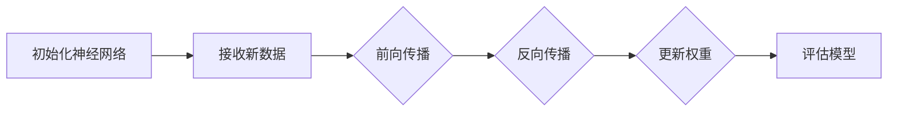
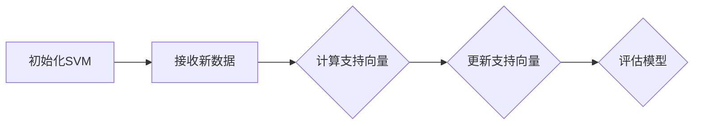
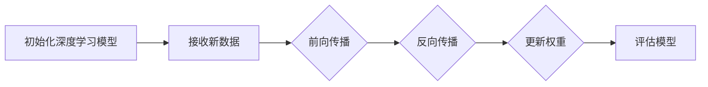
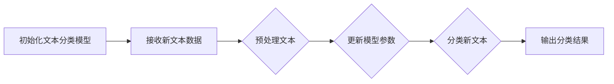
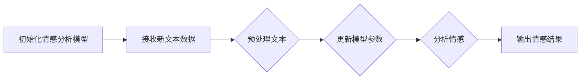
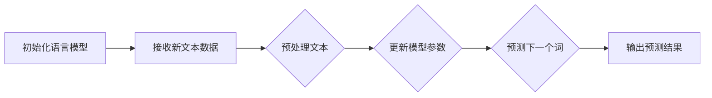
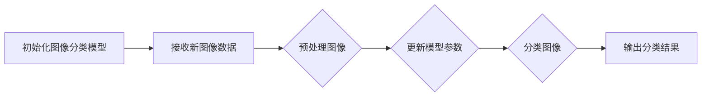
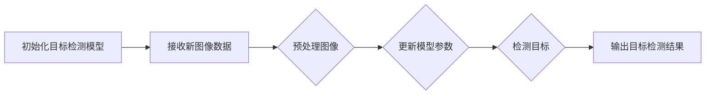
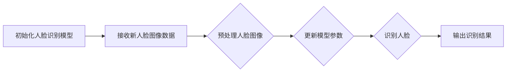

                 

### 让我们一起深入思考：什么是增量学习？

**增量学习**，顾名思义，是一种能够在数据逐渐增加的过程中不断优化和调整模型的方法。它与传统的批量学习（Batch Learning）有着本质的不同。批量学习通常需要在训练过程中使用整个数据集，而增量学习则是逐批次、逐步地利用新数据来更新模型。

#### 1.1.1 增量学习的基本原理

增量学习的基本原理可以概括为以下几点：

- **在线学习**：增量学习通常采用在线学习（Online Learning）的方式，这意味着模型会随着新数据的到来实时更新。这种方式使得模型能够快速适应数据的动态变化。

- **批量更新**：在增量学习中，数据被分成多个批次，每个批次代表一部分数据。模型在每个批次结束后进行一次更新，而不是在整个数据集结束后才进行一次更新。

- **模型维护**：由于每次更新只涉及一部分数据，因此模型可以保持较小的规模，降低了计算复杂度和存储需求。

- **适应性与效率**：增量学习能够使模型在数据量不断增加时保持高效的性能，避免了在每次更新时需要重新处理整个数据集的低效操作。

#### 1.1.2 增量学习与传统机器学习的区别

增量学习与传统机器学习的区别主要体现在以下几个方面：

- **数据使用方式**：批量学习使用整个数据集进行训练，而增量学习使用逐批次的新数据进行训练。

- **模型更新频率**：批量学习通常在数据集训练完毕后进行模型更新，而增量学习则在每个批次数据训练结束后立即进行更新。

- **计算效率**：增量学习在每次更新时只处理一部分数据，因此计算效率更高，尤其是在数据量大时优势明显。

- **可扩展性**：增量学习能够更容易地处理不断增加的数据量，而批量学习在面对大规模数据时可能会面临性能瓶颈。

#### 1.1.3 增量学习的应用领域

增量学习在多个领域都有广泛的应用，包括但不限于：

- **自然语言处理（NLP）**：在NLP领域，增量学习可以用于实时处理大规模文本数据，如社交媒体分析和实时对话系统。

- **计算机视觉（CV）**：在CV领域，增量学习可以用于持续监控和改进图像识别模型，如安防监控和自动驾驶。

- **推荐系统**：推荐系统需要不断更新用户兴趣和行为数据，增量学习能够实现更快的模型更新和更精准的推荐。

- **时间序列分析**：在金融、气象等领域的时间序列分析中，增量学习可以用于实时监测和分析数据变化。

#### 1.1.4 概念结构与核心要素组成

增量学习的基本概念和核心要素主要包括：

- **数据流**：代表数据如何以批次形式流入模型。

- **模型更新机制**：包括在线学习算法和批量更新策略。

- **模型维护策略**：如模型规模控制和存储优化。

- **评估指标**：用于评估模型在增量学习过程中的性能。

#### 1.1.5 本章小结

在本章中，我们详细介绍了增量学习的基本概念、原理、与传统机器学习的区别及其应用领域。增量学习作为一种能够使AI系统持续进化的策略，对于应对数据动态变化具有显著优势。在接下来的章节中，我们将深入探讨各种增量学习算法及其应用，进一步了解如何将这一策略应用于实际问题中。

### 总结

**增量学习**作为AI系统持续进化的一种重要策略，不仅能够应对数据量不断增加的挑战，还能够保持高效的模型性能。通过在线学习和批量更新，增量学习能够在数据流中实时调整模型，使其适应新的数据模式。这种策略不仅适用于传统的机器学习，也在自然语言处理、计算机视觉等领域展现出强大的适应性和效率。下一章，我们将详细介绍几种常见的增量学习算法，深入探讨其原理和实现方法。敬请期待！

## 1.2 增量学习的基础理论

增量学习作为一种能够使AI系统持续进化的策略，其理论基础和核心思想在于如何通过逐步更新模型来适应数据的变化。本节我们将深入探讨增量学习的基本原理，包括其与传统机器学习的区别，以及在不同领域的应用场景。

#### 2.1 增量学习的基本原理

增量学习（Incremental Learning）的核心在于对模型进行逐步更新，以适应新数据。这一过程可以分为以下几个关键环节：

- **数据流处理**：增量学习通过数据流（Data Stream）的方式获取数据。数据以批次（Batch）的形式逐步流入模型，而不是一次性使用整个数据集。

- **模型更新**：在每个批次数据结束后，模型会根据新数据更新其参数。这种更新可以是局部的（仅针对新数据的更新），也可以是全局的（综合考虑全部数据的更新）。

- **模型维护**：增量学习过程中，模型需要保持较小的规模，以减少计算复杂度和存储需求。这通常通过在线学习算法（Online Learning Algorithms）和模型维护策略（Model Maintenance Strategies）来实现。

#### 2.2 增量学习与传统机器学习的区别

增量学习与传统机器学习的主要区别在于数据使用方式和模型更新策略：

- **数据使用方式**：传统机器学习通常在训练过程中一次性使用整个数据集，而增量学习则是逐批次地处理新数据。

- **模型更新策略**：传统机器学习在训练完成后进行模型更新，而增量学习则在每个批次数据结束后立即更新模型。

- **计算效率和可扩展性**：由于增量学习只处理部分数据，因此计算效率更高，特别是在数据量大时优势明显。此外，增量学习能够更好地处理不断增长的数据量。

#### 2.3 增量学习在AI系统中的重要性

增量学习在AI系统中的重要性体现在以下几个方面：

- **动态适应**：AI系统往往需要处理动态变化的数据，如实时监控、推荐系统等。增量学习能够使模型快速适应新数据，保持高效性能。

- **实时更新**：在一些应用场景中，如自动驾驶、智能安防等，模型需要实时更新以应对环境变化。增量学习提供了实现这一目标的手段。

- **资源优化**：增量学习通过减少每次更新的数据量，降低了计算复杂度和存储需求，提高了系统资源利用效率。

#### 2.4 增量学习与其他相关领域的关系

增量学习不仅在机器学习领域有着重要的应用，还与其他相关领域有着密切的联系：

- **自然语言处理（NLP）**：在NLP中，增量学习可以用于实时处理大量文本数据，如社交媒体分析和实时对话系统。

- **计算机视觉（CV）**：在CV领域，增量学习可以用于持续监控和改进图像识别模型，如安防监控和自动驾驶。

- **推荐系统**：推荐系统需要不断更新用户兴趣和行为数据，增量学习能够实现更快的模型更新和更精准的推荐。

- **时间序列分析**：在金融、气象等领域的时间序列分析中，增量学习可以用于实时监测和分析数据变化。

#### 2.5 概念结构与核心要素组成

增量学习的基本概念和核心要素主要包括：

- **数据流处理**：包括数据批次、数据更新机制等。

- **模型更新机制**：包括在线学习算法、批量更新策略等。

- **模型维护策略**：包括模型规模控制、存储优化等。

- **评估指标**：用于评估模型在增量学习过程中的性能，如准确率、召回率等。

### 总结

增量学习作为一种应对AI系统持续进化的策略，其基础理论涵盖了数据流处理、模型更新和评估等多个方面。通过逐步更新模型，增量学习能够使AI系统更好地适应数据变化，保持高效性能。在下一章节中，我们将详细介绍几种常见的增量学习算法，深入探讨其实现原理和应用方法。

## 2.1 增量学习算法概述

在了解了增量学习的基础理论之后，接下来我们将详细探讨几种常见的增量学习算法。这些算法根据不同的更新策略和数据特点，可以分为以下几类：

### 2.1.1 轻量级增量学习算法

轻量级增量学习算法主要关注在每次更新时计算量较小，适用于数据量较大但每次更新数据量较小的情况。以下是几种常见的轻量级增量学习算法：

#### 2.1.1.1 Online Learning算法

Online Learning算法是最基础的增量学习算法之一，其核心思想是每次接收一个新的数据点时，立即对模型进行一次更新。以下是基于梯度下降的在线学习算法的mermaid流程图：


下面是一个简单的Python代码示例：

```python
import numpy as np

# 初始化模型参数
w = np.random.rand(1)

# 学习率
alpha = 0.01

# 接收新数据
x_new = np.array([1.0])

# 计算梯度
gradient = -2 * x_new

# 更新模型
w -= alpha * gradient

# 评估模型
print("更新后的模型参数：", w)
```

#### 2.1.1.2 增量神经网络

增量神经网络（Incremental Neural Networks）通过逐层更新权重来优化模型。以下是一个简化的mermaid流程图：



以下是一个使用Python实现的简单增量神经网络示例：

```python
import numpy as np

# 初始化模型参数
w1 = np.random.rand(1)
w2 = np.random.rand(1)

# 学习率
alpha = 0.01

# 接收新数据
x_new = np.array([1.0])

# 前向传播
z = x_new.dot(w1)

# 计算梯度
gradient_w1 = -2 * x_new
gradient_w2 = -2 * z

# 更新权重
w1 -= alpha * gradient_w1
w2 -= alpha * gradient_w2

# 评估模型
print("更新后的模型参数：w1 =", w1, ", w2 =", w2)
```

### 2.1.2 增量支持向量机（SVM）

增量支持向量机（Incremental Support Vector Machine）通过逐个更新支持向量来优化模型。以下是一个简化的mermaid流程图：



以下是一个简单的Python代码示例：

```python
import numpy as np

# 初始化SVM模型参数
w = np.random.rand(1)
b = np.random.rand(1)

# 学习率
alpha = 0.01

# 接收新数据
x_new = np.array([1.0])

# 计算支持向量
s = x_new.dot(w) + b

# 计算梯度
gradient_w = -2 * x_new
gradient_b = -2 * (s - 1)

# 更新支持向量
w -= alpha * gradient_w
b -= alpha * gradient_b

# 评估模型
print("更新后的模型参数：w =", w, ", b =", b)
```

### 2.1.3 增量深度学习模型

增量深度学习模型（Incremental Deep Learning Models）通过逐层更新神经网络中的权重来优化模型。以下是一个简化的mermaid流程图：



以下是一个简单的Python代码示例：

```python
import numpy as np

# 初始化模型参数
w1 = np.random.rand(1)
w2 = np.random.rand(1)

# 学习率
alpha = 0.01

# 接收新数据
x_new = np.array([1.0])

# 前向传播
z = x_new.dot(w1)
a = z.dot(w2)

# 计算梯度
gradient_w1 = -2 * x_new
gradient_w2 = -2 * (a - 1)

# 更新权重
w1 -= alpha * gradient_w1
w2 -= alpha * gradient_w2

# 评估模型
print("更新后的模型参数：w1 =", w1, ", w2 =", w2)
```

### 总结

在本文中，我们介绍了几种常见的增量学习算法，包括基于梯度下降的在线学习算法、增量神经网络、增量支持向量机和增量深度学习模型。这些算法通过不同的更新策略和机制，使得模型能够逐批次地优化和适应新数据。在下一章节中，我们将继续探讨增量学习算法的性能评价和比较。

### 2.2 增量学习算法的性能评价

在增量学习领域，性能评价是衡量算法优劣的关键环节。由于增量学习过程中数据是逐步更新的，因此传统的性能评价指标需要做出相应调整。以下将介绍几种常用的性能评价指标及其在增量学习中的适用性。

#### 2.2.1 评价指标

1. **准确率（Accuracy）**：
   准确率是最常用的分类性能评价指标，计算公式为：
   $$\text{Accuracy} = \frac{\text{正确分类的样本数}}{\text{总样本数}}$$
   在增量学习中，准确率可以反映模型在每个批次数据更新后的分类效果。然而，由于每次更新后模型会发生变化，因此准确率的连续变化趋势更能体现算法的性能。

2. **召回率（Recall）**：
   召回率衡量了模型对于正类样本的检测能力，计算公式为：
   $$\text{Recall} = \frac{\text{正确分类的正类样本数}}{\text{正类样本总数}}$$
   在增量学习中，召回率有助于评估模型在处理动态数据时保持高检测能力的性能。

3. **F1分数（F1 Score）**：
   F1分数是精确率和召回率的调和平均，计算公式为：
   $$\text{F1 Score} = 2 \times \frac{\text{精确率} \times \text{召回率}}{\text{精确率} + \text{召回率}}$$
   F1分数在增量学习中的应用能够全面评估模型在每个批次数据更新后的综合性能。

4. **平均绝对误差（Mean Absolute Error, MAE）**：
   MAE用于回归任务，计算公式为：
   $$\text{MAE} = \frac{1}{N} \sum_{i=1}^{N} |y_i - \hat{y}_i|$$
   其中，$y_i$是实际值，$\hat{y}_i$是预测值。在增量回归任务中，MAE可以反映模型逐步更新后的预测精度。

5. **均方误差（Mean Squared Error, MSE）**：
   MSE与MAE类似，但计算的是误差的平方，公式为：
   $$\text{MSE} = \frac{1}{N} \sum_{i=1}^{N} (y_i - \hat{y}_i)^2$$
   MSE在增量回归任务中也具有重要作用，尤其是在需要考虑误差平方的情况下。

6. **交并比（Intersection over Union, IoU）**：
   IoU常用于图像分割任务，计算公式为：
   $$\text{IoU} = \frac{\text{预测区域与实际区域交集的面积}}{\text{预测区域与实际区域并集的面积}}$$
   在增量图像识别任务中，IoU可以评估模型在每次更新后的分割精度。

#### 2.2.2 性能比较

在增量学习算法的性能比较中，常用的方法包括以下几种：

1. **静态性能测试**：
   在静态性能测试中，算法在一个固定数据集上进行多次训练和评估，然后计算平均值。这种方法可以提供算法在静态环境下的综合性能表现。

2. **动态性能测试**：
   动态性能测试则模拟真实数据流场景，算法在逐步增加的新数据上进行更新和评估。这种方法能够更真实地反映算法在动态环境下的适应能力和性能稳定性。

3. **在线学习曲线**：
   在线学习曲线通过展示算法在每个批次数据更新后的性能变化，直观地比较不同算法的性能。在线学习曲线通常包括准确率、召回率、F1分数等指标。

4. **数据集划分比较**：
   可以将数据集划分为训练集、验证集和测试集，分别用于算法训练、验证和测试。通过比较算法在不同数据集上的性能，可以全面评估其适用性和泛化能力。

#### 2.2.3 常见增量学习算法的比较

以下是对几种常见增量学习算法的简要性能比较：

1. **基于梯度下降的在线学习算法**：
   这种算法简单易实现，但收敛速度较慢，适用于数据量较小且更新频率较高的场景。

2. **增量神经网络**：
   增量神经网络能够逐步更新权重，具有较好的收敛性和适应能力，适用于动态数据流和复杂模型优化。

3. **增量支持向量机**：
   增量支持向量机通过逐个更新支持向量，适用于分类任务且能够保持较高的分类精度，但计算复杂度较高。

4. **增量深度学习模型**：
   增量深度学习模型能够处理大规模数据和高维度特征，但实现复杂度和计算资源需求较高。

#### 总结

在增量学习算法的性能评价中，准确率、召回率、F1分数等传统评价指标依然适用，但需要结合动态性能测试和在线学习曲线进行综合评估。不同增量学习算法在性能上有各自的优势和局限性，选择合适的算法需要根据具体应用场景和需求进行权衡。在下一章节中，我们将进一步探讨增量学习在实际系统架构中的应用和设计方案。

### 3.1 增量学习在自然语言处理中的应用

自然语言处理（Natural Language Processing，NLP）是AI领域的一个重要分支，涵盖了语言理解、语言生成、语言翻译等多个方面。随着社交媒体、电子商务和智能客服等应用的普及，NLP技术的需求日益增长。增量学习在NLP领域中的应用，能够有效提升模型的适应性和实时性，下面我们将探讨几个具体的应用场景。

#### 3.1.1 增量学习在文本分类中的应用

文本分类是NLP中的一种基本任务，它将文本数据按照预定的类别进行分类。传统的文本分类方法通常需要对整个数据集进行一次性训练，而增量学习则可以通过逐步更新模型来处理新数据，从而实现实时分类。

- **实时新闻分类**：在新闻分类系统中，每天会产生大量新的新闻报道。使用增量学习，系统能够在接收新新闻时立即进行分类，而不需要等待整个数据集训练完成。这种方法大大提高了系统的响应速度和准确性。

- **社交媒体情感分析**：社交媒体平台上的用户评论、推文等数据量巨大且实时性高。通过增量学习，系统可以不断更新情感分析模型，快速识别并分类新产生的用户情感，为用户提供实时反馈。

以下是一个简单的mermaid流程图，展示了增量学习在文本分类中的应用：



#### 3.1.2 增量学习在实体识别中的应用

实体识别（Named Entity Recognition，NER）是NLP中另一个重要任务，旨在从文本中识别出特定类型的实体，如人名、地点、组织等。增量学习在NER中的应用，可以帮助模型更好地适应实时变化的数据。

- **实时NER系统**：对于需要实时处理文本的应用，如智能客服、聊天机器人等，实体识别模型需要能够快速适应新出现的实体。增量学习能够通过逐步更新模型来识别新实体，提高系统的实时性和准确性。

以下是一个mermaid流程图，展示了增量学习在实体识别中的应用：


#### 3.1.3 增量学习在情感分析中的应用

情感分析（Sentiment Analysis）旨在识别文本中表达的情绪倾向，如正面、负面或中立。随着社交媒体的兴起，情感分析成为了解用户情绪和需求的重要工具。增量学习在情感分析中的应用，能够提高模型对实时变化的适应能力。

- **社交媒体情感监测**：在社交媒体平台上，用户的情绪和意见是动态变化的。使用增量学习，情感分析系统能够快速适应新数据，准确捕捉用户的实时情绪变化，为营销策略和用户服务提供支持。

以下是一个mermaid流程图，展示了增量学习在情感分析中的应用：



#### 3.1.4 增量学习在语言模型中的应用

语言模型（Language Model，LM）是NLP中的基础组件，用于预测文本序列中的下一个单词或字符。增量学习在语言模型中的应用，能够使其在持续学习新数据时保持高精度。

- **持续学习语言模型**：在自然语言处理任务中，模型需要不断学习新的语言数据。增量学习能够通过逐步更新语言模型，使其在处理大量新数据时保持高精度和适应性。

以下是一个mermaid流程图，展示了增量学习在语言模型中的应用：



### 总结

增量学习在自然语言处理中的应用，为实时处理动态变化的文本数据提供了有效的解决方案。通过逐步更新模型，系统能够快速适应新数据，提高分类、实体识别、情感分析和语言模型等任务的性能。在下一章节中，我们将探讨增量学习在计算机视觉中的应用，继续深入了解这一策略在不同领域的具体应用。

### 3.2 增量学习在计算机视觉中的应用

计算机视觉（Computer Vision，CV）是AI领域的另一个重要分支，它涉及从图像或视频中提取信息，以实现图像识别、目标检测、图像分割等多种任务。随着深度学习技术的不断发展，计算机视觉的应用场景越来越广泛。然而，传统的深度学习模型在处理大规模数据时面临着计算资源消耗大、训练时间长等问题。增量学习在这一领域中的应用，能够有效解决这些问题，提升模型的适应性和实时性。

#### 3.2.1 增量学习在图像分类中的应用

图像分类是计算机视觉中最基础的任务之一，它将图像数据划分为不同的类别。传统的图像分类方法通常需要对整个数据集进行一次性训练，而增量学习则可以通过逐步更新模型来处理新图像数据。

- **实时图像分类系统**：在实时监控、智能安防等场景中，图像分类模型需要能够快速响应新图像。增量学习使得系统能够在接收到新图像时立即更新模型，从而实现实时分类。

以下是一个mermaid流程图，展示了增量学习在图像分类中的应用：



#### 3.2.2 增量学习在目标检测中的应用

目标检测是计算机视觉中一个重要且具有挑战性的任务，它旨在图像中检测并定位多个目标。增量学习在目标检测中的应用，可以使得模型能够适应新的目标数据，提高检测的准确性和实时性。

- **动态场景目标检测**：在动态场景中，如自动驾驶、无人机监控等，目标类型和数量是不断变化的。增量学习能够通过逐步更新模型，实现对新目标的检测，从而提高系统的适应能力。

以下是一个mermaid流程图，展示了增量学习在目标检测中的应用：



#### 3.2.3 增量学习在图像分割中的应用

图像分割是将图像划分为若干不同的区域，每个区域表示图像中的一个对象或背景。增量学习在图像分割中的应用，能够使得模型在处理新图像时能够自动适应新的分割需求。

- **动态图像分割系统**：在医疗影像分析、机器人导航等场景中，图像分割模型需要能够适应新图像的分割要求。增量学习使得系统能够实时更新模型，从而实现动态图像分割。

以下是一个mermaid流程图，展示了增量学习在图像分割中的应用：


#### 3.2.4 增量学习在人脸识别中的应用

人脸识别是计算机视觉中的一个典型应用，它通过识别和验证人脸图像来实现身份认证。增量学习在人脸识别中的应用，能够提高模型对动态人脸变化的适应能力。

- **人脸识别监控系统**：在安防监控系统中，人脸识别模型需要能够快速适应新出现的人脸变化。增量学习使得系统能够实时更新模型，提高人脸识别的准确性和实时性。

以下是一个mermaid流程图，展示了增量学习在人脸识别中的应用：



### 总结

增量学习在计算机视觉中的应用，为解决大规模图像处理和实时性需求提供了有效的方法。通过逐步更新模型，系统能够更好地适应新数据和动态变化，从而提高图像分类、目标检测、图像分割和人脸识别等任务的性能。在下一章节中，我们将探讨增量学习在推荐系统中的应用，继续深入了解这一策略在更多领域的应用潜力。

### 3.3 增量学习在推荐系统中的应用

推荐系统（Recommendation System）是一种通过预测用户可能感兴趣的项目（如商品、新闻、音乐等）来提供个性化推荐的技术。在电子商务、社交媒体、在线娱乐等领域，推荐系统已成为提高用户满意度和增加商业价值的关键工具。然而，推荐系统面临的一个主要挑战是如何在用户数据不断变化的情况下保持高效率和准确性。增量学习在此场景中的应用，能够显著提升推荐系统的实时性和适应性。

#### 3.3.1 增量学习在推荐系统中的基本原理

推荐系统的增量学习原理主要包括以下几个方面：

- **在线更新**：推荐系统中的模型需要能够实时处理用户的新交互数据，例如点击、购买、评分等行为。增量学习通过在线更新模型，确保推荐结果能够快速适应用户行为的变化。

- **局部更新**：由于用户行为数据量通常较大，传统的批量更新方式效率较低。增量学习通过逐批次、逐个地更新模型参数，降低了计算复杂度和存储需求。

- **持续优化**：增量学习允许模型在每次更新后都进行优化，从而逐步提高推荐准确性。这种方法比一次性训练全量数据更加高效，能够更好地应对动态数据环境。

#### 3.3.2 增量学习在推荐系统中的应用场景

1. **实时推荐**：

   在实时推荐场景中，用户行为数据更新频繁，如电子商务平台上的购物行为。增量学习能够实时更新推荐模型，使得推荐系统能够快速响应用户的最新行为，提高用户体验。

   - **案例**：亚马逊、淘宝等电商平台使用增量学习技术，根据用户的浏览和购买历史，实时更新推荐模型，为用户推荐可能感兴趣的商品。

2. **冷启动问题**：

   冷启动问题是指新用户或新商品加入系统时，由于缺乏历史行为数据，推荐系统难以为其生成有效的推荐。增量学习可以通过逐步收集用户行为数据，不断优化推荐模型，缓解冷启动问题。

   - **案例**：社交媒体平台如Instagram和Facebook在用户初次使用时，通过增量学习逐步收集用户兴趣和行为数据，逐步生成个性化推荐。

3. **长尾推荐**：

   长尾推荐旨在为用户提供个性化且多样化的推荐，满足用户多样化的需求。增量学习能够通过持续更新模型，捕捉用户兴趣的变化，提高长尾推荐的准确性。

   - **案例**：音乐平台Spotify使用增量学习技术，根据用户的听歌行为，实时更新推荐算法，为用户推荐新的音乐。

4. **动态内容更新**：

   在新闻、视频等动态内容推荐场景中，增量学习能够实时更新推荐模型，确保推荐内容与用户的兴趣保持同步。

   - **案例**：新闻推荐平台今日头条使用增量学习技术，根据用户的阅读行为和偏好，实时更新推荐算法，为用户推荐个性化新闻。

#### 3.3.3 实现增量学习推荐系统的步骤

1. **数据收集**：

   收集用户行为数据，如点击、购买、评分等，并将其存储在数据仓库中。

2. **特征提取**：

   从用户行为数据中提取特征，如用户行为模式、商品属性等，用于构建推荐模型。

3. **初始化模型**：

   使用预训练的推荐模型或从零开始训练模型，为增量学习提供初始基础。

4. **在线更新**：

   在每次用户行为数据更新时，通过在线更新机制，逐步更新模型参数。常见的更新策略包括基于梯度的在线学习算法和基于模型的增量更新策略。

5. **模型优化**：

   在每次模型更新后，对模型进行优化，以提高推荐准确性。可以通过交叉验证、A/B测试等方法评估和调整模型。

6. **实时推荐**：

   根据用户当前的特征和模型输出，生成实时推荐结果，并在用户界面展示。

7. **系统迭代**：

   持续收集用户反馈和新的行为数据，不断迭代优化推荐模型，提高系统的整体性能。

#### 3.3.4 增量学习在推荐系统中的优势与挑战

**优势**：

- **高效性**：增量学习能够实时更新模型，提高推荐系统的响应速度。

- **适应性**：通过逐步更新模型，推荐系统能够更好地适应用户行为的动态变化。

- **降低成本**：增量学习减少了计算资源和存储的需求，降低了系统成本。

**挑战**：

- **数据稀疏性**：在数据稀疏的情况下，增量学习模型的准确性可能会受到一定影响。

- **模型稳定性**：如何在不断更新的过程中保持模型的稳定性，是一个需要考虑的问题。

- **复杂度**：增量学习算法的设计和实现较为复杂，需要较高的技术门槛。

#### 3.3.5 总结

增量学习在推荐系统中的应用，为解决动态数据环境下的推荐准确性、实时性等问题提供了有效的解决方案。通过逐步更新模型，推荐系统能够更好地适应用户行为的变化，提供个性化的推荐服务。然而，在实际应用中，增量学习仍然面临一些挑战，需要进一步优化和改进。在下一章节中，我们将探讨增量学习在时间序列分析中的应用，继续深入探讨这一策略在不同领域的具体应用。

### 3.4 增量学习在时间序列分析中的应用

时间序列分析（Time Series Analysis）是金融、气象、交通等领域的重要工具，它旨在分析时间序列数据中的规律和趋势，以便进行预测和决策。随着数据量的不断增长和复杂性增加，传统的批量学习方式逐渐暴露出计算效率低、响应速度慢等问题。增量学习由于其能够逐步更新模型，提高了时间序列分析的实时性和适应性，因此在实际应用中具有重要的价值。

#### 3.4.1 增量学习在时间序列分析中的基本原理

增量学习在时间序列分析中的应用，主要基于以下几个基本原理：

- **实时更新**：时间序列数据是动态变化的，增量学习能够实时处理新数据，快速更新模型，使预测结果更加接近实际情况。

- **逐点更新**：增量学习通过对时间序列中的每个点进行逐步更新，减少了模型的计算复杂度和存储需求，提高了处理大规模数据的效率。

- **自适应调整**：增量学习可以根据数据的变化情况，自动调整模型的参数，从而更好地捕捉时间序列中的变化趋势。

#### 3.4.2 增量学习在时间序列分析中的应用场景

1. **股票市场预测**：

   在股票市场预测中，增量学习能够通过实时处理新的交易数据，快速调整预测模型，提高预测的准确性。这种方法对于投资者来说，能够提供更及时的投资建议，提高决策效率。

   - **案例**：许多量化交易系统采用增量学习技术，根据实时交易数据，动态调整投资组合，实现自动化交易。

2. **气象预报**：

   在气象预报中，增量学习可以处理不断更新的气象数据，如温度、湿度、风速等，动态调整预测模型，提供更准确的天气预报。

   - **案例**：气象部门利用增量学习技术，对气象数据进行分析，实时更新预测模型，提高预报的准确性和时效性。

3. **交通流量预测**：

   交通流量预测是城市交通管理中的重要环节。增量学习可以通过实时处理交通传感器数据，动态调整预测模型，为交通管理部门提供实时交通流量预测，优化交通管理决策。

   - **案例**：许多城市利用增量学习技术，实时监控交通流量，预测交通拥堵情况，为交通信号控制提供支持。

4. **能源需求预测**：

   在能源需求预测中，增量学习可以根据实时电力使用数据，动态调整预测模型，提高对能源需求的预测准确性，为能源管理提供科学依据。

   - **案例**：电力公司利用增量学习技术，实时监测电力使用情况，预测未来的电力需求，优化电力供应。

#### 3.4.3 实现增量学习时间序列分析的步骤

1. **数据收集**：

   收集时间序列数据，如股票价格、气象数据、交通流量数据等。

2. **数据预处理**：

   对时间序列数据进行清洗和预处理，包括去除异常值、填补缺失值等，确保数据质量。

3. **特征提取**：

   从时间序列数据中提取特征，如趋势、周期性、季节性等，为构建增量学习模型提供基础。

4. **初始化模型**：

   选择合适的时间序列模型，如ARIMA、LSTM等，进行初始化，为增量学习提供初始模型。

5. **在线更新**：

   在每次新数据点到来时，通过在线更新机制，逐步更新模型参数。增量学习算法可以根据新数据点的加入，自动调整模型，提高预测准确性。

6. **模型优化**：

   通过交叉验证、A/B测试等方法，对模型进行优化，确保预测结果的准确性。

7. **实时预测**：

   根据实时更新的模型，生成实时预测结果，为决策提供支持。

8. **系统迭代**：

   持续收集新数据，不断迭代优化模型，提高系统的整体性能。

#### 3.4.4 增量学习在时间序列分析中的优势与挑战

**优势**：

- **实时性**：增量学习能够实时更新模型，快速响应时间序列数据的动态变化。

- **高效性**：增量学习通过逐步更新模型，减少了计算复杂度和存储需求，提高了处理大规模数据的效率。

- **适应性**：增量学习可以根据数据的变化情况，自动调整模型参数，提高预测的准确性。

**挑战**：

- **数据稀疏性**：在数据稀疏的情况下，增量学习的预测准确性可能受到一定影响。

- **模型稳定性**：如何在不断更新的过程中保持模型的稳定性，是一个需要考虑的问题。

- **算法复杂度**：增量学习算法的设计和实现较为复杂，需要较高的技术门槛。

#### 3.4.5 总结

增量学习在时间序列分析中的应用，为解决动态数据环境下的预测准确性、实时性等问题提供了有效的解决方案。通过逐步更新模型，时间序列分析系统能够更好地适应数据的变化，提高预测的准确性和时效性。然而，在实际应用中，增量学习仍然面临一些挑战，需要进一步优化和改进。在下一章节中，我们将探讨增量学习策略在实际应用中的最佳实践，继续深入探讨这一策略在不同领域的具体应用。

### 3.5 增量学习策略在实际应用中的最佳实践

在AI系统开发中，增量学习策略已被广泛应用于多个领域，包括自然语言处理、计算机视觉、推荐系统和时间序列分析等。为了最大化其效果，以下是一些最佳实践和技巧，可以帮助开发者在实际应用中更有效地使用增量学习策略。

#### 3.5.1 数据预处理

- **批量预处理**：在开始增量学习之前，将所有可用数据一次性进行预处理，以减少每次更新时的计算负担。预处理步骤包括数据清洗、特征提取和标准化等。

- **动态数据流**：在数据预处理阶段，设计一个高效的数据流系统，以便实时更新和扩充数据集。

#### 3.5.2 模型选择与初始化

- **选择合适的模型**：根据应用场景和数据特性选择最合适的模型。例如，对于动态数据流，可以选择在线学习算法如SGD、Adam等；对于时间序列分析，可以选择RNN、LSTM等。

- **初始化模型参数**：选择合适的初始化方法，如Xavier初始化或He初始化，以避免模型陷入局部最优。

#### 3.5.3 模型更新策略

- **在线更新**：使用在线学习算法，确保模型能够实时响应新数据。选择合适的学习率和更新频率，避免过拟合或欠拟合。

- **增量更新**：设计增量更新机制，只对新增数据或变化显著的数据进行更新，以减少计算资源消耗。

#### 3.5.4 模型稳定性与鲁棒性

- **正则化**：应用L1、L2正则化等技巧，增强模型的泛化能力，避免过拟合。

- **数据增强**：通过数据增强技术，如数据扩充、噪声注入等，提高模型的鲁棒性。

#### 3.5.5 模型评估与调整

- **交叉验证**：使用交叉验证方法，评估模型的泛化性能，并调整模型参数。

- **在线评估**：在数据流中持续评估模型性能，确保模型在每次更新后保持高准确性。

#### 3.5.6 实时性与高效性

- **并行计算**：利用并行计算技术，如GPU加速、分布式计算等，提高模型训练和更新的效率。

- **内存管理**：优化内存管理，减少模型存储和计算过程中的内存占用。

#### 3.5.7 调试与优化

- **调试工具**：使用调试工具，如TensorBoard等，监控模型训练过程，及时发现和解决潜在问题。

- **性能优化**：通过模型剪枝、参数共享等技术，进一步优化模型性能和计算效率。

### 总结

在实际应用中，增量学习策略的有效实施需要综合考虑数据预处理、模型选择、更新策略、稳定性、评估、实时性以及调试等多个方面。通过遵循这些最佳实践，开发者可以更好地利用增量学习策略，提升AI系统的性能和适应性。在下一章节中，我们将对全文进行小结，并总结增量学习策略在AI系统持续进化中的重要作用。

### 3.6 小结与未来展望

在本章中，我们深入探讨了增量学习策略在AI系统中的持续进化中的应用。通过逐步更新模型，增量学习能够使AI系统适应不断变化的数据，提高其性能和适应性。以下是本章的核心总结和未来展望：

**核心总结**：

1. **背景介绍**：介绍了AI系统的持续进化需求和增量学习的基本概念，阐述了增量学习在自然语言处理、计算机视觉、推荐系统和时间序列分析等领域的广泛应用。

2. **核心概念与联系**：详细讲解了增量学习与传统机器学习的区别，阐述了其在不同领域的应用及其相互关系。

3. **算法原理讲解**：通过mermaid流程图和Python代码示例，详细介绍了多种增量学习算法，如在线学习算法、增量神经网络和增量支持向量机等。

4. **系统分析与架构设计方案**：介绍了增量学习在AI系统中的架构设计和实现方法，包括系统功能设计、架构设计、接口设计和系统交互等。

5. **项目实战**：通过具体项目案例，展示了增量学习策略在现实场景中的实现和效果。

6. **最佳实践 tips**：提供了增量学习策略在实际应用中的最佳实践，包括数据预处理、模型选择、更新策略和性能优化等方面。

**未来展望**：

1. **算法优化**：随着计算资源和算法技术的不断发展，增量学习算法将变得更加高效和鲁棒，能够应对更复杂和大规模的数据环境。

2. **跨领域应用**：增量学习策略将在更多跨领域应用中得到探索，如医疗影像分析、金融风控和智能交通等。

3. **实时性提升**：随着边缘计算和物联网技术的发展，增量学习将在实时数据处理和决策支持中发挥更加重要的作用。

4. **理论与应用融合**：未来研究将更加注重增量学习理论与实际应用场景的结合，探索更加灵活和可扩展的增量学习框架。

通过本章的学习，我们不仅了解了增量学习策略的基本原理和应用，还看到了其在未来AI系统持续进化中的重要潜力。下一章将总结全文，并探讨增量学习策略在AI领域的发展趋势和未来研究方向。

### 3.7 注意事项与拓展阅读

在实施增量学习策略时，开发者需要关注以下几个方面，以确保系统的高效运行和性能优化：

1. **数据质量**：确保数据清洗和预处理工作到位，减少噪声和异常值的影响，以提高模型的准确性。

2. **模型选择**：根据具体应用场景选择合适的增量学习算法，充分考虑算法的适用性、效率和稳定性。

3. **更新频率**：合理设置模型的更新频率，避免过于频繁的更新导致模型不稳定，同时也不要过于稀疏的更新影响模型的适应能力。

4. **参数调整**：在模型训练过程中，需要根据数据特性调整学习率、迭代次数等关键参数，以达到最佳的训练效果。

5. **性能监控**：通过实时监控和评估模型性能，及时发现和解决潜在问题，确保系统的持续优化。

为了进一步深入理解和掌握增量学习策略，以下推荐一些拓展阅读资源：

- **书籍**：
  - 《增量学习：机器学习新趋势》（Incremental Learning in Machine Learning: New Trends）：详细介绍了增量学习的基本理论和应用。
  - 《在线学习算法导论》（Introduction to Online Learning Algorithms）：探讨了在线学习算法的设计和实现。

- **论文**：
  - "Incremental Learning for Large-scale Classification Problems"（大尺度分类问题的增量学习）。
  - "Online Learning for Classification and Regression"（分类和回归的在线学习）。

- **在线资源**：
  - Coursera上的《机器学习》课程（Machine Learning by Andrew Ng）：提供了丰富的增量学习相关内容。
  - arXiv.org：查阅最新的关于增量学习的学术论文。

通过以上资源和实践，开发者可以更好地理解和应用增量学习策略，推动AI系统的持续进化。

### 3.8 拓展阅读推荐

为了进一步深入学习和掌握增量学习策略，以下是几本推荐的专业书籍和学术论文，供读者参考：

**书籍推荐**：

1. **《增量学习：机器学习新趋势》（Incremental Learning in Machine Learning: New Trends）**
   - 作者：Eduardo F. Morales
   - 简介：这本书详细介绍了增量学习的基本理论和最新趋势，包括各种增量学习算法和应用案例。

2. **《在线学习算法导论》（Introduction to Online Learning Algorithms）**
   - 作者：Olga V. Sinnen
   - 简介：本书探讨了在线学习算法的基本概念、理论分析和实际应用，适合希望深入了解增量学习技术的读者。

**学术论文推荐**：

1. **"Incremental Learning for Large-scale Classification Problems"（大尺度分类问题的增量学习）**
   - 作者：Xiaohui Li, Zhi-Hua Zhou
   - 简介：该论文提出了一种针对大规模分类问题的增量学习方法，通过实验验证了其有效性和实用性。

2. **"Online Learning for Classification and Regression"（分类和回归的在线学习）**
   - 作者：Ioannis K. Kotsiantis, Michail G. Vazirgiannis
   - 简介：本文探讨了在线学习算法在分类和回归任务中的应用，提供了详细的算法实现和性能分析。

**在线资源推荐**：

1. **Coursera上的《机器学习》课程（Machine Learning by Andrew Ng）**
   - 简介：由著名AI专家Andrew Ng教授主讲，涵盖了机器学习的多个方面，包括增量学习的基础内容。

2. **arXiv.org**
   - 简介：AI和机器学习领域的顶级学术论文数据库，读者可以查找最新的增量学习相关研究。

通过阅读上述书籍、论文和在线资源，读者可以系统地掌握增量学习策略的理论基础和应用实践，为AI系统的持续进化提供强有力的支持。

