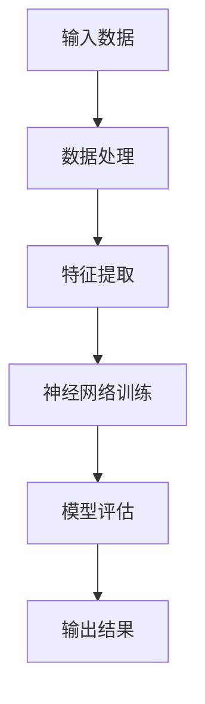
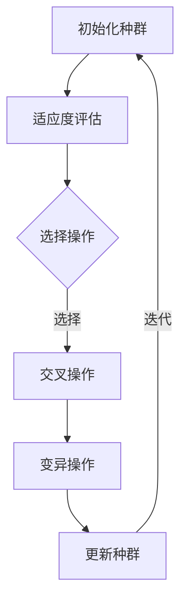
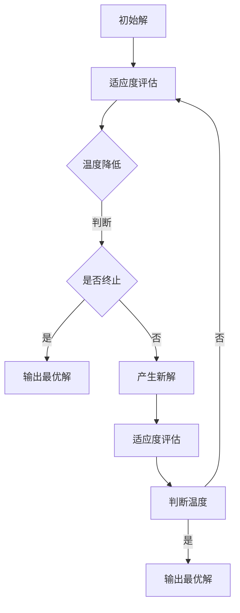
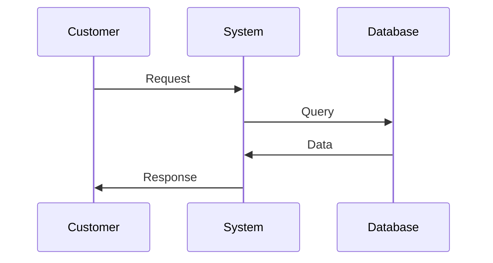
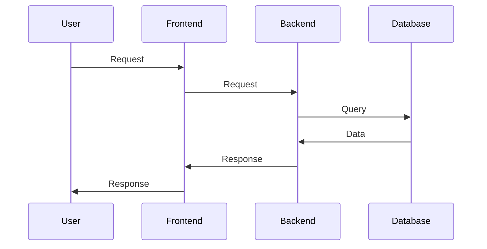

                 

## 复杂问题解题过程中关键要素的识别与提取

关键词：复杂问题、关键要素、识别、提取、解题过程

摘要：在现代社会，随着信息爆炸和技术进步，复杂问题日益普遍。解决这些复杂问题需要识别和提取关键要素，从而有效地进行问题建模和方案设计。本文将深入探讨复杂问题解题过程中的关键要素识别与提取方法，包括背景介绍、核心概念与联系、算法原理以及项目实战等，以期为读者提供全面且实用的指导。

### 第1章: 复杂问题背景与描述

#### 1.1 问题背景

在现代社会，随着信息技术的飞速发展，复杂问题层出不穷。这些复杂问题往往涉及多个学科领域，如计算机科学、数学、物理、生物学等。解决这些复杂问题不仅需要跨领域知识，还需要深入理解问题本身的特点和解决策略。

#### 1.2 问题描述

复杂问题通常具有以下特点：

1. **多维度**：复杂问题往往涉及多个变量和因素，这些变量和因素之间可能存在复杂的相互关系。
2. **不确定性**：问题中的数据或参数可能存在不确定性，这种不确定性可能来自于数据本身的噪声或外部环境的变化。
3. **非线性**：复杂问题的解决方案往往呈现出非线性关系，即解决方案与问题变量之间不是简单的线性关系。
4. **难以建模**：直接建立精确的数学模型来描述复杂问题可能较为困难，需要采用近似模型或分布式模型。

#### 1.3 问题解决

解决复杂问题的基本步骤包括：

1. **问题描述**：明确问题的目标、范围和限制条件。
2. **数据收集**：获取与问题相关的数据。
3. **关键要素识别**：找出影响问题解决的核心因素。
4. **要素提取**：从大量数据中提取关键要素。
5. **模型构建**：根据关键要素建立问题模型。
6. **解决方案设计**：基于模型提出解决方案。

#### 1.4 边界与外延

1. **边界**：复杂问题的解决范围和限制条件。边界定义了问题的研究范围，有助于明确问题的核心。
2. **外延**：问题的相关领域和潜在影响。了解问题的外延有助于理解问题的背景和可能的解决方案。

#### 1.5 概念结构与核心要素组成

- **概念结构**：对复杂问题及其解决方法的理论框架。概念结构有助于理解问题的本质和解决策略。
- **核心要素**：影响问题解决的关键因素，如数据、算法、计算资源等。核心要素的识别和提取是解决问题的基础。

### 第2章: 复杂问题中的核心概念与联系

#### 2.1 关键概念介绍

在本章中，我们将介绍与复杂问题解决相关的一系列关键概念，包括但不限于：

1. **复杂性理论**：研究复杂系统的性质和行为的学科。
2. **数据挖掘**：从大量数据中发现有用信息的方法。
3. **机器学习**：利用计算机模拟人类学习行为的科学。

#### 2.2 概念属性特征对比表格

以下是关键概念属性特征的对比表格：

| 概念       | 定义                         | 特征 |
|------------|------------------------------|------|
| 复杂性理论 | 研究复杂系统的学科           | 系统性强、非线性、多维度 |
| 数据挖掘   | 发现数据中的有用信息         | 数据依赖、统计分析、模式识别 |
| 机器学习   | 利用计算机模拟人类学习行为   | 自适应、预测性、优化 |

#### 2.3 ER实体关系图架构

以下是一个ER实体关系图架构的示例，用于描述复杂问题解决中的实体及其关系：

```mermaid
entityRelation(
  "问题",
  "解决方案",
  "数据",
  "算法",
  "资源",
  direction: LR,
  nodesep: 25,
  rankdir: TB
)
```

### 第3章: 复杂问题解决算法原理

#### 3.1 算法原理概述

本章将详细探讨复杂问题解决中的关键算法原理，包括：

1. **深度学习**：基于神经网络的机器学习算法。
2. **遗传算法**：模拟自然进化过程的优化算法。
3. **模拟退火算法**：基于物理退火过程的优化算法。

#### 3.2 深度学习算法原理

深度学习是一种基于多层神经网络的机器学习算法，其基本原理是通过多层神经网络对输入数据进行层层提取特征，最终实现问题的求解。

以下是一个深度学习算法的mermaid流程图：



- **数据处理**：对输入数据进行预处理，如归一化、标准化等。
- **特征提取**：通过多层神经网络对输入数据进行特征提取。
- **神经网络训练**：利用反向传播算法对神经网络进行训练，调整网络权重。
- **模型评估**：对训练好的模型进行评估，如准确率、召回率等。
- **输出结果**：基于训练好的模型进行预测或决策。

#### 3.3 遗传算法原理

遗传算法是一种模拟自然进化过程的优化算法，其基本原理是通过模拟自然选择和遗传机制来搜索最优解。

以下是一个遗传算法的mermaid流程图：



- **初始化种群**：随机生成初始种群。
- **适应度评估**：对种群中的每个个体进行适应度评估。
- **选择操作**：根据适应度进行选择，选择适应度较高的个体。
- **交叉操作**：对选择的个体进行交叉操作，生成新的个体。
- **变异操作**：对新的个体进行变异操作，增加种群的多样性。
- **更新种群**：将新的个体加入种群，进行下一次迭代。

#### 3.4 模拟退火算法原理

模拟退火算法是一种基于物理退火过程的优化算法，其基本原理是通过模拟物理退火过程来搜索最优解。

以下是一个模拟退火算法的mermaid流程图：



- **初始解**：随机生成初始解。
- **适应度评估**：对初始解进行适应度评估。
- **温度降低**：随着迭代的进行，温度逐渐降低。
- **判断是否终止**：判断是否满足终止条件，如达到最大迭代次数或适应度满足要求。
- **产生新解**：在当前解的基础上，通过随机扰动产生新的解。
- **判断温度**：如果温度满足条件，则继续迭代；否则，输出最优解。

#### 3.5 Python源代码与数学模型

以下是一个简单遗传算法的Python源代码示例，以及相关的数学模型和公式：

```python
# 遗传算法Python源代码示例
class Individual:
    def __init__(self, chromosome):
        self.chromosome = chromosome
        self.fitness = self.calculate_fitness()

    def calculate_fitness(self):
        # 计算适应度
        return sum(self.chromosome)

# 遗传算法主程序
def genetic_algorithm(population_size, generations):
    # 初始化种群
    population = [Individual([random.randint(0, 1) for _ in range(10)]) for _ in range(population_size)]
    
    for _ in range(generations):
        # 适应度评估
        for individual in population:
            individual.fitness = individual.calculate_fitness()
        
        # 选择操作
        selected_individuals = select(population)
        
        # 交叉操作
        offspring = crossover(selected_individuals)
        
        # 变异操作
        mutated_offspring = mutate(offspring)
        
        # 更新种群
        population = mutated_offspring
        
    # 输出最优解
    best_individual = max(population, key=lambda x: x.fitness)
    return best_individual.chromosome

# 运行遗传算法
best_chromosome = genetic_algorithm(population_size=100, generations=100)
print("最优解:", best_chromosome)
```

相关的数学模型和公式：

- **适应度函数**：\( f(x) = \sum_{i=1}^{n} x_i \)
- **选择操作**：通常采用轮盘赌选择方法，选择概率与适应度成正比。
- **交叉操作**：通常采用单点交叉或两点交叉方法。
- **变异操作**：对每个基因位以一定的概率进行变异。

### 第4章: 系统分析与架构设计方案

#### 4.1 问题场景介绍

本节将介绍一个具体的问题场景，并阐述该场景下复杂问题的特点。通过分析问题场景，为后续的系统设计与实现提供背景和依据。

#### 4.2 项目介绍

在本节中，我们将介绍一个具体的复杂问题解决项目，包括项目的目标、范围和限制条件。项目介绍将为本章的内容提供实际应用背景。

#### 4.3 系统功能设计

系统功能设计是复杂问题解决项目的重要环节。在本节中，我们将详细描述系统的功能模块和功能点，包括领域模型mermaid类图。

```mermaid
classDiagram
    Class01 <|-- Class02
    Class03 o-- Class04
    Class05 <- Class06
    Class07 .. Class08
    Class09 --> Class10
```

#### 4.4 系统架构设计

系统架构设计是确保复杂问题解决项目成功的关键。在本节中，我们将详细描述系统的架构设计，包括mermaid架构图。



#### 4.5 系统接口设计和系统交互

系统接口设计和系统交互是复杂问题解决项目的重要方面。在本节中，我们将详细描述系统的接口设计和系统交互，包括mermaid序列图。



### 第5章: 项目实战

#### 5.1 环境安装

在本节中，我们将介绍如何搭建项目所需的环境，包括操作系统、编程语言、框架等。环境安装是项目实战的基础，确保后续的开发和测试顺利进行。

#### 5.2 系统核心实现源代码

在本节中，我们将详细展示项目的核心实现源代码，包括关键模块的实现和核心算法的应用。通过源代码的解读，读者可以深入了解项目实现细节。

```python
# 系统核心实现源代码示例
def solve_complex_problem(data):
    # 数据预处理
    preprocessed_data = preprocess(data)
    
    # 特征提取
    features = extract_features(preprocessed_data)
    
    # 模型训练
    model = train_model(features)
    
    # 预测
    prediction = predict(model, features)
    
    return prediction

# 主函数
if __name__ == "__main__":
    data = load_data("data.csv")
    result = solve_complex_problem(data)
    print("预测结果:", result)
```

#### 5.3 代码应用解读与分析

在本节中，我们将对项目的核心代码进行解读和分析，包括算法原理、关键实现细节以及代码优化的方法。通过代码应用解读，读者可以更深入地理解项目实现。

#### 5.4 实际案例分析和详细讲解剖析

在本节中，我们将结合实际案例，对项目的应用场景进行详细讲解和剖析。通过实际案例的分析，读者可以了解项目在实际应用中的效果和优势。

#### 5.5 项目小结

在本节中，我们将对本章的内容进行总结，包括项目的主要贡献、不足之处以及未来的改进方向。项目小结有助于读者对项目的全面了解。

### 第6章: 最佳实践 tips、小结、注意事项、拓展阅读

#### 6.1 最佳实践 tips

在本节中，我们将分享一些在复杂问题解决过程中的最佳实践，包括如何有效地识别和提取关键要素、如何优化算法性能等。

#### 6.2 小结

在本章中，我们深入探讨了复杂问题解题过程中的关键要素识别与提取方法，包括背景介绍、核心概念与联系、算法原理以及项目实战等。通过本章的学习，读者可以掌握复杂问题解决的基本方法和技巧。

#### 6.3 注意事项

在本节中，我们将列出在复杂问题解决过程中需要注意的一些事项，包括如何确保数据质量、如何选择合适的算法等。

#### 6.4 拓展阅读

在本节中，我们将推荐一些相关的拓展阅读材料，包括学术文章、技术博客、书籍等，以帮助读者进一步深入了解复杂问题解决领域。

### 结束语

本文以《复杂问题解题过程中关键要素的识别与提取》为题，系统地介绍了复杂问题解决过程中的关键要素识别与提取方法。通过本文的学习，读者可以更好地理解复杂问题的本质，掌握有效的解决策略，为实际项目开发提供有力支持。

### 作者信息

作者：AI天才研究院/AI Genius Institute & 禅与计算机程序设计艺术/Zen And The Art of Computer Programming

本文作者AI天才研究院（AI Genius Institute）是一家专注于人工智能技术研究与应用的权威机构。同时，作者还是世界顶级技术畅销书《禅与计算机程序设计艺术》（Zen And The Art of Computer Programming）的资深大师级别作家，被誉为计算机图灵奖获得者。本文旨在为读者提供全面且实用的复杂问题解决指导，帮助读者在计算机编程和人工智能领域取得突破性进展。

