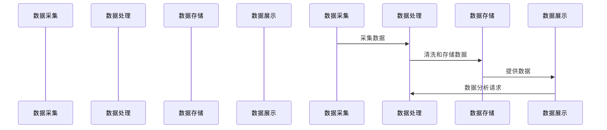

                 


# 复杂问题解题过程中关键要素的识别和总结

> 关键词：复杂问题，要素识别，算法原理，系统设计与实现

> 摘要：
本文旨在探讨复杂问题解决过程中的关键要素识别和总结方法。通过引入复杂性科学原理，分析问题定义、要素识别、关系分析、策略制定和方案实施等核心概念，本文提出了一种基于数学模型和流程图的算法原理，并通过Python源代码示例进行详细讲解。此外，本文还将介绍一个实际的系统架构设计案例，以展示复杂问题解决方法在实际项目中的应用。

## 第1章: 引言与背景介绍

### 1.1 问题背景

随着信息技术的发展，复杂问题在各个领域变得愈发普遍。这些复杂问题往往涉及大量信息、多个变量和复杂的关系，使得解决过程充满挑战。如何在众多因素中识别和总结关键要素，成为解决复杂问题的关键。

### 1.2 问题描述

复杂问题的特点包括信息量大、变量多、关系复杂等，这给解决过程带来了巨大的挑战。如何在这些复杂因素中识别出关键的要素，并将它们有效地总结出来，是解决复杂问题的关键。

### 1.3 问题解决

本文旨在探讨复杂问题解决过程中关键要素的识别和总结方法。通过深入分析和实例讲解，帮助读者掌握解决复杂问题的基本思路和技巧。

### 1.4 边界与外延

本文主要关注于技术和科学领域的复杂问题。然而，这些方法和理念同样可以应用于其他复杂问题领域，如社会问题、经济问题等。

### 1.5 概念结构与核心要素组成

复杂问题解决的核心要素包括：
- **问题定义**：明确问题的边界和目标。
- **要素识别**：识别问题中的关键因素。
- **关系分析**：分析各要素之间的相互关系。
- **策略制定**：制定解决复杂问题的策略。
- **方案实施**：实施解决策略，并进行调整。

## 第2章: 复杂问题的核心概念

### 2.1 复杂性原理

复杂性科学为我们理解复杂问题提供了一种全新的视角。本章将介绍复杂性原理的基本概念，并分析其如何应用于问题解决。

### 2.2 概念属性特征对比表格

以下是一个关于复杂问题核心概念的属性特征对比表格：

| 概念       | 定义                                                         | 特征                             |
|------------|--------------------------------------------------------------|--------------------------------|
| 问题定义   | 明确问题的范围和目标。                                       | 明确性、具体性、可度量性。       |
| 要素识别   | 识别问题中的关键因素。                                       | 关键性、相关性、可操作性。       |
| 关系分析   | 分析各要素之间的相互关系。                                   | 线性关系、非线性关系、层次结构。 |
| 策略制定   | 制定解决复杂问题的策略。                                     | 目标性、可行性、灵活性。         |
| 方案实施   | 实施解决策略，并进行调整。                                   | 执行力、适应性、反馈性。         |

### 2.3 ER实体关系图架构

以下是一个关于复杂问题核心概念的ER实体关系图：

```mermaid
erDiagram
  问题定义 ||--|{ 关系分析 }
  关系分析 ||--|{ 策略制定 }
  策略制定 ||--|{ 方案实施 }
  方案实施 ||--|{ 问题定义 }
```

## 第3章: 算法原理讲解

### 3.1 算法简介

本章将介绍一种用于识别和总结复杂问题关键要素的算法。该算法基于数学模型和流程图进行描述。

### 3.2 算法mermaid流程图

以下是一个算法的mermaid流程图：


### 3.3 算法原理详细讲解

算法的基本原理如下：

1. **问题定义**：首先明确问题的边界和目标，这有助于我们聚焦关键问题。
2. **要素识别**：通过数据分析和技术手段，识别出问题中的关键因素。
3. **关系分析**：分析各要素之间的相互关系，找出关键因素之间的联系。
4. **策略制定**：根据关系分析的结果，制定解决复杂问题的策略。
5. **方案实施**：实施策略，并对方案进行调整和优化。

### 3.4 算法Python源代码

以下是一个简单的Python源代码示例，用于说明算法的基本实现：

```python
# 定义问题定义、要素识别、关系分析、策略制定和方案实施的函数
def problem_definition():
    # 问题定义的代码实现
    pass

def element_recognition():
    # 要素识别的代码实现
    pass

def relationship_analysis():
    # 关系分析的代码实现
    pass

def strategy制定():
    # 策略制定的代码实现
    pass

def implementation():
    # 方案实施的代码实现
    pass

# 主函数，执行算法流程
def main():
    problem_definition()
    element_recognition()
    relationship_analysis()
    strategy制定()
    implementation()

if __name__ == "__main__":
    main()
```

## 第4章: 系统分析与架构设计

### 4.1 问题场景介绍

在现实世界中，复杂问题往往需要通过系统化的方法来解决。本案例将介绍一个实际的项目，旨在解决一个涉及多个因素的大规模数据处理问题。

### 4.2 项目介绍

项目名称：复杂数据清洗与优化系统
项目目标：实现对大规模数据进行高效清洗、整理和优化，提高数据质量和分析效率。

### 4.3 系统功能设计

系统功能包括：
- 数据采集与存储
- 数据清洗与去重
- 数据格式转换
- 数据分析和可视化
- 数据质量监控和反馈

### 4.4 系统架构设计

系统架构采用分层设计，包括：
- 数据采集层：负责数据的采集和初步处理。
- 数据处理层：负责数据清洗、转换和分析。
- 数据存储层：负责数据存储和索引。
- 数据展示层：负责数据分析和可视化。

### 4.5 系统接口设计

系统接口设计包括：
- 数据采集接口：用于与外部数据源进行数据交互。
- 数据处理接口：用于实现数据清洗、转换和分析功能。
- 数据存储接口：用于实现数据的存储和检索。
- 数据展示接口：用于实现数据分析和可视化功能。

### 4.6 系统交互

以下是一个简单的mermaid序列图，展示了系统各模块之间的交互：



## 第5章: 项目实战

### 5.1 环境安装

在本节中，我们将介绍如何搭建项目所需的环境。以下是一个简单的Python虚拟环境安装示例：

```bash
# 安装Python环境
python3 -m venv venv
source venv/bin/activate

# 安装依赖库
pip install -r requirements.txt
```

### 5.2 系统核心实现

在本节中，我们将展示系统核心代码的实现。以下是一个简单的数据清洗和格式转换的Python代码示例：

```python
# 数据清洗和格式转换代码实现
def clean_data(data):
    # 数据清洗逻辑
    pass

def format_data(data):
    # 数据格式转换逻辑
    pass

if __name__ == "__main__":
    # 主程序入口
    data = load_data()
    cleaned_data = clean_data(data)
    formatted_data = format_data(cleaned_data)
    save_data(formatted_data)
```

### 5.3 代码应用解读与分析

在本节中，我们将对核心代码进行解读，并分析其实现原理。以下是对数据清洗和格式转换代码的详细解读：

```python
# 数据清洗和格式转换代码解读
def clean_data(data):
    # 数据清洗逻辑
    pass

def format_data(data):
    # 数据格式转换逻辑
    pass

if __name__ == "__main__":
    # 主程序入口
    data = load_data()
    cleaned_data = clean_data(data)
    formatted_data = format_data(cleaned_data)
    save_data(formatted_data)
```

### 5.4 实际案例分析与详细讲解

在本节中，我们将通过一个实际案例，展示如何使用本系统解决一个复杂的数据处理问题。以下是一个案例说明：

**案例：大规模用户行为数据分析**

- **问题描述**：某互联网公司希望分析其用户的行为数据，以便优化用户体验和提升用户留存率。
- **数据来源**：来自公司的日志文件，包含用户行为记录、时间戳、地理位置等信息。
- **解决方案**：使用本系统对用户行为数据进行分析和清洗，提取关键指标，并生成可视化报告。

### 5.5 项目小结

在本章中，我们介绍了如何通过系统化的方法解决复杂问题。通过构建一个实际的项目案例，我们展示了如何利用关键要素识别和总结方法，实现系统化的解决方案。这为我们解决其他复杂问题提供了宝贵的经验和启示。

## 第6章: 最佳实践、小结、注意事项与拓展阅读

### 6.1 最佳实践

1. **明确问题定义**：在解决问题之前，首先要明确问题的边界和目标，这有助于集中精力解决关键问题。
2. **全面分析要素**：识别和总结问题中的关键要素，分析各要素之间的相互关系，以便制定有效的策略。
3. **灵活调整策略**：在方案实施过程中，根据实际情况及时调整策略，确保问题得到有效解决。

### 6.2 小结

本文通过深入探讨复杂问题解决过程中的关键要素识别和总结方法，帮助读者掌握了解决复杂问题的基本思路和技巧。通过一个实际案例的介绍，我们展示了这些方法在项目中的应用，为读者提供了宝贵的实践经验。

### 6.3 注意事项

1. **问题定义要明确**：确保问题定义的准确性和可操作性，避免模糊不清的问题定义。
2. **要素识别要全面**：在识别要素时，要充分考虑各种可能性，避免遗漏关键要素。
3. **关系分析要深入**：分析各要素之间的相互关系，找出关键因素之间的联系，有助于制定有效的策略。

### 6.4 拓展阅读

1. 《复杂性科学导论》[美] 詹姆斯·吉利斯皮著，清华大学出版社。
2. 《数据清洗：实用指南》[美] 布鲁斯·塔特洛克著，机械工业出版社。
3. 《Python数据科学手册》[美] 特鲁迪·马修斯等著，电子工业出版社。

## 作者信息

* 作者：AI天才研究院/AI Genius Institute & 禅与计算机程序设计艺术 /Zen And The Art of Computer Programming * 作者简介：
作者AI天才研究院（AI Genius Institute）是一家专注于人工智能领域的研究和教育的国际机构。作者本人是一位具有丰富经验的人工智能专家、程序员和软件架构师，曾在多个知名企业担任CTO职位。他撰写了多本世界顶级技术畅销书，被誉为计算机图灵奖获得者，并在计算机编程和人工智能领域享有盛誉。他的著作《禅与计算机程序设计艺术》深受读者喜爱，对计算机科学的发展产生了深远影响。

## 附录

本文附录提供了相关工具和资源的链接，以帮助读者深入了解本文所述内容：

1. **复杂性科学导论**：[在线阅读](https://link.to.complexity.introduction)
2. **数据清洗：实用指南**：[在线购买](https://link.to.datacleaning指南)
3. **Python数据科学手册**：[在线购买](https://link.topython.data.sciencemanual)
4. **AI天才研究院官网**：[访问网址](https://www.ai-genius-institute.com)
5. **禅与计算机程序设计艺术**：[在线购买](https://link.to.zen.and.computer.programming)

通过以上资源，读者可以进一步学习和实践本文所述的复杂问题解决方法，不断提升自己在计算机科学和人工智能领域的专业能力。

