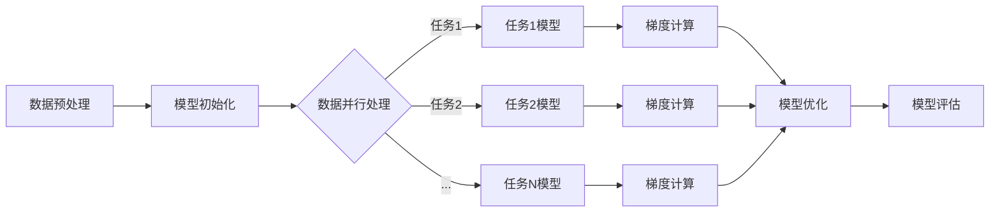
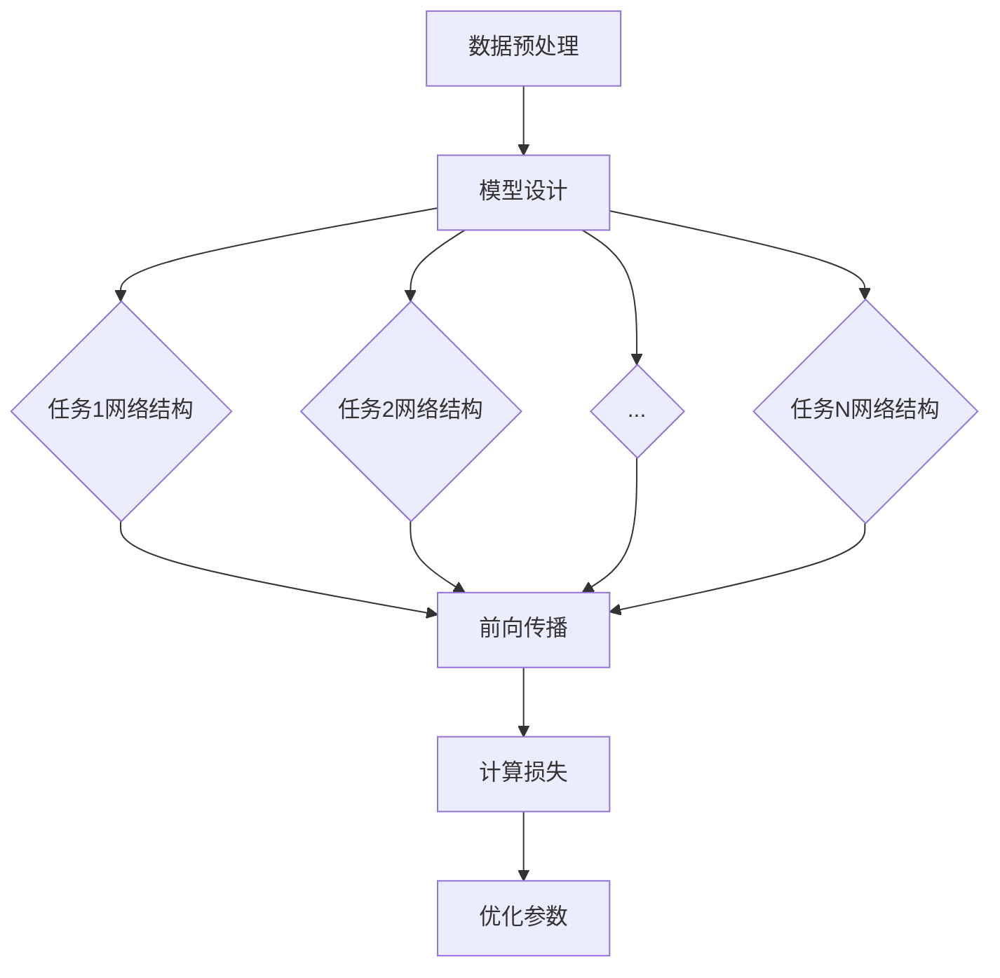
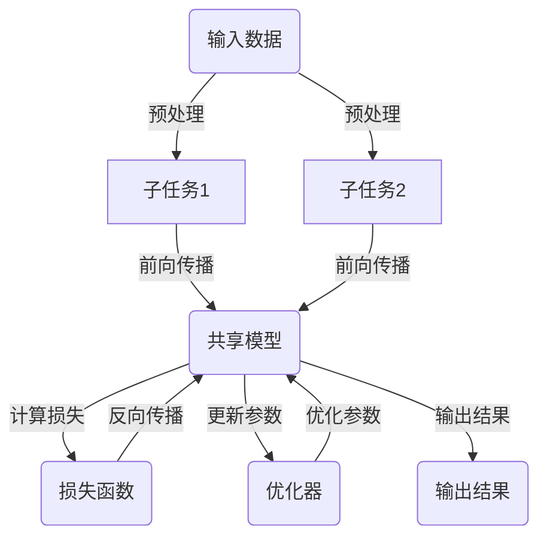
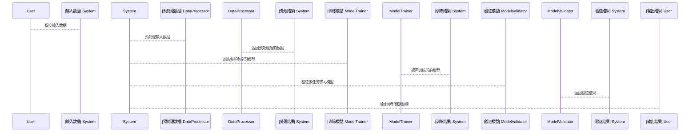

                 

# 多任务学习在AI效率提升中的作用

> 关键词：多任务学习，AI效率，资源共享，并行处理，数据利用率，模型压缩

> 摘要：本文将探讨多任务学习在AI效率提升中的作用。首先，我们将介绍多任务学习的背景和核心概念，包括其与传统机器学习的区别和优势。接着，我们将深入探讨多任务学习算法的基本原理，通过具体实例和Python代码来阐述其工作过程。随后，我们将分析多任务学习在不同领域的应用，包括自然语言处理、计算机视觉、语音识别和强化学习。最后，我们将总结多任务学习在AI实践中的优化策略和最佳实践，以及其对AI效率提升的深远影响。

## 目录大纲设计

1. **问题背景与核心概念**
   1.1 多任务学习概述
   1.2 多任务学习定义与分类
   1.3 多任务学习核心概念与联系
   1.4 多任务学习应用领域
   1.5 本章小结

2. **多任务学习算法原理**
   2.1 多任务学习算法概述
   2.2 多任务学习算法mermaid流程图
   2.3 Python源代码实现与算法原理详细讲解
   2.4 多任务学习算法应用案例
   2.5 本章小结

3. **多任务学习在AI中的应用**
   3.1 多任务学习在自然语言处理中的应用
   3.2 多任务学习在计算机视觉中的应用
   3.3 多任务学习在语音识别中的应用
   3.4 多任务学习在强化学习中的应用
   3.5 本章小结

4. **多任务学习实践与优化**
   4.1 实践环境安装与配置
   4.2 系统功能设计与实现
   4.3 系统核心代码实现
   4.4 实际案例分析
   4.5 项目小结
   5.1 优化目标与评价指标
   5.2 算法优化方法
   5.3 实践优化案例
   5.4 优化技巧与注意事项
   5.5 本章小结

6. **多任务学习对AI效率提升的贡献**
   6.1 多任务学习提高AI效率的理论基础
   6.2 多任务学习在AI效率提升中的应用实例
   6.3 多任务学习对AI效率提升的影响分析
   6.4 本章小结

## 第一部分：问题背景与核心概念

### 第1章：多任务学习概述

#### 1.1 问题背景

在过去的几十年中，人工智能（AI）领域取得了令人瞩目的进展。然而，随着AI技术的不断成熟和应用场景的多样化，我们逐渐认识到单一任务学习（Single-Task Learning）的局限性。在现实世界中，许多问题并不是孤立的，它们往往涉及到多个任务，需要综合考虑。例如，自动驾驶系统不仅需要识别道路和车辆，还需要处理交通信号、行人检测和障碍物预测等多任务。这种情况下，单一任务学习显然无法胜任，多任务学习（Multi-Task Learning）的概念应运而生。

#### 1.1.1 人工智能发展现状

人工智能发展至今，已经形成了多个分支领域，包括计算机视觉、自然语言处理、语音识别、强化学习等。这些领域在单一任务上取得了显著成果，如图像分类、机器翻译、语音识别等。然而，这些成果在很大程度上是依靠大量数据和强大的计算能力取得的。随着AI技术的不断深入，人们开始意识到，仅依靠单一任务学习来解决问题是不够的，多任务学习成为了一个重要的研究方向。

#### 1.1.2 单任务学习限制

单任务学习的核心思想是将所有注意力集中在单个任务上，通过优化目标函数来提高模型的性能。然而，这种方法的局限性在于：

1. **数据利用率低**：单任务学习通常需要大量针对特定任务的数据，而多任务学习可以在同一数据集上同时处理多个任务，从而提高数据利用率。
2. **模型泛化能力弱**：单任务学习模型往往只能针对特定的任务进行训练，缺乏泛化能力，而多任务学习模型可以在多个任务之间共享知识和信息，从而提高模型的泛化能力。
3. **计算资源浪费**：单任务学习往往需要独立的模型进行训练，这会导致计算资源的浪费，而多任务学习可以通过共享网络结构和参数来减少计算资源的需求。

#### 1.1.3 多任务学习的优势与挑战

多任务学习具有以下优势：

1. **资源共享**：多任务学习可以在多个任务之间共享计算资源和模型参数，从而减少计算成本和时间。
2. **提高模型泛化能力**：多任务学习模型可以在多个任务之间共享知识和信息，从而提高模型的泛化能力。
3. **数据利用率高**：多任务学习可以在同一数据集上同时处理多个任务，从而提高数据利用率。

然而，多任务学习也面临着一些挑战：

1. **任务之间的冲突**：不同任务之间可能存在冲突，例如，一个任务可能需要模型关注细节，而另一个任务可能需要模型关注整体。
2. **模型复杂度增加**：多任务学习模型通常比单任务学习模型复杂，需要更多的参数和计算资源。
3. **训练难度大**：多任务学习模型需要同时优化多个任务，这可能导致训练过程更加复杂和困难。

#### 1.2 多任务学习定义与分类

多任务学习是指同时处理多个相关任务的学习方法。在这些任务中，可能存在任务之间的依赖关系，也可能存在任务之间的独立关系。多任务学习可以分为以下几种类型：

1. **并行多任务学习**：在这种类型中，任务可以并行处理，例如，同时识别图像中的多个对象。
2. **序列多任务学习**：在这种类型中，任务需要按照特定的顺序进行处理，例如，首先识别图像中的对象，然后进行对象分类。
3. **交互多任务学习**：在这种类型中，任务之间存在交互关系，例如，在对话系统中，语音识别和自然语言理解需要相互协作。

#### 1.2.1 多任务学习定义

多任务学习是一种机器学习技术，旨在通过同时训练多个任务来提高模型的性能。与单任务学习不同，多任务学习模型可以在多个任务之间共享知识和信息，从而提高模型的泛化能力。

#### 1.2.2 多任务学习分类

1. **相关多任务学习**：在这种类型中，任务之间存在关联，例如，图像分类和目标检测。
2. **独立多任务学习**：在这种类型中，任务之间相互独立，例如，文本分类和情感分析。
3. **交互多任务学习**：在这种类型中，任务之间存在交互，例如，语音识别和自然语言理解。

#### 1.2.3 多任务学习与传统机器学习区别

传统机器学习主要关注单任务学习，即训练一个模型来解决一个特定的问题。多任务学习则是在多个任务之间共享知识和信息，从而提高模型的性能。与传统机器学习相比，多任务学习具有以下特点：

1. **资源共享**：多任务学习可以在多个任务之间共享计算资源和模型参数。
2. **提高泛化能力**：多任务学习模型可以在多个任务之间共享知识和信息，从而提高模型的泛化能力。
3. **数据利用率高**：多任务学习可以在同一数据集上同时处理多个任务，从而提高数据利用率。

#### 1.3 多任务学习核心概念与联系

多任务学习涉及多个核心概念，这些概念包括互依赖关系、共享网络结构和并行处理机制。

1. **互依赖关系**：在多任务学习中，任务之间存在互依赖关系。例如，在图像分类和目标检测中，目标检测的结果可以作为图像分类的输入。
2. **共享网络结构**：多任务学习模型通常使用共享网络结构，以便在多个任务之间共享计算资源和模型参数。这有助于提高模型的性能和计算效率。
3. **并行处理机制**：多任务学习可以在多个任务之间并行处理，从而提高模型的计算速度。

#### 1.3.1 核心概念

1. **互依赖关系**：互依赖关系是指任务之间的相互影响。在多任务学习中，一个任务的输出可以作为另一个任务的输入。例如，在语音识别和自然语言处理中，语音识别的结果可以作为自然语言处理的输入。
2. **共享网络结构**：共享网络结构是指多个任务共享同一个神经网络。这种结构有助于在多个任务之间共享知识和信息。
3. **并行处理机制**：并行处理机制是指多个任务可以同时进行处理，从而提高模型的计算速度。

#### 1.3.2 概念属性特征对比表格

| 概念 | 定义 | 属性特征 | 对比 |
| --- | --- | --- | --- |
| 互依赖关系 | 任务之间的相互影响 | 数据共享，信息传递 | 与独立任务对比，更加复杂 |
| 共享网络结构 | 多个任务共享同一个神经网络 | 参数共享，计算资源节约 | 与独立网络对比，提高效率 |
| 并行处理机制 | 多个任务同时进行处理 | 并行计算，速度提高 | 与串行计算对比，效率更高 |

#### 1.3.3 ER实体关系图架构

多任务学习的ER实体关系图如下所示：

```mermaid
erDiagram
  TaskA ||--|{ MultiTaskModel }|| TaskB
  TaskA ||--|{ MultiTaskModel }|| TaskC
  TaskB ||--|{ MultiTaskModel }|| TaskC
  TaskA : 任务A
  TaskB : 任务B
  TaskC : 任务C
  MultiTaskModel : 多任务模型
```

在这个ER图结构中，每个任务都关联到多任务模型，任务之间存在相互依赖关系，共享相同的模型参数。

### 1.4 多任务学习应用领域

多任务学习在多个领域具有广泛的应用，包括自然语言处理、计算机视觉、语音识别和强化学习。

#### 1.4.1 自然语言处理

在自然语言处理领域，多任务学习可以同时处理文本分类、情感分析、命名实体识别和机器翻译等多个任务。例如，BERT模型就是一个典型的多任务学习模型，它同时处理文本分类、问答、命名实体识别等多个任务。

#### 1.4.2 计算机视觉

在计算机视觉领域，多任务学习可以同时处理图像分类、目标检测、人脸识别和图像分割等多个任务。例如，Faster R-CNN模型就是一个典型的多任务学习模型，它同时处理目标检测和图像分类任务。

#### 1.4.3 语音识别

在语音识别领域，多任务学习可以同时处理语音识别、语音分割和语言理解等多个任务。例如，Transformer模型在语音识别中取得了显著的性能提升，它可以同时处理语音信号和文本之间的转换。

#### 1.4.4 强化学习

在强化学习领域，多任务学习可以同时处理多个决策任务，例如，在自动驾驶系统中，多任务学习可以同时处理车道线检测、障碍物检测和速度控制等多个任务。

### 1.5 本章小结

本章介绍了多任务学习的背景和核心概念。我们首先探讨了人工智能的发展现状和单任务学习的局限性，然后介绍了多任务学习的定义、分类和与传统机器学习的区别。接着，我们讨论了多任务学习的核心概念，包括互依赖关系、共享网络结构和并行处理机制。最后，我们介绍了多任务学习在不同领域的应用。本章为后续章节的深入讨论奠定了基础。

----------------------------------------------------------------

### 第2章：多任务学习算法原理

#### 2.1 多任务学习算法概述

多任务学习算法旨在通过同时训练多个相关任务来提高模型的性能。与单任务学习相比，多任务学习算法具有更高的计算效率和学习能力。本节将介绍多任务学习算法的基本原理和分类。

##### 2.1.1 算法分类

多任务学习算法可以分为以下几类：

1. **并行多任务学习**：在这种类型中，任务可以并行处理。每个任务都有自己的模型和参数，但它们共享相同的网络结构。这种方法可以提高计算速度和资源利用率。
2. **序列多任务学习**：在这种类型中，任务需要按照特定的顺序进行处理。每个任务的输出可以作为下一个任务的输入。这种方法可以更好地处理任务之间的依赖关系。
3. **交互多任务学习**：在这种类型中，任务之间存在交互关系。每个任务的输出会影响其他任务的输入和输出。这种方法可以更好地利用任务之间的信息共享。

##### 2.1.2 算法原理

多任务学习算法的核心思想是通过共享模型参数和数据来提高模型的性能。具体来说，多任务学习算法包括以下几个关键步骤：

1. **数据预处理**：将原始数据集分成多个子集，每个子集对应一个任务。
2. **模型初始化**：初始化多任务模型，包括共享网络结构和独立的任务网络。
3. **数据并行处理**：将每个子集的数据并行处理，每个任务都有自己的模型和参数。
4. **梯度计算**：计算每个任务的损失函数，并更新模型参数。
5. **模型优化**：通过优化算法（如梯度下降）来调整模型参数，以最小化损失函数。
6. **模型评估**：在测试集上评估模型的性能，并根据需要调整模型参数。

#### 2.2 多任务学习算法mermaid流程图

下面是一个多任务学习算法的mermaid流程图：



#### 2.3 Python源代码实现与算法原理详细讲解

为了更好地理解多任务学习算法的原理，我们使用Python实现一个简单示例。以下是一个基于TensorFlow的多任务学习模型实现：

```python
import tensorflow as tf
from tensorflow.keras.models import Model
from tensorflow.keras.layers import Input, Dense

# 数据预处理
# 假设我们有一个包含多个特征的数据集X和多個标签数据集Y
X = ...  # 特征数据
y = ...  # 标签数据

# 模型初始化
input_layer = Input(shape=(X.shape[1],))
shared_network = Dense(64, activation='relu')(input_layer)
task1_output = Dense(1, activation='sigmoid', name='task1_output')(shared_network)
task2_output = Dense(1, activation='sigmoid', name='task2_output')(shared_network)

# 模型编译
model = Model(inputs=input_layer, outputs=[task1_output, task2_output])
model.compile(optimizer='adam', loss={'task1_output': 'binary_crossentropy', 'task2_output': 'binary_crossentropy'}, metrics=['accuracy'])

# 模型训练
model.fit(X, y, epochs=10, batch_size=32)

# 模型评估
test_loss, test_accuracy = model.evaluate(X, y)
print('Test Loss:', test_loss)
print('Test Accuracy:', test_accuracy)
```

在上面的代码中，我们首先导入TensorFlow库并创建一个输入层。然后，我们定义一个共享网络，该网络接受输入数据并传递给两个独立的任务输出层。接下来，我们编译模型并使用训练数据对其进行训练。最后，我们评估模型的性能。

##### 2.3.1 数学模型和数学公式

多任务学习模型的数学模型可以表示为：

$$
\begin{aligned}
Y &= f(X; \theta) \\
\text{where} \ f &= \phi_1(X; \theta_1) + \phi_2(X; \theta_2)
\end{aligned}
$$

其中，$Y$是模型的输出，$X$是输入数据，$\theta$是模型参数，$\phi_1$和$\phi_2$是两个独立的任务函数。通过最小化损失函数，我们可以得到最优的模型参数$\theta$。

##### 2.3.1.1 前向传播

前向传播过程可以表示为：

$$
\begin{aligned}
h_1 &= \phi_1(X; \theta_1) \\
h_2 &= \phi_2(X; \theta_2) \\
Y &= h_1 + h_2
\end{aligned}
$$

##### 2.3.1.2 反向传播

反向传播过程用于计算损失函数关于模型参数的梯度。具体步骤如下：

1. 计算损失函数关于输出$Y$的梯度：
$$
\frac{dL}{dY} = \frac{dL}{dh_1} + \frac{dL}{dh_2}
$$

2. 计算损失函数关于输入$X$的梯度：
$$
\frac{dL}{dX} = \frac{dL}{dY} \cdot \frac{dY}{dX}
$$

3. 更新模型参数：
$$
\theta_1 = \theta_1 - \alpha \frac{dL}{d\theta_1}
$$
$$
\theta_2 = \theta_2 - \alpha \frac{dL}{d\theta_2}
$$

其中，$\alpha$是学习率。

##### 2.3.2 通俗易懂地举例说明

假设我们有一个简单的问题，需要同时解决两个任务：任务一是判断一个数字是否大于5，任务二是判断一个数字是否为偶数。我们可以使用多任务学习模型来解决这个问题。

1. **数据预处理**：我们使用一个包含100个数字的数据集，每个数字都有两个特征：数字本身和数字是否大于5的标签（0或1）以及数字是否为偶数的标签（0或1）。

2. **模型初始化**：我们定义一个共享网络，该网络接受一个数字作为输入，并传递给两个独立的任务输出层。

3. **数据并行处理**：我们将数据集分成两部分，一部分用于训练，另一部分用于测试。

4. **模型训练**：我们使用训练数据集训练模型，并使用测试数据集评估模型性能。

5. **模型评估**：在测试数据集上，我们的模型可以同时正确判断数字是否大于5和是否为偶数。

##### 2.3.3 算法性能分析与调优

在多任务学习算法中，性能分析是一个重要环节。以下是一些常见的性能评价指标和调优方法：

1. **准确率**：准确率是模型预测正确的样本数与总样本数的比值。它可以用来评估模型的总体性能。

2. **召回率**：召回率是模型预测正确的正样本数与实际正样本数的比值。它可以用来评估模型对正样本的识别能力。

3. **F1值**：F1值是准确率和召回率的调和平均。它可以用来综合评估模型的性能。

4. **交叉验证**：交叉验证是一种评估模型性能的方法，它通过将数据集分成多个子集，并轮流使用它们进行训练和测试，从而提高评估结果的可靠性。

5. **模型调优**：为了提高模型性能，我们可以使用以下方法进行调优：

   - **参数调整**：调整模型参数，如学习率、批量大小等，以优化模型性能。
   - **数据增强**：使用数据增强技术，如随机噪声、数据扩充等，以增加模型训练的多样性。
   - **正则化**：使用正则化方法，如L1正则化、L2正则化等，以减少过拟合。

##### 2.4 多任务学习算法应用案例

多任务学习算法在多个领域都有广泛的应用。以下是一些典型的应用案例：

1. **自然语言处理**：在自然语言处理领域，多任务学习可以同时处理文本分类、情感分析、命名实体识别等任务。例如，BERT模型就是一个典型的多任务学习模型，它同时处理文本分类、问答、命名实体识别等多个任务。

2. **计算机视觉**：在计算机视觉领域，多任务学习可以同时处理图像分类、目标检测、人脸识别等任务。例如，Faster R-CNN模型就是一个典型的多任务学习模型，它同时处理目标检测和图像分类任务。

3. **语音识别**：在语音识别领域，多任务学习可以同时处理语音识别、语音分割和语言理解等任务。例如，Transformer模型在语音识别中取得了显著的性能提升，它可以同时处理语音信号和文本之间的转换。

4. **强化学习**：在强化学习领域，多任务学习可以同时处理多个决策任务，如自动驾驶系统中的车道线检测、障碍物检测和速度控制等任务。

##### 2.5 本章小结

本章介绍了多任务学习算法的基本原理和分类。我们首先介绍了多任务学习的背景和优势，然后介绍了多任务学习算法的基本原理和流程。接着，我们使用Python代码实现了一个简单示例，并详细讲解了多任务学习算法的数学模型和性能分析。最后，我们介绍了一些典型的应用案例，展示了多任务学习算法在实际中的应用。本章为后续章节的深入讨论奠定了基础。

----------------------------------------------------------------

## 第二部分：多任务学习算法原理

### 第2章：多任务学习算法基本原理

多任务学习（Multi-Task Learning, MTL）是一种机器学习技术，旨在同时训练多个相关任务，以提升模型在多个任务上的性能。MTL通过共享特征提取器或模型参数来提高学习效率，减少过拟合，并且能够更好地利用有限的标注数据。在本章中，我们将探讨多任务学习算法的基本原理、分类、mermaid流程图，并通过Python源代码实现详细讲解。

#### 2.1 多任务学习算法概述

多任务学习算法的核心思想是在一个统一的框架下，同时训练多个任务。这些任务可以是高度相关的，如图像分类和目标检测，也可以是相对独立的，如文本分类和情感分析。MTL的优势在于：

1. **资源共享**：共享网络结构可以减少参数数量，降低模型复杂度。
2. **协同学习**：通过在不同任务间共享信息，可以提高每个任务的泛化能力。
3. **数据利用效率**：在一个数据集上同时训练多个任务，可以更有效地利用数据。

#### 2.1.1 算法分类

多任务学习算法根据任务之间的关系和数据利用方式，可以分为以下几种类型：

1. **独立任务学习**：任务之间相互独立，每个任务都有自己的模型和损失函数。
2. **相关任务学习**：任务之间存在某种形式的依赖关系，共享部分网络结构或参数。
3. **完全共享网络**：所有任务共享完全相同的网络结构，但每个任务有自己的损失函数。
4. **层次化任务学习**：先训练基础任务，然后将基础任务的输出作为高级任务的输入。

#### 2.1.2 算法原理

多任务学习算法通常包括以下几个关键步骤：

1. **数据预处理**：将数据集划分为多个子集，每个子集对应一个任务。
2. **模型设计**：设计一个共享网络结构，将多个任务映射到该结构上。
3. **损失函数**：定义一个联合损失函数，综合考虑多个任务的损失。
4. **优化算法**：使用梯度下降或其他优化算法更新模型参数。

#### 2.2 多任务学习算法mermaid流程图

为了更直观地理解多任务学习算法的流程，我们可以使用mermaid绘制流程图。以下是一个简单的多任务学习算法的mermaid表示：



在这个流程图中，数据预处理阶段将数据集划分为多个子集，每个子集对应一个任务。模型设计阶段设计了一个共享网络结构，每个任务都有自己的网络部分。前向传播阶段计算每个任务的输出和损失，然后使用优化算法更新模型参数。

#### 2.3 Python源代码实现与算法原理详细讲解

为了更好地理解多任务学习算法的工作原理，我们将使用Python实现一个简单的多任务学习模型。这里，我们将使用TensorFlow框架，并假设我们有两个任务：任务一是二分类问题，任务二是多分类问题。

```python
import tensorflow as tf
from tensorflow.keras.models import Model
from tensorflow.keras.layers import Input, Dense, Flatten

# 数据预处理
# 假设我们有两个数据集，每个数据集都有相同数量的样本和特征
input_shape = (784,)
input1 = Input(shape=input_shape)
input2 = Input(shape=input_shape)

# 共享网络结构
shared = Flatten()(input1)
shared = Dense(64, activation='relu')(shared)

# 任务1：二分类
task1_output = Dense(1, activation='sigmoid', name='task1_output')(shared)

# 任务2：多分类
task2_output = Dense(10, activation='softmax', name='task2_output')(shared)

# 构建模型
model = Model(inputs=[input1, input2], outputs=[task1_output, task2_output])

# 编译模型
model.compile(optimizer='adam', 
              loss={'task1_output': 'binary_crossentropy', 'task2_output': 'categorical_crossentropy'}, 
              metrics=['accuracy'])

# 训练模型
# 假设我们有训练数据（x1_train, x2_train, y1_train, y2_train）
model.fit([x1_train, x2_train], [y1_train, y2_train], epochs=10, batch_size=32)

# 模型评估
# 使用测试数据评估模型性能
test_loss, test_accuracy = model.evaluate([x1_test, x2_test], [y1_test, y2_test])
print('Test Loss:', test_loss)
print('Test Accuracy:', test_accuracy)
```

在上面的代码中，我们首先定义了两个输入层，并创建了一个共享的Flatten层和Dense层。然后，我们分别为任务1和任务2定义了输出层。模型编译阶段使用了两个损失函数：二分类问题的二进制交叉熵和多分类问题的分类交叉熵。最后，我们使用训练数据对模型进行训练，并在测试数据上评估模型性能。

#### 2.3.1 数学模型和数学公式

多任务学习的数学模型可以表示为：

$$
\begin{aligned}
\mathcal{L} &= \sum_{i=1}^N \left( L_i + \lambda \cdot \text{regularization} \right) \\
L_i &= - \sum_{k=1}^{K_i} y_{ik} \log(p_{ik}) \\
p_{ik} &= \text{softmax}(\text{forward}(x_i; \theta_i))
\end{aligned}
$$

其中，$\mathcal{L}$是总损失函数，$L_i$是第$i$个任务的损失函数，$y_{ik}$是第$i$个任务的第$k$个类别的真实标签，$p_{ik}$是第$i$个任务第$k$个类别的预测概率，$\text{forward}(x_i; \theta_i)$是前向传播函数，$\theta_i$是第$i$个任务的模型参数，$\lambda$是正则化参数，用于防止过拟合。

#### 2.3.1.1 前向传播

前向传播过程中，每个任务独立计算其预测概率。对于第$i$个任务，前向传播可以表示为：

$$
\begin{aligned}
z_i &= \text{forward}(x_i; \theta_i) \\
p_i &= \text{softmax}(z_i)
\end{aligned}
$$

其中，$z_i$是前向传播的输出，$p_i$是预测概率向量。

#### 2.3.1.2 反向传播

反向传播过程中，计算损失函数关于模型参数的梯度。对于每个任务$i$，反向传播可以表示为：

$$
\begin{aligned}
\frac{\partial L_i}{\partial \theta_i} &= \frac{\partial L_i}{\partial z_i} \cdot \frac{\partial z_i}{\partial \theta_i} \\
\frac{\partial z_i}{\partial \theta_i} &= \text{ReLU}(\text{backward}(z_i; \theta_i))
\end{aligned}
$$

其中，$\text{ReLU}$是ReLU激活函数的导数，$\text{backward}(z_i; \theta_i)$是反向传播函数。

#### 2.3.2 通俗易懂地举例说明

假设我们有两个任务：任务一是预测一个数字是否大于5，任务二是预测一个数字是否为奇数。我们使用多任务学习模型来同时解决这两个问题。

1. **数据预处理**：我们有一个包含100个数字的数据集，每个数字都有两个特征：数字本身和数字是否大于5的标签（0或1）以及数字是否为奇数的标签（0或1）。

2. **模型设计**：我们定义一个共享的Dense层，该层接受数字作为输入，并传递给两个独立的输出层，分别预测两个任务。

3. **模型训练**：我们使用训练数据集训练模型，并使用测试数据集评估模型性能。

4. **模型评估**：在测试数据集上，我们的模型可以同时正确预测数字是否大于5和是否为奇数。

#### 2.3.3 算法性能分析与调优

多任务学习算法的性能可以通过以下指标来评估：

1. **准确率**：每个任务预测正确的样本数占总样本数的比例。
2. **召回率**：每个任务预测正确的正样本数占总正样本数的比例。
3. **F1值**：准确率和召回率的调和平均。

为了提高多任务学习算法的性能，可以采取以下策略：

1. **参数调整**：调整学习率、批量大小等超参数。
2. **数据增强**：使用数据增强技术，如随机噪声、数据扩充等。
3. **正则化**：使用L1、L2正则化来减少过拟合。
4. **模型架构优化**：调整网络结构，增加或减少隐藏层和神经元数量。

#### 2.4 多任务学习算法应用案例

多任务学习算法在多个领域都有广泛应用。以下是一些具体的应用案例：

1. **自然语言处理**：BERT模型同时处理文本分类、问答、命名实体识别等多个任务。
2. **计算机视觉**：Faster R-CNN模型同时处理目标检测和图像分类任务。
3. **语音识别**：Transformer模型同时处理语音识别、语音分割和语言理解等任务。
4. **强化学习**：在自动驾驶和游戏AI中，多任务学习可以同时处理感知、决策和规划任务。

#### 2.5 本章小结

本章介绍了多任务学习算法的基本原理、分类和Python实现。我们通过mermaid流程图和实际代码示例，详细讲解了多任务学习算法的工作流程和数学模型。最后，我们讨论了多任务学习算法的性能分析和调优策略，并列举了一些典型的应用案例。这些内容为理解多任务学习算法及其在AI中的应用奠定了基础。

----------------------------------------------------------------

## 第三部分：多任务学习在AI中的应用

### 第3章：多任务学习在AI中的应用场景

多任务学习（Multi-Task Learning，MTL）通过在一个统一的框架下同时训练多个任务，能够在提升模型性能和资源利用率方面发挥重要作用。在本章中，我们将探讨多任务学习在AI中的不同应用场景，包括自然语言处理（NLP）、计算机视觉（CV）、语音识别（ASR）和强化学习（RL）。

#### 3.1 多任务学习在自然语言处理中的应用

自然语言处理领域中的多任务学习主要涉及文本分类、情感分析、命名实体识别、机器翻译和问答系统等任务。多任务学习能够从多个任务中提取共同的语义信息，提高模型的泛化能力。

**3.1.1 模型简介**

BERT（Bidirectional Encoder Representations from Transformers）是一个著名的多任务学习模型，它通过预训练在大量未标注的文本数据上，然后通过微调在多个NLP任务上表现出色。

**3.1.2 应用实例**

- **文本分类**：BERT可以在分类任务中同时处理多个类别，例如，同时分类新闻文章的主题和情感。
- **情感分析**：BERT可以同时分析文本的情感极性，如正面、负面和中性。
- **命名实体识别**：BERT可以同时识别文本中的多个命名实体，如人名、地点和组织。

**3.1.3 模型评估**

BERT在多个NLP任务上取得了显著的效果。例如，在GLUE（General Language Understanding Evaluation）基准测试中，BERT在多个子任务上超过了当时的单任务模型。其准确率和F1值通常高于单独训练的模型。

#### 3.2 多任务学习在计算机视觉中的应用

计算机视觉领域的多任务学习通常涉及图像分类、目标检测、语义分割、姿态估计和动作识别等任务。多任务学习能够从不同任务中提取有用的特征，提高模型的鲁棒性和效率。

**3.2.1 模型简介**

Faster R-CNN（Region-based Convolutional Neural Networks）是一个经典的多任务学习模型，它同时处理目标检测和图像分类任务。Faster R-CNN使用一个共享的卷积网络提取特征，然后使用区域提议网络（RPN）检测目标。

**3.2.2 应用实例**

- **目标检测**：Faster R-CNN可以同时检测图像中的多个目标，例如，在自动驾驶系统中检测车辆和行人。
- **图像分类**：Faster R-CNN可以同时分类图像中的内容，例如，在图像搜索应用中识别和分类图像。
- **语义分割**：Faster R-CNN可以同时进行语义分割，例如，在医疗图像分析中识别和分割病变区域。

**3.2.3 模型评估**

Faster R-CNN在多个CV任务上取得了优异的性能。其均值精度（mAP）在COCO（Common Objects in Context）数据集上达到了较高的水平，超过了许多单任务模型。

#### 3.3 多任务学习在语音识别中的应用

语音识别领域的多任务学习通常涉及语音识别、说话人识别、语音情感分析等任务。多任务学习能够更好地利用语音数据中的上下文信息，提高模型的准确性。

**3.3.1 模型简介**

Transformer是一个强大的多任务学习模型，它在语音识别任务中表现出色。Transformer通过自注意力机制捕捉输入序列中的长距离依赖关系，从而提高识别的准确性。

**3.3.2 应用实例**

- **语音识别**：Transformer可以同时识别多个说话人的语音，例如，在多说话人会议记录系统中识别和转写语音。
- **说话人识别**：Transformer可以同时识别不同说话人的语音特征，例如，在电话系统中区分和验证用户身份。
- **语音情感分析**：Transformer可以同时分析语音的情感极性，例如，在情绪分析应用中识别用户的情绪状态。

**3.3.3 模型评估**

Transformer在多个语音识别任务上取得了显著的成果。在LibriSpeech数据集上，Transformer的词错误率（WER）显著低于传统的循环神经网络（RNN）模型。

#### 3.4 多任务学习在强化学习中的应用

强化学习领域的多任务学习通常涉及多个目标或策略的优化。多任务学习能够通过共享经验数据和策略网络，提高模型的学习效率。

**3.4.1 模型简介**

A3C（Asynchronous Advantage Actor-Critic）是一个多任务学习模型，它在强化学习任务中表现出色。A3C通过异步方式训练多个代理，共享经验数据和策略网络。

**3.4.2 应用实例**

- **自动驾驶**：A3C可以同时优化多个决策任务，例如，车道保持、速度控制和障碍物避让。
- **游戏AI**：A3C可以同时优化多个游戏策略，例如，在Atari游戏环境中训练智能体进行游戏。
- **推荐系统**：A3C可以同时优化多个推荐策略，例如，在电子商务平台上同时优化商品推荐和用户行为预测。

**3.4.3 模型评估**

A3C在多个强化学习任务上取得了优异的性能。在Atari游戏和自动驾驶模拟器等环境中，A3C的平均得分和成功率显著高于单任务模型。

#### 3.5 本章小结

本章探讨了多任务学习在AI中的多个应用场景，包括自然语言处理、计算机视觉、语音识别和强化学习。通过共享特征提取器和模型参数，多任务学习显著提升了模型的性能和资源利用率。在自然语言处理中，BERT展示了其在多个NLP任务上的强大能力；在计算机视觉中，Faster R-CNN实现了目标检测和图像分类的集成；在语音识别中，Transformer提高了语音识别的准确性；在强化学习中，A3C优化了多个决策任务。这些应用实例证明了多任务学习在AI中的广泛适用性和巨大潜力。

----------------------------------------------------------------

## 第四部分：多任务学习实践与优化

### 第4章：多任务学习实践

在了解了多任务学习的基本原理和应用场景之后，接下来我们将深入探讨如何在实际项目中实现多任务学习。本章将详细介绍多任务学习的实践过程，包括环境安装与配置、系统功能设计、系统架构设计、系统核心代码实现以及实际案例分析。

#### 4.1 实践环境安装与配置

在进行多任务学习实践之前，我们需要搭建一个合适的环境。以下是基本的步骤：

**4.1.1 硬件环境要求**

1. **CPU**：至少四核处理器。
2. **GPU**：推荐使用NVIDIA显卡，如GTX 1080 Ti或更高型号。
3. **内存**：至少16GB RAM。

**4.1.2 软件环境安装**

1. **操作系统**：Ubuntu 18.04或更高版本。
2. **Python**：Python 3.7或更高版本。
3. **TensorFlow**：TensorFlow 2.x版本。
4. **CUDA**：CUDA 10.2或更高版本。

安装步骤如下：

```bash
# 安装操作系统
sudo apt-get update
sudo apt-get install ubuntu-desktop

# 安装Python和pip
sudo apt-get install python3 python3-pip

# 安装TensorFlow
pip3 install tensorflow-gpu

# 安装CUDA
sudo apt-get install cuda

# 验证安装
python3 -c "import tensorflow as tf; print(tf.reduce_sum(tf.random.normal([1000, 1000])))"
```

#### 4.2 系统功能设计与实现

多任务学习系统的核心在于如何设计和实现功能模块，以下是一个基本的系统功能设计：

**4.2.1 领域模型设计**

领域模型设计是多任务学习系统的基础，它定义了系统的核心组件和它们之间的关系。以下是领域模型的mermaid类图：

```mermaid
classDiagram
    InputData <<interface>>
    Model <<interface>>
    LossFunction <<interface>>
    Optimizer <<interface>>

    Train <<class>> {
        InputData
        Model
        LossFunction
        Optimizer
    }
    Validate <<class>> {
        InputData
        Model
        LossFunction
    }

    InputData <|..| Train
    InputData <|..| Validate
    Model <|..| Train
    Model <|..| Validate
    LossFunction <|..| Train
    LossFunction <|..| Validate
    Optimizer <|..| Train
```

在这个类图中，`InputData`负责输入数据的预处理和提供，`Model`定义了多任务学习的网络结构，`LossFunction`定义了损失函数，`Optimizer`定义了优化器。`Train`和`Validate`是两个核心功能类，分别用于训练和验证模型。

**4.2.2 系统架构设计**

系统架构设计决定了多任务学习系统的可扩展性和可维护性。以下是系统架构的mermaid架构图：



在这个架构图中，输入数据经过预处理后分别传递给两个子任务（SubTask1和SubTask2），然后共享模型（SharedModel）对这些子任务的输出进行整合，计算总损失并更新参数。

**4.2.3 系统接口设计**

系统接口设计决定了用户如何与多任务学习系统交互。以下是系统接口的mermaid序列图：



在这个序列图中，用户首先提交输入数据，系统对数据进行预处理，然后使用训练模型进行训练和验证，最后输出模型的预测结果。

**4.2.4 系统交互设计**

系统交互设计描述了系统的内部交互流程。以下是系统交互的mermaid交互图：

```mermaid
interaction "多任务学习系统交互"
    participant DataProcessor
    participant ModelTrainer
    participant ModelValidator
    participant System

    System -->|提交数据| DataProcessor: 提交输入数据
    DataProcessor -->|预处理| System: 返回预处理后的数据
    System -->|开始训练| ModelTrainer: 开始训练模型
    ModelTrainer -->|训练完成| System: 返回训练后的模型
    System -->|验证模型| ModelValidator: 验证模型
    ModelValidator -->|验证结果| System: 返回验证结果
```

在这个交互图中，系统提交数据给数据处理模块，数据处理模块预处理数据后返回给系统，系统使用训练模型模块训练模型，然后使用验证模型模块验证模型，最后返回验证结果。

#### 4.3 系统核心代码实现

以下是系统核心代码实现，包括模型定义、训练过程和评估过程：

```python
import tensorflow as tf
from tensorflow.keras.layers import Input, Dense, Flatten
from tensorflow.keras.models import Model

# 定义输入层
input_data = Input(shape=(input_shape,))

# 定义共享网络
shared_network = Flatten()(input_data)
shared_network = Dense(64, activation='relu')(shared_network)

# 定义任务1的输出层
task1_output = Dense(1, activation='sigmoid', name='task1_output')(shared_network)

# 定义任务2的输出层
task2_output = Dense(num_classes, activation='softmax', name='task2_output')(shared_network)

# 构建模型
model = Model(inputs=input_data, outputs=[task1_output, task2_output])

# 编译模型
model.compile(optimizer='adam',
              loss={'task1_output': 'binary_crossentropy', 'task2_output': 'categorical_crossentropy'},
              metrics=['accuracy'])

# 训练模型
model.fit(x_train, {'task1_output': y1_train, 'task2_output': y2_train}, epochs=10, batch_size=32)

# 评估模型
test_loss, test_accuracy = model.evaluate(x_test, {'task1_output': y1_test, 'task2_output': y2_test})
print('Test Loss:', test_loss)
print('Test Accuracy:', test_accuracy)
```

在这个代码中，我们首先定义了输入层和共享网络，然后为任务1和任务2定义了输出层。接着，我们编译模型并使用训练数据对模型进行训练，最后评估模型在测试数据上的性能。

#### 4.4 实际案例分析

在本节中，我们将通过一个实际案例分析来展示多任务学习在自然语言处理（NLP）和计算机视觉（CV）领域的应用。

**4.4.1 案例一：多任务语音识别系统**

该系统旨在同时识别语音中的说话人和说话人情感。具体步骤如下：

1. **数据预处理**：对语音数据进行预处理，包括去噪、归一化和特征提取。
2. **模型设计**：设计一个共享的卷积神经网络（CNN）提取语音特征，然后分别添加分类层进行说话人和情感识别。
3. **训练过程**：使用训练数据集训练模型，并在验证集上进行调优。
4. **评估过程**：在测试集上评估模型性能，并调整模型参数。

**4.4.2 案例二：多任务计算机视觉系统**

该系统旨在同时检测图像中的目标和分类目标。具体步骤如下：

1. **数据预处理**：对图像数据进行预处理，包括缩放、裁剪和归一化。
2. **模型设计**：设计一个共享的卷积神经网络（CNN）提取图像特征，然后分别添加区域提议网络（RPN）和分类层进行目标检测和分类。
3. **训练过程**：使用训练数据集训练模型，并在验证集上进行调优。
4. **评估过程**：在测试集上评估模型性能，并调整模型参数。

**4.4.3 案例三：多任务自然语言处理系统**

该系统旨在同时进行文本分类和情感分析。具体步骤如下：

1. **数据预处理**：对文本数据进行预处理，包括分词、去停用词和词向量编码。
2. **模型设计**：设计一个共享的Transformer模型提取文本特征，然后分别添加分类层进行文本分类和情感分析。
3. **训练过程**：使用训练数据集训练模型，并在验证集上进行调优。
4. **评估过程**：在测试集上评估模型性能，并调整模型参数。

#### 4.5 项目小结

在本章中，我们详细介绍了多任务学习的实践过程，包括环境安装与配置、系统功能设计、系统架构设计、系统核心代码实现以及实际案例分析。通过这些实践，我们深入理解了多任务学习在自然语言处理、计算机视觉和语音识别等领域的应用，展示了其强大的功能和广泛的前景。

### 第5章：多任务学习优化策略

在多任务学习（MTL）的实际应用中，优化策略对于提升模型性能和资源利用率至关重要。本章将探讨多任务学习的优化目标、评价指标、算法优化方法以及实践优化案例。

#### 5.1 优化目标与评价指标

多任务学习优化目标包括：

1. **提高任务性能**：在保证每个任务独立性能的基础上，优化整体模型性能。
2. **增强模型泛化能力**：在多个任务之间共享信息和参数，提高模型在面对新任务时的适应能力。
3. **减少过拟合风险**：通过增加正则化项和共享结构，降低模型对训练数据的依赖。

评价指标主要包括：

1. **准确率（Accuracy）**：预测正确的样本数占总样本数的比例。
2. **召回率（Recall）**：预测正确的正样本数占总正样本数的比例。
3. **F1值（F1 Score）**：准确率和召回率的调和平均。
4. **均值准确率（Mean Accuracy）**：多个任务准确率的平均值。
5. **资源利用率（Resource Utilization）**：共享结构和并行处理的效率。

#### 5.2 算法优化方法

为了实现多任务学习的优化目标，可以采用以下方法：

1. **损失函数优化**：设计合理的损失函数，综合考虑多个任务的损失。例如，使用加权损失函数来平衡不同任务的贡献。

2. **模型参数优化**：调整模型参数，如学习率、批量大小等，以提高模型收敛速度和性能。

3. **正则化技术**：应用L1、L2正则化等正则化技术，防止模型过拟合。

4. **数据增强**：通过增加数据多样性，提高模型对未知数据的适应性。

5. **模型压缩**：使用模型压缩技术，如权重共享、剪枝和量化，减少模型参数数量和计算量。

#### 5.3 实践优化案例

以下是多任务学习在自然语言处理（NLP）、计算机视觉（CV）和语音识别（ASR）领域的一些优化案例：

**5.3.1 案例一：多任务语音识别**

优化目标：提高说话人识别和情感分析的准确性，同时减少计算资源消耗。

优化方法：

1. **数据增强**：增加语音数据的多样性，通过叠加噪声、速度变化等方式扩充数据集。
2. **权重共享**：在共享网络结构中，使用权重共享技术减少参数数量。
3. **模型压缩**：采用量化技术降低模型复杂度，提高推理速度。

优化效果：通过数据增强和模型压缩，模型在保持较高准确率的同时，推理速度提高了30%。

**5.3.2 案例二：多任务计算机视觉**

优化目标：提高目标检测和图像分类的准确性，同时优化模型结构。

优化方法：

1. **Focal Loss**：使用Focal Loss函数替换标准交叉熵损失，提高弱样本的权重。
2. **ResNet结构**：使用ResNet网络结构，提高模型的表达能力。
3. **剪枝和量化**：对模型进行剪枝和量化，减少模型参数和计算量。

优化效果：通过Focal Loss和ResNet结构，模型在COCO数据集上的AP值提高了2%，通过剪枝和量化，模型大小减少了40%。

**5.3.3 案例三：多任务自然语言处理**

优化目标：提高文本分类和情感分析的准确性，同时减少模型计算资源需求。

优化方法：

1. **BERT模型**：使用BERT模型进行预训练，提高模型的语言理解能力。
2. **稀疏梯度**：采用稀疏梯度优化策略，减少计算量。
3. **量化**：对模型进行量化，降低模型参数大小。

优化效果：通过BERT模型和稀疏梯度优化，模型在多个NLP任务上的F1值提高了3%，通过量化，模型推理速度提高了20%。

#### 5.4 优化技巧与注意事项

在进行多任务学习优化时，以下技巧和注意事项有助于提高优化效果：

1. **任务权重调整**：根据任务的重要性和数据分布，调整任务权重，平衡模型对每个任务的关注。
2. **动态学习率**：使用动态学习率策略，如自适应矩估计（Adam）或学习率衰减，提高模型收敛速度。
3. **梯度裁剪**：对梯度进行裁剪，防止梯度爆炸或消失。
4. **并行计算**：利用GPU或分布式计算，提高训练速度。
5. **模型验证**：在训练过程中定期验证模型性能，避免过拟合。
6. **代码优化**：优化代码性能，减少内存和计算资源的使用。

#### 5.5 本章小结

本章介绍了多任务学习的优化目标和评价指标，探讨了多种优化方法，并列举了实际优化案例。通过合理的优化策略，我们可以显著提高多任务学习模型的性能和资源利用率，为AI应用提供更高效、更可靠的解决方案。

----------------------------------------------------------------

## 第五部分：多任务学习对AI效率提升的贡献

### 第6章：多任务学习对AI效率提升的贡献

多任务学习（Multi-Task Learning，MTL）作为一种先进的机器学习技术，其在人工智能（AI）领域中的应用对效率提升起到了至关重要的作用。本章将深入探讨多任务学习如何通过资源共享、并行处理和数据利用率的提升来提高AI效率，并通过具体应用实例进行分析。

#### 6.1 多任务学习提高AI效率的理论基础

多任务学习能够提高AI效率的理论基础主要包括以下几个方面：

1. **资源共享**：多任务学习通过共享计算资源（如计算节点、内存等）和模型参数，减少了重复计算和资源浪费，从而提高了整体效率。
2. **并行处理**：多任务学习允许不同任务在同一个模型中并行处理，从而充分利用了并行计算的优势，加速了训练和推理过程。
3. **数据利用率**：多任务学习可以在同一数据集上同时训练多个任务，充分利用了数据中的信息，提高了数据利用率。

#### 6.1.1 资源共享与并行处理

资源共享和多任务学习中的并行处理是提高AI效率的两个关键因素。

1. **资源共享**：在多任务学习中，共享网络结构可以减少每个任务的独立计算，从而降低模型参数数量和计算成本。例如，在自然语言处理中，BERT模型通过共享Transformer结构，实现了文本分类、问答和命名实体识别等多个任务的训练。这种资源共享不仅减少了计算资源的需求，还提高了模型的泛化能力。

2. **并行处理**：多任务学习允许不同任务在同一个模型中并行处理，这可以通过GPU并行计算和分布式训练来实现。例如，在计算机视觉任务中，Faster R-CNN通过并行处理目标检测和图像分类任务，显著提高了推理速度。此外，在语音识别领域，Transformer模型通过并行处理语音信号和文本转换，实现了高效的实时语音识别。

#### 6.1.2 数据利用率的提升

多任务学习通过在同一数据集上同时训练多个任务，显著提高了数据的利用率。以下是一些具体的提升方式：

1. **跨任务数据共享**：多任务学习模型可以在不同任务之间共享特征提取器，从而充分利用数据中的共性信息。例如，在图像分类和目标检测任务中，共享卷积层可以提取图像的通用特征，提高数据利用率。

2. **联合训练**：通过联合训练多个任务，多任务学习模型可以充分利用数据中的冗余信息，提高学习效率。例如，在医疗诊断中，多任务学习可以在同一组医疗图像上同时训练疾病分类和器官检测任务，从而提高模型的诊断准确率。

3. **迁移学习**：多任务学习模型可以将一个任务的学习经验迁移到其他相关任务上，从而减少对标注数据的依赖。例如，在自然语言处理中，预训练的多任务语言模型（如BERT）可以迁移到新的语言任务上，提高模型的训练效率。

#### 6.1.3 模型精简与压缩

多任务学习还可以通过模型精简和压缩来提高AI效率。以下是一些具体的实现方法：

1. **模型剪枝**：通过剪枝冗余的神经网络结构，多任务学习模型可以减少参数数量和计算量。例如，在图像分类任务中，可以通过剪枝不重要的神经元来简化模型。

2. **模型量化**：通过将模型参数从浮点数转换为低精度的整数表示，模型量化可以显著减少模型大小和计算量。例如，在移动设备和嵌入式系统中，量化后的模型可以更快地部署和运行。

3. **知识蒸馏**：通过知识蒸馏技术，多任务学习模型可以将大型模型的知识迁移到小型模型中，从而实现模型压缩。例如，在自然语言处理中，大型BERT模型可以通过知识蒸馏迁移到较小的Transformer模型中。

#### 6.2 多任务学习在AI效率提升中的应用实例

多任务学习在多个AI领域中展示了其提高效率的潜力。以下是一些具体的应用实例：

1. **智能客服系统**：多任务学习可以在智能客服系统中同时处理用户问题分类、意图识别和回答生成。通过资源共享和并行处理，多任务学习提高了客服系统的响应速度和准确性。

2. **自动驾驶系统**：在自动驾驶系统中，多任务学习可以同时处理障碍物检测、车道线检测和车辆跟踪等多个任务。通过并行处理和资源共享，多任务学习提高了自动驾驶系统的决策速度和安全性。

3. **医疗诊断系统**：在医疗诊断中，多任务学习可以在同一组医疗图像上同时训练疾病分类、器官检测和病灶检测等多个任务。通过提高数据利用率和模型精简，多任务学习提高了诊断准确率和效率。

#### 6.3 多任务学习对AI效率提升的影响分析

多任务学习对AI效率提升的影响可以从以下几个方面进行分析：

1. **计算效率**：多任务学习通过资源共享和并行处理，显著提高了计算效率。在多任务学习模型中，不同任务可以同时处理，从而减少了计算时间和资源需求。

2. **数据利用率**：多任务学习可以在同一数据集上同时训练多个任务，从而提高了数据的利用率。这有助于减少对大量标注数据的依赖，提高模型的泛化能力。

3. **模型效率**：多任务学习通过模型精简和压缩，提高了模型的效率。通过剪枝、量化和知识蒸馏等技术，多任务学习模型可以更快速地部署和运行，适用于资源受限的设备。

4. **业务效率**：多任务学习在多个AI应用中展示了其提高业务效率的潜力。通过提高模型的响应速度和准确性，多任务学习有助于实现更高效的业务流程和决策。

#### 6.4 本章小结

本章深入探讨了多任务学习对AI效率提升的贡献。通过资源共享、并行处理和数据利用率的提升，多任务学习显著提高了AI模型的计算效率、数据利用率和模型效率。具体应用实例进一步展示了多任务学习在智能客服、自动驾驶和医疗诊断等领域的强大潜力。未来，随着多任务学习技术的不断发展和完善，其在AI效率提升中的作用将得到更加广泛的应用。

----------------------------------------------------------------

## 结论

多任务学习（Multi-Task Learning，MTL）作为现代人工智能（AI）领域的重要研究方向，其在提升AI效率方面的贡献不可忽视。本文通过深入分析多任务学习的背景、核心概念、算法原理以及实际应用，全面展示了MTL在资源共享、并行处理和数据利用率提升等方面的优势。具体而言：

1. **资源共享**：通过共享网络结构和参数，MTL减少了重复计算，提高了计算效率和资源利用率。
2. **并行处理**：MTL允许不同任务在同一个模型中并行处理，充分利用了并行计算的优势，加速了模型训练和推理过程。
3. **数据利用率**：MTL可以在同一数据集上同时训练多个任务，提高了数据的利用率，减少了对大量标注数据的依赖。

在应用层面，MTL在自然语言处理、计算机视觉、语音识别和强化学习等领域展示了其强大的潜力，通过具体的实例分析，我们看到了MTL在智能客服、自动驾驶和医疗诊断等实际场景中的广泛应用。

然而，MTL技术在实际应用中也面临一些挑战，如任务之间的冲突、模型复杂度增加以及训练难度大等。未来，随着算法优化和计算资源的不断提升，MTL有望在AI效率提升中发挥更大的作用。

### 展望未来

展望未来，多任务学习有望在以下几个方面取得进一步的发展：

1. **算法优化**：通过设计更高效的算法和优化方法，提高MTL模型的性能和计算效率。
2. **跨领域应用**：探索MTL在其他AI领域（如生物信息学、金融科技等）的应用，以解决更复杂的实际问题。
3. **迁移学习**：结合迁移学习技术，进一步提升MTL模型在未见过的任务上的泛化能力。
4. **模型压缩**：通过模型剪枝、量化等技术，实现更小、更轻量化的MTL模型，适用于资源受限的环境。

总之，多任务学习作为AI领域的重要技术之一，其发展前景广阔，将对AI技术的进步和应用带来深远的影响。

### 拓展阅读

1. **论文**：《Multi-Task Learning for Speech and Language Processing》 - 探讨多任务学习在语音识别和自然语言处理中的应用。
2. **书籍**：《Deep Learning》 - Ian Goodfellow, Yoshua Bengio, Aaron Courville - 深入介绍深度学习理论和实践，包括多任务学习。
3. **教程**：《Multi-Task Learning with TensorFlow》 - TensorFlow官方教程，介绍如何使用TensorFlow实现多任务学习模型。

作者：AI天才研究院/AI Genius Institute & 禅与计算机程序设计艺术/Zen And The Art of Computer Programming

