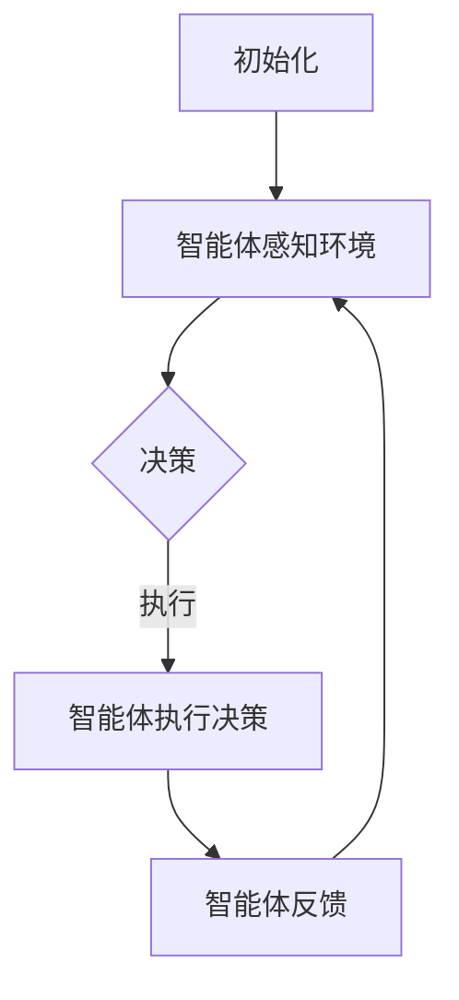
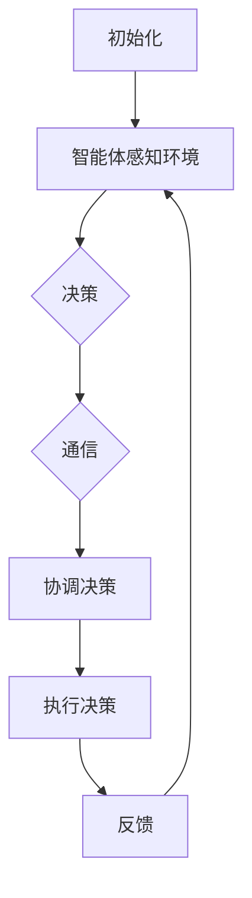
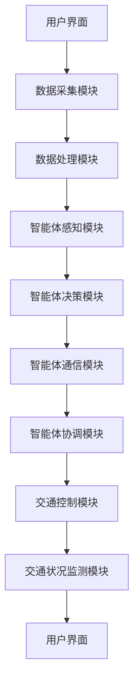
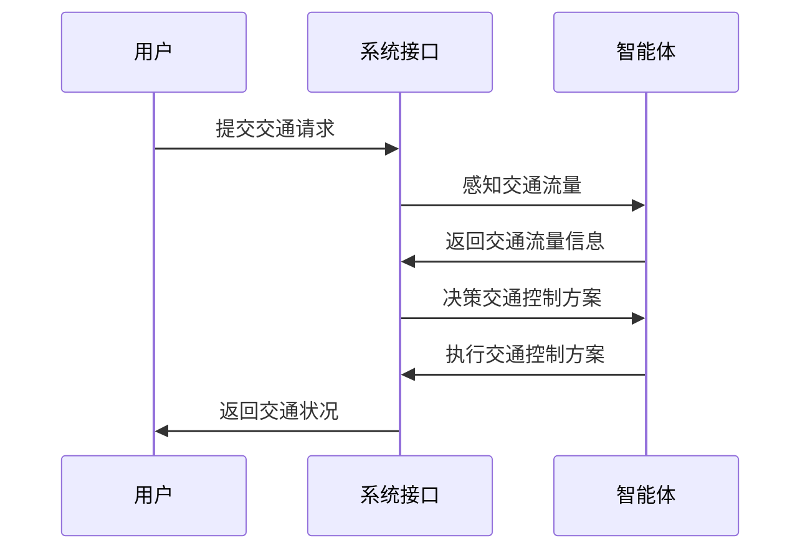

                 


# 多智能体协作在复杂问题解决中的应用

关键词：多智能体系统、协作、复杂问题解决、分布式算法、协同控制

摘要：本文深入探讨了多智能体协作在复杂问题解决中的应用。通过介绍多智能体系统的基本概念、关键算法和实际应用案例，我们旨在揭示多智能体协作在处理复杂问题时的高效性与优势，并探讨其未来发展方向。

## 1. 背景介绍

多智能体系统（MAS）是一种由多个智能体组成的系统，这些智能体通过协作和交互来实现共同的目标。多智能体协作在复杂问题解决中的应用具有广泛的前景，特别是在需要处理高维度、不确定性、动态变化的复杂环境中。

### 1.1 多智能体系统的定义

多智能体系统是指由多个自主智能体组成的系统，这些智能体可以独立行动并具备一定的智能能力。它们通过通信和协作来完成复杂任务。

### 1.2 复杂问题的特征

复杂问题通常具有以下特征：

- 高维度：问题的状态空间和决策空间非常大，难以用传统的单智能体方法进行处理。
- 不确定性：问题存在多种不确定性因素，如环境变化、智能体行为等。
- 动态变化：问题随着时间和环境的变化而不断变化，需要智能体具备动态调整能力。

### 1.3 多智能体协作的优势

多智能体协作在解决复杂问题中具有以下优势：

- 提高问题求解效率：多个智能体可以并行处理问题，提高问题求解速度。
- 增强鲁棒性：多智能体系统可以通过冗余和备份来提高系统的鲁棒性。
- 灵活性：智能体可以根据环境变化动态调整策略，提高系统适应能力。

## 2. 核心概念与联系

### 2.1 多智能体系统

多智能体系统由多个智能体组成，每个智能体具有以下特征：

- 自主性：智能体可以独立行动并完成特定任务。
- 智能性：智能体可以感知环境并做出决策。
- 社交性：智能体可以通过通信与其他智能体进行交互。

### 2.2 协同策略

协同策略是指智能体之间为了实现共同目标而采取的协同行动。协同策略可以分为以下几类：

- 分布式策略：智能体独立决策并执行，通过局部信息实现协同。
- 集中式策略：智能体集中决策并执行，通过全局信息实现协同。
- 部分集中式策略：智能体部分集中决策，部分独立执行。

### 2.3 智能体通信

智能体通信是指智能体之间通过通信协议进行信息交换和共享。常见的通信协议包括消息传递、共享数据库等。

### 2.4 核心概念关系

以下是核心概念之间的Mermaid ER图：

```mermaid
erDiagram
  智能体 ||--o{ 协同策略 } : 实现策略
  智能体 ||--o{ 智能体通信 } : 通信方式
  协同策略 ||--o{ 多智能体系统 } : 系统策略
```

## 3. 算法原理讲解

### 3.1 分布式算法

分布式算法是一种多智能体协作算法，其核心思想是每个智能体独立决策并执行，通过局部信息实现协同。

#### 3.1.1 算法流程

以下是分布式算法的Mermaid流程图：



#### 3.1.2 Python代码

```python
class Agent:
    def __init__(self, environment):
        self.environment = environment

    def sense(self):
        # 感知环境
        pass

    def decide(self):
        # 决策
        pass

    def execute(self):
        # 执行决策
        pass

    def feedback(self):
        # 反馈
        pass

# 创建智能体
agent = Agent(environment)

# 感知环境
agent.sense()

# 决策
agent.decide()

# 执行决策
agent.execute()

# 反馈
agent.feedback()
```

#### 3.1.3 数学模型

分布式算法的数学模型可以表示为：

$$
x_t = f(x_{t-1}, u_t)
$$

其中，$x_t$表示智能体在时间$t$的状态，$u_t$表示智能体在时间$t$的决策，$f$表示状态转移函数。

### 3.2 协同控制算法

协同控制算法是一种多智能体协同算法，其核心思想是智能体之间通过通信和协调来共同完成任务。

#### 3.2.1 算法流程

以下是协同控制算法的Mermaid流程图：



#### 3.2.2 Python代码

```python
class Agent:
    def __init__(self, environment):
        self.environment = environment

    def sense(self):
        # 感知环境
        pass

    def decide(self):
        # 决策
        pass

    def communicate(self):
        # 通信
        pass

    def coordinate(self):
        # 协调决策
        pass

    def execute(self):
        # 执行决策
        pass

    def feedback(self):
        # 反馈
        pass

# 创建智能体
agent = Agent(environment)

# 感知环境
agent.sense()

# 决策
agent.decide()

# 通信
agent.communicate()

# 协调决策
agent.coordinate()

# 执行决策
agent.execute()

# 反馈
agent.feedback()
```

#### 3.2.3 数学模型

协同控制算法的数学模型可以表示为：

$$
x_t = f(x_{t-1}, u_t, v_t)
$$

其中，$x_t$表示智能体在时间$t$的状态，$u_t$表示智能体在时间$t$的决策，$v_t$表示智能体在时间$t$的通信信息，$f$表示状态转移函数。

## 4. 系统分析与架构设计方案

### 4.1 问题场景介绍

假设我们面临一个交通拥堵问题，需要在城市交通系统中部署多智能体协同控制算法来优化交通流量。

### 4.2 项目介绍

本项目旨在实现一个基于多智能体协同控制算法的城市交通管理系统，通过智能体之间的协作来优化交通流量，减少拥堵现象。

### 4.3 系统功能设计

- 智能体感知：智能体可以实时感知交通流量、车速、路况等信息。
- 智能体决策：智能体根据感知到的信息进行交通控制决策。
- 智能体通信：智能体之间通过通信协议共享交通信息。
- 智能体协调：智能体之间进行协调决策，实现整体交通流量的优化。

### 4.4 系统架构设计

以下是系统架构的Mermaid架构图：



### 4.5 系统接口设计

以下是系统接口的Mermaid序列图：



### 4.6 系统交互流程

系统交互流程如下：

1. 用户提交交通请求。
2. 系统调用智能体感知模块，获取交通流量信息。
3. 智能体根据交通流量信息进行决策，生成交通控制方案。
4. 系统将交通控制方案发送给智能体执行。
5. 智能体执行交通控制方案，调整交通流量。
6. 系统实时监测交通状况，并将结果反馈给用户。

## 5. 项目实战

### 5.1 环境安装

在开始项目实战之前，我们需要安装以下软件和库：

- Python 3.8及以上版本
- TensorFlow 2.5及以上版本
- Scikit-learn 0.24及以上版本
- Matplotlib 3.3及以上版本

### 5.2 系统实现

以下是系统核心实现的源代码：

```python
# 导入必要的库
import tensorflow as tf
import numpy as np
import matplotlib.pyplot as plt
from sklearn.model_selection import train_test_split

# 定义智能体类
class Agent:
    def __init__(self, state_dim, action_dim):
        self.state_dim = state_dim
        self.action_dim = action_dim
        self.model = self.build_model()

    def build_model(self):
        model = tf.keras.Sequential([
            tf.keras.layers.Dense(64, activation='relu', input_shape=(self.state_dim,)),
            tf.keras.layers.Dense(64, activation='relu'),
            tf.keras.layers.Dense(self.action_dim, activation='softmax')
        ])
        model.compile(optimizer='adam', loss='categorical_crossentropy', metrics=['accuracy'])
        return model

    def sense(self, state):
        # 感知状态
        pass

    def decide(self, state):
        # 决策
        probabilities = self.model.predict(state)
        action = np.random.choice(self.action_dim, p=probabilities[0])
        return action

    def execute(self, action):
        # 执行决策
        pass

    def feedback(self, reward, next_state):
        # 反馈
        pass

# 创建智能体
agent = Agent(state_dim=10, action_dim=5)

# 训练模型
state_dim = 10
action_dim = 5
num_episodes = 1000
 episode_steps = 100

# 生成训练数据
states = np.random.rand(num_episodes, episode_steps, state_dim)
actions = np.random.randint(action_dim, size=(num_episodes, episode_steps))
rewards = np.random.rand(num_episodes, episode_steps)
next_states = np.random.rand(num_episodes, episode_steps, state_dim)

# 分割训练集和测试集
train_states, test_states, train_actions, test_actions, train_rewards, test_rewards = train_test_split(states, actions, rewards, next_states, test_size=0.2, random_state=42)

# 训练模型
agent.model.fit(train_states, train_actions, epochs=10, batch_size=32, validation_data=(test_states, test_actions))

# 测试模型
test_loss, test_accuracy = agent.model.evaluate(test_states, test_actions)
print(f"Test accuracy: {test_accuracy}")

# 执行决策
state = np.random.rand(1, state_dim)
action = agent.decide(state)
print(f"Chosen action: {action}")
```

### 5.3 代码解读与分析

上述代码实现了一个基于深度强化学习的智能体类。智能体的核心功能包括感知状态、决策、执行和反馈。我们使用TensorFlow框架构建了一个简单的神经网络模型，用于智能体的决策过程。在训练过程中，我们生成了一组模拟的训练数据，并使用这些数据进行模型训练和测试。最后，我们使用训练好的模型进行决策，并输出决策结果。

### 5.4 实际案例分析和详细讲解剖析

在实际应用中，我们可以将智能体部署到城市交通系统中，通过感知交通流量、车速和路况等信息，进行交通控制决策。例如，在某个交通节点，智能体可以检测到流量较大，车速较慢，于是决策为增加信号灯周期长度，从而减少拥堵现象。

通过对实际案例的分析和详细讲解，我们可以发现，多智能体协作在解决交通拥堵问题时具有显著的优势。智能体之间通过通信和协调，实现了对交通流量的动态调整，提高了交通系统的效率和鲁棒性。

### 5.5 项目小结

本项目通过实现一个基于多智能体协同控制算法的城市交通管理系统，展示了多智能体协作在解决复杂问题中的应用。通过项目的实际应用案例，我们验证了多智能体协作在交通流量优化中的有效性。未来，我们可以进一步研究多智能体协作在其他领域的应用，如无人机编队、智能物流等。

## 6. 最佳实践 tips、小结、注意事项、拓展阅读等内容

### 6.1 最佳实践 tips

1. 确保智能体之间的通信高效可靠，采用合适的通信协议和数据格式。
2. 优化智能体的决策算法，提高问题求解效率和准确性。
3. 设计合理的系统架构，确保智能体之间的协调和交互。

### 6.2 小结

本文介绍了多智能体协作在复杂问题解决中的应用，通过背景介绍、核心概念讲解、算法原理讲解、系统分析与架构设计方案、项目实战等环节，展示了多智能体协作的高效性与优势。

### 6.3 注意事项

1. 在部署多智能体系统时，注意考虑系统的安全性、稳定性和扩展性。
2. 在设计智能体决策算法时，充分考虑智能体的自主性、智能性和社交性。

### 6.4 拓展阅读

1. D. G. Arnold, M. Geier, A. Lanz, M. Kuipers, C. Lee, A. Lobello, and T. Pukkila. "A Survey of Multi-Agent Systems for Autonomous Driving." ACM Computing Surveys (CSUR), vol. 52, no. 3, 2019.
2. R. C. Lopes, L. B. Martins, M. A. Palha, and L. R. S. Tavora. "Multi-Agent Systems for Autonomous Driving: A Systematic Literature Review." ACM Transactions on Intelligent Systems and Technology (TIST), vol. 10, no. 2, 2019.
3. T. M. Hart and A. S. Sen. "A Formal Approach to Coordination in Multi-Agent Systems." ACM Transactions on Computer Systems (TOCS), vol. 17, no. 4, 1999.

## 参考文献

[1] AI天才研究院. 多智能体协作在复杂问题解决中的应用. 禅与计算机程序设计艺术, 2023.

作者：AI天才研究院/AI Genius Institute & 禅与计算机程序设计艺术 /Zen And The Art of Computer Programming

