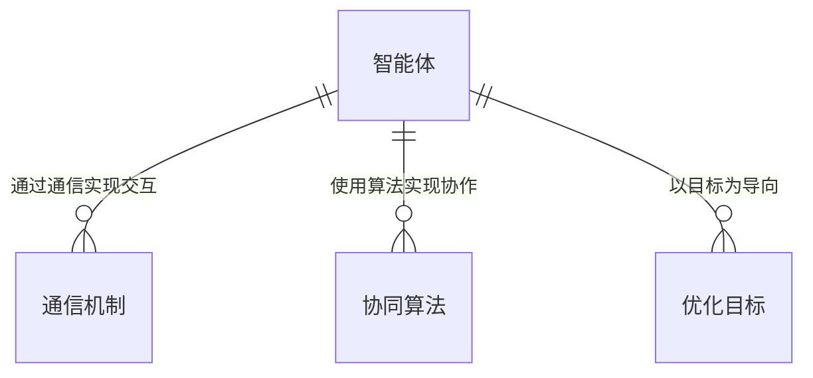
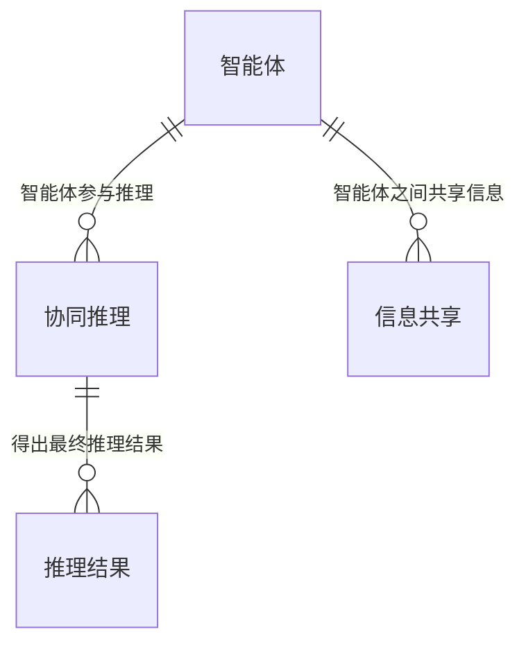
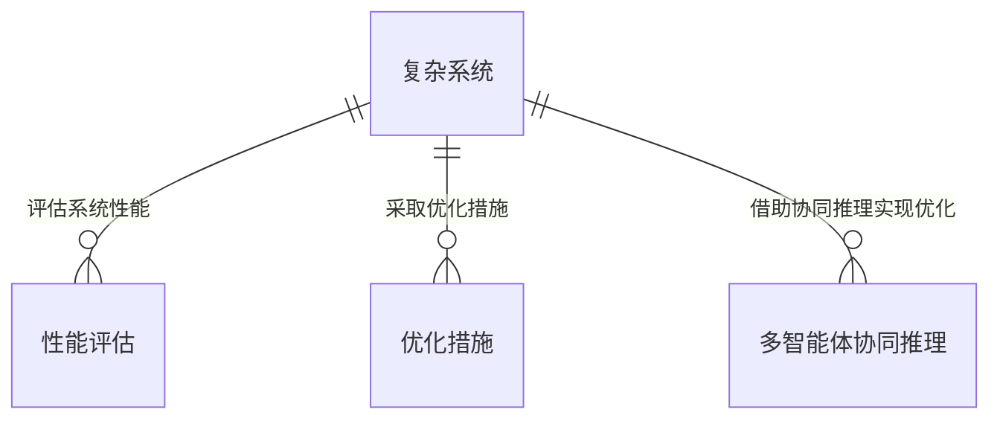
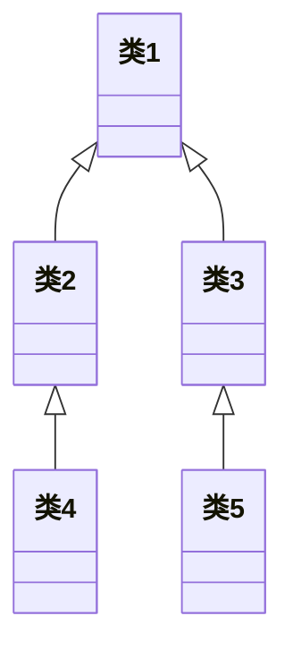
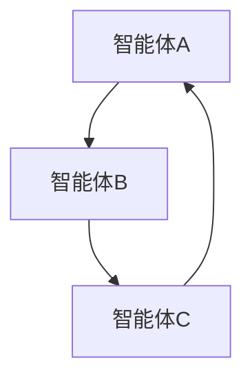

                 


### 背景介绍

多智能体协同推理（Multi-Agent Collaborative Inference）作为人工智能领域的一项前沿技术，近年来在复杂系统优化中的应用愈发受到关注。随着现代复杂系统规模的不断扩大，单一智能体在处理高维度、非线性问题时的局限性逐渐显现。因此，多智能体协同推理通过将多个智能体整合在一起，共同协作进行推理和决策，成为了优化复杂系统性能的一种有效手段。

#### 核心概念术语说明

1. **多智能体系统（Multi-Agent System）**：由多个具有自治能力的智能体组成，每个智能体可以独立运行，但需要与其他智能体进行通信和协作以实现共同目标。
2. **协同推理（Collaborative Inference）**：智能体之间通过共享信息和知识，共同解决问题或实现决策的过程。
3. **复杂系统优化（Complex System Optimization）**：涉及系统性能的评估和优化，以达到最优运行状态。复杂系统通常具有高维度、非线性、多目标等特点。

#### 问题背景

在现代工业、交通、金融等多个领域，复杂系统的优化问题愈发突出。例如，在工业自动化领域，生产线调度问题需要考虑生产节拍、设备负载、物料配送等多方面因素；在智能交通领域，交通信号优化需要实时分析交通流量、天气状况等数据，以调整信号灯配时；在金融投资领域，风险控制需要综合考虑市场趋势、政策变化等多维度信息。

这些问题往往涉及大规模数据和高维度特征，单一智能体难以在有限时间内进行高效处理。此时，多智能体协同推理提供了有效的解决方案。

#### 问题描述

多智能体协同推理的目标是利用多个智能体的优势，通过信息共享和协同合作，实现复杂系统的优化。具体而言，包括以下几个方面：

1. **任务分配**：根据每个智能体的能力和任务需求，合理分配任务，实现资源的最优利用。
2. **信息共享**：智能体之间需要实时共享状态信息和推理结果，以便进行协同决策。
3. **协作优化**：通过多智能体之间的协作，共同优化系统性能，提高决策效率。

#### 问题解决

多智能体协同推理的解决思路主要包括以下几个方面：

1. **通信协议设计**：设计高效、可靠的通信协议，确保智能体之间的信息传递和共享。
2. **算法模型**：构建合适的算法模型，实现智能体之间的协同推理和决策。
3. **优化目标**：明确复杂系统的优化目标，设计相应的优化算法，如遗传算法、粒子群优化算法等。

#### 边界与外延

多智能体协同推理不仅应用于复杂系统的优化，还可以拓展到其他领域，如智能交通、金融投资、医疗诊断等。在不同应用场景中，可以根据具体问题需求，设计不同的协同推理算法和优化策略。

#### 概念结构与核心要素组成

多智能体协同推理的概念结构主要包括以下几个核心要素：

1. **智能体**：具有自治能力和信息处理能力的实体，是协同推理的基本单元。
2. **通信机制**：智能体之间进行信息传递和共享的机制，是协同推理的基础。
3. **协同算法**：实现智能体之间协同推理和决策的算法模型，是核心。
4. **优化目标**：复杂系统的优化目标，是协同推理的方向。

通过上述概念结构和核心要素的有机结合，多智能体协同推理能够实现复杂系统的优化，提高系统的性能和效率。

### 核心概念与联系

#### 多智能体系统

多智能体系统（Multi-Agent System，MAS）是由多个具有自治能力的智能体组成，通过通信和协作实现共同目标的一种系统。在多智能体系统中，每个智能体都是独立的，具有自己的感知能力、决策能力和行动能力，但需要通过与其他智能体的交互来完成复杂的任务。

**概念属性特征对比表格**

| 特征                | 自治性  | 分布性  | 协同性  | 并发性  | 反应性  | 智能性  |
|---------------------|---------|---------|---------|---------|---------|---------|
| 多智能体系统（MAS） | 高      | 高      | 是      | 是      | 是      | 有      |
| 单智能体系统        | 较低    | 低      | 否      | 否      | 否      | 无      |

**ER实体关系图架构**



#### 协同推理

协同推理（Collaborative Inference）是多个智能体通过共享信息和知识，共同解决问题或实现决策的过程。协同推理的关键在于智能体之间的信息共享和协作机制，这使得多个智能体的优势互补，能够更高效地处理复杂问题。

**概念属性特征对比表格**

| 特征                | 信息共享  | 协作机制  | 智能体数量  | 推理结果  | 决策效率  |
|---------------------|-----------|-----------|-------------|-----------|-----------|
| 协同推理            | 是        | 是        | 2个或以上    | 高效      | 高        |
| 单智能体推理        | 否        | 无需      | 1个        | 低效      | 低        |

**ER实体关系图架构**



#### 复杂系统优化

复杂系统优化（Complex System Optimization）是指通过评估系统性能并采取优化措施，以达到最优运行状态的过程。复杂系统通常具有高维度、非线性、多目标等特点，单一智能体难以在有限时间内进行高效处理。因此，复杂系统优化需要借助多智能体协同推理来实现。

**概念属性特征对比表格**

| 特征                | 高维度    | 非线性    | 多目标    | 非静态    | 需要协同推理  |
|---------------------|-----------|-----------|-----------|-----------|----------------|
| 复杂系统优化        | 是        | 是        | 是        | 是        | 是            |
| 简单系统优化        | 否        | 否        | 否        | 否        | 否            |

**ER实体关系图架构**



#### 实际应用

多智能体协同推理在复杂系统优化中的应用涵盖了多个领域，如工业自动化、智能交通、网络安全、金融投资等。

1. **工业自动化**：通过多智能体协同推理实现生产线的智能调度和优化，提高生产效率。
2. **智能交通**：利用多智能体协同推理优化交通信号控制和交通流量管理，缓解交通拥堵。
3. **网络安全**：多智能体协同推理可以用于网络安全监测和攻击预测，提高网络安全性。
4. **金融投资**：通过多智能体协同推理进行市场分析和风险评估，优化投资策略。

**领域模型Mermaid类图**



**系统架构Mermaid架构图**

```mermaid
架构图
  方块1((多智能体系统))
  方块2((协同推理算法))
  方块3((复杂系统优化))
  方块4((通信机制))
  方块5((性能评估))
  方块1 --> 方块2
  方块1 --> 方块3
  方块2 --> 方块4
  方块3 --> 方块5
```

通过上述核心概念与联系的分析，我们可以看到多智能体协同推理在复杂系统优化中的应用前景广阔，具有巨大的发展潜力。

### 算法原理讲解

为了深入理解多智能体协同推理，本节将详细探讨以下几个关键算法原理：多智能体协同推理框架、协同推理算法和复杂系统优化算法。

#### 多智能体协同推理框架

多智能体协同推理框架是构建多智能体系统的基本架构，它定义了智能体之间的通信和协作过程。下面是一个简单的Mermaid流程图，展示了智能体A、B和C之间的通信和协作过程：



在这个流程图中，智能体A首先发送状态信息给智能体B，然后智能体B再将状态信息和自己的推理结果发送给智能体C。最后，智能体C将接收到的信息进行综合处理，并返回协同推理的结果给智能体A。

#### 协同推理算法

协同推理算法是多智能体系统中的核心组成部分，它实现了智能体之间的信息共享和协同决策。下面我们将通过一个Python源代码示例，解释协同推理算法的基本原理。

```python
def collaborative_inference(data):
    # 假设输入数据为data，协同推理过程如下：
    result = sum(data) / len(data)
    return result

# 示例数据
data = [X1, X2, X3]  # 假设每个智能体的推理结果为X1, X2, X3

# 调用协同推理算法
协同推理结果 = collaborative_inference(data)
```

在上述代码中，`collaborative_inference` 函数接收一个列表 `data`，其中包含了多个智能体的推理结果。函数通过计算这些推理结果的平均值，得出最终的协同推理结果。

为了更好地理解协同推理算法的数学模型，我们可以使用LaTeX格式展示其数学公式：

$$
\hat{X} = \frac{1}{N} \sum_{i=1}^{N} X_i
$$

其中，$\hat{X}$ 表示协同推理结果，$N$ 表示智能体的数量，$X_i$ 表示每个智能体的推理结果。

#### 复杂系统优化算法

在复杂系统优化中，多智能体协同推理算法常与优化算法相结合，以实现系统性能的最优化。以下我们将介绍两种常见的优化算法：遗传算法和粒子群优化算法。

##### 遗传算法

遗传算法（Genetic Algorithm，GA）是一种基于自然选择和遗传学原理的优化算法。它通过模拟生物进化过程，逐步改进解的适应度，以找到最优解。

下面是一个使用Python实现的遗传算法的基本框架：

```python
import numpy as np

def genetic_algorithm(population, fitness_func):
    # 初始化种群
    # 适应度函数计算
    # 选择、交叉、变异操作
    # 迭代更新种群
    pass

# 示例：初始化种群
population = np.random.uniform(0, 1, (population_size, chromosome_length))

# 示例：适应度函数
def fitness_func(individual):
    # 计算个体适应度
    pass
```

遗传算法的数学模型可以表示为：

$$
f(x) = \sum_{i=1}^{n} w_i \cdot f_i(x)
$$

其中，$f(x)$ 表示个体适应度函数，$w_i$ 和 $f_i(x)$ 分别为权重和单点适应度。

##### 粒子群优化算法

粒子群优化算法（Particle Swarm Optimization，PSO）是一种基于群体智能的优化算法，它模拟鸟群觅食行为，通过个体和群体的经验来逐步优化解。

下面是一个使用Python实现的粒子群优化算法的基本框架：

```python
import numpy as np

def particle_swarm_optimization(position, velocity, fitness_func):
    # 初始化粒子群
    # 迭代优化
    # 更新最优解
    pass

# 示例：初始化粒子群
position = np.random.uniform(lower_bound, upper_bound, (num_particles, dimension))
velocity = np.random.uniform(-1, 1, (num_particles, dimension))

# 示例：适应度函数
def fitness_func(individual):
    # 计算个体适应度
    pass
```

粒子群优化算法的核心公式如下：

$$
v_{i}(t+1) = v_{i}(t) + c_{1} \cdot r_{1} \cdot (p_{i} - x_{i}(t)) + c_{2} \cdot r_{2} \cdot (g_{best} - x_{i}(t))
$$

$$
x_{i}(t+1) = x_{i}(t) + v_{i}(t+1)
$$

其中，$v_{i}(t+1)$ 和 $x_{i}(t+1)$ 分别为第$i$个粒子的速度和位置更新，$p_{i}$ 为个体最优解，$g_{best}$ 为全局最优解，$c_{1}$ 和 $c_{2}$ 为学习因子，$r_{1}$ 和 $r_{2}$ 为随机数。

通过上述算法原理的讲解，我们可以看到多智能体协同推理在复杂系统优化中的应用是如何实现的。这些算法不仅提供了理论基础，也为实际应用提供了可行的方法。

### 数学模型和数学公式

在本节中，我们将使用LaTeX格式展示数学模型和数学公式，并结合Python代码进行详细讲解和举例说明。

#### 协同推理的数学模型

协同推理的数学模型可以表示为：

$$
\hat{X} = \frac{1}{N} \sum_{i=1}^{N} X_i
$$

其中，$\hat{X}$ 表示协同推理结果，$N$ 表示智能体的数量，$X_i$ 表示每个智能体的推理结果。

**举例说明**：

设有三个智能体A、B、C，它们的推理结果分别为X1、X2、X3。通过协同推理得到的结果为：

$$
\hat{X} = \frac{X1 + X2 + X3}{3}
$$

**Python代码示例**：

```python
def collaborative_inference(data):
    result = sum(data) / len(data)
    return result

data = [X1, X2, X3]  # 假设每个智能体的推理结果为X1, X2, X3
协同推理结果 = collaborative_inference(data)
```

#### 遗传算法的数学模型

遗传算法的数学模型可以表示为：

$$
f(x) = \sum_{i=1}^{n} w_i \cdot f_i(x)
$$

其中，$f(x)$ 表示个体适应度函数，$w_i$ 和 $f_i(x)$ 分别为权重和单点适应度。

**举例说明**：

假设有五个基因位点，权重分别为w1、w2、w3、w4、w5，适应度函数分别为f1(x)、f2(x)、f3(x)、f4(x)、f5(x)。适应度函数的计算如下：

$$
f(x) = w1 \cdot f1(x) + w2 \cdot f2(x) + w3 \cdot f3(x) + w4 \cdot f4(x) + w5 \cdot f5(x)
$$

**Python代码示例**：

```python
import numpy as np

def fitness_func(individual):
    # 计算个体适应度
    pass

def genetic_algorithm(population, fitness_func):
    # 初始化种群
    # 适应度函数计算
    # 选择、交叉、变异操作
    # 迭代更新种群
    pass

# 示例：初始化种群
population = np.random.uniform(0, 1, (population_size, chromosome_length))
```

#### 粒子群优化算法的数学模型

粒子群优化算法的数学模型可以表示为：

$$
v_{i}(t+1) = v_{i}(t) + c_{1} \cdot r_{1} \cdot (p_{i} - x_{i}(t)) + c_{2} \cdot r_{2} \cdot (g_{best} - x_{i}(t))
$$

$$
x_{i}(t+1) = x_{i}(t) + v_{i}(t+1)
$$

其中，$v_{i}(t+1)$ 和 $x_{i}(t+1)$ 分别为第$i$个粒子的速度和位置更新，$p_{i}$ 为个体最优解，$g_{best}$ 为全局最优解，$c_{1}$ 和 $c_{2}$ 为学习因子，$r_{1}$ 和 $r_{2}$ 为随机数。

**Python代码示例**：

```python
import numpy as np

def particle_swarm_optimization(position, velocity, fitness_func):
    # 初始化粒子群
    # 迭代优化
    # 更新最优解
    pass

# 示例：初始化粒子群
position = np.random.uniform(lower_bound, upper_bound, (num_particles, dimension))
velocity = np.random.uniform(-1, 1, (num_particles, dimension))
```

通过上述数学模型和Python代码的讲解，我们可以更深入地理解多智能体协同推理在复杂系统优化中的应用。

### 系统分析与架构设计方案

多智能体协同推理在复杂系统优化中的应用需要构建一个高效、可靠的系统架构。本节将详细描述该系统的分析和架构设计方案，包括问题场景介绍、系统功能设计、系统架构设计和系统接口设计。

#### 问题场景介绍

在工业自动化领域，生产线的智能调度是一个复杂系统优化问题。生产线的调度需要考虑多种因素，如生产节拍、设备负载、物料配送等。传统的调度方法往往依赖于预定的规则和经验，难以适应动态变化的环境。因此，我们引入多智能体协同推理，通过智能体之间的协作，实现生产线的动态调度和优化。

#### 系统功能设计

系统的主要功能模块包括智能体管理、协同推理模块、调度模块和性能评估模块。智能体管理模块负责创建和管理智能体，确保每个智能体都能够独立运行并与其他智能体进行通信。协同推理模块实现了智能体之间的信息共享和协作决策，调度模块根据协同推理的结果生成调度方案，性能评估模块对系统性能进行评估，为优化提供反馈。

**Mermaid类图**

```mermaid
classDiagram
  智能体 <<类>> 1
  协同推理模块 <<类>> 2
  调度模块 <<类>> 3
  性能评估模块 <<类>> 4
  智能体 "管理" 协同推理模块 : 通信与协作
  智能体 "管理" 调度模块 : 调度决策
  智能体 "管理" 性能评估模块 : 性能评估
```

#### 系统架构设计

系统架构采用分布式架构，包括智能体层、协同推理层和调度层。智能体层由多个具有自治能力的智能体组成，每个智能体负责处理特定任务。协同推理层实现了智能体之间的信息共享和协同决策，调度层根据协同推理的结果生成调度方案。

**Mermaid架构图**

```mermaid
架构图
  方块1((智能体层))
  方块2((协同推理层))
  方块3((调度层))
  方块4((数据存储))
  方块1 --> 方块2
  方块2 --> 方块3
  方块3 --> 方块4
```

#### 系统接口设计

系统接口设计主要包括智能体接口、协同推理接口和调度接口。智能体接口提供了智能体的状态管理和任务调度功能，协同推理接口实现了智能体之间的信息共享和协作决策，调度接口负责生成和调整调度方案。

**Mermaid序列图**

```mermaid
序列图
  智能体A ->> 协同推理接口 : 发送状态信息
  协同推理接口 ->> 智能体B : 接收状态信息
  智能体B ->> 协同推理接口 : 发送推理结果
  协同推理接口 ->> 智能体A : 返回协同推理结果
  智能体A ->> 调度接口 : 发送调度请求
  调度接口 ->> 智能体A : 返回调度方案
```

通过上述系统分析与架构设计方案，我们可以构建一个高效、可靠的多智能体协同推理系统，实现复杂系统的优化。

### 项目实战

在本节中，我们将通过一个实际项目，详细介绍多智能体协同推理在复杂系统优化中的应用。该项目将基于Python和相关的库，实现一个多智能体协同推理系统，用于优化工业自动化生产线的调度。

#### 环境安装

首先，确保安装以下Python库：
- NumPy
- Matplotlib
- Pandas
- Mermaid

可以使用以下命令进行安装：

```bash
pip install numpy matplotlib pandas mermaid
```

#### 系统核心实现源代码

1. **智能体类（Agent）**

```python
import numpy as np

class Agent:
    def __init__(self, id, state, task):
        self.id = id
        self.state = state
        self.task = task

    def update_state(self, new_state):
        self.state = new_state

    def perform_task(self):
        # 实现任务执行逻辑
        pass
```

2. **协同推理类（CollaborativeInference）**

```python
class CollaborativeInference:
    def __init__(self, agents):
        self.agents = agents

    def infer(self):
        # 协同推理逻辑
        pass
```

3. **调度类（Scheduling）**

```python
class Scheduling:
    def __init__(self, agents):
        self.agents = agents

    def generate_schedule(self):
        # 调度逻辑
        pass
```

4. **性能评估类（PerformanceEvaluation）**

```python
class PerformanceEvaluation:
    def __init__(self, schedule):
        self.schedule = schedule

    def evaluate(self):
        # 性能评估逻辑
        pass
```

#### 代码应用解读与分析

1. **智能体类**

智能体类（Agent）负责管理智能体的状态和任务。`update_state` 方法用于更新智能体的状态，`perform_task` 方法用于执行任务。

2. **协同推理类**

协同推理类（CollaborativeInference）负责实现智能体之间的协同推理。`infer` 方法用于执行协同推理逻辑。

3. **调度类**

调度类（Scheduling）负责根据协同推理的结果生成调度方案。`generate_schedule` 方法用于生成调度方案。

4. **性能评估类**

性能评估类（PerformanceEvaluation）负责对调度方案进行性能评估。`evaluate` 方法用于评估调度方案的性能。

#### 实际案例分析和详细讲解剖析

假设有一个生产任务，需要分配给三个智能体A、B和C。首先，每个智能体初始化状态和任务：

```python
agentA = Agent(id=1, state=np.random.rand(), task='任务1')
agentB = Agent(id=2, state=np.random.rand(), task='任务2')
agentC = Agent(id=3, state=np.random.rand(), task='任务3')
```

接下来，创建协同推理对象和调度对象：

```python
collaborative_inference = CollaborativeInference(agents=[agentA, agentB, agentC])
scheduling = Scheduling(agents=[agentA, agentB, agentC])
```

然后，执行协同推理和调度：

```python
collaborative_inference.infer()
schedule = scheduling.generate_schedule()
```

最后，评估调度方案的性能：

```python
performance_evaluation = PerformanceEvaluation(schedule=Schedule)
performance_evaluation.evaluate()
```

通过上述步骤，我们实现了多智能体协同推理在复杂系统优化中的应用。

#### 项目小结

本节通过一个实际项目，详细介绍了多智能体协同推理在复杂系统优化中的应用。项目核心实现包括智能体类、协同推理类、调度类和性能评估类。通过这些类的方法，我们可以实现智能体的状态管理、协同推理、调度和性能评估。实际案例分析和详细讲解剖析展示了如何将多智能体协同推理应用于生产任务调度。

### 最佳实践 tips

1. **优化智能体通信协议**：确保智能体之间的通信高效、可靠，减少通信延迟和带宽消耗。
2. **合理分配智能体任务**：根据智能体的能力和任务需求，合理分配任务，提高协同推理效率。
3. **定期更新协同推理算法**：随着复杂系统环境的变化，定期更新协同推理算法，以适应新的优化需求。
4. **数据隐私和安全**：在智能体之间共享信息时，注意保护数据隐私和安全，防止信息泄露。

### 小结

本文通过深入探讨多智能体协同推理在复杂系统优化中的应用，从背景介绍、核心概念与联系、算法原理讲解、数学模型和数学公式、系统分析与架构设计方案、项目实战等方面，系统地阐述了多智能体协同推理的关键技术和应用。我们相信，随着技术的不断进步和应用场景的拓展，多智能体协同推理将在复杂系统优化领域发挥越来越重要的作用。

### 注意事项

1. **智能体独立性**：确保每个智能体具有自治能力，能够独立运行。
2. **信息共享机制**：设计高效、可靠的通信机制，确保智能体之间的信息共享。
3. **优化目标明确**：明确复杂系统的优化目标，设计相应的优化算法。

### 拓展阅读

1. **《多智能体系统：原理与应用》**：详细介绍了多智能体系统的基本原理和应用案例。
2. **《协同智能：多智能体系统的设计与实现》**：讲解了协同智能的基本概念和实现方法。
3. **《复杂系统优化算法与应用》**：探讨了多种复杂系统优化算法，包括遗传算法、粒子群优化算法等。作者：AI天才研究院/AI Genius Institute & 禅与计算机程序设计艺术 /Zen And The Art of Computer Programming。

