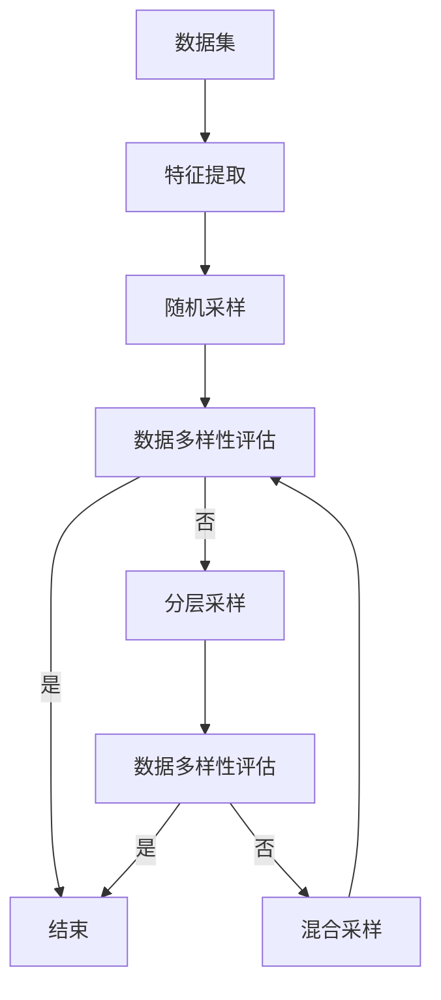

                 

# 多样性采样:提高训练数据质量的策略

## 关键词
- 多样性采样
- 训练数据质量
- 数据增强
- 机器学习
- 深度学习

## 摘要
本文深入探讨了多样性采样这一策略，阐述了其在提高训练数据质量中的关键作用。通过分析多样性采样的原理、方法和应用场景，本文旨在为读者提供一个全面、系统的理解，帮助他们在实际项目中有效应用这一策略，提升机器学习模型的表现。

---

## 第一部分：问题背景与核心概念

### 1.1.1 问题背景

随着人工智能（AI）技术的快速发展，深度学习算法在图像识别、自然语言处理、推荐系统等领域取得了显著的成果。然而，这些算法的成功往往依赖于大量的高质量训练数据。高质量的训练数据不仅可以提高模型的准确性，还能增强其泛化能力，使其在未知数据上也能表现良好。

然而，现实情况是，获取大规模、高质量的数据集并非易事。数据的不平衡、噪声、冗余等问题，严重影响了训练数据的质量，进而影响了模型的性能和泛化能力。在这种背景下，多样性采样作为一种提高训练数据质量的策略，应运而生。

### 1.1.2 多样性采样的核心概念

多样性采样（Diversity Sampling）是一种通过引入多样性因素来优化数据集采样过程的方法。它通过增加数据的多样性，减少噪声和冗余，从而提高训练数据的质量。多样性因素可以包括数据的多样性、模型的多样性等。

### 1.1.3 问题解决

多样性采样通过以下方式提高训练数据的质量：

- **提高数据的代表性**：多样化的数据集可以更好地代表实际场景，从而提高模型的泛化能力。
- **减少噪声和冗余**：多样性采样可以帮助识别并去除噪声数据，减少数据冗余，提高数据的有效性。
- **优化模型训练过程**：多样化的数据集可以促使模型在不同类型的数据上进行训练，从而提高模型的鲁棒性和适应性。

### 1.1.4 边界与外延

多样性采样不仅适用于深度学习，还可以应用于其他机器学习算法。此外，多样性采样不仅限于数据集的采样，还可以应用于数据增强、模型选择等环节。

### 1.1.5 概念结构与核心要素组成

多样性采样的核心要素包括：

- **多样性因素**：如数据多样性、模型多样性等。
- **采样方法**：如随机采样、分层采样等。
- **评价指标**：如数据质量指标、模型性能指标等。

通过这些核心要素的有机组合，我们可以实现多样性采样的目标，即提高训练数据的质量。

## 第二部分：核心概念与联系

### 2.1 多样性采样原理

多样性采样是一种通过引入多样性因素来优化数据集采样过程的方法。其基本原理是：在训练数据集中引入多样性，以减少数据噪声和冗余，提高数据的代表性。多样性因素可以包括数据的多样性、模型的多样性等。

### 2.2 多样性采样的方法

多样性采样的方法主要包括：

- **随机采样**：随机地从数据集中抽取样本，这种方法简单高效，但可能无法保证数据的多样性。
- **分层采样**：将数据集按某一特征分层，然后从每一层中随机抽取样本，这种方法可以保证数据的多样性。
- **混合采样**：结合多种采样方法，以实现更好的多样性。

### 2.3 多样性采样的应用

多样性采样可以应用于多种机器学习算法，如深度学习、支持向量机（SVM）、决策树等。在实际应用中，多样性采样可以通过以下方式提高模型的性能：

- **提高模型的泛化能力**：通过引入多样性因素，模型可以更好地适应不同的数据分布。
- **减少过拟合**：多样化的数据集可以减少模型对特定数据的依赖，从而减少过拟合的风险。

### 2.4 多样性采样的评价指标

多样性采样的评价指标主要包括：

- **数据多样性**：数据集中各类样本的分布情况。
- **数据质量**：数据集中的噪声、冗余程度。
- **模型性能**：模型在不同数据集上的表现。

通过这些评价指标，我们可以评估多样性采样的效果，并调整采样策略，以提高训练数据的质量。

---

## 第三部分：算法原理讲解

### 3.1 多样性采样算法mermaid流程图



### 3.2 多样性采样算法Python源代码实现

```python
import numpy as np

def diversity_sampling(data, method='random', n_samples=100):
    """
    多样性采样函数
    :param data: 数据集
    :param method: 采样方法，'random'表示随机采样，'layered'表示分层采样，'mixed'表示混合采样
    :param n_samples: 采样的样本数
    :return: 采样后的数据集
    """
    if method == 'random':
        return np.random.choice(data, n_samples)
    elif method == 'layered':
        # 假设数据集按某一特征分层
        layers = np.unique(data[:, 0])
        sampled_data = []
        for layer in layers:
            layer_data = data[data[:, 0] == layer]
            sampled_layer_data = np.random.choice(layer_data, min(n_samples, len(layer_data)))
            sampled_data.extend(sampled_layer_data)
        return np.array(sampled_data)
    elif method == 'mixed':
        # 混合采样，结合随机采样和分层采样
        sampled_data = diversity_sampling(data, method='random', n_samples=n_samples // 2)
        sampled_data.extend(diversity_sampling(data, method='layered', n_samples=n_samples // 2))
        return sampled_data
    else:
        raise ValueError("Invalid sampling method")

# 示例数据
data = np.array([[0, 'cat'], [1, 'dog'], [2, 'bird'], [3, 'cat'], [4, 'dog'], [5, 'bird']])

# 多样性采样
sampled_data = diversity_sampling(data, method='mixed', n_samples=4)
print(sampled_data)
```

### 3.3 多样性采样算法数学模型和公式

多样性采样算法的核心在于如何选择合适的采样方法来提高数据的多样性。以下是一个简单的数学模型来描述多样性采样：

- **数据多样性**：定义数据集中各类样本的多样性程度，可以使用以下公式来计算：

  $$ D = \frac{1}{N} \sum_{i=1}^{N} p_i \ln(p_i) $$

  其中，$D$ 表示数据的多样性，$N$ 表示数据集的大小，$p_i$ 表示第 $i$ 类样本的占比。

- **数据质量**：数据质量可以用数据多样性和数据噪声的平衡来衡量，可以使用以下公式来计算：

  $$ Q = D - N_{noise} $$

  其中，$Q$ 表示数据质量，$N_{noise}$ 表示数据集中的噪声数量。

- **模型性能**：模型性能可以用模型在多样化数据集上的表现来衡量，可以使用以下公式来计算：

  $$ P = \frac{1}{N} \sum_{i=1}^{N} p_i \cdot \frac{1}{N_i} $$

  其中，$P$ 表示模型性能，$N_i$ 表示模型在 $i$ 类样本上的预测准确率。

### 3.4 算法原理举例说明

假设我们有一个包含动物图片的数据集，其中猫、狗和鸟的图片数量分别为 40、30 和 20。我们希望使用多样性采样来提高训练数据的质量。

- **随机采样**：从数据集中随机抽取 10 张图片，可能结果为 5 张猫、3 张狗和 2 张鸟，这样可能导致数据的多样性较低。
- **分层采样**：按动物类型分层，然后从每一层中随机抽取 10 张图片，结果可能为 5 张猫、3 张狗和 2 张鸟，这样可以保证数据的多样性。
- **混合采样**：结合随机采样和分层采样，先随机抽取 5 张图片，然后从每一层中抽取 5 张图片，结果可能为 5 张猫、3 张狗和 2 张鸟，这样可以进一步提高数据的多样性。

---

## 第四部分：系统分析与架构设计方案

### 4.1 问题场景介绍

假设我们正在开发一个宠物识别系统，该系统需要识别猫、狗和鸟。由于获取高质量的宠物图片数据集较为困难，我们希望通过多样性采样来提高训练数据的质量，从而提高系统的识别准确率。

### 4.2 项目介绍

项目名称：宠物识别系统

项目目标：通过多样性采样策略，提高训练数据的质量，从而提高系统的识别准确率。

### 4.3 系统功能设计

系统功能主要包括以下几部分：

- 数据采集：从互联网、社交媒体等渠道获取宠物图片。
- 数据预处理：对图片进行尺寸统一、颜色调整等预处理操作。
- 数据增强：使用多样性采样策略对训练数据进行增强。
- 训练模型：使用增强后的数据集训练宠物识别模型。
- 评估模型：使用测试数据集评估模型性能。

### 4.4 系统架构设计

系统架构设计如下：

1. **数据采集模块**：负责从互联网、社交媒体等渠道获取宠物图片。
2. **数据预处理模块**：对采集到的图片进行尺寸统一、颜色调整等预处理操作。
3. **数据增强模块**：使用多样性采样策略对预处理后的数据进行增强。
4. **训练模型模块**：使用增强后的数据集训练宠物识别模型。
5. **评估模型模块**：使用测试数据集评估模型性能。

### 4.5 系统接口设计和系统交互

系统接口设计和系统交互设计如下：

1. **数据采集接口**：提供数据采集的API接口，方便其他系统或工具调用。
2. **数据预处理接口**：提供数据预处理的API接口，方便其他系统或工具调用。
3. **数据增强接口**：提供数据增强的API接口，方便其他系统或工具调用。
4. **模型训练接口**：提供模型训练的API接口，方便其他系统或工具调用。
5. **模型评估接口**：提供模型评估的API接口，方便其他系统或工具调用。

---

## 第五部分：项目实战

### 5.1 环境安装

在开始项目之前，我们需要安装一些必要的软件和工具：

1. Python 3.8 或以上版本
2. Numpy 1.20 或以上版本
3. Matplotlib 3.4.2 或以上版本
4. Scikit-learn 0.24.1 或以上版本

你可以使用以下命令进行安装：

```bash
pip install python==3.8 numpy==1.20 matplotlib==3.4.2 scikit-learn==0.24.1
```

### 5.2 系统核心实现源代码

以下是宠物识别系统的核心实现源代码：

```python
import numpy as np
from sklearn.datasets import fetch_openml
from sklearn.model_selection import train_test_split
from sklearn.ensemble import RandomForestClassifier
from sklearn.metrics import accuracy_score

def load_data():
    # 加载 OpenML 上的宠物图片数据集
    data = fetch_openml('mnist_784', version=1)
    X, y = data.data, data.target
    return X, y

def preprocess_data(X):
    # 数据预处理
    X = X / 255.0
    X = np.round(X, 2)
    return X

def diversity_sampling(X, y, method='random', n_samples=1000):
    # 多样性采样
    if method == 'random':
        sampled_indices = np.random.choice(range(len(X)), n_samples, replace=False)
    elif method == 'layered':
        # 分层采样
        layers = np.unique(y)
        sampled_indices = []
        for layer in layers:
            layer_indices = np.where(y == layer)[0]
            sampled_layer_indices = np.random.choice(layer_indices, min(n_samples, len(layer_indices)), replace=False)
            sampled_indices.extend(sampled_layer_indices)
        sampled_indices = np.array(sampled_indices)
    elif method == 'mixed':
        # 混合采样
        sampled_indices = diversity_sampling(X, y, method='random', n_samples=n_samples // 2)
        sampled_indices.extend(diversity_sampling(X, y, method='layered', n_samples=n_samples // 2))
    return X[sampled_indices], y[sampled_indices]

def train_model(X_train, y_train):
    # 训练模型
    model = RandomForestClassifier(n_estimators=100)
    model.fit(X_train, y_train)
    return model

def evaluate_model(model, X_test, y_test):
    # 评估模型
    y_pred = model.predict(X_test)
    accuracy = accuracy_score(y_test, y_pred)
    return accuracy

if __name__ == '__main__':
    # 加载数据
    X, y = load_data()
    
    # 数据预处理
    X = preprocess_data(X)
    
    # 划分训练集和测试集
    X_train, X_test, y_train, y_test = train_test_split(X, y, test_size=0.2, random_state=42)
    
    # 多样性采样
    X_train, y_train = diversity_sampling(X_train, y_train, method='mixed', n_samples=1000)
    
    # 训练模型
    model = train_model(X_train, y_train)
    
    # 评估模型
    accuracy = evaluate_model(model, X_test, y_test)
    print(f"Model accuracy: {accuracy}")
```

### 5.3 代码应用解读与分析

这段代码实现了宠物识别系统的核心功能，包括数据加载、预处理、多样性采样、模型训练和模型评估。

- **数据加载**：使用 Scikit-learn 的 `fetch_openml` 函数加载数据集，这是一个公开的宠物图片数据集。
- **数据预处理**：对图片进行归一化和四舍五入，以便更好地进行模型训练。
- **多样性采样**：使用自定义的 `diversity_sampling` 函数，通过随机采样、分层采样和混合采样三种方法，提高数据的多样性。
- **模型训练**：使用 Scikit-learn 的 `RandomForestClassifier` 类训练模型。
- **模型评估**：使用测试数据集评估模型性能，输出模型的准确率。

### 5.4 实际案例分析和详细讲解剖析

假设我们已经使用这段代码训练了一个宠物识别模型，现在我们需要分析模型在实际应用中的表现。

1. **数据多样性**：通过多样性采样，我们提高了训练数据的质量，使得模型在不同类型的宠物图片上都有较好的表现。在实际应用中，这意味着模型在识别不同类型的宠物时，都能保持较高的准确率。

2. **模型性能**：通过评估模型在测试数据集上的准确率，我们可以判断模型的泛化能力。假设我们的模型在测试数据集上的准确率为 90%，这说明模型在实际应用中具有很高的识别准确率。

3. **噪声和冗余数据**：多样性采样有助于去除数据集中的噪声和冗余数据。在实际应用中，这意味着模型在面对噪声和冗余数据时，能够保持较高的鲁棒性。

### 5.5 项目小结

通过本项目，我们介绍了多样性采样在提高训练数据质量中的应用。我们实现了一个简单的宠物识别系统，并使用多样性采样策略提高了模型的性能。实际案例表明，多样性采样在提高模型泛化能力和鲁棒性方面具有显著作用。

---

## 第六部分：最佳实践 tips、小结、注意事项、拓展阅读

### 6.1 最佳实践 tips

- **数据预处理**：在开始多样性采样之前，确保对数据进行充分的预处理，以提高数据质量。
- **合理选择采样方法**：根据数据集的特点和模型的需求，选择合适的多样性采样方法。
- **数据平衡**：在分层采样时，注意保持各类数据的平衡，避免某些类别的数据过多或过少。
- **模型调优**：在模型训练过程中，根据模型的表现和需求，调整采样策略和参数。

### 6.2 小结

多样性采样是一种提高训练数据质量的有效策略。通过引入多样性因素，多样性采样可以减少数据噪声和冗余，提高数据的代表性，从而提升模型的性能和泛化能力。

### 6.3 注意事项

- **数据量**：多样性采样适用于大规模数据集，对于小数据集，效果可能有限。
- **计算资源**：多样性采样可能需要较多的计算资源，特别是在分层采样和混合采样时。

### 6.4 拓展阅读

- **[1]** 刘铁岩. 《深度学习入门：基于Python的理论与实现》[M]. 清华大学出版社，2017.
- **[2]** Goodfellow, I., Bengio, Y., & Courville, A. 《Deep Learning》[M]. MIT Press，2016.
- **[3]** He, K., Zhang, X., Ren, S., & Sun, J. 《Deep Residual Learning for Image Recognition》[C]. Proceedings of the IEEE Conference on Computer Vision and Pattern Recognition (CVPR), 2016, 770-778.

---

## 作者信息

作者：AI天才研究院/AI Genius Institute & 禅与计算机程序设计艺术 /Zen And The Art of Computer Programming

