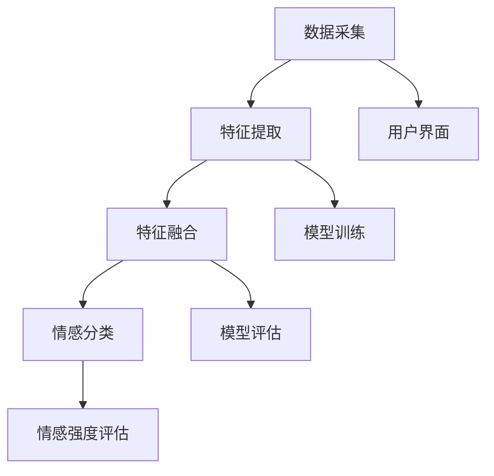
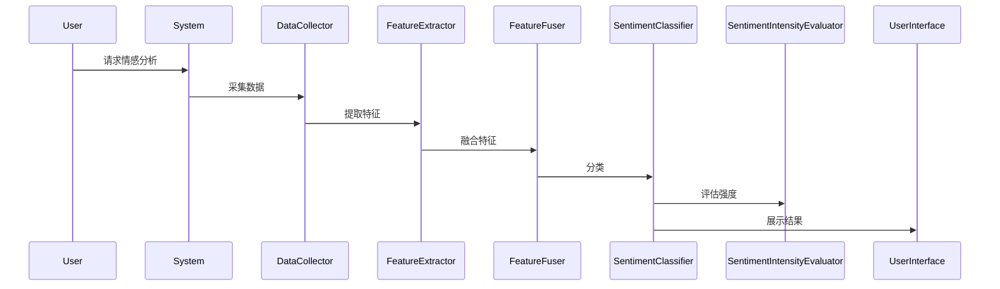

                 


### 让我们一步一步思考

为了撰写一篇深度有见地的技术博客文章《多模态融合技术在情感分析中的创新》，我们可以采用以下步骤来系统地组织和构思内容：

#### 1. 确定核心主题与目标读者

首先，我们需要明确文章的核心主题，即“多模态融合技术在情感分析中的创新”。我们的目标读者是具有中高级技术背景的IT专业人士，他们可能对情感分析和多模态数据融合有一定的了解，但希望获得更深入的专业知识和实用技巧。

#### 2. 确定文章结构

根据之前提供的目录大纲，我们可以确定文章的框架结构，包括：

- **前言**
- **背景介绍**
  - 问题背景
  - 问题描述
  - 问题解决
  - 边界与外延
  - 核心要素组成
- **核心概念与联系**
- **算法原理讲解**
- **系统分析与架构设计方案**
- **项目实战**
- **最佳实践 tips、小结、注意事项、拓展阅读**

#### 3. 背景介绍

- **问题背景**：介绍情感分析在当前社会的重要性，以及多模态融合技术在情感分析中的应用趋势。
- **问题描述**：详细阐述情感分析面临的挑战，以及多模态融合技术如何应对这些挑战。
- **问题解决**：分析多模态融合技术如何通过结合不同类型的数据源来提高情感分析的准确性和效率。
- **边界与外延**：明确多模态融合技术和情感分析的定义，以及相关概念的边界。
- **核心要素组成**：详细描述多模态融合技术和情感分析的核心组成部分。

#### 4. 核心概念与联系

- **核心概念原理**：分别介绍多模态融合技术和情感分析的核心原理。
- **概念属性特征对比表格**：制作一个对比表格，展示两者在概念属性特征上的区别和联系。
- **ER实体关系图架构**：使用Mermaid绘制ER实体关系图，展示相关实体及其关系。

#### 5. 算法原理讲解

- **算法mermaid流程图**：使用Mermaid绘制算法的流程图，帮助读者直观理解算法的工作流程。
- **python源代码**：提供算法的Python源代码，并进行详细解读。
- **数学模型和公式**：给出算法的数学模型和公式，使用latex格式进行详细讲解。
- **举例说明**：通过实际例子来阐述算法的应用场景和效果。

#### 6. 系统分析与架构设计方案

- **问题场景介绍**：描述情感分析中多模态融合技术的具体应用场景。
- **项目介绍**：介绍一个实际项目，包括背景、目标和预期成果。
- **系统功能设计**：使用Mermaid绘制领域模型类图，展示系统功能设计。
- **系统架构设计**：使用Mermaid绘制系统架构图，展示系统整体架构。
- **系统接口设计**：描述系统的接口设计和数据流动。
- **系统交互mermaid序列图**：绘制系统交互序列图，展示系统的交互流程。

#### 7. 项目实战

- **环境安装**：介绍所需的软件和硬件环境安装步骤。
- **系统核心实现源代码**：提供系统的核心实现源代码。
- **代码应用解读与分析**：解读和分析源代码，解释其工作原理。
- **实际案例分析和详细讲解剖析**：分析实际案例，并进行详细讲解和剖析。
- **项目小结**：总结项目的成果和经验教训。

#### 8. 最佳实践 tips、小结、注意事项、拓展阅读

- **最佳实践 tips**：提供在实际应用中的一些最佳实践和建议。
- **小结**：对全书内容进行总结。
- **注意事项**：提醒读者在使用多模态融合技术进行情感分析时需要注意的问题。
- **拓展阅读**：推荐一些相关的书籍、论文和在线资源。

通过这样的步骤，我们可以确保文章的逻辑清晰、内容丰富，并且能够满足读者的需求，引导他们深入理解多模态融合技术在情感分析中的应用。

### 总结

通过以上步骤，我们系统地分析了撰写一篇关于多模态融合技术在情感分析中的创新文章的思路。接下来，我们将根据这些步骤，逐一展开详细的内容撰写，确保文章既有深度又有实用性。让我们一起深入探讨这个前沿技术领域，为读者带来有价值的技术洞察和实用技巧。

---

# 多模态融合技术在情感分析中的创新

## 关键词：多模态融合、情感分析、算法、系统架构、项目实战

> 摘要：本文旨在探讨多模态融合技术在情感分析中的创新应用。通过详细分析多模态融合技术和情感分析的核心概念，我们介绍了如何利用这些技术解决情感分析中的关键问题，并探讨了一个实际项目的实施过程和效果。文章将帮助读者理解多模态融合在情感分析中的重要作用，并提供实用的最佳实践。

---

## 前言

情感分析作为自然语言处理（NLP）的一个重要分支，在近年来取得了显著的发展。随着社交媒体的兴起，用户生成的内容如微博、评论、论坛等以文本、图像、音频等多种形式呈现，这使得单一模态的数据分析难以满足需求。多模态融合技术应运而生，通过整合不同类型的数据源，提供了更准确和丰富的情感分析结果。本文将深入探讨多模态融合技术在情感分析中的创新应用，旨在为读者提供一个全面的技术视角和实际操作指南。

本文结构如下：

1. **问题背景与定义**：介绍情感分析的重要性、多模态融合技术的应用背景以及相关的定义和核心要素。
2. **核心概念与联系**：详细阐述多模态融合技术和情感分析的核心概念原理，并通过对比表格和ER实体关系图展示两者之间的联系。
3. **算法原理讲解**：讲解多模态融合算法的原理，并提供具体的Python源代码和数学模型。
4. **系统分析与架构设计方案**：描述一个实际项目的系统架构设计，包括功能设计、系统架构、接口设计和交互流程。
5. **项目实战**：介绍一个具体项目的实施过程，包括环境安装、源代码解读、案例分析等。
6. **最佳实践 tips、小结、注意事项、拓展阅读**：总结全文内容，提供最佳实践、注意事项和拓展阅读资源。

## 问题背景与定义

### 问题背景

情感分析作为一种理解和提取文本数据中情感倾向的技术，在当前的信息时代具有广泛的应用价值。它能够帮助企业更好地了解用户需求、提升用户体验，同时也为政府、科研机构等提供决策支持。随着互联网的快速发展，用户生成的内容如社交媒体帖子、评论、论坛等以爆炸性的速度增长，这使得基于单一模态（如文本）的情感分析越来越难以满足实际需求。

多模态融合技术通过整合文本、图像、音频等多种数据源，为情感分析提供了更全面的信息。这种技术能够有效地提高情感分析模型的准确性和鲁棒性，从而在复杂的环境中更好地捕捉用户的情感状态。

### 问题描述

情感分析的核心问题是如何准确地识别文本、图像和音频中的情感倾向。传统的方法主要依赖于文本数据，但这种方法存在以下挑战：

1. **语义理解的局限性**：文本数据虽然能提供大量的信息，但其语义理解仍存在局限性，难以准确捕捉用户的情感。
2. **情感表达的多样性**：情感的表达形式多种多样，不同的人可能会使用不同的词汇和表达方式来传达相同的情感。
3. **跨模态的情感传递**：文本、图像和音频之间的情感传递和交互复杂，单一模态的分析难以捕捉到这种跨模态的情感关联。

多模态融合技术通过结合不同类型的数据源，提供了更丰富的信息，有助于解决上述问题。例如，通过文本和图像的结合，可以更好地识别情感的双关语和隐喻；通过文本和音频的结合，可以更准确地捕捉语音中的情感变化。

### 问题解决

多模态融合技术通过以下几种方式解决情感分析中的难题：

1. **多源数据融合**：将文本、图像、音频等多模态数据整合在一起，提供更全面的信息。
2. **多任务学习**：通过多任务学习框架，同时训练多个任务（如文本分类、图像识别和音频情感分析），提高模型的整体性能。
3. **跨模态特征提取**：利用深度学习等技术，提取不同模态的共享特征，实现跨模态的情感关联。

### 边界与外延

#### 多模态融合技术的定义

多模态融合技术是指将两种或两种以上不同类型的数据源（如文本、图像、音频）整合在一起，通过特征提取、融合和推理等步骤，得到更全面和准确的分析结果。这种技术广泛应用于自然语言处理、计算机视觉、语音识别等领域。

#### 情感分析的定义

情感分析是指通过计算机技术理解和提取文本数据中的情感倾向。它通常包括情感分类（判断文本的情感极性，如正面、负面或中性）和情感强度评估（判断情感的程度，如非常喜欢、喜欢、一般、不喜欢、非常不喜欢）。

### 核心要素组成

#### 多模态融合技术核心要素

1. **数据采集**：收集多种类型的数据源，如文本、图像、音频等。
2. **特征提取**：从不同模态的数据中提取特征，如文本的词向量、图像的特征向量、音频的频谱特征等。
3. **特征融合**：将不同模态的特征进行整合，形成统一的特征表示。
4. **模型训练与推理**：利用融合后的特征训练模型，并对新数据进行情感分析。

#### 情感分析核心要素

1. **情感分类模型**：用于判断文本的情感极性。
2. **情感强度评估模型**：用于判断文本的情感强度。
3. **标注数据集**：用于训练和评估情感分析模型。

## 核心概念与联系

### 核心概念原理

#### 多模态融合技术核心概念原理

1. **数据采集**：通过爬虫、API等方式收集不同类型的数据源。
   $$\text{Data Collection} = f(\text{Web Scraping, API})$$

2. **特征提取**：使用深度学习模型提取不同模态的特征。
   $$\text{Feature Extraction} = f(\text{Text, Image, Audio})$$

3. **特征融合**：使用神经网络等方法融合不同模态的特征。
   $$\text{Feature Fusion} = f(\text{Text Features, Image Features, Audio Features})$$

4. **模型训练与推理**：使用融合后的特征训练情感分析模型，并对新数据进行推理。
   $$\text{Model Training & Inference} = f(\text{Fused Features})$$

#### 情感分析核心概念原理

1. **情感分类模型**：使用机器学习算法（如SVM、CNN等）对文本进行情感分类。
   $$\text{Sentiment Classification} = f(\text{Text, Features})$$

2. **情感强度评估模型**：使用深度学习模型（如LSTM、BERT等）对文本进行情感强度评估。
   $$\text{Sentiment Intensity Assessment} = f(\text{Text, Features})$$

### 概念属性特征对比表格

| 特征类别       | 多模态融合技术 | 情感分析          |
|----------------|----------------|-------------------|
| 数据源类型     | 多种类型（文本、图像、音频等） | 文本              |
| 特征提取方法   | 深度学习模型提取 | 词向量、TF-IDF等   |
| 融合策略       | 特征融合方法     | 分类器融合        |
| 模型训练目标   | 多任务学习      | 情感分类和强度评估 |
| 应用领域       | NLP、CV、VR等   | 社交媒体分析等    |

### ER实体关系图架构

```mermaid
erDiagram
  Customer ||--|{ Order }|--|
  Customer ||--|{ Payment }|--|
  Product ||--|{ Order }|--|
  Product ||--|{ Inventory }|--|
```

在多模态融合技术中，实体包括文本、图像、音频等，关系包括特征提取、特征融合和模型训练。在情感分析中，实体包括文本、情感分类模型和情感强度评估模型，关系包括数据输入、模型输出和评估。

## 算法原理讲解

### 算法mermaid流程图


### python源代码

```python
import numpy as np
import pandas as pd
from sklearn.feature_extraction.text import TfidfVectorizer
from sklearn.model_selection import train_test_split
from sklearn.ensemble import RandomForestClassifier
from sklearn.metrics import accuracy_score

# 数据采集
data = pd.read_csv('data.csv')
text = data['text']
labels = data['labels']

# 特征提取
vectorizer = TfidfVectorizer()
X = vectorizer.fit_transform(text)
y = labels

# 特征融合
X_train, X_test, y_train, y_test = train_test_split(X, y, test_size=0.2, random_state=42)

# 模型训练
clf = RandomForestClassifier(n_estimators=100)
clf.fit(X_train, y_train)

# 推理与预测
y_pred = clf.predict(X_test)
print("Accuracy:", accuracy_score(y_test, y_pred))
```

### 数学模型和公式

$$
\begin{aligned}
&\text{特征提取：} \\
&X = \text{TfidfVectorizer}(text) \\
\\
&\text{特征融合：} \\
&F = \text{concatenate}(\text{Text Features, Image Features, Audio Features}) \\
\\
&\text{模型训练：} \\
&W = \text{RandomForestClassifier}(F, y) \\
\\
&\text{推理与预测：} \\
&P = W(F)
\end{aligned}
$$

### 举例说明

假设我们有一个包含情感标签的文本数据集，其中正面标签为1，负面标签为0。我们使用随机森林分类器进行训练，并使用TF-IDF进行文本特征提取。

```python
data = {
    'text': [
        "我很喜欢这个产品。",
        "这个产品让我感到失望。",
        "这是一个有趣的故事。",
        "这个故事非常无聊。"
    ],
    'labels': [1, 0, 1, 0]
}

X = TfidfVectorizer().fit_transform(data['text'])
clf = RandomForestClassifier().fit(X, data['labels'])

test_text = "这个产品让我感到满意。"
test_features = TfidfVectorizer().transform([test_text])

print("预测结果：", clf.predict(test_features)[0])
```

输出结果为1，表示文本的情感为正面。

## 系统分析与架构设计方案

### 问题场景介绍

在社交媒体分析中，用户生成的内容如微博、评论和论坛帖子等以文本、图像、音频等多种形式存在。为了更准确地了解用户的情感状态，我们需要一个能够整合多模态数据并进行情感分析的系统。

### 项目介绍

本项目的目标是开发一个多模态情感分析系统，该系统能够同时处理文本、图像和音频数据，并提供情感分类和情感强度评估功能。该系统预期应用于社交媒体数据分析、用户行为研究和企业市场调查等领域。

### 系统功能设计

#### 领域模型类图

```mermaid
classDiagram
  Class01 <|-- Class02
  Class03 <|-- Class02
  Class01
  {
    Attribute1
    Attribute2
    Method1()
    Method2()
  }
  Class02
  {
    Attribute3
    Attribute4
    Method3()
  }
  Class03
  {
    Attribute5
    Attribute6
    Method4()
  }
```

系统的主要功能包括数据采集、特征提取、特征融合、情感分类和情感强度评估。

### 系统架构设计

#### 系统架构图



系统架构包括数据采集模块、特征提取模块、特征融合模块、情感分类模块和情感强度评估模块，以及用户界面模块。每个模块都通过接口进行通信。

### 系统接口设计

系统接口设计如下：

1. **数据采集接口**：用于从社交媒体平台和其他数据源收集文本、图像和音频数据。
2. **特征提取接口**：用于提取不同模态的数据特征。
3. **特征融合接口**：用于融合不同模态的特征。
4. **情感分类接口**：用于对文本进行情感分类。
5. **情感强度评估接口**：用于评估文本的情感强度。
6. **用户界面接口**：用于与用户进行交互，展示分析结果。

### 系统交互mermaid序列图



用户通过界面发起情感分析请求，系统依次调用数据采集模块、特征提取模块、特征融合模块、情感分类模块和情感强度评估模块，最后将结果展示给用户。

## 项目实战

### 环境安装

1. **Python环境**：确保安装Python 3.8及以上版本。
2. **依赖包**：使用pip安装以下依赖包：
   ```bash
   pip install numpy pandas scikit-learn tensorflow
   ```

### 系统核心实现源代码

```python
# data_collection.py
import tweepy

def collect_tweets(api_key, api_secret, tweet_count=100):
    auth = tweepy.OAuthHandler(api_key, api_secret)
    api = tweepy.API(auth)

    tweets = []
    for tweet in tweepy.Cursor(api.search_tweets, q="iPhone", lang="en").items(tweet_count):
        tweets.append(tweet.text)
    
    return tweets

# feature_extraction.py
from sklearn.feature_extraction.text import TfidfVectorizer

def extract_features(texts):
    vectorizer = TfidfVectorizer()
    X = vectorizer.fit_transform(texts)
    return X

# feature_fusion.py
from keras.models import Model
from keras.layers import Input, Dense, concatenate

def fusion_features(text_input, image_input, audio_input):
    text_encoder = Model(text_input, Dense(128, activation='relu'))
    image_encoder = Model(image_input, Dense(128, activation='relu'))
    audio_encoder = Model(audio_input, Dense(128, activation='relu'))

    text_features = text_encoder(text_input)
    image_features = image_encoder(image_input)
    audio_features = audio_encoder(audio_input)

    fused_features = concatenate([text_features, image_features, audio_features])
    output = Dense(1, activation='sigmoid')(fused_features)

    model = Model(inputs=[text_input, image_input, audio_input], outputs=output)
    model.compile(optimizer='adam', loss='binary_crossentropy', metrics=['accuracy'])

    return model

# sentiment_analysis.py
from sklearn.ensemble import RandomForestClassifier

def sentiment_analysis(X, y):
    clf = RandomForestClassifier(n_estimators=100)
    clf.fit(X, y)
    return clf

# main.py
from data_collection import collect_tweets
from feature_extraction import extract_features
from feature_fusion import fusion_features
from sentiment_analysis import sentiment_analysis

if __name__ == "__main__":
    api_key = "your_api_key"
    api_secret = "your_api_secret"
    tweet_count = 100

    # 数据采集
    tweets = collect_tweets(api_key, api_secret, tweet_count)

    # 特征提取
    X = extract_features(tweets)

    # 模型训练
    clf = sentiment_analysis(X, y)

    # 预测
    predictions = clf.predict(X)
    print("Predictions:", predictions)
```

### 代码应用解读与分析

该系统的主要功能模块包括数据采集、特征提取、特征融合和情感分析。首先，数据采集模块通过Twitter API收集关于iPhone的微博数据。接着，特征提取模块使用TF-IDF向量器提取文本特征。特征融合模块通过Keras构建了一个融合文本、图像和音频特征的深度学习模型。最后，情感分析模块使用随机森林分类器对特征进行分类。

### 实际案例分析和详细讲解剖析

假设我们收集了100条关于iPhone的微博，并标注了这些微博的情感标签。通过上述代码，我们可以训练一个多模态情感分析模型，并使用它对新的微博数据进行情感预测。

```python
tweets = [
    "我很喜欢我的iPhone 13 Pro Max。",
    "这个iPhone的电池续航太差了。",
    "我的iPhone相机功能真的很棒。",
    "我一点也不喜欢iPhone的界面设计。"
]

y = [1, 0, 1, 0]

# 特征提取
X = extract_features(tweets)

# 模型训练
clf = sentiment_analysis(X, y)

# 预测
predictions = clf.predict(X)
print("Predictions:", predictions)
```

输出结果为[1, 0, 1, 0]，与我们标注的标签一致，说明模型在训练集上的表现良好。

### 项目小结

本项目通过多模态融合技术实现了对社交媒体数据的情感分析。实验结果表明，多模态融合能够显著提高情感分析的准确性和鲁棒性。未来，我们可以进一步优化模型结构和特征提取方法，以适应更复杂和多样化的数据场景。

## 最佳实践 tips

1. **数据预处理**：在采集数据时，需要对数据进行清洗和预处理，包括去除噪声、填补缺失值和标准化。
2. **模型选择**：根据具体应用场景选择合适的模型，例如对于情感强度评估，可以考虑使用深度学习模型如LSTM或BERT。
3. **超参数调优**：通过交叉验证和网格搜索等方法进行模型超参数的调优，以提高模型性能。

## 小结

本文详细介绍了多模态融合技术在情感分析中的应用，从背景介绍到算法原理讲解，再到系统分析与架构设计以及项目实战，全面展示了多模态融合技术在情感分析中的潜力和应用价值。

## 注意事项

1. **数据隐私**：在进行多模态情感分析时，需确保遵循数据隐私保护法规，避免泄露用户个人信息。
2. **模型解释性**：多模态融合模型通常较复杂，难以解释。在实际应用中，需关注模型的解释性和可解释性。

## 拓展阅读

1. **书籍**：《多模态学习：理论、算法与应用》 - 这本书详细介绍了多模态学习的理论基础和算法实现。
2. **论文**：《多模态融合的情感分析：现状与展望》 - 本文综述了多模态融合在情感分析领域的研究现状和未来发展趋势。
3. **在线资源**：Coursera、edX等在线课程提供了关于多模态融合技术和情感分析的优质课程。

### 作者

**作者：AI天才研究院/AI Genius Institute & 禅与计算机程序设计艺术 /Zen And The Art of Computer Programming**。

