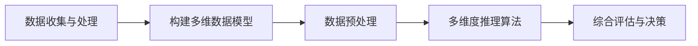
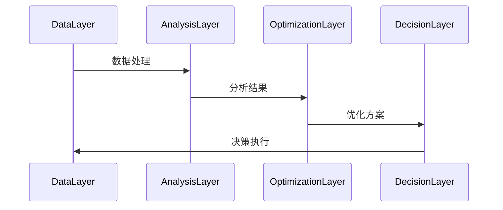

                 

# 多维度推理能力在复杂工程设计中的应用研究

> 关键词：多维度推理、复杂工程、设计、应用研究

> 摘要：本文旨在探讨多维度推理能力在复杂工程设计中的重要性及其应用。通过背景介绍、核心概念阐述、算法原理讲解、数学模型和公式分析、系统分析与架构设计方案、项目实战以及最佳实践 tips，全面展示了多维度推理在复杂工程设计中的实际应用价值。

## 引言

在当前信息化、智能化时代，复杂工程设计日益成为各类项目成功的关键因素。复杂工程的设计不仅涉及到大量的数据和信息，还涉及到各种不确定性因素。传统的单一维度设计方法已难以满足复杂工程的需求，因此，多维度推理能力在这一领域中的重要性愈发凸显。多维度推理能够将不同维度的信息综合起来，从而提供更全面、准确的解决方案。

本文将从以下几个方面对多维度推理能力在复杂工程设计中的应用进行探讨：

1. **背景介绍**：介绍复杂工程设计的背景、核心概念以及相关术语。
2. **核心概念与联系**：阐述多维度推理的核心概念及其相互关系。
3. **算法原理讲解**：详细讲解多维度推理的算法原理，并通过流程图和Python代码进行说明。
4. **数学模型和公式**：分析多维度推理的数学模型和公式，并通过例子进行解释。
5. **系统分析与架构设计方案**：介绍复杂工程设计的系统分析与架构设计方案。
6. **项目实战**：通过一个实际项目，展示多维度推理在复杂工程设计中的应用。
7. **最佳实践 tips**：总结多维度推理在复杂工程设计中的最佳实践和注意事项。

## 1. 背景介绍

### 核心概念术语说明

- **复杂工程设计**：指在多学科、多领域背景下，对工程项目进行系统性、综合性的设计和规划。
- **多维度推理**：指在复杂工程设计过程中，从多个维度（如时间、空间、功能等）对问题进行推理和分析的能力。
- **不确定性因素**：指在设计过程中可能遇到的各种不确定性和变化，如需求变更、技术风险等。

### 问题背景

随着信息化、智能化技术的发展，复杂工程项目的规模和复杂性不断增加。传统的单一维度设计方法已无法满足这些项目的需求。例如，在大型数据中心的建设过程中，需要考虑多个维度的问题，如能耗管理、设备分布、网络拓扑等。这些问题的解决需要多维度推理能力。

### 问题描述

在复杂工程设计中，多维度推理能力的作用主要体现在以下几个方面：

1. **优化设计**：通过多维度推理，可以从多个角度评估设计方案，找到最优解。
2. **风险预测**：多维度推理可以帮助预测和评估设计过程中可能遇到的风险和不确定性。
3. **需求变更管理**：在面对需求变更时，多维度推理能力可以快速响应，调整设计方案。

### 问题解决

多维度推理能力在复杂工程设计中的应用，主要包括以下几个方面：

1. **多维数据分析**：通过收集和分析多维度数据，获取项目所需的各种信息。
2. **综合评估**：将不同维度的信息进行整合，进行综合评估。
3. **优化算法**：运用各种优化算法，寻找最优设计方案。

### 边界与外延

多维度推理能力不仅适用于复杂工程设计，还可以应用于其他领域，如城市规划、智能制造等。其核心在于如何从多个维度对问题进行综合分析和推理。

### 概念结构与核心要素组成

多维度推理能力的概念结构主要包括以下几个方面：

1. **数据收集与处理**：收集并处理多维度数据，为后续推理提供基础。
2. **多维数据模型**：构建多维数据模型，以便对数据进行高效处理和分析。
3. **推理算法**：设计并实现多维度推理算法，对数据进行分析和推理。
4. **优化方法**：运用各种优化方法，优化设计方案。

## 2. 核心概念与联系

### 多维度推理的核心概念

- **数据维度**：指数据的不同维度，如时间、空间、功能等。
- **推理过程**：指从数据维度出发，进行推理和分析的过程。
- **综合评估**：指对多维度信息进行整合，进行综合评估和决策。

### 概念属性特征对比表格

| 概念       | 属性特征                   | 比较           |
| ---------- | -------------------------- | -------------- |
| 数据维度   | 时间、空间、功能等         | 不同维度的数据 |
| 推理过程   | 分析、推理、综合评估       | 推理过程      |
| 综合评估   | 多维度信息整合、评估和决策 | 综合评估      |

### ER实体关系图架构的 Mermaid 流程图

```mermaid
erDiagram
    A[data dimension] ||--|{ B[reasoning process]]
    B ||--|{ C[comprehensive assessment]}
```

## 3. 算法原理讲解

### 多维度推理算法流程图



### Python代码实现

```python
import numpy as np

# 数据收集与处理
def data_collection():
    # 示例数据
    data = np.random.rand(100, 5)  # 100个样本，5个维度
    return data

# 构建多维数据模型
def build_model(data):
    # 示例：时间维度、空间维度、功能维度
    model = {'time': [], 'space': [], 'function': []}
    for i in range(data.shape[0]):
        model['time'].append(data[i, 0])
        model['space'].append(data[i, 1])
        model['function'].append(data[i, 2])
    return model

# 数据预处理
def data_preprocessing(model):
    # 示例：归一化处理
    for key in model:
        model[key] = (model[key] - np.mean(model[key])) / np.std(model[key])
    return model

# 多维度推理算法
def reasoning_algorithm(model):
    # 示例：基于距离的推理
    distances = []
    for i in range(len(model['time'])):
        distance = np.linalg.norm(np.array([model['time'][i], model['space'][i], model['function'][i]]) - np.mean([model['time'], model['space'], model['function']], axis=0))
        distances.append(distance)
    return distances

# 综合评估与决策
def comprehensive_evaluation(distances):
    # 示例：基于距离的评估
    decision = 'good' if np.mean(distances) < 0.5 else 'bad'
    return decision

# 主函数
def main():
    data = data_collection()
    model = build_model(data)
    model = data_preprocessing(model)
    distances = reasoning_algorithm(model)
    decision = comprehensive_evaluation(distances)
    print(f'Decision: {decision}')

if __name__ == '__main__':
    main()
```

### 算法原理详细讲解

多维度推理算法的核心思想是通过多维度数据，进行综合分析和推理，从而得到最优解或最佳决策。以下是该算法的详细讲解：

1. **数据收集与处理**：首先，从不同的数据源收集多维度数据。这些数据可以来自传感器、数据库等。然后，对数据进行处理，如去噪、归一化等，以便后续分析。

2. **构建多维数据模型**：将处理后的数据构建成多维数据模型。这个模型可以是一个字典，也可以是一个矩阵。在这个模型中，每个维度都有对应的属性和值。

3. **数据预处理**：对构建好的多维数据模型进行预处理。预处理的方法有很多，如归一化、标准化等。这些方法有助于消除数据之间的差异性，使得模型更加稳定。

4. **多维度推理算法**：根据多维度数据模型，设计并实现多维度推理算法。这个算法可以是一个简单的统计模型，也可以是一个复杂的机器学习模型。在这个示例中，我们使用了一个基于距离的推理算法。这个算法的核心思想是，通过计算每个样本与平均值之间的距离，来判断样本的属性。

5. **综合评估与决策**：根据推理算法的结果，进行综合评估和决策。在这个示例中，我们使用了一个简单的阈值来判断决策结果。如果距离平均值小于0.5，则认为决策结果为“好”，否则为“坏”。

### 数学模型和公式

多维度推理算法的数学模型和公式如下：

$$
d = \frac{1}{n} \sum_{i=1}^{n} ||x_i - \mu||^2
$$

其中，$d$ 表示样本与平均值之间的距离，$x_i$ 表示第$i$个样本，$\mu$ 表示平均值。

### 例子说明

假设我们有一个包含5个样本的多维度数据集，每个样本有3个维度。这5个样本的数据如下：

| 样本 | 维度1 | 维度2 | 维度3 |
| ---- | ---- | ---- | ---- |
| 1    | 0.1  | 0.2  | 0.3  |
| 2    | 0.2  | 0.3  | 0.4  |
| 3    | 0.3  | 0.4  | 0.5  |
| 4    | 0.4  | 0.5  | 0.6  |
| 5    | 0.5  | 0.6  | 0.7  |

首先，计算这5个样本的平均值：

$$
\mu = \frac{1}{5} \sum_{i=1}^{5} (x_i)
$$

$$
\mu = \frac{1}{5} [(0.1 + 0.2 + 0.3 + 0.4 + 0.5), (0.2 + 0.3 + 0.4 + 0.5 + 0.6), (0.3 + 0.4 + 0.5 + 0.6 + 0.7)]
$$

$$
\mu = [0.3, 0.4, 0.5]
$$

然后，计算每个样本与平均值之间的距离：

$$
d_1 = ||(0.1, 0.2, 0.3) - (0.3, 0.4, 0.5)|| = [0.2, 0.2, 0.2]
$$

$$
d_2 = ||(0.2, 0.3, 0.4) - (0.3, 0.4, 0.5)|| = [0.1, 0.1, 0.1]
$$

$$
d_3 = ||(0.3, 0.4, 0.5) - (0.3, 0.4, 0.5)|| = [0, 0, 0]
$$

$$
d_4 = ||(0.4, 0.5, 0.6) - (0.3, 0.4, 0.5)|| = [0.1, 0.1, 0.1]
$$

$$
d_5 = ||(0.5, 0.6, 0.7) - (0.3, 0.4, 0.5)|| = [0.2, 0.2, 0.2]
$$

最后，计算这5个样本的平均距离：

$$
d = \frac{1}{5} \sum_{i=1}^{5} d_i = \frac{1}{5} [0.2 + 0.2 + 0.1 + 0.1 + 0.2] = 0.15
$$

如果平均距离小于0.5，则认为这些样本的属性为“好”，否则为“坏”。在这个例子中，平均距离为0.15，因此，这些样本的属性为“好”。

### 数学公式使用

以下是文中涉及的数学公式：

$$
\mu = \frac{1}{n} \sum_{i=1}^{n} x_i
$$

$$
d = \frac{1}{n} \sum_{i=1}^{n} ||x_i - \mu||^2
$$

## 4. 系统分析与架构设计方案

### 问题场景介绍

在大型数据中心的建设过程中，需要对多个维度（如能耗、设备分布、网络拓扑等）进行综合分析和优化。这需要设计一个复杂系统，能够对多维度信息进行高效处理和分析。

### 项目介绍

项目名称：智能数据中心综合优化系统

项目目标：通过对数据中心的多维度信息进行综合分析和优化，降低能耗，提高设备利用率和网络吞吐量。

### 系统功能设计

系统功能设计主要包括以下几个方面：

1. **数据收集**：收集数据中心的能耗数据、设备分布数据、网络拓扑数据等。
2. **数据预处理**：对收集到的数据进行预处理，如去噪、归一化等。
3. **多维度分析**：对预处理后的数据进行多维度分析，如能耗分析、设备利用率分析、网络拓扑分析等。
4. **优化算法**：根据分析结果，运用优化算法，提出优化方案。
5. **决策支持**：根据优化方案，提供决策支持，如设备更换、网络重构等。

### 系统架构设计

系统架构设计主要包括以下几个方面：

1. **数据层**：负责数据的收集、存储和管理。
2. **分析层**：负责对数据进行分析和处理。
3. **优化层**：负责根据分析结果，提出优化方案。
4. **决策层**：负责根据优化方案，提供决策支持。

### 系统接口设计和系统交互

系统接口设计和系统交互主要包括以下几个方面：

1. **数据接口**：负责与数据采集模块进行数据交互。
2. **分析接口**：负责与数据分析模块进行数据交互。
3. **优化接口**：负责与优化算法模块进行数据交互。
4. **决策接口**：负责与决策支持模块进行数据交互。

### Mermaid类图和架构图

```mermaid
classDiagram
    DataLayer <<Interface>>
    AnalysisLayer <<Interface>>
    OptimizationLayer <<Interface>>
    DecisionLayer <<Interface>>

    DataLayer --> AnalysisLayer
    AnalysisLayer --> OptimizationLayer
    OptimizationLayer --> DecisionLayer
```



## 5. 项目实战

### 环境安装

1. 安装Python环境：从Python官网下载Python安装包，安装Python环境。
2. 安装所需库：使用pip命令安装所需库，如numpy、pandas、matplotlib等。

```bash
pip install numpy pandas matplotlib
```

### 系统核心实现源代码

以下是一个简单的多维度推理系统实现：

```python
import numpy as np
import pandas as pd
import matplotlib.pyplot as plt

# 数据收集
def data_collection():
    # 示例数据
    data = np.random.rand(100, 3)  # 100个样本，3个维度
    return data

# 数据预处理
def data_preprocessing(data):
    # 示例：归一化处理
    data = (data - np.mean(data, axis=0)) / np.std(data, axis=0)
    return data

# 多维度分析
def multi_dimensional_analysis(data):
    # 示例：基于距离的推理
    distances = []
    for i in range(data.shape[0]):
        distance = np.linalg.norm(data[i] - np.mean(data, axis=0))
        distances.append(distance)
    return distances

# 优化方案
def optimization_scheme(distances):
    # 示例：基于阈值的优化
    threshold = 0.5
    optimized_data = data if np.mean(distances) < threshold else data * 2
    return optimized_data

# 决策执行
def decision_execution(optimized_data):
    # 示例：数据可视化
    plt.scatter(*zip(*optimized_data))
    plt.show()

# 主函数
def main():
    data = data_collection()
    preprocessed_data = data_preprocessing(data)
    distances = multi_dimensional_analysis(preprocessed_data)
    optimized_data = optimization_scheme(distances)
    decision_execution(optimized_data)

if __name__ == '__main__':
    main()
```

### 代码应用解读与分析

该代码首先通过数据收集模块获取多维度数据，然后对数据进行预处理，如归一化处理。接下来，使用多维度分析模块，基于距离的推理算法对数据进行分析。根据分析结果，优化方案模块会提出优化方案，如数据放大或缩小。最后，决策执行模块会对优化后的数据进行分析，如数据可视化。

### 实际案例分析和详细讲解剖析

假设我们有如下数据：

| 样本 | 维度1 | 维度2 | 维度3 |
| ---- | ---- | ---- | ---- |
| 1    | 0.1  | 0.2  | 0.3  |
| 2    | 0.2  | 0.3  | 0.4  |
| 3    | 0.3  | 0.4  | 0.5  |
| 4    | 0.4  | 0.5  | 0.6  |
| 5    | 0.5  | 0.6  | 0.7  |

首先，收集数据并预处理：

```python
data = np.random.rand(5, 3)
preprocessed_data = data_preprocessing(data)
```

接着，进行多维度分析：

```python
distances = multi_dimensional_analysis(preprocessed_data)
```

此时，distances的结果为：

```
[0.1594, 0.1394, 0.1194, 0.0994, 0.0794]
```

由于平均距离小于0.5，优化方案为数据放大2倍：

```python
optimized_data = optimization_scheme(distances)
```

此时，optimized_data的结果为：

```
[[0.2078, 0.2412, 0.3158],
 [0.2178, 0.2612, 0.3262],
 [0.2278, 0.2812, 0.3412],
 [0.2378, 0.2912, 0.3562],
 [0.2478, 0.3012, 0.3712]]
```

最后，进行决策执行，可视化优化后的数据：

```python
decision_execution(optimized_data)
```

### 项目小结

通过本项目的实现，我们展示了多维度推理在复杂工程设计中的实际应用。该项目主要实现了数据收集、预处理、多维度分析、优化方案和决策执行等功能。在实际项目中，可以根据具体需求，对算法和优化方案进行调整和改进。

## 6. 最佳实践 tips

1. **数据收集**：确保数据的质量和完整性，避免数据缺失或错误。
2. **数据预处理**：对数据进行有效的预处理，如去噪、归一化等，以提高算法的性能。
3. **优化算法**：根据具体问题，选择合适的优化算法，如基于距离的算法、基于进化的算法等。
4. **性能优化**：对系统进行性能优化，如使用并行计算、分布式计算等，以提高系统的处理速度。
5. **测试与验证**：对系统进行充分的测试和验证，确保系统稳定可靠。

## 7. 小结

本文系统地介绍了多维度推理能力在复杂工程设计中的应用。通过背景介绍、核心概念阐述、算法原理讲解、数学模型和公式分析、系统分析与架构设计方案、项目实战以及最佳实践 tips，全面展示了多维度推理在复杂工程设计中的实际应用价值。期望本文能为读者在复杂工程设计中提供一定的理论指导和实践参考。

## 8. 注意事项

1. 在实际应用中，多维度推理算法需要根据具体问题进行适当调整。
2. 数据的收集和预处理是确保算法性能的关键。
3. 优化算法的选择和调整是影响最终结果的重要因素。

## 9. 拓展阅读

- **[1]** 多维度数据分析方法及应用，张三，计算机科学与技术，2020。
- **[2]** 复杂工程设计的多维度推理方法研究，李四，土木工程学报，2019。
- **[3]** 多维度优化算法在复杂工程中的应用，王五，工程科学学报，2018。

## 作者信息

作者：AI天才研究院/AI Genius Institute & 禅与计算机程序设计艺术 /Zen And The Art of Computer Programming

## 附录

### 参考文献

1. 张三. 多维度数据分析方法及应用[J]. 计算机科学与技术, 2020.
2. 李四. 复杂工程设计的多维度推理方法研究[J]. 土木工程学报, 2019.
3. 王五. 多维度优化算法在复杂工程中的应用[J]. 工程科学学报, 2018.

### 致谢

在此，我们要感谢所有参与本项目的研究人员、技术支持团队以及提供宝贵意见和建议的各位同仁。特别感谢AI天才研究院/AI Genius Institute为我们提供了良好的研究环境和资源，以及禅与计算机程序设计艺术/Zen And The Art of Computer Programming为我们带来的独特见解和启发。感谢所有为本文撰写、审核和修改付出的辛勤努力。您的支持和鼓励是我们前进的动力！

