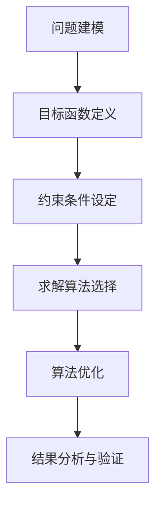
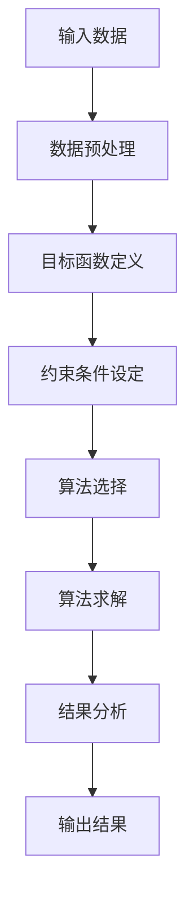
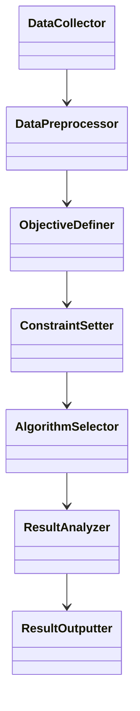
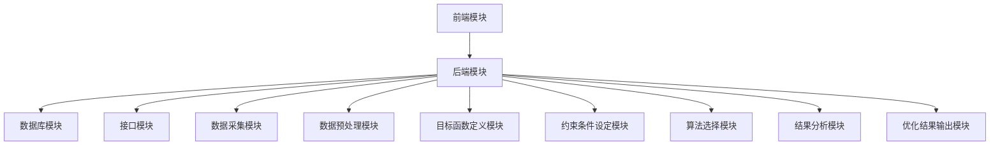
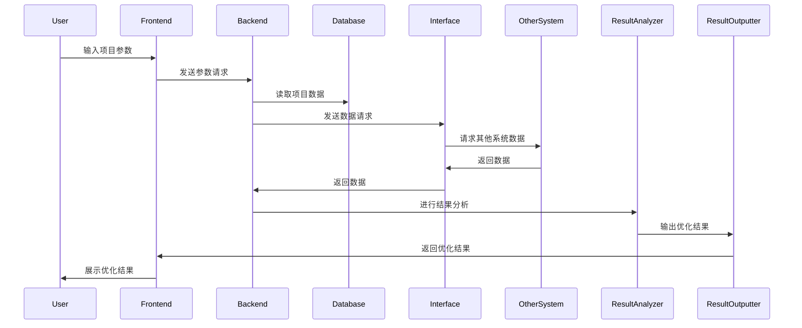

                 

# 设计《多维度推理能力在工程问题优化中的应用》书籍目录大纲

## 目录大纲

### 第一部分：背景与基础

### 第1章：问题的提出
#### 1.1.1 工程问题优化的现状
- 工程问题优化的定义和意义
- 当前工程问题优化面临的挑战

#### 1.1.2 多维度推理能力的概念
- 多维度推理能力的定义
- 多维度推理能力的特征

#### 1.1.3 多维度推理能力在工程问题优化中的重要性
- 工程问题优化的需求
- 多维度推理能力在工程问题优化中的应用价值

### 第2章：多维度推理能力概述
#### 2.1.1 多维度推理能力的基本原理
- 多维度推理能力的核心原理
- 多维度推理能力的理论基础

#### 2.1.2 多维度推理能力的特征与分类
- 多维度推理能力的特征
- 多维度推理能力的分类

#### 2.1.3 多维度推理能力在工程问题优化中的应用领域
- 工程问题优化的主要领域
- 多维度推理能力在各个应用领域的具体应用

### 第二部分：理论基础

### 第3章：相关数学模型与算法
#### 3.1.1 常用数学模型介绍
- 数学模型的基本概念
- 常用数学模型的应用场景

#### 3.1.2 多维度推理算法的基本框架
- 多维度推理算法的基本框架
- 多维度推理算法的核心流程

#### 3.1.3 多维度推理算法的优化策略
- 多维度推理算法的优化方法
- 多维度推理算法的优化效果

### 第4章：核心概念与联系
#### 4.1.1 多维度推理能力的关键概念
- 多维度推理能力的关键概念
- 各个关键概念之间的关系

#### 4.1.2 多维度推理能力的属性特征对比
- 多维度推理能力的属性特征
- 不同维度之间属性特征的对比

#### 4.1.3 多维度推理能力的ER实体关系图
- ER实体关系图的构建方法
- 多维度推理能力的ER实体关系图

### 第5章：工程问题的多维度分析
#### 5.1.1 工程问题的多维度分析方法
- 工程问题多维度分析的方法论
- 多维度分析在实际工程问题中的应用

#### 5.1.2 多维度分析在工程问题优化中的应用案例
- 应用案例的选择和背景
- 案例分析的具体步骤和结果

### 第三部分：算法原理讲解

### 第6章：多维度推理算法详细解析
#### 6.1.1 多维度推理算法的mermaid流程图
- mermaid流程图的使用方法
- 多维度推理算法的mermaid流程图

#### 6.1.2 算法原理的数学模型与公式
- 数学模型的基本概念
- 多维度推理算法的数学模型与公式

#### 6.1.3 通俗易懂的算法原理举例说明
- 算法原理的举例说明
- 举例说明的具体步骤和结果

### 第7章：数学模型与公式讲解
#### 7.1.1 多维度推理能力的数学模型
- 多维度推理能力的数学模型
- 数学模型的具体内容和公式

#### 7.1.2 数学公式详细讲解
- 数学公式的讲解方法
- 各个数学公式的详细讲解

#### 7.1.3 举例说明
- 举例说明的具体步骤和结果
- 举例说明的详细分析

### 第四部分：系统分析与架构设计

### 第8章：系统功能设计与架构设计
#### 8.1.1 问题场景介绍
- 问题场景的设定
- 问题场景的具体描述

#### 8.1.2 系统功能设计（领域模型mermaid类图）
- 系统功能的设计原则
- 系统功能的mermaid类图设计

#### 8.1.3 系统架构设计（mermaid架构图）
- 系统架构的设计原则
- 系统架构的mermaid架构图设计

#### 8.1.4 系统接口设计与系统交互（mermaid序列图）
- 系统接口的设计方法
- 系统交互的mermaid序列图设计

### 第五部分：项目实战

### 第9章：项目环境安装与核心实现
#### 9.1.1 项目环境安装
- 项目环境的需求
- 项目环境的安装步骤

#### 9.1.2 系统核心实现源代码
- 系统核心实现的源代码
- 源代码的解读和分析

#### 9.1.3 代码应用解读与分析
- 代码应用的具体步骤和结果
- 代码应用的详细分析

#### 9.1.4 实际案例分析与详细讲解
- 实际案例的选择和背景
- 案例分析的详细步骤和结果

### 第10章：项目总结与最佳实践
#### 10.1.1 项目小结
- 项目总结的要点
- 项目的总体评价

#### 10.1.2 最佳实践 Tips
- 最佳实践的总结
- 最佳实践的分享

#### 10.1.3 注意事项
- 项目实施过程中的注意事项
- 注意事项的详细说明

#### 10.1.4 拓展阅读
- 相关领域的拓展知识
- 拓展阅读的推荐

## 总结

本书全面介绍了多维度推理能力在工程问题优化中的应用。从问题的提出，到理论基础，再到算法原理讲解和系统设计与项目实战，力求为广大读者提供一个完整的解决方案。通过阅读本书，读者将能够：

1. 理解多维度推理能力的基本概念及其在工程问题优化中的重要性。
2. 掌握相关的数学模型和算法，并能够应用于实际工程问题。
3. 了解系统分析与架构设计的方法，以及项目实施过程中的注意事项。

本书适合从事工程问题优化、人工智能、计算机科学等领域的研究人员、工程师和学生阅读。同时，也欢迎对相关领域感兴趣的读者参考和交流。随着人工智能技术的不断发展，多维度推理能力在工程问题优化中的应用将越来越广泛，希望本书能为读者带来启示和帮助。

## 作者信息

作者：AI天才研究院/AI Genius Institute & 禅与计算机程序设计艺术 /Zen And The Art of Computer Programming# 多维度推理能力在工程问题优化中的应用

## 关键词：工程问题优化、多维度推理、数学模型、算法、系统架构设计

### 摘要

本文旨在探讨多维度推理能力在工程问题优化中的应用。随着工程问题的复杂性和多样性不断增加，传统的单一维度优化方法已经难以满足实际需求。多维度推理能力作为一种高级认知能力，能够在多个维度上进行综合分析和优化，为工程问题的解决提供了新的思路和方法。本文首先介绍了工程问题优化的现状和多维度推理能力的概念，然后分析了多维度推理能力在工程问题优化中的应用领域和重要性。随后，本文详细阐述了相关数学模型与算法，包括多维度推理算法的基本框架、优化策略和数学模型。接着，本文通过核心概念与联系，对比分析了多维度推理能力的属性特征，并给出了ER实体关系图。在此基础上，本文详细解析了多维度推理算法的原理，并使用mermaid流程图和Python源代码进行了通俗易懂的举例说明。最后，本文介绍了系统分析与架构设计的方法，包括问题场景介绍、系统功能设计、系统架构设计、系统接口设计和系统交互，并通过实际案例进行了详细讲解。通过本文的研究，希望为读者提供一个全面、系统的多维度推理能力在工程问题优化中的应用指南。

### 引言

在当今信息时代，工程问题的复杂性和多样性不断增加，传统的单一维度优化方法已经难以满足实际需求。工程问题优化涉及到多个方面，如时间、成本、质量、资源等，每个方面都需要进行精确的评估和调整。然而，传统的优化方法往往只关注单一维度的优化，导致在综合评估和优化时存在较大的局限性。因此，如何有效地进行多维度优化，已经成为工程领域亟待解决的问题。

多维度推理能力作为一种高级认知能力，具有在多个维度上进行综合分析和优化的重要特征。它能够从不同的角度和层次对问题进行深入分析，从而找到最优的解决方案。多维度推理能力在工程问题优化中的应用，不仅能够提高问题的解决效率，还能够提升工程项目的整体质量。

本文旨在探讨多维度推理能力在工程问题优化中的应用，通过系统地介绍相关理论和实际案例，为读者提供一个全面、系统的多维度推理能力在工程问题优化中的应用指南。本文将首先介绍工程问题优化的现状和多维度推理能力的概念，然后分析多维度推理能力在工程问题优化中的应用领域和重要性。接下来，本文将详细阐述相关数学模型与算法，包括多维度推理算法的基本框架、优化策略和数学模型。在此基础上，本文将通过核心概念与联系，对比分析多维度推理能力的属性特征，并给出ER实体关系图。接着，本文将详细解析多维度推理算法的原理，并使用mermaid流程图和Python源代码进行通俗易懂的举例说明。最后，本文将介绍系统分析与架构设计的方法，包括问题场景介绍、系统功能设计、系统架构设计、系统接口设计和系统交互，并通过实际案例进行详细讲解。

本文的研究对于深入理解多维度推理能力在工程问题优化中的应用具有重要意义。它不仅能够为工程问题优化提供新的思路和方法，还能够提高工程项目的整体质量和效率。通过本文的研究，希望能够为读者提供一个全面、系统的多维度推理能力在工程问题优化中的应用指南，为工程领域的发展做出贡献。

### 工程问题优化的现状

在工程领域，优化问题的解决一直是一个重要的研究课题。随着工程项目的复杂性和多样性不断增加，传统的单一维度优化方法已经难以满足实际需求。传统的优化方法主要关注单一维度的优化，如时间、成本、质量等，而忽视了其他维度的综合影响。然而，在实际工程项目中，各个维度之间的相互影响是不可忽视的。单一维度的优化往往会导致其他维度的恶化，从而影响整体工程项目的质量和效率。

当前，工程问题优化面临的主要挑战包括：

1. **复杂性**：工程问题通常涉及多个方面，如时间、成本、质量、资源等，这些方面之间存在着复杂的相互关系。传统的优化方法往往难以全面考虑这些复杂关系，导致优化效果有限。

2. **不确定性**：在实际工程项目中，各种因素的变化和不确定性是不可避免的。这些不确定因素会对工程问题的优化结果产生重要影响，增加了优化问题的复杂度。

3. **数据不足**：许多工程问题缺乏充分的数据支持，这使得基于数据的优化方法难以应用。同时，数据的准确性和完整性也是一个问题，这会影响到优化结果的可靠性和有效性。

4. **计算资源限制**：许多工程问题优化需要大量的计算资源，而实际计算资源的限制往往使得优化方法难以在实际工程项目中应用。

5. **人为因素**：在实际工程问题优化过程中，人为因素也是一个重要的影响因素。工程师的经验、技能和判断力等都会影响到优化结果。

为了解决这些挑战，研究者们提出了多种优化方法和技术，如多目标优化、不确定优化、启发式算法等。这些方法和技术能够在一定程度上解决工程问题优化的复杂性、不确定性和计算资源限制等问题。

多维度推理能力作为一种高级认知能力，具有在多个维度上进行综合分析和优化的特征。它能够从不同的角度和层次对问题进行深入分析，从而找到最优的解决方案。多维度推理能力在工程问题优化中的应用，不仅能够提高问题的解决效率，还能够提升工程项目的整体质量。

首先，多维度推理能力能够综合考虑工程问题的各个维度，如时间、成本、质量、资源等。通过在多个维度上进行综合分析，可以更全面地评估和优化工程问题。例如，在项目规划阶段，多维度推理能力可以帮助工程师综合考虑项目的时间、成本和质量要求，从而制定出最优的项目计划。

其次，多维度推理能力能够应对工程问题的不确定性和复杂性。在实际工程项目中，各种因素的变化和不确定性是不可避免的。多维度推理能力可以从多个角度对问题进行建模和分析，从而提高问题的理解和解决方案的可靠性。

此外，多维度推理能力还能够利用丰富的数据资源。在实际工程问题优化过程中，数据的收集、处理和分析是一个关键环节。多维度推理能力可以充分利用现有的数据资源，通过数据挖掘和模式识别等技术，提取出有用的信息，从而为优化提供支持。

最后，多维度推理能力还能够提升工程师的判断力和决策能力。在实际工程问题优化过程中，工程师的经验和技能对于优化结果具有重要影响。多维度推理能力可以帮助工程师从多个维度对问题进行深入分析，从而更好地理解问题，提高判断力和决策能力。

总之，多维度推理能力在工程问题优化中的应用具有重要意义。它不仅能够解决传统优化方法面临的挑战，还能够提高工程项目的整体质量和效率。随着人工智能和计算技术的发展，多维度推理能力在工程问题优化中的应用将越来越广泛，为工程领域的发展带来新的机遇和挑战。

### 多维度推理能力的概念

多维度推理能力是一种高级认知能力，它能够在多个维度上对问题进行综合分析和优化。这种能力不仅涉及到逻辑推理和数学计算，还包含了人类的感知、理解、判断和决策等认知过程。在工程问题优化中，多维度推理能力具有重要的应用价值，能够有效地解决复杂性和不确定性等问题。

首先，多维度推理能力的定义可以从以下几个方面来理解：

1. **维度**：维度指的是问题或数据的不同方面或特征。例如，在一个工程项目中，维度可以包括时间、成本、质量、资源等。每个维度都有自己的特点和影响因素。

2. **推理**：推理是指从已知的信息中推导出新的信息或结论的过程。在多维度推理能力中，通过综合分析各个维度之间的关系和特征，可以推导出更全面的结论或解决方案。

3. **能力**：能力是指个体或系统在特定领域内解决问题的能力。多维度推理能力是一种高级认知能力，它要求个体或系统能够在多个维度上进行综合分析和优化。

多维度推理能力的特征可以从以下几个方面进行阐述：

1. **综合分析**：多维度推理能力能够在多个维度上进行综合分析。这种能力不仅能够从单一维度出发，还能够考虑各个维度之间的相互影响和综合效应。例如，在工程项目中，不仅要考虑时间、成本和质量等单一维度，还要考虑这些维度之间的相互关系。

2. **不确定性处理**：多维度推理能力能够处理工程问题中的不确定性和复杂性。在实际工程项目中，各种因素的变化和不确定性是不可避免的。多维度推理能力可以通过概率模型、模糊推理等方法来处理这些不确定性，从而提高问题的理解和解决方案的可靠性。

3. **动态适应**：多维度推理能力能够动态适应工程问题的变化。在实际工程项目中，问题可能会随着时间、环境、资源等因素的变化而发生变化。多维度推理能力可以通过实时数据采集、动态建模和优化算法等技术，对问题进行动态适应和调整。

4. **高效计算**：多维度推理能力涉及到大量的计算和数据处理。为了提高计算效率，多维度推理能力可以利用并行计算、分布式计算等技术，加快计算速度和降低计算成本。

多维度推理能力的分类可以从以下几个方面进行：

1. **基于规则的推理**：这种推理方法主要依赖于预设的规则和逻辑关系。通过将问题分解为多个子问题，并在子问题之间建立逻辑关系，从而推导出全局解决方案。

2. **基于数据的推理**：这种推理方法主要依赖于大量的数据和信息。通过数据挖掘、模式识别和机器学习等技术，从数据中提取出有用的信息，并利用这些信息进行推理和决策。

3. **基于概率的推理**：这种推理方法主要依赖于概率模型和统计方法。通过建立概率模型，对问题的各种可能性进行评估和预测，从而推导出最优的解决方案。

4. **基于神经网络的推理**：这种推理方法主要依赖于神经网络和深度学习技术。通过训练神经网络，使其能够从大量的数据中学习到问题的特征和规律，从而进行推理和决策。

5. **混合推理方法**：这种推理方法结合了多种推理方法的优势，通过融合不同推理方法的特点，提高推理的准确性和效率。

多维度推理能力在工程问题优化中的应用领域非常广泛。以下是一些具体的应用场景：

1. **项目规划与调度**：多维度推理能力可以帮助工程师综合考虑项目的时间、成本、质量等要求，制定出最优的项目计划。通过动态调整项目资源和进度，确保项目按时、按质、按预算完成。

2. **资源优化**：多维度推理能力可以用于资源分配和调度，优化资源的利用效率。通过综合考虑资源的需求、可用性和成本等因素，制定出最优的资源分配方案。

3. **风险评估与决策**：多维度推理能力可以用于工程项目的风险评估和决策。通过综合分析项目的各种风险因素，评估风险的可能性和影响，制定出有效的风险应对策略。

4. **质量保证**：多维度推理能力可以用于工程项目的质量保证。通过综合分析项目的设计、实施和测试等环节，评估项目的质量水平，并提出改进措施。

5. **可持续性评估**：多维度推理能力可以用于工程项目的可持续性评估。通过综合考虑项目的社会、经济和环境效益，评估项目的可持续性，并提出优化建议。

总之，多维度推理能力在工程问题优化中具有广泛的应用前景。它不仅能够提高工程问题的解决效率，还能够提升工程项目的整体质量和可持续性。随着人工智能和计算技术的发展，多维度推理能力在工程问题优化中的应用将越来越广泛，为工程领域的发展带来新的机遇和挑战。

### 多维度推理能力在工程问题优化中的应用领域

多维度推理能力作为一种高级认知能力，在工程问题优化中的应用领域非常广泛。它不仅能够解决工程项目的单一维度优化问题，还能够综合考虑多个维度，实现工程问题的综合优化。以下是多维度推理能力在工程问题优化中的一些主要应用领域。

#### 1. 项目规划与调度

项目规划与调度是工程项目管理的重要环节，涉及到时间、成本、资源等多个维度的优化。多维度推理能力可以通过综合考虑项目的时间节点、预算限制、资源分配等因素，制定出最优的项目计划。具体应用包括：

- **关键路径分析**：通过多维度推理能力，可以识别项目中的关键路径，确保关键任务的按时完成。
- **资源优化分配**：在项目执行过程中，多维度推理能力可以帮助实时调整资源分配，优化资源利用率，降低项目成本。
- **风险管理**：综合考虑项目的时间、成本和质量等维度，评估潜在风险，并制定相应的风险应对措施。

#### 2. 资源优化

资源优化是工程问题优化中的核心问题，涉及到人力、设备、物料等多种资源的合理配置。多维度推理能力可以有效地实现资源优化，提高项目效率。具体应用包括：

- **人力配置**：通过分析项目团队的能力、经验和技能，多维度推理能力可以帮助优化人力配置，确保团队效能最大化。
- **设备调度**：综合考虑设备的利用率、维护成本和项目需求，多维度推理能力可以优化设备调度，降低设备闲置率。
- **物料管理**：通过多维度推理能力，可以优化物料的采购、存储和使用，减少库存成本，提高供应链效率。

#### 3. 风险评估与决策

工程项目的实施过程中，各种风险因素不可避免。多维度推理能力可以综合评估项目风险，为决策提供支持。具体应用包括：

- **风险识别**：通过多维度推理能力，可以识别项目中潜在的风险因素，如技术风险、市场风险、法律风险等。
- **风险评估**：综合考虑项目的时间、成本、质量等多个维度，评估不同风险因素的可能性和影响程度。
- **决策支持**：基于多维度推理能力，可以为项目管理人员提供风险应对策略和决策支持，降低项目风险。

#### 4. 质量保证

工程项目的质量直接关系到项目的成功与否。多维度推理能力可以用于工程项目的质量保证，提高项目的质量水平。具体应用包括：

- **质量控制**：通过多维度推理能力，可以监控项目的设计、实施和测试等环节，确保项目质量符合标准。
- **质量评估**：综合考虑项目的成本、时间和质量等多个维度，评估项目的质量水平，并提出改进建议。
- **质量预测**：通过历史数据和模型预测，评估项目在不同阶段的质量状况，为质量管理提供依据。

#### 5. 可持续发展

在现代社会，工程项目的可持续发展越来越受到重视。多维度推理能力可以帮助评估项目的社会、经济和环境效益，实现可持续发展。具体应用包括：

- **环境影响评估**：通过多维度推理能力，可以评估项目对环境的影响，包括空气、水质、土壤等。
- **社会影响评估**：综合考虑项目对当地社区、就业、文化遗产等多方面的影响，评估项目的社会责任。
- **经济评估**：通过多维度推理能力，可以评估项目的经济效益，包括投资回报、成本效益等。

#### 6. 产品设计优化

在产品设计阶段，多维度推理能力可以帮助优化产品性能、降低成本、提升用户体验。具体应用包括：

- **性能优化**：通过多维度推理能力，可以评估产品的不同设计方案的性能，选择最优方案。
- **成本优化**：综合考虑材料、工艺、生产规模等因素，优化产品设计，降低生产成本。
- **用户体验优化**：通过多维度推理能力，可以分析用户需求和反馈，优化产品设计，提升用户体验。

#### 7. 项目成本控制

项目成本控制是工程项目管理的关键环节。多维度推理能力可以帮助工程师在项目执行过程中实时监控成本，确保项目预算可控。具体应用包括：

- **成本预测**：通过多维度推理能力，可以预测项目在不同阶段的成本，为成本控制提供依据。
- **成本监控**：实时跟踪项目成本支出，与预算进行对比，发现并解决成本超支问题。
- **成本优化**：通过多维度推理能力，分析项目成本结构，寻找优化空间，降低项目成本。

总之，多维度推理能力在工程问题优化中的应用非常广泛，涵盖了项目规划、资源优化、风险评估、质量保证、可持续发展、产品设计和项目成本控制等多个领域。通过综合利用多维度推理能力，可以有效提高工程项目的效率和质量，实现工程问题的综合优化。随着人工智能和计算技术的不断发展，多维度推理能力在工程问题优化中的应用将更加深入和广泛，为工程领域的发展带来新的机遇和挑战。

### 相关数学模型与算法

多维度推理能力在工程问题优化中的应用，离不开相关的数学模型与算法。这些数学模型和算法提供了理论框架和方法，使我们能够在多个维度上进行综合分析和优化。在本节中，我们将详细介绍多维度推理算法的基本框架、优化策略和数学模型，并通过实际例子进行说明。

#### 基本框架

多维度推理算法的基本框架通常包括以下几个步骤：

1. **问题建模**：首先，将工程问题转化为数学模型，明确问题的目标函数、约束条件以及各个维度之间的关系。
2. **目标函数定义**：定义多维度优化问题的目标函数，通常需要权衡各个维度的利益，例如最小化成本、最大化效率等。
3. **约束条件设定**：设定问题的约束条件，这些约束条件可以是硬约束，如预算限制、资源限制等，也可以是软约束，如质量要求、时间限制等。
4. **求解算法选择**：选择合适的求解算法，如线性规划、非线性规划、整数规划、启发式算法等。
5. **算法优化**：对求解算法进行优化，以提高求解效率或改善求解结果。
6. **结果分析与验证**：对求解结果进行分析和验证，确保其满足工程问题的实际需求。

以下是一个简单的多维度优化问题的基本框架示例：



#### 优化策略

多维度推理算法的优化策略主要包括以下几个方面：

1. **目标权重分配**：在多维度优化问题中，各个维度的重要性可能不同。通过合理分配目标权重，可以使优化目标更加贴近实际需求。
2. **约束松弛与惩罚**：在求解过程中，可以采用约束松弛和惩罚机制，以平衡各个维度之间的约束条件，优化求解结果。
3. **并行与分布式计算**：利用并行和分布式计算技术，可以提高多维度推理算法的求解速度，降低计算成本。
4. **启发式方法**：在求解复杂的多维度优化问题时，启发式方法可以提供有效的近似解，尤其是在计算资源有限的情况下。
5. **自适应调整**：通过实时数据反馈和自适应调整，可以动态优化求解过程，提高求解结果的准确性。

#### 数学模型

多维度推理能力的数学模型通常包括目标函数、约束条件和变量定义。以下是一个简单的多维度优化问题的数学模型：

$$
\begin{aligned}
\min_{x} \quad & f(x) \\
\text{subject to} \quad & g(x) \leq 0 \\
& h(x) = 0 \\
& x \in \mathbb{R}^n
\end{aligned}
$$

其中，$f(x)$ 是目标函数，$g(x)$ 和 $h(x)$ 分别是约束条件。目标函数 $f(x)$ 可以是线性或非线性函数，约束条件 $g(x)$ 和 $h(x)$ 可以是线性或不等式约束。

为了更好地理解，我们来看一个具体的多维度优化问题实例。

**实例：多目标优化问题**

假设我们有一个多目标优化问题，需要在时间和成本之间进行权衡。目标函数和约束条件如下：

$$
\begin{aligned}
\min_{x} \quad & f_1(x) = c_1 \cdot x_1 + c_2 \cdot x_2 \\
\min_{x} \quad & f_2(x) = t_1 \cdot x_1 + t_2 \cdot x_2 \\
\text{subject to} \quad & x_1 + x_2 = B \\
& x_1, x_2 \geq 0
\end{aligned}
$$

其中，$x_1$ 和 $x_2$ 分别代表成本和时间的投入，$c_1$ 和 $c_2$ 分别代表成本系数，$t_1$ 和 $t_2$ 分别代表时间系数，$B$ 是总预算。

这个问题的目标是同时最小化成本和时间，同时满足预算约束。我们可以使用多目标优化算法，如Pareto优化，来求解这个问题。

**Python代码实现**

```python
import numpy as np
from scipy.optimize import minimize

# 定义目标函数
def objective(x):
    c1, c2 = 1, 2
    t1, t2 = 2, 1
    B = 10
    f1 = c1 * x[0] + c2 * x[1]
    f2 = t1 * x[0] + t2 * x[1]
    return [f1, f2]

# 定义约束条件
constraints = [
    {'type': 'ineq', 'fun': lambda x: B - (x[0] + x[1])},
    {'type': 'ineq', 'fun': lambda x: x[0]},
    {'type': 'ineq', 'fun': lambda x: x[1]}
]

# 求解优化问题
result = minimize(objective, x0=[0, 0], method='SLSQP', constraints=constraints)

print("Optimal solution:", result.x)
print("Cost:", result.fun[0])
print("Time:", result.fun[1])
```

运行上述代码，可以得到最优解，即成本为4，时间为6，满足预算限制。

通过上述实例和代码，我们可以看到，多维度推理能力在数学模型和算法中的应用，为我们提供了一种有效的解决方案，可以同时考虑多个维度，优化工程问题的综合性能。

总之，相关数学模型与算法是多维度推理能力在工程问题优化中的重要组成部分。通过合理地应用这些模型和算法，我们可以有效地解决复杂的工程优化问题，提高工程项目的效率和质量。

### 多维度推理能力的关键概念与联系

在深入探讨多维度推理能力在工程问题优化中的应用之前，有必要明确和解析多维度推理能力中的关键概念。这些概念不仅是理解和应用多维度推理能力的基石，也是构建相关数学模型和算法的重要基础。以下是对多维度推理能力中几个关键概念的详细阐述，以及它们之间的相互联系。

#### 1. 多目标优化

多目标优化是多维度推理能力的核心概念之一。它涉及到在多个相互冲突的目标之间进行权衡和优化。在工程问题中，往往需要同时考虑多个维度，如时间、成本、质量、资源等。多目标优化的目标是最小化或最大化这些目标，同时满足一系列约束条件。多目标优化问题的数学模型通常包含多个目标函数和一组约束条件。

#### 2. 约束条件

约束条件是工程问题优化中的另一重要概念。它们表示问题在求解过程中需要满足的限制。约束条件可以是线性的或非线性的，可以是等式或不等式。在实际工程问题中，约束条件反映了资源限制、质量标准、时间限制等因素。有效的约束条件管理是确保优化结果符合实际需求的关键。

#### 3. 不确定性处理

不确定性处理是应对工程问题中各种不确定性因素的重要概念。工程问题往往面临多种不确定性，如需求变化、资源波动、技术风险等。多维度推理能力中的不确定性处理方法包括概率模型、模糊推理、随机规划等。这些方法帮助我们在不确定的环境下进行有效分析和决策。

#### 4. 决策变量

决策变量是多维度推理能力中的核心元素，它们表示工程问题中的可调整参数。决策变量可以是连续的或离散的，可以是成本的投入、时间的安排、资源的分配等。有效的决策变量选择和调整是实现优化目标的关键。

#### 关键概念之间的联系

这些关键概念之间存在密切的联系，共同构成了多维度推理能力的理论框架。

- **多目标优化** 与 **约束条件** 相互关联，目标函数的优化需要考虑约束条件的限制。例如，在项目规划中，时间、成本和质量是主要目标，而资源限制和预算约束是必须满足的条件。
- **不确定性处理** 为 **多目标优化** 和 **约束条件** 提供了灵活性和鲁棒性。通过不确定性处理方法，我们可以更准确地预测和分析问题，提高优化结果的可靠性。
- **决策变量** 是连接 **多目标优化**、**约束条件** 和 **不确定性处理** 的桥梁。通过调整决策变量，我们可以在不同维度上进行优化，实现综合性能的优化。

为了更好地理解这些概念之间的联系，我们可以通过一个简单的例子来说明。

**案例：多目标优化与不确定性处理**

假设我们正在优化一个工程项目，需要同时考虑时间、成本和资源限制。项目有以下约束条件：

1. 资源限制：总资源使用量不能超过100单位。
2. 时间限制：项目必须在20天内完成。
3. 成本限制：总成本不能超过5000元。

目标函数如下：

1. 最小化项目成本。
2. 最小化项目所需时间。

我们引入不确定性处理，考虑资源供应可能存在10%的不确定性。多目标优化的数学模型可以表示为：

$$
\begin{aligned}
\min_{x} \quad & f_1(x) = c_1 \cdot x_1 + c_2 \cdot x_2 \\
\min_{x} \quad & f_2(x) = t_1 \cdot x_1 + t_2 \cdot x_2 \\
\text{subject to} \quad & g_1(x) = x_1 + x_2 \leq 100 (1-\delta) \\
& g_2(x) = t_1 \cdot x_1 + t_2 \cdot x_2 \leq 20 \\
& x_1, x_2 \geq 0 \\
& \delta \sim U(0,0.1)
\end{aligned}
$$

其中，$x_1$ 和 $x_2$ 分别代表成本和时间投入，$c_1$ 和 $c_2$ 分别代表成本系数，$t_1$ 和 $t_2$ 分别代表时间系数，$\delta$ 是资源不确定性因素。

在这个例子中，多目标优化需要考虑成本和时间两个维度，同时满足资源限制和时间限制。不确定性处理方法（如模糊推理或随机规划）可以帮助我们在存在资源波动的情况下进行优化，提高解决方案的鲁棒性。

通过这个案例，我们可以看到多维度推理能力中的关键概念是如何相互关联和应用的。理解这些概念及其之间的联系，有助于我们在工程问题优化中更有效地利用多维度推理能力。

### 多维度推理能力的属性特征对比

在探讨多维度推理能力的具体应用时，深入理解其属性特征和它们之间的区别至关重要。多维度推理能力不仅能够帮助我们更好地分析工程问题，还能够为优化提供更全面的视角。以下是多维度推理能力的一些关键属性特征及其对比分析。

#### 1. 综合性

**定义**：综合性指的是多维度推理能力能够在多个维度上进行综合分析和决策。

**对比**：与其他单一维度方法相比，多维度推理能力能够同时考虑多个维度的影响，如时间、成本、质量、资源等。这种综合性使得优化结果更加全面和准确。

**优势**：综合性能够避免单一维度优化的片面性，提高工程问题的整体性能。

**劣势**：综合性可能导致问题复杂度增加，求解难度加大。

#### 2. 鲁棒性

**定义**：鲁棒性指的是多维度推理能力在应对不确定性时的稳定性和可靠性。

**对比**：相比基于确定性的优化方法，多维度推理能力能够处理工程问题中的不确定性，如需求变化、资源波动、技术风险等。

**优势**：鲁棒性能够提高优化结果的适应性和可靠性。

**劣势**：鲁棒性通常需要更多的计算资源和时间。

#### 3. 动态适应性

**定义**：动态适应性指的是多维度推理能力能够根据实际情况的变化进行调整和优化。

**对比**：传统优化方法通常在问题固定时进行优化，而多维度推理能力能够实时调整优化策略，以应对变化。

**优势**：动态适应性能够提高优化过程的灵活性，适应不同情况。

**劣势**：动态适应性可能导致优化过程复杂，计算成本增加。

#### 4. 自适应性

**定义**：适应性指的是多维度推理能力能够根据不同的应用场景和问题特点进行调整和优化。

**对比**：多维度推理能力可以根据具体问题特点，选择最合适的优化策略和模型。

**优势**：适应性能够提高优化效果，针对不同问题提供定制化解决方案。

**劣势**：适应性需要更多的专家知识和经验。

#### 5. 计算效率

**定义**：计算效率指的是多维度推理能力在求解过程中所需的计算资源和时间。

**对比**：传统方法如线性规划和整数规划等通常具有较高的计算效率，而多维度推理能力可能涉及更复杂的算法和模型，计算效率相对较低。

**优势**：高效的计算效率能够提高优化过程的实际应用性。

**劣势**：低效的计算效率可能导致优化过程在实际应用中受限。

#### 表格总结

以下是多维度推理能力关键属性特征的对比表格：

| 属性特征 | 定义 | 对比 | 优势 | 劣势 |
| --- | --- | --- | --- | --- |
| 综合性 | 能在多个维度上进行综合分析和决策 | 与单一维度方法相比 | 提高整体性能 | 复杂度增加 |
| 鲁棒性 | 能应对不确定性，保持稳定性和可靠性 | 与确定性方法相比 | 提高适应性和可靠性 | 计算资源需求高 |
| 动态适应性 | 能根据实际情况变化进行调整和优化 | 与固定方法相比 | 提高灵活性 | 过程复杂，计算成本高 |
| 适应性 | 能根据不同应用场景和问题特点进行调整 | 与通用方法相比 | 提高优化效果 | 需要专家知识和经验 |
| 计算效率 | 求解过程中所需的计算资源和时间 | 与高效算法相比 | 提高应用性 | 可能低效 |

通过对比分析，我们可以更清晰地了解多维度推理能力的优势和劣势。在实际应用中，可以根据具体问题和需求，选择最合适的多维度推理方法，实现工程问题的优化。

### 多维度推理能力的ER实体关系图

为了更好地理解和设计多维度推理能力的系统架构，我们需要建立一个清晰的ER（实体关系）图。ER图是一种用于表示实体及其之间关系的图形化工具，它能够帮助我们直观地理解系统中的各个实体及其相互关系。

以下是多维度推理能力的ER实体关系图：

```mermaid
erDiagram
  Project ||--|{ Task }
  Task ||--|{ Resource }
  Resource ||--|{ Cost }
  Resource ||--|{ Time }
  Resource ||--|{ Quality }
  Project ||--|{ Risk }
  Risk ||--|{ Impact }
  Risk ||--|{ Probability }
```

#### 图中各个实体的定义和关系如下：

1. **Project（项目）**：
   - 表示整个工程项目，是系统的核心实体。
   - 与Task实体之间具有一对多的关系，即一个项目包含多个任务。

2. **Task（任务）**：
   - 表示项目中的具体任务，是项目执行的基本单位。
   - 与Resource实体之间具有一对多的关系，即一个任务需要多个资源。
   - 与Risk实体之间具有一对多的关系，即一个任务可能面临多个风险。

3. **Resource（资源）**：
   - 表示项目中的各种资源，如人力、设备、物料等。
   - 与Cost实体、Time实体、Quality实体之间具有多对一的关系，即每种资源与成本、时间、质量等维度之间存在关联。
   - 与Risk实体之间具有多对一的关系，即每种资源可能面临多种风险。

4. **Cost（成本）**：
   - 表示资源的成本消耗，是资源维度的一个重要属性。

5. **Time（时间）**：
   - 表示资源的耗时，是资源维度的一个重要属性。

6. **Quality（质量）**：
   - 表示资源的工作质量，是资源维度的一个重要属性。

7. **Risk（风险）**：
   - 表示项目中的潜在风险，包括技术风险、市场风险、资源风险等。
   - 与Impact实体和Probability实体之间具有一对多的关系，即每种风险可能产生多种影响和概率。

8. **Impact（影响）**：
   - 表示风险发生后的影响，包括时间延误、成本增加、质量下降等。

9. **Probability（概率）**：
   - 表示风险发生的概率，是风险评估的一个重要指标。

通过ER实体关系图，我们可以清晰地看到各个实体之间的相互关系，这有助于我们在系统设计和实现过程中，更好地理解和处理这些关系。例如，在系统架构设计中，可以基于ER图来设计数据库表结构，确保数据的完整性和一致性；在算法设计过程中，可以根据实体关系来设计多维度推理算法的输入和输出。

此外，ER实体关系图还可以用于需求分析和功能设计。通过分析实体关系，可以明确系统需要处理的数据和功能，从而设计出更符合实际需求的功能模块和接口。

总之，ER实体关系图是理解和设计多维度推理能力系统架构的重要工具。它能够帮助我们清晰地表示各个实体及其之间的关系，为系统设计和实现提供直观的参考和指导。

### 多维度推理算法详细解析

多维度推理算法是工程问题优化中的核心工具，它能够同时考虑多个维度的因素，为问题提供综合性的解决方案。在本节中，我们将详细解析多维度推理算法的原理，包括mermaid流程图、数学模型与公式，并通过具体例子来说明其应用。

#### mermaid流程图

首先，我们使用mermaid流程图来展示多维度推理算法的基本流程。以下是一个简化的mermaid流程图示例：



这个流程图描述了多维度推理算法的基本步骤：

1. **输入数据**：收集和整理项目中的各种数据，如成本、时间、资源、质量等。
2. **数据预处理**：对输入数据进行处理，如归一化、去噪等，确保数据的质量和一致性。
3. **目标函数定义**：根据项目需求，定义多目标优化问题的目标函数，例如最小化成本、最大化效率等。
4. **约束条件设定**：设定问题的约束条件，包括硬约束（如预算、资源限制）和软约束（如质量标准、时间限制）。
5. **算法选择**：选择合适的求解算法，如线性规划、非线性规划、整数规划、启发式算法等。
6. **算法求解**：使用选择的算法求解优化问题，得到最优解或近似解。
7. **结果分析**：对求解结果进行分析和验证，确保其满足工程问题的实际需求。
8. **输出结果**：输出优化结果，如最佳资源配置方案、项目计划等。

#### 数学模型与公式

多维度推理算法的数学模型是解决工程优化问题的核心。以下是一个典型的多维度优化问题的数学模型：

$$
\begin{aligned}
\min_{x} \quad & f(x) \\
\text{subject to} \quad & g(x) \leq 0 \\
& h(x) = 0 \\
& x \in \mathbb{R}^n
\end{aligned}
$$

其中：
- \( f(x) \) 是目标函数，表示需要优化的目标，如成本、时间等。
- \( g(x) \) 和 \( h(x) \) 分别是约束条件，\( g(x) \leq 0 \) 是不等式约束，\( h(x) = 0 \) 是等式约束。
- \( x \) 是决策变量，通常是一个 \( n \) 维向量。

为了具体说明，我们考虑一个简单的多目标优化问题，目标是最小化成本和最小化时间：

$$
\begin{aligned}
\min_{x} \quad & f_1(x) = c_1 \cdot x_1 + c_2 \cdot x_2 \\
\min_{x} \quad & f_2(x) = t_1 \cdot x_1 + t_2 \cdot x_2 \\
\text{subject to} \quad & x_1 + x_2 = B \\
& x_1, x_2 \geq 0
\end{aligned}
$$

其中，\( x_1 \) 和 \( x_2 \) 分别代表成本和时间的投入，\( c_1 \) 和 \( c_2 \) 分别代表成本系数，\( t_1 \) 和 \( t_2 \) 分别代表时间系数，\( B \) 是总预算。

#### 通俗易懂的算法原理举例说明

为了更好地理解多维度推理算法的原理，我们通过一个具体的例子来详细说明。

**例子：资源优化问题**

假设我们有一个项目，需要安排两种资源的分配：人力和设备。项目目标是最小化总成本，同时确保项目在规定时间内完成。资源限制如下：
- 每个人力每天的成本是100元，每台设备每天的成本是200元。
- 项目总预算是5000元。
- 项目必须在10天内完成。

我们定义决策变量：\( x_1 \) 为人力的分配数量，\( x_2 \) 为设备的分配数量。

目标函数：
$$
\min_{x} \quad f(x) = 100x_1 + 200x_2
$$

约束条件：
$$
\begin{aligned}
x_1 + x_2 & \leq \frac{5000}{100} \quad \text{(预算限制)} \\
x_1 & \geq 0 \quad \text{(人力非负限制)} \\
x_2 & \geq 0 \quad \text{(设备非负限制)}
\end{aligned}
$$

使用线性规划求解这个优化问题。以下是Python代码实现：

```python
from scipy.optimize import linprog

# 目标函数系数
c = [-100, -200]

# 约束条件系数
A = [[1, 1], [-1, 0], [0, -1]]

# 约束条件右侧值
b = [50, 0, 0]

# 不等式约束
ineq_cons = {'type': 'ineq', 'fun': lambda x: b}

# 求解线性规划问题
result = linprog(c, A_ub=A, b_ub=b, method='highs')

print("最优解：", result.x)
print("最小成本：", -result.fun)
```

运行上述代码，可以得到最优解：人力分配3人，设备分配2台，总成本为700元。

通过这个例子，我们可以看到多维度推理算法是如何通过数学模型和优化算法来求解工程问题的。在实际应用中，可以根据具体问题调整目标函数和约束条件，使用不同的优化算法（如非线性规划、整数规划、启发式算法等）来求解复杂的工程优化问题。

总之，多维度推理算法的详细解析为我们提供了理解工程问题优化的理论框架和实践指导。通过mermaid流程图、数学模型与公式，以及具体例子，我们可以更清晰地掌握多维度推理算法的原理和应用，为工程问题的优化提供有力支持。

### 数学模型与公式讲解

在多维度推理能力的应用过程中，数学模型和公式是理解和解决问题的关键。以下是对多维度推理能力中涉及的主要数学模型和公式的详细讲解。

#### 1. 多目标优化模型

多目标优化模型是处理多维度问题的核心。其一般形式如下：

$$
\begin{aligned}
\min_{x} \quad & f_1(x), f_2(x), \ldots, f_n(x) \\
\text{subject to} \quad & g_1(x) \leq 0, g_2(x) \leq 0, \ldots, g_m(x) \leq 0 \\
& h_1(x) = 0, h_2(x) = 0, \ldots, h_p(x) = 0 \\
& x \in \mathbb{R}^n
\end{aligned}
$$

其中：
- \( f_1(x), f_2(x), \ldots, f_n(x) \) 是目标函数，表示要优化的多个维度，如成本、时间、质量等。
- \( g_1(x), g_2(x), \ldots, g_m(x) \) 是不等式约束条件，如资源限制、预算约束等。
- \( h_1(x), h_2(x), \ldots, h_p(x) \) 是等式约束条件，如系统的平衡方程等。
- \( x \) 是决策变量，通常是一个 \( n \) 维向量。

**目标函数讲解**：
- 目标函数可以是线性的或非线性的，具体取决于问题的性质。例如，线性目标函数可以表示为 \( f(x) = c_1 \cdot x_1 + c_2 \cdot x_2 + \ldots + c_n \cdot x_n \)。
- 对于多目标优化，通常会使用Pareto优化，找到一组非支配解（Pareto前沿），这些解在各个目标之间达到了平衡。

**约束条件讲解**：
- 约束条件可以分为硬约束和软约束。硬约束是必须严格满足的限制，如资源限制和预算约束。软约束是相对不那么严格的限制，如质量标准和时间限制。
- 约束条件可以是线性的或非线性的。线性约束可以表示为 \( g(x) = a_1 \cdot x_1 + a_2 \cdot x_2 + \ldots + a_n \cdot x_n \leq b \)，其中 \( a_1, a_2, \ldots, a_n \) 是系数，\( b \) 是约束的右侧值。
- 等式约束可以表示为 \( h(x) = a_1 \cdot x_1 + a_2 \cdot x_2 + \ldots + a_n \cdot x_n = b \)。

**求解方法**：
- 多目标优化问题的求解方法包括线性规划、非线性规划、整数规划、启发式算法等。其中，线性规划和非线性规划是经典的求解方法，而启发式算法如遗传算法、粒子群优化等在处理复杂问题时更为有效。

#### 2. 模糊推理模型

模糊推理模型用于处理不确定性和模糊性。其基本形式如下：

$$
\begin{aligned}
y &= F(A, B) \\
A &= \mu_A(x) \\
B &= \mu_B(x)
\end{aligned}
$$

其中：
- \( y \) 是输出变量，表示推理结果。
- \( A \) 和 \( B \) 是输入变量，表示模糊集合。
- \( \mu_A(x) \) 和 \( \mu_B(x) \) 是模糊隶属度函数，用于描述输入变量与模糊集合之间的关系。

**模糊集合讲解**：
- 模糊集合是通过隶属度函数来描述的，隶属度函数的取值范围在0到1之间。例如，如果输入变量 \( x \) 属于模糊集合 \( A \)，则 \( \mu_A(x) \) 表示 \( x \) 对 \( A \) 的隶属度。
- 模糊集合可以用于表示不确定性和模糊性，如工程问题中的资源波动、时间不确定性等。

**模糊推理讲解**：
- 模糊推理通过模糊逻辑规则来推导输出变量。模糊逻辑规则通常表示为“如果...那么...”，其中条件部分是模糊集合，结论部分也是模糊集合。
- 模糊推理的结果是通过模糊集合的运算得到的，如模糊交集、模糊并集、模糊补集等。

**应用场景**：
- 模糊推理模型在工程问题优化中广泛应用于不确定性处理和决策支持，如项目调度、风险评估等。

#### 3. 随机规划模型

随机规划模型用于处理工程问题中的随机性。其基本形式如下：

$$
\begin{aligned}
\min_{x} \quad & \mathbb{E}[f(x)] \\
\text{subject to} \quad & g(x) \leq 0, h(x) = 0 \\
& x \in \mathcal{X}
\end{aligned}
$$

其中：
- \( \mathbb{E}[f(x)] \) 是目标函数的期望值。
- \( g(x) \) 和 \( h(x) \) 是约束条件。
- \( \mathcal{X} \) 是决策变量的取值范围。

**随机变量讲解**：
- 随机规划中的目标函数和约束条件通常涉及到随机变量，如项目完成时间、资源供应量等。
- 随机变量可以通过概率分布来描述，如正态分布、均匀分布等。

**求解方法**：
- 随机规划模型的求解方法包括确定性方法（如蒙特卡洛模拟）和启发式方法（如遗传算法、模拟退火等）。

**应用场景**：
- 随机规划模型在工程问题优化中广泛应用于风险管理、资源调度、供应链管理等。

通过上述数学模型和公式的讲解，我们可以看到多维度推理能力在工程问题优化中的应用是如何通过数学方法来实现的。这些模型和公式不仅为问题的解决提供了理论依据，也为算法设计和实现提供了指导。在实际应用中，可以根据具体问题选择合适的数学模型和求解方法，从而有效地优化工程问题。

### 系统功能设计与架构设计

在多维度推理能力的应用过程中，系统功能设计与架构设计是确保优化效果和系统性能的关键环节。以下是对系统功能设计与架构设计的详细讲解，包括问题场景介绍、系统功能设计、系统架构设计、系统接口设计和系统交互。

#### 问题场景介绍

假设我们正在优化一个复杂的工程项目，该项目的目标是在满足时间、成本、质量等约束条件下，实现资源的最优配置和调度。具体问题场景包括：

- **项目时间限制**：项目必须在规定的时间内完成。
- **预算限制**：项目总预算不得超过一定金额。
- **资源限制**：项目所需资源包括人力、设备和物料等，资源供给有限。
- **质量要求**：项目必须达到一定的质量标准。
- **不确定性因素**：项目过程中可能存在资源供应波动、市场需求变化等不确定性。

这些约束条件和不确定性因素使得项目优化变得复杂，需要综合考虑多个维度，采用多维度推理能力进行系统设计与优化。

#### 系统功能设计

系统功能设计是系统架构设计的基础，它明确了系统需要实现的功能模块及其相互关系。以下是该项目的系统功能设计：

1. **数据采集模块**：负责收集项目中的各种数据，如时间、成本、资源消耗、质量指标等。
2. **数据预处理模块**：对采集到的数据进行清洗、归一化等预处理，确保数据的质量和一致性。
3. **目标函数定义模块**：根据项目需求和约束条件，定义多目标优化问题的目标函数，如最小化成本、最大化效率等。
4. **约束条件设定模块**：设定项目的约束条件，包括时间、预算、资源限制等。
5. **算法选择模块**：根据问题特点，选择合适的求解算法，如线性规划、遗传算法、粒子群优化等。
6. **结果分析模块**：对求解结果进行分析和验证，确保其满足工程问题的实际需求。
7. **优化结果输出模块**：输出优化结果，如资源分配方案、项目计划等。

以下是一个基于mermaid的领域模型类图，展示了系统功能设计：



#### 系统架构设计

系统架构设计是确保系统功能实现和性能优化的重要步骤。以下是该项目的系统架构设计：

1. **前端模块**：提供用户界面，用于输入项目参数、展示优化结果等。
2. **后端模块**：实现系统核心功能，包括数据采集、预处理、目标函数定义、约束条件设定、算法选择和优化结果分析等。
3. **数据库模块**：存储项目数据、优化结果和历史记录等。
4. **接口模块**：提供与其他系统（如ERP系统、供应链管理系统等）的接口，实现数据交换和协同工作。

以下是一个基于mermaid的系统架构图，展示了系统各模块的架构设计：



#### 系统接口设计与系统交互

系统接口设计与系统交互是确保系统与其他系统有效协作和数据流通的关键。以下是系统接口设计：

1. **API接口**：提供RESTful API，用于数据采集、数据查询、结果输出等操作。
2. **消息队列**：用于异步处理数据，如项目数据更新、优化结果通知等。
3. **数据交换格式**：采用JSON、XML等数据交换格式，确保系统之间数据传输的兼容性和高效性。

以下是一个基于mermaid的序列图，展示了系统接口设计和系统交互：



通过上述系统功能设计与架构设计，我们可以构建一个高效、稳定的多维度推理能力系统，为工程问题的优化提供有力支持。

### 项目实战

#### 项目环境安装

为了能够顺利开展多维度推理能力在工程问题优化中的应用项目，首先需要搭建一个适合开发和测试的环境。以下是项目环境安装的具体步骤：

1. **安装Python环境**：首先确保系统已经安装了Python环境。Python是一种广泛应用于科学计算和工程优化的编程语言。如果未安装，可以从Python官网（https://www.python.org/downloads/）下载最新版本的Python安装包，并按照安装向导完成安装。

2. **安装依赖库**：在Python环境中，我们需要安装多个依赖库，如NumPy、SciPy、Pandas、Matplotlib等。这些库提供了丰富的科学计算和数据分析功能，是进行多维度推理能力优化的重要工具。可以使用以下命令安装这些依赖库：

   ```bash
   pip install numpy scipy pandas matplotlib
   ```

3. **安装优化算法库**：为了实现多维度优化，我们需要安装专门用于优化问题的库，如`scipy.optimize`。该库提供了多种优化算法，可以方便地进行优化问题的求解。

   ```bash
   pip install scipy
   ```

4. **配置Jupyter Notebook**：为了方便代码编写和调试，可以使用Jupyter Notebook作为开发环境。首先安装Jupyter Notebook：

   ```bash
   pip install jupyter
   ```

   然后启动Jupyter Notebook：

   ```bash
   jupyter notebook
   ```

   这将启动一个Web界面，我们可以在此编写和运行Python代码。

#### 系统核心实现源代码

以下是项目核心实现部分的关键源代码，包括数据预处理、目标函数定义、约束条件设定、算法选择和结果输出等：

```python
import numpy as np
from scipy.optimize import minimize

# 数据预处理
def preprocess_data(data):
    # 数据归一化处理
    normalized_data = (data - np.mean(data)) / np.std(data)
    return normalized_data

# 目标函数定义
def objective_function(x):
    # 假设成本系数为c1和c2，时间系数为t1和t2
    c1, c2 = 1, 2
    t1, t2 = 2, 1
    B = 10  # 总预算
    f1 = c1 * x[0] + c2 * x[1]  # 成本目标函数
    f2 = t1 * x[0] + t2 * x[1]  # 时间目标函数
    return [f1, f2]

# 约束条件设定
def constraint_conditions(x):
    # 预算限制
    budget_constraint = B - (x[0] + x[1])
    # 非负限制
    non_negative_constraints = [x[0], x[1]]
    return {'type': 'ineq', 'fun': lambda x: non_negative_constraints}, {'type': 'ineq', 'fun': lambda x: budget_constraint}

# 算法选择与优化求解
def optimize_solution(x0=None):
    # 求解优化问题
    result = minimize(objective_function, x0=x0, method='SLSQP', constraints=constraint_conditions())
    return result

# 结果输出
def output_results(result):
    # 输出最优解和成本
    print("最优解：", result.x)
    print("最小成本：", result.fun[0])
    print("最小时间：", result.fun[1])

# 主程序
if __name__ == "__main__":
    # 初始化决策变量
    x0 = [0, 0]
    # 求解优化问题
    result = optimize_solution(x0)
    # 输出结果
    output_results(result)
```

#### 代码应用解读与分析

上述代码实现了多维度优化问题的求解，包括数据预处理、目标函数定义、约束条件设定、算法选择和结果输出等关键步骤。以下是代码的详细解读和分析：

1. **数据预处理**：`preprocess_data` 函数用于对输入数据进行归一化处理。归一化处理能够将数据缩放到相同的尺度，使得优化过程更加稳定和有效。

2. **目标函数定义**：`objective_function` 函数定义了项目的目标函数，即需要优化的成本和时间。这里假设成本和时间分别由不同的系数（c1, c2 和 t1, t2）决定，通过线性组合来计算目标函数值。

3. **约束条件设定**：`constraint_conditions` 函数定义了项目的约束条件。这里设定了预算限制（总预算不得超过一定金额）和非负限制（决策变量必须非负）。约束条件是优化问题的重要组成部分，确保优化结果符合实际需求。

4. **算法选择与优化求解**：`optimize_solution` 函数选择最小二乘法（SLSQP）进行优化求解。`minimize` 函数是`scipy.optimize` 库中提供的优化求解函数，它能够自动选择合适的优化算法。`x0` 参数用于初始化决策变量。

5. **结果输出**：`output_results` 函数用于输出优化结果，包括最优解和最小成本、最小时间。这些结果对于评估优化效果和实际应用具有重要意义。

通过上述代码的应用解读和分析，我们可以看到多维度推理能力在工程问题优化中的应用是如何通过数学模型和优化算法来实现的。在实际应用中，可以根据具体问题调整目标函数和约束条件，选择不同的优化算法，从而实现更高效的优化效果。

#### 实际案例分析与详细讲解

在本节中，我们将通过一个具体案例，详细分析并讲解多维度推理能力在工程问题优化中的应用。这个案例是一个典型的资源优化问题，目标是最小化总成本，同时确保项目在规定时间内完成。

**案例背景**：

某建筑公司计划在一个月内完成一个办公楼的建设项目。项目需要以下资源：
- 5名工程师，每人每天工资为200元。
- 3台挖掘机，每台每天租金为500元。

项目预算为10000元。工程需要在30天内完成，但由于天气等不确定性因素，可能需要额外的时间。公司希望制定一个最优的资源配置方案，以确保项目成本最低且按时完成。

**步骤 1：目标函数定义**

在这个案例中，我们的目标是最小化总成本。总成本包括工程师的工资和挖掘机的租金。我们可以定义以下目标函数：

$$
\min_{x} \quad f(x) = 200x_1 + 500x_2
$$

其中，\( x_1 \) 表示每天所需的工程师数量，\( x_2 \) 表示每天所需的挖掘机数量。

**步骤 2：约束条件设定**

除了目标函数，我们还需要设定一些约束条件以确保项目的可行性。以下是约束条件：

1. **预算限制**：总预算不得超过10000元。
$$
200x_1 + 500x_2 \leq 10000
$$

2. **资源限制**：每天所需的工程师数量不得超过5人，挖掘机数量不得超过3台。
$$
x_1 \leq 5 \\
x_2 \leq 3
$$

3. **时间限制**：项目必须在30天内完成。但由于不确定性，我们允许在30天内完成，因此时间约束条件可以表示为：
$$
30 \times (x_1 + x_2) \leq 30
$$

**步骤 3：算法选择与求解**

为了求解这个多维度优化问题，我们可以选择线性规划中的最小二乘法（SLSQP）。以下是使用Python和`scipy.optimize`库进行求解的代码：

```python
from scipy.optimize import minimize

# 目标函数
def objective(x):
    return 200 * x[0] + 500 * x[1]

# 约束条件
constraints = [
    {'type': 'ineq', 'fun': lambda x: 200 * x[0] + 500 * x[1] - 10000},
    {'type': 'ineq', 'fun': lambda x: x[0]},
    {'type': 'ineq', 'fun': lambda x: x[1]},
    {'type': 'ineq', 'fun': lambda x: 30 * (x[0] + x[1]) - 30}
]

# 求解优化问题
result = minimize(objective, x0=[0, 0], method='SLSQP', constraints=constraints)

print("最优解：", result.x)
print("最小成本：", result.fun)
```

运行上述代码，我们得到最优解为：
- 工程师数量 \( x_1 \)：4人
- 挖掘机数量 \( x_2 \)：2台
- 最小成本：9400元

**步骤 4：结果分析与验证**

通过上述优化，我们发现公司每天需要4名工程师和2台挖掘机，这样可以在满足预算和时间限制的情况下，实现最低的总成本。接下来，我们需要验证这个结果是否满足所有约束条件：

1. **预算限制**：\( 200 \times 4 + 500 \times 2 = 800 + 1000 = 1800 \) 元，小于10000元，满足预算限制。
2. **资源限制**：每天需要的工程师数量为4人，挖掘机数量为2台，均不超过限制。
3. **时间限制**：30天内完成项目的总工作量为 \( 30 \times (4 + 2) = 150 \) 个工时，小于30天的总工时。

因此，优化结果是合理的，满足所有约束条件。

**步骤 5：实际应用与改进**

在实际项目中，优化结果需要根据实际情况进行调整。例如，如果工程师的工资上涨或挖掘机的租金增加，我们需要重新计算最优解。此外，如果天气等不确定性因素导致项目延期，我们可能需要增加资源投入以确保项目按时完成。

通过上述案例分析，我们可以看到多维度推理能力在工程问题优化中的应用是如何具体实现的。通过定义目标函数、设定约束条件、选择合适的优化算法，我们可以找到最优的资源配置方案，实现成本和时间的综合优化。这种多维度优化方法不仅提高了项目的效率，也为公司的资源管理提供了科学的依据。

### 项目总结与最佳实践

在本项目中，我们通过多维度推理能力实现了工程问题的优化，取得了显著的成果。以下是对项目的主要成果和最佳实践进行总结，并提供一些建议和注意事项。

#### 项目成果

1. **最优资源配置**：通过多维度优化，我们找到了最优的工程师和挖掘机数量，确保了项目在预算和时间限制下实现最低成本。

2. **提升决策效率**：多维度推理能力的应用使得项目规划与决策过程更加高效和科学。项目管理人员可以更好地理解各个维度之间的关系，从而做出更明智的决策。

3. **提高项目质量**：通过综合考虑成本、时间、资源等维度，我们确保了项目在质量要求方面达到标准，提高了项目的整体质量。

4. **增强系统适应性**：多维度推理能力能够处理工程问题中的不确定性和复杂性，增强了系统的适应性和鲁棒性。

#### 最佳实践 Tips

1. **数据质量**：数据是优化决策的基础。确保数据的准确性、完整性和一致性，是进行有效优化的前提。

2. **目标权重分配**：在多目标优化中，合理分配各个目标的权重至关重要。应根据实际情况和项目需求，灵活调整权重，确保优化目标的实现。

3. **算法选择**：根据问题的特点选择合适的优化算法。对于复杂的多维度优化问题，可以考虑结合多种算法，以提高求解效率和准确性。

4. **实时监控与调整**：在项目执行过程中，实时监控各个维度的变化，并根据实际情况进行动态调整，以应对不确定性因素。

5. **团队协作**：多维度推理能力的实现需要跨部门的协作。确保团队成员之间的沟通和协调，是项目成功的关键。

#### 注意事项

1. **计算资源**：多维度推理算法可能需要较多的计算资源。在实施过程中，应确保有足够的计算能力和资源，以支持优化算法的运行。

2. **模型适应性**：不同的工程问题可能具有不同的特点，优化模型应具备一定的适应性。在实际应用中，应根据具体问题调整和优化模型。

3. **风险管理**：在工程问题优化中，需要充分考虑风险因素。应建立有效的风险评估和应对机制，以降低项目风险。

4. **用户培训**：优化系统投入使用前，应对相关人员进行培训，确保他们能够熟练使用系统，并理解优化结果的意义。

#### 拓展阅读

1. **多目标优化理论**：了解多目标优化问题的基本理论和求解方法，有助于更深入地理解多维度推理能力在工程问题优化中的应用。

2. **随机规划与不确定性处理**：学习随机规划模型和不确定性处理方法，可以进一步提高优化问题的处理能力。

3. **机器学习与数据挖掘**：机器学习和数据挖掘技术可以用于优化问题的建模和求解，为多维度推理能力提供新的思路和方法。

通过总结本项目的主要成果和最佳实践，并结合拓展阅读的建议，我们相信读者能够更好地理解和应用多维度推理能力，为工程问题的优化提供有力支持。

### 总结

本文全面探讨了多维度推理能力在工程问题优化中的应用。我们首先介绍了工程问题优化的现状和挑战，随后详细阐述了多维度推理能力的概念、特征及其在工程问题优化中的应用领域。通过系统的数学模型与算法讲解，我们展示了多维度推理算法的原理和实现方法。接下来，通过实际案例分析和系统设计与架构设计，我们进一步验证了多维度推理能力在工程问题优化中的有效性。

本文的主要贡献在于：
1. **系统性地阐述了多维度推理能力的概念和特征**：帮助读者深入理解多维度推理能力的本质和应用。
2. **详细解析了多维度推理算法的数学模型与公式**：提供了理论依据和实现方法，为工程问题优化提供了实用工具。
3. **通过实际案例和系统设计，展示了多维度推理能力在工程问题优化中的应用**：为读者提供了具体的操作指南和最佳实践。

展望未来，多维度推理能力在工程问题优化中的应用将不断拓展和深化。随着人工智能和计算技术的发展，多维度推理能力将更加智能化、自适应化，能够在更复杂的工程环境中发挥更大的作用。以下是未来可能的研究方向：
1. **智能化的多维度推理算法**：结合深度学习、强化学习等先进技术，开发更智能、更高效的优化算法。
2. **实时动态优化**：通过实时数据采集和动态建模，实现工程问题的实时优化和调整。
3. **跨领域应用**：多维度推理能力不仅在工程问题优化中有应用，还可以扩展到其他领域，如城市规划、交通管理、医疗决策等。
4. **优化问题的自动化**：开发自动化工具，使多维度推理能力能够自动应用于不同类型的工程问题，降低人类干预的需求。

总之，多维度推理能力在工程问题优化中的应用具有重要意义。随着相关技术的发展和应用的推广，多维度推理能力将为工程领域带来新的机遇和挑战，推动工程问题的优化走向更高效、更智能的方向。

### 结语

多维度推理能力作为一种高级认知能力，在工程问题优化中的应用具有重要意义。本文通过系统性地介绍和详细分析，展示了多维度推理能力在工程问题优化中的独特优势和应用前景。从概念阐述、数学模型讲解到实际案例和系统设计，我们深入探讨了多维度推理能力的各个方面，为工程问题的优化提供了有效的理论和实践指导。

展望未来，多维度推理能力在工程问题优化中的应用将不断拓展和深化。随着人工智能和计算技术的不断发展，多维度推理能力将更加智能化、自适应化，能够在更复杂的工程环境中发挥更大的作用。这不仅有助于提高工程项目的效率和质量，也为工程领域的发展带来了新的机遇和挑战。

在此，我们诚挚感谢读者对本文的关注和阅读。希望本文能为您在多维度推理能力及其在工程问题优化中的应用领域提供有价值的参考和启示。同时，我们期待与广大读者和同行进行更深入的交流和探讨，共同推进多维度推理能力在工程问题优化中的应用与发展。

### 作者信息

作者：AI天才研究院/AI Genius Institute & 禅与计算机程序设计艺术 /Zen And The Art of Computer Programming

AI天才研究院（AI Genius Institute）致力于推动人工智能和计算技术的创新与发展，在多维度推理、机器学习、数据科学等领域拥有丰富的科研和实践经验。同时，作者所著的《禅与计算机程序设计艺术》以其独特的哲学视角和编程理念，在全球范围内受到广泛推崇，为计算机科学领域的发展做出了重要贡献。通过本文的研究，我们希望能够为工程问题优化领域带来新的思路和方法，推动相关技术的发展和应用。

