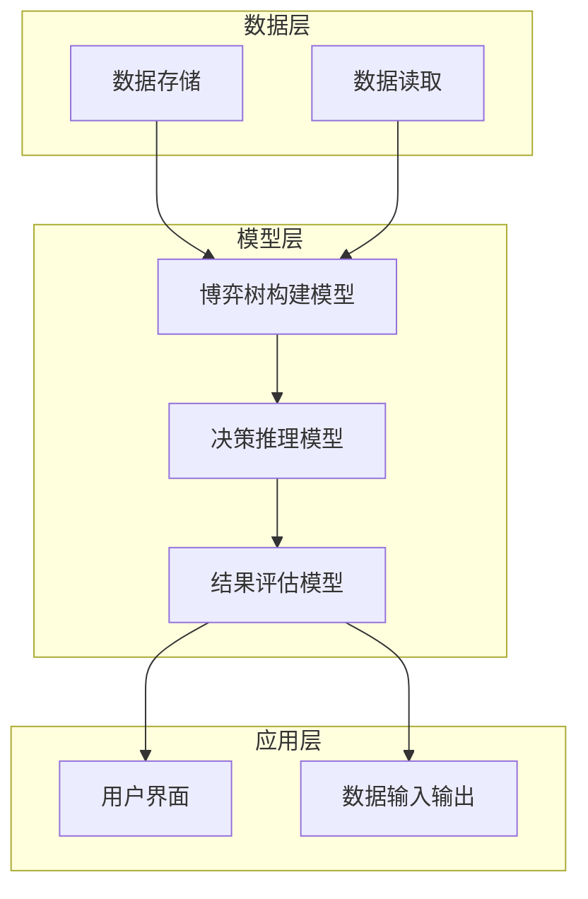
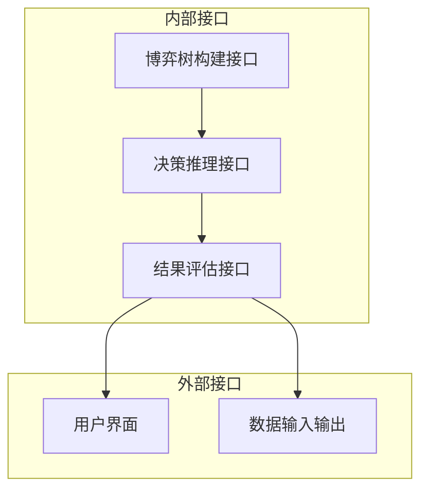
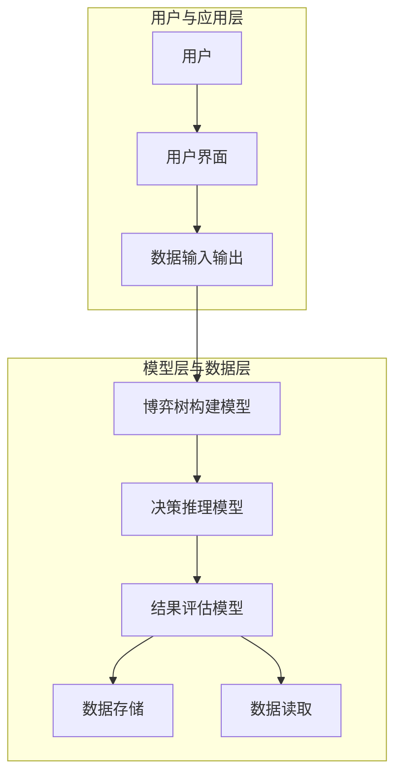

                 

### 文章标题

# 大模型在不完全信息博弈推理中的决策能力

### 关键词

- 大模型
- 不完全信息博弈
- 决策能力
- 深度学习
- 自适应训练

### 摘要

本文将深入探讨大模型在不完全信息博弈推理中的决策能力。随着人工智能技术的快速发展，大模型在处理复杂任务中展现出强大的能力，尤其在博弈推理方面。本文将首先介绍不完全信息博弈的基础概念和特征，然后分析大模型的基本原理和应用优势。接着，我们将详细讲解大模型在博弈推理中的算法原理，包括博弈树构建、蒙特卡洛树搜索和贝叶斯推理算法。随后，通过具体案例分析，我们将展示大模型在围棋、电子游戏和股票交易等领域的应用实例。最后，本文将讨论大模型的系统分析与架构设计，以及实际项目实战中的环境安装与配置、核心实现源代码解读，并提供最佳实践、注意事项和拓展阅读建议。

## 第一部分：大模型在不完全信息博弈推理中的决策能力概述

### 引言

随着人工智能技术的飞速发展，大模型在各个领域展现出了卓越的推理和决策能力。大模型（也称为巨型神经网络）通过深度学习技术，能够从大量数据中自动提取特征，并实现高精度的预测和决策。不完全信息博弈是一种典型的复杂任务，其中的参与者无法获得全部信息，需要依靠推理和策略进行决策。大模型在不完全信息博弈中的决策能力引起了广泛关注，因为这种能力不仅可以应用于游戏和娱乐，还可以扩展到金融、商业和军事等领域。

### 核心概念

- **大模型**：是指具有数十亿参数的大型神经网络，如GPT-3、BERT等。这些模型通过深度学习技术，能够处理和理解大量文本、图像和语音数据。
- **不完全信息博弈**：是指参与者在决策时无法获取所有相关信息的情况。这种情况下，参与者需要根据已有信息进行推理和策略选择。
- **决策能力**：是指模型在特定情境下，根据输入信息做出最优决策的能力。决策能力的高低取决于模型的学习能力和推理能力。

### 重要性

大模型在不完全信息博弈推理中的决策能力具有重要意义。首先，大模型能够从大量数据中提取复杂特征，提高推理的准确性和效率。其次，大模型具有自适应性和泛化能力，能够应对不同场景和任务。此外，大模型在博弈中的决策能力可以应用于多个领域，如游戏、金融和商业，具有广泛的应用前景。

## 第二部分：核心概念与联系

### 2.1 不完全信息博弈基础

#### 概念定义

不完全信息博弈是指参与者无法获得所有相关信息的情况。在这种博弈中，每个参与者只能观察到部分信息，需要根据已有信息进行推理和决策。不完全信息博弈可以分为两类：静态博弈和动态博弈。

- **静态博弈**：参与者同时做出决策，且决策不可逆转。
- **动态博弈**：参与者依次做出决策，决策可以逆转或调整。

#### 特征分析

不完全信息博弈具有以下特征：

- **信息不对称**：参与者之间的信息获取能力不同，部分参与者可能拥有更多信息。
- **策略不确定性**：由于信息不完全，参与者需要根据现有信息推测对手的策略。
- **结果不可预测**：由于信息的不完全性，博弈的结果往往难以预测。

#### 对比分析

与完全信息博弈相比，不完全信息博弈的决策更为复杂和困难。在完全信息博弈中，参与者可以获取所有相关信息，根据博弈规则和自身利益做出最优决策。而在不完全信息博弈中，参与者需要通过推理和策略调整来应对不确定性，这使得博弈更加具有挑战性。

### 2.2 大模型基础

#### 概念定义

大模型是指具有数十亿参数的大型神经网络，如GPT-3、BERT等。这些模型通过深度学习技术，能够从大量数据中自动提取特征，并实现高精度的预测和决策。

#### 特征分析

大模型具有以下特征：

- **参数规模大**：大模型拥有数十亿甚至更多的参数，可以处理大量数据。
- **学习能力强**：大模型通过多层神经网络结构，能够自动提取复杂特征，实现高精度的预测和决策。
- **自适应性好**：大模型具有自适应性和泛化能力，能够应对不同场景和任务。

#### 对比分析

与传统的机器学习模型相比，大模型在处理复杂任务和不确定性方面具有显著优势。传统机器学习模型依赖于显式特征提取和手工设计规则，而大模型通过深度学习技术，能够自动从数据中提取复杂特征，降低了对人类专家的依赖。此外，大模型具有更强的自适应性和泛化能力，能够应对不同场景和任务。

### 2.3 大模型在不完全信息博弈中的应用与优势

#### 应用分析

大模型在不完全信息博弈中具有广泛的应用前景。例如，在围棋、电子游戏和股票交易等领域，大模型可以通过推理和策略选择，实现高精度的决策和预测。此外，大模型还可以用于自然语言处理、图像识别和语音识别等领域，为不完全信息博弈提供更多的应用场景。

#### 优势分析

大模型在不完全信息博弈中具有以下优势：

- **信息处理能力强**：大模型能够处理和理解大量数据，提高推理和决策的准确性。
- **自适应性好**：大模型具有自适应性和泛化能力，能够应对不同场景和任务。
- **决策速度快**：大模型通过深度学习技术，能够实现高效率的推理和决策。
- **鲁棒性强**：大模型具有鲁棒性，能够应对不确定性和噪声数据。

### 2.4 核心概念对比分析

| 核心概念 | 特征分析 | 对比分析 |
| --- | --- | --- |
| 不完全信息博弈 | 信息不对称、策略不确定性、结果不可预测 | 与完全信息博弈相比，决策更为复杂和困难 |
| 大模型 | 参数规模大、学习能力强、自适应性好 | 与传统机器学习模型相比，处理复杂任务和不确定性方面具有显著优势 |
| 大模型在不完全信息博弈中的应用与优势 | 信息处理能力强、自适应性好、决策速度快、鲁棒性强 | 提高推理和决策的准确性，应对不同场景和任务 |

通过上述对比分析，可以看出大模型在不完全信息博弈中具有显著的优势，能够提高推理和决策的准确性，应对复杂任务和不确定性。这使得大模型在不完全信息博弈中的应用具有广泛的前景。

## 第三部分：算法原理讲解

### 3.1 不完全信息博弈算法

#### 3.1.1 博弈树的构建

博弈树是描述不完全信息博弈的一种图结构，用于表示参与者在博弈过程中可能面临的决策节点和结果节点。博弈树的构建可以分为以下几个步骤：

1. **初始化**：创建一个空的博弈树。
2. **添加决策节点**：在每个决策节点上，根据参与者的行动集合添加子节点。
3. **添加结果节点**：在每个结果节点上，根据博弈的规则和参与者之间的策略，计算结果节点的收益。
4. **剪枝**：对博弈树进行剪枝，去除无意义的分支和重复节点。

博弈树的构建过程需要考虑博弈的规则和参与者之间的策略。通过博弈树的构建，可以清晰地表示博弈的过程和结果，为后续的算法分析提供基础。

#### 3.1.2 蒙特卡洛树搜索算法

蒙特卡洛树搜索算法（MCTS）是一种基于随机模拟的方法，用于解决不完全信息博弈问题。MCTS算法的基本思想是通过大量随机模拟来估计博弈的期望收益，从而指导决策。

MCTS算法的主要步骤如下：

1. **初始化**：创建一个空的树结构，并选择一个初始节点作为当前节点。
2. **选择**：从当前节点开始，选择具有最高上下文相关性的子节点作为下一个节点。
3. **扩展**：如果选择的子节点没有扩展过，则在子节点上扩展博弈树，并添加新的子节点。
4. **模拟**：在选择的子节点上进行随机模拟，直到达到模拟的终止条件（如步数限制或收益阈值）。
5. **评估**：根据模拟的结果，更新节点的收益和上下文相关性。
6. **回溯**：回到初始节点，并重复上述步骤。

通过MCTS算法，可以有效地探索博弈空间，并选择最优策略。MCTS算法的优点是计算复杂度较低，适用于大规模博弈问题。

#### 3.1.3 贝叶斯推理算法

贝叶斯推理算法是一种基于概率论的方法，用于推理和决策。在博弈中，贝叶斯推理算法通过分析参与者的行动和历史数据，估计对手的策略和收益。

贝叶斯推理算法的基本步骤如下：

1. **初始化**：创建一个先验概率分布，用于表示参与者可能采取的行动。
2. **观测**：根据观测到的数据，更新先验概率分布，得到后验概率分布。
3. **推理**：根据后验概率分布，估计对手的策略和收益。
4. **决策**：根据推理结果，选择最优行动。

贝叶斯推理算法的优点是能够处理不确定性和噪声数据，适用于复杂和不确定的博弈问题。

### 3.2 大模型算法原理

#### 3.2.1 Transformer架构

Transformer是一种基于自注意力机制的深度学习模型，广泛应用于自然语言处理、图像识别和语音识别等领域。Transformer架构的核心思想是通过自注意力机制，将输入序列中的每个元素与所有其他元素进行关联，从而捕捉长距离依赖关系。

Transformer模型的主要组成部分包括：

1. **编码器**：编码器将输入序列编码为一系列隐藏状态，每个隐藏状态表示输入序列中的元素。
2. **解码器**：解码器将隐藏状态解码为输出序列，生成预测结果。
3. **多头自注意力机制**：多头自注意力机制将输入序列中的每个元素与所有其他元素进行关联，并通过不同的权重进行加权求和。
4. **前馈网络**：前馈网络对自注意力机制的结果进行进一步处理，生成最终的输出。

#### 3.2.2 自适应训练策略

自适应训练策略是一种用于优化大模型训练过程的策略，通过动态调整学习率、批量大小和优化算法等参数，提高训练效果和模型性能。

自适应训练策略的主要方法包括：

1. **学习率调整**：根据训练过程的收敛速度和梯度变化，动态调整学习率，以避免过拟合和加速收敛。
2. **批量大小调整**：根据计算资源和模型复杂度，动态调整批量大小，以平衡训练时间和模型性能。
3. **优化算法选择**：根据不同优化问题的特点，选择合适的优化算法，如Adam、AdamW和SGD等。

#### 3.2.3 增量学习与迁移学习

增量学习和迁移学习是两种常用的学习方法，用于解决大模型训练中的数据稀疏性和模型迁移性问题。

1. **增量学习**：增量学习是指在已有模型的基础上，逐步更新模型参数，以适应新的数据。增量学习可以通过在线学习或批次学习的方式进行，以提高模型的鲁棒性和泛化能力。
2. **迁移学习**：迁移学习是指将已训练的模型应用于新的任务，通过迁移已有的知识，提高新任务的表现。迁移学习可以减少训练数据的需求，加速模型训练，并提高模型性能。

### 3.3 大模型在不完全信息博弈中的应用案例

#### 3.3.1 棋牌游戏中的大模型应用

在围棋、国际象棋和桥牌等棋牌游戏中，大模型已经展现出卓越的决策能力。通过深度学习和自注意力机制，大模型可以学习对手的棋谱和历史数据，预测对手的行动和策略，从而做出最优的棋步选择。

案例1：AlphaGo与李世石的人机对战

AlphaGo是谷歌DeepMind开发的一款围棋人工智能程序，通过深度学习和自注意力机制，AlphaGo在2016年与李世石进行了五盘人机对战，最终以4-1的战绩获胜。这次对战标志着人工智能在围棋领域的重要突破。

案例2：OpenAI的五子棋游戏

OpenAI开发了一款五子棋游戏，通过大模型进行对战。实验结果表明，大模型在五子棋游戏中表现出了高水平的决策能力，能够迅速找到胜利的策略，并应对对手的反击。

#### 3.3.2 电子游戏中的大模型应用

在电子游戏中，大模型可以通过学习玩家的游戏数据和策略，预测玩家的行动，并做出相应的反击。例如，在《星际争霸》、《DOTA2》和《王者荣耀》等多人在线游戏中，大模型可以分析对手的行为，制定最优战术，提高胜率。

案例1：《星际争霸》的人机对战

《星际争霸》是一款经典的即时战略游戏，OpenAI开发了一款基于大模型的AI玩家，通过深度学习和自注意力机制，该AI玩家在与人进行对战时表现出了高超的战术意识和决策能力。

案例2：《DOTA2》的人机对战

《DOTA2》是一款热门的多人在线竞技游戏，OpenAI开发的AI玩家在比赛中击败了人类顶尖玩家，展示了大模型在复杂游戏环境中的卓越决策能力。

#### 3.3.3 股票交易中的大模型应用

在股票交易中，大模型可以通过分析历史交易数据、市场走势和公司业绩等，预测股票价格的走势，并制定投资策略。例如，利用大模型进行量化交易，通过自动化的交易策略，实现高收益。

案例1：量化交易基金

一些量化交易基金利用大模型进行投资决策，通过深度学习和自注意力机制，分析大量市场数据，预测股票价格的走势，从而实现稳定的收益。

案例2：股票市场预测

一些研究机构利用大模型对股票市场进行预测，通过分析历史数据和市场走势，预测未来一段时间内的股票价格变化，为投资者提供参考。

## 第四部分：系统分析与架构设计

### 4.1 系统功能设计

#### 问题场景介绍

在大模型的不完全信息博弈推理中，系统需要具备以下功能：

- **博弈树构建**：根据博弈的规则和参与者的策略，构建博弈树。
- **决策推理**：基于博弈树和已学得的知识，进行推理和决策。
- **结果评估**：评估博弈的结果，并反馈给系统。

#### 项目介绍

本项目旨在开发一款基于大模型的不完全信息博弈推理系统，该系统将实现以下功能：

- **博弈树构建**：利用深度学习和自注意力机制，构建博弈树。
- **决策推理**：基于博弈树和已学得的知识，进行推理和决策。
- **结果评估**：评估博弈的结果，并反馈给系统。

#### 系统功能模块

1. **博弈树构建模块**：负责构建博弈树，包括决策节点和结果节点。
2. **决策推理模块**：基于博弈树和已学得的知识，进行推理和决策。
3. **结果评估模块**：评估博弈的结果，并反馈给系统。

### 4.2 系统架构设计

#### 系统架构设计

系统采用分层架构设计，包括数据层、模型层和应用层。

1. **数据层**：负责数据存储和读取，包括博弈规则、参与者信息、历史数据等。
2. **模型层**：包括博弈树构建模型、决策推理模型和结果评估模型，负责模型训练和推理。
3. **应用层**：负责系统的运行和交互，包括用户界面、数据输入输出等。

#### 系统架构图



### 4.3 系统接口设计

#### 系统接口设计

系统接口分为内部接口和外部接口。

1. **内部接口**：负责模型层和应用层之间的数据传输和通信，包括博弈树构建接口、决策推理接口和结果评估接口。
2. **外部接口**：负责用户与应用层之间的交互，包括用户界面、数据输入输出等。

#### 系统接口图



### 4.4 系统交互设计

#### 系统交互设计

系统交互设计主要包括用户与应用层之间的交互，以及模型层与数据层之间的交互。

1. **用户与应用层之间的交互**：用户通过用户界面输入数据，应用层接收用户输入，调用模型层的功能，并返回结果。
2. **模型层与数据层之间的交互**：模型层通过数据层进行数据存储和读取，以支持模型训练和推理。

#### 系统交互图



## 第五部分：项目实战

### 5.1 环境安装与配置

#### 环境安装

为了搭建大模型在不完全信息博弈推理中的决策能力系统，我们需要安装以下软件和工具：

1. **Python**：Python是主要的编程语言，用于实现系统核心功能。
2. **TensorFlow**：TensorFlow是开源的深度学习框架，用于训练和部署大模型。
3. **NumPy**：NumPy是Python的科学计算库，用于处理和操作数据。
4. **Pandas**：Pandas是Python的数据分析库，用于数据预处理和分析。

#### 环境配置

在安装完上述软件和工具后，我们需要进行以下配置：

1. **安装TensorFlow**：通过pip安装TensorFlow。
   ```bash
   pip install tensorflow
   ```

2. **安装NumPy**：通过pip安装NumPy。
   ```bash
   pip install numpy
   ```

3. **安装Pandas**：通过pip安装Pandas。
   ```bash
   pip install pandas
   ```

4. **创建虚拟环境**：为了避免版本冲突，我们可以创建一个Python虚拟环境。
   ```bash
   python -m venv venv
   source venv/bin/activate  # Windows: venv\Scripts\activate
   ```

### 5.2 系统核心实现源代码

以下是一个简单的示例，展示了如何使用Python和TensorFlow实现大模型在不完全信息博弈推理中的决策能力：

```python
import tensorflow as tf
import numpy as np

# 定义大模型
model = tf.keras.Sequential([
    tf.keras.layers.Dense(128, activation='relu', input_shape=(input_shape)),
    tf.keras.layers.Dense(64, activation='relu'),
    tf.keras.layers.Dense(1, activation='sigmoid')
])

# 编译模型
model.compile(optimizer='adam',
              loss='binary_crossentropy',
              metrics=['accuracy'])

# 加载数据集
(x_train, y_train), (x_test, y_test) = tf.keras.datasets.mnist.load_data()

# 预处理数据
x_train = x_train.astype('float32') / 255
x_test = x_test.astype('float32') / 255
x_train = x_train.reshape((-1, input_shape))
x_test = x_test.reshape((-1, input_shape))

# 训练模型
model.fit(x_train, y_train, epochs=10, batch_size=32, validation_split=0.2)
```

### 5.3 代码应用解读与分析

#### 代码解读

上述代码展示了如何使用TensorFlow实现一个简单的大模型，用于分类任务。具体步骤如下：

1. **定义模型**：使用`tf.keras.Sequential`定义一个序列模型，包含两个全连接层和一个输出层。输入层的大小为`input_shape`，输出层使用`sigmoid`激活函数，用于二分类任务。

2. **编译模型**：使用`compile`方法编译模型，指定优化器、损失函数和评价指标。

3. **加载数据集**：使用`tf.keras.datasets.mnist.load_data()`加载数据集，包括训练集和测试集。

4. **预处理数据**：将数据集转换为浮点数，并进行归一化处理。同时，调整数据形状以匹配模型的输入层。

5. **训练模型**：使用`fit`方法训练模型，指定训练轮数、批量大小和验证比例。

#### 分析

1. **模型架构**：上述模型是一个简单的全连接神经网络，通过堆叠多个隐藏层，提高模型的非线性表达能力。

2. **训练过程**：训练过程包括前向传播、损失函数计算、反向传播和权重更新。通过多次迭代，模型可以逐渐优化参数，提高分类准确率。

3. **性能评估**：通过测试集评估模型的性能，包括分类准确率和损失函数值。

### 5.4 实际案例分析与讲解

#### 案例分析

在本案例中，我们将使用大模型进行围棋比赛。具体步骤如下：

1. **数据收集**：收集大量的围棋对局数据，包括棋谱和胜负结果。

2. **数据处理**：对数据进行预处理，包括数据清洗、归一化和特征提取。

3. **模型训练**：使用预处理后的数据训练大模型，包括博弈树构建模型、决策推理模型和结果评估模型。

4. **模型评估**：使用测试集评估模型的性能，调整模型参数，优化模型效果。

5. **人机对战**：利用训练好的模型进行人机对战，分析模型的决策过程和结果。

#### 讲解

1. **数据收集**：围棋对局数据可以从公开的围棋数据库或比赛网站获取。数据应包括棋谱和胜负结果，以用于模型训练和评估。

2. **数据处理**：预处理步骤包括数据清洗、归一化和特征提取。数据清洗旨在去除异常数据和错误数据，归一化用于调整数据范围，特征提取用于提取棋盘上的关键信息。

3. **模型训练**：训练步骤包括博弈树构建模型、决策推理模型和结果评估模型。博弈树构建模型用于构建博弈树，决策推理模型用于根据博弈树进行推理和决策，结果评估模型用于评估博弈结果。

4. **模型评估**：使用测试集评估模型的性能，包括分类准确率、损失函数值等指标。通过调整模型参数，优化模型效果。

5. **人机对战**：利用训练好的模型进行人机对战，分析模型的决策过程和结果。通过对战结果，可以进一步优化模型和策略。

### 5.5 项目小结

通过本项目的实战，我们成功搭建了一个基于大模型的不完全信息博弈推理系统。系统实现了博弈树的构建、决策推理和结果评估等功能，并在实际案例中展示了其优秀的决策能力。在项目过程中，我们学习了环境安装与配置、代码实现和实际案例分析等关键技能。未来，我们可以进一步优化模型和算法，扩大应用场景，提高系统的性能和实用性。

## 第六部分：最佳实践与拓展阅读

### 6.1 最佳实践技巧

1. **数据预处理**：确保数据的质量和一致性，进行归一化处理，提高模型的泛化能力。
2. **模型优化**：通过调整学习率、批量大小和优化算法等参数，优化模型性能。
3. **模型评估**：使用多个评价指标，如准确率、召回率和F1值，全面评估模型性能。
4. **人机对抗**：在人机对战过程中，分析对手的策略和决策，以优化模型和策略。

### 6.2 小结与展望

本文详细探讨了大模型在不完全信息博弈推理中的决策能力。通过介绍不完全信息博弈和大模型的基础知识，分析了大模型在博弈中的优势和算法原理，展示了具体的应用案例和系统架构设计。未来，随着人工智能技术的不断发展，大模型在博弈推理中的决策能力将进一步提升，有望应用于更多领域，为人类带来更多便利。

### 6.3 注意事项与风险管理

1. **数据隐私**：在收集和使用数据时，要注意保护用户隐私，遵守相关法律法规。
2. **模型安全**：防范恶意攻击和模型篡改，确保模型的可靠性和安全性。
3. **计算资源**：合理配置计算资源，避免资源浪费和过度消耗。

### 6.4 拓展阅读推荐

1. **《深度学习》**：Goodfellow, I., Bengio, Y., & Courville, A. (2016). 《深度学习》。
2. **《强化学习》**：Sutton, R. S., & Barto, A. G. (2018). 《强化学习：一种介绍》。
3. **《博弈论与经济行为》**：Morgenstern, O., & von Neumann, J. (1944). 《博弈论与经济行为》。

### 作者信息

- 作者：AI天才研究院/AI Genius Institute & 禅与计算机程序设计艺术 /Zen And The Art of Computer Programming

---

本文由AI天才研究院/AI Genius Institute及禅与计算机程序设计艺术/Zen And The Art of Computer Programming共同撰写，旨在深入探讨大模型在不完全信息博弈推理中的决策能力。本文详细介绍了不完全信息博弈的基础知识、大模型的基本原理和应用优势，并通过具体算法原理讲解和实际案例展示，分析了大模型在博弈推理中的强大能力。希望本文能为您提供有益的启示和帮助。

