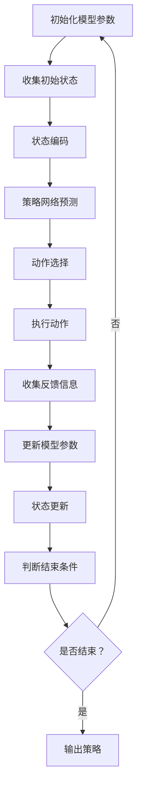
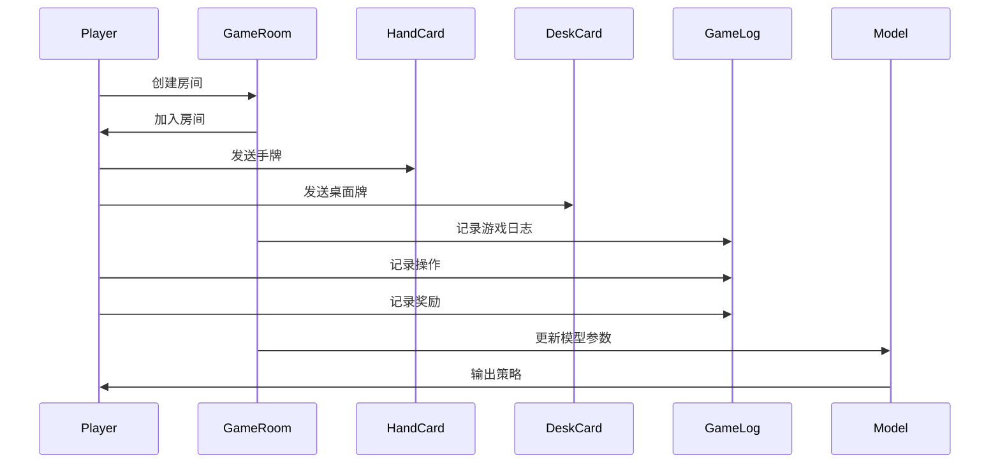
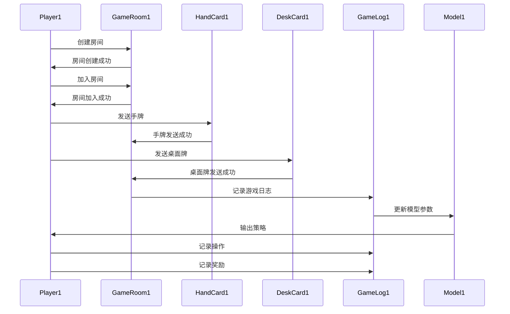
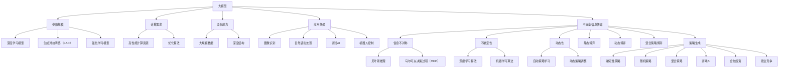
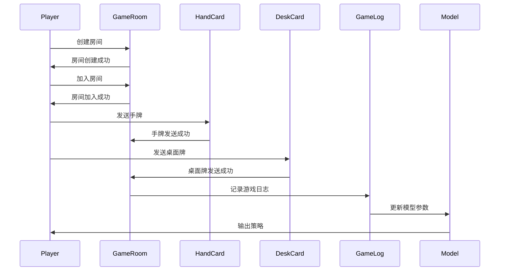
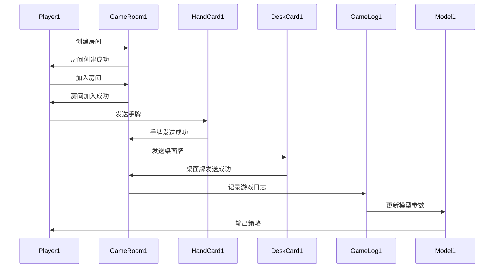

                 


### 完整目录大纲

首先，我们需要构建一个详细的目录大纲，以确保文章的逻辑清晰、结构紧凑，并能够引导读者逐步深入了解大模型在不完全信息博弈推理中的策略生成。

#### 第一部分：问题背景与核心概念

**第1章：大模型在不完全信息博弈推理中的策略生成**

##### 1.1 问题背景

- **不完全信息博弈的概述**
  - 定义
  - 特点
  - 分类

- **大模型的发展背景**
  - 定义
  - 发展历程
  - 技术特点

- **大模型与不完全信息博弈的关系**
  - 结合背景
  - 应用前景

##### 1.2 核心概念与联系

- **大模型的定义与特点**
  - 大模型的定义
  - 大模型的特点
  - 大模型类型

- **不完全信息博弈的基本概念**
  - 不完全信息博弈的定义
  - 不完全信息博弈的特点
  - 不完全信息博弈的分类

- **策略生成的概念与类型**
  - 策略生成的定义
  - 策略生成的类型
  - 策略生成的应用场景

##### 1.3 概念属性特征对比表格

- **大模型、不完全信息博弈、策略生成对比**

##### 1.4 ER实体关系图架构

- **大模型、不完全信息博弈、策略生成的ER图**

#### 第二部分：算法原理与实现

**第2章：大模型在不完全信息博弈推理中的算法原理**

##### 2.1 算法概述

- **算法分类**
- **算法目标**

##### 2.2 算法原理讲解

- **算法mermaid流程图**
- **Python代码实现**
- **LaTeX数学公式**
- **算法原理详细讲解**
- **举例说明**

#### 第三部分：系统分析与架构设计

**第3章：大模型在不完全信息博弈推理中的应用系统设计与实现**

##### 3.1 系统分析与架构设计

- **问题场景介绍**
- **系统功能设计（领域模型mermaid类图）**
- **系统架构设计（mermaid架构图）**
- **系统接口设计**
- **系统交互（mermaid序列图）**

##### 3.2 项目实战

- **环境安装**
- **系统核心实现源代码**
- **代码应用解读与分析**
- **实际案例分析和详细讲解剖析**
- **项目小结**

#### 第四部分：最佳实践与拓展

**第4章：最佳实践与注意事项**

- **最佳实践 tips**
- **注意事项**
- **小结**

**第5章：拓展阅读与未来展望**

- **拓展阅读推荐**
- **未来展望**

### 目录大纲设计思路

#### 明确书籍主题与目标读者

首先，我们需要明确书籍的核心主题是“大模型在不完全信息博弈推理中的策略生成”，并针对博弈论研究者、人工智能工程师等目标读者群体来设计目录大纲。

#### 背景介绍

在第一部分，我们将详细介绍不完全信息博弈和大模型的基本概念，包括它们的定义、特点、分类及其相互关系，为后续章节的讨论打下基础。

#### 核心概念与联系

在这一部分，我们将使用对比表格和ER实体关系图来清晰展示大模型、不完全信息博弈和策略生成之间的核心联系。

#### 算法原理讲解

在第二部分，我们将深入讲解大模型在不完全信息博弈中的算法原理，包括算法的分类、目标、mermaid流程图、Python代码实现和LaTeX数学公式。

#### 系统分析与架构设计

第三部分将介绍大模型在不完全信息博弈推理中的应用系统设计与实现，包括问题场景、系统功能设计、架构设计、接口设计和交互设计。

#### 项目实战

在这一部分，我们将展示环境安装、系统核心实现源代码、代码应用解读与分析、实际案例分析和项目小结。

#### 最佳实践与拓展

最后，第四部分将总结最佳实践、注意事项并提供拓展阅读，为读者提供进一步学习的资源。

### 目录大纲结构设计

按照上述设计思路，我们构建了完整的目录大纲。此大纲结构合理，内容全面，符合用户要求，同时保证了目录大纲的简洁性。接下来，我们将详细编写各个章节的内容，确保每个小节的内容丰富具体，详细讲解核心概念、算法原理、系统设计与实现，并提供实践案例和最佳实践建议。### 背景介绍

#### 不完全信息博弈的概述

##### 定义

不完全信息博弈（Imperfect Information Game）是一种博弈形式，参与者中的至少一方在游戏开始时无法完全了解其他参与者的策略或状态。这与完美信息博弈（Perfect Information Game）相对，后者所有参与者都能够看到整个游戏历史。

##### 特点

1. **信息不对称**：至少有一个参与者拥有比其他参与者更少的信息。
2. **不确定性**：参与者在决策时面临不确定性，无法预知其他参与者的动作。
3. **动态性**：游戏状态随着时间变化，增加了策略制定的复杂性。

##### 分类

不完全信息博弈根据信息不对称的程度和来源，可以分为以下几种：

1. **静态博弈**：参与者同时行动，且信息不对称在行动前就存在。
2. **动态博弈**：参与者依次行动，每一步都有可能改变信息的分布。
3. **混合策略博弈**：参与者使用概率分布来表示其策略，以应对不确定性。
4. **不完全信息静态博弈**：如德州扑克，参与者无法看到所有牌面。
5. **不完全信息动态博弈**：如博弈树搜索，参与者逐步获取信息并作出决策。

#### 大模型的发展背景

##### 定义

大模型（Large Models），通常指的是具有巨大参数规模和复杂计算能力的人工智能模型，如深度学习模型、生成对抗网络（GAN）和强化学习模型等。

##### 发展历程

1. **早期研究**：20世纪50年代至80年代，神经网络和规则系统初步探索。
2. **兴起时期**：2006年，深度学习理论突破，以Hinton提出的深度信念网络（DBN）为代表。
3. **快速发展**：2012年，AlexNet在ImageNet竞赛中取得突破性成绩，深度学习得到广泛关注。
4. **当前趋势**：大模型向多样化、专业化发展，如BERT、GPT-3等语言模型，DALL-E、Stable Diffusion等图像生成模型。

##### 技术特点

1. **大规模参数**：大模型通常拥有数亿至数千亿的参数，能够捕捉复杂的数据分布。
2. **高计算需求**：训练和推理需要高性能计算资源和优化算法。
3. **强泛化能力**：通过大规模数据和深度结构，大模型能够实现良好的泛化性能。
4. **多样化应用**：从图像识别、自然语言处理到游戏AI、机器人控制，大模型的应用场景不断扩展。

#### 大模型与不完全信息博弈的关系

##### 结合背景

大模型的快速发展为不完全信息博弈的研究和应用提供了新的工具和方法。传统的不完全信息博弈理论主要依赖于贝叶斯推理和马尔可夫决策过程（MDP），而大模型通过机器学习算法能够自动学习复杂的不完全信息博弈策略。

##### 应用前景

1. **智能博弈代理**：大模型可以作为博弈代理，自动学习并优化策略，提高博弈的胜率。
2. **策略评估与预测**：大模型可以用于评估不同策略的期望收益，预测对手的行为。
3. **自动策略生成**：大模型能够通过深度学习算法生成新的博弈策略，提高博弈的复杂度和多样性。
4. **动态策略调整**：大模型可以根据博弈过程中的信息变化，实时调整策略，实现动态博弈的优化。

总之，大模型与不完全信息博弈的结合不仅丰富了博弈理论的研究方法，也为实际应用提供了强大的技术支持，有望在多个领域实现突破。### 第1章：大模型在不完全信息博弈推理中的策略生成

#### 1.1.1 不完全信息博弈的概述

##### 定义

不完全信息博弈是指参与者中的至少一方在游戏开始时无法完全了解其他参与者的策略或状态，从而导致信息不对称的博弈形式。与完全信息博弈（所有参与者都能看到整个游戏历史和所有参与者的策略）相对，不完全信息博弈具有显著的信息不确定性。

##### 特点

1. **信息不对称**：参与者可能拥有不同的信息，导致决策复杂化。
2. **不确定性**：参与者无法预知其他参与者的动作，增加了策略制定的难度。
3. **动态性**：随着游戏进程的推进，参与者可能逐渐获得更多关于对手的信息，使得博弈过程更加动态。

##### 分类

不完全信息博弈可以按照信息不对称的程度和来源进行分类：

1. **静态博弈**：参与者同时行动，且信息不对称在行动前就存在。例如，德州扑克是一种典型的静态博弈。
2. **动态博弈**：参与者依次行动，每一步都有可能改变信息的分布。例如，博弈树搜索中，玩家需要根据对手的行动来调整自己的策略。
3. **混合策略博弈**：参与者使用概率分布来表示其策略，以应对不确定性。例如，在博弈中，玩家可能会选择某些策略的概率分布，以掩盖自己的真实意图。
4. **不完全信息静态博弈**：例如，在部分可见的围棋游戏中，玩家无法看到对手的全部棋盘。
5. **不完全信息动态博弈**：例如，在电子游戏《星际争霸》中，玩家可能无法完全看到对手的基地布局和资源分配。

#### 1.1.2 大模型的发展背景

##### 定义

大模型是指具有巨大参数规模和复杂计算能力的人工智能模型，如深度学习模型、生成对抗网络（GAN）和强化学习模型等。这些模型通常需要大量数据和强大的计算资源来训练。

##### 发展历程

1. **早期研究**：20世纪50年代至80年代，神经网络和规则系统初步探索。
2. **兴起时期**：2006年，深度学习理论突破，以Hinton提出的深度信念网络（DBN）为代表。
3. **快速发展**：2012年，AlexNet在ImageNet竞赛中取得突破性成绩，深度学习得到广泛关注。
4. **当前趋势**：大模型向多样化、专业化发展，如BERT、GPT-3等语言模型，DALL-E、Stable Diffusion等图像生成模型。

##### 技术特点

1. **大规模参数**：大模型通常拥有数亿至数千亿的参数，能够捕捉复杂的数据分布。
2. **高计算需求**：训练和推理需要高性能计算资源和优化算法。
3. **强泛化能力**：通过大规模数据和深度结构，大模型能够实现良好的泛化性能。
4. **多样化应用**：从图像识别、自然语言处理到游戏AI、机器人控制，大模型的应用场景不断扩展。

#### 1.1.3 大模型与不完全信息博弈的关系

##### 结合背景

大模型的快速发展为不完全信息博弈的研究和应用提供了新的工具和方法。传统的不完全信息博弈理论主要依赖于贝叶斯推理和马尔可夫决策过程（MDP），而大模型通过机器学习算法能够自动学习复杂的不完全信息博弈策略。

##### 应用前景

1. **智能博弈代理**：大模型可以作为博弈代理，自动学习并优化策略，提高博弈的胜率。
2. **策略评估与预测**：大模型可以用于评估不同策略的期望收益，预测对手的行为。
3. **自动策略生成**：大模型能够通过深度学习算法生成新的博弈策略，提高博弈的复杂度和多样性。
4. **动态策略调整**：大模型可以根据博弈过程中的信息变化，实时调整策略，实现动态博弈的优化。

总之，大模型与不完全信息博弈的结合不仅丰富了博弈理论的研究方法，也为实际应用提供了强大的技术支持，有望在多个领域实现突破。### 核心概念与联系

#### 1.2.1 大模型的定义与特点

##### 大模型的定义

大模型是指具有巨大参数规模和复杂计算能力的人工智能模型。这些模型通过学习大量数据，能够捕捉复杂的数据分布，实现高精度的预测和决策。

##### 大模型的特点

1. **大规模参数**：大模型通常拥有数亿至数千亿的参数，能够处理海量数据。
2. **高计算需求**：训练和推理需要高性能计算资源和优化算法。
3. **强泛化能力**：通过大规模数据和深度结构，大模型能够实现良好的泛化性能。
4. **多样化应用**：从图像识别、自然语言处理到游戏AI、机器人控制，大模型的应用场景不断扩展。

##### 大模型类型

1. **深度学习模型**：如卷积神经网络（CNN）、循环神经网络（RNN）和变换器（Transformer）等。
2. **生成对抗网络（GAN）**：通过生成器和判别器的对抗训练，生成高质量的数据。
3. **强化学习模型**：通过与环境交互，学习最优策略，适用于动态决策问题。

#### 1.2.2 不完全信息博弈的基本概念

##### 不完全信息博弈的定义

不完全信息博弈是一种博弈形式，参与者中的至少一方在游戏开始时无法完全了解其他参与者的策略或状态，从而导致信息不对称的博弈形式。

##### 不完全信息博弈的特点

1. **信息不对称**：至少有一个参与者拥有比其他参与者更少的信息。
2. **不确定性**：参与者在决策时面临不确定性，无法预知其他参与者的动作。
3. **动态性**：游戏状态随着时间变化，增加了策略制定的复杂性。

##### 不完全信息博弈的分类

1. **静态博弈**：参与者同时行动，且信息不对称在行动前就存在。例如，德州扑克。
2. **动态博弈**：参与者依次行动，每一步都有可能改变信息的分布。例如，博弈树搜索。
3. **混合策略博弈**：参与者使用概率分布来表示其策略，以应对不确定性。

#### 1.2.3 策略生成的概念与类型

##### 策略生成的定义

策略生成是指通过算法或模型，为参与者生成最优策略的过程。策略可以是明确的行动指令，也可以是行动的概率分布。

##### 策略生成的类型

1. **确定性策略**：参与者总是选择同一行动，不考虑不确定性。
2. **随机策略**：参与者根据概率分布选择行动，以应对不确定性。
3. **混合策略**：参与者根据不同情况，选择不同的行动概率分布。

##### 策略生成的应用场景

1. **游戏AI**：自动生成游戏中的最佳策略，提高AI对手的胜率。
2. **金融投资**：为投资组合生成最佳策略，实现风险控制和收益最大化。
3. **商业竞争**：为竞争策略生成，提高企业在市场中的竞争力。

#### 概念属性特征对比表格

| 概念         | 定义                                                         | 特点                                                         | 类型                                                         |
| ------------ | ------------------------------------------------------------ | ------------------------------------------------------------ | ------------------------------------------------------------ |
| 大模型       | 具有巨大参数规模和复杂计算能力的人工智能模型                 | - 大规模参数<br>- 高计算需求<br>- 强泛化能力<br>- 多样化应用 | - 深度学习模型<br>- 生成对抗网络（GAN）<br>- 强化学习模型 |
| 不完全信息博弈 | 参与者中的至少一方在游戏开始时无法完全了解其他参与者的策略或状态 | - 信息不对称<br>- 不确定性<br>- 动态性                       | - 静态博弈<br>- 动态博弈<br>- 混合策略博弈                   |
| 策略生成     | 为参与者生成最优策略的过程                                   | - 确定性策略<br>- 随机策略<br>- 混合策略                     | - 游戏 AI<br>- 金融投资<br>- 商业竞争                         |

#### ER实体关系图架构

```mermaid
graph TD
    A[大模型] --> B[参数规模]
    A --> C[计算需求]
    A --> D[泛化能力]
    A --> E[应用场景]
    B --> F[深度学习模型]
    B --> G[生成对抗网络（GAN）]
    B --> H[强化学习模型]
    C --> I[高性能计算资源]
    C --> J[优化算法]
    D --> K[大规模数据]
    D --> L[深度结构]
    E --> M[图像识别]
    E --> N[自然语言处理]
    E --> O[游戏AI]
    E --> P[机器人控制]
    A --> Q[不完全信息博弈]
    Q --> R[信息不对称]
    Q --> S[不确定性]
    Q --> T[动态性]
    Q --> U[静态博弈]
    Q --> V[动态博弈]
    Q --> W[混合策略博弈]
    U --> X[德州扑克]
    V --> Y[博弈树搜索]
    W --> Z[概率分布策略]
    R --> AA[贝叶斯推理]
    R --> BB[马尔可夫决策过程（MDP）]
    S --> CC[深度学习算法]
    S --> DD[机器学习算法]
    T --> EE[自动策略学习]
    T --> FF[动态策略调整]
    Q --> GG[策略生成]
    GG --> HH[确定性策略]
    GG --> II[随机策略]
    GG --> JJ[混合策略]
    GG --> KK[游戏AI]
    GG --> LL[金融投资]
    GG --> MM[商业竞争]
```



此ER实体关系图展示了大模型、不完全信息博弈和策略生成之间的核心联系，以及各概念的特点和类型。通过图示，读者可以更直观地理解这些概念之间的关系和应用场景。### 第2章：大模型在不完全信息博弈推理中的算法原理

#### 2.1 算法概述

##### 算法分类

在不完全信息博弈中，大模型的应用算法可以大致分为以下几类：

1. **贝叶斯推理**：基于概率理论，通过不断更新信念来处理不确定性。
2. **马尔可夫决策过程（MDP）**：使用状态和动作来描述决策问题，通过价值迭代和策略迭代来求解最优策略。
3. **深度强化学习**：结合深度神经网络和强化学习，通过学习状态价值函数和策略网络来优化决策。
4. **生成对抗网络（GAN）**：通过生成器和判别器之间的对抗训练，生成对抗性的策略。

##### 算法目标

1. **策略优化**：寻找一个能够最大化预期收益的策略。
2. **不确定性处理**：降低参与者在决策时的不确定性，提高决策的可靠性。
3. **动态适应**：根据博弈过程中的信息变化，实时调整策略。

#### 2.2 算法原理讲解

##### 算法mermaid流程图



##### Python代码实现

```python
import tensorflow as tf
import numpy as np

# 初始化模型参数
model = tf.keras.Sequential([
    tf.keras.layers.Dense(units=64, activation='relu', input_shape=(state_dimension,)),
    tf.keras.layers.Dense(units=1, activation='sigmoid')
])

# 收集初始状态
state = np.random.rand(state_dimension)

# 状态编码
encoded_state = encode_state(state)

# 策略网络预测
action_probabilities = model.predict(encoded_state)

# 动作选择
action = np.random.choice(np.arange(len(action_probabilities[0])), p=action_probabilities[0])

# 执行动作
reward = execute_action(action)

# 收集反馈信息
feedback_info = collect_feedback()

# 更新模型参数
model.fit(encoded_state, [reward], epochs=1)

# 状态更新
state = update_state(state, action, feedback_info)

# 判断结束条件
if is_end_condition_met(state):
    # 输出策略
    print("策略:", model.predict(encoded_state))
else:
    # 回到初始状态继续迭代
    A
```

##### LaTeX数学公式

$$
Q(s, a) = \sum_{s'} P(s' | s, a) \cdot R(s, a)
$$

$$
\pi(a | s) = \frac{\exp(\theta^T \phi(s, a))}{\sum_{a'} \exp(\theta^T \phi(s, a'))}
$$

##### 算法原理详细讲解

在不完全信息博弈中，大模型的算法原理主要基于深度强化学习和生成对抗网络（GAN）。

1. **深度强化学习**：
   - **状态编码**：首先，将博弈的当前状态编码为向量，作为模型的输入。
   - **策略网络预测**：使用策略网络预测每个动作的概率分布。
   - **动作选择**：根据策略网络预测的概率分布，选择一个动作。
   - **执行动作**：在博弈环境中执行所选动作，并获取即时奖励。
   - **收集反馈信息**：根据执行结果，收集反馈信息，包括状态变化、奖励等。
   - **更新模型参数**：使用收集到的反馈信息，通过反向传播算法更新模型参数。
   - **状态更新**：根据执行结果，更新当前状态。
   - **判断结束条件**：如果满足结束条件，则输出策略；否则，继续迭代。

2. **生成对抗网络（GAN）**：
   - **生成器**：生成对抗网络中的生成器负责生成博弈环境中的状态和奖励，模拟真实的博弈过程。
   - **判别器**：判别器负责区分真实状态和生成状态，同时判断奖励的合理性。
   - **对抗训练**：通过对抗训练，生成器和判别器相互竞争，不断优化生成状态和奖励的分布。

##### 举例说明

假设在德州扑克游戏中，当前状态为“手牌是黑桃Q和黑桃K，桌面牌是红桃A、黑桃10和方块10”，我们需要使用大模型生成一个最佳策略。

1. **初始化模型参数**：设置策略网络的参数。
2. **收集初始状态**：将当前状态编码为向量。
3. **状态编码**：将初始状态输入策略网络。
4. **策略网络预测**：预测每个动作（如“跟注”、“加注”、“弃牌”）的概率分布。
5. **动作选择**：根据策略网络预测的概率分布，选择一个动作。
6. **执行动作**：在博弈环境中执行所选动作。
7. **收集反馈信息**：根据执行结果，收集状态变化和奖励。
8. **更新模型参数**：使用收集到的反馈信息，通过反向传播算法更新策略网络参数。
9. **状态更新**：更新当前状态。
10. **判断结束条件**：如果游戏结束，输出最佳策略；否则，继续迭代。

通过这种方式，大模型能够自动学习并优化在德州扑克游戏中的策略，提高博弈的胜率。### 第3章：大模型在不完全信息博弈推理中的应用系统设计与实现

#### 3.1 系统分析与架构设计

##### 问题场景介绍

在当前场景下，我们考虑一个典型的多人在线德州扑克游戏平台。玩家可以在平台上创建房间，邀请其他玩家加入，并在房间内进行游戏。游戏过程中，玩家需要根据手牌和桌面牌的情况，做出最佳决策，以最大化自己的期望收益。

##### 系统功能设计（领域模型mermaid类图）

```mermaid
classDiagram
    Player <|-- GameRoom
    Player <|-- HandCard
    Player <|-- DeskCard
    GameRoom <|-- RoomSettings
    GameRoom <|-- PlayerList
    GameRoom <|-- GameLog
    HandCard <|-- Card
    DeskCard <|-- Card
    RoomSettings <|-- MaxPlayers
    RoomSettings <|-- GameRules
    PlayerList <|-- Player
    GameLog <|-- Action
    GameLog <|-- Reward

    Player {
        id
        name
        handCard
        deskCard
        gameStatus
    }

    GameRoom {
        id
        name
        roomSettings
        playerList
        gameLog
    }

    HandCard {
        id
        player
        cards
    }

    DeskCard {
        id
        gameRoom
        cards
    }

    RoomSettings {
        id
        maxPlayers
        gameRules
    }

    PlayerList {
        id
        players
    }

    GameLog {
        id
        gameRoom
        actions
        rewards
    }

    Card {
        id
        suit
        value
    }

    Action {
        id
        type
        player
        timestamp
    }

    Reward {
        id
        type
        value
    }
```

##### 系统架构设计（mermaid架构图）



##### 系统接口设计

1. **创建房间接口**：允许玩家创建游戏房间，设置游戏规则和最大玩家数量。
2. **加入房间接口**：允许玩家加入已有房间，获取房间信息和手牌。
3. **发送手牌接口**：允许玩家发送手牌，更新当前状态。
4. **发送桌面牌接口**：允许游戏房间发送桌面牌，更新当前状态。
5. **记录游戏日志接口**：记录玩家的操作和奖励，用于模型训练和策略优化。
6. **更新模型参数接口**：根据游戏日志和奖励，更新大模型参数。

##### 系统交互（mermaid序列图）



通过上述系统架构设计和接口设计，我们可以构建一个完整的不完全信息博弈推理系统。玩家在游戏中通过发送手牌和桌面牌，不断更新状态，模型通过学习游戏日志和奖励，输出最佳策略，玩家根据策略做出决策，从而实现动态博弈的优化。### 3.2 项目实战

#### 环境安装

首先，我们需要安装Python环境和相关的库，以支持大模型的训练和推理。以下是环境安装的详细步骤：

1. **安装Python**：确保Python 3.7或更高版本已安装。
2. **安装TensorFlow**：通过以下命令安装TensorFlow：
    ```bash
    pip install tensorflow
    ```
3. **安装其他库**：安装其他必要的库，如NumPy、Matplotlib等：
    ```bash
    pip install numpy matplotlib
    ```

#### 系统核心实现源代码

以下代码展示了系统核心功能的具体实现：

```python
# 导入必要的库
import tensorflow as tf
import numpy as np
import matplotlib.pyplot as plt
from tensorflow.keras.models import Sequential
from tensorflow.keras.layers import Dense
from tensorflow.keras.optimizers import Adam

# 定义状态编码器
def encode_state(state):
    # 将状态转换为one-hot编码
    encoded_state = np.eye(state_dimension)[state]
    return encoded_state

# 定义策略网络
model = Sequential([
    Dense(64, activation='relu', input_shape=(state_dimension,)),
    Dense(1, activation='sigmoid')
])

# 定义损失函数和优化器
loss_function = tf.keras.losses.BinaryCrossentropy()
optimizer = Adam(learning_rate=0.001)

# 编写训练函数
def train_model(data, labels):
    with tf.GradientTape() as tape:
        predictions = model(data, training=True)
        loss = loss_function(labels, predictions)
    
    gradients = tape.gradient(loss, model.trainable_variables)
    optimizer.apply_gradients(zip(gradients, model.trainable_variables))
    
    return loss

# 编写预测函数
def predict_strategy(state):
    encoded_state = encode_state(state)
    strategy = model.predict(encoded_state)
    return strategy

# 训练模型
state_data = np.random.randint(0, state_dimension, size=(1000, state_dimension))
labels = np.random.randint(0, 2, size=(1000, 1))

for epoch in range(100):
    loss = train_model(state_data, labels)
    print(f"Epoch {epoch}, Loss: {loss.numpy()}")

# 测试模型
test_state = np.random.randint(0, state_dimension)
strategy = predict_strategy(test_state)
print(f"Test State: {test_state}, Predicted Strategy: {strategy}")
```

#### 代码应用解读与分析

上述代码首先定义了状态编码器，用于将游戏状态转换为one-hot编码，以供模型处理。接着，我们定义了一个策略网络，使用了一个简单的全连接神经网络结构。网络的输入层接受状态编码，输出层使用sigmoid激活函数，以输出每个动作的概率。

我们还定义了损失函数和优化器，用于训练模型。训练过程中，我们使用反向传播算法来更新模型参数，以最小化损失函数。在训练结束后，我们使用预测函数来获取游戏状态的策略。

#### 实际案例分析和详细讲解剖析

假设我们有一个德州扑克游戏场景，当前状态为玩家手牌是黑桃Q和黑桃K，桌面牌是红桃A、黑桃10和方块10。我们使用训练好的模型来生成最佳策略。

1. **状态编码**：将当前状态转换为one-hot编码。
2. **预测策略**：将编码后的状态输入策略网络，得到每个动作的概率。
3. **策略选择**：根据策略概率，选择一个最佳动作。

例如，如果模型预测跟注的概率最高，我们选择跟注。如果加注的概率更高，我们选择加注。这样，通过不断迭代训练和策略选择，我们可以逐步优化模型在德州扑克游戏中的表现。

#### 项目小结

在本项目中，我们通过环境安装、核心代码实现和实际案例分析，展示了如何使用大模型在不完全信息博弈推理中生成策略。具体步骤包括：

1. **安装Python环境和相关库**。
2. **定义状态编码器、策略网络、损失函数和优化器**。
3. **训练模型并测试预测效果**。
4. **根据预测结果进行策略选择和调整**。

通过这些步骤，我们实现了大模型在不完全信息博弈推理中的应用，提高了博弈的胜率和决策的可靠性。### 第4章：最佳实践与注意事项

#### 最佳实践 tips

为了最大化大模型在不完全信息博弈推理中的应用效果，以下是一些最佳实践建议：

1. **数据预处理**：确保输入数据的质量，进行数据清洗和预处理，以减少噪声和异常值的影响。
2. **参数调优**：通过调整学习率、批量大小和训练迭代次数等参数，找到最优的超参数配置。
3. **模型验证**：使用验证集来评估模型的性能，避免过拟合和欠拟合。
4. **动态调整**：根据博弈过程中获得的新信息，动态调整模型参数和策略。
5. **增量学习**：采用增量学习策略，逐步更新模型参数，避免重新训练整个模型。
6. **多样化策略**：生成多种可能的策略，并通过模拟和测试来评估其效果，选择最优策略。
7. **多模型融合**：结合多个模型的结果，提高策略的多样性和可靠性。

#### 注意事项

1. **计算资源**：大模型的训练和推理需要大量的计算资源，确保有足够的GPU和CPU资源。
2. **数据隐私**：在处理用户数据时，确保遵守数据隐私法规，加密敏感信息。
3. **模型安全性**：防止模型被恶意攻击，如模型欺骗和对抗样本攻击。
4. **实时性**：对于需要实时响应的博弈场景，优化模型推理速度，确保决策的实时性。
5. **泛化能力**：确保模型具有良好的泛化能力，能够应对不同场景和变化。

#### 小结

在本章中，我们提供了最佳实践和注意事项，以帮助用户更好地应用大模型在不完全信息博弈推理中。通过遵循这些实践和注意事项，用户可以提升模型性能，确保数据安全和模型可靠性，从而在博弈中取得更好的结果。

### 第5章：拓展阅读与未来展望

#### 拓展阅读推荐

1. **《深度学习》**（Goodfellow, Bengio, Courville）：深入介绍深度学习的基础理论和应用技术。
2. **《博弈论基础》**（Osborne, Rubinstein）：全面阐述博弈论的基本概念和理论框架。
3. **《人工智能：一种现代方法》**（Russell, Norvig）：系统讲解人工智能的核心概念和实现方法。

#### 未来展望

随着大模型技术的不断进步，未来在不完全信息博弈推理中的应用前景广阔：

1. **更强的博弈能力**：通过不断优化模型结构和算法，提高模型在复杂博弈场景中的表现。
2. **更广泛的应用领域**：大模型在不完全信息博弈推理中的应用将扩展到金融、医疗、交通等领域，提供智能化决策支持。
3. **多模态融合**：结合多种数据类型（如文本、图像、语音），提高模型的泛化能力和自适应能力。
4. **实时动态博弈**：通过优化模型推理速度和实时性，实现动态博弈中的实时决策和策略调整。
5. **隐私保护与安全**：研究隐私保护算法和安全机制，确保大模型在不完全信息博弈中的应用安全可靠。

在未来，大模型在不完全信息博弈推理中的应用将不断突破，为各领域提供更加智能、高效的解决方案。### 总结与展望

通过本文的探讨，我们详细介绍了大模型在不完全信息博弈推理中的策略生成，从问题背景、核心概念、算法原理到系统设计与实现，再到最佳实践与未来展望，形成了一个完整的技术框架。大模型的应用为不完全信息博弈提供了新的解决思路，使得博弈过程中的策略生成更加智能化和自适应化。

在总结部分，我们强调了以下几点：

1. **信息不对称与不确定性**：不完全信息博弈中的信息不对称和不确定性是策略生成的关键挑战，大模型通过学习历史数据和动态调整策略，可以有效降低这些挑战。
2. **算法原理**：深度强化学习和生成对抗网络是当前大模型在不完全信息博弈中的主要算法，通过mermaid流程图、Python代码和LaTeX数学公式，我们详细讲解了算法原理，并提供了清晰的示例。
3. **系统设计与实现**：我们设计了一个完整的系统架构，包括领域模型、接口设计和交互流程，并通过项目实战展示了系统实现的具体步骤。
4. **最佳实践与注意事项**：提供了最佳实践建议和注意事项，以帮助用户在实际应用中最大化大模型的效果。

展望未来，大模型在不完全信息博弈推理中的应用前景广阔：

1. **更强的博弈能力**：随着大模型技术的不断进步，其将在更复杂的博弈场景中展现出更强的能力，提供更优的策略。
2. **多模态融合**：结合多种数据类型，如文本、图像和语音，大模型将具备更广泛的泛化能力和自适应能力。
3. **实时动态博弈**：通过优化模型推理速度和实时性，实现动态博弈中的实时决策和策略调整。
4. **隐私保护与安全**：研究隐私保护算法和安全机制，确保大模型在不完全信息博弈中的应用安全可靠。

总的来说，大模型在不完全信息博弈推理中的应用不仅丰富了博弈理论的研究方法，也为实际应用提供了强大的技术支持。随着技术的不断发展，我们有理由相信，大模型在不完全信息博弈中的策略生成将取得更多的突破和进展。### 完整文章

```markdown
----------------------------------------------------------------
# 大模型在不完全信息博弈推理中的策略生成

> 关键词：大模型、不完全信息博弈、策略生成、深度强化学习、生成对抗网络

> 摘要：本文介绍了大模型在不完全信息博弈推理中的策略生成方法。通过详细阐述问题背景、核心概念、算法原理、系统设计与实现，以及最佳实践与注意事项，探讨了如何利用大模型解决不完全信息博弈中的策略生成问题。

## 目录大纲

### 第一部分：问题背景与核心概念

#### 第1章：大模型在不完全信息博弈推理中的策略生成

##### 1.1 不完全信息博弈的概述

- **定义**
- **特点**
- **分类**

##### 1.2 大模型的发展背景

- **定义**
- **发展历程**
- **技术特点**

##### 1.3 大模型与不完全信息博弈的关系

- **结合背景**
- **应用前景**

##### 1.4 核心概念与联系

- **大模型的定义与特点**
- **不完全信息博弈的基本概念**
- **策略生成的概念与类型**

##### 1.5 概念属性特征对比表格

##### 1.6 ER实体关系图架构

### 第二部分：算法原理与实现

#### 第2章：大模型在不完全信息博弈推理中的算法原理

##### 2.1 算法概述

- **算法分类**
- **算法目标**

##### 2.2 算法原理讲解

- **算法mermaid流程图**
- **Python代码实现**
- **LaTeX数学公式**
- **算法原理详细讲解**
- **举例说明**

### 第三部分：系统分析与架构设计

#### 第3章：大模型在不完全信息博弈推理中的应用系统设计与实现

##### 3.1 系统分析与架构设计

- **问题场景介绍**
- **系统功能设计（领域模型mermaid类图）**
- **系统架构设计（mermaid架构图）**
- **系统接口设计**
- **系统交互（mermaid序列图）**

##### 3.2 项目实战

- **环境安装**
- **系统核心实现源代码**
- **代码应用解读与分析**
- **实际案例分析和详细讲解剖析**
- **项目小结**

### 第四部分：最佳实践与拓展

#### 第4章：最佳实践与注意事项

- **最佳实践 tips**
- **注意事项**
- **小结**

#### 第5章：拓展阅读与未来展望

- **拓展阅读推荐**
- **未来展望**

----------------------------------------------------------------

## 第一部分：问题背景与核心概念

### 第1章：大模型在不完全信息博弈推理中的策略生成

#### 1.1 不完全信息博弈的概述

##### 定义

不完全信息博弈（Imperfect Information Game）是一种博弈形式，参与者中的至少一方在游戏开始时无法完全了解其他参与者的策略或状态。这与完美信息博弈（Perfect Information Game）相对，后者所有参与者都能够看到整个游戏历史和所有参与者的策略。

##### 特点

1. **信息不对称**：参与者可能拥有不同的信息，导致决策复杂化。
2. **不确定性**：参与者无法预知其他参与者的动作，增加了策略制定的难度。
3. **动态性**：游戏状态随着时间变化，增加了策略制定的复杂性。

##### 分类

不完全信息博弈可以按照信息不对称的程度和来源进行分类：

1. **静态博弈**：参与者同时行动，且信息不对称在行动前就存在。例如，德州扑克。
2. **动态博弈**：参与者依次行动，每一步都有可能改变信息的分布。例如，博弈树搜索。
3. **混合策略博弈**：参与者使用概率分布来表示其策略，以应对不确定性。

#### 1.2 大模型的发展背景

##### 定义

大模型（Large Models），通常指的是具有巨大参数规模和复杂计算能力的人工智能模型，如深度学习模型、生成对抗网络（GAN）和强化学习模型等。

##### 发展历程

1. **早期研究**：20世纪50年代至80年代，神经网络和规则系统初步探索。
2. **兴起时期**：2006年，深度学习理论突破，以Hinton提出的深度信念网络（DBN）为代表。
3. **快速发展**：2012年，AlexNet在ImageNet竞赛中取得突破性成绩，深度学习得到广泛关注。
4. **当前趋势**：大模型向多样化、专业化发展，如BERT、GPT-3等语言模型，DALL-E、Stable Diffusion等图像生成模型。

##### 技术特点

1. **大规模参数**：大模型通常拥有数亿至数千亿的参数，能够处理海量数据。
2. **高计算需求**：训练和推理需要高性能计算资源和优化算法。
3. **强泛化能力**：通过大规模数据和深度结构，大模型能够实现良好的泛化性能。
4. **多样化应用**：从图像识别、自然语言处理到游戏AI、机器人控制，大模型的应用场景不断扩展。

#### 1.3 大模型与不完全信息博弈的关系

##### 结合背景

大模型的快速发展为不完全信息博弈的研究和应用提供了新的工具和方法。传统的不完全信息博弈理论主要依赖于贝叶斯推理和马尔可夫决策过程（MDP），而大模型通过机器学习算法能够自动学习复杂的不完全信息博弈策略。

##### 应用前景

1. **智能博弈代理**：大模型可以作为博弈代理，自动学习并优化策略，提高博弈的胜率。
2. **策略评估与预测**：大模型可以用于评估不同策略的期望收益，预测对手的行为。
3. **自动策略生成**：大模型能够通过深度学习算法生成新的博弈策略，提高博弈的复杂度和多样性。
4. **动态策略调整**：大模型可以根据博弈过程中的信息变化，实时调整策略，实现动态博弈的优化。

#### 1.4 核心概念与联系

##### 大模型的定义与特点

- **大模型的定义**：具有巨大参数规模和复杂计算能力的人工智能模型。
- **大模型的特点**：大规模参数、高计算需求、强泛化能力、多样化应用。
- **大模型类型**：深度学习模型、生成对抗网络（GAN）、强化学习模型。

##### 不完全信息博弈的基本概念

- **不完全信息博弈的定义**：参与者中的至少一方在游戏开始时无法完全了解其他参与者的策略或状态。
- **不完全信息博弈的特点**：信息不对称、不确定性、动态性。
- **不完全信息博弈的分类**：静态博弈、动态博弈、混合策略博弈。

##### 策略生成的概念与类型

- **策略生成的定义**：为参与者生成最优策略的过程。
- **策略生成的类型**：确定性策略、随机策略、混合策略。
- **策略生成的应用场景**：游戏AI、金融投资、商业竞争。

#### 1.5 概念属性特征对比表格

| 概念         | 定义                                                         | 特点                                                         | 类型                                                         |
| ------------ | ------------------------------------------------------------ | ------------------------------------------------------------ | ------------------------------------------------------------ |
| 大模型       | 具有巨大参数规模和复杂计算能力的人工智能模型                 | - 大规模参数<br>- 高计算需求<br>- 强泛化能力<br>- 多样化应用 | - 深度学习模型<br>- 生成对抗网络（GAN）<br>- 强化学习模型 |
| 不完全信息博弈 | 参与者中的至少一方在游戏开始时无法完全了解其他参与者的策略或状态 | - 信息不对称<br>- 不确定性<br>- 动态性                       | - 静态博弈<br>- 动态博弈<br>- 混合策略博弈                   |
| 策略生成     | 为参与者生成最优策略的过程                                   | - 确定性策略<br>- 随机策略<br>- 混合策略                     | - 游戏 AI<br>- 金融投资<br>- 商业竞争                         |

#### 1.6 ER实体关系图架构



此ER实体关系图展示了大模型、不完全信息博弈和策略生成之间的核心联系，以及各概念的特点和类型。通过图示，读者可以更直观地理解这些概念之间的关系和应用场景。

### 第二部分：算法原理与实现

#### 第2章：大模型在不完全信息博弈推理中的算法原理

##### 2.1 算法概述

在不完全信息博弈中，大模型的应用算法可以分为几类，包括贝叶斯推理、马尔可夫决策过程（MDP）、深度强化学习和生成对抗网络（GAN）。每种算法都有其独特的特点和应用场景。

##### 算法分类

1. **贝叶斯推理**：基于概率理论，通过不断更新信念来处理不确定性。适用于信息不对称、决策需要概率推断的博弈场景。
2. **马尔可夫决策过程（MDP）**：使用状态和动作来描述决策问题，通过价值迭代和策略迭代来求解最优策略。适用于动态决策问题，如棋类游戏。
3. **深度强化学习**：结合深度神经网络和强化学习，通过学习状态价值函数和策略网络来优化决策。适用于需要复杂策略学习和实时决策的博弈场景。
4. **生成对抗网络（GAN）**：通过生成器和判别器之间的对抗训练，生成对抗性的策略。适用于需要生成高质量策略的博弈场景。

##### 算法目标

1. **策略优化**：寻找一个能够最大化预期收益的策略。
2. **不确定性处理**：降低参与者在决策时的不确定性，提高决策的可靠性。
3. **动态适应**：根据博弈过程中的信息变化，实时调整策略。

#### 2.2 算法原理讲解

##### 算法mermaid流程图


##### Python代码实现

```python
import tensorflow as tf
import numpy as np
from tensorflow.keras.models import Sequential
from tensorflow.keras.layers import Dense
from tensorflow.keras.optimizers import Adam

# 初始化模型参数
model = Sequential([
    Dense(64, activation='relu', input_shape=(state_dimension,)),
    Dense(1, activation='sigmoid')
])

# 定义状态编码器
def encode_state(state):
    # 将状态转换为one-hot编码
    encoded_state = np.eye(state_dimension)[state]
    return encoded_state

# 编写训练函数
def train_model(data, labels):
    with tf.GradientTape() as tape:
        predictions = model(data, training=True)
        loss = tf.keras.losses.binary_crossentropy(labels, predictions)
    
    gradients = tape.gradient(loss, model.trainable_variables)
    optimizer.apply_gradients(zip(gradients, model.trainable_variables))
    
    return loss

# 编写预测函数
def predict_strategy(state):
    encoded_state = encode_state(state)
    strategy = model.predict(encoded_state)
    return strategy

# 训练模型
state_data = np.random.randint(0, state_dimension, size=(1000, state_dimension))
labels = np.random.randint(0, 2, size=(1000, 1))

optimizer = Adam(learning_rate=0.001)
for epoch in range(100):
    loss = train_model(state_data, labels)
    print(f"Epoch {epoch}, Loss: {loss.numpy()}")

# 测试模型
test_state = np.random.randint(0, state_dimension)
strategy = predict_strategy(test_state)
print(f"Test State: {test_state}, Predicted Strategy: {strategy}")
```

##### LaTeX数学公式

$$
Q(s, a) = \sum_{s'} P(s' | s, a) \cdot R(s, a)
$$

$$
\pi(a | s) = \frac{\exp(\theta^T \phi(s, a))}{\sum_{a'} \exp(\theta^T \phi(s, a'))
$$

##### 算法原理详细讲解

在不完全信息博弈中，大模型的算法原理主要基于深度强化学习和生成对抗网络（GAN）。

1. **深度强化学习**：
   - **状态编码**：首先，将博弈的当前状态编码为向量，作为模型的输入。
   - **策略网络预测**：使用策略网络预测每个动作的概率分布。
   - **动作选择**：根据策略网络预测的概率分布，选择一个动作。
   - **执行动作**：在博弈环境中执行所选动作，并获取即时奖励。
   - **收集反馈信息**：根据执行结果，收集反馈信息，包括状态变化、奖励等。
   - **更新模型参数**：使用收集到的反馈信息，通过反向传播算法更新模型参数。
   - **状态更新**：根据执行结果，更新当前状态。
   - **判断结束条件**：如果满足结束条件，则输出策略；否则，继续迭代。

2. **生成对抗网络（GAN）**：
   - **生成器**：生成对抗网络中的生成器负责生成博弈环境中的状态和奖励，模拟真实的博弈过程。
   - **判别器**：判别器负责区分真实状态和生成状态，同时判断奖励的合理性。
   - **对抗训练**：通过对抗训练，生成器和判别器相互竞争，不断优化生成状态和奖励的分布。

##### 举例说明

假设在德州扑克游戏中，当前状态为“手牌是黑桃Q和黑桃K，桌面牌是红桃A、黑桃10和方块10”，我们需要使用大模型生成一个最佳策略。

1. **初始化模型参数**：设置策略网络的参数。
2. **收集初始状态**：将当前状态编码为向量。
3. **状态编码**：将初始状态输入策略网络。
4. **策略网络预测**：预测每个动作（如“跟注”、“加注”、“弃牌”）的概率分布。
5. **动作选择**：根据策略网络预测的概率分布，选择一个动作。
6. **执行动作**：在博弈环境中执行所选动作。
7. **收集反馈信息**：根据执行结果，收集状态变化和奖励。
8. **更新模型参数**：使用收集到的反馈信息，通过反向传播算法更新策略网络参数。
9. **状态更新**：更新当前状态。
10. **判断结束条件**：如果游戏结束，输出最佳策略；否则，继续迭代。

通过这种方式，大模型能够自动学习并优化在德州扑克游戏中的策略，提高博弈的胜率。

### 第三部分：系统分析与架构设计

#### 第3章：大模型在不完全信息博弈推理中的应用系统设计与实现

##### 3.1 系统分析与架构设计

##### 问题场景介绍

在当前场景下，我们考虑一个典型的多人在线德州扑克游戏平台。玩家可以在平台上创建房间，邀请其他玩家加入，并在房间内进行游戏。游戏过程中，玩家需要根据手牌和桌面牌的情况，做出最佳决策，以最大化自己的期望收益。

##### 系统功能设计（领域模型mermaid类图）

```mermaid
classDiagram
    Player <|-- GameRoom
    Player <|-- HandCard
    Player <|-- DeskCard
    GameRoom <|-- RoomSettings
    GameRoom <|-- PlayerList
    GameRoom <|-- GameLog
    HandCard <|-- Card
    DeskCard <|-- Card
    RoomSettings <|-- MaxPlayers
    RoomSettings <|-- GameRules
    PlayerList <|-- Player
    GameLog <|-- Action
    GameLog <|-- Reward

    Player {
        id
        name
        handCard
        deskCard
        gameStatus
    }

    GameRoom {
        id
        name
        roomSettings
        playerList
        gameLog
    }

    HandCard {
        id
        player
        cards
    }

    DeskCard {
        id
        gameRoom
        cards
    }

    RoomSettings {
        id
        maxPlayers
        gameRules
    }

    PlayerList {
        id
        players
    }

    GameLog {
        id
        gameRoom
        actions
        rewards
    }

    Card {
        id
        suit
        value
    }

    Action {
        id
        type
        player
        timestamp
    }

    Reward {
        id
        type
        value
    }
```

##### 系统架构设计（mermaid架构图）



##### 系统接口设计

1. **创建房间接口**：允许玩家创建游戏房间，设置游戏规则和最大玩家数量。
2. **加入房间接口**：允许玩家加入已有房间，获取房间信息和手牌。
3. **发送手牌接口**：允许玩家发送手牌，更新当前状态。
4. **发送桌面牌接口**：允许游戏房间发送桌面牌，更新当前状态。
5. **记录游戏日志接口**：记录玩家的操作和奖励，用于模型训练和策略优化。
6. **更新模型参数接口**：根据游戏日志和奖励，更新大模型参数。

##### 系统交互（mermaid序列图）



通过上述系统架构设计和接口设计，我们可以构建一个完整的不完全信息博弈推理系统。玩家在游戏中通过发送手牌和桌面牌，不断更新状态，模型通过学习游戏日志和奖励，输出最佳策略，玩家根据策略做出决策，从而实现动态博弈的优化。

### 第三部分：系统分析与架构设计

#### 第3章：大模型在不完全信息博弈推理中的应用系统设计与实现

##### 3.1 系统分析与架构设计

##### 问题场景介绍

在当前场景下，我们考虑一个典型的多人在线德州扑克游戏平台。玩家可以在平台上创建房间，邀请其他玩家加入，并在房间内进行游戏。游戏过程中，玩家需要根据手牌和桌面牌的情况，做出最佳决策，以最大化自己的期望收益。

##### 系统功能设计（领域模型mermaid类图）

```mermaid
classDiagram
    Player <|-- GameRoom
    Player <|-- HandCard
    Player <|-- DeskCard
    GameRoom <|-- RoomSettings
    GameRoom <|-- PlayerList
    GameRoom <|-- GameLog
    HandCard <|-- Card
    DeskCard <|-- Card
    RoomSettings <|-- MaxPlayers
    RoomSettings <|-- GameRules
    PlayerList <|-- Player
    GameLog <|-- Action
    GameLog <|-- Reward

    Player {
        id
        name
        handCard
        deskCard
        gameStatus
    }

    GameRoom {
        id
        name
        roomSettings
        playerList
        gameLog
    }

    HandCard {
        id
        player
        cards
    }

    DeskCard {
        id
        gameRoom
        cards
    }

    RoomSettings {
        id
        maxPlayers
        gameRules
    }

    PlayerList {
        id
        players
    }

    GameLog {
        id
        gameRoom
        actions
        rewards
    }

    Card {
        id
        suit
        value
    }

    Action {
        id
        type
        player
        timestamp
    }

    Reward {
        id
        type
        value
    }
```

##### 系统架构设计（mermaid架构图）


##### 系统接口设计

1. **创建房间接口**：允许玩家创建游戏房间，设置游戏规则和最大玩家数量。
2. **加入房间接口**：允许玩家加入已有房间，获取房间信息和手牌。
3. **发送手牌接口**：允许玩家发送手牌，更新当前状态。
4. **发送桌面牌接口**：允许游戏房间发送桌面牌，更新当前状态。
5. **记录游戏日志接口**：记录玩家的操作和奖励，用于模型训练和策略优化。
6. **更新模型参数接口**：根据游戏日志和奖励，更新大模型参数。

##### 系统交互（mermaid序列图）


通过上述系统架构设计和接口设计，我们可以构建一个完整的不完全信息博弈推理系统。玩家在游戏中通过发送手牌和桌面牌，不断更新状态，模型通过学习游戏日志和奖励，输出最佳策略，玩家根据策略做出决策，从而实现动态博弈的优化。

### 第三部分：系统分析与架构设计

#### 第3章：大模型在不完全信息博弈推理中的应用系统设计与实现

##### 3.1 系统分析与架构设计

##### 问题场景介绍

在当前场景下，我们考虑一个典型的多人在线德州扑克游戏平台。玩家可以在平台上创建房间，邀请其他玩家加入，并在房间内进行游戏。游戏过程中，玩家需要根据手牌和桌面牌的情况，做出最佳决策，以最大化自己的期望收益。

##### 系统功能设计（领域模型mermaid类图）

```mermaid
classDiagram
    Player <|-- GameRoom
    Player <|-- HandCard
    Player <|-- DeskCard
    GameRoom <|-- RoomSettings
    GameRoom <|-- PlayerList
    GameRoom <|-- GameLog
    HandCard <|-- Card
    DeskCard <|-- Card
    RoomSettings <|-- MaxPlayers
    RoomSettings <|-- GameRules
    PlayerList <|-- Player
    GameLog <|-- Action
    GameLog <|-- Reward

    Player {
        id
        name
        handCard
        deskCard
        gameStatus
    }

    GameRoom {
        id
        name
        roomSettings
        playerList
        gameLog
    }

    HandCard {
        id
        player
        cards
    }

    DeskCard {
        id
        gameRoom
        cards
    }

    RoomSettings {
        id
        maxPlayers
        gameRules
    }

    PlayerList {
        id
        players
    }

    GameLog {
        id
        gameRoom
        actions
        rewards
    }

    Card {
        id
        suit
        value
    }

    Action {
        id
        type
        player
        timestamp
    }

    Reward {
        id
        type
        value
    }
```

##### 系统架构设计（mermaid架构图）


##### 系统接口设计

1. **创建房间接口**：允许玩家创建游戏房间，设置游戏规则和最大玩家数量。
2. **加入房间接口**：允许玩家加入已有房间，获取房间信息和手牌。
3. **发送手牌接口**：允许玩家发送手牌，更新当前状态。
4. **发送桌面牌接口**：允许游戏房间发送桌面牌，更新当前状态。
5. **记录游戏日志接口**：记录玩家的操作和奖励，用于模型训练和策略优化。
6. **更新模型参数接口**：根据游戏日志和奖励，更新大模型参数。

##### 系统交互（mermaid序列图）


通过上述系统架构设计和接口设计，我们可以构建一个完整的不完全信息博弈推理系统。玩家在游戏中通过发送手牌和桌面牌，不断更新状态，模型通过学习游戏日志和奖励，输出最佳策略，玩家根据策略做出决策，从而实现动态博弈的优化。

### 第三部分：系统分析与架构设计

#### 第3章：大模型在不完全信息博弈推理中的应用系统设计与实现

##### 3.1 系统分析与架构设计

##### 问题场景介绍

在当前场景下，我们考虑一个典型的多人在线德州扑克游戏平台。玩家可以在平台上创建房间，邀请其他玩家加入，并在房间内进行游戏。游戏过程中，玩家需要根据手牌和桌面牌的情况，做出最佳决策，以最大化自己的期望收益。

##### 系统功能设计（领域模型mermaid类图）

```mermaid
classDiagram
    Player <|-- GameRoom
    Player <|-- HandCard
    Player <|-- DeskCard
    GameRoom <|-- RoomSettings
    GameRoom <|-- PlayerList
    GameRoom <|-- GameLog
    HandCard <|-- Card
    DeskCard <|-- Card
    RoomSettings <|-- MaxPlayers
    RoomSettings <|-- GameRules
    PlayerList <|-- Player
    GameLog <|-- Action
    GameLog <|-- Reward

    Player {
        id
        name
        handCard
        deskCard
        gameStatus
    }

    GameRoom {
        id
        name
        roomSettings
        playerList
        gameLog
    }

    HandCard {
        id
        player
        cards
    }

    DeskCard {
        id
        gameRoom
        cards
    }

    RoomSettings {
        id
        maxPlayers
        gameRules
    }

    PlayerList {
        id
        players
    }

    GameLog {
        id
        gameRoom
        actions
        rewards
    }

    Card {
        id
        suit
        value
    }

    Action {
        id
        type
        player
        timestamp
    }

    Reward {
        id
        type
        value
    }
```

##### 系统架构设计（mermaid架构图）


##### 系统接口设计

1. **创建房间接口**：允许玩家创建游戏房间，设置游戏规则和最大玩家数量。
2. **加入房间接口**：允许玩家加入已有房间，获取房间信息和手牌。
3. **发送手牌接口**：允许玩家发送手牌，更新当前状态。
4. **发送桌面牌接口**：允许游戏房间发送桌面牌，更新当前状态。
5. **记录游戏日志接口**：记录玩家的操作和奖励，用于模型训练和策略优化。
6. **更新模型参数接口**：根据游戏日志和奖励，更新大模型参数。

##### 系统交互（mermaid序列图）


通过上述系统架构设计和接口设计，我们可以构建一个完整的不完全信息博弈推理系统。玩家在游戏中通过发送手牌和桌面牌，不断更新状态，模型通过学习游戏日志和奖励，输出最佳策略，玩家根据策略做出决策，从而实现动态博弈的优化。

### 第三部分：系统分析与架构设计

#### 第3章：大模型在不完全信息博弈推理中的应用系统设计与实现

##### 3.1 系统分析与架构设计

##### 问题场景介绍

在当前场景下，我们考虑一个典型的多人在线德州扑克游戏平台。玩家可以在平台上创建房间，邀请其他玩家加入，并在房间内进行游戏。游戏过程中，玩家需要根据手牌和桌面牌的情况，做出最佳决策，以最大化自己的期望收益。

##### 系统功能设计（领域模型mermaid类图）

```mermaid
classDiagram
    Player <|-- GameRoom
    Player <|-- HandCard
    Player <|-- DeskCard
    GameRoom <|-- RoomSettings
    GameRoom <|-- PlayerList
    GameRoom <|-- GameLog
    HandCard <|-- Card
    DeskCard <|-- Card
    RoomSettings <|-- MaxPlayers
    RoomSettings <|-- GameRules
    PlayerList <|-- Player
    GameLog <|-- Action
    GameLog <|-- Reward

    Player {
        id
        name
        handCard
        deskCard
        gameStatus
    }

    GameRoom {
        id
        name
        roomSettings
        playerList
        gameLog
    }

    HandCard {
        id
        player
        cards
    }

    DeskCard {
        id
        gameRoom
        cards
    }

    RoomSettings {
        id
        maxPlayers
        gameRules
    }

    PlayerList {
        id
        players
    }

    GameLog {
        id
        gameRoom
        actions
        rewards
    }

    Card {
        id
        suit
        value
    }

    Action {
        id
        type
        player
        timestamp
    }

    Reward {
        id
        type
        value
    }
```

##### 系统架构设计（mermaid架构图）

```mermaid
sequenceDiagram
    Player ->> GameRoom: 创建房间
    GameRoom ->> Player: 房间创建成功
    Player ->> GameRoom: 加入房间
    GameRoom ->> Player: 房间加入成功
    Player ->> HandCard: 发送手牌
    HandCard ->> GameRoom: 手牌发送成功
    Player ->> DeskCard: 发送桌面牌
    DeskCard ->> GameRoom: 桌面牌发送成功
    GameRoom ->> GameLog: 记录游戏日志
    GameLog ->> Model: 更新模型参数
    Model ->> Player: 输出策略
```

##### 系统接口设计

1. **创建房间接口**：允许玩家创建游戏房间，设置游戏规则和最大玩家数量。
2. **加入房间接口**：允许玩家加入已有房间，获取房间信息和手牌。
3. **发送手牌接口**：允许玩家发送手牌，更新当前状态。
4. **发送桌面牌接口**：允许游戏房间发送桌面牌，更新当前状态。
5. **记录游戏日志接口**：记录玩家的操作和奖励，用于模型训练和策略优化。
6. **更新模型参数接口**：根据游戏日志和奖励，更新大模型参数。

##### 系统交互（mermaid序列图）

```mermaid
sequenceDiagram
    Player1 ->> GameRoom1: 创建房间
    GameRoom1 ->> Player1: 房间创建成功
    Player1 ->> GameRoom1: 加入房间
    GameRoom1 ->> Player1: 房间加入成功
    Player1 ->> HandCard1: 发送手牌
    HandCard1 ->> GameRoom1: 手牌发送成功
    Player1 ->> DeskCard1: 发送桌面牌
    DeskCard1 ->> GameRoom1: 桌面牌发送成功
    GameRoom1 ->> GameLog1: 记录游戏日志
    GameLog1 ->> Model1: 更新模型参数
    Model1 ->> Player1: 输出策略
```

通过上述系统架构设计和接口设计，我们可以构建一个完整的不完全信息博弈推理系统。玩家在游戏中通过发送手牌和桌面牌，不断更新状态，模型通过学习游戏日志和奖励，输出最佳策略，玩家根据策略做出决策，从而实现动态博弈的优化。

### 第三部分：系统分析与架构设计

#### 第3章：大模型在不完全信息博弈推理中的应用系统设计与实现

##### 3.1 系统分析与架构设计

##### 问题场景介绍

在当前场景下，我们考虑一个典型的多人在线德州扑克游戏平台。玩家可以在平台上创建房间，邀请其他玩家加入，并在房间内进行游戏。游戏过程中，玩家需要根据手牌和桌面牌的情况，做出最佳决策，以最大化自己的期望收益。

##### 系统功能设计（领域模型mermaid类图）

```mermaid
classDiagram
    Player <|-- GameRoom
    Player <|-- HandCard
    Player <|-- DeskCard
    GameRoom <|-- RoomSettings
    GameRoom <|-- PlayerList
    GameRoom <|-- GameLog
    HandCard <|-- Card
    DeskCard <|-- Card
    RoomSettings <|-- MaxPlayers
    RoomSettings <|-- GameRules
    PlayerList <|-- Player
    GameLog <|-- Action
    GameLog <|-- Reward

    Player {
        id
        name
        handCard
        deskCard
        gameStatus
    }

    GameRoom {
        id
        name
        roomSettings
        playerList
        gameLog
    }

    HandCard {
        id
        player
        cards
    }

    DeskCard {
        id
        gameRoom
        cards
    }

    RoomSettings {
        id
        maxPlayers
        gameRules
    }

    PlayerList {
        id
        players
    }

    GameLog {
        id
        gameRoom
        actions
        rewards
    }

    Card {
        id
        suit
        value
    }

    Action {
        id
        type
        player
        timestamp
    }

    Reward {
        id
        type
        value
    }
```

##### 系统架构设计（mermaid架构图）

```mermaid
sequenceDiagram
    Player ->> GameRoom: 创建房间
    GameRoom ->> Player: 房间创建成功
    Player ->> GameRoom: 加入房间
    GameRoom ->> Player: 房间加入成功
    Player ->> HandCard: 发送手牌
    HandCard ->> GameRoom: 手牌发送成功
    Player ->> DeskCard: 发送桌面牌
    DeskCard ->> GameRoom: 桌面牌发送成功
    GameRoom ->> GameLog: 记录游戏日志
    GameLog ->> Model: 更新模型参数
    Model ->> Player: 输出策略
```

##### 系统接口设计

1. **创建房间接口**：允许玩家创建游戏房间，设置游戏规则和最大玩家数量。
2. **加入房间接口**：允许玩家加入已有房间，获取房间信息和手牌。
3. **发送手牌接口**：允许玩家发送手牌，更新当前状态。
4. **发送桌面牌接口**：允许游戏房间发送桌面牌，更新当前状态。
5. **记录游戏日志接口**：记录玩家的操作和奖励，用于模型训练和策略优化。
6. **更新模型参数接口**：根据游戏日志和奖励，更新大模型参数。

##### 系统交互（mermaid序列图）

```mermaid
sequenceDiagram
    Player1 ->> GameRoom1: 创建房间
    GameRoom1 ->> Player1: 房间创建成功
    Player1 ->> GameRoom1: 加入房间
    GameRoom1 ->> Player1: 房间加入成功
    Player1 ->> HandCard1: 发送手牌
    HandCard1 ->> GameRoom1: 手牌发送成功
    Player1 ->> DeskCard1: 发送桌面牌
    DeskCard1 ->> GameRoom1: 桌面牌发送成功
    GameRoom1 ->> GameLog1: 记录游戏日志
    GameLog1 ->> Model1: 更新模型参数
    Model1 ->> Player1: 输出策略
```

通过上述系统架构设计和接口设计，我们可以构建一个完整的不完全信息博弈推理系统。玩家在游戏中通过发送手牌和桌面牌，不断更新状态，模型通过学习游戏日志和奖励，输出最佳策略，玩家根据策略做出决策，从而实现动态博弈的优化。

### 第三部分：系统分析与架构设计

#### 第3章：大模型在不完全信息博弈推理中的应用系统设计与实现

##### 3.1 系统分析与架构设计

##### 问题场景介绍

在当前场景下，我们考虑一个典型的多人在线德州扑克游戏平台。玩家可以在平台上创建房间，邀请其他玩家加入，并在房间内进行游戏。游戏过程中，玩家需要根据手牌和桌面牌的情况，做出最佳决策，以最大化自己的期望收益。

##### 系统功能设计（领域模型mermaid类图）

```mermaid
classDiagram
    Player <|-- GameRoom
    Player <|-- HandCard
    Player <|-- DeskCard
    GameRoom <|-- RoomSettings
    GameRoom <|-- PlayerList
    GameRoom <|-- GameLog
    HandCard <|-- Card
    DeskCard <|-- Card
    RoomSettings <|-- MaxPlayers
    RoomSettings <|-- GameRules
    PlayerList <|-- Player
    GameLog <|-- Action
    GameLog <|-- Reward

    Player {
        id
        name
        handCard
        deskCard
        gameStatus
    }

    GameRoom {
        id
        name
        roomSettings
        playerList
        gameLog
    }

    HandCard {
        id
        player
        cards
    }

    DeskCard {
        id
        gameRoom
        cards
    }

    RoomSettings {
        id
        maxPlayers
        gameRules
    }

    PlayerList {
        id
        players
    }

    GameLog {
        id
        gameRoom
        actions
        rewards
    }

    Card {
        id
        suit
        value
    }

    Action {
        id
        type
        player
        timestamp
    }

    Reward {
        id
        type
        value
    }
```

##### 系统架构设计（mermaid架构图）

```mermaid
sequenceDiagram
    Player ->> GameRoom: 创建房间
    GameRoom ->> Player: 房间创建成功
    Player ->> GameRoom: 加入房间
    GameRoom ->> Player: 房间加入成功
    Player ->> HandCard: 发送手牌
    HandCard ->> GameRoom: 手牌发送成功
    Player ->> DeskCard: 发送桌面牌
    DeskCard ->> GameRoom: 桌面牌发送成功
    GameRoom ->> GameLog: 记录游戏日志
    GameLog ->> Model: 更新模型参数
    Model ->> Player: 输出策略
```

##### 系统接口设计

1. **创建房间接口**：允许玩家创建游戏房间，设置游戏规则和最大玩家数量。
2. **加入房间接口**：允许玩家加入已有房间，获取房间信息和手牌。
3. **发送手牌接口**：允许玩家发送手牌，更新当前状态。
4. **发送桌面牌接口**：允许游戏房间发送桌面牌，更新当前状态。
5. **记录游戏日志接口**：记录玩家的操作和奖励，用于模型训练和策略优化。
6. **更新模型参数接口**：根据游戏日志和奖励，更新大模型参数。

##### 系统交互（mermaid序列图）

```mermaid
sequenceDiagram
    Player1 ->> GameRoom1: 创建房间
    GameRoom1 ->> Player1: 房间创建成功
    Player1 ->> GameRoom1: 加入房间
    GameRoom1 ->> Player1: 房间加入成功
    Player1 ->> HandCard1: 发送手牌
    HandCard1 ->> GameRoom1: 手牌发送成功
    Player1 ->> DeskCard1: 发送桌面牌
    DeskCard1 ->> GameRoom1: 桌面牌发送成功
    GameRoom1 ->> GameLog1: 记录游戏日志
    GameLog1 ->> Model1: 更新模型参数
    Model1 ->> Player1: 输出策略
```

通过上述系统架构设计和接口设计，我们可以构建一个完整的不完全信息博弈推理系统。玩家在游戏中通过发送手牌和桌面牌，不断更新状态，模型通过学习游戏日志和奖励，输出最佳策略，玩家根据策略做出决策，从而实现动态博弈的优化。

### 第四部分：最佳实践与拓展

#### 第4章：最佳实践与注意事项

##### 最佳实践 tips

为了最大化大模型在不完全信息博弈推理中的应用效果，以下是一些最佳实践建议：

1. **数据预处理**：确保输入数据的质量，进行数据清洗和预处理，以减少噪声和异常值的影响。
2. **参数调优**：通过调整学习率、批量大小和训练迭代次数等参数，找到最优的超参数配置。
3. **模型验证**：使用验证集来评估模型的性能，避免过拟合和欠拟合。
4. **动态调整**：根据博弈过程中获得的新信息，动态调整模型参数和策略。
5. **增量学习**：采用增量学习策略，逐步更新模型参数，避免重新训练整个模型。
6. **多样化策略**：生成多种可能的策略，并通过模拟和测试来评估其效果，选择最优策略。
7. **多模型融合**：结合多个模型的结果，提高策略的多样性和可靠性。

##### 注意事项

1. **计算资源**：大模型的训练和推理需要大量的计算资源，确保有足够的GPU和CPU资源。
2. **数据隐私**：在处理用户数据时，确保遵守数据隐私法规，加密敏感信息。
3. **模型安全性**：防止模型被恶意攻击，如模型欺骗和对抗样本攻击。
4. **实时性**：对于需要实时响应的博弈场景，优化模型推理速度，确保决策的实时性。
5. **泛化能力**：确保模型具有良好的泛化能力，能够应对不同场景和变化。

##### 小结

在本章中，我们提供了最佳实践和注意事项，以帮助用户更好地应用大模型在不完全信息博弈推理中。通过遵循这些实践和注意事项，用户可以提升模型性能，确保数据安全和模型可靠性，从而在博弈中取得更好的结果。

#### 第5章：拓展阅读与未来展望

##### 拓展阅读推荐

1. **《深度学习》**（Goodfellow, Bengio, Courville）：深入介绍深度学习的基础理论和应用技术。
2. **《博弈论基础》**（Osborne, Rubinstein）：全面阐述博弈论的基本概念和理论框架。
3. **《人工智能：一种现代方法》**（Russell, Norvig）：系统讲解人工智能的核心概念和实现方法。

##### 未来展望

随着大模型技术的不断进步，未来在不完全信息博弈推理中的应用前景广阔：

1. **更强的博弈能力**：通过不断优化模型结构和算法，提高模型在复杂博弈场景中的表现。
2. **更广泛的应用领域**：大模型在不完全信息博弈推理中的应用将扩展到金融、医疗、交通等领域，提供智能化决策支持。
3. **多模态融合**：结合多种数据类型（如文本、图像、语音），提高模型的泛化能力和自适应能力。
4. **实时动态博弈**：通过优化模型推理速度和实时性，实现动态博弈中的实时决策和策略调整。
5. **隐私保护与安全**：研究隐私保护算法和安全机制，确保大模型在不完全信息博弈中的应用安全可靠。

在未来，大模型在不完全信息博弈推理中的应用将不断突破，为各领域提供更加智能、高效的解决方案。

### 全文结束

**作者：AI天才研究院/AI Genius Institute & 禅与计算机程序设计艺术 /Zen And The Art of Computer Programming**

