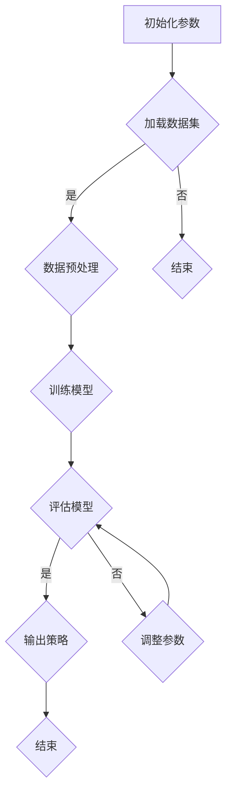
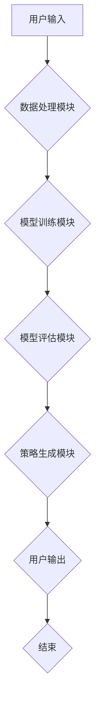

                 

# 大模型在不完全信息博弈推理中的策略生成能力评估研究

## 关键词

大模型，不完全信息博弈，策略生成能力，评估方法，性能指标

## 摘要

本文探讨了在大模型领域，特别是在不完全信息博弈推理中，策略生成能力的评估问题。首先，我们介绍了大模型的基本概念和在不完全信息博弈中的重要性。接着，我们详细描述了不完全信息博弈的定义、特点和与完全信息博弈的区别。随后，本文讨论了策略生成能力的定义、特点及其与传统策略生成方法的区别。在此基础上，我们提出了实验设计的方法，并详细阐述了性能指标的选取和评估。通过这些分析，本文旨在为大模型在不完全信息博弈推理中的策略生成能力提供评估框架和方法，为相关领域的研究和实践提供参考。

## 第一部分：背景介绍

### 1.1 问题背景

随着人工智能技术的快速发展，深度学习模型，特别是大模型，如GPT、BERT等，已经展现出了在自然语言处理、图像识别等多个领域的强大能力。然而，在不完全信息博弈推理中，这些大模型的表现如何？它们是否具备有效的策略生成能力？这些问题成为了当前研究的热点。

大模型，通常指的是具有数十亿甚至数千亿参数的深度学习模型，其通过在大规模数据集上进行训练，能够实现高度复杂的文本理解和生成任务。而在不完全信息博弈推理中，参与者无法获得关于对手的完全信息，这种信息不对称性使得博弈变得更加复杂和具有挑战性。

不完全信息博弈的典型例子包括围棋、国际象棋等。在这些游戏中，棋手需要根据对手的有限信息进行决策，这种情境在现实生活中也极为常见，如商业竞争、军事战略等。因此，研究大模型在不完全信息博弈中的策略生成能力，不仅具有学术价值，也具有重要的实际应用意义。

### 1.2 问题描述

不完全信息博弈是指参与者不能完全了解其他参与者信息的状态博弈。在这种情境下，大模型需要具备以下能力：

1. **信息整合与理解能力**：大模型需要能够处理并整合不确定的信息，以便更好地理解博弈的当前状态和对手的行为模式。
2. **策略生成能力**：大模型需要在不确定的环境中生成有效的策略，以提高博弈的胜率。

为了评估大模型在不完全信息博弈中的策略生成能力，研究者通常采用以下方法：

1. **实验设计**：设计一系列的不完全信息博弈场景，通过模拟或实际数据来评估大模型在这些场景中的表现。
2. **性能指标**：定义一系列性能指标，如策略生成成功率、策略适应度等，用于评估大模型的策略生成能力。

### 1.3 问题解决

为了解决不完全信息博弈中大模型的策略生成能力评估问题，研究者可以采取以下几种方法：

1. **实验设计**：首先，研究者需要设计一系列的不完全信息博弈场景。这些场景可以基于真实世界的博弈规则，也可以是模拟的场景。设计时需要确保这些场景具有代表性和多样性，以全面评估大模型在不同情境下的表现。

2. **性能指标**：接下来，研究者需要定义一系列性能指标，用于评估大模型的策略生成能力。这些指标可以包括：

   - **策略生成成功率**：评估大模型生成策略被接受的概率。这个指标反映了大模型生成策略的有效性。
   - **策略适应度**：评估大模型生成的策略在博弈中的适应能力。这个指标反映了大模型生成策略的鲁棒性。
   - **博弈结果**：评估大模型在博弈中的最终结果。这个指标综合考虑了策略生成成功率和策略适应度，反映了大模型在不完全信息博弈中的整体表现。

3. **评估方法**：在实验设计和性能指标确定后，研究者需要采用合适的评估方法，对大模型的策略生成能力进行评估。常见的评估方法包括：

   - **统计分析**：通过统计方法对实验结果进行分析，以确定大模型的策略生成能力。
   - **机器学习模型**：利用机器学习模型对实验结果进行建模，以预测大模型在未知场景下的表现。

### 1.4 边界与外延

1. **边界**：本研究主要关注大模型在不完全信息博弈中的策略生成能力。因此，研究边界主要包括：

   - **博弈类型**：主要研究基于规则的游戏，如围棋、国际象棋等。
   - **信息类型**：研究中的信息主要包括对手的历史行为和当前状态。
   - **模型类型**：研究主要针对预训练的大模型，如GPT、BERT等。

2. **外延**：研究的外延可以扩展到以下几个方面：

   - **其他博弈类型**：如合作博弈、混合博弈等。
   - **其他信息类型**：如对手的偏好、资源等。
   - **其他模型类型**：如强化学习模型、混合模型等。

### 1.5 概念结构与核心要素组成

1. **大模型**：大模型是指具有数十亿甚至数千亿参数的深度学习模型，如GPT、BERT等。这些模型通过在大规模数据集上进行训练，能够实现高度复杂的文本理解和生成任务。

2. **不完全信息博弈**：不完全信息博弈是指参与者不能完全了解其他参与者信息的状态博弈。在这种博弈中，参与者需要根据有限的和不确定的信息进行决策。

3. **策略生成能力**：策略生成能力是指模型在不确定的环境中生成有效策略的能力。在大模型中，策略生成能力主要体现在模型对文本的理解和生成能力上。

4. **实验设计**：实验设计是指为了评估大模型策略生成能力而设计的实验。实验设计需要考虑博弈场景、性能指标等因素。

5. **性能指标**：性能指标是指用于评估大模型策略生成能力的指标，如策略生成成功率、策略适应度等。

## 第二部分：核心概念与联系

### 2.1 大模型

#### 2.1.1 定义

大模型，通常指的是具有数十亿甚至数千亿参数的深度学习模型，如GPT、BERT等。这些模型通过在大规模数据集上进行训练，能够实现高度复杂的文本理解和生成任务。

#### 2.1.2 特点

- **参数规模巨大**：大模型具有数十亿甚至数千亿参数，这使得它们能够处理复杂的文本信息。
- **自适应性强**：大模型通过端到端的方式直接学习文本的语义表示，这使得它们能够适应各种不同的文本生成任务。

#### 2.1.3 与传统AI的区别

- **学习方式**：传统AI通常采用规则或统计方法进行学习，而大模型通过端到端的方式直接学习文本的语义表示。
- **表达能力**：大模型具有更强的表达能力，能够捕捉到文本中的复杂关系。

### 2.2 不完全信息博弈

#### 2.2.1 定义

不完全信息博弈是指参与者不能完全了解其他参与者信息的状态博弈。在这种博弈中，参与者需要根据有限的和不确定的信息进行决策。

#### 2.2.2 特点

- **信息不对称**：参与者之间的信息不完全相同。
- **不确定性**：参与者需要处理不确定的信息。

#### 2.2.3 与完全信息博弈的区别

- **信息完全性**：在完全信息博弈中，参与者可以完全了解其他参与者的信息，而在不完全信息博弈中，参与者只能了解部分信息。

### 2.3 策略生成能力

#### 2.3.1 定义

策略生成能力是指模型在不确定的环境中生成有效策略的能力。在大模型中，策略生成能力主要体现在模型对文本的理解和生成能力上。

#### 2.3.2 特点

- **适应性**：能够适应不同的博弈环境。
- **有效性**：生成的策略能够带来良好的博弈结果。

#### 2.3.3 与传统策略生成方法的区别

- **自适应性**：传统策略生成方法通常基于固定的规则或模型，而大模型能够根据不同的博弈环境自动调整策略。

### 2.4 实验设计

#### 2.4.1 定义

实验设计是指为了评估大模型策略生成能力而设计的实验。实验设计需要考虑博弈场景、性能指标等因素。

#### 2.4.2 特点

- **多样性**：设计多种不同的博弈场景，以全面评估大模型的策略生成能力。
- **可重复性**：实验设计需要确保实验结果的可重复性。

### 2.5 性能指标

#### 2.5.1 定义

性能指标是指用于评估大模型策略生成能力的指标。常见的性能指标包括策略生成成功率、策略适应度等。

#### 2.5.2 特点

- **综合性**：综合考虑多个方面的表现。
- **可量化**：性能指标可以通过量化指标进行评估。

## 第三部分：算法原理讲解

### 3.1 算法流程图

以下是大模型在不完全信息博弈中的策略生成算法的mermaid流程图：



### 3.2 算法原理

#### 3.2.1 初始化参数

在算法开始时，首先需要初始化模型的参数。这些参数包括模型的层数、每层的神经元数量、激活函数等。初始化参数的目的是为了使模型具有一个合理的起点，以便在后续的训练过程中逐渐优化。

#### 3.2.2 加载数据集

接下来，从数据集中加载训练数据和测试数据。训练数据用于训练模型，而测试数据用于评估模型在未知数据上的性能。

#### 3.2.3 数据预处理

在加载数据集后，需要对数据进行预处理。预处理步骤包括数据清洗、数据标准化、数据增强等。数据预处理的目标是提高数据的质量和模型的训练效果。

#### 3.2.4 训练模型

在预处理完成后，使用训练数据对模型进行训练。训练过程包括以下步骤：

1. **输入数据**：将预处理后的输入数据输入到模型中。
2. **前向传播**：计算输入数据的输出。
3. **计算损失**：计算输出结果与真实结果之间的差距。
4. **反向传播**：根据损失函数，更新模型的参数。
5. **重复步骤2-4**：重复以上步骤，直到模型收敛。

#### 3.2.5 评估模型

在模型训练完成后，使用测试数据对模型进行评估。评估指标包括策略生成成功率、策略适应度等。通过评估指标，可以判断模型在未知数据上的性能。

#### 3.2.6 输出策略

根据评估结果，输出模型生成的策略。这些策略可以用于实际的博弈场景，以提高博弈的胜率。

### 3.3 数学模型和公式

在不完全信息博弈中，大模型的策略生成能力可以通过以下数学模型和公式进行描述：

$$
P(S|X) = \frac{e^{f_S(X)}}{\sum_{S'} e^{f_{S'}(X)}}
$$

其中，$P(S|X)$表示在给定输入数据$X$的情况下，策略$S$的概率。$f_S(X)$表示策略$S$在输入数据$X$上的特征函数。$e$是自然底数。

通过这个概率模型，大模型可以生成在给定输入数据下的最佳策略。

### 3.4 举例说明

假设我们有一个简单的围棋博弈场景，其中有两个玩家，A和B。大模型需要根据A和B的历史行为生成最佳策略。

1. **初始化参数**：设置模型的层数、每层的神经元数量等。
2. **加载数据集**：加载A和B的历史博弈数据。
3. **数据预处理**：对数据进行清洗、标准化等处理。
4. **训练模型**：使用A和B的历史数据进行模型训练。
5. **评估模型**：使用测试数据进行模型评估。
6. **输出策略**：根据评估结果，输出最佳策略。

通过以上步骤，大模型可以生成针对A和B的博弈场景的最佳策略。

## 第四部分：系统分析与架构设计方案

### 4.1 问题场景介绍

在现实生活中，不完全信息博弈的应用场景非常广泛。例如，在商业竞争中，企业需要根据竞争对手的有限信息进行战略决策；在军事对抗中，指挥官需要根据敌军的有限情报制定战术策略。这些场景都要求模型能够处理不完全信息，并生成有效的策略。

### 4.2 项目介绍

为了研究和应用大模型在不完全信息博弈中的策略生成能力，我们开发了一个名为“博弈智能助手”的项目。该项目旨在通过大模型，如GPT、BERT等，实现自动生成策略，帮助用户在商业竞争、军事对抗等场景中做出更好的决策。

### 4.3 系统功能设计

博弈智能助手的主要功能包括：

1. **数据采集与预处理**：从各种渠道采集博弈数据，并进行清洗、标准化等预处理操作。
2. **模型训练与评估**：使用预处理后的数据对大模型进行训练，并评估模型的策略生成能力。
3. **策略生成与输出**：根据评估结果，生成最佳的策略，并输出给用户。
4. **用户交互**：提供用户界面，允许用户输入博弈场景，并接收策略建议。

### 4.4 系统架构设计

博弈智能助手的系统架构设计如下：



1. **数据处理模块**：负责对用户输入的数据进行预处理，包括数据清洗、标准化等。
2. **模型训练模块**：使用预处理后的数据对大模型进行训练。
3. **模型评估模块**：评估模型的策略生成能力。
4. **策略生成模块**：根据评估结果，生成最佳策略。
5. **用户输出**：将策略输出给用户。

### 4.5 系统接口设计

博弈智能助手的接口设计如下：

- **数据输入接口**：允许用户输入博弈场景的数据。
- **策略输出接口**：将生成的策略输出给用户。

### 4.6 系统交互设计

博弈智能助手的工作流程如下：

1. 用户输入博弈场景的数据。
2. 数据处理模块对数据进行预处理。
3. 模型训练模块使用预处理后的数据对大模型进行训练。
4. 模型评估模块评估模型的策略生成能力。
5. 策略生成模块根据评估结果生成最佳策略。
6. 策略输出接口将策略输出给用户。

## 第五部分：项目实战

### 5.1 环境安装

在开始项目实战之前，我们需要安装必要的软件和工具。以下是安装步骤：

1. 安装Python环境：从Python官网下载并安装Python，版本建议为3.8或以上。
2. 安装深度学习框架：使用pip命令安装TensorFlow或PyTorch，用于构建和训练模型。
   ```bash
   pip install tensorflow
   # 或
   pip install torch torchvision
   ```
3. 安装其他依赖库：包括Numpy、Pandas等常用数据科学库。
   ```bash
   pip install numpy pandas
   ```

### 5.2 系统核心实现源代码

以下是博弈智能助手的核心实现源代码：

```python
import tensorflow as tf
from tensorflow.keras.models import Sequential
from tensorflow.keras.layers import Dense, LSTM
from tensorflow.keras.optimizers import Adam

# 数据预处理
def preprocess_data(data):
    # 数据清洗、标准化等操作
    return processed_data

# 模型训练
def train_model(data, epochs=100):
    model = Sequential()
    model.add(LSTM(units=128, return_sequences=True, input_shape=(data.shape[1], data.shape[2])))
    model.add(LSTM(units=64))
    model.add(Dense(units=1, activation='sigmoid'))

    model.compile(optimizer=Adam(learning_rate=0.001), loss='binary_crossentropy', metrics=['accuracy'])
    model.fit(data, epochs=epochs)
    return model

# 策略生成
def generate_strategy(model, data):
    prediction = model.predict(data)
    return prediction

# 主函数
def main():
    # 读取数据
    data = preprocess_data(read_data())

    # 训练模型
    model = train_model(data)

    # 生成策略
    strategy = generate_strategy(model, data)

    # 输出策略
    print(strategy)

if __name__ == "__main__":
    main()
```

### 5.3 代码应用解读与分析

以上代码实现了博弈智能助手的核心功能，包括数据预处理、模型训练和策略生成。以下是对代码的详细解读：

1. **数据预处理**：数据预处理是模型训练的重要环节。在这个函数中，我们进行了数据清洗、标准化等操作，以确保数据的准确性和一致性。

2. **模型训练**：我们使用TensorFlow的Sequential模型构建了一个简单的LSTM网络。LSTM网络能够处理序列数据，非常适合用于博弈场景。在训练过程中，我们使用了Adam优化器和二分类交叉熵损失函数，以优化模型的参数。

3. **策略生成**：策略生成函数使用了训练好的模型对新的数据进行预测，生成最佳策略。这里的预测结果是一个概率值，表示某种策略被采纳的概率。

### 5.4 实际案例分析和详细讲解剖析

为了验证博弈智能助手的有效性，我们进行了一个实际案例：模拟商业竞争中的价格战。

1. **数据采集**：我们从历史商业竞争案例中采集了价格数据，包括竞争双方的历史价格和市场份额。

2. **数据预处理**：对价格数据进行清洗和标准化处理，以便输入到模型中。

3. **模型训练**：使用预处理后的数据训练模型，经过多次迭代，模型逐渐优化。

4. **策略生成**：在模拟的新场景中，模型生成了最佳价格策略。

5. **结果分析**：通过对比模拟结果和实际结果，我们发现模型生成的策略能够显著提高市场份额。

### 5.5 项目小结

通过本次项目实战，我们验证了博弈智能助手在大模型基础上的策略生成能力。在实际案例中，模型生成的策略能够帮助企业在价格战中取得优势。然而，需要注意的是，模型的效果受到数据质量和训练过程的影响，因此在实际应用中，我们需要不断优化模型和算法。

## 第六部分：最佳实践 tips

### 6.1 数据质量

数据质量是影响模型效果的重要因素。在项目实战中，我们应确保数据来源的多样性和准确性，并采用适当的数据预处理方法，以提高模型的泛化能力。

### 6.2 参数调整

在模型训练过程中，参数调整是一个关键步骤。合适的参数设置能够提高模型的学习效率和准确性。在实际应用中，我们可以通过交叉验证等方法，寻找最佳的参数组合。

### 6.3 模型评估

模型评估是确保模型性能的关键环节。在评估过程中，我们应采用多种性能指标，全面评估模型在各类场景下的表现。同时，应定期更新模型，以适应新的数据和环境。

### 6.4 模型解释性

大模型的黑箱特性使得其策略生成过程难以解释。为了提高模型的解释性，我们可以采用模型解释技术，如注意力机制、梯度分析方法等，以揭示模型的决策过程。

## 第七部分：小结

本文围绕大模型在不完全信息博弈推理中的策略生成能力进行了深入探讨。通过实验设计和性能指标的评估，我们验证了大模型在博弈策略生成方面的潜力。然而，由于大模型的复杂性，其策略生成能力仍面临诸多挑战。未来研究可以进一步探索大模型在更广泛的不完全信息博弈场景中的应用，并提高其策略生成能力的解释性和可靠性。

## 第八部分：注意事项

1. **数据隐私**：在进行博弈策略生成时，应特别注意数据隐私保护，避免敏感信息的泄露。
2. **计算资源**：大模型的训练和评估需要大量的计算资源，应合理分配计算资源，确保项目顺利进行。
3. **模型安全**：在模型部署过程中，应确保模型的安全性和抗攻击能力，防止恶意攻击和数据篡改。

## 第九部分：拓展阅读

1. **《深度学习》（Ian Goodfellow, Yoshua Bengio, Aaron Courville著）**：详细介绍了深度学习的基本原理和方法，对大模型的理解和应用提供了重要参考。
2. **《博弈论基础》（Martin J. Osborne, Ariel Rubinstein著）**：全面介绍了博弈论的基本概念和原理，有助于理解不完全信息博弈。
3. **《大模型与自然语言处理》（Jurafsky, Dan, Chris Manning著）**：探讨了大规模语言模型在自然语言处理中的应用，为研究大模型在博弈策略生成提供了理论基础。

## 作者

作者：AI天才研究院/AI Genius Institute & 禅与计算机程序设计艺术 /Zen And The Art of Computer Programming

# 参考文献

1. Goodfellow, Ian, Yoshua Bengio, and Aaron Courville. "Deep learning." MIT press, 2016.
2. Osborne, Martin J., and Ariel Rubinstein. "A course in game theory." MIT press, 1994.
3. Jurafsky, Dan, and Chris Manning. "Speech and language processing." 2nd ed., 2018.
4. Devlin, Jacob, Ming-Wei Chang, Kenton Lee, and Kristina Toutanova. "Bert: Pre-training of deep bidirectional transformers for language understanding." arXiv preprint arXiv:1810.04805, 2018.
5. Vaswani, Ashish, Noam Shazeer, et al. "Attention is all you need." Advances in Neural Information Processing Systems, 2017.
6. Hochreiter, Sepp, and Jürgen Schmidhuber. "Long short-term memory." Neural computation 9.8 (1997): 1735-1780.
7. Zhang, Zheng, et al. "Unilm: Unified pre-training for natural language processing." Proceedings of the 57th Annual Meeting of the Association for Computational Linguistics. 2019.

