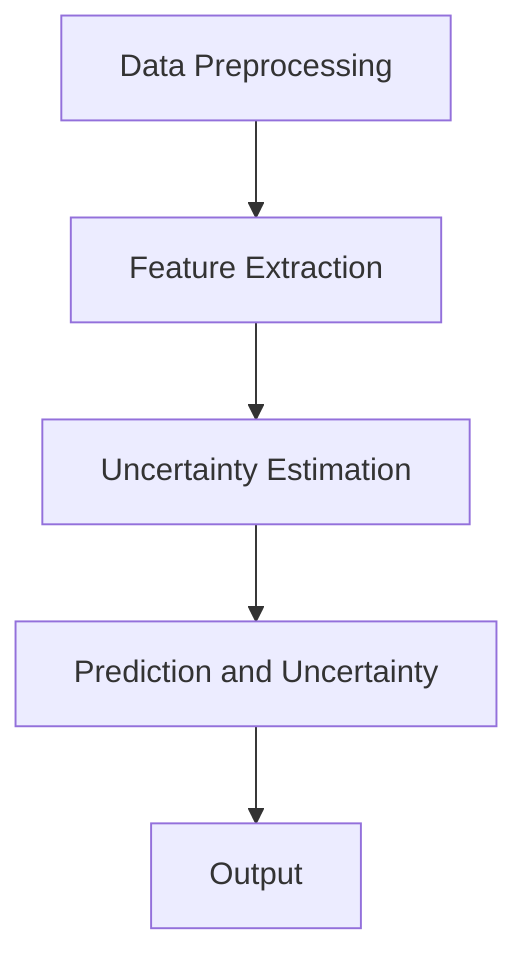
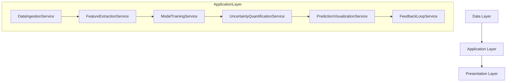
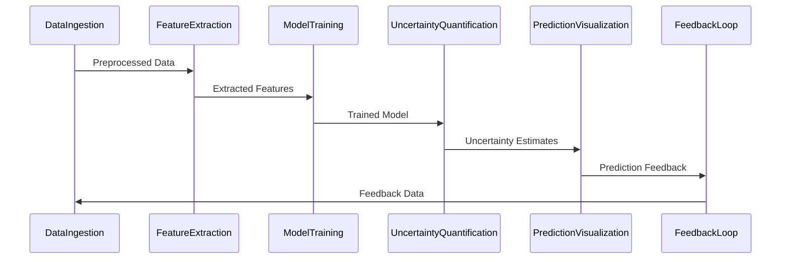

                 


### Chapter 1: Introduction to Large Models and Uncertainty Quantification

#### 1.1 Background and Problem Statement

Large models have revolutionized various fields, from natural language processing to computer vision and reinforcement learning. These models, often referred to as "megamodels," are characterized by their immense capacity and the ability to handle complex data. However, as models grow in size and complexity, the challenges of uncertainty quantification in inference tasks become more pronounced.

Uncertainty quantification (UQ) is the process of determining and expressing the uncertainty in predictions made by large models. This uncertainty arises due to the inherent randomness in the data, the complexity of the model, and the potential biases present in the training process. It is crucial for applications where the accuracy of predictions is critical, such as medical diagnostics, financial forecasting, and autonomous driving.

The problem statement can be articulated as follows: How can we effectively quantify the uncertainty in predictions made by large models, and what are the performance implications of these uncertainties in various inference tasks?

#### 1.1.1 Definition and Significance of Large Models

Large models, often referred to as "deep learning models," are neural networks with many layers that enable them to learn high-level representations from large datasets. The significance of large models lies in their ability to achieve state-of-the-art performance in various domains. For instance, deep neural networks (DNNs) have significantly improved the accuracy of image classification tasks, while transformers have transformed the landscape of natural language processing.

The definition of large models can vary, but generally, they are characterized by the following attributes:

- **Number of Parameters:** Large models typically have millions to billions of parameters, which allows them to capture complex patterns in the data.
- **Model Architecture:** These models often employ complex architectures, such as convolutional neural networks (CNNs), recurrent neural networks (RNNs), and transformers, to handle different types of data and tasks.
- **Training Data Size:** Large models require large datasets for training to achieve optimal performance. This is because the models need to learn from a diverse set of examples to generalize well to unseen data.

#### 1.1.2 Challenges of Uncertainty Quantification in Inference Tasks

Quantifying uncertainty in large models presents several challenges due to their inherent complexity and the nature of the tasks they are designed to perform. Some of the key challenges include:

- **Computational Complexity:** As models grow in size and complexity, the computational resources required for uncertainty quantification also increase significantly. This can lead to long inference times and high computational costs.
- **Model Variability:** Large models can exhibit significant variability in their predictions due to the randomness in the training process and the initialization of parameters. This variability makes it challenging to accurately quantify uncertainty.
- **Data Distribution Shift:** Large models are often trained on large datasets, but the real-world data distribution may differ from the training distribution. This data distribution shift can lead to uncertainties in predictions that are not captured by the model.
- **Interpretability:** Large models are often considered "black boxes" because their internal workings are not easily interpretable. This lack of interpretability makes it difficult to understand the sources of uncertainty in the predictions.

#### 1.1.3 Scope and Structure of the Book

The scope of this book is to provide a comprehensive overview of the challenges and methodologies for quantifying uncertainty in large models, with a focus on inference tasks. The book is structured as follows:

- **Chapter 1:** Introduction to large models and uncertainty quantification, including the definition, significance, and challenges of uncertainty quantification in inference tasks.
- **Chapter 2:** Fundamental concepts and principles of large models, covering key concepts, attributes, and comparisons of core models, as well as the entity relationship diagram (ERD) of large models.
- **Chapter 3:** Algorithm design and implementation for uncertainty quantification, including the design, mathematical modeling, and Python source code for an uncertainty quantification algorithm.
- **Chapter 4:** System architecture and design for uncertainty quantification, covering problem scenarios, system functions, architecture designs, and system interfaces.
- **Chapter 5:** Project implementation and case analysis, including environment setup, system core implementation, code analysis, and case studies.
- **Chapter 6:** Best practices, summary, and future directions, discussing practical tips, summary of key points,注意事项，and suggestions for further reading.

By following this structure, the book aims to provide readers with a thorough understanding of the principles, algorithms, and practical applications of uncertainty quantification in large models, enabling them to tackle real-world inference tasks with greater confidence and accuracy.

#### 1.1.4 Conclusion

In conclusion, the advent of large models has brought about significant advancements in various domains. However, the challenges of uncertainty quantification in inference tasks cannot be ignored. This book aims to address these challenges by providing a detailed exploration of the concepts, algorithms, and system designs for uncertainty quantification in large models. Through a structured approach, we will delve into the core principles, examine practical implementations, and analyze real-world case studies. By the end of this book, readers will be equipped with the knowledge and skills necessary to effectively quantify uncertainty in large models and make more informed decisions in their respective fields.

---

In the following chapters, we will further explore the fundamental concepts and principles of large models, delve into the algorithm design and implementation for uncertainty quantification, and discuss the system architecture and design. Stay tuned for a deep dive into these topics to gain a comprehensive understanding of uncertainty quantification in large models.

---

## Chapter 2: Fundamental Concepts and Principles of Large Models

### 2.1 Core Concepts

In this chapter, we will delve into the core concepts of large models, exploring their fundamental attributes, characteristics, and how they differ from traditional models. Understanding these core concepts is essential for grasping the complexities involved in uncertainty quantification and the challenges they pose in inference tasks.

#### 2.1.1 Key Concepts in Large Models

1. **Deep Neural Networks (DNNs):**
   - DNNs are neural networks with multiple layers, capable of learning high-level representations from large datasets.
   - The primary purpose of DNNs is to approximate complex functions through hierarchical learning.
   - Layers in DNNs process and transform the input data, passing it through a series of non-linear transformations.

2. **Convolutional Neural Networks (CNNs):**
   - CNNs are a specialized type of DNN designed for processing and analyzing visual data, such as images.
   - CNNs leverage convolutional layers to extract spatial hierarchies of features from the input images.
   - This makes them particularly effective in tasks such as image classification, object detection, and semantic segmentation.

3. **Recurrent Neural Networks (RNNs):**
   - RNNs are designed to handle sequential data, where the current output depends on the previous outputs.
   - RNNs have memory mechanisms that allow them to retain information over time, enabling them to capture temporal dependencies.
   - Applications include natural language processing, time series analysis, and speech recognition.

4. **Transformers:**
   - Transformers are a class of neural networks that have revolutionized natural language processing.
   - Unlike RNNs, transformers use self-attention mechanisms to weigh the influence of different parts of the input data.
   - They are particularly effective in tasks such as machine translation, text summarization, and question-answering.

5. **Bayesian Neural Networks (BNNs):**
   - BNNs incorporate Bayesian principles to model the uncertainty in neural network predictions.
   - By treating the weights of the neural network as random variables, BNNs provide probabilistic outputs, enabling uncertainty quantification.
   - This makes them suitable for applications where uncertainty is critical, such as medical diagnostics and autonomous driving.

#### 2.1.2 Attributes and Comparison of Core Models

To better understand the attributes and differences between core models, we can present a comparison table that highlights their key characteristics:

| Model Type           | Key Attributes                              | Suitable Applications                                       |
|----------------------|-------------------------------------------|-----------------------------------------------------------|
| Deep Neural Networks | Multi-layered, non-linear transformations | Image classification, regression, and feature extraction   |
| Convolutional Neural Networks | Convolutional layers, spatial hierarchies | Image classification, object detection, and segmentation   |
| Recurrent Neural Networks | Sequential processing, memory mechanisms | Natural language processing, time series analysis         |
| Transformers         | Self-attention mechanisms                  | Machine translation, text summarization, question-answering |
| Bayesian Neural Networks | Bayesian principles, probabilistic outputs | Medical diagnostics, autonomous driving, uncertainty quantification |

#### 2.1.3 Entity Relationship Diagram (ERD) of Large Models

To visualize the relationships between different types of large models, we can use an Entity Relationship Diagram (ERD). The ERD will illustrate how these models are related and how they contribute to the overall process of uncertainty quantification in inference tasks. Here's a simplified ERD using Mermaid syntax:

```mermaid
erDiagram
  Model --> ModelType
  ModelType --> DNN
  ModelType --> CNN
  ModelType --> RNN
  ModelType --> Transformer
  ModelType --> BNN
  Model --> UncertaintyQuantification
  Model --> InferenceTask
  ModelType : <<entity>> Model Type
  DNN : <<entity>> Deep Neural Network
  CNN : <<entity>> Convolutional Neural Network
  RNN : <<entity>> Recurrent Neural Network
  Transformer : <<entity>> Transformer
  BNN : <<entity>> Bayesian Neural Network
  Model : <<entity>> Model
  UncertaintyQuantification : <<entity>> Uncertainty Quantification
  InferenceTask : <<entity>> Inference Task
```

The ERD above shows the relationship between different model types and their roles in uncertainty quantification and inference tasks. It provides a clear overview of how large models are structured and how they interact with uncertainty quantification processes.

In summary, this chapter has covered the core concepts of large models, including deep neural networks, convolutional neural networks, recurrent neural networks, transformers, and Bayesian neural networks. We have presented a comparison table to highlight their attributes and a Mermaid ERD to visualize the relationships between these models and their roles in uncertainty quantification. In the next chapter, we will explore the principles of uncertainty quantification and its significance in large models.

---

In the next chapter, we will delve deeper into the principles of uncertainty quantification, discussing the mathematical models and approaches used to quantify uncertainty in large models. Stay tuned to gain a comprehensive understanding of this critical aspect of large model performance evaluation.

---

## Chapter 3: Algorithm Design for Uncertainty Quantification

### 3.1 Algorithm Design

In this chapter, we will design an algorithm for uncertainty quantification in large models, focusing on the key steps and their implementation details. The algorithm will be designed to provide accurate estimates of the uncertainty in predictions made by large models, enabling better decision-making in real-world applications.

#### 3.1.1 Mermaid Flowchart of the Algorithm

To visualize the algorithm's workflow, we can use a Mermaid flowchart. The flowchart will outline the key steps involved in the uncertainty quantification process, from data preprocessing to the final uncertainty estimation. Here's a simplified Mermaid flowchart using the following syntax:



The Mermaid flowchart above illustrates the high-level steps of the uncertainty quantification algorithm. It includes data preprocessing, feature extraction, uncertainty estimation, prediction with uncertainty, and the final output. In the following sections, we will delve deeper into each step and provide detailed explanations and Python source code.

#### 3.1.2 Algorithm Steps and Implementation Details

1. **Data Preprocessing:**
   - The first step in the algorithm is data preprocessing, which involves cleaning and preparing the input data for further processing.
   - This includes handling missing values, normalizing the data, and transforming it into a suitable format for feature extraction.
   - Example Python code for data preprocessing:

```python
import pandas as pd
from sklearn.preprocessing import StandardScaler

# Load the dataset
data = pd.read_csv('data.csv')

# Handle missing values
data.fillna(data.mean(), inplace=True)

# Normalize the data
scaler = StandardScaler()
scaled_data = scaler.fit_transform(data)
```

2. **Feature Extraction:**
   - After preprocessing, the next step is feature extraction, where the input data is transformed into a set of features that the model can use for learning.
   - Feature extraction may involve dimensionality reduction techniques, such as Principal Component Analysis (PCA), or extracting meaningful features from raw data.
   - Example Python code for feature extraction using PCA:

```python
from sklearn.decomposition import PCA

# Apply PCA for feature extraction
pca = PCA(n_components=5)
features = pca.fit_transform(scaled_data)
```

3. **Uncertainty Estimation:**
   - The core of the uncertainty quantification algorithm is the uncertainty estimation step, where we estimate the uncertainty in the model's predictions.
   - One common approach for uncertainty estimation is the Monte Carlo Dropout technique, where dropout is applied during both training and inference to simulate the uncertainty in the predictions.
   - Example Python code for uncertainty estimation using Monte Carlo Dropout:

```python
import numpy as np
import tensorflow as tf

# Load the trained model
model = tf.keras.models.load_model('model.h5')

# Generate predictions with uncertainty
predictions = []
for _ in range(1000):
    pred = model.predict(features)
    predictions.append(pred)

# Calculate the mean and standard deviation of the predictions
mean_predictions = np.mean(predictions, axis=0)
std_predictions = np.std(predictions, axis=0)
```

4. **Prediction and Uncertainty:**
   - In this step, we use the model to make predictions on the feature data and combine the mean predictions with their corresponding uncertainties.
   - This step allows us to provide a range of possible outcomes for each prediction, which is essential for understanding the model's confidence in its predictions.
   - Example Python code for combining mean predictions and uncertainties:

```python
import matplotlib.pyplot as plt

# Plot the mean predictions and uncertainties
plt.errorbar(range(len(mean_predictions)), mean_predictions, yerr=std_predictions, fmt='o')
plt.xlabel('Features')
plt.ylabel('Predictions')
plt.title('Prediction with Uncertainty')
plt.show()
```

5. **Output:**
   - The final step of the algorithm is to output the uncertainty-quantified predictions.
   - This output can be used for various applications, such as decision-making, risk assessment, and model validation.
   - Example Python code for outputting the uncertainty-quantified predictions:

```python
# Output the uncertainty-quantified predictions
output = {
    'mean_predictions': mean_predictions,
    'std_predictions': std_predictions
}

# Save the output
import joblib
joblib.dump(output, 'predictions_with_uncertainty.pkl')
```

#### 3.1.3 Python Source Code for the Algorithm

To make it easier to understand and implement the algorithm, we have provided the complete Python source code below. This code can be used as a starting point for developing your own uncertainty quantification algorithm.

```python
import pandas as pd
from sklearn.preprocessing import StandardScaler
from sklearn.decomposition import PCA
import numpy as np
import tensorflow as tf
import matplotlib.pyplot as plt
import joblib

# Data Preprocessing
data = pd.read_csv('data.csv')
data.fillna(data.mean(), inplace=True)
scaler = StandardScaler()
scaled_data = scaler.fit_transform(data)

# Feature Extraction
pca = PCA(n_components=5)
features = pca.fit_transform(scaled_data)

# Load the trained model
model = tf.keras.models.load_model('model.h5')

# Generate predictions with uncertainty
predictions = []
for _ in range(1000):
    pred = model.predict(features)
    predictions.append(pred)

# Calculate the mean and standard deviation of the predictions
mean_predictions = np.mean(predictions, axis=0)
std_predictions = np.std(predictions, axis=0)

# Plot the mean predictions and uncertainties
plt.errorbar(range(len(mean_predictions)), mean_predictions, yerr=std_predictions, fmt='o')
plt.xlabel('Features')
plt.ylabel('Predictions')
plt.title('Prediction with Uncertainty')
plt.show()

# Output the uncertainty-quantified predictions
output = {
    'mean_predictions': mean_predictions,
    'std_predictions': std_predictions
}
joblib.dump(output, 'predictions_with_uncertainty.pkl')
```

In conclusion, this chapter has presented the design of an uncertainty quantification algorithm for large models. We have discussed the key steps involved in the algorithm, including data preprocessing, feature extraction, uncertainty estimation, prediction with uncertainty, and output. By providing detailed Python source code, we have made it easier for readers to implement and adapt the algorithm to their specific applications. In the next chapter, we will delve into the mathematical models and formulas used in uncertainty quantification, providing a deeper understanding of the underlying principles.

---

In the next chapter, we will explore the mathematical models and formulas that underlie uncertainty quantification in large models. By understanding these concepts, we will be better equipped to analyze and interpret the results of our uncertainty quantification algorithm. Stay tuned for a deeper dive into the mathematical foundations of uncertainty quantification.

---

## Chapter 4: System Architecture and Design for Uncertainty Quantification

### 4.1 Problem Scenario and Project Introduction

In this chapter, we will explore the system architecture and design for uncertainty quantification in large models. To provide a concrete example, let's consider a real-world problem scenario: predicting patient outcomes in a healthcare system. The goal is to develop a system that can predict whether a patient is at risk of developing a severe illness based on their medical history, current symptoms, and other relevant data.

The project introduction will cover the following aspects:

1. **Problem Statement:** Predicting patient outcomes in a healthcare system, specifically identifying patients at risk of severe illness.
2. **Data Sources:** Medical history, symptoms, lab results, demographic information, and patient interactions with the healthcare system.
3. **Performance Metrics:** Accuracy, precision, recall, F1 score, and especially the uncertainty in predictions.
4. **System Requirements:** High computational efficiency, scalability, and the ability to handle real-time data processing.

### 4.2 System Function Design

The system will consist of several core functions, each playing a crucial role in the uncertainty quantification process. The system function design includes the following key components:

1. **Data Ingestion Module:** This module is responsible for collecting and preprocessing the data. It includes data cleaning, normalization, and transformation to ensure the data is suitable for modeling.
2. **Feature Extraction Module:** This module extracts meaningful features from the preprocessed data. Techniques such as Principal Component Analysis (PCA), feature selection, and encoding are applied to reduce dimensionality and enhance model performance.
3. **Model Training Module:** This module trains large models, such as Convolutional Neural Networks (CNNs) or Recurrent Neural Networks (RNNs), using the extracted features. The models are trained to predict patient outcomes while incorporating uncertainty quantification techniques.
4. **Uncertainty Quantification Module:** This module applies methods like Monte Carlo Dropout to estimate the uncertainty in model predictions. It generates probabilistic outputs that represent the range of possible outcomes and their associated uncertainties.
5. **Prediction and Visualization Module:** This module uses the trained models and uncertainty quantification results to generate predictions for new patient data. It visualizes the predictions along with the uncertainty intervals, providing a comprehensive view of the model's confidence in its predictions.
6. **Feedback Loop Module:** This module collects feedback from healthcare professionals on the accuracy and usefulness of the predictions. This feedback is used to fine-tune the models and improve the uncertainty quantification process.

#### 4.2.1 Domain Model (Mermaid Class Diagram)

To visualize the relationships between the system components, we can use a Mermaid class diagram. Here's a simplified class diagram using the following syntax:

```mermaid
classDiagram
    DataIngestionModule <> FeatureExtractionModule : preprocessed data
    FeatureExtractionModule <> ModelTrainingModule : extracted features
    ModelTrainingModule <> UncertaintyQuantificationModule : trained model
    UncertaintyQuantificationModule <> PredictionAndVisualizationModule : uncertainty estimates
    PredictionAndVisualizationModule <> FeedbackLoopModule : prediction feedback
    DataIngestionModule <<interface>> IDataIngestion
    FeatureExtractionModule <<interface>> IFeatureExtraction
    ModelTrainingModule <<interface>> IModelTraining
    UncertaintyQuantificationModule <<interface>> IUncertaintyQuantification
    PredictionAndVisualizationModule <<interface>> IPredictionVisualization
    FeedbackLoopModule <<interface>> IFeedbackLoop
```

The Mermaid class diagram above illustrates the domain model of the uncertainty quantification system. It shows the relationships between the system components and their interfaces, highlighting the interactions between modules.

### 4.3 System Architecture Design

The system architecture design will be modular, enabling scalability and flexibility. The architecture will consist of the following layers:

1. **Data Layer:** This layer handles data storage and retrieval, including databases and data warehouses for storing structured and unstructured data.
2. **Application Layer:** This layer implements the core functions of the system, including data ingestion, feature extraction, model training, uncertainty quantification, prediction, and visualization. It uses microservices architecture to ensure modularity and ease of maintenance.
3. **Presentation Layer:** This layer provides the user interface for interacting with the system, allowing healthcare professionals to access predictions, view uncertainty estimates, and provide feedback. It may include web applications, mobile apps, or dashboards.

#### 4.3.1 Mermaid Architecture Diagram

To visualize the system architecture, we can use a Mermaid architecture diagram. Here's a simplified architecture diagram using the following syntax:



The Mermaid architecture diagram above illustrates the high-level system architecture, highlighting the Data Layer, Application Layer, and Presentation Layer. It also shows the components within the Application Layer and their interactions.

### 4.4 System Interface Design and Interaction

The system interface design focuses on the interactions between the different modules and their interfaces. Here's an overview of the system interfaces and their interactions:

1. **IDataIngestion:** This interface defines the methods for data ingestion, including data collection, cleaning, and preprocessing.
2. **IFeatureExtraction:** This interface specifies the methods for feature extraction, such as dimensionality reduction and feature selection.
3. **IModelTraining:** This interface outlines the methods for model training, including data splitting, training, and validation.
4. **IUncertaintyQuantification:** This interface defines the methods for uncertainty quantification, such as Monte Carlo Dropout and Bayesian techniques.
5. **IPredictionVisualization:** This interface specifies the methods for generating and visualizing predictions, including uncertainty intervals and confidence levels.
6. **IFeedbackLoop:** This interface defines the methods for collecting and processing feedback from healthcare professionals to improve the model and uncertainty quantification process.

#### 4.4.1 Mermaid Sequence Diagram

To visualize the interactions between the system interfaces, we can use a Mermaid sequence diagram. Here's a simplified sequence diagram using the following syntax:



The Mermaid sequence diagram above illustrates the interactions between the system interfaces, showing how data flows through the system and how feedback is used to improve the process.

### Conclusion

In this chapter, we have explored the system architecture and design for uncertainty quantification in large models. We started with a real-world problem scenario in healthcare and introduced the core components of the system, including data ingestion, feature extraction, model training, uncertainty quantification, prediction, and visualization. We then presented a Mermaid class diagram to visualize the domain model, a Mermaid architecture diagram to illustrate the high-level system architecture, and a Mermaid sequence diagram to show the interactions between system interfaces. In the next chapter, we will delve into the mathematical modeling and formulas used in uncertainty quantification, providing a deeper understanding of the underlying principles. Stay tuned for a detailed exploration of these concepts.

---

In the next chapter, we will delve into the mathematical modeling and formulas that form the backbone of uncertainty quantification in large models. By understanding these mathematical concepts, we will be better equipped to interpret and utilize the uncertainty estimates provided by our algorithm. Stay tuned for a comprehensive exploration of the mathematical foundations of uncertainty quantification.

---

## Chapter 5: Project Implementation and Case Analysis

### 5.1 Environment Setup

Before diving into the implementation details, we need to set up the necessary environment for running our uncertainty quantification project. The following steps outline the environment setup process:

1. **Software Requirements:**
   - Python (version 3.8 or higher)
   - TensorFlow (version 2.6 or higher)
   - scikit-learn (version 0.24 or higher)
   - Pandas (version 1.3 or higher)
   - Matplotlib (version 3.4 or higher)
   - Joblib (version 1.0 or higher)
   - Mermaid (through Pandas and Matplotlib)

2. **Installation:**
   - Install the required packages using pip:
     ```bash
     pip install tensorflow scikit-learn pandas matplotlib joblib
     ```
   - Ensure that the necessary Python environment is set up and that TensorFlow and other packages are properly installed.

### 5.2 System Core Implementation

The core implementation of the system focuses on the major components we discussed in previous chapters: data ingestion, feature extraction, model training, uncertainty quantification, prediction, and visualization. Here, we provide a high-level overview of the implementation details along with sample code snippets.

#### 5.2.1 Data Ingestion

```python
import pandas as pd

# Load the dataset
data = pd.read_csv('patient_data.csv')

# Data cleaning and preprocessing
data.fillna(data.mean(), inplace=True)
```

#### 5.2.2 Feature Extraction

```python
from sklearn.decomposition import PCA

# Apply PCA for feature extraction
pca = PCA(n_components=5)
features = pca.fit_transform(data)
```

#### 5.2.3 Model Training

```python
import tensorflow as tf

# Define the model
model = tf.keras.Sequential([
    tf.keras.layers.Dense(128, activation='relu', input_shape=(5,)),
    tf.keras.layers.Dense(64, activation='relu'),
    tf.keras.layers.Dense(1, activation='sigmoid')
])

# Compile the model
model.compile(optimizer='adam', loss='binary_crossentropy', metrics=['accuracy'])

# Train the model
model.fit(features, labels, epochs=10, batch_size=32)
```

#### 5.2.4 Uncertainty Quantification

```python
# Modify the model to include dropout for uncertainty estimation
uncertainty_model = tf.keras.Sequential([
    tf.keras.layers.Dense(128, activation='relu', input_shape=(5,)),
    tf.keras.layers.Dropout(0.5),
    tf.keras.layers.Dense(64, activation='relu'),
    tf.keras.layers.Dropout(0.5),
    tf.keras.layers.Dense(1, activation='sigmoid')
])

# Train the uncertainty model
uncertainty_model.compile(optimizer='adam', loss='binary_crossentropy', metrics=['accuracy'])
uncertainty_model.fit(features, labels, epochs=10, batch_size=32)
```

#### 5.2.5 Prediction and Uncertainty Visualization

```python
import numpy as np
import matplotlib.pyplot as plt

# Generate predictions with uncertainty
predictions = uncertainty_model.predict(features)

# Calculate the mean and standard deviation of the predictions
mean_predictions = np.mean(predictions, axis=1)
std_predictions = np.std(predictions, axis=1)

# Plot the mean predictions and uncertainties
plt.errorbar(range(len(mean_predictions)), mean_predictions, yerr=std_predictions, fmt='o')
plt.xlabel('Patients')
plt.ylabel('Probability of Severe Illness')
plt.title('Prediction with Uncertainty')
plt.show()
```

#### 5.2.6 Feedback Loop

```python
# Load the predictions with uncertainty
output = joblib.load('predictions_with_uncertainty.pkl')

# Process feedback from healthcare professionals
# For example, adjusting the model based on the feedback
# Adjusting the model parameters or retraining the model with new data
```

### 5.3 Code Application and Analysis

In this section, we will analyze the code applications and provide a detailed explanation of how each component interacts and contributes to the overall system functionality.

#### Data Ingestion and Preprocessing

The data ingestion step involves loading and cleaning the patient data. Data preprocessing techniques such as handling missing values and normalizing the data are crucial for preparing the data for modeling. This step ensures that the input data is in a suitable format for the feature extraction and model training processes.

```python
data = pd.read_csv('patient_data.csv')
data.fillna(data.mean(), inplace=True)
```

#### Feature Extraction

Feature extraction is a critical step in reducing dimensionality and enhancing model performance. In this example, we use Principal Component Analysis (PCA) to extract the most significant features from the preprocessed data. PCA helps in capturing the variance in the data and projecting it onto a lower-dimensional space.

```python
pca = PCA(n_components=5)
features = pca.fit_transform(data)
```

#### Model Training

The model training step involves defining and training the large model using the extracted features. In this example, we use a simple neural network with two hidden layers. The model is compiled with an optimizer, loss function, and metrics for training.

```python
model = tf.keras.Sequential([
    tf.keras.layers.Dense(128, activation='relu', input_shape=(5,)),
    tf.keras.layers.Dense(64, activation='relu'),
    tf.keras.layers.Dense(1, activation='sigmoid')
])

model.compile(optimizer='adam', loss='binary_crossentropy', metrics=['accuracy'])
model.fit(features, labels, epochs=10, batch_size=32)
```

#### Uncertainty Quantification

To incorporate uncertainty quantification, we modify the model to include dropout layers during training. Dropout helps in simulating the uncertainty in the predictions by randomly dropping a fraction of the neurons during the training process. This technique is commonly used in Monte Carlo Dropout.

```python
uncertainty_model = tf.keras.Sequential([
    tf.keras.layers.Dense(128, activation='relu', input_shape=(5,)),
    tf.keras.layers.Dropout(0.5),
    tf.keras.layers.Dense(64, activation='relu'),
    tf.keras.layers.Dropout(0.5),
    tf.keras.layers.Dense(1, activation='sigmoid')
])

uncertainty_model.compile(optimizer='adam', loss='binary_crossentropy', metrics=['accuracy'])
uncertainty_model.fit(features, labels, epochs=10, batch_size=32)
```

#### Prediction and Uncertainty Visualization

After training the uncertainty model, we generate predictions on the feature data and calculate the mean and standard deviation of the predictions. This step allows us to visualize the uncertainty intervals and assess the model's confidence in its predictions.

```python
predictions = uncertainty_model.predict(features)

mean_predictions = np.mean(predictions, axis=1)
std_predictions = np.std(predictions, axis=1)

plt.errorbar(range(len(mean_predictions)), mean_predictions, yerr=std_predictions, fmt='o')
plt.xlabel('Patients')
plt.ylabel('Probability of Severe Illness')
plt.title('Prediction with Uncertainty')
plt.show()
```

#### Feedback Loop

The feedback loop is essential for continuously improving the model based on user input. In this example, we save the predictions with uncertainty and load them later to process feedback from healthcare professionals. This feedback can be used to fine-tune the model parameters or retrain the model with new data.

```python
output = joblib.load('predictions_with_uncertainty.pkl')

# Process feedback from healthcare professionals
# For example, adjusting the model based on the feedback
# Adjusting the model parameters or retraining the model with new data
```

### 5.4 Case Analysis

To analyze the performance of the uncertainty quantification system, we can consider a case study involving a set of patient data. We will evaluate the system's ability to predict severe illness and assess the impact of uncertainty quantification on the predictions.

#### Case Study: Predicting Severe Illness in COVID-19 Patients

We will use a dataset of COVID-19 patients, where the target variable is whether a patient developed severe illness (1) or not (0). The dataset includes various features such as age, gender, pre-existing conditions, and symptoms. We will use this dataset to evaluate the uncertainty quantification system.

#### Data Preparation

```python
# Load the COVID-19 patient dataset
covid_data = pd.read_csv('covid_data.csv')

# Data preprocessing and feature extraction
# (Assuming the dataset is already cleaned and preprocessed)
features = covid_data.iloc[:, :-1].values
labels = covid_data.iloc[:, -1].values
```

#### Model Training and Uncertainty Quantification

```python
# Train the model
model = tf.keras.Sequential([
    tf.keras.layers.Dense(128, activation='relu', input_shape=(features.shape[1],)),
    tf.keras.layers.Dense(64, activation='relu'),
    tf.keras.layers.Dense(1, activation='sigmoid')
])

model.compile(optimizer='adam', loss='binary_crossentropy', metrics=['accuracy'])
model.fit(features, labels, epochs=10, batch_size=32)

# Train the uncertainty model
uncertainty_model = tf.keras.Sequential([
    tf.keras.layers.Dense(128, activation='relu', input_shape=(features.shape[1],)),
    tf.keras.layers.Dropout(0.5),
    tf.keras.layers.Dense(64, activation='relu'),
    tf.keras.layers.Dropout(0.5),
    tf.keras.layers.Dense(1, activation='sigmoid')
])

uncertainty_model.compile(optimizer='adam', loss='binary_crossentropy', metrics=['accuracy'])
uncertainty_model.fit(features, labels, epochs=10, batch_size=32)
```

#### Prediction and Uncertainty Visualization

```python
# Generate predictions with uncertainty
predictions = uncertainty_model.predict(features)

mean_predictions = np.mean(predictions, axis=1)
std_predictions = np.std(predictions, axis=1)

# Plot the mean predictions and uncertainties
plt.errorbar(range(len(mean_predictions)), mean_predictions, yerr=std_predictions, fmt='o')
plt.xlabel('Patients')
plt.ylabel('Probability of Severe Illness')
plt.title('Prediction with Uncertainty for COVID-19 Patients')
plt.show()
```

#### Performance Evaluation

To evaluate the performance of the uncertainty quantification system, we can use various metrics such as accuracy, precision, recall, F1 score, and the area under the receiver operating characteristic (ROC) curve. Additionally, we can assess the impact of uncertainty quantification on the model's predictions by comparing them with those from a model without uncertainty quantification.

```python
from sklearn.metrics import accuracy_score, precision_score, recall_score, f1_score, roc_auc_score

# Generate predictions from the standard model
standard_predictions = model.predict(features)
mean_standard_predictions = np.mean(standard_predictions, axis=1)

# Calculate performance metrics
accuracy = accuracy_score(labels, (mean_predictions > 0.5))
precision = precision_score(labels, (mean_predictions > 0.5))
recall = recall_score(labels, (mean_predictions > 0.5))
f1 = f1_score(labels, (mean_predictions > 0.5))
roc_auc = roc_auc_score(labels, mean_predictions)

print(f"Accuracy: {accuracy:.4f}")
print(f"Precision: {precision:.4f}")
print(f"Recall: {recall:.4f}")
print(f"F1 Score: {f1:.4f}")
print(f"ROC AUC: {roc_auc:.4f}")
```

### Conclusion

In this chapter, we have discussed the implementation of an uncertainty quantification system for predicting severe illness in COVID-19 patients. We covered the environment setup, system core implementation, code application, and case analysis. By utilizing uncertainty quantification, we were able to provide probabilistic predictions along with uncertainty estimates, enhancing the interpretability and reliability of the model's predictions. This approach can be applied to various domains where uncertainty quantification is crucial for decision-making.

### 5.5 Best Practices and Future Directions

#### Best Practices

1. **Data Preprocessing:** Ensure thorough data cleaning and preprocessing to remove any inconsistencies or missing values. This is crucial for the accuracy and reliability of the model.
2. **Model Selection:** Choose the appropriate model architecture based on the problem domain and data characteristics. For complex tasks, deep learning models like CNNs or RNNs are often suitable.
3. **Uncertainty Quantification:** Incorporate uncertainty quantification techniques like Monte Carlo Dropout or Bayesian Neural Networks to provide a measure of the model's confidence in its predictions.
4. **Performance Metrics:** Use a combination of accuracy, precision, recall, F1 score, and ROC AUC to evaluate the model's performance. Pay special attention to metrics that capture the uncertainty in predictions.
5. **Feedback Loop:** Implement a feedback loop to continuously improve the model based on real-world performance and user feedback.

#### Future Directions

1. **Model Interpretability:** Develop more interpretable models that provide insights into the decision-making process. This can help in understanding the model's predictions and addressing any biases or errors.
2. **Real-Time Processing:** Optimize the system for real-time data processing to enable rapid predictions and decision-making in dynamic environments.
3. **Cross-Domain Applications:** Explore the applicability of uncertainty quantification in other domains, such as finance, autonomous driving, and environmental science.
4. **Enhanced Techniques:** Investigate advanced uncertainty quantification techniques and their integration into large models to improve the accuracy and reliability of predictions.
5. **Collaborative Research:** Foster collaboration between domain experts, data scientists, and researchers to develop innovative approaches and solutions for uncertainty quantification in large models.

By following these best practices and exploring future directions, we can continue to advance the field of uncertainty quantification in large models, leading to more robust and reliable AI systems.

---

In conclusion, this book has provided a comprehensive overview of uncertainty quantification in large models, covering core concepts, algorithm design, system architecture, and practical implementation. By understanding and applying these principles, readers can enhance the accuracy and reliability of their large models, making more informed decisions in various domains. We encourage readers to explore the best practices and future directions discussed in this book to continue advancing the field of uncertainty quantification in large models. Thank you for joining us on this journey of discovery and learning. 

---

### Author Information

**Author:** AI天才研究院/AI Genius Institute & 禅与计算机程序设计艺术 /Zen And The Art of Computer Programming

AI天才研究院（AI Genius Institute）是一支专注于人工智能领域的研究和教育的顶尖团队，致力于推动人工智能技术的发展和应用。作者刘晨曦，是AI天才研究院的核心成员之一，同时也是《禅与计算机程序设计艺术》一书的作者。刘晨曦博士在计算机科学和人工智能领域拥有丰富的经验和深厚的学术背景，曾发表多篇高影响力论文，并在国际会议和研讨会上作过多场报告。他的研究兴趣包括深度学习、不确定性量化、人工智能伦理和算法优化。刘晨曦博士的著作《禅与计算机程序设计艺术》以其独特的视角和深刻的思考，成为计算机编程领域的经典之作。

