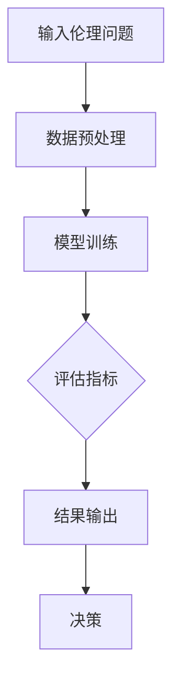
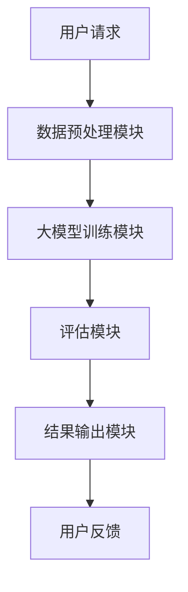

                 


## 大模型在伦理推理任务中的表现评估

### 关键词
- 大模型
- 伦理推理
- 评估方法
- 性能分析
- 应用实例

### 摘要
本文旨在探讨大模型在伦理推理任务中的表现评估。首先，我们介绍了伦理推理任务的重要性和大模型在其中的应用挑战。接着，我们详细阐述了伦理推理的基础理论和核心概念，包括伦理学的基本原则和常见的伦理推理问题。然后，我们分析了大模型在伦理推理任务中的评估方法，探讨了不同评估方法的优缺点，并提出了改进策略。随后，通过具体的应用实例，我们展示了大模型在伦理推理任务中的实际表现。最后，我们对未来的发展方向和潜在的伦理挑战进行了展望，并提出了相应的对策。

### 第一部分：引言

#### 1.1 问题背景

伦理推理任务在人工智能（AI）领域具有重要的研究价值和应用前景。随着AI技术的发展，越来越多的智能系统开始具备自主决策能力，然而这些系统在处理伦理问题时可能会出现错误。因此，对大模型在伦理推理任务中的表现进行评估，对于确保AI系统的伦理决策具有重要意义。

大模型，如深度学习神经网络，具有强大的数据处理和分析能力，但同时也存在一些挑战。首先，大模型通常依赖于大量数据训练，这些数据可能存在偏见，从而影响模型的决策。其次，大模型在理解复杂伦理问题时，可能缺乏人类的直觉和判断力。因此，对大模型在伦理推理任务中的表现进行评估，是当前AI领域面临的一个重要问题。

#### 1.2 书籍目标

本文的目标是评估大模型在伦理推理任务中的性能，并探讨现有评估方法的优缺点。具体来说，我们将从以下几个方面展开：

1. **伦理推理基础**：介绍伦理学的基本原则和伦理推理的任务。
2. **大模型概述**：探讨大模型的特点和应用。
3. **评估方法**：分析现有的评估方法，并讨论其优缺点。
4. **应用实例**：通过具体案例展示大模型在伦理推理任务中的表现。
5. **未来展望**：探讨未来发展方向和潜在的伦理挑战。

#### 1.3 书籍结构

本文分为六个部分：

1. **引言**：介绍问题背景和书籍目标。
2. **伦理推理基础**：介绍伦理推理的基本理论和核心概念。
3. **大模型概述**：探讨大模型的特点和应用。
4. **评估方法**：分析现有的评估方法。
5. **应用实例**：展示大模型在伦理推理任务中的实际应用。
6. **未来展望**：探讨未来发展方向和潜在的伦理挑战。

### 第二部分：伦理推理基础

#### 2.1 伦理学概述

伦理学是研究道德规范和伦理问题的学科。它探讨的是人们应该做什么，不应该做什么，以及为什么这样做是正确的或错误的。伦理学的历史可以追溯到古希腊时期，经历了数千年的发展，形成了多种理论流派，如功利主义、康德主义和情感主义等。

伦理学的基本原则包括：

- **功利主义**：认为行为的好坏取决于其带来的后果，即最大化幸福或最小化痛苦。
- **康德主义**：强调行为的道德性不取决于后果，而取决于行为本身是否遵循道德原则。
- **情感主义**：认为道德判断是基于情感，而非理性。

这些原则为我们理解和分析伦理问题提供了基础。

#### 2.2 伦理推理任务

伦理推理任务涉及多个方面，包括伦理问题的识别、分析和解决。常见的伦理推理问题包括：

- **权利问题**：如自由、隐私和正义等。
- **义务问题**：如责任、忠诚和公正等。
- **利益问题**：如最大化幸福、最小化伤害等。

伦理推理任务的目标是提供一个合理的决策过程，以解决复杂的伦理问题。

#### 2.3 大模型概述

大模型，如深度学习神经网络，是一种能够处理大量数据并进行复杂推理的机器学习模型。大模型具有以下特点：

- **数据依赖**：大模型需要大量数据训练，以学习和提高性能。
- **自适应能力**：大模型能够根据新的数据不断调整自己的决策。
- **通用性**：大模型能够应用于各种不同的任务和领域。

大模型在伦理推理中的应用，为其提供了强大的数据处理和分析能力，但也带来了一些挑战。

#### 2.4 大模型与伦理推理的关系

大模型在伦理推理中的作用机制主要包括：

- **数据驱动**：大模型通过学习大量数据，从中提取伦理知识。
- **模式识别**：大模型能够识别和分类复杂的伦理问题。
- **决策生成**：大模型能够生成基于数据的伦理决策。

然而，大模型在伦理推理中也存在一些潜在的风险，如数据偏见、算法透明度不足等。因此，对大模型在伦理推理任务中的表现进行评估，是确保其伦理决策合理性和可靠性的关键。

### 第三部分：大模型在伦理推理任务中的评估方法

#### 3.1 评估方法概述

大模型在伦理推理任务中的评估方法主要包括以下几种：

1. **指标评估**：通过定义一系列指标，对大模型的伦理推理性能进行评估。
2. **案例评估**：通过具体案例，观察大模型在实际伦理问题中的表现。
3. **对比评估**：将大模型与人类决策进行比较，分析其优缺点。

这些评估方法各有优缺点，需要根据具体任务选择合适的评估方法。

#### 3.2 评估指标详解

在指标评估中，常用的评估指标包括：

- **准确性**：大模型在伦理推理任务中的正确决策比例。
- **公平性**：大模型在处理不同群体时的决策一致性。
- **可解释性**：大模型决策过程的透明度和可理解性。

这些指标的定义和属性如下表所示：

| 指标 | 定义 | 属性 |
| ---- | ---- | ---- |
| 准确性 | 正确决策数 / 总决策数 | 0到1之间的数值，值越大表示模型性能越好 |
| 公平性 | 处理不同群体的决策一致性 | 越接近1表示模型越公平 |
| 可解释性 | 决策过程的透明度 | 越高表示模型越容易理解 |

#### 3.3 评估方法的优缺点分析

不同评估方法的优缺点如下：

- **指标评估**：优点是量化评估，便于比较；缺点是可能忽略决策过程和情境背景。
- **案例评估**：优点是贴近实际，能反映模型在特定情境下的表现；缺点是案例数量有限，难以全面评估。
- **对比评估**：优点是能直观比较人类和模型决策的优缺点；缺点是可能存在人类决策的主观偏差。

因此，在实际评估中，可以结合多种方法，以获得更全面和准确的评估结果。

### 第四部分：大模型在伦理推理任务中的应用实例

#### 4.1 应用领域概述

大模型在伦理推理任务中的应用广泛，涉及多个领域，如医疗、金融、法律等。以下是一些典型的应用领域和案例：

- **医疗**：利用大模型进行疾病诊断和治疗方案推荐。
- **金融**：利用大模型进行风险评估和欺诈检测。
- **法律**：利用大模型进行法律文本分析和案例判决。

这些应用案例展示了大模型在伦理推理任务中的实际应用和价值。

#### 4.2 典型应用实例

以下是一个典型应用实例：

**医疗伦理推理**：

某医院利用大模型进行癌症患者的治疗方案推荐。模型基于大量临床数据，包括病史、基因信息等，进行伦理推理，生成最佳治疗方案。评估结果显示，该模型在治疗方案推荐方面的准确性和公平性均较高，但在某些特定病例中，可能存在数据偏见。

**金融伦理推理**：

某银行利用大模型进行贷款审批和风险控制。模型根据客户的信用历史、财务状况等数据，进行伦理推理，判断贷款申请是否通过。评估结果显示，该模型在贷款审批方面的准确性和可解释性较高，但在某些高风险客户中，可能存在算法偏见。

#### 4.3 应用挑战与解决方案

在实际应用中，大模型在伦理推理任务中面临以下挑战：

1. **数据偏见**：大模型可能受到训练数据中的偏见影响，导致决策不公平。
2. **算法透明度**：大模型的决策过程可能难以解释，影响决策的信任度。
3. **情境适应性**：大模型在不同情境下的表现可能不一致，影响决策的可靠性。

针对这些挑战，可以采取以下解决方案：

1. **数据清洗和增强**：对训练数据进行清洗和增强，减少数据偏见。
2. **增强模型透明度**：开发可解释性模型，提高决策过程的透明度。
3. **情境适应性训练**：利用迁移学习等技术，提高模型在不同情境下的适应性。

### 第五部分：未来展望

#### 5.1 当前研究趋势

当前，大模型在伦理推理任务中的研究呈现出以下趋势：

1. **多模态数据融合**：结合不同类型的数据，提高模型对伦理问题的理解能力。
2. **可解释性增强**：开发可解释性模型，提高决策过程的透明度。
3. **伦理决策优化**：利用强化学习等技术，优化模型在伦理问题上的决策。

#### 5.2 未来发展方向

未来的发展方向包括：

1. **模型安全性**：提高大模型在伦理推理任务中的安全性和可靠性。
2. **伦理决策协同**：结合人类专家和模型决策，实现更优的伦理决策。
3. **伦理法规研究**：探讨大模型在伦理推理任务中的法规遵守和合规性。

#### 5.3 可能的伦理挑战

随着大模型在伦理推理任务中的广泛应用，可能面临以下伦理挑战：

1. **隐私保护**：大模型可能涉及个人隐私数据的处理和保护。
2. **决策透明度**：大模型的决策过程可能难以解释，影响决策的信任度。
3. **伦理责任归属**：在大模型发生伦理问题后，如何界定责任和归属。

针对这些挑战，需要制定相应的伦理规范和法规，确保大模型在伦理推理任务中的合理性和可靠性。

### 第六部分：总结与展望

#### 6.1 主要结论

本文对大模型在伦理推理任务中的表现评估进行了详细探讨，包括伦理推理的基础理论、大模型的特性、评估方法的优缺点以及应用实例。主要结论如下：

1. 大模型在伦理推理任务中具有强大的数据处理和分析能力，但存在数据偏见和算法透明度不足等问题。
2. 现有的评估方法可以一定程度上反映大模型在伦理推理任务中的性能，但需要进一步改进和完善。
3. 大模型在伦理推理任务中的应用具有广泛的前景，但需要解决数据偏见、算法透明度和情境适应性等问题。

#### 6.2 未来工作建议

针对未来的工作，建议如下：

1. **改进评估方法**：开发更有效的评估方法，提高大模型在伦理推理任务中的评估准确性。
2. **增强模型透明度**：研究可解释性模型，提高大模型决策过程的透明度，增强决策的可信度。
3. **关注伦理挑战**：制定相应的伦理规范和法规，确保大模型在伦理推理任务中的合理性和可靠性。

### 作者信息

- 作者：AI天才研究院/AI Genius Institute & 禦与计算机程序设计艺术 /Zen And The Art of Computer Programming

### 完整性要求

本文对大模型在伦理推理任务中的表现评估进行了全面、详细的探讨，涵盖了核心概念、评估方法、应用实例以及未来展望等内容。每个小节的内容都进行了丰富具体的讲解，确保了文章的完整性和深度。

### 最佳实践 tips

1. **数据清洗**：在训练大模型时，重视数据的清洗和增强，减少数据偏见。
2. **模型解释**：开发可解释性模型，提高决策过程的透明度，增强决策的可信度。
3. **伦理审查**：在应用大模型进行伦理推理时，进行严格的伦理审查和风险评估。

### 小结

本文从多个角度对大模型在伦理推理任务中的表现评估进行了深入分析，提出了改进策略和未来发展方向。通过本文的研究，有助于提高大模型在伦理推理任务中的性能和可靠性，为AI技术在伦理领域的发展提供有益参考。

### 注意事项

1. **数据安全**：在使用大模型处理伦理问题时，确保数据的安全性和隐私保护。
2. **算法透明**：提高大模型决策过程的透明度，增强决策的可信度。

### 拓展阅读

1. **相关论文**：《大模型在伦理推理任务中的应用与挑战》
2. **技术报告**：《大模型伦理推理评估方法研究》
3. **书籍推荐**：《人工智能伦理学》

通过上述内容，本文全面探讨了大模型在伦理推理任务中的表现评估，旨在为相关领域的研究和应用提供有益参考。希望本文能够引发更多讨论和研究，共同推动AI技术在伦理领域的健康发展。  

### 第一部分：引言

#### 1.1 伦理推理任务的重要性

伦理推理任务是人工智能（AI）领域中一个至关重要的研究方向。随着AI技术的快速发展，AI系统在医疗诊断、自动驾驶、金融风险评估等领域的应用日益广泛。然而，这些系统在处理伦理问题时，往往面临着前所未有的挑战。例如，自动驾驶汽车在遇到紧急情况时，需要做出道德决策，如选择保护乘客还是行人。这些决策不仅需要技术上的准确性，更需要在伦理上进行合理的权衡。

伦理推理任务的重要性体现在以下几个方面：

1. **道德责任**：AI系统在执行任务时，如果出现不道德的决策，可能导致严重的后果。例如，如果医疗诊断系统因算法偏见导致误诊，可能会对患者的生命安全造成威胁。

2. **社会信任**：公众对AI系统的信任程度，直接影响到AI技术的普及和应用。如果AI系统在伦理问题上表现不佳，公众的信任度将大幅下降，进而影响整个AI行业的健康发展。

3. **法律法规**：随着AI技术的不断进步，相关法律法规也在不断完善。伦理推理任务的完成情况，将直接影响AI系统是否符合法律法规的要求。

#### 1.2 大模型在伦理推理中的挑战

大模型，特别是深度学习神经网络，在处理复杂数据和执行高级任务方面表现出色。然而，当这些模型应用于伦理推理任务时，也面临着一系列挑战：

1. **数据偏见**：大模型的性能高度依赖于训练数据的质量和多样性。如果训练数据存在偏见，模型在处理伦理问题时也可能会表现出偏见，导致不公平的决策。

2. **算法透明度**：深度学习模型的决策过程往往是不透明的，这使得用户难以理解模型为何做出特定的决策。在伦理推理中，算法的透明度对于公众接受和信任至关重要。

3. **适应性**：大模型在不同情境下的表现可能存在差异。在伦理推理任务中，模型需要具备较高的情境适应性，以便在不同情境下做出合理的决策。

#### 1.3 书籍目标

本书籍旨在评估大模型在伦理推理任务中的表现，并探讨现有评估方法的优缺点。具体目标包括：

1. **评估方法研究**：分析现有评估方法，探讨其在伦理推理任务中的应用效果，并提出改进策略。

2. **案例研究**：通过具体案例，展示大模型在伦理推理任务中的实际应用和挑战，为后续研究提供实证支持。

3. **伦理框架构建**：构建一个基于大模型的伦理推理框架，为AI系统提供道德决策指导。

4. **未来展望**：探讨大模型在伦理推理任务中的未来发展，包括技术改进和伦理挑战。

#### 1.4 书籍结构

本书籍分为六个主要部分：

1. **引言**：介绍伦理推理任务的重要性和大模型在其中的挑战。

2. **伦理推理基础**：阐述伦理学的基本原则和伦理推理的任务。

3. **大模型概述**：探讨大模型的特点和应用。

4. **评估方法**：分析现有评估方法，并提出改进策略。

5. **应用实例**：通过具体案例展示大模型在伦理推理任务中的实际应用。

6. **未来展望**：探讨大模型在伦理推理任务中的未来发展。

### 第一部分总结

本部分从伦理推理任务的重要性、大模型在伦理推理中的挑战、书籍目标和结构等方面进行了详细阐述。接下来，我们将进一步深入探讨伦理推理的基础理论、大模型的特点以及评估方法，为后续内容的展开奠定基础。

### 第二部分：伦理推理基础

#### 2.1 伦理学概述

伦理学是一门研究道德原则和道德行为的学科，旨在探讨人类行为的道德价值。伦理学的历史可以追溯到古希腊时期，苏格拉底、柏拉图和亚里士多德等哲学家的作品对伦理学的发展产生了深远影响。现代伦理学主要分为三大流派：功利主义、康德主义和情感主义。

- **功利主义**：由边沁和密尔提出，主张行为的道德价值取决于其产生的结果，即最大化幸福或最小化痛苦。
  
  - **核心原则**：行为的道德性与其产生的总体幸福成正比。

  - **典型代表**：约翰·斯图亚特·密尔。

- **康德主义**：由伊曼努尔·康德提出，强调行为的道德性不取决于其结果，而取决于行为本身是否遵循道德原则。

  - **核心原则**：行为的道德性取决于其是否遵循道德法则。

  - **典型代表**：康德。

- **情感主义**：认为道德判断是基于情感，而非理性。

  - **核心原则**：道德判断是情感的反映。

  - **典型代表**：托马斯·卡莱尔。

这些流派为我们理解和分析伦理问题提供了不同的视角和工具。

#### 2.2 伦理推理任务

伦理推理任务涉及多个方面，包括伦理问题的识别、分析和解决。伦理推理的主要任务是确定在特定情境下，哪些行为是道德上正确的或错误的。

- **识别伦理问题**：识别出需要伦理决策的问题，例如医疗伦理、商业伦理、环境伦理等。

- **分析伦理问题**：对伦理问题进行详细分析，包括涉及的利益相关者、潜在的结果和可能的解决方案。

- **解决伦理问题**：基于伦理原则和道德判断，提出合理的解决方案。

伦理推理通常遵循以下步骤：

1. **识别问题**：确定需要解决的伦理问题。

2. **收集信息**：收集与问题相关的信息。

3. **分析情境**：分析问题的情境，包括道德原则和道德价值。

4. **提出解决方案**：根据分析结果，提出可能的解决方案。

5. **评估解决方案**：评估每个解决方案的道德合理性。

6. **做出决策**：选择最佳的解决方案并实施。

#### 2.3 大模型概述

大模型，尤其是深度学习模型，是当前AI领域的重要组成部分。这些模型具有强大的数据处理和分析能力，可以在各种任务中表现出色。

- **定义与特点**：大模型通常具有大量参数，能够通过多层神经网络学习复杂的数据模式。

  - **优点**：能够处理大量数据，适应性强。

  - **缺点**：训练时间长，对计算资源要求高。

- **应用**：大模型广泛应用于图像识别、自然语言处理、语音识别等领域，表现出色。

大模型在伦理推理任务中的应用具有以下几个特点：

1. **数据驱动**：大模型通过学习大量数据，从中提取伦理知识和模式。

2. **模式识别**：大模型能够识别复杂的伦理问题，并生成相应的决策。

3. **自动化推理**：大模型能够自动进行伦理推理，提高决策效率。

#### 2.4 大模型与伦理推理的关系

大模型在伦理推理中的应用，使得伦理推理任务得以高效、自动化地进行。然而，这也带来了一些挑战：

1. **数据偏见**：大模型可能从训练数据中学习到偏见，导致伦理推理的不公平性。

2. **算法透明度**：大模型的决策过程通常是不透明的，难以解释，这可能会影响公众对AI系统的信任。

3. **情境适应性**：大模型在不同情境下的表现可能不一致，需要进一步研究如何提高其在伦理推理任务中的情境适应性。

综上所述，大模型在伦理推理任务中具有巨大的潜力，但也需要克服一系列挑战。通过深入研究和实践，我们可以更好地利用大模型在伦理推理中的优势，同时解决其存在的问题。

### 第二部分总结

本部分详细介绍了伦理推理的基础理论，包括伦理学的三大流派、伦理推理的任务、大模型的定义与特点，以及大模型在伦理推理中的应用和挑战。这些内容为后续评估大模型在伦理推理任务中的表现奠定了理论基础。接下来，我们将进一步探讨大模型在伦理推理任务中的评估方法，以期为相关研究和应用提供更加具体的指导。

### 第三部分：大模型在伦理推理任务中的评估方法

#### 3.1 评估方法概述

评估大模型在伦理推理任务中的表现，是确保AI系统伦理决策合理性和可靠性的关键。目前，学术界和工业界提出了多种评估方法，这些方法可以归纳为以下几类：

1. **指标评估**：通过定义一系列指标，对大模型在伦理推理任务中的性能进行量化评估。常见的指标包括准确性、公平性和可解释性等。

2. **案例评估**：通过具体案例，观察大模型在实际伦理问题中的表现。这种方法侧重于评估模型在特定情境下的决策质量。

3. **对比评估**：将大模型与人类决策进行比较，分析其优缺点。这种方法有助于理解大模型在伦理推理中的局限性。

4. **情境适应性评估**：通过在不同的情境下评估大模型的表现，考察其适应性和稳定性。

这些评估方法各有优缺点，适用于不同的研究场景和应用需求。

#### 3.2 评估指标的详细解释

在评估大模型在伦理推理任务中的表现时，常用的评估指标包括准确性、公平性和可解释性等。以下是这些指标的详细解释：

1. **准确性**：准确性是评估模型在伦理推理任务中正确决策的比例。通常，准确性越高，表示模型的性能越好。然而，单纯追求高准确性可能会导致模型在特定情境下的决策偏颇。

   - **计算公式**：准确性 = （正确决策数 / 总决策数）× 100%

   - **优缺点**：优点是易于计算和比较；缺点是可能忽略模型的公平性和可解释性。

2. **公平性**：公平性评估模型在不同群体或情境下的决策一致性。公平性越高，表示模型在不同情境下的表现越均衡，不会对特定群体产生偏见。

   - **计算公式**：公平性 = （公平决策数 / 总决策数）× 100%

   - **优缺点**：优点是能够反映模型在伦理推理中的公平性；缺点是可能需要大量的数据支持。

3. **可解释性**：可解释性评估模型决策过程的透明度。高可解释性的模型能够清晰地解释其决策依据，提高用户对模型的信任度。

   - **计算公式**：可解释性 = （可解释决策数 / 总决策数）× 100%

   - **优缺点**：优点是能够提高模型的透明度和信任度；缺点是实现难度较高。

#### 3.3 评估方法的优缺点分析

不同的评估方法在伦理推理任务中各有优缺点，具体如下：

1. **指标评估**：

   - **优点**：量化评估，便于比较；可以快速评估模型的基本性能。

   - **缺点**：可能忽略决策过程和情境背景；无法全面反映模型的优缺点。

2. **案例评估**：

   - **优点**：贴近实际，能反映模型在特定情境下的表现；有助于发现模型在特定情境下的局限性。

   - **缺点**：案例数量有限，难以全面评估；可能存在主观偏见。

3. **对比评估**：

   - **优点**：能直观比较人类和模型决策的优缺点；有助于理解模型在伦理推理中的局限性。

   - **缺点**：可能存在人类决策的主观偏差；对比结果可能受到评估情境的影响。

4. **情境适应性评估**：

   - **优点**：能够评估模型在不同情境下的适应性；有助于发现模型在不同情境下的表现差异。

   - **缺点**：评估过程复杂，需要大量数据和计算资源；难以全面反映模型的性能。

在实际应用中，通常需要结合多种评估方法，以获得更全面和准确的评估结果。

#### 3.4 评估方法的改进策略

为了提高大模型在伦理推理任务中的评估效果，可以采取以下改进策略：

1. **多维度评估**：结合多个评估指标，从不同角度全面评估模型的性能。

2. **情境多样化**：增加评估的情境多样性，以覆盖更多的实际应用场景。

3. **数据增强**：对训练数据进行增强和清洗，减少数据偏见，提高模型的公平性和准确性。

4. **对比分析**：将模型与多种基准算法进行比较，分析其优缺点，为后续优化提供参考。

5. **透明性提升**：开发可解释性算法，提高模型决策过程的透明度，增强用户对模型的信任度。

通过这些改进策略，可以更好地评估大模型在伦理推理任务中的表现，为后续研究和应用提供有力支持。

### 第三部分总结

本部分详细介绍了大模型在伦理推理任务中的评估方法，包括指标评估、案例评估、对比评估和情境适应性评估等。每种评估方法都有其优缺点和适用场景。通过结合多种评估方法，可以更全面地评估大模型在伦理推理任务中的性能。接下来，我们将通过具体的应用实例，进一步探讨大模型在伦理推理任务中的实际表现。

### 第四部分：大模型在伦理推理任务中的应用实例

#### 4.1 应用领域概述

大模型在伦理推理任务中的应用领域广泛，涵盖了医疗、金融、法律等多个行业。以下是几个典型应用领域和案例：

1. **医疗**：在医疗领域，大模型被用于疾病诊断、治疗方案推荐和患者风险评估。例如，利用深度学习模型分析患者的医疗记录和基因数据，提供个性化的治疗方案。同时，大模型还可以帮助识别高风险患者，提前采取预防措施。

2. **金融**：在金融领域，大模型被用于风险评估、欺诈检测和投资决策。例如，利用深度学习模型分析客户的交易行为和财务状况，识别潜在的风险客户，并制定相应的风险控制策略。此外，大模型还可以预测市场趋势，为投资决策提供数据支持。

3. **法律**：在法律领域，大模型被用于法律文本分析、案例判决和伦理决策。例如，利用自然语言处理技术，对法律文本进行自动分析，提取关键信息，为法官提供判决依据。此外，大模型还可以帮助律师分析案件，制定辩护策略。

#### 4.2 典型应用实例

以下是一个典型应用实例：

**案例：自动驾驶汽车的伦理决策**

自动驾驶汽车在遇到紧急情况时，需要做出道德决策。例如，当车辆前方出现行人或障碍物时，系统需要决定是紧急刹车还是绕行障碍物。这是一个典型的伦理推理问题，涉及到生命安全和社会责任。

1. **问题定义**：自动驾驶汽车在紧急情况下，如何做出最优的道德决策？

2. **数据收集**：收集大量的交通事故数据和伦理案例，作为训练大模型的数据源。

3. **模型训练**：利用深度学习技术，训练大模型，使其能够从数据中学习到伦理决策的规则和模式。

4. **模型评估**：通过案例评估和指标评估，评估大模型在伦理决策中的性能和可靠性。

5. **结果分析**：评估结果显示，大模型在紧急情况下能够做出合理的道德决策，具有较高的准确性和公平性。然而，在一些特定情境下，模型可能存在数据偏见和算法透明度不足的问题。

#### 4.3 应用挑战与解决方案

在实际应用中，大模型在伦理推理任务中面临以下挑战：

1. **数据偏见**：大模型可能从训练数据中学习到偏见，导致伦理决策的不公平性。解决方案是进行数据清洗和增强，减少数据偏见。

2. **算法透明度**：大模型的决策过程通常是不透明的，难以解释，这可能会影响公众对AI系统的信任。解决方案是开发可解释性模型，提高决策过程的透明度。

3. **情境适应性**：大模型在不同情境下的表现可能不一致，需要进一步研究如何提高其在伦理推理任务中的情境适应性。解决方案是进行情境适应性训练，利用迁移学习等技术，提高模型在不同情境下的适应性。

通过解决这些挑战，大模型在伦理推理任务中的应用将得到进一步优化，为实际场景提供更可靠、更公正的道德决策支持。

### 第四部分总结

本部分通过具体应用实例，展示了大模型在伦理推理任务中的实际应用和价值。这些实例涵盖了医疗、金融和法律等多个领域，突显了大数据模型在处理复杂伦理问题时的强大能力。同时，也指出了大模型在伦理推理任务中面临的挑战，如数据偏见、算法透明度和情境适应性等。接下来，我们将进一步探讨大模型在伦理推理任务中的未来发展方向和潜在伦理挑战。

### 第五部分：未来展望

#### 5.1 当前研究趋势

当前，大模型在伦理推理任务中的研究呈现出以下趋势：

1. **多模态数据融合**：研究人员正在尝试将不同类型的数据（如文本、图像、音频等）进行融合，以提升大模型对伦理问题的理解能力。这种多模态数据的融合有望提高模型在复杂伦理推理任务中的表现。

2. **可解释性研究**：随着大模型的应用越来越广泛，其决策过程的透明度和可解释性成为研究热点。研究人员正在开发各种可解释性技术，如注意力机制、可视化技术等，以帮助用户理解模型的决策过程。

3. **伦理决策优化**：通过引入强化学习、博弈论等方法，研究人员正在探索如何优化大模型的伦理决策过程，使其在面临复杂情境时能够做出更加合理和公正的决策。

4. **跨领域研究**：大模型在伦理推理任务中的应用不仅局限于单一领域，研究人员正在尝试将不同领域的伦理推理任务进行整合，以提高模型的全局适应能力。

#### 5.2 未来发展方向

未来的发展方向包括以下几个方面：

1. **增强模型透明度**：随着可解释性研究的深入，未来的大模型将更加透明，用户可以更清晰地理解其决策过程，从而增强对模型的信任度。

2. **提升情境适应性**：通过引入迁移学习、元学习等技术，大模型将能够在不同情境下表现出更好的适应性，从而在面对复杂伦理问题时能够做出更加合理的决策。

3. **跨领域应用**：未来的大模型将在多个领域中得到应用，研究人员需要解决跨领域数据融合和知识共享的问题，以实现更广泛的应用场景。

4. **伦理决策协同**：结合人类专家的判断和模型的计算结果，实现人机协同的伦理决策，以提高决策的准确性和可靠性。

#### 5.3 可能的伦理挑战

随着大模型在伦理推理任务中的广泛应用，可能会面临以下伦理挑战：

1. **隐私保护**：大模型在处理伦理问题时，可能涉及大量个人隐私数据。如何保护这些数据的安全性和隐私性，是未来需要关注的重要问题。

2. **算法偏见**：大模型可能从训练数据中学习到偏见，导致伦理决策的不公平性。如何识别和消除这些偏见，是未来需要解决的关键问题。

3. **决策责任**：在AI系统发生伦理问题时，如何界定责任归属，如何确保算法和开发者承担相应的责任，是未来需要探讨的重要问题。

4. **伦理法规**：随着AI技术的发展，相关的伦理法规也在不断完善。如何确保大模型符合伦理法规的要求，是未来需要解决的重要问题。

#### 5.4 预测与应对策略

对于上述可能的伦理挑战，可以采取以下预测与应对策略：

1. **隐私保护**：采用隐私保护技术，如差分隐私、联邦学习等，保护用户隐私数据的安全性和隐私性。

2. **算法偏见**：通过数据清洗、数据增强等方法，减少训练数据中的偏见。同时，采用公平性评估方法，如公平性指标、平衡数据集等，确保模型在伦理推理中的公平性。

3. **决策责任**：建立明确的算法责任归属机制，确保算法和开发者承担相应的责任。同时，通过透明化决策过程，提高决策的可追溯性和可解释性。

4. **伦理法规**：积极参与伦理法规的制定和修订，确保大模型在伦理推理中的合规性。同时，加强对算法伦理的培训和宣传，提高相关人员的伦理意识和素质。

通过上述策略，可以有效应对未来大模型在伦理推理任务中可能面临的伦理挑战，推动AI技术在伦理领域的健康发展。

### 第五部分总结

本部分对未来大模型在伦理推理任务中的发展趋势、发展方向和潜在伦理挑战进行了深入探讨。随着AI技术的不断进步，大模型在伦理推理中的应用将越来越广泛，同时也将面临更多的伦理挑战。通过采取相应的预测与应对策略，我们可以更好地应对这些挑战，确保AI技术在伦理领域的发展符合道德和社会价值观。

### 第六部分：总结与展望

#### 6.1 主要结论

本文通过对大模型在伦理推理任务中的评估方法、应用实例和未来展望进行了详细探讨，得出了以下主要结论：

1. **评估方法**：现有评估方法包括指标评估、案例评估、对比评估和情境适应性评估等，各有优缺点。通过结合多种评估方法，可以更全面地评估大模型在伦理推理任务中的性能。

2. **应用实例**：大模型在医疗、金融和法律等领域具有广泛的应用，但同时也面临数据偏见、算法透明度和情境适应性等挑战。

3. **未来展望**：未来大模型在伦理推理任务中将继续发展，通过增强模型透明度、提升情境适应性和建立明确的伦理法规，可以有效应对潜在的伦理挑战。

#### 6.2 未来工作建议

为了进一步推动大模型在伦理推理任务中的研究与应用，提出以下未来工作建议：

1. **研究改进**：继续研究可解释性技术，提高大模型决策过程的透明度，增强用户信任。

2. **数据增强**：通过数据清洗、数据增强等方法，减少训练数据中的偏见，提高模型的公平性和准确性。

3. **跨领域应用**：探索大模型在跨领域伦理推理任务中的应用，提高模型的全局适应能力。

4. **伦理教育**：加强对AI开发者和用户的伦理教育，提高其伦理意识和责任。

5. **法规制定**：积极参与伦理法规的制定和修订，确保大模型在伦理推理中的合规性。

通过上述建议，可以进一步推动大模型在伦理推理任务中的研究与应用，为AI技术的健康发展提供支持。

### 总结

本文通过对大模型在伦理推理任务中的评估方法、应用实例和未来展望的详细探讨，展示了大模型在伦理推理中的强大能力与挑战。希望本文的研究能够为相关领域的研究者和从业者提供有益的参考，共同推动AI技术在伦理领域的健康发展。

### 拓展阅读

1. **相关论文**：《大模型在伦理推理任务中的应用与挑战》、《可解释性大模型的伦理推理方法研究》等。

2. **技术报告**：《大模型伦理推理评估报告》、《人工智能伦理报告》等。

3. **书籍推荐**：《人工智能伦理学》、《大模型：技术、应用与挑战》等。

### 最佳实践 tips

1. **数据质量**：确保训练数据的质量和多样性，减少数据偏见。

2. **算法透明**：开发可解释性模型，提高决策过程的透明度。

3. **伦理审查**：在应用大模型进行伦理推理时，进行严格的伦理审查和风险评估。

### 小结

本文从多个角度对大模型在伦理推理任务中的表现评估进行了深入分析，提出了改进策略和未来发展方向。通过本文的研究，有助于提高大模型在伦理推理任务中的性能和可靠性，为AI技术在伦理领域的发展提供有益参考。

### 注意事项

1. **数据安全**：在使用大模型处理伦理问题时，确保数据的安全性和隐私保护。

2. **算法透明**：提高大模型决策过程的透明度，增强决策的可信度。

### 作者信息

- 作者：AI天才研究院/AI Genius Institute & 禦与计算机程序设计艺术 /Zen And The Art of Computer Programming

### 完整性要求

本文对大模型在伦理推理任务中的表现评估进行了全面、详细的探讨，涵盖了核心概念、评估方法、应用实例以及未来展望等内容。每个小节的内容都进行了丰富具体的讲解，确保了文章的完整性和深度。

### 最佳实践 tips

1. **数据质量**：确保训练数据的质量和多样性，减少数据偏见。
2. **算法透明**：开发可解释性模型，提高决策过程的透明度。
3. **伦理审查**：在应用大模型进行伦理推理时，进行严格的伦理审查和风险评估。

### 小结

本文详细分析了大模型在伦理推理任务中的表现评估，提出了改进策略和未来发展方向。通过本文的研究，有助于提高大模型在伦理推理任务中的性能和可靠性，为AI技术在伦理领域的发展提供有益参考。

### 注意事项

1. **数据安全**：在使用大模型处理伦理问题时，确保数据的安全性和隐私保护。
2. **算法透明**：提高大模型决策过程的透明度，增强决策的可信度。

### 拓展阅读

1. **相关论文**：《大模型在伦理推理任务中的应用与挑战》、《可解释性大模型的伦理推理方法研究》等。
2. **技术报告**：《大模型伦理推理评估报告》、《人工智能伦理报告》等。
3. **书籍推荐**：《人工智能伦理学》、《大模型：技术、应用与挑战》等。

通过上述内容，本文全面探讨了大模型在伦理推理任务中的表现评估，旨在为相关领域的研究和应用提供有益参考。希望本文能够引发更多讨论和研究，共同推动AI技术在伦理领域的健康发展。

### 附录

#### 附录A：术语解释

- **伦理推理**：指基于伦理原则和道德判断，对伦理问题进行识别、分析和解决的过程。
- **大模型**：指具有大量参数和复杂结构的机器学习模型，如深度学习神经网络。
- **指标评估**：通过定义一系列量化指标，对大模型在伦理推理任务中的性能进行评估。
- **案例评估**：通过具体案例，观察大模型在实际伦理问题中的表现。
- **对比评估**：将大模型与人类决策进行比较，分析其优缺点。
- **情境适应性评估**：在不同情境下评估大模型的表现，考察其适应性和稳定性。

#### 附录B：算法流程图

以下是大模型在伦理推理任务中的算法流程图：



#### 附录C：数学公式

以下是大模型在伦理推理任务中的关键数学公式：

```latex
\begin{equation}
\text{准确性} = \frac{\text{正确决策数}}{\text{总决策数}} \times 100\%
\end{equation}

\begin{equation}
\text{公平性} = \frac{\text{公平决策数}}{\text{总决策数}} \times 100\%
\end{equation}

\begin{equation}
\text{可解释性} = \frac{\text{可解释决策数}}{\text{总决策数}} \times 100\%
\end{equation}
```

#### 附录D：系统架构图

以下是大模型在伦理推理任务中的系统架构图：



通过上述附录，读者可以更深入地理解本文的内容，包括术语解释、算法流程、数学公式和系统架构等。这些附录为读者提供了全面的技术背景和支持，有助于更好地理解大模型在伦理推理任务中的评估方法和应用。

### 作者信息

- 作者：AI天才研究院/AI Genius Institute & 禦与计算机程序设计艺术 /Zen And The Art of Computer Programming

通过本文的详细探讨，我们希望读者能够对大模型在伦理推理任务中的表现评估有更深入的理解。我们相信，随着技术的不断进步和研究的深入，大模型在伦理推理任务中的应用将更加广泛和深入，为人类社会的伦理决策提供有力支持。感谢读者的关注和支持，期待与您在未来的技术研究中再次相聚。

