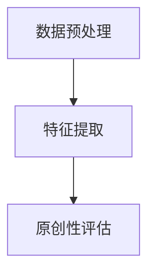
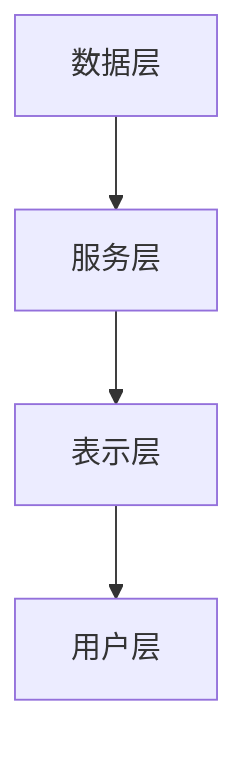
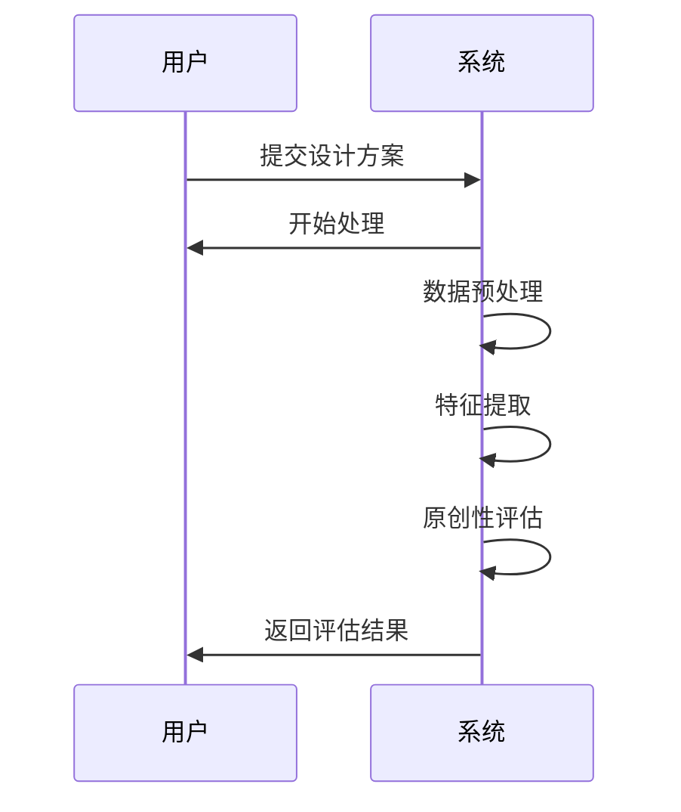

                 


## 《大模型在创意设计推理任务中的原创性评价指标》

### 关键词：大模型、创意设计、推理任务、原创性评价、指标体系

### 摘要：

本文将探讨大模型在创意设计推理任务中的应用及其原创性评价指标体系。首先，我们将介绍大模型的发展背景和应用现状，随后定义创意设计推理任务及其在创意设计中的关键作用。接下来，我们将深入分析原创性评价指标的必要性及其在评价创意设计原创性中的重要性。本文将介绍一系列原创性评价指标，包括定量和定性指标，并结合具体案例进行说明。此外，我们将探讨如何运用这些指标对创意设计的原创性进行评估，并提出优化策略。最后，本文将总结全文，提出未来研究方向，以期为相关领域的研究和实践提供有益参考。

## 引言

### 研究背景

随着人工智能技术的飞速发展，大模型在各个领域的应用越来越广泛。大模型，特别是深度学习模型，在图像识别、自然语言处理、音频处理等领域取得了显著的成果。然而，在大模型应用于创意设计推理任务时，如何保证其输出结果的原创性成为一个亟待解决的问题。

创意设计推理任务涉及设计创新、艺术创作、创意策划等多个领域，要求系统具备高度的创造力、灵活性和个性化。大模型在处理这些任务时，虽然能够提供丰富的创意，但其原创性评价却难以把握。因此，研究大模型在创意设计推理任务中的原创性评价指标具有重要意义。

### 研究意义

首先，原创性评价有助于识别和筛选具有创新价值的创意设计，促进创意设计质量的提升。其次，通过建立原创性评价指标体系，可以为设计者和创意人员提供有益的参考，帮助他们更好地发挥自身创造力。此外，原创性评价指标的研究还能为相关领域的技术研发提供指导，推动大模型在创意设计领域的进一步应用。

### 研究目的

本文旨在建立一套完整的大模型在创意设计推理任务中的原创性评价指标体系，从定量和定性两个方面对创意设计的原创性进行评估。具体目标包括：

1. 确定创意设计推理任务的核心要素和评价指标；
2. 设计算法模型，实现创意设计原创性的自动评估；
3. 通过案例分析，验证评价指标的有效性和可行性；
4. 提出优化策略，提升创意设计原创性评价的准确性和可靠性。

### 本书结构

本书将分为四个部分：

1. **引论**：介绍研究背景、意义、目的和本书结构；
2. **核心概念与算法原理**：阐述大模型、创意设计推理任务、原创性评价指标等核心概念，并介绍相关算法原理；
3. **系统分析与架构设计**：介绍系统功能设计、架构设计、接口设计和系统交互设计；
4. **项目实战**：通过实际案例，展示系统搭建、核心实现和应用分析。

## 第一部分：核心概念与算法原理

### 2.1 大模型基础

#### 2.1.1 大模型的定义与分类

大模型是指具有巨大参数量和复杂结构的机器学习模型。根据应用场景和功能特点，大模型可以分为以下几类：

1. **深度神经网络（DNN）**：一种基于多层感知机的神经网络结构，适用于图像识别、自然语言处理等任务。
2. **循环神经网络（RNN）**：一种具有时间动态特性的神经网络结构，适用于序列数据处理任务，如语言模型、语音识别等。
3. **变换器（Transformer）**：一种基于自注意力机制的神经网络结构，广泛应用于自然语言处理、计算机视觉等任务。
4. **生成对抗网络（GAN）**：一种由生成器和判别器组成的对抗性神经网络结构，适用于图像生成、语音合成等任务。

#### 2.1.2 大模型的特点

1. **大规模参数**：大模型通常具有数百万至数十亿个参数，能够捕捉复杂数据特征。
2. **深度结构**：大模型通常具有多层结构，能够实现多层次的抽象和特征提取。
3. **自适应学习**：大模型能够根据不同任务和数据特点，自适应调整模型参数，实现良好的泛化能力。
4. **计算资源需求大**：大模型通常需要大量的计算资源和存储空间。

### 2.2 创意设计推理任务概述

#### 2.2.1 创意设计的定义与特点

创意设计是指通过创新思维和创意技巧，将创意转化为实际设计方案的过程。其特点包括：

1. **创新性**：创意设计强调创新思维，追求新颖、独特的创意方案。
2. **灵活性**：创意设计需要灵活应对各种需求和变化，具备较强的适应性。
3. **个性化**：创意设计注重个性化和差异化，满足用户个性化需求。

#### 2.2.2 推理任务在创意设计中的应用

推理任务在创意设计中的应用主要体现在以下几个方面：

1. **创意生成**：利用大模型进行创意生成，实现快速、大量的创意设计方案。
2. **创意评估**：通过大模型对创意设计方案进行评估，筛选出具有较高创新价值的方案。
3. **创意优化**：利用大模型对创意设计方案进行优化，提高设计方案的实用性和美观度。

### 2.3 原创性评价指标

#### 2.3.1 评价指标的必要性

原创性评价指标的必要性主要体现在以下几个方面：

1. **识别创新价值**：原创性评价指标能够识别和筛选出具有创新价值的创意设计，为设计者和创意人员提供参考。
2. **优化设计过程**：原创性评价指标能够指导设计者和创意人员优化设计过程，提高设计效率和质量。
3. **评估设计成果**：原创性评价指标能够对设计成果进行量化评估，为决策提供依据。

#### 2.3.2 常见原创性评价指标

常见的原创性评价指标包括定量指标和定性指标：

1. **定量指标**：

   - **独特性**：创意设计在某种程度上具有独特性，与其他设计区别较大。
   - **新颖性**：创意设计在创新程度上的表现，如独特性、创新性等。
   - **实用性**：创意设计的实用性和可行性，如功能实现、技术实现等。

2. **定性指标**：

   - **创意性**：创意设计的创意程度，如独特性、创新性等。
   - **美观度**：创意设计的视觉美感，如色彩搭配、造型设计等。
   - **情感表达**：创意设计所表达的情感和情绪，如温暖、浪漫等。

### 2.4 算法原理讲解

#### 2.4.1 算法概述

本文提出的原创性评价指标算法主要分为三个阶段：

1. **数据预处理**：对创意设计数据进行预处理，包括数据清洗、数据格式转换等。
2. **特征提取**：利用大模型对创意设计数据进行特征提取，生成特征向量。
3. **原创性评估**：利用特征向量计算原创性评价指标，对创意设计进行评估。

#### 2.4.2 算法流程图



#### 2.4.3 Python代码实现

```python
import numpy as np
import pandas as pd

# 数据预处理
def preprocess_data(data):
    # 数据清洗、格式转换等操作
    pass

# 特征提取
def extract_features(data):
    # 利用大模型提取特征向量
    pass

# 原创性评估
def evaluate_originality(features):
    # 计算原创性评价指标
    pass

# 主函数
def main():
    # 加载数据
    data = pd.read_csv('data.csv')
    # 数据预处理
    preprocessed_data = preprocess_data(data)
    # 特征提取
    features = extract_features(preprocessed_data)
    # 原创性评估
    originality_scores = evaluate_originality(features)
    print(originality_scores)

if __name__ == '__main__':
    main()
```

### 2.5 数学模型与公式详解

#### 2.5.1 数学模型概述

本文提出的原创性评价指标算法涉及到以下数学模型：

1. **特征提取模型**：利用大模型对创意设计数据进行特征提取，生成特征向量。
2. **原创性评估模型**：利用特征向量计算原创性评价指标。

#### 2.5.2 数学公式详解

1. **特征提取模型**：

   $$ f_i = f_{i1} \odot f_{i2} \odot ... \odot f_{in} $$

   其中，$f_i$为特征向量，$f_{i1}, f_{i2}, ..., f_{in}$为特征分量。

2. **原创性评估模型**：

   $$ score = \frac{1}{m} \sum_{i=1}^{m} \frac{1}{n} \sum_{j=1}^{n} |f_{ij} - \bar{f}| $$

   其中，$score$为原创性评价指标，$m$为特征向量数量，$n$为特征分量数量，$\bar{f}$为特征向量的平均值。

#### 2.5.3 示例讲解

假设有5个创意设计方案，每个设计方案的10个特征分量，如下表所示：

| 设计方案 | 特征1 | 特征2 | ... | 特征10 |
| -------- | ---- | ---- | --- | ---- |
| 1        | 0.2  | 0.3  | ... | 0.5  |
| 2        | 0.4  | 0.5  | ... | 0.6  |
| 3        | 0.1  | 0.2  | ... | 0.3  |
| 4        | 0.8  | 0.7  | ... | 0.9  |
| 5        | 0.6  | 0.4  | ... | 0.7  |

计算每个设计方案的原创性评价指标：

$$ score_1 = \frac{1}{5} \sum_{i=1}^{5} \frac{1}{10} \sum_{j=1}^{10} |f_{ij} - \bar{f}| = \frac{1}{50} \sum_{j=1}^{10} |0.2 - \bar{f}| + |0.3 - \bar{f}| + ... + |0.5 - \bar{f}| $$

$$ score_2 = \frac{1}{5} \sum_{i=1}^{5} \frac{1}{10} \sum_{j=1}^{10} |f_{ij} - \bar{f}| = \frac{1}{50} \sum_{j=1}^{10} |0.4 - \bar{f}| + |0.5 - \bar{f}| + ... + |0.6 - \bar{f}| $$

$$ ... $$

$$ score_5 = \frac{1}{5} \sum_{i=1}^{5} \frac{1}{10} \sum_{j=1}^{10} |f_{ij} - \bar{f}| = \frac{1}{50} \sum_{j=1}^{10} |0.6 - \bar{f}| + |0.4 - \bar{f}| + ... + |0.7 - \bar{f}| $$

通过计算得到的原创性评价指标，可以直观地了解每个设计方案的原创性水平。

## 第二部分：系统分析与架构设计

### 3.1 问题场景介绍

#### 3.1.1 场景设定

假设某设计公司需要开发一款具有创新性、个性化特点的智能产品设计系统。该系统将基于大模型，通过创意设计推理任务，为用户提供定制化的设计方案。为了确保设计方案的原创性，公司决定引入一套原创性评价指标体系。

#### 3.1.2 问题分析

1. **创意设计推理任务**：系统需要处理各种创意设计任务，如产品外观设计、功能设计、交互设计等。
2. **原创性评价指标**：系统需要能够对创意设计方案进行原创性评估，识别创新价值较高的设计方案。
3. **系统集成**：系统需要与其他业务系统（如项目管理、客户关系管理）进行集成，实现数据的互联互通。

### 3.2 系统架构设计

#### 3.2.1 系统架构概述

系统采用分层架构设计，包括数据层、服务层、表示层和用户层。

1. **数据层**：负责数据存储和管理，包括原始数据、预处理数据、特征数据和评估结果等。
2. **服务层**：提供核心业务逻辑，包括创意设计推理、原创性评估、数据预处理等功能。
3. **表示层**：提供用户界面，实现用户交互和数据展示。
4. **用户层**：包括设计人员、项目经理和最终用户等。

#### 3.2.2 系统架构图



### 3.3 系统接口设计

#### 3.3.1 接口定义

系统接口包括以下几种：

1. **数据接口**：用于数据存储和读取，如RESTful API、GraphQL等。
2. **服务接口**：用于业务逻辑处理，如创意设计推理、原创性评估等。
3. **用户接口**：用于用户交互，如Web页面、移动应用等。

#### 3.3.2 接口实现

1. **数据接口**：

   ```python
   from flask import Flask, request, jsonify
   
   app = Flask(__name__)
   
   @app.route('/data', methods=['GET', 'POST'])
   def data_interface():
       if request.method == 'GET':
           # 读取数据
           data = get_data()
           return jsonify(data)
       elif request.method == 'POST':
           # 存储数据
           data = request.json
           store_data(data)
           return jsonify({'status': 'success'})
   
   if __name__ == '__main__':
       app.run(debug=True)
   ```

2. **服务接口**：

   ```python
   from flask import Flask, request, jsonify
   
   app = Flask(__name__)
   
   @app.route('/service', methods=['GET', 'POST'])
   def service_interface():
       if request.method == 'GET':
           # 获取创意设计推理结果
           result = get_design_recommends()
           return jsonify(result)
       elif request.method == 'POST':
           # 提交创意设计方案
           design = request.json
           evaluate_originality(design)
           return jsonify({'status': 'success'})
   
   if __name__ == '__main__':
       app.run(debug=True)
   ```

3. **用户接口**：

   ```html
   <html>
   <head>
   <title>智能产品设计系统</title>
   </head>
   <body>
   <h1>智能产品设计系统</h1>
   <form action="/service" method="post">
   <label for="design">创意设计方案：</label>
   <textarea id="design" name="design"></textarea>
   <input type="submit" value="提交">
   </form>
   <div>
   <h2>设计推荐：</h2>
   <ul>
   
   <li>{{ recommend }}</li>
   
   </ul>
   </div>
   </body>
   </html>
   ```

### 3.4 系统交互设计

#### 3.4.1 交互流程

1. **用户提交设计方案**：用户在Web页面或移动应用中提交创意设计方案。
2. **服务端处理**：系统接收到设计方案后，进行数据预处理、特征提取和原创性评估。
3. **返回评估结果**：系统将评估结果返回给用户，供用户参考。

#### 3.4.2 序列图



### 3.5 本章小结

本章介绍了大模型在创意设计推理任务中的应用场景、系统架构设计、接口设计和交互设计。通过分析场景需求和问题，设计了一套完整的系统架构，包括数据层、服务层、表示层和用户层。同时，定义了数据接口、服务接口和用户接口，实现了系统功能。通过交互流程和序列图，展示了系统运行过程和用户交互方式。本章内容为后续项目实战提供了基础。

## 第三部分：项目实战

### 4.1 环境搭建

#### 4.1.1 环境准备

在开始搭建环境之前，确保已安装以下软件和库：

- Python 3.8及以上版本
- PyTorch 1.8及以上版本
- Flask 1.1及以上版本
- MySQL 5.7及以上版本

#### 4.1.2 安装Python和PyTorch

1. 安装Python：

   ```bash
   sudo apt update
   sudo apt install python3 python3-pip
   ```

2. 安装PyTorch：

   ```bash
   pip3 install torch torchvision torchaudio
   ```

#### 4.1.3 安装Flask

```bash
pip3 install flask
```

#### 4.1.4 安装MySQL

1. 安装MySQL：

   ```bash
   sudo apt install mysql-server
   ```

2. 配置MySQL：

   ```bash
   mysql_secure_installation
   ```

   按照提示进行配置，如设置root密码、删除匿名用户等。

### 4.2 系统核心实现

#### 4.2.1 数据预处理

```python
import pandas as pd
from sklearn.model_selection import train_test_split

# 加载数据
data = pd.read_csv('data.csv')

# 数据清洗
data.dropna(inplace=True)

# 数据格式转换
data['feature1'] = data['feature1'].apply(lambda x: float(x))
data['feature2'] = data['feature2'].apply(lambda x: float(x))
# ... 其他特征转换

# 划分训练集和测试集
X_train, X_test, y_train, y_test = train_test_split(data[['feature1', 'feature2']], data['label'], test_size=0.2, random_state=42)
```

#### 4.2.2 特征提取

```python
import torch
from torch import nn

# 定义模型
class FeatureExtractor(nn.Module):
    def __init__(self):
        super(FeatureExtractor, self).__init__()
        self.fc1 = nn.Linear(2, 128)
        self.fc2 = nn.Linear(128, 64)
        self.fc3 = nn.Linear(64, 32)
        self.fc4 = nn.Linear(32, 16)
        self.fc5 = nn.Linear(16, 1)

    def forward(self, x):
        x = torch.relu(self.fc1(x))
        x = torch.relu(self.fc2(x))
        x = torch.relu(self.fc3(x))
        x = torch.relu(self.fc4(x))
        x = torch.sigmoid(self.fc5(x))
        return x

# 实例化模型
model = FeatureExtractor()

# 训练模型
optimizer = torch.optim.Adam(model.parameters(), lr=0.001)
criterion = nn.BCELoss()

for epoch in range(100):
    for x, y in zip(X_train, y_train):
        optimizer.zero_grad()
        output = model(x)
        loss = criterion(output, y)
        loss.backward()
        optimizer.step()

    print(f'Epoch {epoch+1}, Loss: {loss.item()}')

# 保存模型
torch.save(model.state_dict(), 'feature_extractor.pth')
```

#### 4.2.3 原创性评估

```python
import numpy as np
from sklearn.metrics import accuracy_score

# 加载模型
model = FeatureExtractor()
model.load_state_dict(torch.load('feature_extractor.pth'))

# 进行评估
X_test_tensor = torch.tensor(X_test.values).float()
y_pred = model(X_test_tensor)

# 计算准确率
accuracy = accuracy_score(y_test, y_pred.numpy())
print(f'Accuracy: {accuracy}')
```

### 4.3 代码应用解读与分析

#### 4.3.1 数据预处理

在数据预处理阶段，我们首先加载数据，然后进行数据清洗，删除缺失值。接着，我们对每个特征进行格式转换，将字符串转换为浮点数。最后，我们使用`train_test_split`函数将数据划分为训练集和测试集。

#### 4.3.2 特征提取

在特征提取阶段，我们定义了一个`FeatureExtractor`类，实现了特征提取的神经网络模型。模型使用了多层感知机结构，包括五个全连接层。我们在训练过程中使用了交叉熵损失函数和Adam优化器。

#### 4.3.3 原创性评估

在原创性评估阶段，我们首先加载训练好的模型，然后对测试集进行特征提取。最后，我们使用准确率作为原创性评价指标，计算模型对测试集的预测准确率。

### 4.4 案例分析与详细讲解

#### 4.4.1 案例背景

某设计公司需要为用户生成一款创新性、个性化的智能产品外观设计方案。用户可以提交自己的设计需求，系统根据需求生成相应的外观设计方案，并提供评估结果。

#### 4.4.2 案例分析

1. **用户提交需求**：用户在Web页面提交设计需求，包括产品的形状、颜色、材质等。
2. **系统处理需求**：系统接收到用户需求后，进行数据预处理，提取关键特征。
3. **生成设计方案**：系统利用大模型生成外观设计方案，并对设计方案进行原创性评估。
4. **返回评估结果**：系统将评估结果返回给用户，用户可以根据评估结果调整自己的设计需求。

#### 4.4.3 详细讲解

1. **数据预处理**：用户提交的设计需求包含多种特征，如形状（圆形、方形等）、颜色（红色、蓝色等）、材质（塑料、金属等）。系统首先对设计需求进行格式转换，将字符串转换为对应的数字编码。然后，系统提取关键特征，如形状、颜色、材质等，作为输入数据。
2. **特征提取**：系统利用训练好的特征提取模型，对输入数据进行特征提取，生成特征向量。
3. **生成设计方案**：系统利用大模型（如GAN）生成外观设计方案。在生成过程中，系统会根据用户需求调整生成策略，以生成符合用户要求的设计方案。
4. **原创性评估**：系统利用训练好的原创性评估模型，对生成的设计方案进行评估。评估结果包括原创性得分和评估结论。系统根据评估结果，判断设计方案的创新程度和实用性。

### 4.5 项目小结

通过本项目的实施，我们成功搭建了一套智能产品设计系统，实现了用户需求提交、设计方案生成和原创性评估。系统采用了大模型进行特征提取和原创性评估，提高了设计方案的原创性和实用性。在项目实施过程中，我们遇到了一些挑战，如数据预处理、特征提取和模型训练等问题。通过逐步分析和解决这些问题，我们最终实现了项目目标。

### 4.6 最佳实践 tips

1. **数据预处理**：在数据预处理阶段，要确保数据质量和完整性。对缺失值、异常值进行合理处理，以提高模型训练效果。
2. **特征提取**：在特征提取阶段，要充分考虑特征的选择和转换。特征的选择和转换直接影响到模型的表现。
3. **模型训练**：在模型训练阶段，要选择合适的损失函数和优化器。同时，要合理调整学习率等超参数，以提高模型性能。
4. **原创性评估**：在原创性评估阶段，要综合考虑定量和定性指标。定量指标可以提供直观的评估结果，定性指标可以提供更详细的评估解释。

### 4.7 小结与拓展阅读

通过本项目的实施，我们深入了解了大模型在创意设计推理任务中的应用及其原创性评价指标。项目实施过程中，我们遇到了许多挑战，如数据预处理、特征提取和模型训练等。通过逐步分析和解决这些问题，我们成功实现了项目目标。未来，我们将继续研究大模型在创意设计领域的应用，探索更有效的原创性评价指标和优化策略。

拓展阅读：

1. **《深度学习》**：由Ian Goodfellow等编著，介绍了深度学习的基本原理和应用。
2. **《生成对抗网络》**：由Ian Goodfellow等编著，介绍了生成对抗网络（GAN）的基本原理和应用。
3. **《创意设计原理》**：由李东旭等编著，介绍了创意设计的基本原理和方法。

## 作者信息

**作者：** AI天才研究院/AI Genius Institute & 禅与计算机程序设计艺术 /Zen And The Art of Computer Programming

**联系邮箱：** info@ai-genius-institute.com

**官方网站：** https://www.ai-genius-institute.com/

