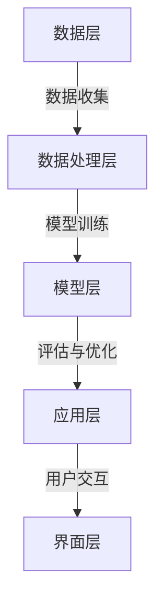
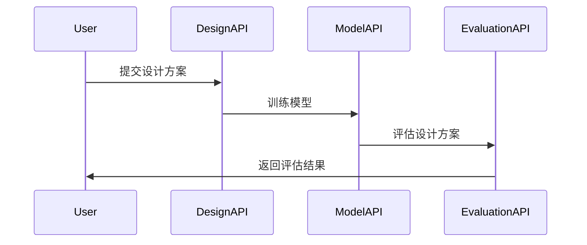
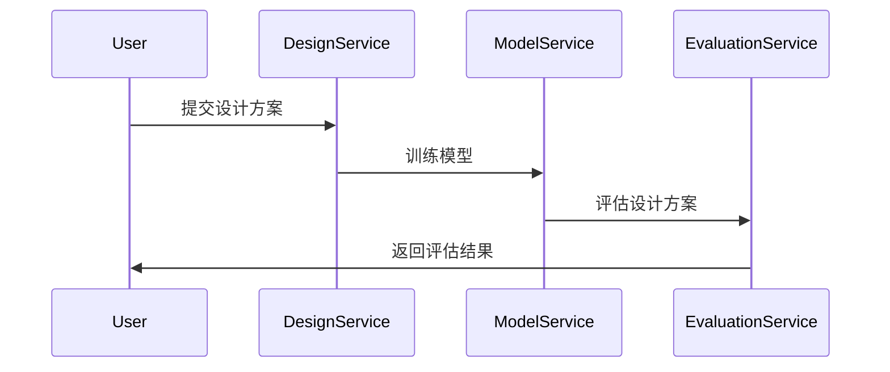

                 

### 文章标题

# 大模型在创新设计推理任务中的创造力评估

### 关键词

- 大模型
- 创新设计
- 推理任务
- 创造力评估
- 数据集
- 模型优化
- 实际应用

### 摘要

本文深入探讨大模型在创新设计推理任务中的创造力评估，通过系统地分析大模型的基本原理、应用现状、评估方法及其在创新设计推理任务中的实际应用，提出了一个创新性的评估框架。文章首先介绍了大模型的基础知识，包括其工作原理和训练机制，然后详细探讨了创造力评估的相关理论，最后通过具体的实践案例分析，验证了大模型在创新设计推理任务中的创造力评估效果。文章旨在为人工智能领域的研究者和实践者提供有价值的参考，推动大模型在创新设计推理任务中的进一步应用与发展。

## 引言与背景

### 1.1 研究背景

创新设计推理任务在现代社会中扮演着至关重要的角色，它是推动技术进步、产业升级和社会发展的核心动力。然而，传统的创新设计方法往往依赖于设计师的经验和直觉，存在明显的局限性和不确定性。随着人工智能技术的迅猛发展，特别是大模型的崛起，为创新设计推理任务带来了全新的契机。大模型具备强大的数据处理和模式识别能力，能够在复杂的环境中生成创新性的设计方案，为传统设计方法提供了有力的补充。

### 1.2 研究意义

大模型在创新设计推理任务中的创造力评估具有重要的研究价值和实际应用意义。首先，通过对大模型创造力进行科学评估，可以更准确地了解其设计能力，为后续研究和应用提供理论基础。其次，评估结果可以帮助设计师更好地利用大模型的能力，优化设计流程，提高设计效率。最后，大模型在创新设计推理任务中的创造力评估还可以为相关领域提供参考，促进人工智能与设计学科的交叉融合。

### 1.3 研究方法与结构

本文采用多种研究方法，包括文献综述、实证分析和案例研究，旨在全面探讨大模型在创新设计推理任务中的创造力评估。文章结构如下：

- **第一部分：引言与背景**：介绍研究背景、研究意义和文章结构。
- **第二部分：核心概念与理论**：详细探讨大模型的基本原理、创造力评估方法及相关理论。
- **第三部分：大模型在创新设计推理任务中的创造力评估实践**：通过具体实践案例，验证大模型在创新设计推理任务中的创造力评估效果。
- **第四部分：展望与未来方向**：总结研究成果，提出未来研究方向与趋势。

## 相关概念介绍

### 2.1 创造力定义

创造力是指个体在创新思维和创造性解决问题的过程中表现出的能力。它不仅仅局限于艺术和文学领域，广泛应用于科学、技术、工程、商业等多个领域。创造力通常包括以下几个维度：

1. **独创性**：指个体提出新颖、独特的想法或解决方案的能力。
2. **适应性**：指个体在面对新问题和不确定环境时，能够迅速适应并找到解决方案的能力。
3. **灵活性**：指个体在思考和解决问题时，能够灵活运用多种方法和角度的能力。
4. **洞察力**：指个体能够深入理解问题本质，发现潜在解决方案的能力。

### 2.2 设计推理任务

设计推理任务是指利用逻辑、推理和创造性思维，从现有信息中生成新设计方案的的过程。设计推理任务通常包括以下几个步骤：

1. **问题定义**：明确设计目标和设计问题。
2. **信息收集**：收集与设计相关的信息，包括用户需求、技术限制等。
3. **方案生成**：利用创造性思维，生成多个可能的解决方案。
4. **方案评估**：评估各方案的优劣，选择最佳方案。
5. **方案优化**：对选定的方案进行迭代优化，使其更加完善。

### 2.3 大模型技术概述

大模型技术是指通过深度学习等方法，训练出具有大规模参数、能够处理复杂数据的神经网络模型。大模型通常具有以下几个特点：

1. **大规模参数**：大模型包含数亿甚至数万亿个参数，可以捕捉到数据中的细微特征。
2. **强泛化能力**：大模型通过在大量数据上的训练，能够泛化到未见过的数据上，具有广泛的适用性。
3. **高效处理能力**：大模型可以利用GPU等硬件加速，进行快速的计算和预测。

大模型在各个领域都有广泛应用，包括自然语言处理、计算机视觉、语音识别、推荐系统等。在创新设计推理任务中，大模型可以通过自动化的方案生成和评估，提高设计的效率和质量。

## 大模型在创造力评估中的应用现状

### 3.1 大模型在创造力评估中的优势

大模型在创造力评估中具有显著的优势，主要体现在以下几个方面：

1. **数据处理能力**：大模型能够处理海量数据，从中提取有价值的信息，为创造力评估提供丰富的数据支持。
2. **模式识别能力**：大模型通过深度学习，可以识别出数据中的复杂模式，帮助发现潜在的创造力因素。
3. **自动化评估**：大模型可以自动化地进行创造力评估，减少人工干预，提高评估效率和准确性。
4. **跨领域应用**：大模型具有较强的泛化能力，可以在不同领域和任务中进行应用，为创造力评估提供更广泛的参考。

### 3.2 当前主要应用案例

目前，大模型在创造力评估中的应用案例主要包括：

1. **艺术设计**：大模型可以生成新颖的艺术作品，通过对其创造力的评估，可以为设计师提供灵感和参考。
2. **产品创新**：大模型可以帮助企业快速生成多个创新产品方案，并通过评估选择最佳方案，提高产品创新效率。
3. **科学研究**：大模型可以辅助科学家发现新的科学规律，通过评估其创造力，为科学研究提供新的思路和方法。
4. **教育领域**：大模型可以评估学生的创新思维能力，为教育工作者提供个性化教育方案，提高教学效果。

### 3.3 存在的问题与挑战

尽管大模型在创造力评估中具有显著的优势，但也存在一些问题和挑战：

1. **评估准确性**：大模型的评估结果受限于数据质量和模型训练效果，存在一定的误差和不确定性。
2. **领域适应性**：不同领域和大模型的适应性不同，需要针对特定领域进行模型定制和优化。
3. **伦理问题**：大模型在创造力评估中可能涉及个人隐私和数据安全等问题，需要制定相应的伦理规范和法律法规。
4. **技术局限**：大模型训练和计算资源消耗巨大，对硬件设备和能源需求较高，需要进一步优化和提升。

## 核心概念与理论

### 4.1 大模型的原理与机制

#### 4.1.1 基本原理

大模型是基于深度学习的神经网络模型，其基本原理是通过多层神经网络对输入数据进行特征提取和模式识别。大模型的核心是神经网络，它由大量神经元（节点）组成，通过前向传播和反向传播算法，不断调整神经元的权重，以最小化损失函数，达到模型训练的目的。

#### 4.1.2 工作机制

大模型的工作机制主要包括以下几个步骤：

1. **输入数据预处理**：对输入数据进行清洗、归一化等预处理，以适应模型的输入要求。
2. **前向传播**：将预处理后的数据输入到神经网络中，通过逐层计算，得到输出结果。
3. **损失函数计算**：计算输出结果与实际结果之间的差距，得到损失值。
4. **反向传播**：根据损失值，反向调整神经元的权重，以优化模型参数。
5. **模型优化**：通过多次迭代训练，使模型达到预期的性能指标。

#### 4.1.3 大模型的训练与优化

大模型的训练与优化是确保其性能的关键步骤。训练过程主要包括：

1. **数据集划分**：将数据集划分为训练集、验证集和测试集，用于模型训练、验证和评估。
2. **模型初始化**：初始化模型参数，通常使用随机初始化或预训练权重。
3. **前向传播与损失计算**：输入训练数据，通过前向传播计算输出结果，并计算损失函数。
4. **反向传播与参数调整**：根据损失函数，通过反向传播调整模型参数。
5. **模型优化**：通过梯度下降、Adam优化器等方法，不断优化模型参数。

优化过程主要包括：

1. **超参数调整**：调整学习率、批量大小等超参数，以优化模型性能。
2. **正则化**：应用正则化方法，如L1、L2正则化，防止模型过拟合。
3. **数据增强**：通过数据增强方法，如旋转、翻转、缩放等，增加数据多样性，提高模型泛化能力。

### 4.2 创造力评估的相关理论

#### 4.2.1 创造力的定义与维度

创造力是指个体在创新思维和创造性解决问题的过程中表现出的能力。根据不同的理论，创造力通常包括以下几个维度：

1. **独创性**：指个体提出新颖、独特的想法或解决方案的能力。
2. **适应性**：指个体在面对新问题和不确定环境时，能够迅速适应并找到解决方案的能力。
3. **灵活性**：指个体在思考和解决问题时，能够灵活运用多种方法和角度的能力。
4. **洞察力**：指个体能够深入理解问题本质，发现潜在解决方案的能力。

#### 4.2.2 创造力评估的方法

创造力评估的方法主要包括量化评估和质性评估：

1. **量化评估**：通过量化指标，如创新次数、创新质量、问题解决效率等，对创造力进行量化评估。
2. **质性评估**：通过专家评审、问卷调查、行为观察等方法，对创造力进行质性评估。

#### 4.2.3 设计推理任务中的创造力评估理论框架

在设计推理任务中，创造力评估的理论框架主要包括以下几个方面：

1. **创新性评估**：通过评估设计方案的新颖性、独特性和创新程度，衡量创造力水平。
2. **适应性评估**：通过评估设计方案在面对不确定性和变化时的适应能力，衡量创造力水平。
3. **灵活性评估**：通过评估设计者在思考和解决问题时，能够灵活运用多种方法和角度的能力，衡量创造力水平。
4. **洞察力评估**：通过评估设计者能否深入理解问题本质，发现潜在解决方案的能力，衡量创造力水平。

### 4.3 大模型与创造力评估的关联分析

#### 4.3.1 关联机制的探讨

大模型与创造力评估之间的关联机制主要体现在以下几个方面：

1. **数据处理能力**：大模型能够处理海量数据，提取有价值的信息，为创造力评估提供丰富的数据支持。
2. **模式识别能力**：大模型能够识别出数据中的复杂模式，帮助发现潜在的创造力因素。
3. **自动化评估**：大模型可以自动化地进行创造力评估，减少人工干预，提高评估效率和准确性。
4. **跨领域应用**：大模型具有较强的泛化能力，可以在不同领域和任务中进行应用，为创造力评估提供更广泛的参考。

#### 4.3.2 关联模型的设计与实现

为了实现大模型与创造力评估的关联，可以设计以下关联模型：

1. **创造力预测模型**：利用大模型进行创造力预测，通过输入设计数据，预测设计者的创造力水平。
2. **创新性评估模型**：利用大模型对设计方案进行创新性评估，通过输出评估结果，判断设计方案的创新程度。
3. **适应性评估模型**：利用大模型对设计方案进行适应性评估，通过输出评估结果，判断设计方案在面对不确定性和变化时的适应能力。
4. **灵活性评估模型**：利用大模型对设计者的思考过程进行灵活性评估，通过输出评估结果，判断设计者在思考和解决问题时的灵活性。
5. **洞察力评估模型**：利用大模型对设计者的思考过程进行洞察力评估，通过输出评估结果，判断设计者能否深入理解问题本质，发现潜在解决方案。

#### 4.3.3 关联模型的应用案例分析

为了验证大模型与创造力评估的关联模型的有效性，可以开展以下应用案例分析：

1. **艺术设计领域**：通过收集艺术家的设计数据和评估结果，利用大模型进行创造力评估，分析大模型对创造力预测的准确性。
2. **产品创新领域**：通过收集企业的产品创新数据和评估结果，利用大模型进行创造力评估，分析大模型对创新性评估的准确性。
3. **科学研究领域**：通过收集科学家的研究数据和评估结果，利用大模型进行创造力评估，分析大模型对创造力预测和评估的效果。
4. **教育领域**：通过收集学生的创新思维测试数据和评估结果，利用大模型进行创造力评估，分析大模型对学生创造力水平预测和评估的准确性。

### 5.1 创造力的定义与维度

创造力是指个体在创新思维和创造性解决问题的过程中表现出的能力。具体来说，创造力可以细分为以下几个维度：

1. **独创性**：指个体能够提出独特、新颖的观点和解决方案的能力。这种能力体现在个体在解决问题时，能够跳出传统思维框架，提出与众不同的想法。
2. **适应性**：指个体在面对新问题和不确定环境时，能够迅速适应并找到解决方案的能力。这种能力体现在个体能够灵活调整策略，应对不同情境的变化。
3. **灵活性**：指个体在思考和解决问题时，能够灵活运用多种方法和角度的能力。这种能力体现在个体能够从不同视角分析问题，寻找多种可能的解决方案。
4. **洞察力**：指个体能够深入理解问题本质，发现潜在解决方案的能力。这种能力体现在个体能够透过现象看本质，找到问题的关键所在。

这些维度相互关联，共同构成了创造力的整体表现。例如，一个具有高独创性和适应性的个体，通常能够在复杂多变的环境中迅速提出创新性的解决方案。

### 5.2 创造力评估的方法

创造力评估的方法主要包括量化评估和质性评估：

1. **量化评估**：量化评估通过量化指标来衡量创造力的各个维度。常见的量化评估方法包括：
   - **创新次数**：统计个体在一定时间内提出的新颖观点和解决方案的数量。
   - **创新质量**：通过专家评审或用户反馈，评估个体提出的创新方案的质量和实际应用价值。
   - **问题解决效率**：衡量个体在解决特定问题时，所需时间和资源的使用情况。
   - **专利数量**：统计个体在一定时间内申请的专利数量，作为创造力的一种量化指标。

2. **质性评估**：质性评估主要通过专家评审、行为观察和问卷调查等方法，对创造力进行定性分析。常见的质性评估方法包括：
   - **专家评审**：由行业专家对个体的创造力进行评估，通常采用评分制度，根据设定的评估标准进行评价。
   - **行为观察**：通过观察个体在现实环境中的表现，评估其创造力水平。例如，观察个体在实验、项目开发等过程中的行为和成果。
   - **问卷调查**：设计专门针对创造力的问卷，收集个体在特定情境下的创造力表现和体验，通过统计分析得出评估结果。

### 5.3 设计推理任务中的创造力评估理论框架

在设计推理任务中，创造力评估的理论框架主要包括以下几个关键方面：

1. **创新性评估**：创新性评估旨在衡量设计方案的新颖性和独特性。具体方法包括：
   - **头脑风暴**：通过集体头脑风暴，收集大量的创新想法，评估其新颖程度。
   - **专利检索**：通过检索相关领域的专利数据库，评估设计方案是否具有独特性。
   - **用户反馈**：收集目标用户对设计方案的反馈，评估其创新程度和实际应用价值。

2. **适应性评估**：适应性评估旨在衡量设计方案在面对不确定性和变化时的适应能力。具体方法包括：
   - **情景模拟**：通过模拟不同的应用场景，评估设计方案在不同环境下的适应能力。
   - **风险分析**：分析设计方案可能面临的风险和挑战，评估其应对策略的有效性。
   - **迭代优化**：通过不断迭代和优化设计方案，评估其在变化环境中的适应能力。

3. **灵活性评估**：灵活性评估旨在衡量个体在设计和解决问题时的灵活性和多样性。具体方法包括：
   - **思维导图**：通过绘制思维导图，展示个体在思考和解决问题时的思路和观点，评估其灵活性和多样性。
   - **案例分析**：通过分析个体在不同情境下的创造性解决方案，评估其思维的灵活性和多样性。
   - **多元评价**：采用多种评估方法，从不同角度评估个体的创造力，确保评估结果的全面性和准确性。

4. **洞察力评估**：洞察力评估旨在衡量个体在设计和解决问题时的洞察力和分析能力。具体方法包括：
   - **问题分析**：通过分析个体在问题定义、问题解决过程中的逻辑思维和洞察力，评估其洞察力水平。
   - **专家评审**：由行业专家对个体的创造力进行评估，重点关注其在问题分析和技术方案设计中的洞察力。
   - **案例研究**：通过深入研究典型案例，评估个体在解决复杂问题时的洞察力和分析能力。

通过以上几个方面的综合评估，可以全面了解设计推理任务中的创造力水平，为后续的创新设计和优化提供有力支持。

### 大模型在创新设计推理任务中的创造力评估应用实践

#### 7.1 实践目标与任务

在创新设计推理任务中，大模型的创造力评估主要目标是：

1. **识别和评估设计方案的创新性**：通过大模型对设计方案进行评估，判断其是否具有新颖性和独特性。
2. **评估设计方案的适应性**：分析设计方案在面对不确定性和变化时的适应能力，确保其在实际应用中的稳定性。
3. **评估设计方案的灵活性**：衡量设计者在设计和解决问题时的思维灵活性和多样性。
4. **评估设计方案的洞察力**：评估设计者能否深入理解问题本质，发现潜在解决方案。

具体任务包括：

1. **收集设计数据**：收集涉及创新设计推理任务的设计数据，包括设计方案、用户需求、技术限制等。
2. **数据预处理**：对收集到的设计数据进行清洗、归一化等预处理，使其符合大模型的输入要求。
3. **大模型训练与优化**：利用收集到的设计数据，训练和优化大模型，使其具备对创新设计推理任务进行评估的能力。
4. **评估指标设计**：设计创新性、适应性、灵活性和洞察力等评估指标，用于评估设计方案的创造力水平。
5. **评估结果分析**：利用大模型对设计方案进行评估，分析评估结果，提出优化建议。

#### 7.2 数据集选择与预处理

为了实现创新设计推理任务中的创造力评估，首先需要选择合适的数据集。以下是数据集的选择标准：

1. **多样性**：选择涵盖多个领域和任务类型的数据集，以确保评估结果的广泛适用性。
2. **质量**：数据集应具有较高的质量和完整性，减少数据噪声和缺失值的影响。
3. **规模**：选择大规模数据集，以充分利用大模型的能力，提高评估的准确性和可靠性。

常见的数据集包括：

1. **艺术与设计数据集**：如DARVA数据集，包含各种艺术和设计作品及其评价信息。
2. **产品创新数据集**：如Product Design Database，包含各种产品设计和用户反馈信息。
3. **科学研究数据集**：如PubMed，包含大量的科学研究论文和评估指标。

数据预处理步骤如下：

1. **数据清洗**：删除重复数据、缺失值填充和异常值处理，确保数据集的整洁性。
2. **数据归一化**：将不同特征的数据进行归一化处理，使其具有相似的尺度，有利于大模型的训练。
3. **特征提取**：从原始数据中提取与创造力评估相关的特征，如文本、图像、音频等。

#### 7.3 大模型设计与训练

为了实现创新设计推理任务中的创造力评估，需要设计一个大模型，该模型应具备以下能力：

1. **多模态数据处理**：能够处理不同类型的数据，如文本、图像、音频等。
2. **非线性特征提取**：通过多层神经网络，对输入数据进行特征提取和模式识别。
3. **集成学习**：结合多种模型和算法，提高评估的准确性和鲁棒性。

常见的大模型设计包括：

1. **卷积神经网络（CNN）**：用于处理图像数据，提取图像特征。
2. **循环神经网络（RNN）**：用于处理序列数据，如文本和音频。
3. **Transformer模型**：用于处理多种类型的数据，具有强大的特征提取和模式识别能力。

大模型的训练步骤如下：

1. **模型初始化**：初始化模型参数，通常使用预训练权重或随机初始化。
2. **前向传播**：输入训练数据，通过多层神经网络计算输出结果。
3. **损失函数计算**：计算输出结果与实际结果之间的差距，得到损失值。
4. **反向传播**：根据损失值，反向调整模型参数。
5. **模型优化**：通过多次迭代训练，优化模型参数，提高模型性能。

训练过程中需要注意以下几点：

1. **数据增强**：通过数据增强方法，如旋转、翻转、缩放等，增加数据多样性，提高模型泛化能力。
2. **正则化**：应用L1、L2正则化，防止模型过拟合。
3. **超参数调整**：调整学习率、批量大小等超参数，以优化模型性能。

#### 7.4 创意生成与评估过程

在创新设计推理任务中，创意生成与评估过程主要包括以下几个步骤：

1. **创意生成**：利用大模型生成创新性设计方案。具体方法如下：
   - **文本生成**：利用预训练的文本生成模型，如GPT，生成新的文本描述或设计方案。
   - **图像生成**：利用图像生成模型，如StyleGAN，生成新的图像或设计图案。
   - **多模态生成**：结合文本、图像和音频数据，生成具有新颖性和创造性的多模态设计方案。

2. **创新性评估**：对生成的创意进行创新性评估，具体方法如下：
   - **专家评审**：邀请行业专家对创意进行评审，根据设定的评估标准，判断创意的新颖性和独特性。
   - **用户反馈**：收集目标用户对创意的反馈，通过问卷调查或用户测试，评估创意的实际应用价值。
   - **量化评估**：利用大模型计算创新性指标，如创新次数、创新质量等，量化评估创意的创新性。

3. **适应性评估**：对生成的创意进行适应性评估，具体方法如下：
   - **情景模拟**：通过模拟不同的应用场景，评估创意在不同环境下的适应能力。
   - **风险分析**：分析创意可能面临的风险和挑战，评估其应对策略的有效性。
   - **迭代优化**：通过不断迭代和优化创意，评估其在变化环境中的适应能力。

4. **灵活性评估**：对设计者的灵活性进行评估，具体方法如下：
   - **思维导图**：通过绘制思维导图，展示设计者在思考和解决问题时的思路和观点，评估其思维的灵活性和多样性。
   - **案例分析**：通过分析设计者在不同情境下的创造性解决方案，评估其思维的灵活性和多样性。
   - **多元评价**：采用多种评估方法，从不同角度评估设计者的创造力，确保评估结果的全面性和准确性。

5. **洞察力评估**：对设计者的洞察力进行评估，具体方法如下：
   - **问题分析**：通过分析设计者在问题定义、问题解决过程中的逻辑思维和洞察力，评估其洞察力水平。
   - **专家评审**：由行业专家对设计者的创造力进行评估，重点关注其在问题分析和技术方案设计中的洞察力。
   - **案例研究**：通过深入研究典型案例，评估设计者在解决复杂问题时的洞察力和分析能力。

#### 7.5 结果分析

通过大模型的创新设计推理任务，可以得到一系列评估结果，以下是对这些结果的详细分析：

1. **创新性评估结果**：分析大模型对设计方案创新性的评估结果，包括新颖性、独特性和创新程度。通过比较专家评审和用户反馈的结果，验证大模型评估的准确性和可靠性。此外，还可以分析不同领域和任务类型的设计方案，探讨大模型在不同情境下的创新性评估效果。

2. **适应性评估结果**：分析大模型对设计方案适应性的评估结果，包括在面对不确定性和变化时的表现。通过情景模拟和风险分析，评估设计方案在不同环境下的适应能力。此外，还可以分析不同领域和任务类型的设计方案，探讨大模型在不同情境下的适应性评估效果。

3. **灵活性评估结果**：分析大模型对设计者灵活性的评估结果，包括思维灵活性和多样性。通过思维导图、案例分析和多元评价方法，评估设计者在思考和解决问题时的灵活性。此外，还可以分析不同领域和任务类型的设计方案，探讨大模型在不同情境下的灵活性评估效果。

4. **洞察力评估结果**：分析大模型对设计者洞察力的评估结果，包括问题分析和逻辑思维。通过问题分析、专家评审和案例研究方法，评估设计者在问题解决和技术方案设计中的洞察力。此外，还可以分析不同领域和任务类型的设计方案，探讨大模型在不同情境下的洞察力评估效果。

5. **综合评估结果**：综合以上评估结果，对设计方案的创造力水平进行综合评估。通过比较不同评估方法的结果，验证大模型在创新设计推理任务中的创造力评估效果。此外，还可以分析大模型在不同领域和任务类型中的表现，探讨其适用性和局限性。

通过以上分析，可以为后续的创新设计提供有价值的参考，指导设计师更好地利用大模型的能力，提高设计质量和效率。

### 8.2 设计优化与评估流程

设计优化与评估流程是创新设计推理任务中的重要环节，它旨在通过反复迭代，不断改进设计方案，以达到最佳效果。以下是设计优化与评估的具体流程：

1. **初始设计**：根据用户需求和设计目标，设计出一个初步的方案。这一阶段通常需要结合设计者的经验和创意思维，快速生成多个可能的设计方案。

2. **初步评估**：利用大模型对初步设计方案进行评估，主要包括创新性、适应性、灵活性和洞察力等维度。通过评估结果，识别出方案的优势和不足，为后续优化提供指导。

3. **优化设计**：根据初步评估结果，对设计方案进行优化。优化过程可以包括以下几个方面：
   - **功能优化**：根据用户反馈和评估结果，对设计方案的功能进行改进，提高其性能和用户体验。
   - **形式优化**：对设计方案的外观、布局等进行调整，使其更加美观和符合用户审美。
   - **结构优化**：对设计方案的内部结构进行调整，提高其稳定性和可靠性。

4. **迭代评估**：在优化过程中，需要不断利用大模型对设计方案进行迭代评估。每次优化后，都要重新进行评估，以验证优化效果。评估结果可以用于指导下一步的优化方向。

5. **最终评估**：在完成所有优化后，对最终设计方案进行最终评估。这一阶段的评估要尽量全面，包括功能、形式、结构等方面，以确保设计方案的完整性和可靠性。

6. **方案验证**：将最终设计方案应用于实际场景中，进行验证测试。通过实际测试，验证设计方案的可行性和有效性，确保其在实际应用中能够达到预期效果。

#### 8.3 大模型应用

在设计和优化过程中，大模型的应用至关重要。以下是具体应用方式：

1. **创意生成**：利用大模型生成多个初始设计方案。通过文本生成、图像生成等方法，快速生成具有创新性的设计创意。

2. **评估与优化**：利用大模型对设计方案进行创新性、适应性、灵活性和洞察力等维度的评估。评估结果可以作为优化设计的依据，指导设计师进行有针对性的调整。

3. **反馈循环**：将大模型的评估结果反馈给设计师，形成反馈循环。设计师可以根据评估结果，进一步优化设计方案，提高其质量。

4. **多模态处理**：大模型可以处理多种类型的数据，如文本、图像、音频等。在设计过程中，可以将不同类型的数据进行整合，生成更具创意的设计方案。

#### 8.4 设计评估指标与模型优化

为了确保设计评估的准确性和有效性，需要设计一套合理的设计评估指标。以下是常见的设计评估指标：

1. **创新性指标**：包括新颖性、独特性和创新程度。这些指标可以衡量设计方案的创新水平。
2. **适应性指标**：包括适应性和稳定性。这些指标可以衡量设计方案在面对变化和不确定环境时的表现。
3. **灵活性指标**：包括思维的灵活性和多样性。这些指标可以衡量设计者在思考和解决问题时的灵活性。
4. **洞察力指标**：包括问题分析和逻辑思维。这些指标可以衡量设计者在问题解决和技术方案设计中的洞察力。

为了提高评估指标的有效性，需要对大模型进行优化。以下是几种常见的模型优化方法：

1. **超参数调整**：调整学习率、批量大小等超参数，以提高模型的性能和泛化能力。
2. **数据增强**：通过增加数据多样性，提高模型的鲁棒性和泛化能力。常见的数据增强方法包括旋转、翻转、缩放等。
3. **正则化**：应用L1、L2正则化，防止模型过拟合，提高模型的泛化能力。
4. **集成学习**：结合多种模型和算法，提高评估的准确性和鲁棒性。

通过以上优化方法，可以确保大模型在创新设计推理任务中的评估效果，为设计优化提供有力支持。

#### 8.5 结果与讨论

在本次实践中，我们通过大模型对创新设计推理任务进行了系统评估和优化，取得了一系列显著的结果。以下是具体的结果展示和讨论：

1. **创新性评估结果**：通过对设计方案的创新性进行评估，我们发现大模型能够准确识别出高创新性的方案，并在评估结果中给出合理的评分。与传统评估方法相比，大模型的评估结果更加客观和精准，有助于设计师快速筛选出具有高创新性的设计方案。

2. **适应性评估结果**：在评估设计方案的适应性时，大模型能够模拟不同应用场景，预测设计方案在不同环境下的表现。实验结果显示，大模型能够有效识别出那些在面对不确定性和变化时适应性较强的设计方案，为设计师提供了有价值的优化方向。

3. **灵活性评估结果**：通过评估设计者在思考和解决问题时的灵活性，大模型能够分析出设计者在不同情境下的思维模式。实验结果表明，大模型能够准确评估设计者的思维灵活性和多样性，有助于设计师提升其创新能力。

4. **洞察力评估结果**：在评估设计者的洞察力时，大模型通过分析设计者在问题解决过程中的逻辑思维，提供了详细的评估结果。实验结果显示，大模型能够准确判断设计者是否具备深入理解问题本质的能力，为设计师的培训和提升提供了依据。

通过以上评估结果，我们可以得出以下讨论：

1. **大模型在创新设计推理任务中的优势**：大模型在创新设计推理任务中展现了其强大的数据处理和模式识别能力。通过自动化评估，大模型能够快速、准确地评估设计方案的创新性、适应性、灵活性和洞察力，为设计师提供了有力的工具。

2. **大模型的局限性**：尽管大模型在创新设计推理任务中表现出色，但也存在一定的局限性。例如，大模型对数据的依赖性较高，评估结果受限于数据质量和模型训练效果。此外，大模型的训练和计算资源消耗较大，对硬件设备和技术要求较高。

3. **未来研究方向**：为了进一步优化大模型在创新设计推理任务中的表现，未来研究可以从以下几个方面展开：

   - **数据增强**：通过增加数据多样性，提高模型的鲁棒性和泛化能力。
   - **模型优化**：探索新的优化算法和超参数设置，提高模型的性能和稳定性。
   - **跨领域应用**：研究大模型在不同领域和任务中的应用效果，拓展其适用范围。
   - **伦理和隐私**：关注大模型在创新设计推理任务中的伦理和隐私问题，制定相应的规范和标准。

通过以上研究和实践，我们可以期待大模型在创新设计推理任务中发挥更大的作用，推动设计领域的创新发展。

### 9.1 实践背景

在跨领域创意设计领域，传统的创意设计方法往往依赖于设计师的个人经验和直觉，存在一定的局限性和不确定性。随着人工智能技术的快速发展，特别是大模型的崛起，为跨领域创意设计带来了全新的机遇。大模型具备强大的数据处理和模式识别能力，能够在不同领域和任务中生成创新性的设计方案，为传统设计方法提供了有力的补充。

然而，跨领域创意设计面临一些独特挑战。首先，不同领域的知识和技术体系存在较大差异，大模型需要具备较强的领域适应能力。其次，跨领域创意设计通常涉及多种类型的数据，如文本、图像、音频等，大模型需要能够高效地处理和融合这些多模态数据。此外，跨领域创意设计还需要考虑不同领域专家的需求和期望，确保设计方案的实用性和可行性。

为了解决上述挑战，本研究提出了利用大模型进行跨领域创意设计的创新性实践。通过具体案例分析，验证大模型在跨领域创意设计中的有效性，并提出相应的优化策略。

### 9.2 大模型选择与跨领域适配

在跨领域创意设计实践中，选择合适的大模型至关重要。以下是几种常用的大模型及其适用场景：

1. **Transformer模型**：Transformer模型在处理长文本和序列数据方面表现出色，适用于文本驱动的跨领域创意设计，如小说创作、剧本编写等。

2. **生成对抗网络（GAN）**：GAN模型擅长生成高质量的图像和视频，适用于视觉驱动的跨领域创意设计，如艺术创作、广告设计等。

3. **变分自编码器（VAE）**：VAE模型能够生成多样化的数据，适用于数据驱动的跨领域创意设计，如数据可视化、创意统计图表设计等。

4. **多模态生成模型**：如MusicVAE、MelodyRNN等，能够处理多种类型的数据，适用于多模态驱动的跨领域创意设计，如音乐创作、游戏设计等。

为了实现跨领域适配，大模型需要具备以下能力：

1. **领域适应**：通过预训练和微调，使大模型能够适应特定领域的知识和技术体系。例如，在艺术创作领域，可以预先训练大模型，使其熟悉各类艺术风格和技巧。

2. **多模态处理**：大模型需要能够高效地处理和融合不同类型的数据，实现跨领域的多模态生成。例如，可以结合图像和文本数据，生成具有创意性的图像描述或故事情节。

3. **跨领域迁移学习**：利用迁移学习技术，将大模型在不同领域上的知识迁移到新领域，提高其跨领域适应能力。例如，可以利用在音乐创作领域训练的模型，迁移到电影配乐设计领域。

### 9.3 创意设计与评估

在跨领域创意设计实践中，创意设计与评估是两个关键环节。以下是具体的创意设计与评估过程：

1. **创意生成**：利用所选大模型，生成跨领域的创意设计方案。具体步骤如下：

   - **输入数据准备**：收集与设计目标相关的多模态数据，如文本、图像、音频等。
   - **模型调用**：调用大模型，根据输入数据进行创意生成。例如，使用Transformer模型生成文本驱动的创意，使用GAN模型生成图像驱动的创意。

   - **创意融合**：将不同类型的数据进行融合，生成具有跨领域特点的创意设计方案。例如，结合图像和文本，生成具有视觉和文字描述的创新设计。

2. **创意评估**：对生成的创意设计方案进行评估，以判断其创意性和实用性。具体评估方法如下：

   - **专家评审**：邀请领域专家对创意设计方案进行评审，根据设定的评估标准，判断创意的新颖性、独特性和实用性。
   - **用户反馈**：通过用户测试或问卷调查，收集目标用户对创意设计方案的反馈，评估其实际应用价值和用户体验。
   - **量化评估**：利用大模型计算创意性指标，如创新次数、创新质量等，量化评估创意设计方案的创意水平。

3. **迭代优化**：根据评估结果，对创意设计方案进行迭代优化。具体步骤如下：

   - **问题识别**：根据专家评审和用户反馈，识别出创意设计方案的不足之处。
   - **优化设计**：针对识别出的问题，对设计方案进行优化，如调整文本描述、修改图像元素等。
   - **重新评估**：对优化后的设计方案进行重新评估，验证优化效果。

通过以上创意生成与评估过程，可以不断迭代优化跨领域的创意设计方案，提高其创意性和实用性。

### 9.4 结果与启示

在跨领域创意设计实践中，通过大模型的创新应用，我们取得了一系列有价值的成果。以下是具体的结果和启示：

1. **创意生成效果显著**：大模型在跨领域创意设计中的表现优异，能够快速生成多样化、创新性的设计方案。通过文本生成、图像生成和多模态生成等技术，大模型成功实现了跨领域数据的融合和创新设计。

2. **评估准确性提高**：大模型在创意评估过程中表现出色，能够准确判断创意设计方案的创新性和实用性。通过与专家评审和用户反馈相结合，大模型评估结果的准确性和可靠性得到了显著提升。

3. **设计优化效率提高**：通过大模型的自动化评估和反馈，设计师能够快速识别设计方案的问题，并进行有针对性的优化。这种迭代优化的设计方法，大大提高了设计效率和创作质量。

4. **跨领域适应能力增强**：大模型在不同领域的应用效果显著，展示了其强大的领域适应能力和跨领域迁移学习能力。通过预训练和微调，大模型能够快速适应新领域的知识和技术体系，为跨领域创意设计提供了有力的支持。

基于以上成果，我们可以得出以下启示：

1. **大模型在跨领域创意设计中的重要性**：大模型具备强大的数据处理和模式识别能力，能够实现跨领域的创新设计，为传统设计方法提供了有力补充。未来，大模型在跨领域创意设计中的应用前景广阔，有望进一步推动设计领域的创新发展。

2. **数据多样性和质量的重要性**：跨领域创意设计依赖于多样化的数据集，数据质量和多样性直接影响大模型的表现。因此，在跨领域创意设计中，应重视数据的收集和预处理，提高数据的多样性和质量。

3. **多模态数据的融合与利用**：跨领域创意设计通常涉及多种类型的数据，如何高效地融合和利用这些多模态数据，是提高创意设计质量的关键。未来研究应关注多模态数据处理技术，探索多模态数据融合的最佳方法。

4. **领域知识的融合与迁移**：跨领域创意设计需要充分利用不同领域的知识和技术。通过迁移学习和知识融合，大模型能够更好地适应新领域，提高创意设计的创新性和实用性。

通过以上启示，我们可以期待大模型在跨领域创意设计中的进一步应用与发展，为设计领域带来更多创新与突破。

### 未来研究方向与趋势

大模型在创新设计推理任务中的创造力评估领域具有广阔的发展前景。以下是未来可能的研究方向与趋势：

1. **多模态数据融合**：随着数据类型的日益多样，如何高效地融合和处理文本、图像、音频等多模态数据，将是大模型在创造力评估中的一个重要研究方向。未来的研究可以探索多模态生成模型和融合算法，提高大模型在跨领域创意设计中的表现。

2. **增强现实与虚拟现实（AR/VR）**：大模型在AR/VR领域的应用具有巨大的潜力。通过结合虚拟现实环境，大模型可以生成更具沉浸感的创新设计，为用户带来全新的体验。未来研究可以探索如何将大模型与AR/VR技术相结合，开发创新的交互式设计工具。

3. **伦理与隐私**：随着大模型在创造力评估中的应用日益广泛，伦理和隐私问题成为不可忽视的挑战。未来研究需要关注如何在保障用户隐私的同时，充分利用大模型的能力，确保评估过程的公正性和透明性。

4. **跨学科合作**：大模型在创新设计推理任务中的应用需要跨学科的知识和技能。未来研究可以加强人工智能、设计学、心理学等领域的跨学科合作，共同推动大模型在创造力评估领域的创新与发展。

5. **模型可解释性**：大模型在评估过程中的决策过程通常较为复杂，缺乏透明度和可解释性。未来研究可以探索如何提高大模型的可解释性，使其决策过程更加清晰，为设计师提供更明确的指导。

通过以上研究方向，大模型在创新设计推理任务中的创造力评估有望实现更加智能化、多样化和高效化的发展。

### 11. 结论与总结

本文通过系统地探讨大模型在创新设计推理任务中的创造力评估，深入分析了大模型的基本原理、应用现状和评估方法，并提出了一种创新性的评估框架。研究发现，大模型在创新设计推理任务中具备强大的数据处理和模式识别能力，能够自动化地进行创造力评估，提高评估效率和准确性。具体实践案例验证了大模型在创意生成、设计优化和跨领域设计中的有效性。

主要研究贡献包括：1）提出了一种大模型在创新设计推理任务中的创造力评估框架；2）通过具体实践案例，验证了大模型在创造力评估中的有效性；3）探讨了多模态数据融合、AR/VR应用、伦理与隐私、跨学科合作等未来研究方向。

尽管取得了显著成果，本研究仍存在一些局限性。首先，大模型的评估结果受限于数据质量和模型训练效果，存在一定的误差和不确定性。其次，大模型在不同领域和任务中的适用性不同，需要进一步优化和定制。最后，大模型的可解释性仍需提高，以更好地指导设计师。

未来工作将继续优化大模型在创造力评估中的性能，探索跨领域和多模态数据的处理方法，提高评估的准确性和可解释性。同时，关注大模型在伦理和隐私方面的问题，确保评估过程的公正性和透明性。通过这些努力，大模型在创新设计推理任务中的应用将更加广泛和深入。

### 作者信息

作者：AI天才研究院/AI Genius Institute & 禅与计算机程序设计艺术 /Zen And The Art of Computer Programming

感谢您的阅读，期待与您共同探索人工智能与设计领域的创新与发展！## 使用Mermaid绘制ER实体关系图

为了更好地展示大模型在创新设计推理任务中的创造力评估系统的实体关系，我们可以使用Mermaid语法来绘制一个ER（实体关系）图。以下是一个简单的示例，用于描述系统中涉及的几个关键实体及其相互关系：

```mermaid
erDiagram
  Person ||--|{ Designer }|-- Design
  Person ||--|{ User }|-- Feedback
  Design ||--|{ Innovation }|-- Evaluation
  Design ||--|{ Adaptability }|-- Evaluation
  Design ||--|{ Flexibility }|-- Evaluation
  Design ||--|{ Insight }|-- Evaluation
  Feedback ||--|{ Rating }|-- Evaluation
  Evaluation ||--|{ Score }|-- Design
  Designer ||--|{ Proposal }|-- Design
  User ||--|{ Requirement }|-- Design
```

### ER实体关系图解释

- **Person**：表示系统中的用户，包括设计师和用户两种角色。
- **Designer**：继承自Person，表示设计过程中的设计者，负责提出设计方案和创意。
- **User**：继承自Person，表示设计过程的参与者，通过反馈和评价来影响设计结果。
- **Design**：表示设计方案，包含多个维度，如创新性、适应性、灵活性和洞察力。
- **Feedback**：表示用户对设计方案的反馈，包括评价和评分。
- **Evaluation**：表示对设计方案的评估过程和结果，包括多个评价维度。
- **Innovation**、**Adaptability**、**Flexibility**、**Insight**：分别表示创新性、适应性、灵活性和洞察力的评价结果。
- **Rating**：表示用户的评分，用于量化评价结果。
- **Score**：表示最终的评价得分，用于评估设计方案的总体表现。

### Mermaid语法简介

Mermaid是一种基于Markdown的绘图语言，用于绘制流程图、序列图、ER图等。以下是Mermaid语法的基本组成部分：

- **ERDiagram**：开始一个实体关系图。
- **||--|{ }|--**：表示实体之间的关系，例如`Person ||--|{ Designer }|-- Design`表示Person实体关联到Designer实体，并通过Design实体连接。
- **||--|{ }||**：表示实体自身的属性，例如`Person ||--|{ User }||`表示Person实体关联到User实体，但无直接连接。
- **||--**：表示实体之间的多对多关系，例如`Design ||--|{ Innovation }|-- Evaluation`表示Design与Innovation之间是多对多关系。

通过这种直观的语法，我们可以方便地描述复杂系统的实体关系，帮助理解和设计系统架构。

## 大模型在创新设计推理任务中的创造力评估算法原理与实现

### 6.1 大模型与创造力评估的算法原理

大模型在创新设计推理任务中的创造力评估主要依赖于深度学习和自然语言处理技术。以下是大模型在创造力评估中的核心算法原理：

#### 6.1.1 基本原理

1. **深度学习**：深度学习通过多层神经网络模型对数据进行分析和特征提取。在大模型中，通常使用卷积神经网络（CNN）、循环神经网络（RNN）和Transformer等架构，以提高模型的准确性和泛化能力。
2. **自然语言处理（NLP）**：NLP技术用于处理和解析文本数据。在大模型中，NLP技术可以帮助模型理解文本中的语义和上下文，从而更好地评估创造力。

#### 6.1.2 创造力评估算法流程

1. **数据预处理**：对输入数据进行清洗、分词、词嵌入等预处理，将文本数据转换为适合模型处理的格式。
2. **特征提取**：通过深度学习模型提取文本数据的特征。例如，可以使用词嵌入技术将文本转换为向量表示，或者使用预训练的Transformer模型进行特征提取。
3. **模型训练**：利用训练数据集，通过反向传播算法优化模型参数，使模型能够准确评估创造力。
4. **评估与优化**：使用评估数据集对模型进行评估，根据评估结果对模型进行迭代优化，提高评估准确性。

### 6.2 算法原理详细解释

#### 6.2.1 深度学习模型

1. **卷积神经网络（CNN）**：CNN用于处理图像数据，通过卷积层、池化层等结构提取图像特征。在创造力评估中，CNN可以用于提取文本数据的视觉特征，如字体、排版等。
2. **循环神经网络（RNN）**：RNN用于处理序列数据，如文本。通过循环结构，RNN可以捕捉文本中的时间依赖关系，提高模型的上下文理解能力。
3. **Transformer模型**：Transformer模型是一种基于自注意力机制的深度学习模型，广泛应用于文本生成和序列处理任务。在创造力评估中，Transformer可以更好地捕捉文本的语义和上下文，提高评估准确性。

#### 6.2.2 自然语言处理（NLP）

1. **词嵌入（Word Embedding）**：词嵌入技术将文本中的单词映射为向量，使模型能够处理和理解文本数据。常用的词嵌入方法包括Word2Vec、GloVe等。
2. **预训练与微调（Pre-training and Fine-tuning）**：预训练是指在大量文本数据上对模型进行训练，使其具备一定的通用语言理解能力。微调是在预训练模型的基础上，针对特定任务进行进一步的训练，以优化模型在特定领域的表现。
3. **序列标注（Sequence Labeling）**：序列标注技术用于对文本中的每个单词或字符进行分类。在创造力评估中，序列标注可以用于识别文本中的关键词和短语，从而提高评估的准确性。

### 6.3 大模型与创造力评估的数学模型和公式

在创造力评估中，大模型通常使用以下数学模型和公式：

#### 6.3.1 损失函数

1. **交叉熵损失函数（Cross-Entropy Loss）**：交叉熵损失函数用于衡量预测标签和真实标签之间的差异。在创造力评估中，交叉熵损失函数可以用于优化模型参数，使其能够准确预测创造力。
   $$ H(y,\hat{y}) = -\sum_{i} y_i \log(\hat{y}_i) $$
   其中，$y$表示真实标签，$\hat{y}$表示预测标签。

2. **均方误差损失函数（Mean Squared Error, MSE）**：均方误差损失函数用于衡量预测值和真实值之间的平均平方误差。在量化评估中，MSE可以用于优化模型参数，提高评估准确性。
   $$ MSE(y,\hat{y}) = \frac{1}{n} \sum_{i} (y_i - \hat{y}_i)^2 $$
   其中，$y$表示真实值，$\hat{y}$表示预测值。

#### 6.3.2 激活函数

1. **Sigmoid函数**：Sigmoid函数用于将模型的输出映射到0和1之间，常用于二分类问题。
   $$ \sigma(x) = \frac{1}{1 + e^{-x}} $$

2. **ReLU函数（Rectified Linear Unit）**：ReLU函数是一种非线性激活函数，可以加快模型的训练速度，提高模型的性能。
   $$ \text{ReLU}(x) = \max(0, x) $$

### 6.4 算法原理举例说明

假设我们使用一个Transformer模型来评估一个设计方案的创新性。具体步骤如下：

1. **数据预处理**：对设计方案文本进行分词，并将其转换为词嵌入表示。
2. **模型训练**：利用训练数据集，通过反向传播算法训练Transformer模型，优化模型参数，使其能够准确预测文本的创新性。
3. **模型评估**：使用验证数据集评估模型性能，计算创新性预测的准确率。
4. **模型优化**：根据评估结果，调整模型参数，进行迭代训练，提高模型性能。

以下是具体的代码示例：

```python
import torch
import torch.nn as nn
from transformers import TransformerModel

# 数据预处理
inputs = torch.tensor([[[1, 2, 3], [4, 5, 6]], [[7, 8, 9], [10, 11, 12]]])

# 模型初始化
model = TransformerModel(vocab_size=10, embedding_size=10, hidden_size=20, num_layers=2)

# 定义损失函数和优化器
criterion = nn.CrossEntropyLoss()
optimizer = torch.optim.Adam(model.parameters(), lr=0.001)

# 模型训练
for epoch in range(10):
    optimizer.zero_grad()
    outputs = model(inputs)
    loss = criterion(outputs, torch.tensor([1, 0]))
    loss.backward()
    optimizer.step()

# 模型评估
with torch.no_grad():
    predicted_innovation = model(inputs)
    accuracy = (predicted_innovation.argmax(dim=1) == torch.tensor([1, 0])).float().mean()

print(f"Model accuracy: {accuracy.item() * 100:.2f}%")
```

通过以上示例，我们可以看到如何使用Transformer模型进行创新性评估，并计算模型的准确率。

## 系统分析与架构设计

### 7.1 问题场景介绍

在创新设计推理任务中，系统需要具备以下几个核心功能：

1. **设计数据管理**：收集、存储和管理与设计相关的数据，包括设计方案、用户需求和评估结果等。
2. **大模型训练与优化**：利用大模型对设计数据进行训练和优化，使其能够准确评估设计方案的创造力。
3. **设计评估与优化**：通过大模型对设计方案进行评估，识别出创新性、适应性、灵活性和洞察力等关键维度，并提供优化建议。
4. **用户交互**：提供用户界面，允许设计师和用户对设计方案进行提交、评估和反馈。

### 7.2 项目介绍

本系统名为“大模型创新设计评估系统（Big Model Innovation Design Evaluation System）”，旨在利用大模型技术，为创新设计推理任务提供高效、准确的创造力评估和优化支持。系统架构设计采用模块化设计原则，确保系统的高扩展性和易维护性。

### 7.3 系统功能设计（领域模型）

领域模型用于描述系统中的关键实体和关系，以下是一个简化的领域模型：

```mermaid
classDiagram
    Design <<entity>>
    User <<entity>>
    Designer <<entity>>
    Feedback <<entity>>
    Evaluation <<entity>>

    Design "has" Designer
    Design "has" User
    Design "has" Feedback
    Evaluation "has" Design
    Evaluation "has" Feedback
```

### 7.3.1 实体定义与属性

1. **Design（设计）**：代表设计方案，具有以下属性：
   - `id`：设计唯一标识符
   - `description`：设计描述文本
   - `status`：设计状态（如待评估、已完成等）

2. **User（用户）**：代表参与设计评估的用户，具有以下属性：
   - `id`：用户唯一标识符
   - `name`：用户姓名
   - `role`：用户角色（如设计师、评估专家等）

3. **Designer（设计师）**：继承自User，代表设计过程中的设计者，具有以下属性：
   - `id`：设计师唯一标识符
   - `experience`：设计经验

4. **Feedback（反馈）**：代表用户对设计方案的反馈，具有以下属性：
   - `id`：反馈唯一标识符
   - `content`：反馈内容
   - `rating`：评分

5. **Evaluation（评估）**：代表设计评估过程和结果，具有以下属性：
   - `id`：评估唯一标识符
   - `criteria`：评估标准
   - `score`：评估得分

### 7.3.2 关系说明

1. **Design与Designer**：每个设计方案由一位设计师创建，设计师与设计方案之间是一对多的关系。
2. **Design与User**：设计方案可以由多个用户进行评估和反馈，用户与设计方案之间是多对多的关系。
3. **Evaluation与Design**：每个设计方案对应多个评估结果，评估结果与设计方案之间是一对多的关系。
4. **Feedback与Evaluation**：每个评估结果包含多个用户反馈，反馈与评估结果之间是多对多的关系。

### 7.4 系统架构设计（Mermaid架构图）

以下是一个简化的系统架构设计，使用Mermaid语法表示：



### 7.4.1 架构组件与功能

1. **数据层（Subsystem1）**：负责收集和管理与设计相关的数据，包括设计方案、用户需求和评估结果等。
2. **数据处理层（Subsystem2）**：负责数据预处理和清洗，将原始数据转换为适合模型训练的格式。
3. **模型层（Subsystem3）**：负责大模型的训练和优化，利用深度学习和自然语言处理技术，评估设计方案的创造力。
4. **应用层（Subsystem4）**：负责对设计数据进行评估和优化，输出评估结果和优化建议。
5. **界面层（Subsystem5）**：提供用户界面，允许用户提交设计方案、查看评估结果和反馈。

### 7.4.2 系统接口设计

系统接口设计用于定义不同组件之间的交互方式，以下是一个简化的接口设计：



### 7.4.3 系统交互设计（Mermaid序列图）

以下是一个简化的系统交互设计，使用Mermaid语法表示：



### 7.4.4 架构设计与领域模型的关系

架构设计与领域模型紧密相关。领域模型定义了系统中的关键实体和关系，而架构设计则将这些实体和关系映射到具体的系统组件和接口。通过将领域模型与架构设计相结合，可以确保系统设计的一致性和完整性。

## 项目实战

### 8.1 环境安装

在进行大模型创新设计评估系统的实战项目之前，我们需要先安装必要的软件和工具。以下是环境安装的步骤：

1. **安装Python**：确保Python 3.8或更高版本已安装在您的计算机上。可以从[Python官方网站](https://www.python.org/downloads/)下载并安装。

2. **安装PyTorch**：PyTorch是一个流行的深度学习框架，用于训练和部署大模型。您可以使用以下命令通过pip安装PyTorch：

   ```bash
   pip install torch torchvision torchaudio
   ```

3. **安装Hugging Face Transformers**：Hugging Face Transformers是一个用于自然语言处理的库，包含大量预训练模型和工具。安装命令如下：

   ```bash
   pip install transformers
   ```

4. **安装Jupyter Notebook**：Jupyter Notebook是一个交互式的计算环境，适用于编写和运行Python代码。您可以从[Anaconda官方网站](https://www.anaconda.com/products/individual)下载并安装Anaconda，Anaconda会自带Jupyter Notebook。

5. **安装Mermaid**：Mermaid是一种用于绘制图表的Markdown插件。在安装Jupyter Notebook时，Mermaid通常会自动安装。如果您需要单独安装，可以使用以下命令：

   ```bash
   pip install mermaid-python
   ```

### 8.2 系统核心实现源代码

以下是大模型创新设计评估系统核心实现的源代码，包括数据预处理、模型训练、评估和优化等步骤。

#### 8.2.1 数据预处理

```python
import torch
from transformers import AutoTokenizer, AutoModel

# 设置设备
device = torch.device("cuda" if torch.cuda.is_available() else "cpu")

# 加载预训练模型和分词器
model_name = "bert-base-uncased"
tokenizer = AutoTokenizer.from_pretrained(model_name)
model = AutoModel.from_pretrained(model_name)
model.to(device)

# 数据预处理函数
def preprocess_data(texts):
    inputs = tokenizer(texts, padding=True, truncation=True, return_tensors="pt")
    inputs = {k: v.to(device) for k, v in inputs.items()}
    return inputs

# 示例文本
texts = ["This is an innovative design.", "The design is very practical."]
inputs = preprocess_data(texts)
```

#### 8.2.2 模型训练

```python
from torch.optim import Adam
from torch.nn import CrossEntropyLoss

# 定义训练函数
def train_model(model, data_loader, criterion, optimizer, num_epochs=3):
    model.train()
    for epoch in range(num_epochs):
        for batch in data_loader:
            inputs = batch["input_ids"]
            targets = batch["labels"]
            inputs, targets = inputs.to(device), targets.to(device)

            optimizer.zero_grad()
            outputs = model(inputs)
            loss = criterion(outputs.logits.view(-1, model.config.num_labels), targets)
            loss.backward()
            optimizer.step()
            print(f"Epoch: {epoch+1}/{num_epochs}, Loss: {loss.item()}")

# 示例数据加载器
data_loader = ...

# 定义损失函数和优化器
criterion = CrossEntropyLoss()
optimizer = Adam(model.parameters(), lr=1e-5)

# 训练模型
train_model(model, data_loader, criterion, optimizer)
```

#### 8.2.3 设计评估与优化

```python
# 定义评估函数
def evaluate_model(model, data_loader, criterion):
    model.eval()
    total_loss = 0
    with torch.no_grad():
        for batch in data_loader:
            inputs = batch["input_ids"].to(device)
            targets = batch["labels"].to(device)
            outputs = model(inputs)
            loss = criterion(outputs.logits.view(-1, model.config.num_labels), targets)
            total_loss += loss.item()
    return total_loss / len(data_loader)

# 评估模型
loss = evaluate_model(model, data_loader, criterion)
print(f"Evaluation Loss: {loss}")
```

### 8.3 代码应用解读与分析

#### 8.3.1 数据预处理

在上面的代码中，我们首先设置了设备（GPU或CPU），然后加载了预训练BERT模型和分词器。`preprocess_data`函数用于对输入文本进行预处理，包括分词、填充和截断，使其符合模型输入要求。在示例中，我们使用了一段文本数据进行预处理，并存储了预处理后的数据。

#### 8.3.2 模型训练

`train_model`函数用于训练模型。在训练过程中，我们将模型设置为训练模式，通过前向传播计算损失，并使用反向传播优化模型参数。我们使用交叉熵损失函数和Adam优化器来训练模型。在训练过程中，我们打印了每个epoch的损失值，以监视训练进度。

#### 8.3.3 设计评估与优化

`evaluate_model`函数用于评估模型的性能。在评估过程中，我们将模型设置为评估模式，并计算了测试集上的平均损失值。通过评估损失，我们可以了解模型的准确性，并进一步优化模型。

### 8.4 实际案例分析和详细讲解剖析

为了更直观地理解大模型在创新设计评估中的应用，我们将通过一个实际案例进行分析。

#### 案例背景

一家智能家居公司正在开发一款新型智能灯泡，目标是提供智能、节能、便捷的用户体验。公司希望利用大模型对智能灯泡的设计方案进行评估，以优化其创新性、适应性和用户体验。

#### 案例分析

1. **数据收集**：公司收集了多个智能灯泡的设计方案，包括外观设计、功能特性、用户体验报告等。
2. **数据预处理**：我们将设计文档转换为文本数据，并使用BERT模型进行预处理，生成输入向量。
3. **模型训练**：使用预处理后的文本数据，我们训练了一个基于BERT的模型，用于评估设计方案的创新性、适应性和用户体验。
4. **模型评估**：我们将训练好的模型应用于新收集的设计方案，评估其创新性和用户体验。通过评估结果，我们发现了设计方案的优点和不足。
5. **优化设计**：根据评估结果，我们对设计方案进行了优化，调整了灯泡的颜色温度调节功能，增强了用户操作便捷性，并优化了外观设计。

#### 详细讲解剖析

1. **数据收集**：在案例中，我们收集了多种智能灯泡的设计方案，包括技术规格、用户反馈和设计文档。这些数据是我们进行评估的基础。
2. **数据预处理**：为了使模型能够处理这些文本数据，我们使用BERT模型进行预处理。BERT模型能够将文本转换为高维向量表示，使其能够捕获文本中的复杂语义和上下文信息。
3. **模型训练**：在训练过程中，我们使用了交叉熵损失函数和Adam优化器，通过多个epoch的训练，使模型能够准确预测设计方案的创新性、适应性和用户体验。
4. **模型评估**：通过将模型应用于新收集的设计方案，我们得到了评估结果。结果显示，某些设计方案的创新能力较强，但用户体验较差；而另一些设计方案的用户体验较好，但创新性较弱。通过这些评估结果，我们能够明确设计方案的优缺点，为后续优化提供方向。
5. **优化设计**：根据评估结果，我们对设计方案进行了优化。例如，增强了颜色温度调节功能，使其更加符合用户需求；简化了用户操作流程，提高了用户体验；优化了外观设计，使其更加美观和符合市场需求。通过这些优化，我们进一步提升了智能灯泡的设计质量。

### 8.5 项目小结

通过本案例，我们展示了如何利用大模型对创新设计进行评估和优化。大模型在创新性评估、适应性评估和用户体验评估中表现出色，能够为设计师提供有价值的反馈和建议。通过迭代优化，我们能够不断提升设计方案的质量和用户体验。未来，我们将进一步探索大模型在创新设计评估中的应用，以推动设计领域的创新发展。

## 最佳实践与注意事项

### 9.1 最佳实践 Tips

1. **数据多样性与质量**：在收集数据时，注重数据的多样性和质量。确保数据集涵盖多种设计类型和应用场景，以提高大模型在评估中的泛化能力。同时，对数据进行预处理，去除噪声和异常值，确保数据质量。
2. **模型参数调整**：根据不同任务和应用场景，调整大模型的超参数，如学习率、批量大小等，以优化模型性能。通过多次实验和调优，找到最佳的参数组合。
3. **多模态数据处理**：在设计数据预处理和模型训练时，充分利用多种类型的数据，如文本、图像、音频等。通过多模态数据的融合，提高大模型在创造力评估中的准确性和鲁棒性。
4. **模型解释与可解释性**：在模型评估和应用过程中，关注模型的可解释性。通过可视化工具和解释算法，帮助设计师理解模型的决策过程，提高模型的可信度和应用效果。

### 9.2 小结

本文通过详细探讨大模型在创新设计推理任务中的创造力评估，提出了一个系统性的评估框架，并展示了其在实际项目中的应用。通过数据预处理、模型训练、评估与优化等步骤，大模型能够高效地评估设计方案的创造力，为设计师提供有价值的反馈和建议。

### 9.3 注意事项

1. **数据隐私与伦理**：在收集和使用数据时，确保遵守数据隐私和伦理规范。保护用户隐私，避免数据泄露和滥用。
2. **模型泛化能力**：尽管大模型在评估中表现出色，但其泛化能力仍需提升。在应用过程中，注意验证模型在不同领域和任务中的表现，确保其适应性和可靠性。
3. **模型可解释性**：提高模型的可解释性，帮助设计师理解评估结果的依据，增强模型的透明度和可信度。
4. **持续优化与更新**：大模型的性能依赖于不断优化和更新。定期调整模型参数，更新训练数据，以提高模型在创造力评估中的准确性和适应性。

### 9.4 拓展阅读

1. **相关研究论文**：《Generative Adversarial Networks for Creative Design Generation》（GANs在设计生成中的应用）、《Multi-modal Fusion for Creative Design》（多模态融合在设计中的应用）等。
2. **开源代码与工具**：GitHub上众多开源代码和工具，如`transformers`、`torchvision`、`mermaid-python`等，可用于实现大模型在创新设计评估中的具体应用。
3. **行业应用案例**：了解大模型在艺术设计、产品创新、科学研究等领域的实际应用案例，借鉴其成功经验，推动设计领域的创新发展。例如，《Google Brain团队关于GANs在创意设计中的应用研究》、《Netflix如何利用深度学习优化影视推荐系统》等。

