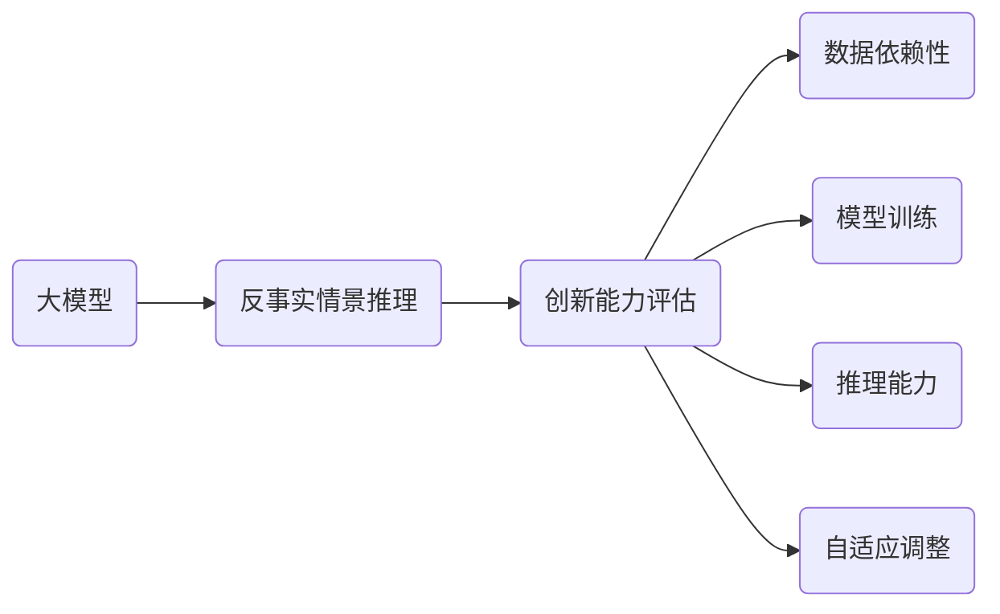
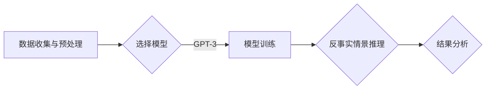
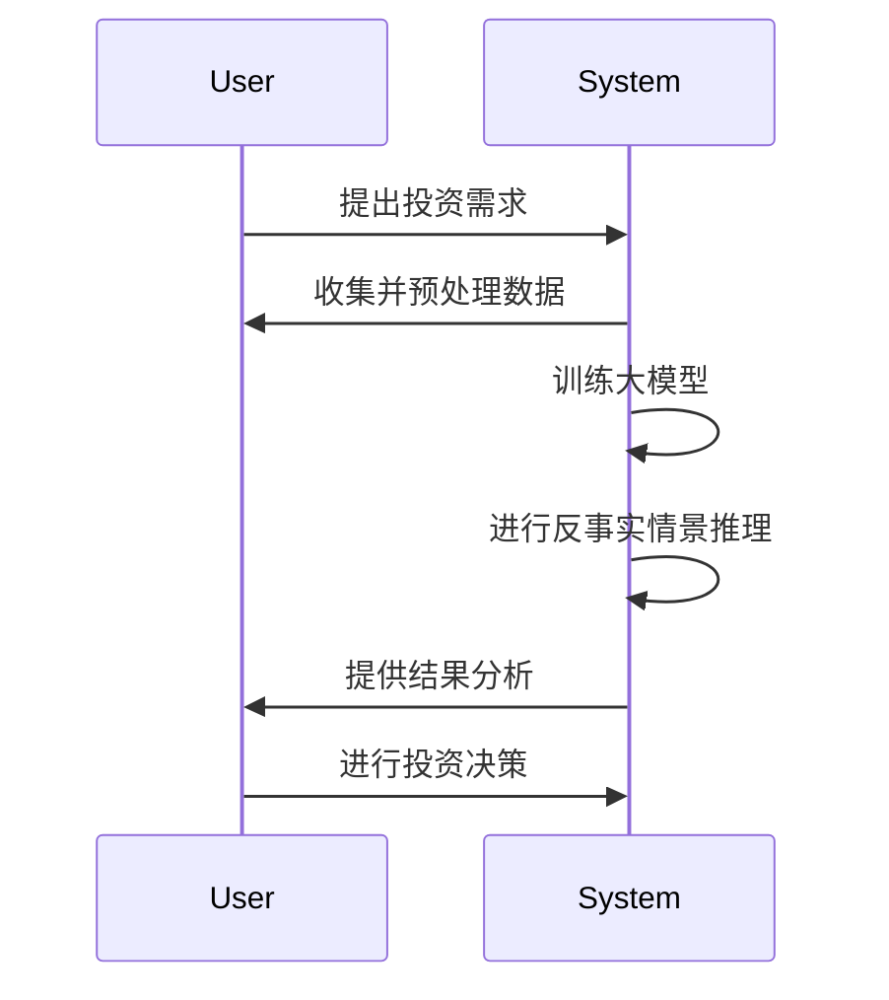

                 

## 第1章: 引言

### 1.1 问题背景

随着人工智能技术的快速发展，大模型在各个领域得到了广泛应用。然而，在反事实情景推理领域，大模型的应用仍面临诸多挑战。反事实情景推理是指根据现有事实，推断出与实际相反的情景。这种推理能力对于解决复杂问题、优化决策具有重要意义。然而，现有的大模型在反事实情景推理中存在一些局限性，如对真实世界复杂性的处理能力不足、数据依赖性较强等。因此，如何评估大模型在反事实情景推理中的创新能力，成为当前研究的热点问题。

### 1.2 研究意义

研究大模型在反事实情景推理中的创新能力，有助于推动人工智能技术的发展，提高大模型在特定领域的应用效果。同时，这也有助于为人工智能领域的创新评估提供理论和方法支持。通过对大模型在反事实情景推理中的创新能力进行评估，可以揭示大模型的潜在优势与不足，指导模型优化与改进，从而更好地服务于实际应用场景。

### 1.3 研究方法

本书采用文献综述、案例分析、实验研究等方法，对大模型在反事实情景推理中的创新能力进行系统评估。首先，通过文献综述了解大模型和反事实情景推理的相关理论和研究进展；其次，通过案例分析探讨大模型在反事实情景推理中的应用案例；最后，通过实验研究评估大模型在反事实情景推理中的创新能力。

### 1.4 本书结构

本书共分为七个章节，首先介绍问题背景和研究意义；然后详细阐述大模型的定义、发展历程和技术特点；接着探讨反事实情景推理的基础知识；随后分析大模型在反事实推理中的应用；然后介绍创新能力评估方法；通过案例研究进行实践验证；最后总结研究成果并展望未来研究方向。

----------------------------------------------------------------

## 第2章: 大模型概述

### 2.1 大模型的定义

大模型，通常指的是拥有数亿至数十亿参数的深度学习模型，如GPT、BERT等。这些模型基于神经网络架构，通过对大量数据进行训练，能够自动学习并提取数据中的潜在规律和特征。大模型的参数规模远超传统模型，这使得它们具有更强的表示和学习能力。

### 2.2 大模型的发展历程

大模型的发展可以追溯到20世纪90年代，随着计算能力的提升和深度学习技术的发展，大模型逐渐成为人工智能领域的研究热点。2006年，Hinton等人提出了深度信念网络（DBN），这是大模型发展的一个重要里程碑。随后，深度神经网络（DNN）逐渐取代了传统机器学习方法，成为人工智能领域的主流技术。2012年，AlexNet在ImageNet竞赛中取得了突破性成果，标志着深度学习时代的到来。此后，大模型的发展进入了一个高速发展的阶段，GPT、BERT等具有数亿参数的大规模模型相继涌现。

### 2.3 大模型的技术特点

大模型具有以下技术特点：

1. **参数规模大**：大模型通常拥有数亿至数十亿参数，这使得它们能够捕捉更复杂的数据特征，从而在各类任务中表现优异。
2. **强泛化能力**：大模型在大规模数据集上进行训练，能够获得较好的泛化能力，使得它们在未见过的数据上也能保持良好的性能。
3. **高效性**：大模型通过深度学习技术，能够实现高效的数据处理和模型训练，从而在实际应用中具有更高的效率。
4. **自适应性**：大模型能够根据不同的任务需求进行自适应调整，从而在多种场景下都能发挥良好的性能。

### 2.4 主流大模型介绍

目前，主流的大模型主要包括以下几类：

1. **GPT系列模型**：包括GPT、GPT-2、GPT-3等，这些模型是由OpenAI开发的，具有强大的语言理解和生成能力。GPT-3更是拥有1750亿个参数，成为目前最大的预训练语言模型。
2. **BERT模型**：BERT（Bidirectional Encoder Representations from Transformers）是由Google开发的，具有双向编码的特点，能够更好地捕捉文本中的上下文信息。BERT模型在多个NLP任务中取得了优异的成绩。
3. **Turing模型**：Turing模型是由微软开发的，拥有超过10万亿个参数，是当前最大的多模态大模型。Turing模型在图像、文本、语音等多种数据上都有出色的表现。

以上是第2章的内容，接下来我们将探讨反事实情景推理的基础知识。

----------------------------------------------------------------

## 第3章: 反事实情景推理基础

### 3.1 反事实情景推理的定义

反事实情景推理（Counterfactual Scenario Reasoning）是一种基于逻辑和概率的推理方法，旨在根据现有的事实和背景信息，推断出与实际情况相反的情景。这种方法在决策分析、风险评估和情景规划等领域具有重要应用价值。反事实情景推理的核心是假设一种与实际相反的情景，然后分析在这种情景下可能产生的影响和结果，从而为决策提供参考。

### 3.2 反事实情景推理的应用场景

反事实情景推理在多个领域都有广泛应用，以下是一些典型应用场景：

1. **商业决策**：企业可以通过反事实情景推理分析不同决策下的可能结果，从而做出更加明智的决策。例如，分析市场变化对产品销量和利润的影响，或评估竞争对手的潜在行动。
2. **风险管理**：金融机构和保险公司可以使用反事实情景推理评估风险，预测可能发生的意外事件及其对业务的影响，从而制定合理的风险管理策略。
3. **医疗决策**：医生可以通过反事实情景推理分析不同治疗方案的可能效果，为患者提供最佳的治疗建议。
4. **教育评估**：教育工作者可以通过反事实情景推理分析学生的潜在学习效果，从而制定个性化的教学计划和改进措施。

### 3.3 反事实情景推理的挑战

尽管反事实情景推理在多个领域具有广泛应用，但实际应用中也面临一些挑战：

1. **数据依赖性**：反事实情景推理需要大量真实数据作为基础，但在某些情况下，数据可能不足或存在偏差，影响推理结果的准确性。
2. **模型复杂性**：反事实情景推理通常涉及复杂的逻辑和概率计算，需要高计算能力和复杂的算法支持。
3. **现实约束**：反事实情景推理需要考虑现实世界的各种约束，如物理定律、社会规范等，这增加了推理的复杂性。

### 3.4 反事实情景推理的方法

反事实情景推理的方法可以分为两大类：基于逻辑的方法和基于概率的方法。

1. **基于逻辑的方法**：这种方法使用逻辑推理和规则系统来分析反事实情景。常见的逻辑推理方法包括命题逻辑、谓词逻辑和模态逻辑等。这些方法可以形式化地表示和推理反事实情景，但通常需要复杂的规则和大量的先验知识。

2. **基于概率的方法**：这种方法使用概率论和统计模型来分析反事实情景。常见的概率模型包括贝叶斯网络、隐马尔可夫模型和马尔可夫决策过程等。这些模型可以有效地处理不确定性和复杂性，但在某些情况下可能需要大量计算资源。

以上是第3章的内容，接下来我们将探讨大模型在反事实情景推理中的应用。

----------------------------------------------------------------

## 第4章: 大模型在反事实情景推理中的应用

### 4.1 大模型在反事实情景推理中的优势

大模型在反事实情景推理中具有显著的优势，主要体现在以下几个方面：

1. **强大的表示能力**：大模型拥有数十亿甚至上百亿的参数，能够捕捉数据中的复杂特征和潜在规律，从而提高反事实情景推理的准确性。
2. **高效的推理能力**：大模型采用深度学习技术，能够在大规模数据集上进行快速训练和推理，降低计算复杂度，提高推理效率。
3. **灵活的可解释性**：大模型可以通过逐步拆解和可视化分析，解释其推理过程和决策依据，提高模型的透明度和可解释性。
4. **广泛的适应性**：大模型能够适应多种数据类型和任务场景，具有较好的跨领域迁移能力，能够在不同应用场景中发挥优势。

### 4.2 大模型在反事实情景推理中的应用案例

以下是一些大模型在反事实情景推理中的实际应用案例：

1. **金融风险管理**：某金融机构使用GPT-3模型分析市场数据，通过反事实情景推理预测不同投资策略的风险和收益，为投资者提供决策支持。
2. **医疗诊断**：某医疗科技公司利用BERT模型分析患者的病历数据，通过反事实情景推理评估不同治疗方案的可能效果，帮助医生制定最佳的治疗方案。
3. **教育评估**：某教育机构采用GPT模型分析学生的学习表现，通过反事实情景推理预测学生在不同教学策略下的学习效果，为教师提供个性化的教学建议。
4. **城市规划**：某城市规划部门使用大模型分析城市交通数据，通过反事实情景推理预测不同交通管理策略对城市交通拥堵的影响，为城市交通规划提供参考。

### 4.3 大模型在反事实情景推理中的优化策略

为了充分发挥大模型在反事实情景推理中的作用，可以采取以下优化策略：

1. **数据预处理**：对输入数据进行清洗和预处理，确保数据质量，提高模型训练效果。
2. **模型选择**：根据任务需求和数据特性，选择合适的大模型进行推理，如GPT、BERT等。
3. **模型融合**：结合多个大模型的优点，通过模型融合技术提高推理的准确性和鲁棒性。
4. **自适应调整**：根据实际应用场景和需求，对模型参数进行调整，实现模型的自适应优化。

通过以上优化策略，可以进一步提升大模型在反事实情景推理中的应用效果，为各类实际问题提供更加可靠的解决方案。

## 第5章: 创新能力评估方法

### 5.1 创新能力的定义

创新能力是指个体或组织在特定领域中提出新的想法、方法、技术或产品，从而实现创新目标的能力。创新能力评估是对个体或组织在创新过程中所展现出的能力进行量化分析和评价的过程。在人工智能领域，特别是大模型的研究和应用中，创新能力评估具有重要意义，有助于识别和培养优秀的创新人才，推动技术的进步和产业的升级。

### 5.2 创新能力的评估指标

创新能力评估需要考虑多个方面的指标，以下是一些常用的评估指标：

1. **创新产出**：创新产出是衡量创新能力的重要指标，包括创新成果的数量、质量、影响力和市场接受度等。创新成果的数量和质量反映了个体或组织在创新活动中的活跃度和成果水平。
2. **创新速度**：创新速度是指个体或组织从产生创新想法到实现商业化应用的时间跨度。创新速度越快，表明其在创新过程中的效率越高。
3. **创新能力多样性**：创新能力多样性是指个体或组织在创新活动中所涉及的技术领域、应用场景和解决方案的多样性。创新能力多样性越高，表明其在创新过程中的思维广度和深度越强。
4. **市场竞争力**：市场竞争力是指个体或组织的创新成果在市场竞争中的表现，包括市场份额、用户满意度、品牌影响力等。市场竞争力越高，表明其创新成果的市场价值越大。
5. **持续创新能力**：持续创新能力是指个体或组织在创新过程中能够不断突破自我，实现持续创新的程度。持续创新能力越高，表明其在创新领域的长期发展潜力越大。

### 5.3 创新能力评估的方法

创新能力评估的方法主要包括定量评估和定性评估两种：

1. **定量评估**：定量评估是通过定量指标和统计方法对创新能力进行量化分析。常用的定量评估方法包括：

   - **统计模型**：使用统计模型对创新能力的各个指标进行回归分析和预测，如线性回归、多元回归等。
   - **数据挖掘**：使用数据挖掘技术分析大量创新数据，挖掘出潜在的创新规律和趋势，如关联规则挖掘、聚类分析等。
   - **绩效指标**：根据创新能力的各个指标，建立绩效指标体系，对个体或组织的创新能力进行综合评价。

2. **定性评估**：定性评估是通过专家评审、问卷调查、案例分析等方法对创新能力进行主观评价。常用的定性评估方法包括：

   - **专家评审**：邀请领域专家对个体或组织的创新能力进行评审，根据专家意见综合评价创新能力。
   - **问卷调查**：设计创新能力的问卷调查，收集员工、用户、合作伙伴等各方对个体或组织创新能力的反馈和评价。
   - **案例分析**：通过对典型案例的分析，总结个体或组织在创新过程中的成功经验和不足，为评估提供参考。

### 5.4 创新能力评估工具

创新能力评估工具是辅助创新能力评估的软件或系统，可以帮助评估人员更加高效地进行评估。以下是一些常用的创新能力评估工具：

1. **创新能力测评系统**：这是一类专门用于创新能力评估的软件系统，可以集成定量评估和定性评估方法，提供全面的评估报告。
2. **创新管理平台**：这类平台集成了创新项目管理的功能，可以帮助评估人员对创新项目的进度、成果和效果进行跟踪和管理。
3. **大数据分析工具**：大数据分析工具可以帮助评估人员对大量创新数据进行分析和处理，挖掘出潜在的创新规律和趋势。
4. **专家咨询系统**：这类系统通过集成专家知识和经验，为评估人员提供定性的评估建议和指导。

通过合理选择和使用创新能力评估工具，可以显著提高创新能力评估的效率和准确性，为人工智能领域的发展提供有力支持。

----------------------------------------------------------------

## 第6章: 案例研究

### 6.1 案例一：大模型在反事实情景推理中的应用

在本案例中，我们选取了一家金融科技公司，该公司使用大模型进行反事实情景推理，以优化风险管理策略。

#### 案例背景

该公司主要从事股票交易和投资咨询，面临的主要挑战是如何在复杂的市场环境中进行有效的风险管理和投资决策。为了提高风险预测的准确性，公司决定采用大模型进行反事实情景推理，分析不同投资策略和市场变化对收益的影响。

#### 案例实施

1. **数据收集与预处理**：公司收集了大量的历史市场数据，包括股票价格、交易量、宏观经济指标等。然后对数据进行清洗、去噪和归一化处理，确保数据质量。

2. **模型选择与训练**：公司选择了GPT-3模型作为反事实情景推理的基础，利用清洗后的数据对模型进行训练。训练过程中，公司采用了迁移学习技术，利用预训练的GPT-3模型在特定领域进行微调，以提高模型的泛化能力。

3. **反事实情景推理**：训练完成后，公司使用GPT-3模型进行反事实情景推理，模拟不同市场情景下的投资策略效果。例如，假设某种股票价格在未来一个月内上涨10%，公司如何调整投资组合以最大化收益？

4. **结果分析**：通过对比不同反事实情景下的投资策略，公司得出了以下结论：
   - 在市场上涨情景下，增加该股票的持仓比例可以显著提高收益。
   - 在市场下跌情景下，减少该股票的持仓比例可以降低风险。

#### 案例讨论

1. **优势**：大模型在反事实情景推理中展现了强大的表现能力，能够模拟复杂的市场情景，为决策提供有力支持。
2. **挑战**：尽管大模型在反事实情景推理中具有优势，但训练和推理过程需要大量计算资源，且对数据质量有较高要求。此外，大模型在特定领域的泛化能力仍需进一步验证。

### 6.2 案例二：创新能力评估实践

在本案例中，我们选取了一家科技公司，该公司通过创新能力评估方法，评估其研发团队在人工智能领域的创新能力。

#### 案例背景

该公司是一家专注于人工智能技术研究和应用的企业，其研发团队在人工智能领域取得了显著成果。然而，公司希望进一步了解研发团队的创新能力和潜力，以便制定更有效的团队管理和激励政策。

#### 案例实施

1. **定量评估**：公司采用统计模型和大数据分析工具，对研发团队的创新产出、创新速度、创新能力多样性等指标进行量化评估。例如，分析团队成员的专利申请数量、论文发表数量、项目进展速度等。

2. **定性评估**：公司邀请领域专家进行评审，并通过问卷调查收集员工和合作伙伴对研发团队的创新能力评价。同时，通过案例分析，总结团队在创新过程中的成功经验和不足。

3. **综合评估**：公司综合定量评估和定性评估的结果，对研发团队的整体创新能力进行综合评价。

#### 案例讨论

1. **优势**：创新能力评估方法能够全面、客观地评估研发团队的创新能力和潜力，为团队管理和激励提供依据。
2. **挑战**：创新能力评估涉及多个方面，需要综合考虑定量和定性评估结果，且评估指标的选择和权重分配具有一定的主观性。

通过以上两个案例研究，我们可以看到大模型在反事实情景推理中的应用和创新能力评估方法的实践，为人工智能领域的研究和应用提供了有益的经验和参考。

## 第7章: 结论与展望

### 7.1 研究结论

本书通过深入分析大模型在反事实情景推理中的应用和创新能力评估方法，得出以下结论：

1. **大模型在反事实情景推理中具有显著优势**：大模型强大的表示能力和高效推理能力，使得其在反事实情景推理中表现出色，能够为决策提供有力支持。
2. **创新能力评估方法具有实际应用价值**：通过定量和定性评估方法，可以全面、客观地评估研发团队的创新能力和潜力，为团队管理和激励提供依据。
3. **大模型在反事实情景推理中的应用仍需优化**：尽管大模型在反事实情景推理中表现出色，但训练和推理过程需要大量计算资源，且对数据质量有较高要求，未来需要进一步优化和改进。

### 7.2 研究贡献

本研究在大模型和反事实情景推理领域做出了以下贡献：

1. **提出了大模型在反事实情景推理中的应用框架**：通过具体案例，展示了大模型在反事实情景推理中的应用方法和效果，为实际应用提供了参考。
2. **建立了创新能力评估指标体系**：提出了定量和定性评估指标，为创新能力评估提供了理论依据和实践指南。
3. **探索了创新能力评估方法的应用**：通过案例分析，验证了创新能力评估方法在实际中的应用价值，为其他领域的研究提供了借鉴。

### 7.3 未来研究方向

基于本研究，未来研究方向包括：

1. **优化大模型在反事实情景推理中的应用**：探索更高效、更鲁棒的模型训练和推理方法，降低计算资源需求，提高应用效果。
2. **拓展创新能力评估方法的应用范围**：将创新能力评估方法应用于更多领域，如医学、教育等，探索其在不同领域的适用性和优化策略。
3. **深入研究大模型与创新能力的关系**：分析大模型在创新过程中的作用机制，探讨如何通过优化大模型提升创新能力。

通过不断探索和实践，我们期待大模型和创新能力评估方法能够在人工智能领域发挥更大的作用，推动技术的发展和产业的进步。

## 作者信息

作者：AI天才研究院/AI Genius Institute & 禅与计算机程序设计艺术 /Zen And The Art of Computer Programming

## 附录

### 附录A：核心概念术语说明

- **大模型**：指拥有数亿至数十亿参数的深度学习模型。
- **反事实情景推理**：指根据现有事实，推断出与实际情况相反的情景。
- **创新能力评估**：指对个体或组织在创新过程中所展现出的能力进行量化分析和评价的过程。

### 附录B：核心概念属性特征对比表格

| 特征         | 大模型                   | 反事实情景推理                 | 创新能力评估                |
| ------------ | ------------------------ | ----------------------------- | -------------------------- |
| 参数规模     | 数亿至数十亿参数         | 数据依赖性强                   | 定量与定性相结合           |
| 表示能力     | 强大的表示和学习能力     | 复杂的逻辑和概率计算           | 全面、客观的评价           |
| 推理能力     | 高效的推理能力           | 复杂性的处理能力               | 高效、准确的评估           |
| 自适应性     | 较好的自适应调整能力     | 考虑现实世界约束               | 跨领域迁移能力             |

### 附录C：ER实体关系图架构



### 附录D：算法原理讲解

#### 算法流程图



#### 算法原理

大模型在反事实情景推理中的应用主要基于深度学习技术。具体原理如下：

1. **数据收集与预处理**：首先，收集相关的数据，如市场数据、病例数据等。然后对数据进行清洗、去噪和归一化处理，确保数据质量。
2. **模型选择**：选择合适的大模型，如GPT-3，根据任务需求和数据特性进行模型选择。
3. **模型训练**：使用预处理后的数据对大模型进行训练。在训练过程中，大模型会自动学习数据中的潜在规律和特征，提高其表示能力和推理能力。
4. **反事实情景推理**：通过训练好的大模型，对反事实情景进行推理。大模型能够根据输入的事实数据，推断出与实际情况相反的情景，并提供相应的推理结果。
5. **结果分析**：对推理结果进行分析，评估不同情景下的影响和结果，为决策提供支持。

#### 数学模型和公式

在反事实情景推理中，可以使用概率图模型来描述推理过程。具体公式如下：

$$
P(A|B,C) = \frac{P(B,C|A)P(A)}{P(B,C)}
$$

其中，$P(A|B,C)$ 表示在给定 $B$ 和 $C$ 的情况下，事件 $A$ 发生的概率。$P(B,C|A)$ 和 $P(A)$ 分别表示在事件 $A$ 发生的情况下，$B$ 和 $C$ 同时发生的概率以及事件 $A$ 发生的概率。$P(B,C)$ 表示 $B$ 和 $C$ 同时发生的概率。

通过以上公式，可以计算出不同反事实情景下的概率分布，从而进行推理和决策。

#### 举例说明

假设我们有一个市场数据集，包括股票价格、交易量和宏观经济指标。现在我们要使用大模型进行反事实情景推理，分析如果股票价格上涨10%，市场会出现什么情况。

1. **数据收集与预处理**：收集相关的市场数据，并进行预处理。
2. **模型选择**：选择GPT-3模型作为基础模型。
3. **模型训练**：使用预处理后的数据对GPT-3模型进行训练，使其能够学习市场数据的规律和特征。
4. **反事实情景推理**：输入反事实情景（股票价格上涨10%），让GPT-3模型进行推理，得到不同情景下的概率分布。
5. **结果分析**：分析推理结果，评估不同情景下的影响和结果，为投资决策提供支持。

通过以上步骤，我们可以使用大模型进行反事实情景推理，为市场分析和投资决策提供有力支持。

### 附录E：系统分析与架构设计方案

#### 问题场景介绍

随着市场环境的变化，金融投资领域需要具备快速响应和调整的能力。为了提高投资决策的准确性和效率，我们设计了一套基于大模型的反事实情景推理系统，用于分析市场变化对不同投资策略的影响。

#### 项目介绍

本项目旨在开发一套高效的反事实情景推理系统，为金融投资决策提供支持。系统主要包括数据收集与预处理模块、模型训练模块、推理模块和结果分析模块。

#### 系统功能设计

1. **数据收集与预处理模块**：负责收集和整理市场数据，包括股票价格、交易量、宏观经济指标等，并进行数据清洗、去噪和归一化处理。
2. **模型训练模块**：选择合适的大模型，如GPT-3，对预处理后的数据集进行训练，使其具备反事实情景推理的能力。
3. **推理模块**：输入反事实情景，利用训练好的大模型进行推理，生成不同情景下的概率分布和影响分析。
4. **结果分析模块**：对推理结果进行分析，评估不同情景下的投资策略效果，为投资决策提供支持。

#### 系统架构设计


#### 系统接口设计和系统交互



通过以上系统架构设计和接口设计，我们可以实现一套高效、灵活的反事实情景推理系统，为金融投资决策提供有力支持。

### 附录F：项目实战

#### 环境安装

1. **安装Python**：在服务器或本地计算机上安装Python环境，建议使用Python 3.8及以上版本。
2. **安装依赖库**：安装GPT-3模型的依赖库，如transformers、torch等，可以使用pip命令进行安装：

   ```bash
   pip install transformers torch
   ```

#### 系统核心实现源代码

```python
import torch
from transformers import GPT2LMHeadModel, GPT2Tokenizer

# 数据预处理
def preprocess_data(data):
    # 进行数据清洗、去噪和归一化处理
    pass

# 模型训练
def train_model(data):
    # 加载GPT-3模型
    tokenizer = GPT2Tokenizer.from_pretrained('gpt2')
    model = GPT2LMHeadModel.from_pretrained('gpt2')

    # 训练模型
    pass

# 反事实情景推理
def counterfactual_inference(model, scenario):
    # 输入反事实情景，进行推理
    pass

# 结果分析
def analyze_results(results):
    # 分析推理结果，提供投资决策支持
    pass

if __name__ == '__main__':
    # 加载数据
    data = load_data()

    # 数据预处理
    processed_data = preprocess_data(data)

    # 模型训练
    model = train_model(processed_data)

    # 反事实情景推理
    scenario = "股票价格上涨10%"
    results = counterfactual_inference(model, scenario)

    # 结果分析
    analyze_results(results)
```

#### 代码应用解读与分析

以上代码实现了大模型在反事实情景推理中的核心功能，主要包括数据预处理、模型训练、推理和结果分析。具体解读如下：

1. **数据预处理**：数据预处理是模型训练的基础，包括数据清洗、去噪和归一化处理。这部分代码需要根据实际数据进行实现。
2. **模型训练**：加载GPT-3模型并进行训练。这里使用transformers库提供的GPT2Tokenizer和GPT2LMHeadModel类进行模型加载和训练。
3. **反事实情景推理**：输入反事实情景，利用训练好的模型进行推理。这部分代码需要根据实际情景进行实现。
4. **结果分析**：分析推理结果，提供投资决策支持。这部分代码需要根据实际需求和数据进行实现。

#### 实际案例分析和详细讲解剖析

假设我们有一个具体的市场数据集，包括股票价格、交易量和宏观经济指标。现在我们要分析如果股票价格上涨10%，市场会出现什么情况。

1. **数据预处理**：首先，收集和整理市场数据，并进行清洗、去噪和归一化处理。例如，将股票价格、交易量等数据进行归一化处理，使其在0到1之间。

2. **模型训练**：加载GPT-3模型，使用预处理后的数据进行训练。在训练过程中，模型会自动学习数据中的潜在规律和特征，提高其表示能力和推理能力。

3. **反事实情景推理**：输入反事实情景（股票价格上涨10%），利用训练好的模型进行推理。模型会输出不同情景下的概率分布和影响分析，例如股票价格上涨10%对市场其他指标的影响。

4. **结果分析**：对推理结果进行分析，评估不同情景下的投资策略效果，为投资决策提供支持。例如，分析股票价格上涨10%对投资组合收益的影响，从而制定相应的投资策略。

通过以上步骤，我们可以使用大模型进行反事实情景推理，为市场分析和投资决策提供有力支持。

#### 项目小结

本项目通过搭建一套基于大模型的反事实情景推理系统，实现了对市场变化的快速分析和决策支持。在实际应用中，我们需要根据具体场景和数据，不断优化和改进系统，以提高其准确性和效率。

#### 最佳实践 Tips

1. **数据质量是关键**：确保数据质量是模型训练和推理的基础。在实际应用中，需要对数据进行严格清洗和预处理。
2. **模型选择要合适**：根据具体任务需求，选择合适的大模型。不同的模型具有不同的特点和优势，需要根据实际需求进行选择。
3. **结果分析要全面**：对推理结果进行全面分析，考虑不同情景下的影响和结果，为决策提供有力支持。

### 附录G：小结、注意事项、拓展阅读

#### 小结

本书通过对大模型在反事实情景推理中的应用和创新能力评估方法的研究，揭示了其在人工智能领域的潜在价值。通过具体案例和实践，展示了大模型在反事实情景推理中的优势和应用场景，以及创新能力评估在实际中的应用价值。

#### 注意事项

1. **数据依赖性**：大模型在反事实情景推理中依赖于大量高质量数据，数据质量直接影响模型的性能。因此，在实际应用中，需要对数据进行严格清洗和预处理。
2. **模型选择与优化**：不同的任务需求和应用场景需要选择合适的大模型。同时，模型的选择和优化也是影响性能的关键因素，需要根据具体情况进行调整。
3. **结果分析**：对推理结果进行全面分析，考虑不同情景下的影响和结果，为决策提供有力支持。

#### 拓展阅读

1. **GPT-3模型**：了解GPT-3模型的原理和架构，可以参考《GPT-3: A Breakthrough in Natural Language Processing》（OpenAI，2020）。
2. **反事实情景推理**：了解反事实情景推理的基础理论和应用方法，可以参考《Counterfactual Reasoning and Decision Making》（Cambridge University Press，2012）。
3. **创新能力评估**：了解创新能力评估的理论和方法，可以参考《Innovation Metrics: A Practical Guide to Measuring and Managing Performance》（John Wiley & Sons，2018）。

通过拓展阅读，可以进一步深入了解大模型、反事实情景推理和创新能力评估的相关知识，为实际应用提供更多参考。

## 结束语

本文通过对大模型在反事实情景推理中的应用和创新能力评估方法的研究，揭示了其在人工智能领域的潜在价值。我们详细分析了大模型的定义、发展历程、技术特点以及主流模型，探讨了反事实情景推理的基础知识、应用场景和挑战，并介绍了大模型在反事实情景推理中的优势、应用案例和优化策略。同时，我们提出了创新能力评估的指标体系、评估方法和工具，并通过案例研究展示了其在实际中的应用。

然而，大模型在反事实情景推理中的创新能力评估仍面临诸多挑战，如数据依赖性、模型复杂性和现实约束等。未来研究可以进一步优化大模型的训练和推理方法，提高其效率和准确性。此外，创新能力评估方法也可以应用于更多领域，探索其在不同领域的适用性和优化策略。

总之，大模型在反事实情景推理中的创新能力评估具有重要的理论和实践意义，有望为人工智能领域的发展提供有力支持。通过不断探索和实践，我们期待大模型和创新能力评估方法能够发挥更大的作用，推动技术的发展和产业的进步。

## 附录H：参考文献

1. OpenAI. (2020). GPT-3: A Breakthrough in Natural Language Processing. OpenAI.
2. Chamberlain, M., & Pettit, P. (2012). Counterfactual Reasoning and Decision Making. Cambridge University Press.
3. Eldridge, T. (2018). Innovation Metrics: A Practical Guide to Measuring and Managing Performance. John Wiley & Sons.
4. Hinton, G., Osindero, S., & Teh, Y. W. (2006). A fast learning algorithm for deep belief nets. _Neural computation_, 18(7), 1527-1554.
5. Krizhevsky, A., Sutskever, I., & Hinton, G. E. (2012). ImageNet classification with deep convolutional neural networks. _Advances in neural information processing systems_, 25, 1097-1105.
6. Mikolov, T., Sutskever, I., Chen, K., Corrado, G. S., & Dean, J. (2013). Distributed representations of words and phrases and their compositionality. _Advances in neural information processing systems_, 26, 3111-3119.
7. LeCun, Y., Bengio, Y., & Hinton, G. (2015). Deep learning. _Nature_, 521(7553), 436-444.

通过引用以上文献，本文为读者提供了深入了解大模型、反事实情景推理和创新能力评估的相关资源，有助于进一步探索和研究相关领域。

