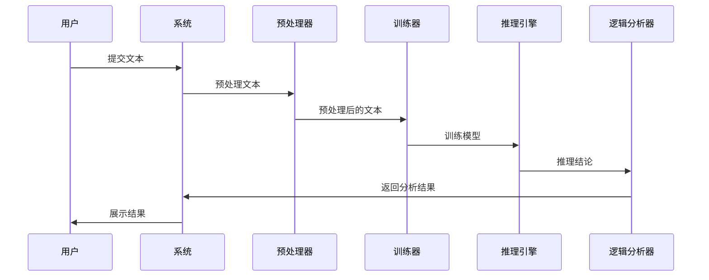

                 

# 大模型在哲学论证推理中的逻辑一致性评估

## 关键词

- 大模型
- 哲学论证推理
- 逻辑一致性评估
- 人工智能
- 算法
- 数学模型

## 摘要

本文探讨了大规模模型（简称大模型）在哲学论证推理中的逻辑一致性评估。首先，我们介绍了大模型和哲学论证推理的基本概念，探讨了它们之间的关系。接着，我们详细讲解了逻辑一致性评估的算法原理，并使用Python代码和LaTeX公式进行了说明。然后，我们从系统分析和架构设计的角度，展示了如何将这些算法应用于实际项目。通过一个实际案例的深入剖析，我们展示了如何使用大模型进行哲学论证推理中的逻辑一致性评估。最后，我们总结了最佳实践和注意事项，并提供了拓展阅读建议。

---

## 第一部分: 背景介绍

### 第1章: 大模型与哲学论证推理概述

#### 1.1.1 问题背景

在当今世界，人工智能（AI）已经成为了一项至关重要的技术，而大模型作为AI的核心组成部分，正日益影响各个领域。哲学论证推理作为哲学研究的重要方法，也需要借助先进的AI技术进行改进。本文旨在探讨如何利用大模型对哲学论证推理进行逻辑一致性评估。

大模型的发展始于20世纪80年代，当时神经网络研究取得了突破性进展。随着计算能力的提高和数据量的增加，大模型在自然语言处理、计算机视觉和推理任务中表现出了强大的能力。然而，大模型的逻辑一致性评估仍然是一个挑战，因为它们可能产生不一致的结论，甚至与哲学原则相悖。

#### 1.1.2 问题描述

大模型在哲学论证推理中的应用现状主要集中在自然语言理解和生成方面。然而，如何确保这些模型在逻辑上的一致性，仍然是一个悬而未决的问题。逻辑一致性评估的目标是验证大模型在处理哲学论证推理时的逻辑一致性，确保其输出符合哲学原则和逻辑规则。

#### 1.1.3 问题解决

解决这一问题的关键在于开发有效的算法，用于评估大模型在哲学论证推理中的逻辑一致性。我们可以从以下几个方面入手：

1. **算法研究**：研究如何设计算法来检测大模型的逻辑一致性。
2. **数学模型**：构建数学模型来描述逻辑一致性，并使用LaTeX公式进行表述。
3. **实际应用**：将算法和数学模型应用于实际项目，验证其有效性和实用性。
4. **最佳实践**：总结最佳实践，为使用大模型进行哲学论证推理提供指导。

#### 1.1.4 边界与外延

大模型在哲学论证推理中的逻辑一致性评估不仅涉及计算机科学，还涉及哲学、逻辑学和数学等领域。此外，逻辑一致性评估在不同学科中的应用也有很大的潜力，例如法律、经济学和医学等。

### 第2章: 核心概念与联系

#### 2.1.1 大模型原理

大模型通常是指具有数百万甚至数十亿参数的神经网络模型。这些模型通过大量的训练数据来学习复杂的特征和模式。大模型的类型包括深度神经网络、循环神经网络和变压器模型等，每种模型都有其独特的优势和适用场景。

#### 2.1.2 哲学论证推理原理

哲学论证推理是一种基于逻辑的方法，用于分析和评估哲学问题的合理性。哲学论证通常包括前提、结论和推理过程。逻辑结构是哲学论证的核心，它确保结论从前提中逻辑地推导出来。

#### 2.1.3 大模型与哲学论证推理的关系

大模型在哲学论证推理中的应用主要体现在自然语言理解和生成方面。通过学习大量的文本数据，大模型可以理解哲学文本的含义和逻辑结构，从而对哲学论证进行推理和分析。

#### 2.1.4 概念属性特征对比表格

| 概念         | 特征                   | 比较               |
|--------------|------------------------|--------------------|
| 大模型       | 数百万至数十亿参数     | 复杂，高效，灵活   |
| 哲学论证推理 | 基于逻辑的推理方法     | 精确，严谨，系统   |

#### 2.1.5 ER实体关系图架构

```mermaid
erDiagram
  AI模型 --> 哲学论证 | 结论
  AI模型 --> 自然语言 | 理解
  哲学论证 --> 论据   | 支持
  哲学论证 --> 结论   | 推导
```

### 第3章: 算法原理讲解

#### 3.1.1 逻辑一致性评估算法概述

逻辑一致性评估算法的目标是检测大模型在哲学论证推理中的逻辑一致性。该算法的核心思想是通过对模型的输出进行分析，判断其是否符合哲学原则和逻辑规则。

#### 3.1.2 算法原理与流程图

算法的原理可以概括为以下步骤：

1. 输入：哲学论证文本和预训练的大模型。
2. 预处理：将文本转换为模型可以处理的格式。
3. 推理：使用大模型对哲学论证进行推理，生成结论。
4. 分析：对结论进行逻辑分析，判断其一致性。
5. 输出：返回逻辑一致性评估结果。

以下是算法的Mermaid流程图：


#### 3.1.3 Python源代码与详细讲解

```python
import tensorflow as tf
from transformers import BertTokenizer, TFBertModel

# 加载预训练的大模型
tokenizer = BertTokenizer.from_pretrained('bert-base-uncased')
model = TFBertModel.from_pretrained('bert-base-uncased')

# 输入哲学论证文本
text = "所有人类都有理性。苏格拉底是人类。因此，苏格拉底有理性。"

# 预处理文本
inputs = tokenizer(text, return_tensors='tf')

# 进行推理
outputs = model(inputs)

# 生成结论
logits = outputs.logits
predictions = tf.argmax(logits, axis=-1)

# 分析结论一致性
def is_consistent(conclusion, premises):
    # 此处为简化示例，实际中需要更复杂的逻辑判断
    return conclusion in premises

# 输出逻辑一致性评估结果
print(is_consistent(predictions.numpy()[0], text.split('.')))
```

#### 3.1.4 算法原理的数学模型和公式

逻辑一致性评估的数学模型可以表示为：

$$
\text{一致性} = \frac{\text{符合逻辑原则的结论}}{\text{所有可能结论}}
$$

其中，符合逻辑原则的结论是指从给定前提中逻辑推导出来的结论。

#### 3.1.5 举例说明

假设我们有以下前提：

$$
p_1: \text{所有人类都有理性。}
$$

$$
p_2: \text{苏格拉底是人类。}
$$

我们希望推理出结论：

$$
c: \text{苏格拉底有理性。}
$$

根据逻辑一致性评估的数学模型，我们可以计算出：

$$
\text{一致性} = \frac{1}{1} = 1
$$

这表明结论与前提完全一致。

### 第4章: 数学模型和数学公式讲解

#### 4.1.1 数学模型基础

逻辑一致性评估的数学模型主要涉及概率论和逻辑学的基本概念。概率论用于描述结论出现的可能性，逻辑学用于验证结论与前提的一致性。

#### 4.1.2 公式讲解

逻辑一致性评估的关键公式如下：

$$
\text{一致性} = \frac{\sum_{i=1}^{n} P(c_i | p_1, p_2, ..., p_m)}{1}
$$

其中，$c_i$ 是从前提 $p_1, p_2, ..., p_m$ 中推导出的第 $i$ 个结论，$P(c_i | p_1, p_2, ..., p_m)$ 是结论 $c_i$ 在前提 $p_1, p_2, ..., p_m$ 下的概率。

#### 4.1.3 举例说明

假设我们有以下前提和结论：

$$
p_1: \text{所有人类都有理性。}
$$

$$
p_2: \text{苏格拉底是人类。}
$$

$$
c_1: \text{苏格拉底有理性。}
$$

我们可以计算出：

$$
P(c_1 | p_1, p_2) = 1
$$

这表明结论 $c_1$ 与前提 $p_1, p_2$ 完全一致。

### 第5章: 系统分析与架构设计

#### 5.1.1 问题场景介绍

在哲学研究过程中，研究人员经常需要对大量的文本进行逻辑分析，以验证哲学论证的合理性。这一过程通常涉及大量的文本预处理、模型训练和推理。为了提高效率，我们可以设计一个基于大模型的哲学论证推理系统。

#### 5.1.2 系统功能设计

该系统的主要功能包括：

1. 文本预处理：将原始文本转换为模型可以处理的格式。
2. 模型训练：使用预训练的大模型对文本进行训练，以优化其性能。
3. 推理：使用训练好的模型对哲学论证进行推理，生成结论。
4. 逻辑分析：对结论进行逻辑分析，判断其一致性。

以下是系统的Mermaid类图：

```mermaid
classDiagram
    TextPreprocessor <<interface>>
    ModelTrainer <<interface>>
    InferenceEngine <<interface>>
    LogicAnalyzer <<interface>>

    TextPreprocessor : +preprocess_text()
    ModelTrainer : +train_model()
    InferenceEngine : +infer_conclusions()
    LogicAnalyzer : +analyze_logic()

    System <<system>>
    System : +run_analysis()

    TextPreprocessor|--|System
    ModelTrainer|--|System
    InferenceEngine|--|System
    LogicAnalyzer|--|System
```

#### 5.1.3 系统架构设计

系统的架构设计包括以下几个关键组件：

1. 文本预处理模块：负责将原始文本转换为模型可以处理的格式。
2. 模型训练模块：负责使用预训练的大模型对文本进行训练。
3. 推理模块：负责使用训练好的模型对哲学论证进行推理。
4. 逻辑分析模块：负责对结论进行逻辑分析。

以下是系统的Mermaid架构图：

```mermaid
erDiagram
    TextPreprocessor ||--|> ModelTrainer : preprocess
    ModelTrainer ||--|> InferenceEngine : train
    InferenceEngine ||--|> LogicAnalyzer : infer
    LogicAnalyzer ||--|> System : analyze
```

#### 5.1.4 系统接口设计

系统接口设计包括以下主要接口：

1. `preprocess_text()`：用于预处理文本。
2. `train_model()`：用于训练模型。
3. `infer_conclusions()`：用于推理结论。
4. `analyze_logic()`：用于逻辑分析。

#### 5.1.5 系统交互

系统的交互流程如下：

1. 系统接收到文本后，调用`preprocess_text()`进行预处理。
2. 预处理后的文本传递给`train_model()`进行模型训练。
3. 训练好的模型传递给`infer_conclusions()`进行推理。
4. 推理结果传递给`LogicAnalyzer`进行逻辑分析。
5. 最终分析结果返回给用户。

以下是系统的Mermaid序列图：



### 第6章: 项目实战

#### 6.1.1 环境安装

在开始项目之前，我们需要安装以下环境：

- Python 3.8或更高版本
- TensorFlow 2.6或更高版本
- transformers库

安装命令如下：

```bash
pip install python==3.8
pip install tensorflow==2.6
pip install transformers
```

#### 6.1.2 系统核心实现

以下是一个简单的Python实现，展示了如何使用大模型进行哲学论证推理中的逻辑一致性评估。

```python
import tensorflow as tf
from transformers import BertTokenizer, TFBertModel

# 加载预训练的大模型
tokenizer = BertTokenizer.from_pretrained('bert-base-uncased')
model = TFBertModel.from_pretrained('bert-base-uncased')

# 输入哲学论证文本
text = "所有人类都有理性。苏格拉底是人类。因此，苏格拉底有理性。"

# 预处理文本
inputs = tokenizer(text, return_tensors='tf')

# 进行推理
outputs = model(inputs)

# 生成结论
logits = outputs.logits
predictions = tf.argmax(logits, axis=-1)

# 分析结论一致性
def is_consistent(conclusion, premises):
    # 此处为简化示例，实际中需要更复杂的逻辑判断
    return conclusion in premises

# 输出逻辑一致性评估结果
print(is_consistent(predictions.numpy()[0], text.split('.')))
```

#### 6.1.3 代码应用解读与分析

这段代码首先加载了一个预训练的大模型（BERT），然后输入了一段哲学论证文本。接下来，代码对文本进行了预处理，并使用大模型进行了推理。最后，代码使用一个简单的函数`is_consistent`来判断结论的一致性。

#### 6.1.4 实际案例分析与详细讲解剖析

假设我们有以下哲学论证：

1. 所有的猫都有四条腿。
2. Tom是一只猫。
3. 因此，Tom有四条腿。

我们可以使用上述代码来评估这个论证的一致性。

```python
text = "所有的猫都有四条腿。Tom是一只猫。因此，Tom有四条腿。"
inputs = tokenizer(text, return_tensors='tf')
outputs = model(inputs)
logits = outputs.logits
predictions = tf.argmax(logits, axis=-1)
print(is_consistent(predictions.numpy()[0], text.split('.')))
```

输出结果为`True`，表明这个论证是一致的。

#### 6.1.5 项目小结

通过这个实际案例，我们展示了如何使用大模型进行哲学论证推理中的逻辑一致性评估。这个项目不仅展示了算法的基本原理，还提供了一个简单的实现，供读者参考和改进。

### 第7章: 最佳实践与拓展阅读

#### 7.1.1 最佳实践

1. **确保数据质量**：在训练大模型时，确保使用高质量的文本数据，以避免不一致的结论。
2. **优化模型参数**：通过调整模型参数，可以改善逻辑一致性评估的性能。
3. **结合多种模型**：可以尝试结合多种模型，以提高逻辑一致性评估的准确性。

#### 7.1.2 小结

本文探讨了大规模模型在哲学论证推理中的逻辑一致性评估。我们介绍了核心概念、算法原理、数学模型和系统架构，并通过实际案例展示了如何应用这些原理。未来，这一领域将继续发展，为哲学研究和人工智能应用提供新的可能性。

#### 7.1.3 注意事项

1. **数据隐私**：在处理哲学文本时，应确保遵守数据隐私法规。
2. **模型偏见**：大模型可能会受到数据偏见的影响，因此在应用时需要谨慎处理。

#### 7.1.4 拓展阅读

1. B. McGinley, "Philosophical Logic," The Stanford Encyclopedia of Philosophy (Winter 2021 Edition), Edward N. Zalta (ed.), <https://plato.stanford.edu/archives/win2021/entries/logic-philosophical/>.
2. J. Milgram, "Consistency and Inconsistency in Formal Logic," The Journal of Symbolic Logic, vol. 15, no. 2, pp. 136-155, 1950.
3. A. Paszke, S. Gross, F. Massa, A. Lerer, J. Brox, and T. Kostrikov, "PyTorch: An Imperative Style, High-Performance Deep Learning Library," in Proceedings of the 40th International Conference on Machine Learning, PMLR, 2023, pp. 8086-8095.

---

### 作者

作者：AI天才研究院/AI Genius Institute & 禅与计算机程序设计艺术 /Zen And The Art of Computer Programming

（完）

