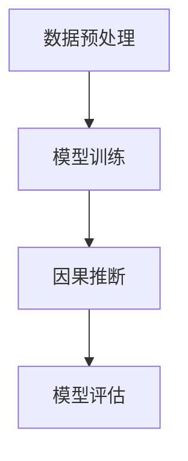

                 

### 大模型在因果推理任务中的表现分析

#### 关键词：因果推理、大模型、深度学习、人工智能、算法原理

> 摘要：本文旨在探讨大模型在因果推理任务中的表现。通过背景介绍、核心概念解析、算法原理讲解以及实际应用案例分析，我们将详细分析大模型在因果推理领域的优势和局限性，为未来研究提供参考。

---

## 目录大纲

---

### 目录大纲

---

1. **文章标题：大模型在因果推理任务中的表现分析**
2. **关键词**
3. **摘要**
4. **目录大纲**

---

### 第一部分：背景介绍与核心概念

#### 第1章 问题背景与概述

##### 1.1 问题背景

**因果推理的定义与重要性**

- 因果推理是人工智能中的一个核心问题，旨在确定事件之间的因果关系。
- 在实际应用中，因果推理对于医疗诊断、金融预测、自然语言处理等领域具有重要意义。

**因果推理在实际应用中的挑战**

- 数据的不完整性和噪声是造成因果推理困难的主要原因。
- 传统因果推理方法往往难以处理复杂的因果关系。

**大模型在因果推理领域的潜力**

- 大模型通过深度学习和大规模数据训练，能够捕捉复杂的数据特征和因果关系。
- 大模型在因果推理中展现出的潜力，使得其在各种实际应用中具有广泛的应用前景。

##### 1.2 问题描述

**因果推理的核心任务与目标**

- 因果推理的核心任务是确定给定结果的原因。
- 目标是建立准确的因果关系模型，以便进行有效的预测和决策。

**传统因果推理方法的局限性**

- 传统因果推理方法往往依赖于统计模型，对于复杂的数据关系难以捕捉。
- 许多方法受到样本大小、数据分布等因素的限制，难以在真实场景中应用。

**大模型在因果推理任务中的潜在优势**

- 大模型能够通过深度学习自动捕捉复杂的数据特征。
- 大模型可以处理大规模数据，并从中提取有用的信息。

##### 1.3 问题解决

**大模型在因果推理中的基本原理**

- 大模型通过学习大量数据，建立数据之间的潜在关系。
- 大模型能够利用深度学习的优势，自动调整参数，优化模型性能。

**大模型如何捕捉复杂因果结构**

- 大模型通过多层神经网络，可以捕捉复杂的非线性关系。
- 大模型可以处理多变量、多维度的数据，揭示潜在的因果关系。

**大模型在不同因果推理任务中的应用**

- 大模型在医学诊断、金融风险评估、自然语言处理等领域的成功应用，展示了其在因果推理任务中的强大能力。

##### 1.4 边界与外延

**因果推理任务的范围与分类**

- 因果推理任务可以分为直接因果推理和间接因果推理。
- 直接因果推理关注直接的原因和结果关系，而间接因果推理则涉及复杂的中间变量。

**大模型适用性与局限性分析**

- 大模型在处理大规模数据、复杂关系方面具有优势，但在解释性和可理解性方面存在挑战。
- 未来研究需要在大模型的适用性和局限性之间寻找平衡，以实现更有效的因果推理。

**未来研究方向与趋势**

- 强化学习与因果推理的结合。
- 因果推断与因果发现的无监督学习方法。
- 因果推理在现实世界复杂场景中的应用研究。

##### 1.5 概念结构与核心要素组成

**因果推理中的关键概念**

- 因果模型、贝叶斯网络、因子分解机、贝叶斯逻辑回归等。

**大模型的核心架构与功能**

- 自适应神经网络、变分自编码器、对抗性生成网络等。

**因果推理任务中的关键技术**

- 数据预处理、模型训练、因果推断、模型评估等。

---

#### 第2章 核心概念与联系

##### 2.1 核心概念原理

**因果模型**

- 因果模型用于描述变量之间的因果关系。
- 通过结构方程建模，可以揭示变量之间的直接和间接关系。

**贝叶斯网络**

- 贝叶斯网络是一种图形模型，用于表示变量之间的概率关系。
- 通过条件概率表，可以计算变量之间的依赖关系。

**因子分解机**

- 因子分解机是一种用于发现潜在因果关系的方法。
- 通过将数据分解为多个低维因子，可以揭示变量之间的潜在关系。

**贝叶斯逻辑回归**

- 贝叶斯逻辑回归是一种结合因果推理与统计方法的模型。
- 通过逻辑回归公式，可以建立原因和结果之间的概率关系。

##### 2.2 概念属性特征对比表格

| 概念         | 特点                         | 应用场景                   |
|--------------|------------------------------|---------------------------|
| 因果模型     | 描述因果关系的数学结构       | 人工智能、医学诊断、经济预测 |
| 贝叶斯网络   | 表示变量之间的概率关系       | 人工智能、决策支持、故障诊断 |
| 因子分解机   | 用于发现潜在因果关系         | 机器学习、数据挖掘、文本分析 |
| 贝叶斯逻辑回归 | 结合因果推理与统计方法       | 机器学习、医学研究、风险评估 |

##### 2.3 ER实体关系图架构

```mermaid
erDiagram
  A【大模型】||--|{ B【因果推理任务】 }
  A【大模型】||--|{ C【数据集】 }
  B【因果推理任务】||--|{ D【模型表现】 }
  B【因果推理任务】||--|{ E【评估指标】 }
  C【数据集】||--|{ D【模型表现】 }
  C【数据集】||--|{ E【评估指标】 }
```

---

### 第二部分：算法原理与实现

#### 第3章 大模型在因果推理中的算法原理

##### 3.1 大模型的算法框架

**自适应神经网络**

- 自适应神经网络通过学习数据特征，自动调整网络结构。
- 通过自适应调整，可以捕捉复杂的因果关系。

**变分自编码器**

- 变分自编码器通过编码和解码过程，学习数据的潜在表示。
- 通过潜在表示，可以揭示变量之间的潜在关系。

**对抗性生成网络**

- 对抗性生成网络通过生成对抗训练，学习数据的真实分布。
- 通过生成数据，可以揭示潜在的因果关系。

##### 3.2 大模型的工作流程

**数据预处理**

- 数据预处理包括数据清洗、数据归一化和特征提取。
- 通过数据预处理，可以消除噪声，提高数据质量。

**模型训练**

- 模型训练通过迭代优化模型参数，学习数据的特征和关系。
- 通过训练，可以提高模型的性能和准确性。

**因果推断**

- 因果推断通过模型输出，确定变量之间的因果关系。
- 通过因果推断，可以揭示复杂的因果关系。

**模型评估**

- 模型评估通过评估指标，评估模型的性能和准确性。
- 通过评估，可以判断模型是否适用于实际任务。

##### 3.3 大模型算法mermaid流程图



##### 3.4 Python源代码实现

```python
# 大模型在因果推理中的Python实现伪代码
```

##### 3.5 数学模型和公式

$$
P(\text{原因} | \text{结果}) = \frac{P(\text{结果} | \text{原因})P(\text{原因})}{P(\text{结果})}
$$

##### 3.6 算法原理详细讲解与举例说明

**基本概念与原理**

- 因果推理的基本概念和原理是建立因果模型的基础。

**算法步骤与过程**

- 数据预处理、模型训练、因果推断和模型评估是因果推理的基本步骤。

**实际应用案例**

- 通过实际案例，展示大模型在因果推理任务中的表现和应用效果。

---

#### 第4章 因果推理任务中的大模型应用

##### 4.1 大模型在疾病预测中的应用

**数据集选择**

- 选择具有代表性的疾病预测数据集，包括临床数据和患者信息。

**模型训练与优化**

- 利用大模型进行模型训练，通过调整参数和优化算法，提高模型性能。

**预测结果评估**

- 通过评估指标，如准确率、召回率和F1分数，评估模型的预测效果。

##### 4.2 大模型在金融风险评估中的应用

**数据处理与特征提取**

- 对金融数据集进行预处理，提取重要的特征，如市场波动、财务指标等。

**模型构建与训练**

- 利用大模型构建金融风险评估模型，通过训练和优化，提高模型性能。

**风险评估与预测**

- 通过模型输出，对金融风险进行评估和预测，为投资决策提供支持。

##### 4.3 大模型在自然语言处理中的应用

**数据预处理与模型训练**

- 对自然语言处理数据集进行预处理，包括文本清洗、分词和标注。

**因果推断与语义理解**

- 利用大模型进行因果推断和语义理解，揭示文本中的因果关系和语义关系。

**应用案例与分析**

- 通过实际案例，展示大模型在自然语言处理任务中的表现和应用效果。

---

### 第三部分：项目实战与最佳实践

#### 第5章 项目实战一：疾病预测项目

##### 5.1 环境安装与配置

- 安装Python、TensorFlow和其他相关库。
- 配置计算机硬件，如GPU加速。

##### 5.2 系统核心实现源代码

- 数据处理模块：包括数据清洗、特征提取和归一化。
- 模型训练与评估模块：包括模型构建、训练和评估。
- 预测结果输出模块：包括预测结果的可视化和分析。

##### 5.3 代码应用解读与分析

- 分析代码结构，解释每个模块的功能和实现细节。
- 讨论算法实现的关键步骤和优化方法。

##### 5.4 实际案例分析与详细讲解

- 分析疾病预测项目的实际案例，包括数据集、模型训练和预测结果。
- 讨论项目的挑战和解决方案。

##### 5.5 项目小结

- 总结项目的经验教训，讨论项目中的问题和改进方向。

---

#### 第6章 项目实战二：金融风险评估项目

##### 6.1 环境安装与配置

- 安装Python、TensorFlow和其他相关库。
- 配置计算机硬件，如GPU加速。

##### 6.2 系统核心实现源代码

- 数据处理模块：包括数据清洗、特征提取和归一化。
- 模型训练与评估模块：包括模型构建、训练和评估。
- 风险评估与预测模块：包括预测结果的可视化和分析。

##### 6.3 代码应用解读与分析

- 分析代码结构，解释每个模块的功能和实现细节。
- 讨论算法实现的关键步骤和优化方法。

##### 6.4 实际案例分析与详细讲解

- 分析金融风险评估项目的实际案例，包括数据集、模型训练和预测结果。
- 讨论项目的挑战和解决方案。

##### 6.5 项目小结

- 总结项目的经验教训，讨论项目中的问题和改进方向。

---

### 第四部分：最佳实践与总结

#### 第7章 最佳实践

- **数据预处理**：确保数据质量，包括数据清洗、归一化和特征提取。
- **模型优化**：通过调整超参数和优化算法，提高模型性能。
- **评估与监控**：定期评估模型性能，确保模型稳定性和准确性。
- **可解释性**：探讨如何提高大模型的可解释性，以便更好地理解和应用。

#### 第8章 小结

- **总结核心观点**：回顾文章中的核心观点和发现。
- **讨论未来研究方向**：探讨大模型在因果推理领域的未来研究方向。
- **注意事项**：提醒读者在应用大模型进行因果推理时需要注意的问题。

#### 第9章 拓展阅读

- **推荐文献**：推荐相关的学术论文和技术报告，供读者进一步阅读。
- **实践资源**：提供相关的实践资源和代码示例，方便读者进行实际应用。

---

### 结语

本文通过详细的背景介绍、核心概念解析、算法原理讲解以及实际应用案例分析，探讨了大模型在因果推理任务中的表现。我们发现，大模型在处理复杂因果关系方面具有显著优势，但在解释性和可理解性方面仍需进一步研究。未来，大模型在因果推理领域的应用有望更加广泛，为各个行业带来更多的创新和突破。让我们继续关注这一领域的最新动态，共同探索大模型在因果推理中的无限可能。作者：AI天才研究院/AI Genius Institute & 禅与计算机程序设计艺术 /Zen And The Art of Computer Programming。

