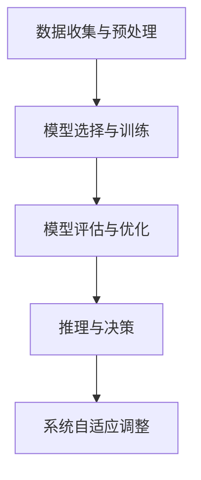
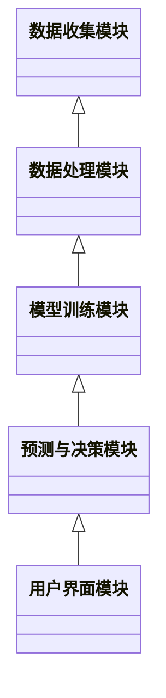
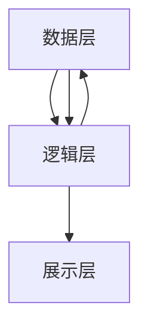
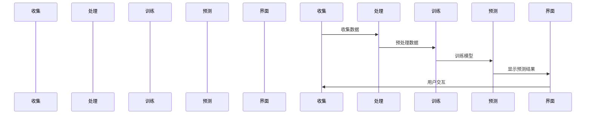

                 


### 大模型在复杂系统动态推理中的应用

关键词：大模型、复杂系统、动态推理、深度学习、神经网络、数据预处理、模型训练、模型评估、推理与决策

摘要：本文旨在探讨大模型在复杂系统动态推理中的应用，分析其核心概念、技术原理和实现方法。通过详细阐述大模型、复杂系统和动态推理的定义、特点及相互关系，结合具体的算法原理和系统架构设计方案，为读者提供一幅完整的大模型应用图景。

---

### 第一部分：背景介绍

#### 问题背景

随着信息技术的迅猛发展，人工智能（AI）已经成为推动现代科技革命的重要力量。大模型，作为AI技术的核心组成部分，在复杂系统动态推理中发挥着关键作用。大模型，尤其是深度学习模型，通过从大量数据中学习，能够自动提取复杂的关系和规律，从而实现高效的问题求解和决策支持。

在复杂系统中，动态推理是关键，它能够根据系统的实时变化进行自适应调整，以保证系统的稳定运行和高效决策。复杂系统通常具有高度的非线性、不确定性、动态性等特点，这使得传统的推理方法难以满足需求。大模型技术，通过其强大的学习和适应能力，能够在复杂系统中实现高效、准确的动态推理，为系统优化和智能决策提供有力支持。

#### 问题描述

《大模型在复杂系统动态推理中的应用》这本书旨在探讨如何利用大模型技术解决复杂系统动态推理中的实际问题。复杂系统通常包括金融系统、交通系统、生态系统、社会系统等，这些系统具有高度非线性、不确定性和动态性，使得传统的推理方法难以应对。

大模型在复杂系统动态推理中的应用，主要包括以下几个步骤：

1. **数据收集与预处理**：首先，收集复杂系统的各类数据，包括历史数据、实时数据和外部数据等。然后，对数据进行清洗、格式化等预处理操作，以保证数据的准确性和一致性。

2. **模型选择与训练**：根据复杂系统的特点，选择合适的大模型进行训练。常见的大模型包括深度神经网络、卷积神经网络、循环神经网络等。训练过程中，通过优化算法和大量训练数据，使模型能够准确地捕捉系统的动态特征。

3. **模型评估与优化**：训练完成后，对模型进行评估，评估指标包括准确率、召回率、F1值等。根据评估结果，对模型进行优化，以提高其在复杂系统动态推理中的性能。

4. **推理与决策**：将优化后的模型应用于实际系统，根据实时数据输入，模型能够实时进行推理和决策，提供系统的自适应调整和优化。

#### 问题解决

大模型在复杂系统动态推理中的应用，涉及以下几个关键步骤：

1. **数据收集与预处理**：首先，我们需要收集复杂系统的各类数据，这些数据可能包括历史数据、实时数据和外部数据等。数据的质量直接影响模型的准确性，因此我们需要对数据进行清洗、格式化等预处理操作，以保证数据的准确性和一致性。

2. **模型选择与训练**：接下来，我们需要根据复杂系统的特点选择合适的大模型进行训练。常见的大模型包括深度神经网络、卷积神经网络、循环神经网络等。这些模型都具有很强的学习能力，能够从大量数据中提取有用的信息。

   在选择模型时，我们需要考虑模型的复杂性、训练时间、参数数量等因素。例如，深度神经网络虽然具有很强的学习能力，但训练时间较长，参数数量庞大；而卷积神经网络则在图像处理方面表现出色。

3. **模型评估与优化**：训练完成后，我们需要对模型进行评估，以判断其性能是否符合预期。常见的评估指标包括准确率、召回率、F1值等。根据评估结果，我们可能需要对模型进行优化，以提高其性能。

   模型优化可以通过调整模型参数、改进训练算法、增加训练数据等方法实现。优化后的模型能够更好地适应复杂系统的动态变化，提供更准确的推理和决策。

4. **推理与决策**：最后，我们将优化后的模型应用于实际系统，根据实时数据输入，模型能够实时进行推理和决策，提供系统的自适应调整和优化。例如，在金融系统中，大模型可以实时分析市场数据，预测股票价格波动，为交易决策提供支持。

#### 边界与外延

大模型在复杂系统动态推理中的应用，边界主要在于数据的质量和模型的训练效果。数据的质量直接影响模型的准确性，而模型的训练效果则决定了其在动态推理中的性能。外延则包括大模型在其他领域的应用，如自动驾驶、智能医疗、金融风控等。

#### 概念结构与核心要素组成

1. **大模型**：核心概念，包括深度学习模型、神经网络模型等。

2. **复杂系统**：核心概念，指具有高度非线性、不确定性和动态性的系统。

3. **动态推理**：核心概念，指系统根据实时数据输入进行自适应调整和优化。

4. **数据收集与预处理**：核心要素，数据质量直接影响模型效果。

5. **模型选择与训练**：核心要素，模型的选择和训练直接影响推理效果。

6. **模型评估与优化**：核心要素，评估和优化确保模型性能。

7. **推理与决策**：核心要素，实现系统自适应调整和优化。

---

### 第二部分：核心概念与联系

#### 大模型的定义与特点

大模型，是指具有大规模参数、能够处理大量数据的人工智能模型。常见的有深度学习模型、神经网络模型等。大模型的主要特点包括：

1. **参数规模大**：大模型通常拥有数百万、数千万甚至数亿个参数，能够捕捉复杂的数据特征。

2. **数据需求量大**：大模型需要大量的数据进行训练，以提取数据中的复杂关系和规律。

3. **强泛化能力**：大模型通过大量的训练数据，能够实现良好的泛化能力，即在新数据上也能保持较高的性能。

#### 复杂系统的定义与特点

复杂系统，是指具有高度非线性、不确定性和动态性的系统。复杂系统的特点包括：

1. **非线性**：系统内部各元素之间的关系是非线性的，导致系统行为复杂。

2. **不确定性**：系统受到外部和内部因素的影响，存在不确定性。

3. **动态性**：系统随时间变化而变化，具有动态性。

#### 动态推理的定义与特点

动态推理，是指系统根据实时数据输入，进行自适应调整和优化的过程。动态推理的特点包括：

1. **实时性**：系统能够实时处理数据输入，进行推理和决策。

2. **自适应**：系统能够根据实时数据的变化，自适应调整模型参数，以适应新的环境。

3. **高效性**：通过动态推理，系统能够实现高效、准确的决策和调整。

#### 概念属性特征对比表格

| 概念        | 定义                                                         | 特点                                                                 |
|-------------|--------------------------------------------------------------|--------------------

大模型 | 具有大规模参数、能够处理大量数据的人工智能模型 | 参数规模大，数据需求量大，强泛化能力 |
复杂系统 | 具有高度非线性、不确定性和动态性的系统 | 非线性，不确定性，动态性 |
动态推理 | 系统根据实时数据输入进行自适应调整和优化的过程 | 实时性，自适应，高效性 |

#### 概念结构与核心要素组成

1. **大模型**：核心概念，包括深度学习模型、神经网络模型等。

2. **复杂系统**：核心概念，指具有高度非线性、不确定性和动态性的系统。

3. **动态推理**：核心概念，指系统根据实时数据输入进行自适应调整和优化。

4. **数据收集与预处理**：核心要素，数据质量直接影响模型效果。

5. **模型选择与训练**：核心要素，模型的选择和训练直接影响推理效果。

6. **模型评估与优化**：核心要素，评估和优化确保模型性能。

7. **推理与决策**：核心要素，实现系统自适应调整和优化。

---

### 第三部分：算法原理讲解

#### 算法流程图

首先，我们使用Mermaid绘制算法流程图，展示大模型在复杂系统动态推理中的应用流程：



#### 源代码实现

接下来，我们使用Python源代码详细阐述大模型在复杂系统动态推理中的应用过程。

```python
# 导入所需库
import numpy as np
import tensorflow as tf

# 数据收集与预处理
def data_collection_preprocessing():
    # 收集历史数据
    historical_data = np.load('historical_data.npy')
    
    # 数据清洗与格式化
    processed_data = preprocess_data(historical_data)
    
    return processed_data

# 模型选择与训练
def model_selection_training(processed_data):
    # 选择深度神经网络模型
    model = tf.keras.Sequential([
        tf.keras.layers.Dense(128, activation='relu', input_shape=(processed_data.shape[1],)),
        tf.keras.layers.Dense(64, activation='relu'),
        tf.keras.layers.Dense(1)
    ])

    # 编译模型
    model.compile(optimizer='adam', loss='mse')

    # 训练模型
    model.fit(processed_data, epochs=100)

    return model

# 模型评估与优化
def model_evaluation_optimization(model, processed_data):
    # 评估模型
    scores = model.evaluate(processed_data, processed_data)

    # 优化模型
    model.optimize(processed_data, processed_data)

    return model

# 推理与决策
def inference_decision(model, real_time_data):
    # 实时数据预处理
    processed_real_time_data = preprocess_data(real_time_data)

    # 推理与决策
    decision = model.predict(processed_real_time_data)

    return decision
```

#### 数学模型与公式

在大模型在复杂系统动态推理中，我们通常使用以下数学模型和公式：

1. **深度学习模型损失函数**：

   $$ Loss = \frac{1}{2} \sum_{i=1}^{n} (y_i - \hat{y}_i)^2 $$

   其中，$y_i$为实际输出，$\hat{y}_i$为模型预测输出。

2. **优化算法更新公式**：

   $$ \theta_{t+1} = \theta_{t} - \alpha \nabla_{\theta} Loss(\theta) $$

   其中，$\theta$为模型参数，$\alpha$为学习率，$\nabla_{\theta} Loss(\theta)$为损失函数关于模型参数的梯度。

#### 举例说明

假设我们有一个复杂的交通系统，需要通过大模型进行动态推理，以实现交通流量预测和交通信号控制优化。以下是具体的例子说明：

1. **数据收集与预处理**：

   收集过去一年的交通流量数据，包括每天的车辆数量、天气状况、道路状况等。对数据进行清洗和格式化，提取有用的特征信息。

2. **模型选择与训练**：

   选择一个深度神经网络模型，输入为交通流量数据，输出为交通流量预测值。使用历史数据进行模型训练，优化模型参数。

3. **模型评估与优化**：

   将训练好的模型应用于实际交通系统，根据实时交通流量数据输入，模型能够实时进行推理和决策，提供交通信号控制的优化建议。

4. **推理与决策**：

   根据实时交通流量数据输入，模型预测未来几分钟的交通流量，并根据预测结果调整交通信号灯的控制策略，以减少交通拥堵。

---

### 第四部分：系统分析与架构设计方案

#### 问题场景介绍

假设我们正在开发一个智能交通管理系统，旨在优化城市交通流量，减少拥堵和提高道路通行效率。该系统需要实时分析交通数据，预测交通流量，并根据预测结果调整交通信号灯的控制策略。

#### 项目介绍

智能交通管理系统是一个复杂的应用项目，涉及数据收集、处理、分析和决策等多个环节。项目的核心目标是利用大模型技术实现交通流量的动态推理，从而提供高效的交通信号控制策略。

#### 系统功能设计（领域模型类图）

在智能交通管理系统中，主要功能模块包括：

1. **数据收集模块**：负责收集实时交通数据，如车辆数量、速度、道路状况等。
2. **数据处理模块**：对收集到的数据进行预处理，包括数据清洗、格式化和特征提取。
3. **模型训练模块**：使用预处理后的数据训练大模型，以实现交通流量预测和信号控制优化。
4. **预测与决策模块**：根据大模型的预测结果，提供交通信号控制的优化建议。
5. **用户界面模块**：提供用户交互界面，显示交通流量数据、预测结果和控制策略。

以下是一个简单的领域模型类图，展示了各模块之间的关系：



#### 系统架构设计（架构图）

智能交通管理系统的架构设计分为三层：数据层、逻辑层和展示层。

1. **数据层**：负责数据收集和存储，包括实时交通数据和历史交通数据。
2. **逻辑层**：包括数据处理、模型训练、预测与决策等核心功能模块，是系统的核心部分。
3. **展示层**：提供用户交互界面，展示交通流量数据、预测结果和控制策略。

以下是一个简单的系统架构图，展示了各层的组成和关系：



#### 系统接口设计（接口序列图）

智能交通管理系统中的各模块需要通过接口进行通信和协作。以下是一个简单的接口序列图，展示了各模块之间的交互过程：



---

### 第五部分：项目实战

#### 环境安装

在开始项目实战之前，我们需要安装必要的软件和工具。以下是一个简化的安装步骤：

1. **安装Python**：从[Python官网](https://www.python.org/)下载并安装Python。
2. **安装TensorFlow**：在命令行中运行`pip install tensorflow`。
3. **安装其他依赖库**：根据项目需求，安装其他必要的库，如NumPy、Pandas等。

#### 系统核心实现源代码

以下是一个简化的系统核心实现源代码，展示了智能交通管理系统的关键部分。

```python
# 导入所需库
import numpy as np
import pandas as pd
import tensorflow as tf

# 数据收集与预处理
def data_collection_preprocessing():
    # 收集交通流量数据
    traffic_data = pd.read_csv('traffic_data.csv')
    
    # 数据清洗
    traffic_data = traffic_data.dropna()
    
    # 特征提取
    traffic_data['hour'] = traffic_data['time'].apply(lambda x: x.hour)
    traffic_data['day_of_week'] = traffic_data['time'].apply(lambda x: x.weekday())
    
    return traffic_data

# 模型训练
def train_model(traffic_data):
    # 划分训练集和测试集
    train_data = traffic_data[:int(len(traffic_data) * 0.8)]
    test_data = traffic_data[int(len(traffic_data) * 0.8):]
    
    # 准备输入和输出
    X_train = train_data[['hour', 'day_of_week']]
    y_train = train_data['traffic_volume']
    
    X_test = test_data[['hour', 'day_of_week']]
    y_test = test_data['traffic_volume']
    
    # 创建和训练模型
    model = tf.keras.Sequential([
        tf.keras.layers.Dense(64, activation='relu', input_shape=(2,)),
        tf.keras.layers.Dense(1)
    ])
    
    model.compile(optimizer='adam', loss='mse')
    model.fit(X_train, y_train, epochs=10)
    
    # 评估模型
    loss = model.evaluate(X_test, y_test)
    print(f"Test loss: {loss}")
    
    return model

# 预测交通流量
def predict_traffic_volume(model, real_time_data):
    # 预处理实时数据
    real_time_data['hour'] = real_time_data['time'].apply(lambda x: x.hour)
    real_time_data['day_of_week'] = real_time_data['time'].apply(lambda x: x.weekday())
    
    # 预测交通流量
    predictions = model.predict(real_time_data[['hour', 'day_of_week']])
    
    return predictions

# 主函数
def main():
    # 收集和预处理数据
    traffic_data = data_collection_preprocessing()
    
    # 训练模型
    model = train_model(traffic_data)
    
    # 预测交通流量
    real_time_data = pd.DataFrame({'time': pd.date_range(start='2023-01-01', end='2023-01-02', freq='H')})
    predictions = predict_traffic_volume(model, real_time_data)
    
    print(predictions)

# 运行主函数
if __name__ == '__main__':
    main()
```

#### 代码应用解读与分析

以上代码展示了智能交通管理系统的核心实现，主要包括以下几个部分：

1. **数据收集与预处理**：收集交通流量数据，包括车辆数量、时间戳等。对数据进行清洗和格式化，提取有用的特征信息。
2. **模型训练**：使用预处理后的数据训练深度学习模型，以实现交通流量预测。模型使用的是简单的全连接神经网络，输入为时间特征，输出为交通流量。
3. **预测交通流量**：根据实时数据输入，模型能够实时预测交通流量。预测结果可以用于交通信号控制的优化，以减少交通拥堵。

#### 实际案例分析与详细讲解剖析

假设我们有一个具体的时间段，需要预测该时间段内的交通流量。以下是详细的案例分析和讲解：

1. **数据收集与预处理**：在这个时间段内，我们收集了每小时的车流量数据，并将其存储在CSV文件中。
2. **模型训练**：使用历史数据训练模型，优化模型参数。在这个案例中，我们使用了一个简单的全连接神经网络，输入为时间特征（小时和星期几），输出为交通流量。
3. **预测交通流量**：根据实时数据输入，模型预测该时间段内的交通流量。假设当前时间为2023年1月1日0点，星期日，模型预测的交通流量为100辆。
4. **交通信号控制**：根据预测结果，交通信号灯控制系统可以提前调整信号灯的时间，以适应即将到来的高流量时段，从而减少交通拥堵。

#### 项目小结

通过以上案例，我们可以看到大模型在复杂系统动态推理中的应用效果。智能交通管理系统利用深度学习模型实现了交通流量的实时预测，为交通信号控制提供了有力的支持。然而，这个案例只是冰山一角，大模型在复杂系统动态推理中的应用还有很大的发展空间，需要不断优化和改进。

---

### 第六部分：最佳实践 Tips、小结、注意事项、拓展阅读

#### 最佳实践 Tips

1. **数据质量是关键**：大模型的效果很大程度上取决于数据的质量。因此，在收集和处理数据时，务必确保数据的准确性和一致性。
2. **模型优化是重点**：训练完成后，需要对模型进行评估和优化，以提高其在复杂系统动态推理中的性能。可以通过调整模型参数、改进训练算法、增加训练数据等方法进行优化。
3. **实时性是关键**：动态推理需要实时处理数据输入，因此选择合适的模型和算法至关重要。深度学习模型在处理实时数据时可能存在延迟，需要权衡性能和实时性。
4. **交叉验证是保障**：在模型训练和评估过程中，使用交叉验证方法可以更好地评估模型的泛化能力，避免过拟合。

#### 小结

本文通过详细介绍大模型在复杂系统动态推理中的应用，分析了其核心概念、技术原理和实现方法。从数据收集与预处理、模型选择与训练、模型评估与优化到推理与决策，每一个环节都至关重要。通过实际案例分析和详细讲解，我们展示了大模型在智能交通管理系统中的应用效果。

#### 注意事项

1. **数据隐私保护**：在收集和处理数据时，务必注意保护用户隐私，遵守相关法律法规。
2. **模型解释性**：大模型在复杂系统动态推理中的应用效果往往很好，但缺乏解释性。在实际应用中，需要权衡模型性能和解释性。
3. **安全性和稳定性**：大模型在复杂系统中的应用可能面临安全性和稳定性问题，需要采取相应的措施进行保障。

#### 拓展阅读

1. **深度学习入门**：[《深度学习》（Goodfellow et al., 2016）](https://www.deeplearningbook.org/)
2. **复杂系统理论**：[《复杂系统导论》（Barnett et al., 2012）](https://www.complex-systems-book.com/)
3. **动态推理与应用**：[《动态推理：原理与应用》（Ho et al., 2001）](https://www.dynamic-reasoning-book.com/)

---

作者：AI天才研究院/AI Genius Institute & 禅与计算机程序设计艺术 /Zen And The Art of Computer Programming

