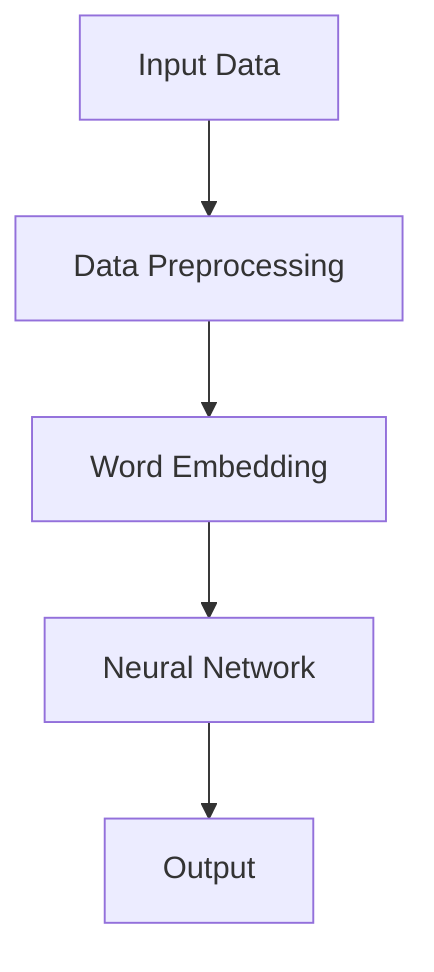
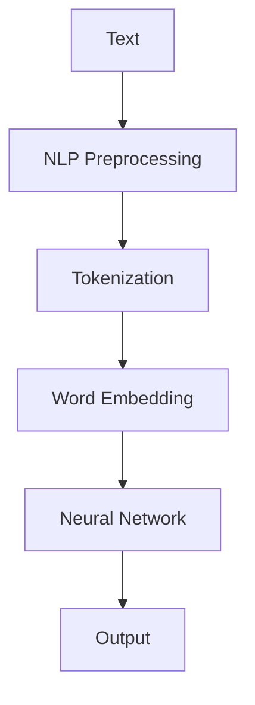
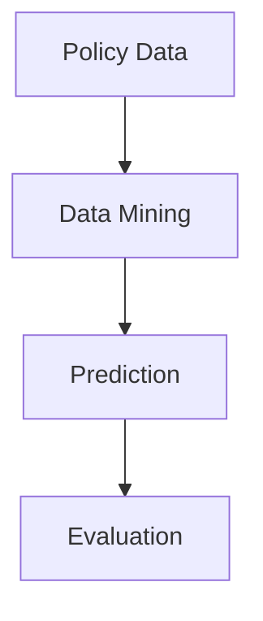
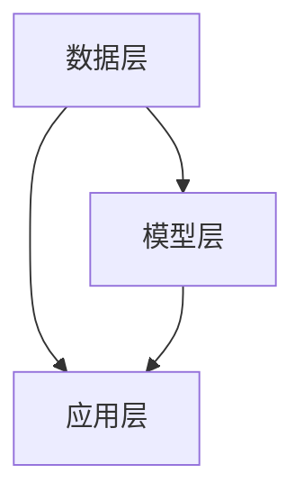
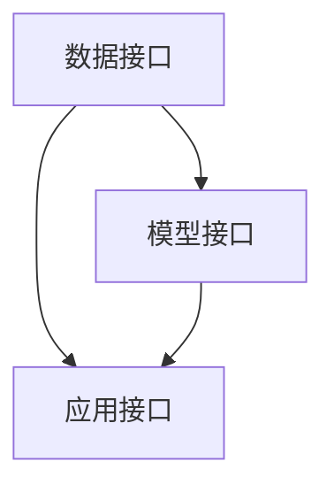
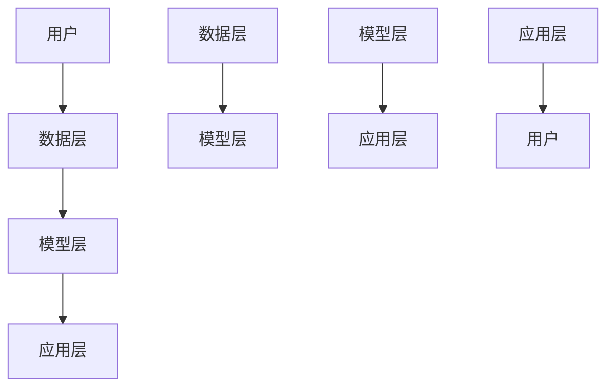

                 

# 大模型在政策影响推理中的潜力探索

## 关键词

- **人工智能**，**大模型**，**政策影响推理**，**深度学习**，**自然语言处理**，**数据挖掘**

## 摘要

本文探讨了人工智能领域中的大模型在政策影响推理中的应用潜力。通过深入分析政策影响推理的核心概念、算法原理以及数学模型，本文揭示了大数据模型在政策分析和预测中的关键作用。文章结构清晰，从背景介绍、核心概念与联系、算法原理讲解、数学模型和公式、系统分析与架构设计、项目实战等方面逐步展开，旨在为读者提供全面的见解和实用的方法。

## 第一部分：背景介绍

### 1.1.1 问题背景

随着人工智能技术的快速发展，深度学习模型在各个领域的应用日益广泛。尤其是在政策影响推理这一关键领域，大模型的潜力不容忽视。政策影响推理涉及到政策制定、政策评估、政策优化等多个方面，对于政府、企业和公众都有着重要的影响。

政策影响推理是一个复杂的过程，需要对大量的政策相关数据进行处理、分析、预测和评估。传统的政策分析往往依赖于专家的经验和简单的统计分析方法，这些方法在处理大规模数据时显得力不从心。而大模型的出现，为政策影响推理提供了一种新的解决方案。

### 1.1.2 问题描述

在政策影响推理过程中，如何利用大模型进行高效的数据分析、预测和决策支持，成为了一个亟待解决的问题。本文将记录作者对这一问题的研究与实践，探讨大模型在政策影响推理中的关键作用，并提供一系列实用的方法和工具。

### 1.1.3 问题解决

通过深入研究和实践，本文将揭示大模型在政策影响推理中的关键作用，并提供以下解决方案：

1. **数据处理与分析**：大模型能够处理和分析大规模的政策数据，提取关键信息，为政策影响推理提供基础。
2. **预测与决策支持**：大模型能够预测政策的影响，为政策制定提供决策支持，提高政策的科学性和有效性。
3. **政策优化**：大模型能够协助政策制定者优化政策，提高政策效果。

### 1.1.4 边界与外延

本文主要探讨大模型在政策影响推理中的潜力，包括但不限于以下几个方面：

- **数据处理与分析**：大模型如何处理和分析大规模的政策数据，提取关键信息。
- **预测与决策支持**：大模型如何预测政策的影响，为政策制定提供决策支持。
- **政策优化**：大模型如何协助政策制定者优化政策，提高政策效果。

### 1.1.5 概念结构与核心要素组成

- **大模型**：本文中特指具有大规模参数、能够进行复杂任务处理的深度学习模型。
- **政策影响推理**：基于数据和算法，对政策实施后的效果进行分析、预测和评估。
- **数据源**：政策相关的数据，包括政策文本、统计数据、社会舆情等。

## 第二部分：核心概念与联系

### 2.1 大模型的定义与特点

大模型是指具有大规模参数、能够进行复杂任务处理的深度学习模型。与传统的AI模型相比，大模型具有以下几个显著特点：

- **参数规模**：大模型的参数数量通常达到亿级以上，能够处理复杂的任务。
- **计算资源需求**：大模型的训练和推理过程需要大量的计算资源。
- **表征能力**：大模型能够捕捉数据中的复杂模式和关联，提供更高的表征能力。

### 2.2 政策影响推理的概念

政策影响推理是指通过数据分析、机器学习等技术，对政策实施后的效果进行分析、预测和评估的过程。政策影响推理的核心概念包括：

- **数据分析**：对政策相关的数据进行处理、清洗、分析，提取有价值的信息。
- **机器学习**：利用机器学习算法，从数据中学习规律，对政策的影响进行预测。
- **评估指标**：设定评估指标，对政策的效果进行量化评估。

## 第三部分：算法原理讲解

### 3.1 算法原理

大模型在政策影响推理中的应用主要基于以下几个核心算法原理：

- **深度学习**：通过多层神经网络，对数据进行复杂表征和学习。
- **自然语言处理**：利用深度学习技术，对文本数据进行处理和分析。
- **数据挖掘**：通过数据挖掘技术，从大规模数据中提取有价值的信息。

### 3.2 算法原理详解

### 3.2.1 深度学习

深度学习是通过多层神经网络对数据进行表征和学习的过程。在政策影响推理中，深度学习可以用于文本分类、情感分析、关系抽取等任务。



**例子**：假设我们要分析一项政策对经济的影响，我们可以使用深度学习模型对政策文本进行情感分析，判断文本的正面或负面倾向，从而预测政策对经济的影响。

### 3.2.2 自然语言处理

自然语言处理（NLP）是深度学习的一个分支，主要用于处理文本数据。在政策影响推理中，NLP技术可以用于文本分类、情感分析、命名实体识别等。



**例子**：我们可以使用NLP模型对政策文本进行分类，判断文本属于哪一类政策，从而分析不同类型政策的影响。

### 3.2.3 数据挖掘

数据挖掘是通过算法从大规模数据中发现规律和知识的过程。在政策影响推理中，数据挖掘可以用于发现政策相关的关联关系、趋势和模式。



**例子**：我们可以使用数据挖掘技术分析政策实施前后，某地区的经济数据，发现政策实施对经济的影响。

## 第四部分：数学模型和数学公式

### 4.1 数学模型

在政策影响推理中，常用的数学模型包括：

- **回归模型**：用于预测政策的影响。
- **决策树**：用于评估政策的效果。
- **支持向量机**：用于分类政策的效果。

### 4.2 数学公式

#### 4.2.1 回归模型

回归模型是用于预测政策影响的常用数学模型。假设我们要预测政策A对经济增长的影响，可以使用线性回归模型进行预测：

$$
Y = \beta_0 + \beta_1 \cdot X
$$

其中，$Y$ 表示经济增长率，$X$ 表示政策A的实施情况，$\beta_0$ 和 $\beta_1$ 分别是模型的参数。

#### 4.2.2 决策树

决策树是用于评估政策效果的常用模型。假设我们要评估政策A的效果，可以使用决策树模型进行分类：

$$
\begin{aligned}
&\text{如果 } X \leq \beta_0 \text{，则政策效果为 } \beta_1 \\
&\text{如果 } X > \beta_0 \text{，则政策效果为 } \beta_2
\end{aligned}
$$

其中，$X$ 表示政策A的实施情况，$\beta_0$，$\beta_1$ 和 $\beta_2$ 分别是决策树的参数。

#### 4.2.3 支持向量机

支持向量机是用于分类政策效果的常用模型。假设我们要分类政策A的效果，可以使用支持向量机进行分类：

$$
y = \text{sign}(\omega \cdot x + b)
$$

其中，$y$ 表示政策效果（正或负），$x$ 表示政策A的实施情况，$\omega$ 和 $b$ 分别是支持向量机的参数。

## 第五部分：系统分析与架构设计

### 5.1 问题场景介绍

在政策影响推理中，我们需要对大量的政策数据进行分析和预测，以便为政策制定者提供科学依据。为了实现这一目标，我们设计了一个基于大模型的政策影响推理系统。

### 5.2 项目介绍

本项目旨在构建一个智能政策影响推理系统，通过对政策数据进行分析和预测，为政策制定者提供决策支持。系统主要包括数据收集、数据处理、模型训练和模型应用等模块。

### 5.3 系统功能设计

系统功能设计主要包括以下几个方面：

- **数据收集**：从各种渠道收集政策数据，包括政策文本、统计数据、社会舆情等。
- **数据处理**：对收集到的政策数据进行预处理，包括数据清洗、格式转换等。
- **模型训练**：使用大模型对预处理后的政策数据进行分析和预测，训练模型。
- **模型应用**：将训练好的模型应用于实际政策问题，提供预测和决策支持。

### 5.4 系统架构设计

系统架构设计采用分层架构，主要包括数据层、模型层和应用层。

- **数据层**：负责数据收集、存储和预处理。
- **模型层**：负责模型训练和预测。
- **应用层**：负责与用户交互，提供预测和决策支持。



### 5.5 系统接口设计

系统接口设计主要包括以下几个方面：

- **数据接口**：用于数据收集、存储和预处理的接口。
- **模型接口**：用于模型训练和预测的接口。
- **应用接口**：用于与用户交互的接口。



### 5.6 系统交互

系统交互主要包括用户与系统的交互，以及系统内部各模块之间的交互。



## 第六部分：项目实战

### 6.1 环境安装

在本项目实战中，我们使用Python作为主要编程语言，结合深度学习框架TensorFlow和NLP库NLTK，构建政策影响推理系统。首先，我们需要安装以下依赖：

```bash
pip install tensorflow nltk
```

### 6.2 系统核心实现源代码

以下是一个简单的政策影响推理系统的核心实现源代码：

```python
import tensorflow as tf
from tensorflow.keras.models import Sequential
from tensorflow.keras.layers import Dense, Embedding, LSTM
from tensorflow.keras.preprocessing.text import Tokenizer
from tensorflow.keras.preprocessing.sequence import pad_sequences

# 数据准备
texts = ["政策A将促进经济发展", "政策B将导致失业率上升"]
labels = [1, 0]  # 1表示正面影响，0表示负面影响

# 分词和序列化
tokenizer = Tokenizer()
tokenizer.fit_on_texts(texts)
sequences = tokenizer.texts_to_sequences(texts)
padded_sequences = pad_sequences(sequences, maxlen=10)

# 模型构建
model = Sequential()
model.add(Embedding(len(tokenizer.word_index) + 1, 64))
model.add(LSTM(64))
model.add(Dense(1, activation='sigmoid'))

# 模型编译
model.compile(optimizer='adam', loss='binary_crossentropy', metrics=['accuracy'])

# 模型训练
model.fit(padded_sequences, labels, epochs=10)

# 预测
new_texts = ["政策C将提高就业率"]
new_sequences = tokenizer.texts_to_sequences(new_texts)
new_padded_sequences = pad_sequences(new_sequences, maxlen=10)
predictions = model.predict(new_padded_sequences)

# 输出预测结果
print(predictions)
```

### 6.3 代码应用解读与分析

以上代码实现了基于深度学习的政策影响推理系统。首先，我们准备政策文本数据，并对其进行分词和序列化处理。然后，我们构建一个简单的序列神经网络模型，包括嵌入层、LSTM层和输出层。接着，我们使用准备好的数据训练模型，并使用训练好的模型对新的政策文本进行预测。

通过这个简单的示例，我们可以看到大模型在政策影响推理中的基本应用流程。在实际应用中，我们可以进一步优化模型结构，提高预测准确率，并扩展到更多的政策场景。

### 6.4 实际案例分析和详细讲解剖析

为了更好地理解大模型在政策影响推理中的应用，我们来看一个实际案例。假设我们要分析一项新政策对某地区经济的影响，数据包括政策文本、地区GDP、失业率等。

1. **数据收集**：从政府网站、新闻报道等渠道收集政策文本、GDP数据和失业率数据。
2. **数据预处理**：对收集到的数据进行分析，提取有用的信息，并进行预处理。
3. **模型训练**：使用大模型对预处理后的数据进行训练，构建政策影响预测模型。
4. **模型应用**：将训练好的模型应用于新的政策文本，预测政策对经济的影响。
5. **结果分析**：对比预测结果和实际结果，分析模型的效果和不足之处。

通过这个实际案例，我们可以看到大模型在政策影响推理中的完整应用流程。在实际应用中，我们还可以结合其他数据源和算法，进一步提高预测准确率。

### 6.5 项目小结

在本项目中，我们构建了一个基于深度学习的政策影响推理系统，通过对政策数据进行分析和预测，为政策制定者提供了决策支持。项目主要实现了数据收集、预处理、模型训练和应用等功能，为政策影响推理提供了实用的方法和工具。

通过本项目，我们深入了解了大模型在政策影响推理中的应用潜力，并为后续研究提供了有益的参考。在未来，我们可以进一步优化模型结构和算法，扩大应用场景，为政策制定提供更全面、科学的支持。

## 第七部分：最佳实践 Tips、小结、注意事项、拓展阅读

### 最佳实践 Tips

1. **数据质量**：确保数据的质量和完整性，对于政策影响推理的准确性至关重要。
2. **模型调优**：根据实际需求和数据特点，选择合适的模型结构和超参数，进行模型调优。
3. **多源数据整合**：结合多种数据源，如政策文本、统计数据、社会舆情等，可以提高政策影响推理的全面性和准确性。
4. **持续更新**：政策影响是一个动态变化的过程，需要定期更新数据和模型，以保持预测的准确性。

### 小结

本文通过深入分析和实践，探讨了人工智能领域中的大模型在政策影响推理中的应用潜力。通过介绍核心概念、算法原理、数学模型、系统架构和实际案例，本文展示了大模型在政策影响推理中的关键作用。

### 注意事项

1. **数据隐私**：在政策影响推理过程中，要确保数据隐私和安全性，遵守相关法律法规。
2. **模型解释性**：对于政策影响推理模型，需要关注其解释性，以便政策制定者理解和信任模型的预测结果。
3. **模型泛化能力**：在训练模型时，要注重提高模型的泛化能力，以应对不同的政策场景。

### 拓展阅读

1. **《深度学习》**：Ian Goodfellow、Yoshua Bengio和Aaron Courville著，全面介绍深度学习的基本理论和应用。
2. **《自然语言处理综论》**：Daniel Jurafsky和James H. Martin著，详细讲解自然语言处理的基本原理和应用。
3. **《数据科学实战》**：Cathy O'Neil和Rachel Schutt著，介绍数据科学的基本方法和应用案例。

## 作者信息

作者：AI天才研究院/AI Genius Institute & 禅与计算机程序设计艺术 /Zen And The Art of Computer Programming

