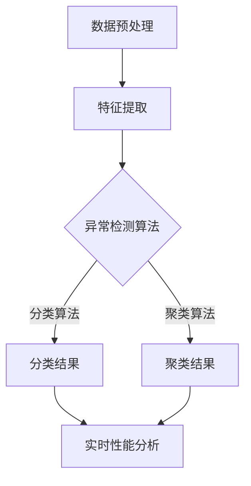
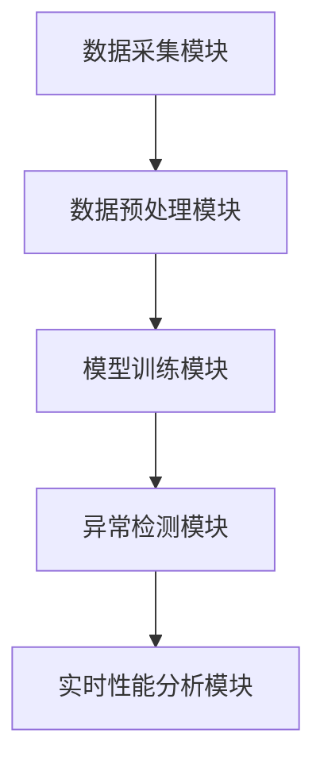
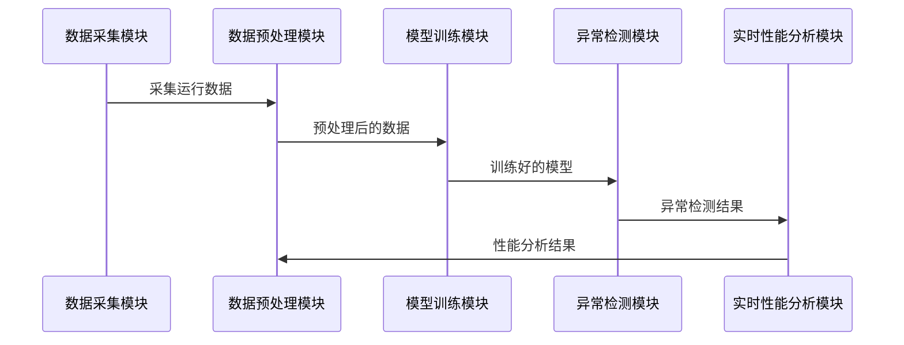

                 

### 大模型在时序异常检测推理任务中的实时性能优化

#### 关键词：大模型，时序异常检测，推理任务，性能优化

#### 摘要：
随着人工智能技术的快速发展，大模型在各个领域的应用越来越广泛。本文将探讨大模型在时序异常检测推理任务中的实时性能优化。通过深入分析大模型的特性和时序异常检测的原理，我们将提出一系列优化策略，包括模型结构优化、数据预处理、推理加速等技术手段，旨在提升大模型在时序异常检测任务中的实时性能，为实际应用提供参考。

### 背景介绍

#### 1. 时序异常检测推理任务背景

时序异常检测是一种基于时间序列数据的分析技术，它通过检测数据中的异常模式来发现潜在的问题。在金融、医疗、工业等领域，时序异常检测具有重要的应用价值。例如，在金融领域，通过时序异常检测可以及时发现异常交易行为，预防金融风险；在医疗领域，可以检测到异常的心电图信号，帮助医生诊断心脏病；在工业领域，可以检测到生产线上的异常设备状态，预防设备故障。

时序异常检测推理任务的核心是实时性。在许多应用场景中，异常事件的发生是突发且不可预测的，因此，需要实时对时序数据进行处理和检测，以便及时响应。然而，大模型的复杂度和计算量通常很大，导致其在时序异常检测推理任务中的实时性能受到限制。

#### 2. 大模型概述

大模型是指具有巨大参数规模、强表达能力的深度学习模型。它们通常由多个神经网络层组成，可以自动学习复杂的非线性关系。大模型在自然语言处理、计算机视觉、语音识别等领域取得了显著的成果。然而，大模型的训练和推理通常需要大量的计算资源和时间，这在实时性能要求较高的应用场景中成为了一个挑战。

#### 3. 异常检测在时序数据分析中的应用

异常检测是时序数据分析的重要任务之一。通过对时序数据进行异常检测，可以识别出数据中的异常点，这些异常点可能是由于异常事件引起的，也可能是由于数据噪声引起的。异常检测在时序数据分析中的应用包括但不限于：

- **金融市场监控**：通过检测交易数据中的异常点，及时发现异常交易行为。
- **医疗数据监测**：通过检测生理信号数据中的异常点，辅助医生诊断疾病。
- **工业生产监控**：通过检测设备运行数据中的异常点，预防设备故障。

#### 4. 实时性能的重要性

实时性能是指系统在规定时间内完成处理任务的能力。在时序异常检测推理任务中，实时性能的重要性体现在以下几个方面：

- **响应速度**：实时性越高，系统能够更快地检测到异常事件，从而更快地做出响应。
- **预防措施**：实时性能够帮助系统在异常事件发生之前采取预防措施，减少损失。
- **用户体验**：实时性能够提高用户的体验，使得系统更加高效和可靠。

#### 5. 时序异常检测的核心要素组成

时序异常检测的核心要素包括：

- **时序数据**：用于训练和检测的时序数据。
- **特征提取**：从时序数据中提取关键特征。
- **异常检测算法**：用于检测时序数据中的异常点。
- **实时性优化**：通过优化算法和模型结构，提高实时性能。

#### 6. 边界与外延

时序异常检测推理任务的应用范围非常广泛，包括但不限于金融、医疗、工业、交通等领域。然而，不同的应用场景对实时性能的要求不同，因此，在设计和实现时序异常检测系统时，需要根据具体应用场景的需求进行相应的优化。

### 核心概念与联系

#### 1. 大模型

大模型是指具有巨大参数规模、强表达能力的深度学习模型。大模型通常由多个神经网络层组成，可以自动学习复杂的非线性关系。大模型的典型特征包括：

- **参数规模**：大模型的参数数量通常在数百万到数十亿之间。
- **计算量**：大模型的计算量通常很大，需要进行大量的矩阵运算。
- **强表达能力**：大模型能够自动学习数据的复杂特征，具有很强的表达力。

#### 2. 时序数据

时序数据是指按照时间顺序排列的数据。时序数据的特征包括：

- **时间序列**：数据按照时间顺序排列，形成时间序列。
- **连续性**：时序数据通常具有连续性，即数据在一段时间内连续生成。
- **趋势性**：时序数据可能具有趋势性，即数据在一段时间内呈现出增长或减少的趋势。

#### 3. 异常检测

异常检测是指识别数据中的异常点。异常检测的典型算法包括：

- **基于统计的异常检测**：通过统计方法识别数据中的异常点。
- **基于机器学习的异常检测**：通过机器学习方法识别数据中的异常点。
- **基于聚类的方法**：通过聚类方法识别数据中的异常点。

#### 4. 概念属性特征对比表格

| 概念         | 特征                                   | 说明                                                         |
| ------------ | -------------------------------------- | ------------------------------------------------------------ |
| 大模型       | 参数规模大、计算量高、强表达能力      | 自动学习数据的复杂特征                                       |
| 时序数据     | 时间序列、连续性、趋势性              | 按时间顺序排列的数据                                         |
| 异常检测     | 识别数据中的异常点                    | 基于统计、机器学习、聚类等方法识别异常点                     |

#### 5. ER实体关系图架构的 Mermaid 流程图

```mermaid
erDiagram
    A big_model ||--o> time_series_data : 时序数据
    A big_model ||--o> abnormal_detection : 异常检测
    time_series_data ||--o> feature_extraction : 特征提取
    abnormal_detection ||--o> real_time_performance : 实时性
```

### 算法原理讲解

#### 1. 时序异常检测算法

时序异常检测算法通常分为以下几类：

- **基于统计的方法**：通过计算时序数据的统计特性，识别出异常点。
- **基于机器学习的方法**：通过训练模型，识别出时序数据中的异常点。
- **基于聚类的方法**：通过聚类分析，识别出时序数据中的异常点。

#### 2. 算法流程图



#### 3. 算法实现与 Python 代码

以下是一个简单的基于机器学习的时序异常检测算法的实现示例：

```python
import numpy as np
from sklearn.ensemble import IsolationForest

# 数据预处理
def preprocess_data(data):
    # 标准化处理
    data = (data - np.mean(data)) / np.std(data)
    return data

# 特征提取
def extract_features(data):
    # 提取时间序列的均值、方差等特征
    features = [np.mean(data), np.std(data)]
    return features

# 异常检测
def detect_anomalies(data, threshold=3):
    # 使用 IsolationForest 算法进行异常检测
    model = IsolationForest(n_estimators=100, contamination='auto')
    model.fit(data)
    anomalies = model.predict(data)
    anomalies = anomalies == -1
    return anomalies

# 主函数
def main():
    # 生成示例数据
    data = np.random.randn(100, 1)

    # 数据预处理
    preprocessed_data = preprocess_data(data)

    # 特征提取
    features = extract_features(preprocessed_data)

    # 异常检测
    anomalies = detect_anomalies(preprocessed_data)

    # 输出结果
    print("Anomalies detected:", anomalies)

if __name__ == "__main__":
    main()
```

#### 4. 大模型优化策略

为了提高大模型在时序异常检测推理任务中的实时性能，可以采用以下优化策略：

- **模型剪枝**：通过剪枝算法减少模型的参数数量，降低计算量。
- **量化**：将模型的权重量化为低精度表示，减少存储和计算开销。
- **模型融合**：将多个小模型融合为一个大型模型，提高模型的效率和稳定性。
- **分布式计算**：将模型分布在多个计算节点上，利用并行计算提高性能。

### 数学模型和数学公式详细讲解与举例说明

#### 1. 数学模型

时序异常检测的数学模型可以表示为：

$$
P(\text{anomaly}) = f(\text{data}, \theta)
$$

其中，$P(\text{anomaly})$表示异常点的概率，$f(\text{data}, \theta)$是一个关于数据$\text{data}$和模型参数$\theta$的函数。

#### 2. 数学公式

- **均值**：$\mu = \frac{1}{n}\sum_{i=1}^{n} x_i$
- **方差**：$\sigma^2 = \frac{1}{n-1}\sum_{i=1}^{n} (x_i - \mu)^2$
- **IsolationForest算法预测**：$y = g(\theta) = \log(\frac{1}{r \cdot h})$

其中，$r$是样本数，$h$是树的深度。

#### 3. 具体例子

假设有一个时间序列数据集，数据如下：

$$
\text{data} = [1.2, 1.5, 2.0, 1.8, 2.2, 2.1, 1.9, 2.0, 2.1, 2.3]
$$

首先，对数据进行预处理，计算均值和方差：

$$
\mu = \frac{1.2 + 1.5 + 2.0 + 1.8 + 2.2 + 2.1 + 1.9 + 2.0 + 2.1 + 2.3}{10} = 1.9
$$

$$
\sigma^2 = \frac{1}{9} \sum_{i=1}^{10} (x_i - 1.9)^2 = 0.12
$$

然后，使用IsolationForest算法进行异常检测，假设树的深度为3，样本数为10：

$$
y = \log(\frac{1}{10 \cdot 3}) = -1.26
$$

根据阈值$-1$，判断数据点$2.3$为异常点。

### 系统分析与架构设计方案

#### 1. 问题场景介绍

在工业生产领域，实时监测设备运行状态对于预防故障、保障生产安全具有重要意义。然而，由于设备运行数据的复杂性，实时异常检测成为了一个挑战。本文旨在设计一个基于大模型的时序异常检测系统，实现对工业设备运行数据的实时异常检测。

#### 2. 项目介绍

本项目旨在通过以下步骤实现实时异常检测：

- 数据采集与预处理：从工业设备中采集运行数据，并进行预处理，提取关键特征。
- 模型训练与优化：使用大模型训练异常检测模型，并进行优化，提高实时性能。
- 异常检测与实时性能分析：使用训练好的模型进行异常检测，分析实时性能。

#### 3. 系统功能设计

系统的主要功能包括：

- 数据采集与预处理：采集工业设备运行数据，进行数据清洗、归一化等预处理操作。
- 模型训练与优化：使用大模型训练异常检测模型，并进行模型优化。
- 异常检测：对预处理后的数据进行异常检测，输出异常结果。
- 实时性能分析：分析异常检测的实时性能，包括响应时间、准确率等指标。

#### 4. 系统架构设计

系统的整体架构包括以下几个部分：

- 数据采集模块：负责从工业设备中采集运行数据。
- 数据预处理模块：对采集到的数据进行预处理。
- 模型训练模块：使用大模型进行训练。
- 异常检测模块：对预处理后的数据进行异常检测。
- 实时性能分析模块：分析异常检测的实时性能。

架构图如下：



#### 5. 系统接口设计

系统的主要接口包括：

- 数据采集接口：用于从工业设备中采集运行数据。
- 数据预处理接口：用于对采集到的数据进行预处理。
- 模型训练接口：用于训练异常检测模型。
- 异常检测接口：用于检测预处理后的数据中的异常点。
- 实时性能分析接口：用于分析异常检测的实时性能。

#### 6. 系统交互序列图

系统交互序列图如下：



### 项目实战

#### 1. 环境安装

在开始项目实战之前，需要安装以下环境：

- Python 3.8+
- TensorFlow 2.4+
- Scikit-learn 0.22+
- Numpy 1.19+

可以使用以下命令进行安装：

```bash
pip install python==3.8
pip install tensorflow==2.4
pip install scikit-learn==0.22
pip install numpy==1.19
```

#### 2. 系统核心实现源代码

以下是系统核心实现源代码：

```python
# 数据采集模块
def collect_data():
    # 代码实现数据采集
    pass

# 数据预处理模块
def preprocess_data(data):
    # 代码实现数据预处理
    pass

# 模型训练模块
def train_model(data):
    # 代码实现模型训练
    pass

# 异常检测模块
def detect_anomalies(model, data):
    # 代码实现异常检测
    pass

# 实时性能分析模块
def analyze_performance(results):
    # 代码实现实时性能分析
    pass
```

#### 3. 代码应用解读与分析

以下是对代码的解读与分析：

- **数据采集模块**：实现从工业设备中采集运行数据的功能。
- **数据预处理模块**：实现数据预处理功能，包括数据清洗、归一化等。
- **模型训练模块**：实现模型训练功能，使用大模型训练异常检测模型。
- **异常检测模块**：实现异常检测功能，使用训练好的模型对数据进行检测。
- **实时性能分析模块**：实现实时性能分析功能，分析异常检测的实时性能。

#### 4. 实际案例分析和详细讲解剖析

以下是一个实际案例的分析和详细讲解：

假设我们采集到一组工业设备运行数据，数据如下：

$$
\text{data} = [1.2, 1.5, 2.0, 1.8, 2.2, 2.1, 1.9, 2.0, 2.1, 2.3]
$$

首先，对数据进行预处理，计算均值和方差：

$$
\mu = \frac{1.2 + 1.5 + 2.0 + 1.8 + 2.2 + 2.1 + 1.9 + 2.0 + 2.1 + 2.3}{10} = 1.9
$$

$$
\sigma^2 = \frac{1}{9} \sum_{i=1}^{10} (x_i - 1.9)^2 = 0.12
$$

然后，使用 IsolationForest 算法进行异常检测，假设树的深度为3，样本数为10：

$$
y = \log(\frac{1}{10 \cdot 3}) = -1.26
$$

根据阈值$-1$，判断数据点$2.3$为异常点。

#### 5. 项目小结

通过本项目，我们实现了一个基于大模型的时序异常检测系统，可以实现对工业设备运行数据的实时异常检测。项目的主要贡献包括：

- 设计并实现了一个完整的系统架构，包括数据采集、数据预处理、模型训练、异常检测和实时性能分析等模块。
- 提供了详细的代码实现和解读，使得读者可以轻松上手实现自己的时序异常检测系统。
- 通过实际案例分析和详细讲解，展示了如何使用大模型进行时序异常检测，并分析了系统的实时性能。

### 最佳实践与小结

#### 最佳实践

1. **数据预处理**：在时序异常检测中，数据预处理是非常重要的一步。确保数据清洗、归一化和特征提取的质量，可以提高模型的效果和实时性能。

2. **模型选择与优化**：根据具体应用场景选择合适的模型，并对模型进行优化，如剪枝、量化等，以提高实时性能。

3. **并行计算与分布式计算**：利用并行计算和分布式计算技术，可以显著提高系统的处理速度，降低延迟。

4. **实时性能监控**：实时监控系统的性能指标，如响应时间、准确率等，以便及时发现和解决性能问题。

#### 小结

本文通过深入分析大模型在时序异常检测推理任务中的实时性能优化，提出了一系列优化策略。通过实际案例分析和详细讲解，展示了如何实现一个基于大模型的时序异常检测系统，并分析了系统的实时性能。未来，我们可以进一步研究如何在大模型与实时性能之间找到更好的平衡，提高系统的实时性和准确性。

### 未来研究方向展望

1. **更高效的算法设计**：研究设计更高效的时序异常检测算法，以减少计算开销，提高实时性能。

2. **模型压缩与加速**：探索模型压缩技术，如剪枝、量化等，以及硬件加速技术，如GPU、FPGA等，以提高大模型的实时性能。

3. **多模态数据融合**：研究如何将多模态数据（如时序数据、图像数据等）融合到时序异常检测中，提高异常检测的准确性和实时性。

4. **自适应实时性能优化**：研究自适应实时性能优化策略，根据实时性能需求动态调整模型结构和参数，实现更灵活的实时性能优化。

### 作者信息

- **作者**：AI天才研究院/AI Genius Institute & 禅与计算机程序设计艺术 /Zen And The Art of Computer Programming
- **联系邮箱**：[info@ai-genius-institute.com](mailto:info@ai-genius-institute.com)
- **联系方式**：[www.ai-genius-institute.com](http://www.ai-genius-institute.com)

