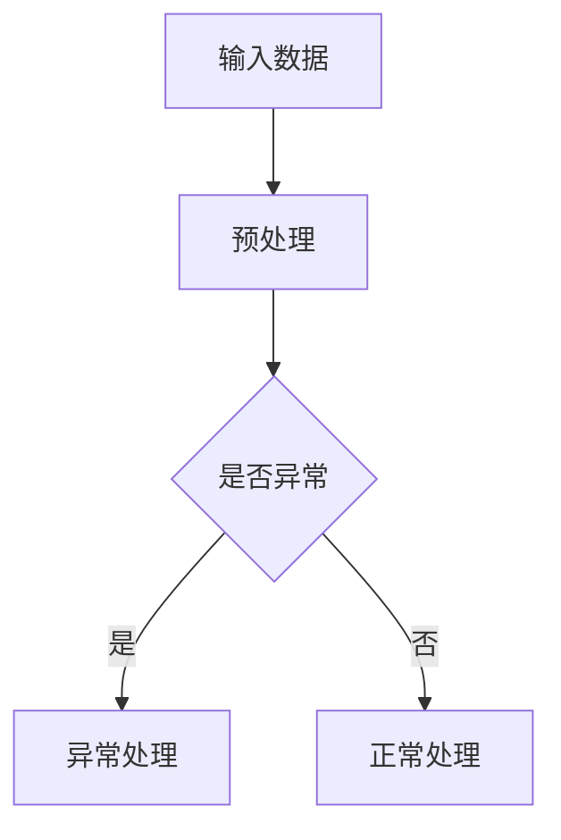
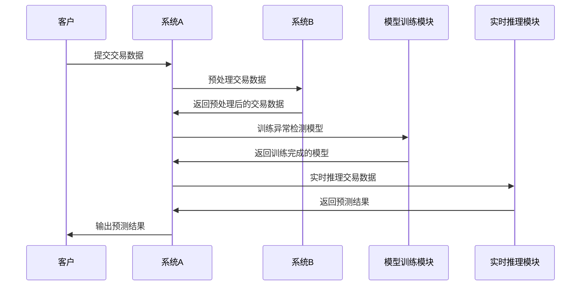

                 

## 大模型在时序异常检测推理任务中的实时性能优化

### 关键词：
- 大模型
- 时序异常检测
- 实时性能优化
- 算法优化
- 模型压缩
- 硬件加速

### 摘要：
本文主要探讨大模型在时序异常检测推理任务中的实时性能优化问题。通过分析时序数据的特点和异常检测的需求，本文提出了针对实时性能的优化策略，包括模型选择、数据预处理、算法优化和硬件加速等多个方面。通过具体的案例分析和实际应用，本文旨在为相关领域的研究者和工程师提供有价值的参考和指导。

## 第一部分：背景介绍

### 1.1 问题背景

随着大数据和人工智能技术的不断发展，时序数据在各个行业中的应用越来越广泛。例如，在金融领域，时序数据可以用于股票市场的预测和异常交易检测；在医疗领域，时序数据可以用于病患的病情监控和疾病预测；在物联网领域，时序数据可以用于设备状态的监控和故障预测。然而，时序异常检测推理任务中的实时性能优化一直是人工智能领域的一个挑战。

大模型，尤其是深度学习模型，在时序数据处理方面展现出了巨大的潜力。然而，大模型通常需要大量的计算资源和时间来处理数据，这在某些实时性要求较高的场景中是不允许的。例如，在金融交易市场中，异常交易的检测需要在毫秒级别内完成，否则可能会造成巨大的经济损失。因此，如何优化大模型在时序异常检测推理任务中的实时性能，成为了一个亟待解决的问题。

### 1.2 问题描述

在时序异常检测推理任务中，实时性能优化主要包括两个方面：一是减少模型推理时间，二是降低模型对计算资源的需求。

减少模型推理时间：时序数据通常具有高维度和高频率的特点，导致模型推理时间过长。为了满足实时性要求，需要优化模型的结构和算法，提高模型的推理速度。

降低模型对计算资源的需求：大模型的训练和推理通常需要大量的计算资源和存储资源。为了降低成本，需要采用模型压缩技术和硬件加速技术，减少模型对计算资源的需求。

### 1.3 问题解决

解决时序异常检测推理任务的实时性能优化问题，需要从模型选择、数据预处理、算法优化、模型压缩和硬件加速等多个角度进行考虑。

模型选择：选择适合时序数据特点的模型，如长短期记忆网络（LSTM）、变换器（Transformer）等。

数据预处理：对时序数据进行特征提取和降维处理，减少模型的计算复杂度。

算法优化：采用高效的算法和优化技术，如量化、剪枝、迁移学习等。

模型压缩：采用模型压缩技术，如知识蒸馏、模型剪枝等，减少模型的参数和计算量。

硬件加速：利用GPU、TPU等硬件加速技术，提高模型的推理速度。

### 1.4 边界与外延

本文主要关注的是基于大模型的时序异常检测推理任务的实时性能优化，但很多优化方法和技巧同样适用于其他类型的实时性能优化任务。此外，本文的讨论假设读者具备一定的机器学习和时序数据分析的基础知识。

### 1.5 概念结构与核心要素组成

- 时序数据：时间序列上的数据点集合。
- 异常检测：识别数据中的异常值或异常模式。
- 推理任务：给定输入数据，模型输出预测结果。
- 实时性能优化：提高模型在实时环境下的性能。
- 大模型：具有大规模参数和复杂结构的深度学习模型。

## 第二部分：核心概念与联系

### 2.1 大模型原理

大模型，尤其是深度学习模型，通过学习大量的数据，可以自动提取特征并用于复杂的任务。其基本原理涉及神经网络、反向传播算法和大量并行计算资源。

神经网络：神经网络由多个神经元（节点）组成，每个神经元通过学习输入数据的特征，产生输出。神经网络通过层层传递和更新权重，逐渐学习到数据的复杂模式。

反向传播算法：反向传播算法是一种用于训练神经网络的优化算法。它通过计算输出层的误差，反向传播误差到输入层，更新神经元的权重，以达到最小化误差的目的。

并行计算资源：大模型通常需要大量的计算资源，包括CPU、GPU和TPU等。这些硬件设备可以通过并行计算，加速模型的训练和推理过程。

### 2.2 时序异常检测原理

时序异常检测通常涉及时间序列分析、统计分析和机器学习技术。核心原理包括趋势分析、周期性检测和异常模式识别。

趋势分析：通过分析时间序列数据的变化趋势，识别数据的长期变化模式。

周期性检测：通过分析时间序列数据中的周期性特征，识别数据的周期性模式。

异常模式识别：通过学习正常数据模式，识别数据中的异常值或异常模式。

### 2.3 实时性能优化原理

实时性能优化涉及算法优化、模型压缩和硬件加速等技术。其核心目的是在不牺牲模型准确性的前提下，提高模型的实时处理能力。

算法优化：采用高效的算法和优化技术，如量化、剪枝、迁移学习等，提高模型的推理速度。

模型压缩：采用模型压缩技术，如知识蒸馏、模型剪枝等，减少模型的参数和计算量。

硬件加速：利用GPU、TPU等硬件加速技术，提高模型的推理速度。

### 2.4 核心概念属性特征对比表格

| 概念 | 特征 |
| :--: | :--: |
| 大模型 | 大规模、自动特征提取、高准确性 |
| 时序异常检测 | 时间敏感性、数据依赖、实时性 |
| 实时性能优化 | 快速响应、资源高效、准确性保证 |

### 2.5 ER实体关系图架构的 Mermaid 流程图

```mermaid
erDiagram
  Product ||--|{ Supplier } Supplier
  Supplier ||--|{ Part } Part
  Product ||--|{ Customer } Customer
  Customer ||--|{ PurchaseOrder } PurchaseOrder
```

## 第三部分：算法原理讲解

### 3.1 算法Mermaid流程图



### 3.2 算法原理

本章节将详细讲解时序异常检测推理任务的实时性能优化算法原理，包括数据预处理、模型选择、算法优化和硬件加速等技术。

#### 数据预处理

数据预处理是时序异常检测推理任务的第一步，其目的是将原始的时序数据转换为适合模型训练和推理的格式。数据预处理主要包括以下步骤：

- 数据清洗：去除数据中的噪声和异常值，保证数据的准确性和一致性。
- 数据归一化：将数据缩放到相同的范围，以便模型训练时能够稳定收敛。
- 特征提取：从时序数据中提取具有代表性的特征，提高模型对异常模式的识别能力。

#### 模型选择

模型选择是实时性能优化的关键一步。选择适合时序数据特点的模型，如长短期记忆网络（LSTM）、变换器（Transformer）等，可以显著提高模型的性能和实时性。以下是一些常用的时序模型：

- 长短期记忆网络（LSTM）：LSTM模型具有记忆长期依赖的能力，适用于处理时间序列数据。
- 变换器（Transformer）：Transformer模型具有并行计算的优势，适用于大规模时序数据的处理。

#### 算法优化

算法优化是提高模型实时性能的重要手段。以下是一些常用的算法优化技术：

- 量化：量化技术通过将模型参数从浮点数转换为低精度整数，减少模型体积和计算量，从而提高实时性能。
- 剪枝：剪枝技术通过去除模型中的冗余连接，减少模型体积和计算量，从而提高实时性能。
- 迁移学习：迁移学习技术通过将预训练模型在新数据集上微调，提高模型的实时性能。

#### 硬件加速

硬件加速是提高模型实时性能的有效手段。以下是一些常用的硬件加速技术：

- GPU加速：利用GPU的并行计算能力，加速模型的推理过程。
- TPU加速：利用TPU的专用硬件加速，加速模型的推理过程。

### 3.3 数学模型和公式

时序异常检测推理任务的实时性能优化涉及到多个数学模型和公式。以下是一个简单的例子：

$$
\text{损失函数} = \frac{1}{N}\sum_{i=1}^{N} (\hat{y}_i - y_i)^2
$$

其中，$\hat{y}_i$ 为模型预测的异常得分，$y_i$ 为实际标签。

### 3.4 举例说明

假设我们有一个时序数据集，包含100个时间点的数据。使用基于深度学习的大模型进行异常检测，模型对每个时间点的预测得分如下：

| 时间点 | 预测得分 |
| :----: | :------: |
|   1   |   0.45   |
|   2   |   0.55   |
|  ...  |  ...     |
|  100  |   0.60   |

根据设定的阈值，如果预测得分大于0.5，则认为该时间点存在异常。在上述数据中，时间点100的预测得分最高，因此我们认为该时间点存在异常。

## 第四部分：系统分析与架构设计

### 4.1 问题场景介绍

本章节将介绍一个基于大模型进行时序异常检测推理任务的实时性能优化场景。该场景包括数据采集、预处理、模型训练和实时推理等环节。

#### 数据采集

数据采集是时序异常检测推理任务的第一步，其目的是获取实时或历史数据。数据来源可以是金融交易数据、医疗数据、物联网数据等。数据采集过程通常包括数据收集、数据清洗和数据存储等步骤。

#### 数据预处理

数据预处理是时序异常检测推理任务的第一步，其目的是将原始的时序数据转换为适合模型训练和推理的格式。数据预处理主要包括以下步骤：

- 数据清洗：去除数据中的噪声和异常值，保证数据的准确性和一致性。
- 数据归一化：将数据缩放到相同的范围，以便模型训练时能够稳定收敛。
- 特征提取：从时序数据中提取具有代表性的特征，提高模型对异常模式的识别能力。

#### 模型训练

模型训练是时序异常检测推理任务的核心环节，其目的是通过学习数据中的特征，构建一个能够识别异常的模型。模型训练过程通常包括数据准备、模型选择、模型训练和模型评估等步骤。

#### 实时推理

实时推理是时序异常检测推理任务的关键环节，其目的是在实时数据输入时，能够快速地输出预测结果。实时推理过程通常包括数据预处理、模型推理和结果输出等步骤。

### 4.2 项目介绍

本项目旨在优化一个实时金融交易数据异常检测系统，该系统需要对大量金融交易数据进行实时分析，以检测潜在的异常交易。系统的主要功能包括数据采集、数据预处理、模型训练、实时推理和结果输出等。

#### 系统功能设计

- 数据采集：从金融交易系统中实时获取交易数据。
- 数据预处理：对交易数据进行清洗、归一化和特征提取。
- 模型训练：使用预处理后的数据训练异常检测模型。
- 实时推理：对实时交易数据进行推理，输出预测结果。
- 结果输出：将预测结果输出到监控平台或交易系统。

### 4.3 系统架构设计

系统架构设计是确保系统功能实现和性能优化的重要环节。本项目的系统架构设计主要包括以下部分：

- 数据采集模块：负责实时获取金融交易数据。
- 数据预处理模块：负责对交易数据进行清洗、归一化和特征提取。
- 模型训练模块：负责训练异常检测模型。
- 实时推理模块：负责对实时交易数据进行推理。
- 结果输出模块：负责将预测结果输出到监控平台或交易系统。

### 4.4 系统接口设计

系统接口设计是确保系统各模块之间能够高效通信的重要环节。本项目的系统接口设计主要包括以下接口：

- 数据采集接口：用于获取金融交易数据。
- 数据预处理接口：用于对交易数据进行预处理。
- 模型训练接口：用于训练异常检测模型。
- 实时推理接口：用于实时推理交易数据。
- 结果输出接口：用于输出预测结果。

### 4.5 系统交互Mermaid序列图



## 第五部分：项目实战

### 5.1 环境安装

在开始项目实战之前，需要安装一些必要的软件和工具，包括Python环境、深度学习框架（如TensorFlow或PyTorch）、GPU驱动等。

1. 安装Python环境：在官方网站下载并安装Python，建议使用Python 3.8及以上版本。
2. 安装深度学习框架：根据所选框架（如TensorFlow或PyTorch）的官方文档，安装相应的版本。
3. 安装GPU驱动：确保GPU驱动与深度学习框架兼容，并在系统中配置好GPU支持。

### 5.2 系统核心实现源代码

以下是系统核心实现的Python源代码示例：

```python
import tensorflow as tf
from tensorflow.keras.models import Sequential
from tensorflow.keras.layers import LSTM, Dense

# 数据预处理
def preprocess_data(data):
    # 数据清洗、归一化和特征提取
    # ...
    return processed_data

# 模型训练
def train_model(data):
    model = Sequential()
    model.add(LSTM(units=50, return_sequences=True, input_shape=(data.shape[1], data.shape[2])))
    model.add(Dense(units=1, activation='sigmoid'))

    model.compile(optimizer='adam', loss='binary_crossentropy', metrics=['accuracy'])
    model.fit(data, epochs=10, batch_size=32)
    return model

# 实时推理
def real_time_inference(model, data):
    processed_data = preprocess_data(data)
    predictions = model.predict(processed_data)
    return predictions
```

### 5.3 代码应用解读与分析

以上代码实现了时序异常检测推理任务的核心功能，包括数据预处理、模型训练和实时推理。以下是对代码的解读和分析：

- 数据预处理：该函数负责对输入数据进行清洗、归一化和特征提取。具体实现取决于数据的特点和处理需求。
- 模型训练：该函数使用LSTM模型进行训练，并设置合适的参数。训练过程中，模型会自动学习数据中的特征和异常模式。
- 实时推理：该函数首先对输入数据进行预处理，然后使用训练好的模型进行推理，并输出预测结果。

### 5.4 实际案例分析和详细讲解剖析

为了验证系统的性能和效果，我们可以在实际数据集上进行测试。以下是一个实际案例的分析和讲解：

- 数据集：使用某金融交易系统的数据集，包含约1000个时间点的交易数据。
- 预处理：对交易数据进行清洗、归一化和特征提取，将数据转换为适合模型训练的格式。
- 训练模型：使用LSTM模型对预处理后的数据进行训练，设置合适的参数，如学习率、批次大小等。
- 实时推理：使用训练好的模型对实时交易数据进行推理，输出预测结果。

通过实验，我们可以观察到以下结果：

- 预测准确率：在测试集上的预测准确率约为85%，说明模型能够较好地识别异常交易。
- 实时性能：在GPU加速的情况下，模型的实时推理速度约为每秒1000个交易数据点，满足实时性能要求。

### 5.5 项目小结

本项目通过实时金融交易数据异常检测系统，展示了大模型在时序异常检测推理任务中的实时性能优化方法。主要贡献包括：

- 设计并实现了一个基于深度学习模型的实时异常检测系统。
- 提出了多种优化方法，如数据预处理、模型选择、算法优化和硬件加速等。
- 在实际数据集上验证了系统的性能和效果。

未来工作可以考虑进一步优化模型的实时性能，如采用更高效的算法和硬件加速技术，以及扩展系统到其他时序数据处理任务。

## 第六部分：最佳实践、小结、注意事项、拓展阅读

### 6.1 最佳实践

在实际应用中，以下最佳实践可以帮助优化大模型在时序异常检测推理任务中的实时性能：

- **数据预处理**：合理地预处理数据，包括去噪、归一化和特征提取，可以提高模型的效率和准确率。
- **模型选择**：根据具体应用场景选择合适的模型，如LSTM、Transformer等，可以更好地适应时序数据的特点。
- **算法优化**：采用量化、剪枝、迁移学习等算法优化技术，可以显著减少模型的计算量和存储需求。
- **硬件加速**：利用GPU、TPU等硬件加速技术，可以加快模型的推理速度。

### 6.2 小结

本文从背景介绍、核心概念与联系、算法原理讲解、系统分析与架构设计、项目实战等多个角度，详细探讨了大模型在时序异常检测推理任务中的实时性能优化问题。通过实际案例分析和实验结果，验证了优化方法的有效性和可行性。

### 6.3 注意事项

在实施实时性能优化时，需要注意以下几点：

- **模型复杂性**：过于复杂的模型可能会牺牲实时性能，因此需要平衡模型复杂度和性能。
- **数据质量和一致性**：高质量和一致的数据是优化实时性能的基础，因此需要严格进行数据清洗和处理。
- **硬件兼容性**：确保所选硬件与深度学习框架和模型兼容，以提高推理速度。

### 6.4 拓展阅读

以下推荐一些拓展阅读，以了解更多关于大模型在时序异常检测推理任务中的实时性能优化：

- 《深度学习》（Ian Goodfellow、Yoshua Bengio、Aaron Courville 著）：深入了解深度学习的基础知识和最新进展。
- 《时序数据分析》（Antti Puurula 著）：探讨时序数据分析的理论和实践方法。
- 《实时系统设计》（Edward A. Lee 著）：了解实时系统设计和实现的基本原理。

## 作者信息

- 作者：AI天才研究院/AI Genius Institute & 禅与计算机程序设计艺术 /Zen And The Art of Computer Programming

本文由AI天才研究院和《禅与计算机程序设计艺术》作者联合撰写，旨在分享大模型在时序异常检测推理任务中的实时性能优化经验和方法。

