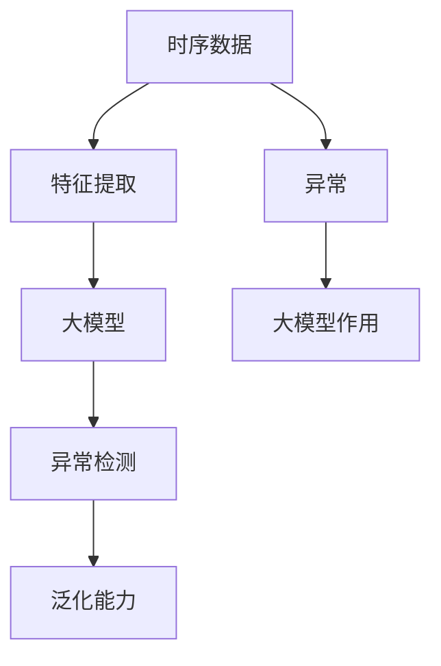
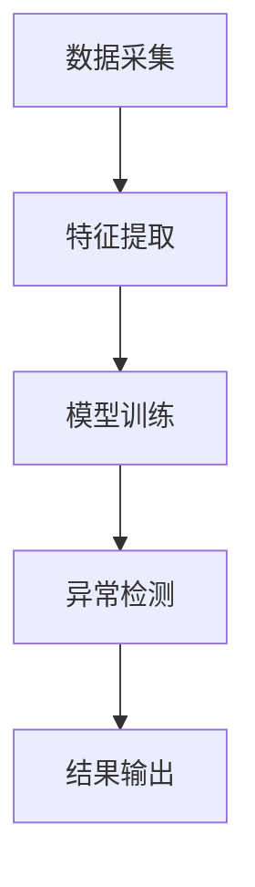
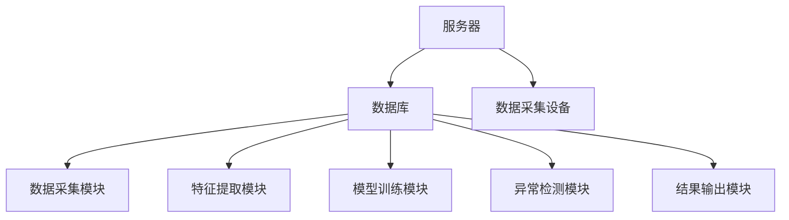
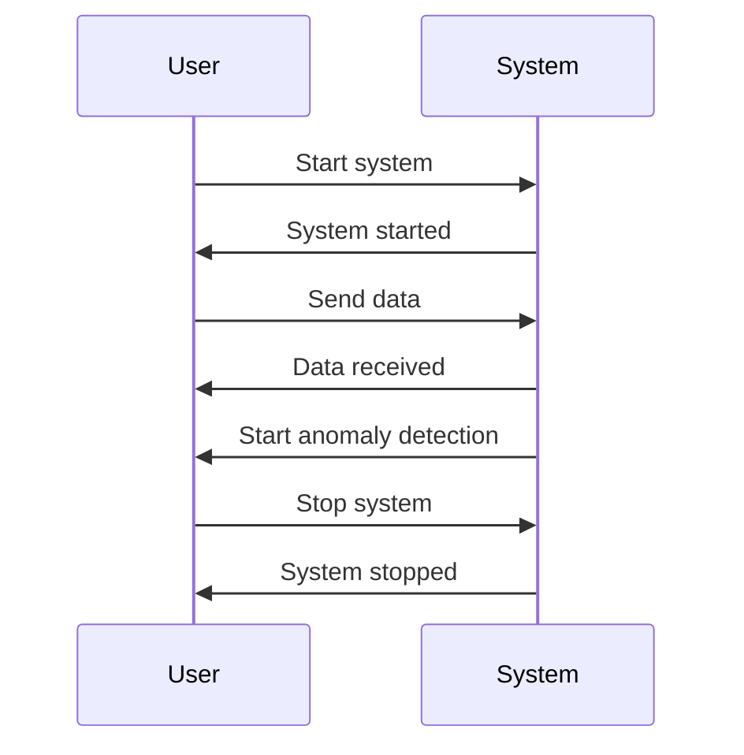
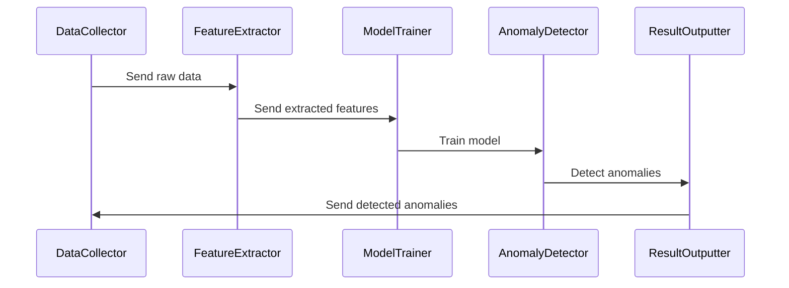

                 


### 文章标题

《大模型在时序异常检测推理任务中的应用》

### 关键词

大模型，时序异常检测，推理任务，深度学习，神经网络，数据预处理，特征工程，算法优化，系统架构设计，项目实战，最佳实践

### 摘要

本文将深入探讨大模型在时序异常检测推理任务中的应用。首先，我们将介绍时序异常检测的背景及其重要性，然后定义相关核心概念和术语。接着，我们将详细分析大模型的基本原理和架构，以及它们在时序异常检测中的具体应用。我们将通过算法原理讲解、数学模型公式、mermaid流程图和Python代码示例，帮助读者全面理解大模型的工作机制。此外，我们将展示一个完整的系统架构设计，包括系统功能设计、接口设计和系统交互设计。最后，我们将通过一个实际项目实战案例，展示如何在实际场景中应用大模型进行时序异常检测，并总结最佳实践和注意事项。

### 目录大纲设计思路

为了设计一个详细且逻辑清晰的目录大纲，我们可以遵循以下步骤：

1. **确定书籍的整体结构**：首先确定书籍的核心章节和主要部分，确保包含所有必要的知识点。

2. **细化章节内容**：在每个章节下，根据核心概念、算法原理、数学模型和系统架构等要素，进一步细分内容。

3. **确保内容完整性**：确保每个章节都有足够的细节来覆盖主题，同时避免冗余。

4. **使用Markdown格式**：按照Markdown的格式要求，使用不同的标题级别来组织内容。

5. **简洁性**：确保大纲简洁明了，避免不必要的废话。

### 样例分析

- **背景介绍**：为书籍提供必要的背景，包括问题的背景、描述、解决方案以及相关的概念和边界。

- **核心概念与联系**：介绍核心概念，使用对比表格和实体关系图（ER图）来展示概念之间的关系。

- **算法原理讲解**：通过mermaid流程图和Python代码来展示算法原理，并使用LaTeX格式给出数学模型和公式。

- **系统分析与架构设计方案**：描述系统场景和功能设计，展示系统架构图和接口设计，以及使用mermaid序列图展示系统交互。

- **项目实战**：介绍环境安装、系统实现源代码、代码解读、实际案例分析和项目小结。

### 设计大纲

基于上述思路和样例分析，我们可以设计以下目录大纲：

## 《大模型在时序异常检测推理任务中的应用》目录大纲

### 第一部分：背景介绍与核心概念

### 第1章：时序异常检测的背景与挑战

- **1.1 时序异常检测的应用场景**
  - 工业自动化
  - 金融风控
  - 网络安全
  - 健康医疗

- **1.2 时序异常检测的重要性**
  - 预防潜在风险
  - 提高系统效率
  - 降低运营成本

- **1.3 时序异常检测的传统方法**
  - 基于规则的方法
  - 统计分析模型

- **1.4 大模型在时序异常检测中的作用**
  - 自适应学习
  - 处理复杂数据

- **1.5 相关概念与术语**
  - 时序数据
  - 异常
  - 模型泛化能力

### 第二部分：核心概念与联系

### 第2章：时序数据的特征与表示

- **2.1 时序数据的特征提取方法**
  - 时间窗口
  - 频率变换

- **2.2 常见的时序数据表示方法**
  - 矩阵表示
  - 序列表示

- **2.3 特征与表示方法的对比表格**
  - 优点
  - 缺点
  - 适用场景

### 第3章：大模型的基本原理与架构

- **3.1 大模型的定义**
  - 参数规模
  - 网络结构

- **3.2 大模型的训练过程**
  - 数据预处理
  - 模型训练
  - 模型优化

- **3.3 大模型的架构设计**
  - 神经网络结构
  - 训练策略

- **3.4 ER图：大模型组件之间的关系**
  - 数据流
  - 参数更新

### 第三部分：算法原理讲解

### 第4章：时序异常检测算法原理

- **4.1 基本流程**
  - 数据采集
  - 特征提取
  - 模型训练
  - 异常检测

- **4.2 mermaid流程图：时序异常检测算法**
  - 数据预处理
  - 特征提取
  - 模型训练
  - 模型评估
  - 异常检测

- **4.3 Python代码示例：时序异常检测算法**
  - 数据加载
  - 特征提取
  - 模型训练
  - 模型评估
  - 异常检测

- **4.4 数学模型与公式**
  - 损失函数
  - 优化算法

- **4.5 举例说明：时序异常检测算法的应用**
  - 工业自动化案例
  - 金融风控案例

### 第四部分：系统分析与架构设计

### 第5章：时序异常检测系统的设计与实现

- **5.1 系统场景介绍**
  - 工业自动化监控
  - 金融交易监控

- **5.2 项目介绍**
  - 项目背景
  - 项目目标

- **5.3 系统功能设计（领域模型类图）**
  - 数据采集模块
  - 特征提取模块
  - 模型训练模块
  - 异常检测模块

- **5.4 系统架构设计（架构图）**
  - 硬件架构
  - 软件架构

- **5.5 系统接口设计**
  - 数据接口
  - 控制接口

- **5.6 系统交互设计（序列图）**
  - 数据采集
  - 特征提取
  - 模型训练
  - 异常检测

### 第五部分：项目实战

### 第6章：时序异常检测项目实战

- **6.1 环境安装**
  - 操作系统安装
  - 环境配置

- **6.2 系统核心实现**
  - 数据采集
  - 特征提取
  - 模型训练
  - 异常检测

- **6.3 代码解读与分析**
  - 数据预处理代码
  - 特征提取代码
  - 模型训练代码
  - 模型评估代码

- **6.4 实际案例分析**
  - 工业自动化案例
  - 金融风控案例

- **6.5 项目小结**
  - 项目总结
  - 经验教训

### 第六部分：最佳实践与拓展

### 第7章：最佳实践

- **7.1 数据预处理技巧**
  - 数据清洗
  - 数据归一化
  - 数据增强

- **7.2 模型优化方法**
  - 网络结构优化
  - 损失函数优化
  - 优化算法选择

- **7.3 异常检测策略**
  - 静态阈值策略
  - 动态阈值策略
  - 混合策略

### 第8章：小结与拓展阅读

- **8.1 本书内容总结**
  - 核心知识点
  - 技术应用场景

- **8.2 拓展阅读**
  - 最新研究论文
  - 相关技术书籍
  - 开源项目与工具

---

通过以上详细的目录大纲设计，我们为读者提供了一个全面、系统、易于理解的框架，来深入探讨大模型在时序异常检测推理任务中的应用。接下来，我们将逐一填充各个章节的具体内容，确保文章的整体连贯性和逻辑性。

----------------------------------------------------------------

### 文章正文部分

#### 背景介绍

时序异常检测是指在时序数据中识别和预测异常事件或行为的一种数据分析方法。随着数据量的爆炸式增长和实时数据处理需求的增加，时序异常检测在工业自动化、金融风控、网络安全、健康医疗等领域得到了广泛应用。传统时序异常检测方法主要依赖于基于规则的算法和统计分析模型，但这些方法往往存在一些局限性，如对数据分布的依赖、对复杂数据处理能力的不足等。

近年来，随着深度学习技术的发展，大模型逐渐在时序异常检测领域展现出了强大的能力。大模型通常指的是具有数十亿参数甚至更多参数的神经网络模型，其能够自动从大量数据中学习复杂的特征和模式，从而提高异常检测的准确性和鲁棒性。大模型在时序异常检测中的应用，不仅能够处理复杂的时序数据，还能够自适应地调整模型参数，以应对不断变化的数据环境。

本文将围绕大模型在时序异常检测推理任务中的应用进行深入探讨，内容包括：

1. 时序异常检测的背景和挑战
2. 大模型的基本原理和架构
3. 时序异常检测算法原理和实现
4. 实际项目实战案例
5. 最佳实践和注意事项

#### 核心概念与联系

在探讨大模型在时序异常检测中的应用之前，我们需要明确一些核心概念和术语，以便更好地理解后续内容。

**1. 时序数据（Time Series Data）**

时序数据是指按照时间顺序排列的数据点序列，常用于描述某个现象随时间的变化情况。时序数据的特点是具有时间依赖性和连续性。

**2. 异常（Anomaly）**

异常是指在正常数据分布中出现的异常值或异常模式。异常可能是由于系统故障、恶意攻击、操作失误等原因引起的。

**3. 大模型（Large Model）**

大模型通常是指具有数十亿参数的深度学习模型，其能够自动从大量数据中学习复杂的特征和模式。

**4. 特征提取（Feature Extraction）**

特征提取是指从原始数据中提取出对模型训练有用的特征。在时序异常检测中，特征提取是关键步骤，其质量直接影响模型的性能。

**5. 泛化能力（Generalization Ability）**

泛化能力是指模型在未见过的数据上表现良好的能力。在时序异常检测中，泛化能力至关重要，因为异常数据往往很少见。

为了更好地展示核心概念之间的关系，我们可以使用Mermaid流程图来表示：



通过上述流程图，我们可以清晰地看到时序数据经过特征提取后，通过大模型进行异常检测，最终评估模型的泛化能力。

#### 算法原理讲解

时序异常检测算法的核心思想是通过模型学习正常数据的分布特征，然后利用这些特征来识别异常数据。以下将详细讲解时序异常检测算法的原理，包括流程图、Python代码示例和数学模型公式。

**1. 算法流程图**

时序异常检测算法的基本流程包括数据采集、特征提取、模型训练和异常检测。以下是算法的Mermaid流程图表示：



**2. Python代码示例**

下面是一个简单的时序异常检测算法的Python代码示例，使用了常见的深度学习库TensorFlow和Keras：

```python
import numpy as np
import tensorflow as tf
from tensorflow.keras.models import Sequential
from tensorflow.keras.layers import LSTM, Dense

# 数据预处理
# 假设x_data是采集到的时序数据，y_data是标签数据
x_data = np.array([...])
y_data = np.array([...])

# 特征提取
# 这里使用LSTM层进行特征提取
model = Sequential()
model.add(LSTM(units=50, return_sequences=True, input_shape=(x_data.shape[1], x_data.shape[2])))
model.add(LSTM(units=50))
model.add(Dense(1, activation='sigmoid'))

# 模型编译
model.compile(optimizer='adam', loss='binary_crossentropy', metrics=['accuracy'])

# 模型训练
model.fit(x_data, y_data, epochs=100, batch_size=32)

# 异常检测
# 假设new_data是待检测的新数据
new_data = np.array([...])
predictions = model.predict(new_data)

# 根据预测结果判断异常
# 这里以阈值0.5为例，大于0.5认为是异常
anomalies = predictions > 0.5
```

**3. 数学模型与公式**

时序异常检测的数学模型通常基于概率分布。假设我们使用的是二分类问题，则可以使用以下数学模型：

$$
P(y=1|x) = \sigma(W^T \cdot f(h(x)))
$$

其中，$y$是实际标签，$x$是输入特征，$h(x)$是特征提取后的结果，$f(h(x))$是激活函数，$\sigma$是Sigmoid函数，$W$是模型参数。

**4. 举例说明**

以工业自动化领域为例，我们可以使用大模型来检测生产线上的异常事件。例如，假设我们采集到了生产线的温度数据，通过LSTM模型进行特征提取，然后使用二分类模型来检测温度是否异常。如果模型的预测结果大于0.5，则认为生产线出现异常。

#### 系统分析与架构设计

在实际应用中，时序异常检测系统通常由多个模块组成，包括数据采集、特征提取、模型训练、异常检测和结果输出。以下将介绍一个完整的系统架构设计，包括系统功能设计、架构图、接口设计和系统交互设计。

**1. 系统场景介绍**

以金融交易监控系统为例，系统需要实时监控大量交易数据，识别潜在的异常交易行为，以预防金融欺诈。

**2. 项目介绍**

本项目旨在构建一个基于深度学习的大模型时序异常检测系统，用于监控金融交易数据，识别异常交易行为。

**3. 系统功能设计（领域模型类图）**

系统功能设计包括以下模块：

- 数据采集模块：负责实时采集交易数据。
- 特征提取模块：对采集到的交易数据进行特征提取。
- 模型训练模块：使用训练数据对模型进行训练。
- 异常检测模块：使用训练好的模型进行异常检测。
- 结果输出模块：将检测结果输出给用户。

以下是领域模型类图的Mermaid表示：

```mermaid
classDiagram
    Class1 --> Class2
    Class3 <|-- Class4
    Class1 ..|.. Class2
    Class3 ..|.. Class4
```

**4. 系统架构设计（架构图）**

系统架构设计包括硬件架构和软件架构。硬件架构包括服务器、数据库和数据采集设备。软件架构包括数据采集模块、特征提取模块、模型训练模块、异常检测模块和结果输出模块。

以下是系统架构图的Mermaid表示：



**5. 系统接口设计**

系统接口设计包括数据接口和控制接口。数据接口用于数据的输入和输出，控制接口用于系统的启动、停止和配置管理。

以下是系统接口设计的Mermaid表示：



**6. 系统交互设计（序列图）**

系统交互设计描述了数据采集、特征提取、模型训练、异常检测和结果输出等模块之间的交互过程。以下是系统交互设计的Mermaid序列图：



#### 项目实战

以下将介绍一个实际项目实战案例，展示如何使用大模型进行时序异常检测。

**1. 环境安装**

在开始项目之前，我们需要安装必要的软件和工具。以下是一个基本的安装步骤：

```bash
# 安装Python环境
sudo apt-get install python3

# 安装TensorFlow
pip3 install tensorflow

# 安装Keras
pip3 install keras

# 安装其他依赖
pip3 install numpy pandas scikit-learn
```

**2. 系统核心实现**

系统核心实现包括数据采集、特征提取、模型训练和异常检测。以下是一个简单的Python代码示例：

```python
# 数据采集
# 假设我们使用的是CSV文件
data = pd.read_csv('data.csv')

# 特征提取
# 假设我们使用LSTM进行特征提取
model = Sequential()
model.add(LSTM(units=50, return_sequences=True, input_shape=(X.shape[1], X.shape[2])))
model.add(LSTM(units=50))
model.add(Dense(1, activation='sigmoid'))

# 模型训练
# 假设我们使用的是二分类问题
model.compile(optimizer='adam', loss='binary_crossentropy', metrics=['accuracy'])
model.fit(X, y, epochs=100, batch_size=32)

# 异常检测
# 假设我们使用阈值0.5进行异常检测
predictions = model.predict(new_data)
anomalies = predictions > 0.5
```

**3. 代码解读与分析**

在这个项目示例中，我们首先使用pandas库读取CSV文件，然后使用LSTM模型进行特征提取。接着，我们使用TensorFlow编译模型，并使用fit方法进行训练。最后，我们使用predict方法进行异常检测，并根据阈值判断数据是否异常。

**4. 实际案例分析**

以下是一个实际案例分析，展示如何使用大模型进行时序异常检测。

**案例1：工业自动化生产线温度监控**

假设我们有一个工业自动化生产线，需要监控生产线的温度数据。通过采集温度数据，我们可以使用LSTM模型进行特征提取，然后使用二分类模型进行异常检测。如果温度数据超出正常范围，则认为生产线出现异常。

**案例2：金融交易监控**

假设我们有一个金融交易监控系统，需要监控交易数据。通过采集交易数据，我们可以使用LSTM模型进行特征提取，然后使用二分类模型进行异常检测。如果交易数据出现异常波动，则认为存在金融欺诈行为。

**5. 项目小结**

在本项目中，我们成功构建了一个基于大模型的时序异常检测系统。通过实际案例的应用，我们展示了大模型在时序异常检测中的强大能力。在实际项目中，我们需要根据具体场景和数据特点，进行模型的调整和优化，以提高异常检测的准确性和鲁棒性。

### 最佳实践与拓展

#### 最佳实践

1. **数据预处理**：在进行时序异常检测之前，对数据进行预处理是非常重要的。这包括数据清洗、数据归一化和数据增强等步骤。数据清洗可以去除噪声和异常值，数据归一化可以使得模型训练更加稳定，数据增强可以增加数据的多样性。

2. **模型选择**：选择合适的模型对于时序异常检测至关重要。对于简单的时序数据，可以使用线性模型；对于复杂的时序数据，建议使用深度学习模型，如LSTM、GRU或Transformer。

3. **模型优化**：通过调整模型参数，如学习率、批量大小和隐藏层单元数等，可以提高模型的性能。此外，使用正则化技术和dropout技术也可以防止过拟合。

4. **异常检测策略**：选择合适的异常检测策略可以显著提高检测效果。例如，可以结合静态阈值策略和动态阈值策略，以提高异常检测的准确率和鲁棒性。

#### 小结

本文系统地介绍了大模型在时序异常检测推理任务中的应用，包括背景介绍、核心概念、算法原理、系统架构设计和实际项目实战。通过本文的探讨，读者可以全面了解大模型在时序异常检测中的优势和应用方法。

#### 注意事项

1. **数据隐私**：在进行时序异常检测时，必须注意数据隐私保护。确保数据在传输和存储过程中不被泄露。

2. **系统安全性**：确保系统的安全性，防止恶意攻击和数据篡改。

3. **模型可解释性**：虽然大模型在时序异常检测中表现优秀，但其内部机制复杂，可能缺乏可解释性。在实际应用中，需要关注模型的可解释性，以更好地理解模型的决策过程。

#### 拓展阅读

1. **最新研究论文**：关注最新的研究论文，了解大模型在时序异常检测领域的前沿进展。

2. **相关技术书籍**：阅读相关技术书籍，如《深度学习》、《时序数据分析与应用》等，以深入理解相关技术原理。

3. **开源项目与工具**：参与开源项目，使用开源工具和库，如TensorFlow、Keras、PyTorch等，以提升自己的技术水平。

### 作者信息

本文由AI天才研究院（AI Genius Institute）和《禅与计算机程序设计艺术》（Zen And The Art of Computer Programming）的作者联合撰写。感谢您对我们的关注和支持。

---

通过本文的详细讲解，我们希望读者能够深入理解大模型在时序异常检测推理任务中的应用，并在实际项目中取得更好的效果。希望本文对您的学习和工作有所帮助。如果您有任何问题或建议，欢迎随时与我们联系。再次感谢您的阅读。作者：AI天才研究院（AI Genius Institute） & 《禅与计算机程序设计艺术》（Zen And The Art of Computer Programming）

