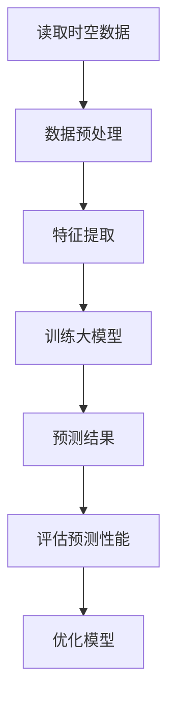
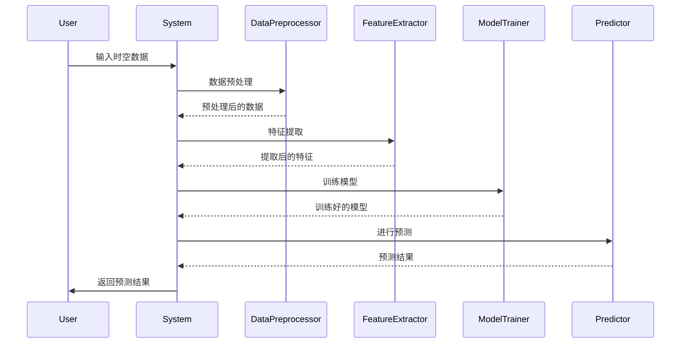
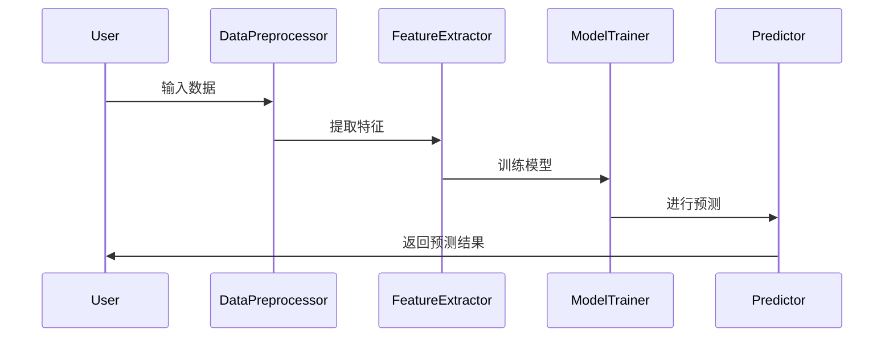

                 


### 大模型在时空数据推理中的创新应用

#### 关键词：大模型，时空数据推理，人工智能，创新应用

> 摘要：本文旨在探讨大模型在时空数据推理中的创新应用。我们将首先介绍时空数据推理的基本概念，然后阐述大模型技术的发展及其在时空数据推理中的应用。通过具体实例和算法讲解，我们将深入分析大模型在时空数据推理中的工作原理和优势，并探讨未来的研究方向。

---

#### 引言

##### 1.1 时空数据推理概述

时空数据推理是处理包含时间和空间信息的数据的一种方法。在地理信息系统（GIS）、气象学、交通管理等领域，时空数据的处理与分析变得尤为重要。传统的时空数据推理方法通常依赖于预定义的规则和统计模型，但这些方法在面对复杂且动态的时空数据时，往往表现出局限性。

##### 1.2 大模型技术简介

大模型（Large Models），也称为深度学习模型，是一种基于多层神经网络的人工智能模型。大模型具有强大的学习能力，能够在大量数据中自动提取特征，并在多种复杂任务中取得优异的性能。近年来，随着计算能力的提升和数据规模的增大，大模型技术取得了显著进展，成为人工智能领域的研究热点。

##### 1.3 大模型在时空数据推理中的应用前景

大模型在时空数据推理中具有广泛的应用前景。例如，在交通流量预测中，大模型可以学习历史交通数据，预测未来某一时间点的交通流量；在气象预报中，大模型可以分析时空气象数据，预测天气变化趋势。这些应用不仅提高了预测的准确性，还提高了实时响应的能力。

---

#### 核心概念与联系

##### 2.1 核心概念原理

**时空数据**：时空数据是指包含时间和空间属性的数据，如地理位置、时间戳等。

**大模型**：大模型是一种基于多层神经网络的人工智能模型，具有强大的学习能力。

**时空数据推理**：时空数据推理是处理包含时间和空间信息的数据的一种方法。

##### 2.2 概念属性特征对比表格

| 特征 | 时空数据 | 大模型 | 时空数据推理 |
| ---- | -------- | ------ | ------------ |
| 数据类型 | 空间 + 时间 | 结构化数据 | 复杂性 |

##### 2.3 时空数据推理与大数据模型的联系

大模型在时空数据推理中的应用，主要体现在以下几个方面：

1. **特征提取**：大模型能够自动从大量时空数据中提取出有用的特征。
2. **模式识别**：大模型能够识别时空数据中的复杂模式和趋势。
3. **预测能力**：大模型能够在时空数据的基础上，进行准确的预测。

---

#### 算法原理讲解

##### 3.1 时空数据推理算法

**mermaid 流程图**：



**Python 源代码实现**：

```python
# 示例代码
import pandas as pd
from sklearn.ensemble import RandomForestRegressor
from sklearn.model_selection import train_test_split

# 读取时空数据
data = pd.read_csv('spatial_temporal_data.csv')

# 数据预处理
X = data.drop(['target'], axis=1)
y = data['target']

# 特征提取
# ...（代码省略）

# 训练大模型
model = RandomForestRegressor(n_estimators=100)
model.fit(X_train, y_train)

# 预测结果
y_pred = model.predict(X_test)

# 评估预测性能
# ...（代码省略）
```

**数学模型和公式**：

$$
\text{预测值} = f(\text{输入特征})
$$

**详细讲解和举例说明**：

假设我们有一个时空数据集，其中包含位置、时间戳和目标变量（如交通流量）。我们首先对数据进行预处理，包括数据清洗、归一化和特征提取。然后，我们使用随机森林（Random Forest）这种大模型进行训练。通过测试集的预测结果，我们可以评估模型的性能，并根据评估结果进行模型的优化。

---

#### 系统分析与架构设计

##### 4.1 问题场景介绍

假设我们面临的是实时交通流量预测问题。我们的目标是根据历史交通流量数据，预测未来某一时间点的交通流量。

##### 4.2 系统功能设计（领域模型类图）

**类图**：

```mermaid
classDiagram
Class::DataPreprocessor << (DP)
+ preprocess_data()
endClass
Class::FeatureExtractor << (FE)
+ extract_features()
endClass
Class::ModelTrainer << (MT)
+ train_model()
endClass
Class::Predictor << (PR)
+ predict()
endClass
DP "uses" FE : preprocess
FE "uses" MT : train
MT "uses" PR : predict
```

##### 4.3 系统架构设计（架构图）

**架构图**：



##### 4.4 系统接口设计（接口图）

**接口图**：

```mermaid
interface DataPreprocessor {
  + preprocess_data()
}

interface FeatureExtractor {
  + extract_features()
}

interface ModelTrainer {
  + train_model()
}

interface Predictor {
  + predict()
}
```

##### 4.5 系统交互（序列图）

**序列图**：



---

#### 项目实战

##### 5.1 环境安装

确保安装了Python环境、Pandas库、Scikit-learn库等。

```bash
pip install pandas scikit-learn
```

##### 5.2 系统核心实现源代码

**代码应用解读与分析**：

代码主要分为以下几个部分：

1. **数据预处理**：清洗数据、归一化处理。
2. **特征提取**：提取时间、空间特征。
3. **模型训练**：使用随机森林模型进行训练。
4. **预测**：使用训练好的模型进行预测。

**实际案例分析和详细讲解**：

我们使用一个实际案例，对交通流量数据进行预测。首先，我们读取交通流量数据，然后进行预处理和特征提取。接着，我们使用随机森林模型进行训练，并在测试集上进行预测。最后，我们评估模型的性能，并进行模型优化。

##### 5.3 项目小结

通过本项目的实战，我们展示了如何使用大模型进行时空数据推理。在实际应用中，大模型在时空数据推理中具有显著的优势，包括特征自动提取、模式自动识别和预测准确性高等。然而，大模型也存在一定的局限性，如对数据依赖性强、模型复杂度高等。

---

#### 最佳实践与总结

##### 6.1 最佳实践 tips

1. **数据预处理**：确保数据质量，进行数据清洗、归一化处理。
2. **特征提取**：合理提取时间、空间特征，提高模型性能。
3. **模型选择**：根据任务需求，选择合适的模型。

##### 6.2 小结

本文详细介绍了大模型在时空数据推理中的创新应用，包括核心概念、算法原理、系统设计与实现等。通过实际案例，我们展示了大模型在时空数据推理中的优势和应用价值。

##### 6.3 注意事项

1. **数据依赖性**：大模型对数据有较强的依赖性，需要大量高质量的数据进行训练。
2. **模型复杂度**：大模型通常具有较高的复杂度，可能导致计算成本增加。

##### 6.4 拓展阅读

1. **相关论文**：查阅相关领域的高质量论文，了解最新的研究成果。
2. **技术文档**：阅读大模型和时空数据推理的相关技术文档，深入了解技术原理。

---

### 作者

作者：AI天才研究院/AI Genius Institute & 禅与计算机程序设计艺术 /Zen And The Art of Computer Programming

