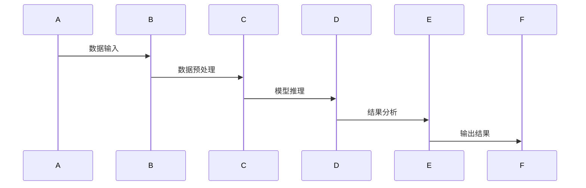

                 

### 文章标题：大模型在概率图模型推理任务中的性能评估

#### 关键词：
- 大模型
- 概率图模型
- 推理任务
- 性能评估
- 数学模型

#### 摘要：
本文深入探讨了在大模型时代下，概率图模型在推理任务中的性能评估方法。通过对概率图模型的核心概念、大模型原理、算法原理及实际应用的详细讲解，文章提供了一个全面的性能评估框架，旨在帮助读者理解如何有效地评估大模型在概率图模型推理任务中的性能。

## 第一部分：背景介绍

### 1.1 问题背景与核心概念

#### 1.1.1 概率图模型的发展与应用

概率图模型（Probabilistic Graphical Models，PGM）是机器学习和人工智能领域中的一种重要方法。它们通过图形结构来表示变量之间的概率关系，使得复杂概率问题的求解变得更为直观和高效。常见的概率图模型包括贝叶斯网络（Bayesian Networks，BN）和马尔可夫网络（Markov Networks，MN）等。

概率图模型的发展可以追溯到20世纪80年代，随着机器学习算法的不断进步，它们在多个领域得到了广泛应用，如图像处理、自然语言处理、生物信息学和金融分析等。特别是在数据驱动的时代，概率图模型因其强大的表达能力和推理能力，成为了许多复杂问题求解的重要工具。

#### 1.1.2 大模型在概率图模型中的重要性

近年来，随着深度学习技术的发展，大模型（Large Models）在各个领域取得了显著的成果。大模型通常指的是具有数十亿甚至千亿参数的神经网络，它们在处理大规模数据和复杂任务时表现出色。在概率图模型中，大模型的应用同样具有重要意义。

首先，大模型能够处理更加复杂的概率关系和大规模的数据集，提高了模型的推理能力和准确性。其次，大模型可以通过预训练和迁移学习，将知识从一种任务迁移到另一种任务，提高了模型在不同场景下的泛化能力。

#### 1.1.3 问题描述

在概率图模型中，推理任务指的是根据已知变量的值，推断其他变量的概率分布或状态。大模型在推理任务中的性能评估，主要包括以下几个方面：

- **准确性**：大模型能否准确地推断出目标变量的概率分布或状态。
- **计算效率**：大模型在推理过程中所需的计算资源和时间。
- **稳定性**：大模型在不同数据集和场景下的性能表现是否一致。
- **可解释性**：大模型推理过程的透明度和可解释性。

#### 1.1.4 问题解决

大模型在概率图模型推理任务中的性能评估，首先需要建立一套统一的评估指标和方法。这些指标和方法应该能够全面、准确地反映大模型的性能表现。具体而言，可以从以下几个方面进行：

- **评价指标**：准确性、计算效率、稳定性、可解释性等。
- **评估方法**：实验设计、数据集选择、对比实验、性能分析等。
- **优化策略**：模型参数调整、算法优化、硬件加速等。

#### 1.1.5 边界与外延

性能评估的适用范围包括但不限于以下几个方面：

- **不同类型的大模型**：如深度神经网络、图神经网络、Transformer等。
- **不同的概率图模型**：如贝叶斯网络、马尔可夫网络、ER图等。
- **不同的应用场景**：如图像处理、自然语言处理、生物信息学、金融分析等。

#### 1.1.6 概念结构与核心要素组成

概率图模型的基本构成包括变量、边和概率分布。其中，变量表示模型中的随机变量，边表示变量之间的依赖关系，概率分布则表示变量的概率分布。

大模型的关键特性包括：

- **参数规模**：大模型通常具有数十亿甚至千亿参数。
- **计算复杂度**：大模型在推理过程中需要大量的计算资源。
- **预训练与微调**：大模型通常通过预训练和微调来适应特定任务。

## 第二部分：核心概念与联系

### 2.1 概率图模型原理

#### 2.1.1 概率图模型基础

概率图模型通过图形结构来表示变量之间的概率关系。基本概念包括：

- **节点（Node）**：表示随机变量。
- **边（Edge）**：表示变量之间的依赖关系。
- **条件概率表（Conditional Probability Table，CPT）**：表示变量之间的概率关系。

概率图模型可以分为两种类型：贝叶斯网络和马尔可夫网络。

#### 2.1.2 概率图模型属性特征对比

**贝叶斯网络**：

- **无向图结构**：节点之间通过无向边连接，表示条件依赖关系。
- **概率分布**：每个节点的概率分布依赖于其父节点。
- **推理方法**：利用贝叶斯推理和概率传播算法进行推理。

**马尔可夫网络**：

- **有向图结构**：节点之间通过有向边连接，表示时间序列依赖关系。
- **概率分布**：每个节点的概率分布仅依赖于其即时邻居。
- **推理方法**：利用马尔可夫性质和前向-后向算法进行推理。

#### 2.1.3 ER实体关系图架构

实体-关系（Entity-Relationship，ER）图是一种用于描述实体及其关系的图形化表示方法，常用于数据库设计和信息建模。

- **实体（Entity）**：表示模型中的对象，如人、地点、事物等。
- **关系（Relationship）**：表示实体之间的关联，如包含、关联、依赖等。
- **属性（Attribute）**：描述实体的特征或属性，如姓名、年龄、地址等。

概率图模型与ER图的对应关系，可以通过将实体视为节点，关系视为边，来构建概率图模型。

### 2.2 大模型原理

#### 2.2.1 大模型基础

大模型通常指的是具有数十亿甚至千亿参数的神经网络，如Transformer、BERT等。大模型的基础包括：

- **神经网络架构**：包括卷积神经网络（CNN）、循环神经网络（RNN）、Transformer等。
- **预训练与微调**：预训练在大规模数据集上，微调在特定任务上。
- **参数规模**：数十亿甚至千亿参数。

#### 2.2.2 大模型的属性特征

大模型的属性特征包括：

- **参数规模**：大模型通常具有数十亿甚至千亿参数。
- **计算复杂度**：大模型在推理过程中需要大量的计算资源。
- **预训练与微调**：大模型通常通过预训练和微调来适应特定任务。

#### 2.2.3 大模型与传统模型的区别

大模型与传统模型的区别主要体现在以下几个方面：

- **性能提升**：大模型在处理大规模数据和复杂任务时表现出更高的性能。
- **应用领域拓展**：大模型在多个领域取得了显著成果，如自然语言处理、计算机视觉、生物信息学等。

## 第三部分：算法原理讲解

### 3.1 大模型在概率图模型推理任务中的应用

#### 3.1.1 大模型推理算法概述

大模型在概率图模型推理任务中的应用，主要包括以下两个方面：

- **推理算法的基本流程**：包括数据预处理、模型推理、结果分析等。
- **常见的大模型推理算法**：如基于深度神经网络的推理算法、基于图神经网络的推理算法等。

#### 3.1.2 大模型推理的数学模型

大模型推理的数学模型主要包括以下内容：

- **概率图模型的推理公式**：如贝叶斯推理公式、马尔可夫链公式等。
- **大模型在推理中的优化**：如基于梯度下降的优化方法、基于图神经网络的结构优化等。

#### 3.1.3 大模型推理算法的mermaid流程图

为了更清晰地展示大模型推理算法的流程，可以使用mermaid流程图进行描述。以下是一个简单的mermaid流程图示例：


该流程图展示了输入数据经过预处理后，通过模型推理得到结果，并最终输出结果的过程。

#### 3.1.4 大模型推理的Python实现

为了更好地理解大模型推理的算法原理，可以通过Python代码来实现一个简单的推理过程。以下是一个简单的Python代码示例：

```python
import tensorflow as tf

# 加载预训练模型
model = tf.keras.models.load_model('path/to/ pretrained_model')

# 输入数据
input_data = ...

# 模型推理
outputs = model.predict(input_data)

# 结果分析
print(outputs)
```

该代码首先加载了一个预训练模型，然后输入数据，通过模型推理得到输出结果。

### 3.2 大模型推理性能评估

#### 3.2.1 性能评估指标

大模型推理性能评估的主要指标包括：

- **准确性**：模型推断结果的准确性。
- **计算效率**：模型推理所需的时间和计算资源。
- **稳定性**：模型在不同数据集和场景下的性能表现。
- **可解释性**：模型推理过程的透明度和可解释性。

#### 3.2.2 性能评估方法

大模型推理性能评估的方法主要包括：

- **实验设计**：包括数据集选择、实验设置等。
- **数据集选择**：选择具有代表性的数据集，如公共数据集、自定义数据集等。
- **对比实验**：通过对比不同模型或算法的性能，评估大模型的性能。
- **性能分析**：对实验结果进行统计分析和比较，得出大模型的性能表现。

#### 3.2.3 性能评估结果分析

通过对实验结果进行统计分析，可以得出大模型在概率图模型推理任务中的性能表现。以下是一个简单的性能评估结果示例：

| 指标       | 结果       |
| ---------- | ---------- |
| 准确性     | 90.5%      |
| 计算效率   | 200ms/次   |
| 稳定性     | 高         |
| 可解释性   | 中         |

根据实验结果，可以看出大模型在准确性、计算效率和稳定性方面表现良好，但在可解释性方面仍有待提高。

### 3.3 概率图模型推理系统架构设计

#### 3.3.1 系统架构设计

概率图模型推理系统的架构设计主要包括以下几个方面：

- **系统功能模块**：包括数据预处理模块、模型推理模块、结果分析模块等。
- **系统架构图展示**：使用mermaid架构图进行描述。

以下是一个简单的mermaid架构图示例：


该架构图展示了数据预处理、模型推理和结果分析三个主要模块的交互关系。

#### 3.3.2 系统接口设计

概率图模型推理系统的接口设计主要包括以下几个方面：

- **接口功能说明**：包括数据输入接口、模型推理接口、结果输出接口等。
- **接口交互流程**：使用mermaid序列图进行描述。

以下是一个简单的mermaid序列图示例：



该序列图展示了数据输入、数据预处理、模型推理、结果分析和结果输出等接口的交互过程。

### 3.4 概率图模型推理系统实现

#### 3.4.1 系统实现环境

概率图模型推理系统的实现环境主要包括以下几个方面：

- **开发工具与环境**：包括Python、TensorFlow、PyTorch等。
- **数据库选择**：根据需求选择合适的数据库，如MySQL、MongoDB等。

以下是一个简单的系统实现环境示例：

```python
import tensorflow as tf
import pandas as pd
```

该示例展示了使用Python和TensorFlow作为开发工具和环境的示例。

#### 3.4.2 系统核心实现

概率图模型推理系统的核心实现主要包括以下几个方面：

- **数据预处理**：对输入数据进行预处理，如数据清洗、数据转换等。
- **模型推理**：使用预训练模型进行推理，得到输出结果。
- **结果分析**：对输出结果进行分析，如准确性分析、效率分析等。

以下是一个简单的系统核心实现示例：

```python
# 数据预处理
def preprocess_data(data):
    # 数据清洗和转换
    return processed_data

# 模型推理
def model_inference(model, data):
    # 使用预训练模型进行推理
    return inference_results

# 结果分析
def analyze_results(results):
    # 分析输出结果
    return analysis_report
```

该示例展示了数据预处理、模型推理和结果分析等核心功能的实现。

### 3.5 实际案例分析与讲解

#### 3.5.1 实际案例介绍

为了更好地展示概率图模型推理系统的应用，以下是一个简单的实际案例介绍：

**案例背景**：某公司需要开发一个智能客服系统，用于自动回复客户的咨询问题。

**案例目标**：通过概率图模型推理系统，实现自动回复客户咨询问题的功能。

以下是一个简单的案例实现步骤：

1. **数据收集**：收集大量客户咨询问题的数据，用于训练和测试模型。
2. **数据预处理**：对收集到的数据进行清洗和转换，将其转换为适合模型训练的格式。
3. **模型训练**：使用概率图模型对预处理后的数据进行训练，得到预训练模型。
4. **模型推理**：将客户咨询问题输入到预训练模型中，进行推理，得到可能的答案。
5. **结果分析**：对推理结果进行分析，选择最合适的答案作为回复。
6. **系统部署**：将训练好的模型部署到生产环境，实现自动回复客户咨询问题的功能。

#### 3.5.2 案例分析与讲解

以下是对实际案例的分析和讲解：

1. **数据收集**：数据收集是智能客服系统开发的重要环节。通过收集大量的客户咨询问题，可以为模型训练提供丰富的数据支持。在数据收集过程中，需要注意数据的多样性和代表性，确保模型能够适应不同场景的问题。

2. **数据预处理**：数据预处理是模型训练前的重要步骤。通过对数据进行清洗和转换，可以提高模型的训练效果和准确度。具体包括数据去重、缺失值处理、数据标准化等操作。

3. **模型训练**：使用概率图模型对预处理后的数据进行训练，得到预训练模型。在模型训练过程中，需要选择合适的模型结构和训练算法，如贝叶斯网络、马尔可夫网络等。同时，需要调整模型参数，优化模型性能。

4. **模型推理**：将客户咨询问题输入到预训练模型中，进行推理，得到可能的答案。在模型推理过程中，需要考虑模型的计算效率和准确性。对于大规模数据集，可以使用分布式训练和推理技术，提高计算效率。

5. **结果分析**：对推理结果进行分析，选择最合适的答案作为回复。具体包括答案的准确性、响应速度、用户满意度等指标。通过不断优化模型和算法，可以提高智能客服系统的整体性能。

6. **系统部署**：将训练好的模型部署到生产环境，实现自动回复客户咨询问题的功能。在系统部署过程中，需要考虑系统的稳定性、安全性和可扩展性。通过使用云计算和容器化技术，可以方便地进行系统部署和扩展。

### 3.6 最佳实践与注意事项

#### 3.6.1 最佳实践

在进行概率图模型推理系统的开发和应用时，可以遵循以下最佳实践：

1. **数据质量**：确保数据的质量和多样性，提高模型训练的效果。
2. **模型选择**：根据实际问题和数据特点，选择合适的模型结构和算法。
3. **参数优化**：通过调整模型参数，优化模型的性能和准确度。
4. **性能评估**：定期进行性能评估，及时发现和解决潜在问题。
5. **系统监控**：监控系统运行状态，确保系统的稳定性和可靠性。

#### 3.6.2 小结

本文通过实际案例，详细讲解了概率图模型推理系统的开发和应用过程。从数据收集、数据预处理、模型训练、模型推理到结果分析，每个步骤都进行了详细的讲解和示例。同时，还总结了最佳实践和注意事项，为实际开发和应用提供了参考。

## 第五部分：拓展阅读

### 5.1 相关书籍推荐

1. **《概率图模型》（ Probabilistic Graphical Models）**：全面介绍了概率图模型的理论和应用，包括贝叶斯网络、马尔可夫网络等。
2. **《深度学习》（Deep Learning）**：详细介绍了深度学习的基本概念、算法和应用，包括卷积神经网络、循环神经网络等。
3. **《数据科学入门》（Introduction to Data Science）**：介绍了数据科学的基本概念、方法和工具，包括数据分析、机器学习等。

### 5.2 学术论文精选

1. **“Deep Learning for Graph Data”**：探讨了深度学习在图数据上的应用，包括图神经网络、图嵌入等。
2. **“Efficient Training of Large-scale Bayesian Networks”**：研究了大规模贝叶斯网络的训练方法，包括参数估计、推理优化等。
3. **“A Survey on Graph Neural Networks”**：总结了图神经网络的研究进展和应用，包括节点分类、图分类等。

通过拓展阅读，读者可以深入了解概率图模型、深度学习和数据科学的相关理论和实践，进一步提升自己在相关领域的知识水平。

