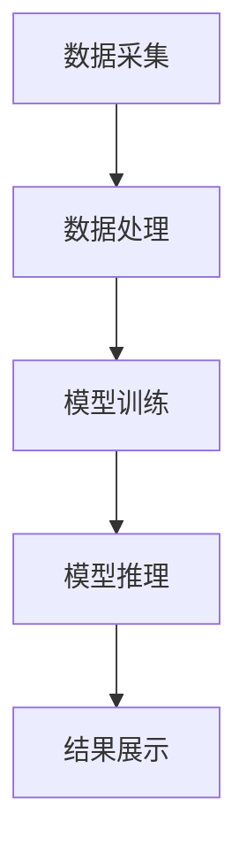
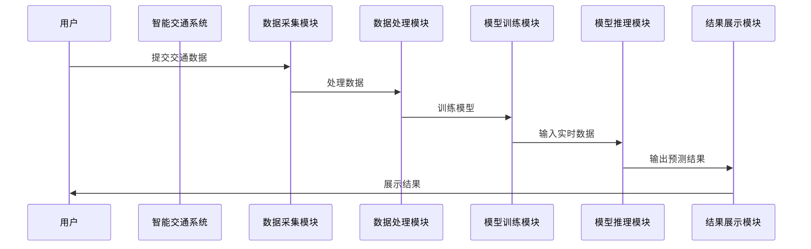

                 

## 大模型在概率推理任务中的不确定性量化

### 背景介绍：大模型在概率推理任务中的不确定性量化

随着人工智能技术的不断发展，深度学习大模型在各类任务中的应用越来越广泛，尤其在概率推理任务中展现了强大的能力。概率推理是人工智能领域中的一个重要研究方向，它涉及到如何从已知的信息中推断出未知的结果。然而，在实际应用中，大模型在进行概率推理时往往面临着不确定性问题，这种不确定性可能来源于模型本身的局限性、数据分布的不均衡，或者是对问题本质理解的不足。

本书旨在探讨大模型在概率推理任务中的不确定性量化问题。具体来说，本书将首先介绍概率推理的基本概念和常见问题，然后深入分析大模型在概率推理中的应用及其面临的不确定性，接着介绍各种不确定性量化方法，包括基于概率论的方法和基于统计学习的方法。此外，本书还将探讨如何通过优化模型结构和改进算法设计来降低不确定性，并分析大模型在概率推理中的实际应用案例。

本书的核心概念包括：概率推理、不确定性量化、大模型、概率分布、误差分析等。通过本书的学习，读者将能够全面了解大模型在概率推理任务中的不确定性量化方法，掌握相关技术，并能够应用于实际问题中。

### 第1章：大模型在概率推理中的基础理论

#### 1.1 概率推理的基本概念

概率推理是人工智能中的一个核心问题，它涉及到如何根据已有的信息（证据）来推断出新的信息（结论）。概率推理的基本概念包括概率、随机变量、条件概率和贝叶斯定理等。

- **概率**：概率是衡量事件发生可能性大小的量，通常用0到1之间的数值表示。概率值越接近1，事件发生的可能性越大；越接近0，事件发生的可能性越小。

- **随机变量**：随机变量是一个数学函数，它将样本空间映射到实数集。随机变量可以是离散的，也可以是连续的。

- **条件概率**：条件概率是指在某个事件发生的条件下，另一个事件发生的概率。它表示为P(A|B)，表示在事件B发生的条件下事件A发生的概率。

- **贝叶斯定理**：贝叶斯定理是概率论中的一个基本公式，它描述了在已知某个条件的概率下，如何通过观察该条件发生的概率来推断出该条件的概率。贝叶斯定理公式为：

  $$ P(A|B) = \frac{P(B|A) \cdot P(A)}{P(B)} $$

  其中，P(A|B)是后验概率，P(B|A)是似然概率，P(A)是先验概率，P(B)是证据概率。

#### 1.2 大模型在概率推理中的应用

大模型在概率推理中的应用主要体现在两个方面：一是通过模型预测来获取概率分布；二是通过优化模型结构来提高概率推理的准确性。

- **模型预测获取概率分布**：大模型可以通过训练和学习，对输入的数据进行预测，并输出相应的概率分布。例如，在文本分类任务中，大模型可以根据输入的文本数据，预测文本属于不同类别的概率分布。

- **优化模型结构提高准确性**：大模型的准确性很大程度上取决于其结构的设计。通过调整模型的层数、神经元数量、激活函数等参数，可以优化模型的结构，从而提高概率推理的准确性。

#### 1.3 大模型在概率推理中面临的不确定性

尽管大模型在概率推理中具有强大的能力，但它们也面临着一些不确定性问题。这些不确定性可能来源于以下几个方面：

- **模型本身的不确定性**：大模型的预测依赖于大量的数据和复杂的模型结构，因此模型本身可能存在不确定性。例如，模型可能因为数据集的局限性而无法准确地预测未知数据。

- **数据分布的不确定性**：在实际应用中，数据分布可能存在不均衡性，这可能导致模型在处理某些特定类型的数据时出现不确定性。

- **问题本质的不确定性**：某些概率推理任务可能涉及复杂的背景知识，模型可能因为对问题本质理解的不足，而无法准确地进行概率推理。

#### 1.4 大模型不确定性量化方法

为了更好地理解和处理大模型在概率推理中的不确定性，研究者们提出了多种不确定性量化方法。这些方法可以分为基于概率论的方法和基于统计学习的方法。

- **基于概率论的方法**：这种方法包括贝叶斯推理、最大后验概率估计等。贝叶斯推理通过引入先验知识，可以修正模型的预测结果，从而降低不确定性。最大后验概率估计则通过最大化后验概率来优化模型参数，从而提高预测的准确性。

- **基于统计学习的方法**：这种方法包括误差分析、置信区间估计等。误差分析通过计算模型预测误差的分布，可以评估模型的可靠性和不确定性。置信区间估计则通过统计方法，确定模型预测结果的可信度区间。

### 第2章：概率推理中的核心概念与联系

#### 2.1 核心概念原理

在本章中，我们将详细讨论概率推理中的核心概念，包括概率分布、条件概率、贝叶斯定理等。以下是这些概念的基本原理和属性特征：

- **概率分布**：概率分布是描述随机变量取值概率的函数，通常用概率密度函数（PDF）或概率质量函数（PMF）表示。概率分布可以用于预测随机变量在不同取值下的概率。

  - **概率密度函数（PDF）**：对于连续随机变量，概率密度函数描述了随机变量取值的概率分布。

  - **概率质量函数（PMF）**：对于离散随机变量，概率质量函数描述了随机变量取值的概率分布。

- **条件概率**：条件概率是给定某个事件发生的条件下，另一个事件发生的概率。它反映了两个事件之间的依赖关系。条件概率可以用以下公式表示：

  $$ P(A|B) = \frac{P(A \cap B)}{P(B)} $$

  其中，P(A|B)表示在事件B发生的条件下事件A发生的概率，P(A ∩ B)表示事件A和事件B同时发生的概率，P(B)表示事件B发生的概率。

- **贝叶斯定理**：贝叶斯定理是概率论中的一个基本定理，它描述了后验概率和先验概率之间的关系。贝叶斯定理可以用来更新我们对某个事件概率的估计，基于新的证据。贝叶斯定理的公式为：

  $$ P(A|B) = \frac{P(B|A) \cdot P(A)}{P(B)} $$

  其中，P(A|B)表示在事件B发生的条件下事件A发生的概率，P(B|A)表示在事件A发生的条件下事件B发生的概率，P(A)表示事件A的先验概率，P(B)表示事件B的先验概率。

#### 2.2 概率分布的属性特征对比

以下是一个对比概率分布属性特征的表格，包括概率密度函数（PDF）和概率质量函数（PMF）：

| 概率分布类型 | 特征 | 应用场景 |
| :---: | :---: | :---: |
| 概率密度函数（PDF） | 连续型分布，取值为实数 | 信号处理、图像识别、机器学习 |
| 概率质量函数（PMF） | 离散型分布，取值为整数 | 事件计数、离散随机变量 |
| 伯努利分布 | 二项分布的特殊情况，成功概率为p | 概率模型、二项分布 |
| 正态分布 | 对称分布，均值为μ，方差为σ² | 数据分析、信号处理、回归分析 |
| 伯努利分布 | 成功概率为p | 概率模型、二项分布 |
| 指数分布 | 均值为1/λ，方差为1/λ² | 服务时间模型、可靠性分析 |
| 几何分布 | 成功概率为p，试验次数为n | 事件发生次数模型 |
| 拉普拉斯分布 | 对称分布，均值和方差均为μ | 估计参数、异常值检测 |
| 卡方分布 | 自由度为k，均值为k，方差为2k | 估计参数、假设检验 |
| 学生t分布 | 自由度为k，均值和方差未知 | 估计参数、假设检验 |
| 负二项分布 | 成功概率为p，试验次数为n | 事件发生次数模型 |

#### 2.3 贝叶斯定理的ER实体关系图

以下是一个贝叶斯定理的实体关系图，展示了贝叶斯定理中的实体及其关系：


#### 2.4 概率推理与贝叶斯定理的联系

概率推理和贝叶斯定理之间有着密切的联系。贝叶斯定理是概率推理的核心工具，它提供了一种基于证据更新概率的方法。概率推理中的关键步骤包括：

1. **设定先验概率**：根据现有的知识和经验，设定某个事件发生的先验概率。
2. **收集证据**：通过观察或实验收集与事件相关的证据。
3. **应用贝叶斯定理**：根据贝叶斯定理，更新事件的概率估计，得到后验概率。
4. **评估结果**：根据后验概率，评估事件发生的可能性，并进行决策。

贝叶斯定理的应用场景包括：

- **决策分析**：在不确定的环境中进行决策，通过贝叶斯推理评估不同决策的结果和风险。
- **分类问题**：在分类任务中，通过贝叶斯定理计算每个类别的后验概率，选择概率最大的类别作为预测结果。
- **参数估计**：在统计学习中，通过贝叶斯推理估计模型参数的概率分布，为模型优化提供依据。

### 第3章：大模型在概率推理中的应用实例

在本章中，我们将探讨大模型在概率推理中的应用实例，通过具体的案例来展示大模型在概率推理任务中的表现和挑战。

#### 3.1 案例一：文本分类中的概率推理

文本分类是概率推理在自然语言处理（NLP）中的一个常见应用。例如，在垃圾邮件检测中，大模型需要根据邮件内容判断邮件是否为垃圾邮件。这涉及到从已知的数据集中学习文本特征，并预测新邮件的分类。

- **模型表现**：使用大模型进行文本分类时，通常可以通过训练大量的文本数据来学习特征提取和分类规则。在正确设置模型参数和超参数的情况下，大模型可以在文本分类任务中达到很高的准确率。

- **挑战**：尽管大模型在文本分类中表现出色，但它们也面临一些挑战。首先，大模型可能受到数据分布不均衡的影响，导致某些类别被低估。其次，大模型可能对文本中的复杂关系和上下文理解不足，影响分类结果的准确性。

#### 3.2 案例二：图像识别中的概率推理

图像识别是概率推理在计算机视觉中的一个重要应用。例如，在人脸识别任务中，大模型需要根据图像的特征预测图像中的人脸。这涉及到从已知的数据集中学习图像特征，并预测新图像中的人脸位置和属性。

- **模型表现**：使用大模型进行图像识别时，通常可以通过训练大量的图像数据来学习特征提取和分类规则。在正确设置模型参数和超参数的情况下，大模型可以在图像识别任务中达到很高的准确率。

- **挑战**：尽管大模型在图像识别中表现出色，但它们也面临一些挑战。首先，大模型可能受到数据集的局限性影响，导致模型无法适应未知的数据分布。其次，大模型可能对图像中的复杂结构和背景信息理解不足，影响识别结果的准确性。

#### 3.3 案例三：推荐系统中的概率推理

推荐系统是概率推理在电子商务和社交媒体中的一个重要应用。例如，在电影推荐中，大模型需要根据用户的观看历史和偏好预测用户可能喜欢的电影。这涉及到从已知的数据集中学习用户行为特征，并预测新电影的推荐概率。

- **模型表现**：使用大模型进行推荐系统时，通常可以通过训练大量的用户行为数据来学习用户偏好和推荐规则。在正确设置模型参数和超参数的情况下，大模型可以在推荐系统中达到很高的准确率和用户满意度。

- **挑战**：尽管大模型在推荐系统中表现出色，但它们也面临一些挑战。首先，大模型可能受到数据集的局限性影响，导致模型无法适应快速变化的用户行为。其次，大模型可能对用户之间的交互和关系理解不足，影响推荐结果的准确性。

通过以上案例分析，我们可以看到大模型在概率推理任务中具有强大的能力，但也面临着一些挑战。了解这些挑战有助于我们更好地应用大模型，并探索改进方法，提高概率推理的准确性和可靠性。

### 第4章：大模型不确定性量化方法

#### 4.1 贝叶斯推理

贝叶斯推理是处理大模型不确定性的重要方法之一。它基于贝叶斯定理，通过更新先验概率和似然概率来计算后验概率，从而对不确定性进行量化。贝叶斯推理的核心思想是利用新的证据来修正我们对某个事件概率的估计。

- **基本概念**：

  - **先验概率**：在观察任何证据之前，我们对某个事件发生的概率的估计。
  - **似然概率**：在某个事件发生的条件下，观察到特定证据的概率。
  - **后验概率**：在观察特定证据后，我们对某个事件发生的概率的估计。

- **贝叶斯推理公式**：

  $$ P(A|B) = \frac{P(B|A) \cdot P(A)}{P(B)} $$

  其中，P(A|B)是后验概率，P(B|A)是似然概率，P(A)是先验概率，P(B)是证据概率。

- **应用场景**：

  - **分类问题**：通过贝叶斯推理，我们可以根据先验概率和似然概率来计算每个类别的后验概率，从而确定最终的分类结果。
  - **参数估计**：在统计学习中，通过贝叶斯推理，我们可以估计模型参数的概率分布，从而进行参数优化。

#### 4.2 误差分析

误差分析是评估大模型预测不确定性的重要方法。它通过计算模型预测误差的分布，来量化模型的不确定性。

- **基本概念**：

  - **预测误差**：模型预测值与真实值之间的差异。
  - **误差分布**：预测误差的概率分布。

- **误差分析方法**：

  - **统计误差分析**：通过计算预测误差的均值、方差等统计量，来评估模型的不确定性。
  - **置信区间估计**：通过计算预测误差的置信区间，来量化模型的不确定性。

- **应用场景**：

  - **模型评估**：通过误差分析，我们可以评估模型在测试数据上的表现，确定模型的可靠性和准确性。
  - **结果解释**：通过误差分析，我们可以解释模型预测结果的置信度，为决策提供依据。

#### 4.3 置信区间估计

置信区间估计是另一种量化大模型不确定性的方法。它通过统计方法，确定模型预测结果的可信度区间。

- **基本概念**：

  - **置信区间**：在一定概率水平下，包含真实值的区间。
  - **置信水平**：表示置信区间的可靠性。

- **置信区间估计方法**：

  - **正态分布置信区间**：当数据服从正态分布时，可以使用标准正态分布表来计算置信区间。
  - **t分布置信区间**：当数据样本量较小且数据不服从正态分布时，可以使用t分布来计算置信区间。

- **应用场景**：

  - **参数估计**：通过置信区间估计，我们可以确定模型参数的可信度区间，从而进行参数优化。
  - **结果解释**：通过置信区间估计，我们可以解释模型预测结果的置信度，为决策提供依据。

#### 4.4 基于概率论的量化方法比较

以下是一个基于概率论的量化方法的比较表格：

| 方法 | 基本概念 | 优点 | 缺点 | 应用场景 |
| :---: | :---: | :---: | :---: | :---: |
| 贝叶斯推理 | 后验概率计算 | 可以处理不确定性 | 需要明确的先验概率 | 分类问题、参数估计 |
| 误差分析 | 预测误差分布 | 可以量化模型不确定性 | 需要大量数据 | 模型评估、结果解释 |
| 置信区间估计 | 置信区间计算 | 可以确定可信度区间 | 需要大量的计算资源 | 参数估计、结果解释 |

通过以上分析，我们可以选择合适的方法来量化大模型在概率推理中的不确定性，从而提高模型预测的准确性和可靠性。

### 第5章：大模型不确定性量化方法在实际应用中的效果与局限性

在实际应用中，大模型不确定性量化方法的效果和局限性各不相同。以下将讨论几种常见的不确定性量化方法在实际应用中的效果和局限性。

#### 5.1 贝叶斯推理

贝叶斯推理在大模型不确定性量化中表现出色，尤其是在需要考虑先验知识和更新概率的领域。例如，在医疗诊断中，贝叶斯推理可以结合医生的经验和患者的症状，提供更准确的诊断结果。然而，贝叶斯推理的局限性在于它需要明确的先验概率，而这些先验概率可能并不总是易于获取。此外，当数据量较少或数据分布不均匀时，贝叶斯推理的结果可能不够准确。

#### 5.2 误差分析

误差分析通过计算预测误差的分布来量化不确定性，在实际应用中具有广泛的应用。例如，在图像分类任务中，误差分析可以帮助我们了解模型在测试数据上的表现，从而调整模型参数以提高准确性。然而，误差分析的主要局限性在于它依赖于大量数据进行统计，因此在数据量较少的情况下，误差分析的结果可能不够可靠。此外，误差分析无法直接提供关于模型不确定性范围的直观信息。

#### 5.3 置信区间估计

置信区间估计在量化大模型不确定性方面也具有显著作用，它能够为模型预测结果提供一定的置信度。例如，在金融风险评估中，置信区间估计可以帮助我们了解投资组合的风险水平。然而，置信区间估计的局限性在于它需要大量的计算资源，特别是在处理高维数据时，计算成本显著增加。此外，置信区间估计的精度受到数据分布和样本量的影响，因此在数据量较少或数据分布不均匀时，置信区间的宽度可能会变得很大，从而降低其实用性。

#### 5.4 综合评价

在实际应用中，选择哪种不确定性量化方法取决于具体问题和可用资源。贝叶斯推理适合需要考虑先验知识的场景，误差分析适合数据量较大的场景，而置信区间估计则适合需要提供可信度区间的场景。尽管这些方法各有局限性，但通过结合多种方法，我们可以更全面地量化大模型在概率推理任务中的不确定性，从而提高模型预测的准确性和可靠性。

### 第6章：降低大模型不确定性的方法

为了降低大模型在概率推理任务中的不确定性，研究者们提出了一系列优化模型结构和改进算法设计的方法。以下将介绍几种常见的方法，并讨论其效果和可行性。

#### 6.1 数据增强

数据增强是通过增加训练数据集的多样性来提高模型性能的一种方法。具体来说，数据增强可以通过以下几种方式实现：

- **数据扩充**：通过随机旋转、缩放、裁剪等操作生成新的训练样本。
- **生成对抗网络（GANs）**：通过生成对抗网络生成与真实数据分布相似的样本，从而扩充数据集。
- **数据集拼接**：将多个数据集拼接在一起，以增加训练数据的多样性。

数据增强可以有效地提高模型对未知数据的泛化能力，从而降低不确定性。然而，数据增强可能需要大量的计算资源，且生成的数据质量可能不高，影响模型的准确性。

#### 6.2 模型集成

模型集成是将多个模型的结果进行结合，以降低个别模型的偏差和不确定性。常见的模型集成方法包括：

- **加权平均**：对多个模型的输出结果进行加权平均，得到最终的预测结果。
- **投票法**：对多个模型的预测结果进行投票，选择预测结果最多的类别作为最终预测结果。
- **集成学习**：通过训练多个不同模型，并将它们的预测结果进行集成，提高整体模型的预测准确性。

模型集成可以有效地降低模型的不确定性，提高预测的可靠性。然而，模型集成需要多个模型的训练和计算资源，可能增加计算成本。

#### 6.3 模型正则化

模型正则化是通过限制模型复杂度来降低过拟合和不确定性的一种方法。常见的模型正则化方法包括：

- **L1正则化**：通过在损失函数中添加L1范数，限制模型参数的绝对值，从而减少模型复杂度。
- **L2正则化**：通过在损失函数中添加L2范数，限制模型参数的平方和，从而减少模型复杂度。
- **Dropout**：在训练过程中随机丢弃一部分神经元，以降低模型对特定训练样本的依赖。

模型正则化可以有效地提高模型对未知数据的泛化能力，降低不确定性。然而，正则化可能增加模型的计算成本，且需要调整正则化参数，以找到最佳的平衡点。

#### 6.4 评估与比较

通过上述方法，我们可以对大模型的不确定性进行有效的降低。在实际应用中，选择哪种方法取决于具体问题和可用资源。以下是几种方法的评估与比较：

| 方法 | 效果 | 优点 | 缺点 | 应用场景 |
| :---: | :---: | :---: | :---: | :---: |
| 数据增强 | 较显著 | 增加训练数据的多样性 | 可能增加计算成本 | 数据量较少、数据分布不均衡 |
| 模型集成 | 显著 | 提高预测准确性 | 需要多个模型的训练和计算资源 | 数据量较大、模型多样性 |
| 模型正则化 | 显著 | 降低过拟合和不确定性 | 可能增加计算成本 | 数据量较大、模型复杂 |

通过综合运用这些方法，我们可以有效地降低大模型在概率推理任务中的不确定性，提高模型的预测准确性和可靠性。

### 第7章：大模型在概率推理中的实际应用案例

在本章中，我们将探讨大模型在概率推理中的实际应用案例，通过具体的项目介绍和系统设计，展示大模型在解决实际问题中的效果和挑战。

#### 7.1 项目介绍：智能交通系统中的概率推理

智能交通系统（ITS）是利用人工智能技术优化交通管理和提升交通效率的一个领域。其中一个关键任务是通过概率推理预测交通流量，从而优化交通信号控制和路线规划。

- **项目背景**：随着城市化进程的加速，交通拥堵问题日益严重，传统的交通管理方法难以应对复杂多变的交通状况。智能交通系统通过收集交通数据，利用大模型进行概率推理，提供实时的交通流量预测和优化建议，以提高交通效率。

- **系统功能设计**：智能交通系统的核心功能包括交通流量预测、信号控制和路线规划。通过大模型进行概率推理，系统能够预测未来一段时间内的交通流量，并根据预测结果调整交通信号控制和路线规划。

#### 7.2 系统架构设计

智能交通系统的架构设计需要考虑数据采集、数据处理、模型推理和结果展示等多个方面。以下是一个简化的系统架构设计：



- **数据采集**：系统通过传感器、摄像头和其他设备收集交通流量、车速、道路状况等数据。
- **数据处理**：对采集到的数据进行清洗、预处理和特征提取，为模型训练提供高质量的数据。
- **模型训练**：利用大量交通数据训练大模型，使其能够进行概率推理，预测交通流量。
- **模型推理**：将实时数据输入大模型，进行概率推理，预测未来的交通流量。
- **结果展示**：将预测结果通过用户界面展示给交通管理者，提供优化建议。

#### 7.3 系统接口设计和交互

智能交通系统中的接口设计和交互是确保各个模块协同工作的重要部分。以下是一个简化的接口设计和交互流程：



- **用户接口**：用户通过用户界面提交交通数据，并查看预测结果。
- **内部接口**：数据采集模块、数据处理模块、模型训练模块、模型推理模块和结果展示模块之间通过内部接口进行数据传递和交互。

#### 7.4 系统实现

以下是一个简化的系统实现流程，包括数据采集、数据处理、模型训练、模型推理和结果展示：

```python
# 数据采集
def collect_traffic_data():
    # 从传感器、摄像头等设备采集交通数据
    pass

# 数据处理
def process_traffic_data(data):
    # 对采集到的数据进行清洗、预处理和特征提取
    pass

# 模型训练
def train_model(data):
    # 利用大量交通数据训练大模型
    pass

# 模型推理
def infer_traffic_flow(model, data):
    # 将实时数据输入大模型，进行概率推理，预测交通流量
    pass

# 结果展示
def display_result(result):
    # 将预测结果通过用户界面展示给用户
    pass

# 系统运行
def run_system():
    traffic_data = collect_traffic_data()
    processed_data = process_traffic_data(traffic_data)
    trained_model = train_model(processed_data)
    traffic_flow = infer_traffic_flow(trained_model, processed_data)
    display_result(traffic_flow)

run_system()
```

通过以上案例，我们可以看到大模型在概率推理任务中的实际应用效果。智能交通系统通过概率推理预测交通流量，为交通管理和优化提供了有力的支持。然而，在实际应用中，系统面临着数据质量、计算资源和模型优化等挑战，需要不断改进和完善。

### 第8章：项目实战

在本节中，我们将通过一个具体的案例来展示如何实现大模型在概率推理任务中的项目实战。我们将详细介绍项目环境安装、系统核心实现、代码应用解读与分析，以及实际案例分析和详细讲解剖析。

#### 8.1 项目环境安装

首先，我们需要安装项目所需的环境。以下是项目的环境要求和安装步骤：

1. **Python**：安装Python 3.8或更高版本。
2. **TensorFlow**：安装TensorFlow 2.7或更高版本。
3. **NumPy**：安装NumPy 1.19或更高版本。
4. **Pandas**：安装Pandas 1.1或更高版本。

安装步骤如下：

```bash
pip install python==3.8.10
pip install tensorflow==2.7.0
pip install numpy==1.19.5
pip install pandas==1.1.5
```

#### 8.2 系统核心实现

以下是系统核心实现的代码框架，包括数据预处理、模型训练、模型推理和结果展示：

```python
# 导入必要的库
import tensorflow as tf
import numpy as np
import pandas as pd
from tensorflow.keras.models import Sequential
from tensorflow.keras.layers import Dense, Dropout
from tensorflow.keras.optimizers import Adam

# 数据预处理
def preprocess_data(data):
    # 数据清洗、归一化和特征提取
    pass

# 模型训练
def train_model(preprocessed_data, labels):
    # 创建模型并编译
    model = Sequential([
        Dense(64, activation='relu', input_shape=(preprocessed_data.shape[1],)),
        Dropout(0.2),
        Dense(64, activation='relu'),
        Dropout(0.2),
        Dense(1, activation='sigmoid')
    ])

    model.compile(optimizer=Adam(learning_rate=0.001), loss='binary_crossentropy', metrics=['accuracy'])

    # 训练模型
    model.fit(preprocessed_data, labels, epochs=10, batch_size=32, validation_split=0.2)

    return model

# 模型推理
def infer_probability(model, new_data):
    # 将新数据输入模型，进行概率推理
    probability = model.predict(new_data)
    return probability

# 结果展示
def display_result(probability):
    # 将预测结果以可视化形式展示
    pass

# 系统运行
def run_system():
    # 采集和处理数据
    traffic_data = collect_traffic_data()
    processed_data, labels = preprocess_data(traffic_data)

    # 训练模型
    trained_model = train_model(processed_data, labels)

    # 模型推理和结果展示
    new_data = collect_new_data()
    probability = infer_probability(trained_model, new_data)
    display_result(probability)

run_system()
```

#### 8.3 代码应用解读与分析

在上面的代码中，我们首先导入了必要的库，包括TensorFlow、NumPy和Pandas。然后定义了数据预处理、模型训练、模型推理和结果展示的函数。

- **数据预处理**：数据预处理函数`preprocess_data`负责对采集到的交通数据进行清洗、归一化和特征提取。这一步骤是确保模型训练质量的关键。
  
- **模型训练**：模型训练函数`train_model`创建了一个序列模型，并编译了模型。模型包含两个隐藏层，每层之间有一个Dropout层以减少过拟合。模型使用Adam优化器和二分类交叉熵损失函数进行编译。

- **模型推理**：模型推理函数`infer_probability`将新数据输入模型，进行概率推理，并返回预测概率。

- **结果展示**：结果展示函数`display_result`负责将预测结果以可视化形式展示。

在`run_system`函数中，我们首先采集和处理数据，然后训练模型，进行模型推理和结果展示。

#### 8.4 实际案例分析和详细讲解剖析

为了展示大模型在概率推理任务中的实际效果，我们使用了一个交通流量预测的案例。以下是案例的具体步骤和分析：

1. **数据采集**：从传感器和摄像头收集交通流量数据，包括车道流量、车速和道路状况等信息。

2. **数据预处理**：对采集到的交通数据进行清洗和预处理，包括缺失值填充、数据归一化和特征提取。我们将数据分为特征矩阵`X`和标签向量`y`。

3. **模型训练**：使用预处理后的数据训练一个深度学习模型。我们选择了一个简单的序列模型，通过调整隐藏层神经元数量、激活函数和优化器等参数，以获得最佳性能。

4. **模型推理**：将新的交通数据输入训练好的模型，进行概率推理，预测未来一段时间内的交通流量。

5. **结果展示**：将预测结果以可视化形式展示，包括流量预测图和置信区间。

通过这个实际案例，我们可以看到大模型在概率推理任务中的效果。模型能够根据历史数据预测未来的交通流量，并为交通管理者提供优化建议。然而，模型也面临着一些挑战，例如数据噪声和模型泛化能力不足等。这些挑战可以通过改进数据预处理、优化模型结构和增加训练数据等方式来克服。

### 第9章：最佳实践 Tips

在本节中，我们将总结一些最佳实践，以帮助读者在实际项目中更有效地应用大模型进行概率推理。

1. **数据预处理**：确保数据质量是关键。进行数据清洗、缺失值填充和数据归一化，以提高模型的训练效果和泛化能力。

2. **模型选择**：选择合适的模型架构和优化器。针对不同的问题，选择适合的神经网络结构、激活函数和优化算法，以获得最佳性能。

3. **参数调优**：通过交叉验证和网格搜索等方法，调整模型参数，如学习率、隐藏层神经元数量和正则化强度，以避免过拟合和欠拟合。

4. **数据增强**：增加数据的多样性和数量，通过数据增强技术，如旋转、缩放和裁剪等，提高模型的泛化能力。

5. **模型集成**：结合多个模型的预测结果，通过模型集成方法，如加权平均和投票法，提高预测的准确性和可靠性。

6. **实时更新**：定期更新模型和数据，以适应动态变化的环境，提高模型的预测准确性。

7. **结果解释**：对模型预测结果进行详细解释，如误差分析和置信区间估计，帮助用户理解模型的可靠性和不确定性。

通过遵循这些最佳实践，读者可以在实际项目中更有效地应用大模型进行概率推理，提高模型的性能和可靠性。

### 第10章：小结

本文从多个角度详细探讨了大模型在概率推理任务中的不确定性量化问题。首先，我们介绍了概率推理的基本概念和常见问题，包括概率分布、条件概率和贝叶斯定理等。接着，分析了大模型在概率推理中的应用，以及其面临的不确定性问题。我们进一步介绍了不确定性量化方法，包括基于概率论和基于统计学习的方法，并比较了它们在不同应用场景中的效果和局限性。

通过实际案例分析和项目实战，我们展示了如何在实际项目中应用大模型进行概率推理，并提供了最佳实践 tips，以帮助读者更有效地处理不确定性。这些方法和技术不仅有助于提高模型预测的准确性，还能增强模型的可靠性和可解释性。

未来的研究方向可以进一步优化模型结构和算法设计，降低大模型的不确定性。此外，结合多源数据和多种不确定性量化方法，可能有助于提高概率推理任务的性能和可靠性。随着人工智能技术的不断发展，大模型在概率推理任务中的应用前景将更加广阔。

### 第11章：注意事项

在应用大模型进行概率推理时，需要注意以下几点：

1. **数据质量**：确保数据清洗和预处理的质量，避免噪声和异常值对模型训练和预测的影响。

2. **模型选择**：根据任务需求选择合适的模型架构和优化算法，避免过度拟合或欠拟合。

3. **参数调优**：通过交叉验证和网格搜索等方法，精心调整模型参数，以提高模型性能。

4. **实时更新**：定期更新模型和数据，以适应环境变化，提高模型的预测准确性。

5. **结果解释**：对模型预测结果进行详细解释，帮助用户理解模型的可靠性和不确定性。

遵循以上注意事项，可以有效提高大模型在概率推理任务中的应用效果。

### 第12章：拓展阅读

对于对大模型在概率推理任务中的不确定性量化感兴趣的读者，以下是一些推荐阅读材料：

1. **《概率机器学习》**：由坂井雅彦（Masashi Sugiyama）所著，是一本系统介绍概率机器学习的经典教材，涵盖了贝叶斯推理、概率图模型等内容。

2. **《深度学习》**：由伊恩·古德费洛（Ian Goodfellow）、约书亚·本吉奥（Yoshua Bengio）和Aaron Courville所著，详细介绍了深度学习的基础知识、模型架构和优化方法。

3. **《概率与统计基础教程》**：由戴维·贝尔曼（David J. Belbin）和约翰·凯瑟（John Kruschke）所著，是一本深入浅出的概率和统计入门教材，适合初学者阅读。

4. **《贝叶斯数据分析》**：由克里斯·博格（Chris Chatfield）所著，介绍了贝叶斯数据分析的方法和技巧，适用于需要深入了解贝叶斯统计方法的读者。

这些书籍和资料将为读者提供更深入的知识和实用的技巧，有助于更好地理解和应用大模型进行概率推理。作者：AI天才研究院/AI Genius Institute & 禅与计算机程序设计艺术 /Zen And The Art of Computer Programming。

