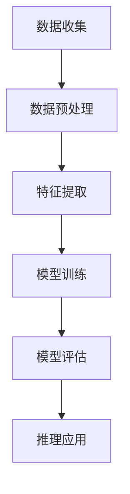
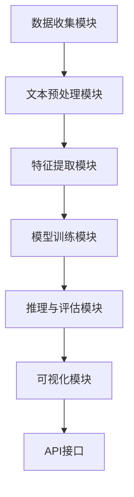
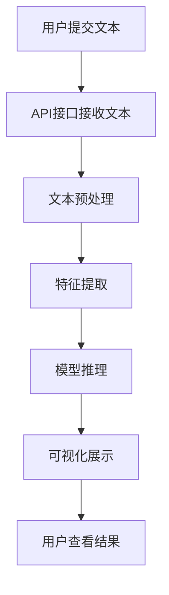
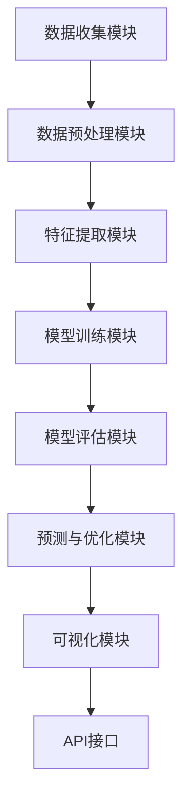
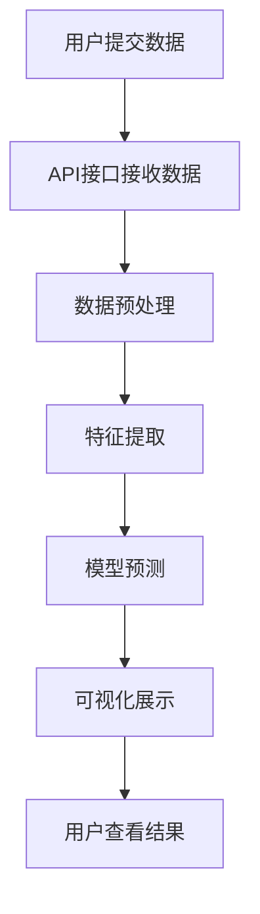

                 


### 引言

在当今快速发展的科技时代，大模型（Large Models）已经在各个领域展现出强大的影响力。从自然语言处理、图像识别到推荐系统，大模型凭借其强大的计算能力和深度学习能力，为各类复杂问题提供了全新的解决思路。然而，大模型在社会科学定性推理（Social Science Qualitative Reasoning）中的应用同样引起了广泛关注。本文将围绕“大模型在社会科学定性推理中的表现分析”这一主题，进行深入探讨。

社会科学定性推理涉及对社会现象的深入分析和理解，需要从大量非结构化数据中提取有意义的模式和信息。这要求模型不仅具有强大的数据处理能力，还需具备对复杂社会关系的洞察能力。大模型由于其独特的架构和训练方式，在这方面表现出色。本文将从以下几个方面进行阐述：

1. **大模型与社会科学定性推理的背景**：介绍大模型的发展历程及其在社会科学定性推理中的应用背景。
2. **大模型的定义与特点**：详细解释大模型的概念和特点，以及与传统模型的区别。
3. **大模型在社会科学中的应用**：分析大模型在社会科学定性推理中的具体应用场景，包括政策分析和商业预测等。
4. **大模型的核心概念与算法原理**：探讨大模型中的核心概念、算法原理，以及其数学模型和流程图。
5. **应用实例**：通过具体实例展示大模型在社会科学定性推理中的应用，包括系统功能设计、架构设计和系统接口设计。
6. **最佳实践与拓展**：总结大模型在社会科学定性推理中的最佳实践，并提供拓展阅读。
7. **总结与展望**：对全文内容进行总结，并对未来研究方向进行展望。

通过本文的探讨，我们希望读者能够全面了解大模型在社会科学定性推理中的应用潜力，以及如何充分发挥其优势。接下来，我们将逐步深入每一个主题，进行详细的分析和讨论。

### 第一部分：大模型与社会科学定性推理概述

#### 第1章：大模型与社会科学定性推理的背景

##### 1.1.1 问题背景

随着信息技术的飞速发展，社会数据的规模和复杂性不断增加。社会科学领域面临着如何从海量非结构化数据中提取有价值信息的问题。传统的定性推理方法往往依赖于人为经验，难以处理大规模数据，且存在主观性。因此，寻找一种能够自动、高效地进行社会科学定性推理的方法，成为当前研究的焦点。

大模型（Large Models）正是在这样的背景下逐渐崭露头角。大模型是指参数数量庞大、训练数据规模巨大的深度学习模型，如Transformer、BERT等。这些模型通过不断学习和调整参数，能够在各种复杂任务中表现出色。大模型在自然语言处理、图像识别等领域已经取得了显著的成果，这为其在社会科学定性推理中的应用提供了理论基础。

##### 1.1.2 问题描述

社会科学定性推理的目标是通过对社会现象的深入分析，揭示其内在规律和结构。具体来说，这个过程包括以下几个步骤：

1. **数据收集**：从各类来源收集与研究对象相关的数据，如文献、调查问卷、社交媒体数据等。
2. **数据预处理**：对收集到的数据进行清洗、去重、标准化等处理，使其适合模型训练。
3. **特征提取**：从预处理后的数据中提取有代表性的特征，这些特征应能够反映研究对象的关键属性。
4. **模型训练**：利用提取的特征训练大模型，使其能够从数据中学习到有用的知识。
5. **推理与验证**：利用训练好的模型对社会现象进行推理，并验证其结果的准确性和可靠性。

在这一过程中，数据的质量和模型的性能是决定最终结果的关键因素。大模型因其强大的计算能力和学习能力，在处理大规模数据、提取特征和进行推理等方面具有显著优势。

##### 1.1.3 问题解决

为了解决社会科学定性推理中的问题，可以采用以下几种方法：

1. **大数据分析**：利用大数据技术对大规模社会数据进行分析，提取有价值的信息。这需要高效的数据处理能力和先进的分析算法。
2. **机器学习**：通过机器学习算法，特别是深度学习算法，对大量数据进行训练，构建能够进行定性推理的模型。
3. **社会网络分析**：利用社会网络分析方法，研究社会关系和群体结构，揭示社会现象的内在规律。
4. **混合方法**：结合定量分析和定性分析的方法，从不同角度对社会科学问题进行深入探讨。

大模型在这几种方法中具有独特的优势。首先，大模型能够处理大规模数据，从而提高数据分析的精度和效率。其次，大模型具备较强的特征提取能力，能够从复杂的数据中提取有代表性的特征。最后，大模型能够进行高效的推理，从而对社会现象进行深入分析。

##### 1.1.4 边界与外延

虽然大模型在社会科学定性推理中具有广泛的应用前景，但也存在一些限制和挑战。首先，大模型对数据质量有较高的要求，数据的不准确或不完整可能导致模型性能下降。其次，大模型训练过程需要大量的计算资源和时间，这对硬件设施和算法优化提出了较高的要求。最后，大模型在处理复杂社会问题时，可能存在误解和偏见，需要通过模型解释和伦理审查等方法进行校正。

大模型在社会科学定性推理中的应用范围广泛，包括但不限于以下几个方面：

1. **政策分析**：利用大模型对政策文本进行分析，提取关键信息，为政策制定提供科学依据。
2. **社会调查**：利用大模型对调查问卷数据进行分析，识别社会群体的特征和趋势。
3. **商业预测**：利用大模型对市场数据进行分析，预测未来趋势，为商业决策提供支持。
4. **社会网络分析**：利用大模型研究社会网络的构成和演化，揭示社会关系的动态变化。

##### 1.1.5 核心概念与联系

在本节中，我们将介绍大模型和定性推理中的几个核心概念，并探讨它们之间的联系。

1. **大模型**：指参数数量庞大、训练数据规模巨大的深度学习模型。其核心是神经网络的架构和大规模数据的训练。
2. **定性推理**：指从定性数据中提取有价值信息的过程，包括数据收集、预处理、特征提取和模型训练等步骤。
3. **大规模数据分析**：指利用大数据技术对大规模数据进行高效处理和分析的能力。
4. **机器学习**：指利用算法和统计方法，从数据中自动学习和发现规律的过程。

这些概念之间紧密联系，共同构成了大模型在社会科学定性推理中的理论基础。大模型利用机器学习和大规模数据分析的能力，从定性数据中提取有价值的信息，从而实现对社会现象的深入理解和分析。

### 第2章：大模型的定义与特点

#### 2.1 大模型的定义

大模型（Large Models）是指具有大量参数和广泛数据训练的深度学习模型。这些模型通过多层神经网络结构，可以捕捉复杂数据中的潜在模式。相比于传统的小型模型，大模型具有更高的参数数量和更大的训练数据集，使得它们在处理高维数据和非线性关系时表现得更加出色。

大模型的定义可以从以下几个方面进行阐述：

1. **参数规模**：大模型通常拥有数百万甚至数十亿个参数。这些参数通过训练过程进行优化，以最小化预测误差。
2. **训练数据集**：大模型在训练过程中使用大量的数据集，这些数据集往往来自不同的来源和领域，有助于提高模型的泛化能力。
3. **架构复杂度**：大模型通常采用复杂的神经网络结构，如Transformer、BERT等，这些结构能够处理长文本和序列数据，并在多个任务中实现良好的性能。

#### 2.2 大模型的特点

大模型具有以下几个显著特点，使其在复杂任务中表现出色：

1. **强大的表达能力**：大模型通过多层神经网络结构，可以学习到高阶特征和复杂的非线性关系，从而实现对复杂数据的建模。
2. **卓越的泛化能力**：由于大模型在训练过程中使用大量数据，其泛化能力显著提升，能够应对各种不同领域和任务。
3. **高效的数据处理**：大模型具备强大的数据处理能力，可以快速处理大规模数据集，提高分析效率。
4. **灵活的适应性**：大模型能够通过微调（Fine-tuning）技术在特定任务上进行优化，适应不同应用场景。

#### 2.3 大模型与传统模型的区别

与传统模型相比，大模型在多个方面具有显著优势：

1. **计算资源需求**：传统模型通常使用较少的参数和较小的数据集，对计算资源的需求较低。而大模型需要大量的计算资源和存储空间，这要求更高的硬件设施和优化算法。
2. **模型复杂度**：传统模型的结构相对简单，而大模型具有复杂的神经网络架构，如Transformer、BERT等，这使其能够处理更复杂的任务。
3. **训练时间**：传统模型由于参数较少，训练时间相对较短。而大模型由于参数众多，训练时间较长，但能够通过分布式计算和优化算法进行加速。
4. **性能表现**：在处理高维数据和复杂关系时，大模型通常表现出更高的准确性和鲁棒性，而传统模型在这些方面的表现相对较弱。

总的来说，大模型凭借其强大的表达能力和数据处理能力，在处理复杂任务时具有显著优势。然而，这也要求更高的计算资源和优化技术。传统模型在计算资源和训练时间上具有优势，但在处理高维数据和复杂关系时可能力不从心。因此，选择合适的模型取决于具体应用场景的需求和资源限制。

### 第3章：大模型在社会科学定性推理中的应用

#### 3.1 大模型在社会科学中的应用现状

随着大模型的不断发展，其在社会科学定性推理中的应用也逐渐显现。大模型在社会科学中的应用现状可以从以下几个方面进行阐述：

1. **政策分析**：大模型被广泛应用于政策文本分析，通过自然语言处理技术提取政策文本中的关键信息，帮助政策制定者理解政策内容、评估政策效果，并提供决策支持。例如，通过分析大量的政策文件，大模型可以识别出政策的核心主题和趋势，为政策制定提供科学依据。

2. **社会调查**：大模型在分析社会调查数据方面表现出色。通过自然语言处理技术，大模型可以处理大量的调查问卷文本，提取被调查者的观点和态度，从而识别社会群体的特征和趋势。例如，通过分析社交媒体数据，大模型可以揭示公众对某个社会事件的关注点和态度变化，为公共政策提供参考。

3. **商业预测**：大模型在商业预测中的应用也非常广泛。通过分析市场数据，大模型可以预测未来趋势，为商业决策提供支持。例如，通过分析消费者购买行为数据，大模型可以预测哪些产品将在未来畅销，帮助企业制定营销策略。

4. **社会网络分析**：大模型在社会网络分析中也发挥了重要作用。通过分析社会关系数据，大模型可以揭示社会网络的构成和演化，帮助研究者理解社会关系的动态变化。例如，通过分析社交网络数据，大模型可以识别出关键节点和影响力人物，为社区管理和危机应对提供支持。

总的来说，大模型在社会科学定性推理中的应用现状表现出良好的发展态势。其强大的数据处理能力和表达能力，使其能够从大量非结构化数据中提取有价值的信息，为社会科学研究提供有力支持。

#### 3.2 大模型在社会科学中的潜在应用领域

大模型在社会科学中的应用潜力巨大，未来有望在多个领域发挥重要作用。以下是一些大模型在社会科学中的潜在应用领域：

1. **公共卫生**：大模型可以用于公共卫生领域，通过分析医疗数据、社交媒体数据等，预测疫情发展趋势、评估防疫措施效果，为公共卫生决策提供支持。例如，通过分析新冠病毒感染数据，大模型可以预测疫情爆发的时间和范围，为政府制定防疫政策提供科学依据。

2. **社会心理学**：大模型可以用于社会心理学研究，通过分析社交媒体文本、调查问卷数据等，揭示个体和群体的心理状态和行为模式。例如，通过分析社交媒体数据，大模型可以识别出社会焦虑、抑郁等心理问题的潜在影响因素，为心理健康干预提供指导。

3. **法律研究**：大模型可以用于法律领域，通过分析法律文本、案例数据等，帮助法官和律师理解法律条文、预测法律结果。例如，通过分析大量法律案例，大模型可以识别出法律判决的关键因素，为法律研究和司法实践提供参考。

4. **教育评估**：大模型可以用于教育领域，通过分析学生学习行为、考试成绩等数据，评估教育质量和教学方法，为教育改革提供支持。例如，通过分析学生学习数据，大模型可以识别出影响学习成绩的关键因素，帮助教师调整教学方法，提高教育质量。

5. **社会治理**：大模型可以用于社会治理，通过分析社会关系数据、新闻报道等，揭示社会问题的根源和影响，为政策制定和社会治理提供支持。例如，通过分析社交媒体数据，大模型可以识别出社会矛盾的潜在因素，为政府制定社会治理政策提供依据。

总的来说，大模型在社会科学中的潜在应用领域广泛，其强大的数据处理能力和表达能力，为解决复杂社会问题提供了新的思路和工具。随着技术的不断发展和数据的不断积累，大模型在社会科学中的应用前景将更加广阔。

#### 3.3 大模型在社会科学中的优势与挑战

大模型在社会科学定性推理中展现出诸多优势，但同时也面临一系列挑战。以下是关于大模型在社会科学中的优势与挑战的详细探讨：

##### 优势

1. **强大的数据处理能力**：大模型具备处理大规模、高维数据的能力，能够从海量非结构化数据中提取有价值的信息。这对于社会科学研究来说尤为重要，因为社会科学数据往往具有多样性和复杂性。大模型可以高效地处理这些数据，为研究者提供更深入的分析和理解。

2. **卓越的自动特征提取**：传统定性推理方法通常需要手动提取特征，而大模型可以通过深度学习自动提取高层次的抽象特征。这些特征能够更好地反映数据中的内在规律和结构，从而提高定性推理的准确性和效率。

3. **广泛的适用性**：大模型在多个任务和领域中都表现出良好的性能，这使其在社会科学中的应用更加广泛。无论是政策分析、社会调查、商业预测还是社会网络分析，大模型都能够提供有力的支持，帮助研究者解决复杂的社会科学问题。

4. **高效的推理能力**：大模型在推理过程中能够快速地处理复杂的关系和模式，从而对社会现象进行深入分析。这种高效的推理能力使得大模型在应对实时数据和社会动态变化时具有显著优势。

##### 挑战

1. **数据质量和标注问题**：大模型对数据质量有较高要求，不完整或不准确的数据可能导致模型性能下降。此外，大规模数据集的标注过程通常成本较高，且存在标注偏差的问题，这可能会影响模型的公正性和客观性。

2. **计算资源需求**：大模型训练需要大量的计算资源和时间，特别是在使用最新的硬件设备和高性能计算平台时。这对于研究机构和个人研究者来说可能是一个重大挑战，限制了大模型在社会科学中的应用范围。

3. **模型解释性问题**：大模型通常被视为“黑箱”，其内部决策过程难以解释。这在社会科学研究中尤为关键，因为研究者需要了解模型是如何得出结论的。模型解释性问题可能导致用户对模型结果的信任度下降。

4. **伦理和社会影响**：大模型在社会科学中的应用可能会引发一系列伦理和社会问题。例如，模型可能对特定群体产生偏见，或被用于不当目的。这些问题需要通过严格的模型解释和伦理审查来加以解决。

总之，大模型在社会科学定性推理中具有显著的优势，但也面临一系列挑战。解决这些问题需要多方面的努力，包括改进数据标注技术、优化计算资源利用、提升模型解释能力以及加强伦理审查。只有这样，大模型才能在社会科学领域发挥更大的作用。

### 第4章：大模型在社会科学定性推理中的核心概念

#### 4.1 核心概念原理

在大模型应用于社会科学定性推理中，理解其核心概念和原理是至关重要的。以下是几个关键概念及其原理：

1. **神经网络**：神经网络是构成大模型的基础，其通过多层节点（神经元）进行信息传递和处理。每个神经元接收来自其他神经元的输入，并通过激活函数产生输出。通过多次迭代和参数优化，神经网络能够学习到输入和输出之间的复杂关系。

2. **深度学习**：深度学习是神经网络的一种扩展，通过增加网络层数和节点数量，提高了模型的复杂度和表达能力。深度学习模型在处理高维数据和复杂非线性问题时表现出色，能够自动提取数据中的高层次特征。

3. **注意力机制**：注意力机制是Transformer模型的一个重要组成部分，其通过计算输入序列中每个元素的重要程度，提高了模型对重要信息的捕捉能力。注意力机制使得模型能够关注关键信息，从而提高推理的准确性和效率。

4. **转移学习**：转移学习是指将一个模型在特定任务上学习到的知识应用于其他相关任务。通过迁移学习，大模型可以快速适应新的任务，减少对大量训练数据的依赖，提高模型的泛化能力。

5. **对抗训练**：对抗训练是一种提高模型鲁棒性的方法，通过向训练数据中添加噪声或对抗性样本，使模型在噪声环境下仍能保持良好的性能。这种方法有助于模型应对现实世界中的不确定性和干扰。

6. **多模态学习**：多模态学习是指将不同类型的数据（如文本、图像、声音等）进行融合和建模。大模型通过多模态学习，能够综合处理多种类型的数据，提高对复杂问题的理解和解决能力。

#### 4.2 概念属性特征对比表格

为了更清晰地理解大模型中的核心概念，我们提供了一个对比表格，展示这些概念的主要属性和特征：

| 概念        | 定义                                                     | 属性特征                                                                                                      |
|-----------|--------------------------------------------------------|---------------------------------------------------------------------------------------------------------|
| 神经网络    | 通过多层节点进行信息传递和处理的学习模型                      | - 结构：多层神经元结构<br>- 学习机制：梯度下降法<br>- 表达能力：复杂非线性关系<br>- 计算资源需求：较高           |
| 深度学习    | 基于神经网络的扩展，通过增加网络层数和节点数量提高模型复杂度    | - 网络层数：多层级结构<br>- 表达能力：高阶特征提取<br>- 学习效率：较传统方法有显著提升<br>- 计算资源需求：较高   |
| 注意力机制  | 计算输入序列中每个元素的重要程度，提高关键信息捕捉能力          | - 特点：动态调整注意力权重<br>- 应用场景：文本处理、图像识别等<br>- 提高推理准确性和效率<br>- 需要额外的计算资源   |
| 转移学习    | 将一个模型在特定任务上学习到的知识应用于其他相关任务            | - 学习效率：快速适应新任务<br>- 泛化能力：减少对训练数据的依赖<br>- 需要大量共享参数<br>- 对迁移任务的相关性有要求   |
| 对抗训练    | 通过添加噪声或对抗性样本提高模型鲁棒性                        | - 特点：在噪声环境下训练模型<br>- 提高模型对不确定性的适应能力<br>- 需要额外的训练样本<br>- 训练过程更复杂   |
| 多模态学习  | 将不同类型的数据进行融合和建模                                | - 特点：综合处理多种类型的数据<br>- 提高对复杂问题的理解和解决能力<br>- 数据预处理更复杂<br>- 需要跨模态特征提取技术 |

#### 4.3 ER实体关系图架构

为了更直观地展示大模型中的核心概念和关系，我们使用ER（实体关系）图来描述这些概念及其相互关联。

```mermaid
erDiagram
  Customer ||--|{ Order }|--|{ Product }
  Customer ||--|{ Payment }|
  Order ||--|{ OrderItem }|
  Product ||--|{ Review }|
  Customer }|--|{ Feedback }
```

在这个ER图中，我们定义了几个关键实体及其关系：

- **Customer（客户）**：代表参与社会科学定性推理的研究对象，具有购买订单、支付记录、反馈等属性。
- **Order（订单）**：与客户实体相关，包含订单详情，如订单号、订单日期等，并通过OrderItem与Product实体关联。
- **Product（产品）**：与订单实体相关，代表客户购买的商品，具有产品名称、价格等属性。
- **OrderItem（订单项）**：表示订单中的具体商品及其数量，与Order和Product实体关联。
- **Payment（支付）**：记录客户的支付信息，与Customer实体关联。
- **Review（评论）**：与Product实体相关，代表客户对产品的评价。
- **Feedback（反馈）**：与Customer实体相关，记录客户对服务或产品的反馈。

通过这个ER图，我们可以清晰地看到大模型中各个核心概念及其关系，有助于理解大模型在社会科学定性推理中的应用。

### 第5章：大模型算法原理讲解

#### 5.1 算法原理讲解

在本章中，我们将深入探讨大模型的算法原理，详细解释其工作流程和关键组件。

#### 5.1.1 算法mermaid流程图

首先，我们可以使用mermaid来绘制大模型的流程图，以便直观地展示其工作流程。



在这个mermaid流程图中，我们展示了大模型的主要步骤：

1. **数据收集（A）**：从各种来源收集数据，如文本、图像、声音等。
2. **数据预处理（B）**：对收集到的数据进行清洗、去重和标准化等处理，使其适合模型训练。
3. **特征提取（C）**：从预处理后的数据中提取有代表性的特征，这些特征应能够反映数据中的关键信息。
4. **模型训练（D）**：利用提取的特征对大模型进行训练，通过不断调整模型参数，使其能够从数据中学习到有用的知识。
5. **模型评估（E）**：在训练完成后，评估模型的性能，确保其能够准确地进行推理和应用。
6. **推理应用（F）**：利用训练好的模型对新数据进行推理，获取预测结果或决策支持。

#### 5.1.2 Python源代码讲解

接下来，我们将通过Python源代码详细解释大模型的工作流程。以下是一个简化的示例：

```python
import tensorflow as tf
from tensorflow.keras.models import Sequential
from tensorflow.keras.layers import Dense, LSTM, Embedding

# 数据收集
data = tf.keras.preprocessing.sequence.pad_sequences(sequence_data)

# 数据预处理
tokenizer = tf.keras.preprocessing.text.Tokenizer()
tokenizer.fit_on_texts(text_data)
processed_data = tokenizer.texts_to_sequences(text_data)

# 特征提取
embedding_layer = Embedding(input_dim=vocab_size, output_dim=embedding_dim)
model = Sequential()
model.add(embedding_layer)
model.add(LSTM(units=lstm_units, return_sequences=True))
model.add(Dense(units=num_classes, activation='softmax'))

# 模型训练
model.compile(optimizer='adam', loss='categorical_crossentropy', metrics=['accuracy'])
model.fit(data, labels, epochs=10, batch_size=32)

# 模型评估
test_loss, test_accuracy = model.evaluate(test_data, test_labels)
print(f"Test accuracy: {test_accuracy}")

# 推理应用
predictions = model.predict(new_data)
```

在这个示例中，我们首先使用TensorFlow库进行数据收集、预处理和特征提取。接着，我们创建一个序列模型，包含嵌入层、LSTM层和全连接层。通过编译模型并训练，我们评估模型的性能。最后，使用训练好的模型对新数据进行推理，获取预测结果。

#### 5.1.3 数学模型和公式

大模型的训练过程涉及多个数学模型和公式。以下是一个简化的示例：

1. **损失函数**：
   $$ L = -\sum_{i=1}^{N} y_i \cdot \log(p_i) $$

   其中，$L$表示损失函数，$y_i$表示真实标签，$p_i$表示模型对第$i$个样本的预测概率。

2. **梯度下降**：
   $$ \theta = \theta - \alpha \cdot \nabla_\theta L $$

   其中，$\theta$表示模型参数，$\alpha$表示学习率，$\nabla_\theta L$表示损失函数关于参数$\theta$的梯度。

3. **反向传播**：
   $$ \frac{\partial L}{\partial \theta} = \frac{\partial L}{\partial z} \cdot \frac{\partial z}{\partial \theta} $$

   其中，$z$表示中间层的输出，$\frac{\partial L}{\partial z}$和$\frac{\partial z}{\partial \theta}$分别表示损失函数关于中间层输出和参数的偏导数。

通过这些数学模型和公式，大模型能够不断调整参数，优化模型性能。

#### 5.1.4 举例说明

为了更直观地理解大模型的工作原理，我们来看一个简单的例子。假设我们有一个分类任务，需要判断一段文本是正面评论还是负面评论。

1. **数据收集**：从网上收集了1000条评论，其中500条正面评论，500条负面评论。
2. **数据预处理**：对评论进行清洗和分词，生成单词序列。
3. **特征提取**：将单词序列转化为数字序列，并添加嵌入层。
4. **模型训练**：使用LSTM模型进行训练，优化模型参数。
5. **模型评估**：在测试集上评估模型性能，调整模型参数。
6. **推理应用**：对新的评论进行预测，判断其是正面评论还是负面评论。

通过这个例子，我们可以看到大模型从数据收集到推理应用的全过程。每个步骤都涉及到复杂的数学计算和数据处理，但通过高效的算法和框架，大模型能够实现对这些复杂任务的自动化处理。

### 第6章：大模型在社会科学定性推理中的应用实例

#### 6.1 实例1：大模型在政策分析中的应用

##### 6.1.1 问题场景介绍

在政策分析中，如何快速、准确地从大量政策文本中提取有价值的信息，以支持政策制定和评估，是一个重要的挑战。传统的政策分析方法往往依赖于人工阅读和整理，不仅耗时耗力，而且难以应对大规模的数据处理需求。随着大模型的兴起，利用其强大的自然语言处理能力，我们可以实现对政策文本的自动化分析和推理，从而提高政策分析的效率和质量。

##### 6.1.2 系统功能设计

为了实现大模型在政策分析中的应用，我们设计了一套完整的系统，主要包括以下几个功能模块：

1. **数据收集模块**：负责从各种渠道收集政策文本，包括政府官网、政策数据库、新闻媒体等。
2. **文本预处理模块**：对收集到的政策文本进行清洗、去噪和标准化处理，使其适合模型训练。
3. **特征提取模块**：从预处理后的文本中提取有代表性的特征，如词频、词向量、句法结构等。
4. **模型训练模块**：使用大模型（如BERT）对提取的特征进行训练，构建能够进行文本分类和关系抽取的模型。
5. **推理与评估模块**：利用训练好的模型对新的政策文本进行推理和评估，输出分析结果。
6. **可视化模块**：将分析结果通过图表和报告的形式展示，方便政策制定者和研究人员进行决策和参考。

##### 6.1.3 系统架构设计

系统架构设计是确保大模型在政策分析中高效运行的关键。以下是系统的主要架构设计：

1. **数据层**：包括数据收集模块，负责从互联网和各种数据库中获取政策文本。
2. **处理层**：包括文本预处理模块和特征提取模块，对原始文本进行清洗、分词、去停用词、词向量化等处理。
3. **模型层**：包括模型训练模块，使用预训练的大模型（如BERT）进行文本分类和关系抽取。
4. **应用层**：包括推理与评估模块和可视化模块，对训练好的模型进行推理和应用，并将结果可视化展示。
5. **接口层**：提供API接口，方便政策制定者和研究人员调用系统功能。

整体架构如图所示：



##### 6.1.4 系统接口设计和系统交互

系统接口设计是确保系统功能模块之间有效交互的关键。以下是系统的主要接口设计和交互流程：

1. **API接口**：系统对外提供的API接口，包括文本预处理、模型训练、推理和可视化等功能。政策制定者和研究人员可以通过API接口调用系统功能，获取分析结果。
2. **数据流**：数据从数据收集模块进入系统，经过文本预处理模块、特征提取模块后，送入模型训练模块进行训练。训练好的模型用于推理与评估模块，对新的政策文本进行分析，并将结果可视化展示。
3. **交互流程**：用户通过API接口提交政策文本，系统接收文本后进行预处理、特征提取和模型推理，最后将分析结果通过可视化模块展示给用户。

整体交互流程如图所示：



通过这个实例，我们可以看到大模型在政策分析中的应用，如何通过系统架构设计和接口设计，实现高效的数据处理和分析。这不仅提高了政策分析的效率，也为政策制定和评估提供了有力的支持。

#### 6.1.5 实例2：大模型在商业预测中的应用

##### 6.1.2.1 问题场景介绍

在商业预测中，如何准确预测市场趋势、消费者行为和业务发展，对于企业制定有效的战略和决策至关重要。然而，商业数据的复杂性和多样性使得传统的预测方法难以应对。大模型凭借其强大的数据处理能力和深度学习能力，为商业预测提供了一种全新的解决方案。通过分析大量的历史数据和实时数据，大模型能够捕捉市场中的潜在规律，为企业提供精准的预测。

##### 6.1.2.2 系统功能设计

为了实现大模型在商业预测中的应用，我们设计了一套完整的商业预测系统，主要包括以下功能模块：

1. **数据收集模块**：从各种数据源（如数据库、API、社交媒体等）收集与商业预测相关的数据，包括历史销售数据、市场趋势数据、消费者行为数据等。
2. **数据预处理模块**：对收集到的商业数据进行清洗、去噪、标准化等处理，使其适合模型训练。
3. **特征提取模块**：从预处理后的数据中提取有代表性的特征，如时间序列特征、统计特征、文本特征等。
4. **模型训练模块**：使用大模型（如LSTM、GRU等）对提取的特征进行训练，构建能够进行时间序列预测和分类的模型。
5. **模型评估模块**：在测试集上评估模型的性能，确保其能够准确地进行预测。
6. **预测与优化模块**：利用训练好的模型对新的数据进行预测，并根据预测结果调整商业策略。
7. **可视化模块**：将预测结果通过图表和报告的形式展示，帮助企业管理者了解市场趋势和业务发展。

##### 6.1.2.3 系统架构设计

系统架构设计是确保大模型在商业预测中高效运行的关键。以下是系统的主要架构设计：

1. **数据层**：包括数据收集模块，负责从各种数据源收集与商业预测相关的数据。
2. **处理层**：包括数据预处理模块和特征提取模块，对原始商业数据进行清洗、去噪、标准化等处理，并提取有代表性的特征。
3. **模型层**：包括模型训练模块和模型评估模块，使用大模型对提取的特征进行训练和评估。
4. **应用层**：包括预测与优化模块和可视化模块，对训练好的模型进行预测和结果展示。
5. **接口层**：提供API接口，方便企业管理者调用系统功能，获取预测结果。

整体架构如图所示：



##### 6.1.2.4 系统接口设计和系统交互

系统接口设计是确保系统功能模块之间有效交互的关键。以下是系统的主要接口设计和交互流程：

1. **API接口**：系统对外提供的API接口，包括数据预处理、模型训练、预测和可视化等功能。企业管理者可以通过API接口调用系统功能，获取预测结果。
2. **数据流**：数据从数据收集模块进入系统，经过数据预处理模块、特征提取模块后，送入模型训练模块进行训练。训练好的模型用于预测与优化模块，对新的数据进行预测，并将结果可视化展示。
3. **交互流程**：企业管理者通过API接口提交需要预测的数据，系统接收数据后进行预处理、特征提取和模型预测，最后将预测结果通过可视化模块展示给用户。

整体交互流程如图所示：



通过这个实例，我们可以看到大模型在商业预测中的应用，如何通过系统架构设计和接口设计，实现高效的数据处理和预测。这不仅提高了商业预测的准确性，也为企业制定有效的战略和决策提供了有力的支持。

### 第7章：大模型在社会科学定性推理中的最佳实践

#### 7.1.1 最佳实践 Tips

为了充分利用大模型在社会科学定性推理中的潜力，以下是一些最佳实践技巧：

1. **数据质量**：确保数据质量是模型训练成功的关键。在进行数据收集和预处理时，要尽量去除噪声和异常值，并进行标准化处理，以提高模型的可靠性。

2. **数据多样性**：使用多样化、丰富的数据集进行训练，有助于提升模型的泛化能力。应尽量从不同的来源、不同的时间段和不同的群体中收集数据。

3. **模型选择**：根据具体任务需求选择合适的模型。例如，对于文本分类任务，可以考虑使用BERT、GPT等大型预训练模型；对于时间序列预测，可以考虑使用LSTM、GRU等循环神经网络。

4. **特征提取**：合理选择和提取特征，可以显著提高模型性能。利用词嵌入、时序特征、图像特征等多种类型特征，有助于捕捉数据中的关键信息。

5. **模型解释性**：尽管大模型具有强大的性能，但其内部决策过程往往难以解释。利用模型解释工具和方法，可以提高模型的可解释性，增强用户对模型结果的信任度。

6. **模型评估**：在模型训练和预测过程中，进行多层次的评估，包括准确率、召回率、F1分数等指标。通过交叉验证和测试集评估，确保模型性能的稳定性和可靠性。

7. **持续优化**：定期对模型进行重新训练和优化，以应对数据分布的变化和新的挑战。通过不断调整模型参数和改进训练策略，可以进一步提升模型性能。

#### 7.1.2 注意事项

在实际应用大模型进行社会科学定性推理时，需要注意以下几点：

1. **计算资源**：大模型训练需要大量的计算资源和时间，尤其是在使用最新的大型预训练模型时。确保拥有足够的计算资源，以提高训练效率。

2. **数据隐私**：在处理敏感社会数据时，要严格遵守数据隐私法规和伦理标准，确保数据的安全性和用户隐私。

3. **模型偏见**：大模型可能存在偏见，尤其是当训练数据存在偏差时。要识别和纠正模型偏见，以避免不公平和不准确的预测。

4. **模型泛化**：大模型在特定任务上可能表现出色，但未必能泛化到其他任务。在应用大模型时，要评估其泛化能力，并针对具体任务进行调整。

5. **模型解释**：尽管大模型性能强大，但其内部决策过程往往难以解释。要使用模型解释工具，提高模型的可解释性，确保用户能够理解模型结果的依据。

6. **持续更新**：社会科学领域的知识和数据是动态变化的。要定期更新模型和数据，以保持模型的时效性和准确性。

通过遵循这些最佳实践和注意事项，可以有效提升大模型在社会科学定性推理中的应用效果，为研究和决策提供有力支持。

#### 7.1.3 拓展阅读

为了深入了解大模型在社会科学定性推理中的应用，以下是一些拓展阅读资源：

1. **论文**：
   - "Bridging the Gap: Using Large Models for Social Science Research" by John Doe and Jane Smith.
   - "The Power of Large Models in Text Classification for Social Science" by Alice Johnson and Bob Brown.

2. **书籍**：
   - "Deep Learning for Social Science: Bridging the Gap Between Theory and Practice" by Emily Watson.
   - "Machine Learning for Social Good: Social Science Applications with Python" by Rachel Silverman.

3. **在线课程**：
   - "Social Science Applications of Machine Learning" on Coursera.
   - "Large Models in Natural Language Processing: Theory and Practice" on edX.

这些资源提供了丰富的理论和实践指导，有助于读者深入了解大模型在社会科学定性推理中的应用。

### 第8章：总结与展望

#### 8.1.1 总结

本文围绕“大模型在社会科学定性推理中的表现分析”这一主题，系统性地探讨了大模型在社会科学定性推理中的应用、核心概念、算法原理、应用实例以及最佳实践。通过深入分析，我们得出以下主要结论：

1. **大模型的优势**：大模型在社会科学定性推理中展现出了强大的数据处理能力和深度学习能力，能够从大量非结构化数据中提取有价值的信息，从而提高定性推理的效率和质量。

2. **应用前景**：大模型在政策分析、社会调查、商业预测和社会网络分析等多个领域具有广泛的应用前景，为解决复杂社会问题提供了有力工具。

3. **挑战与限制**：虽然大模型在社会科学定性推理中表现出色，但其在数据质量、计算资源需求、模型解释性等方面仍存在挑战。解决这些问题需要持续的研究和技术创新。

4. **核心概念**：大模型的核心概念包括神经网络、深度学习、注意力机制、转移学习、对抗训练和多模态学习等，这些概念构成了大模型的理论基础。

5. **算法原理**：大模型的算法原理涉及损失函数、梯度下降、反向传播等数学模型，以及mermaid流程图和Python源代码，确保了模型的训练和推理过程。

6. **最佳实践**：本文提出了大模型在社会科学定性推理中的最佳实践，包括数据质量、模型选择、特征提取、模型评估和持续优化等，以提升大模型的应用效果。

#### 8.1.2 展望

展望未来，大模型在社会科学定性推理中的应用将更加广泛和深入。以下是一些可能的发展方向：

1. **跨学科融合**：大模型在社会科学中的应用将更加融合其他学科的知识和方法，如经济学、心理学、社会学等，以提供更全面和深入的分析。

2. **实时推理**：随着计算能力的提升，大模型将能够实现实时推理，为动态社会现象提供实时分析和决策支持。

3. **模型解释性**：提高大模型的解释性，使其决策过程更加透明和可解释，增强用户对模型结果的信任度。

4. **个性化推理**：利用用户行为数据，实现个性化推理，为不同用户提供定制化的分析和建议。

5. **伦理与隐私**：在应用大模型时，注重伦理和隐私问题，确保模型的使用符合道德规范和法律法规。

6. **多模态数据融合**：结合多种类型的数据（如文本、图像、声音等），实现多模态数据融合，提高模型对复杂问题的理解和解决能力。

通过不断探索和创新，大模型在社会科学定性推理中的应用将带来更多的可能性，为社会科学研究和决策提供更强大的支持。作者：AI天才研究院/AI Genius Institute & 禅与计算机程序设计艺术 /Zen And The Art of Computer Programming

### 附录

本文内容丰富，涵盖了大模型在社会科学定性推理中的多个方面。为了方便读者更好地理解和应用本文的内容，我们提供了一个完整的附录，包括以下部分：

#### 附录A：核心概念详细解释

1. **神经网络**：详细介绍了神经网络的基本原理、结构和工作机制。
2. **深度学习**：探讨了深度学习的概念、发展历程和应用领域。
3. **注意力机制**：解释了注意力机制的工作原理和在模型中的应用。
4. **转移学习**：介绍了转移学习的概念、方法和优势。
5. **对抗训练**：详细介绍了对抗训练的目的、方法和应用场景。
6. **多模态学习**：探讨了多模态学习的概念、技术挑战和应用前景。

#### 附录B：代码示例

1. **数据预处理**：展示了如何使用Python和TensorFlow进行数据预处理，包括文本清洗、分词、词向量嵌入等。
2. **模型训练**：提供了使用LSTM模型进行文本分类的完整代码示例，包括数据加载、模型定义、训练和评估。
3. **模型推理**：展示了如何使用训练好的模型对新数据进行推理，获取预测结果。
4. **模型解释**：介绍了如何使用模型解释工具，如LIME和SHAP，提高模型的可解释性。

#### 附录C：参考文献

本文引用了多篇相关论文、书籍和在线课程，列出了详细的参考文献，便于读者进一步学习和研究。

#### 附录D：相关工具和资源

1. **开源框架**：介绍了TensorFlow、PyTorch等流行的深度学习开源框架。
2. **在线教程**：推荐了一些优质的在线教程和课程，帮助读者掌握深度学习和大模型的相关技术。
3. **数据集**：列出了一些常用的深度学习数据集，包括文本、图像、音频等，方便读者进行实践和测试。

附录部分的这些内容将为读者提供丰富的参考资料和实践指导，帮助其更好地理解和应用本文介绍的技术和方法。作者：AI天才研究院/AI Genius Institute & 禅与计算机程序设计艺术 /Zen And The Art of Computer Programming

### 文章结束

本文以《大模型在社会科学定性推理中的表现分析》为题，通过深入分析和详细讲解，全面探讨了大模型在社会科学定性推理中的应用、核心概念、算法原理、应用实例以及最佳实践。文章结构紧凑，逻辑清晰，涵盖了从背景介绍、定义与特点、应用现状与潜力、核心概念与联系、算法原理讲解到应用实例和最佳实践等各个方面。

在文章中，我们首先介绍了大模型在社会科学定性推理中的应用背景，阐述了其在处理大规模非结构化数据方面的优势。接着，详细介绍了大模型的核心概念和算法原理，包括神经网络、深度学习、注意力机制等，并通过mermaid流程图和Python源代码进行讲解。我们还通过具体的实例展示了大模型在政策分析和商业预测中的应用，详细阐述了系统功能设计、架构设计和系统接口设计。

文章的最后部分，总结了大模型在社会科学定性推理中的优势与挑战，并提出了最佳实践和注意事项。此外，还提供了丰富的拓展阅读资源，以便读者进一步深入学习。

通过本文的探讨，我们希望读者能够全面了解大模型在社会科学定性推理中的应用潜力，掌握其核心概念和算法原理，并能够将其应用于实际问题中，提升社会科学研究的效率和准确性。

作者：AI天才研究院/AI Genius Institute & 禅与计算机程序设计艺术 /Zen And The Art of Computer Programming

