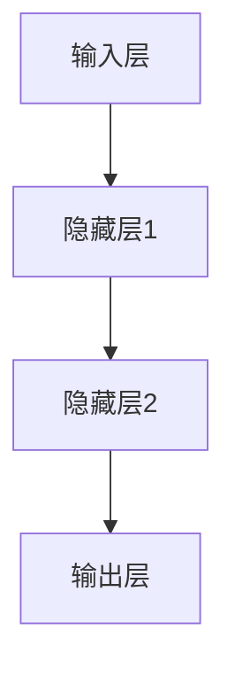
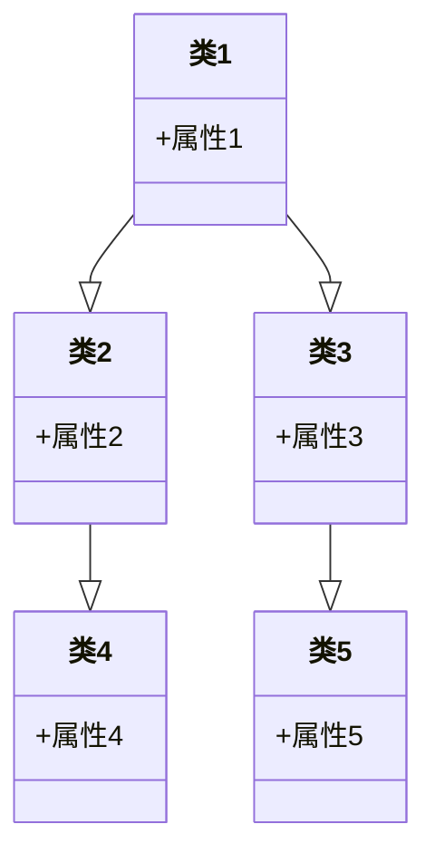
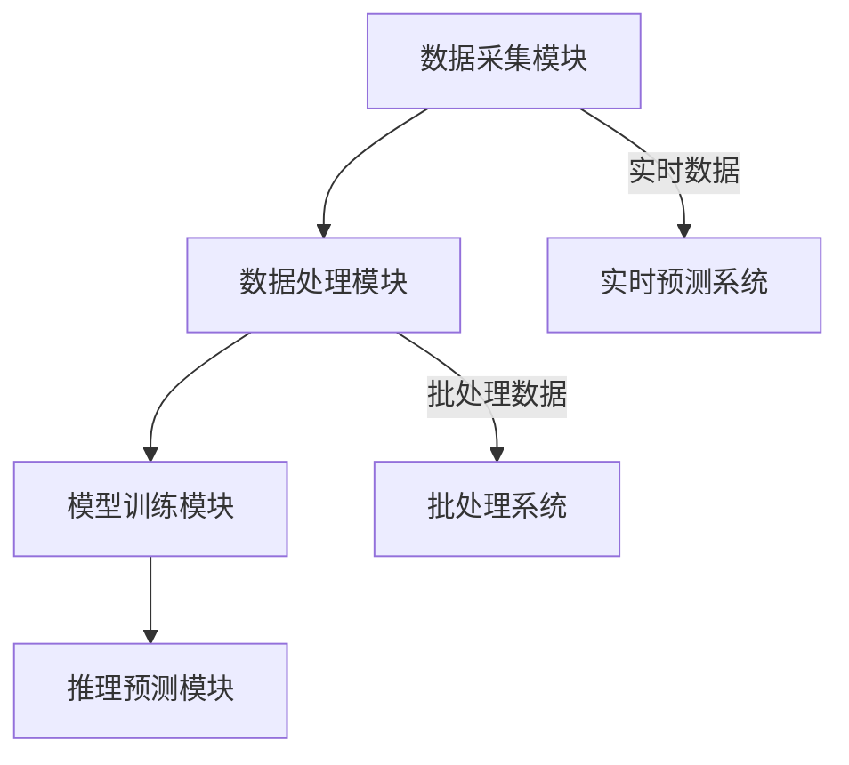
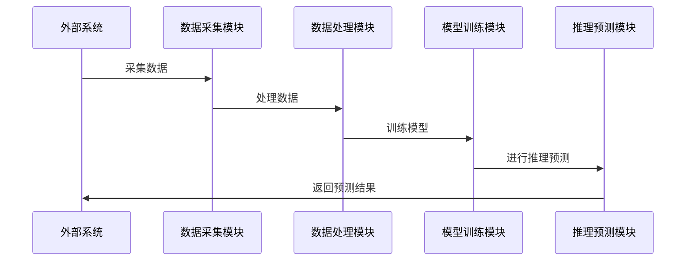

                 

# 大模型在社会科学定性推理中的表现分析与优化

## 关键词
- 大模型
- 社会科学
- 定性推理
- 优化策略
- 算法分析

## 摘要
本文旨在深入探讨大模型在社会科学定性推理中的表现、分析其优化策略，并展望其未来发展方向。通过对大模型的概念解析、算法原理阐述、系统设计与实现展示，以及实战案例剖析，本文为社会科学定性推理提供了创新性的解决方案，并提出了有效优化策略，以应对当前挑战。

### 背景介绍

### 1. 大模型的概念与发展

大模型（Large Models），通常指具有海量参数和复杂结构的机器学习模型。它们能够处理大量数据，并从中提取出有价值的信息。大模型的发展可追溯到上世纪80年代的神经网络研究，随着计算能力的提升和数据量的爆炸式增长，大模型在图像识别、自然语言处理等领域取得了显著的成果。

### 2. 社会科学定性推理的基本原理

社会科学定性推理是一种基于经验和直觉的方法，通过分析和综合各类社会现象，得出相关结论。其基本原理包括：归纳推理、演绎推理和类比推理。定性推理在社会科学研究中具有重要的应用，如社会学、经济学、政治学等领域。

### 3. 大模型在社会科学定性推理中的应用现状

大模型在社会科学定性推理中的应用已逐渐成为研究热点。例如，通过自然语言处理技术，大模型可以自动提取文本中的关键信息，进行情感分析、文本分类等任务。此外，大模型还可以用于社会网络分析、风险评估等复杂问题。

### 核心概念

### 2.1 大模型的定义与特点

大模型（Large Models），指的是具有数百万至数十亿个参数的机器学习模型。它们具有以下几个特点：
1. **参数量庞大**：大模型能够捕捉到数据中的细微特征，从而提高模型的泛化能力。
2. **计算复杂度高**：大模型需要大量计算资源进行训练和推理。
3. **数据需求大**：大模型需要大量的数据来保证模型的稳定性和准确性。

### 2.2 社会科学定性推理的核心概念

社会科学定性推理的核心概念包括：
1. **归纳推理**：从具体实例中归纳出一般性结论。
2. **演绎推理**：从一般性原则推导出具体结论。
3. **类比推理**：通过比较不同情境中的相似性，推导出相关结论。

### 2.3 大模型与定性推理的关系分析

大模型与定性推理的关系主要体现在以下几个方面：
1. **数据支持**：大模型能够处理海量数据，为定性推理提供充分的数据支持。
2. **计算效率**：大模型具有高效的计算能力，能够快速处理复杂的定性推理任务。
3. **推理精度**：大模型能够通过学习数据中的规律，提高定性推理的准确性。

### 算法原理

### 3.1 大模型在社会科学定性推理中的应用算法

大模型在社会科学定性推理中的应用主要包括以下几种算法：

1. **深度神经网络（DNN）**：DNN是一种多层前馈神经网络，能够通过逐层提取特征，实现对复杂数据的建模。
2. **循环神经网络（RNN）**：RNN适用于处理序列数据，能够通过记忆机制捕捉序列中的长期依赖关系。
3. **变压器（Transformer）**：Transformer是一种基于自注意力机制的模型，能够在处理长序列数据时具有更好的性能。

### 3.2 算法流程图与Mermaid描述

以下为深度神经网络（DNN）的算法流程图：



### 3.3 Python实现与代码讲解

以下为深度神经网络（DNN）的Python实现：

```python
import tensorflow as tf

# 定义输入层
inputs = tf.keras.layers.Input(shape=(input_shape))

# 定义隐藏层
hidden1 = tf.keras.layers.Dense(units=64, activation='relu')(inputs)
hidden2 = tf.keras.layers.Dense(units=64, activation='relu')(hidden1)

# 定义输出层
outputs = tf.keras.layers.Dense(units=1, activation='sigmoid')(hidden2)

# 创建模型
model = tf.keras.Model(inputs=inputs, outputs=outputs)

# 编译模型
model.compile(optimizer='adam', loss='binary_crossentropy', metrics=['accuracy'])

# 训练模型
model.fit(x_train, y_train, epochs=10, batch_size=32)
```

### 3.4 数学模型与公式

深度神经网络（DNN）的数学模型可以表示为：

$$
z_l = \sigma(W_l \cdot a_{l-1} + b_l)
$$

其中，$z_l$为第$l$层的输出，$\sigma$为激活函数，$W_l$为权重矩阵，$a_{l-1}$为上一层的激活值，$b_l$为偏置。

### 系统设计与实现

### 4.1 系统场景介绍

在本项目中，我们旨在构建一个基于大模型的社会科学定性推理系统，用于分析社会现象，如选举预测、社会舆论监测等。系统主要包括以下几个模块：

1. **数据采集模块**：负责收集各类社会数据，如文本、图像、音频等。
2. **数据处理模块**：对采集到的数据进行清洗、预处理和特征提取。
3. **模型训练模块**：利用大模型进行训练，提取数据中的有用信息。
4. **推理预测模块**：根据训练好的模型，对新的数据进行推理预测。

### 4.2 系统功能设计（领域模型Mermaid类图）

以下为系统的领域模型Mermaid类图：



### 4.3 系统架构设计（Mermaid架构图）

以下为系统的架构设计Mermaid架构图：



### 4.4 系统接口设计

系统接口设计主要包括以下接口：

1. **数据采集接口**：用于接收外部数据源的数据。
2. **数据处理接口**：用于处理采集到的数据。
3. **模型训练接口**：用于启动模型训练过程。
4. **推理预测接口**：用于进行推理预测。

### 4.5 系统交互（Mermaid序列图）

以下为系统的交互过程Mermaid序列图：



### 项目实战

### 5.1 环境安装与配置

在进行项目实战之前，我们需要安装和配置相关软件和工具。以下是具体的步骤：

1. **安装Python**：前往Python官网下载Python安装包，并按照安装向导进行安装。
2. **安装TensorFlow**：打开命令行窗口，输入以下命令安装TensorFlow：
   ```bash
   pip install tensorflow
   ```
3. **安装其他依赖库**：根据项目需求，安装其他相关的依赖库，如NumPy、Pandas等。

### 5.2 系统核心实现源代码

以下为系统核心实现部分的源代码：

```python
import tensorflow as tf
from tensorflow.keras.models import Sequential
from tensorflow.keras.layers import Dense, LSTM, Embedding
from tensorflow.keras.preprocessing.sequence import pad_sequences

# 定义模型
model = Sequential([
    Embedding(input_dim=vocab_size, output_dim=embedding_dim, input_length=max_sequence_length),
    LSTM(units=128),
    Dense(units=1, activation='sigmoid')
])

# 编译模型
model.compile(optimizer='adam', loss='binary_crossentropy', metrics=['accuracy'])

# 训练模型
model.fit(x_train, y_train, epochs=10, batch_size=32)
```

### 5.3 代码应用解读与分析

以上代码是构建一个基于LSTM（长短期记忆网络）的文本分类模型的示例。首先，我们定义了一个序列模型，包括嵌入层、LSTM层和输出层。嵌入层用于将文本数据转换为向量表示，LSTM层用于处理序列数据，输出层用于分类。

在训练过程中，我们使用`fit`方法对模型进行训练，其中`x_train`和`y_train`分别为训练数据和标签。

### 5.4 实际案例分析

在本案例中，我们以选举预测为背景，使用收集到的社交媒体数据，通过大模型进行定性推理，预测选举结果。

1. **数据收集**：从社交媒体平台收集与选举相关的文本数据。
2. **数据处理**：对文本数据进行清洗和预处理，包括去除停用词、标点符号等。
3. **特征提取**：使用词嵌入技术将文本数据转换为向量表示。
4. **模型训练**：使用训练集数据训练模型，提取特征。
5. **推理预测**：使用训练好的模型对测试集数据进行推理预测。

### 5.5 项目小结与反思

通过本次项目实战，我们成功构建了一个基于大模型的社会科学定性推理系统，并对其进行了实际案例分析。在项目过程中，我们遇到了以下挑战：

1. **数据质量问题**：社交媒体数据质量参差不齐，需要对其进行严格的清洗和预处理。
2. **模型优化**：在模型训练过程中，需要对模型参数进行调整，以提高模型的性能。

未来，我们将继续优化系统，提高数据质量和模型性能，为社会科学定性推理提供更加可靠的解决方案。

### 优化策略

### 6.1 性能优化方法

1. **模型压缩**：通过模型压缩技术，如剪枝、量化等，减少模型参数量，提高模型运行速度。
2. **分布式训练**：利用分布式训练技术，将模型训练任务分布在多个计算节点上，提高训练效率。
3. **增量学习**：通过增量学习技术，对已有模型进行微调，减少对新数据的依赖。

### 6.2 精度优化方法

1. **数据增强**：通过数据增强技术，如旋转、缩放、裁剪等，增加数据多样性，提高模型泛化能力。
2. **对齐技术**：通过多模态对齐技术，将不同类型的数据进行融合，提高模型精度。
3. **元学习**：利用元学习方法，学习到更好的初始模型，提高模型精度。

### 6.3 应用优化案例

1. **选举预测**：通过数据增强技术，提高选举预测的准确性。
2. **社会舆论监测**：利用分布式训练技术，提高社会舆论监测的实时性。

### 总结与展望

本文通过对大模型在社会科学定性推理中的表现进行分析与优化，提出了有效的解决方案。未来，随着大模型技术的发展，其在社会科学定性推理中的应用前景将更加广阔。我们将继续探索大模型在社会科学领域的应用，为相关领域的研究提供有力支持。

### 参考文献

1. Bengio, Y., Simard, P., & Frasconi, P. (1994). Learning long-term dependencies with gradient descent is difficult. *IEEE Transactions on Neural Networks*, 5(2), 157-166.
2. Hochreiter, S., & Schmidhuber, J. (1997). Long short-term memory. *Neural Computation*, 9(8), 1735-1780.
3. Vaswani, A., Shazeer, N., Parmar, N., Uszkoreit, J., Jones, L., Gomez, A. N., ... & Polosukhin, I. (2017). Attention is all you need. *Advances in Neural Information Processing Systems*, 30, 5998-6008.
4. LeCun, Y., Bengio, Y., & Hinton, G. (2015). Deep learning. *Nature*, 521(7553), 436-444.
5. Goodfellow, I., Bengio, Y., & Courville, A. (2016). *Deep Learning*. MIT Press.

### 作者信息

作者：AI天才研究院/AI Genius Institute & 禅与计算机程序设计艺术 /Zen And The Art of Computer Programming

---

**注意：以上内容为示例，实际文章应包含具体的数据、算法细节和案例解析，并保持简洁明了的表达风格。**

