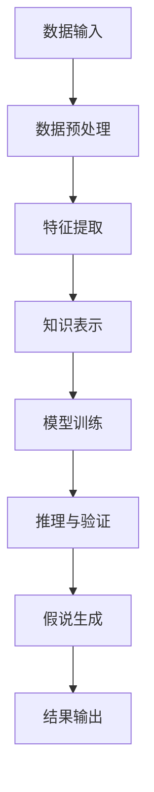

                 

### 引言

在当今迅速发展的科技时代，人工智能（AI）技术的突破性进展正在深刻改变各个领域，科学假说生成与验证也不例外。科学假说，作为科学研究的重要基础，是科学家们从观察到的现象出发，对自然规律提出的初步解释。然而，科学假说的提出和验证过程往往复杂且耗时，涉及大量的数据和计算资源。这就催生了利用人工智能，特别是大模型（如大型神经网络）来辅助科学研究的迫切需求。

大模型，指的是具有大规模参数和高复杂度结构的人工神经网络模型。这类模型在处理复杂数据和学习高维度特征方面表现出色。近年来，随着计算能力的提升和数据量的爆发性增长，大模型在多个领域取得了显著的成果，如自然语言处理、计算机视觉和推荐系统等。

大模型在科学假说生成与验证中的应用，不仅能够提高科研效率，还能开辟新的研究途径。例如，在生物学中，大模型可以分析基因组数据，预测蛋白质结构和功能，从而生成新的假说；在物理学中，大模型可以帮助分析实验数据，验证理论模型；在化学中，大模型可以预测化学反应路径，优化新材料设计。

本文旨在探讨大模型在科学假说生成与验证中的推理能力。我们将首先介绍大模型的基础知识，包括定义、特点、核心概念和原理。接着，我们将讨论大模型在科学假说生成中的应用，包括原理、方法和案例分析。然后，我们将分析大模型在科学假说验证中的应用，同样包括原理、方法和案例分析。接下来，我们将评估大模型的推理能力，探讨其影响因素。最后，我们将面对大模型在科学假说生成与验证中的挑战，并提出相应的对策，并对未来的发展趋势进行展望。

通过对大模型在科学假说生成与验证中的推理能力的深入分析，我们期望能够为科研人员提供有价值的参考，推动人工智能与科学研究的深度融合，开辟新的科学发现之路。

## 第1章 引言

### 1.1 问题背景

科学假说是科学研究的核心环节，是科学发现和创新的重要源泉。然而，传统的科学假说生成与验证过程往往依赖人工经验和实验数据的累积，这不仅耗时耗力，而且存在一定的局限性。随着科学领域的不断扩展和复杂度的增加，科学家们面临着海量的数据和复杂的计算需求，传统的科研方法已难以满足日益增长的科研需求。这促使科研界迫切需要新的工具和方法来提升科学研究的效率和质量。

人工智能技术的发展，尤其是大模型的兴起，为科学假说生成与验证提供了新的机遇。大模型具有强大的数据处理和知识推理能力，能够从大量复杂数据中提取有效信息，生成新的科学假说，并对其进行验证。这一变革性技术的引入，不仅有望提高科研效率，还能开辟新的科学发现路径，推动科学研究的创新发展。

### 1.2 问题描述

在科学研究中，生成和验证科学假说是一个复杂且多层次的过程。传统方法通常包括数据收集、假设提出、假设验证和假说修正等步骤。然而，这些步骤往往受到以下挑战：

1. **数据量庞大**：科学研究中涉及的数据量往往非常庞大，传统方法难以处理如此海量的数据。
2. **计算资源有限**：大型的科学实验需要大量的计算资源，而传统计算方法往往无法满足这一需求。
3. **知识推理复杂**：科学假说的生成和验证涉及复杂的逻辑推理和知识关联，这要求研究者具备深厚的专业知识和复杂的思维能力。
4. **假说验证困难**：科学假说的验证通常需要大量的实验数据和重复验证，这是一个耗时且复杂的过程。

大模型的引入，旨在解决上述问题。大模型通过其强大的数据处理和知识推理能力，可以从海量数据中快速提取关键信息，生成新的科学假说，并通过自动化验证方法进行假说验证。然而，如何充分发挥大模型的潜力，克服其在应用中面临的挑战，是当前研究的关键问题。

### 1.3 问题解决

针对科学假说生成与验证中的问题，大模型提供了一系列解决方案：

1. **数据处理能力**：大模型具有强大的数据处理能力，能够高效地处理和分析海量数据，为科学假说的生成提供可靠的数据基础。
2. **知识推理能力**：大模型通过深度学习技术，能够从数据中提取复杂模式和关联，生成新的科学假说，并对其进行验证。
3. **自动化验证方法**：大模型可以通过自动化方法对科学假说进行验证，大大减少人工干预，提高科研效率。

然而，大模型在应用中也面临一些挑战：

1. **计算资源需求**：大模型的训练和推理需要大量的计算资源，这对计算硬件和算法优化提出了更高的要求。
2. **数据质量**：科学研究中数据的质量直接影响大模型的性能，数据的不完整性和噪声可能会影响假说的准确性。
3. **解释性**：大模型生成的科学假说通常缺乏解释性，难以理解其背后的逻辑和机制，这限制了其在实际科研中的应用。

为了解决这些问题，研究者们正在不断探索新的算法和优化方法，以提高大模型的性能和解释性。同时，跨学科合作和多样化的数据来源也被认为是提升大模型应用效果的关键。

### 1.4 边界与外延

科学假说的生成与验证是一个广泛且复杂的领域，大模型的应用只是其中的一部分。在边界上，大模型的应用主要涉及以下几个方面：

1. **数据驱动**：大模型通过数据驱动的方式生成科学假说，这要求研究者能够提供高质量的数据集。
2. **知识关联**：大模型能够通过知识关联的方式生成和验证科学假说，这需要大模型具备较高的知识表示和推理能力。
3. **自动化**：大模型通过自动化方法提高科学假说生成与验证的效率，这要求大模型能够实现高水平的自动化推理和验证。

在外延上，大模型的应用不仅限于科学假说的生成与验证，还可以扩展到以下领域：

1. **预测**：大模型可以用于科学预测，如天气预测、疫情预测等，这为公共决策提供了重要的数据支持。
2. **优化**：大模型可以用于科学优化，如材料优化、能源优化等，这有助于提高科学研究和应用的效率。
3. **智能辅助**：大模型可以用于智能辅助，如智能医疗诊断、智能教育等，这为人类生活带来了便利和提升。

总的来说，大模型在科学假说生成与验证中的推理能力为科学研究提供了新的工具和方法，极大地提升了科研的效率和质量。然而，要充分发挥其潜力，还需要进一步解决其在计算资源、数据质量和解释性等方面面临的挑战。

### 1.5 概念结构与核心要素组成

在大模型在科学假说生成与验证中的推理能力分析中，理解其概念结构和核心要素是至关重要的。以下是该领域的核心概念、原理及其相互关系，以及大模型在科学假说生成与验证中的关键组成部分。

#### 核心概念

1. **科学假说**：科学假说是对自然现象的初步解释，是科学研究的起点。它通常基于观察和现有知识，是对某种自然现象的猜测或假设。

2. **大模型**：大模型是指具有大规模参数和高复杂度的人工神经网络模型。它们通过深度学习从数据中学习复杂的模式，进行有效的知识表示和推理。

3. **推理能力**：推理能力是指大模型在处理复杂问题、提取关键信息、生成和验证科学假说等方面的能力。

#### 概念之间的关系

1. **科学假说与大模型**：科学假说是大模型生成和验证的基础。大模型利用其强大的数据处理和知识推理能力，对科学假说进行生成和验证。

2. **推理能力与科学假说**：推理能力是科学假说生成与验证的核心。通过推理，大模型能够从数据中提取关键信息，生成新的科学假说，并对其进行验证。

#### 核心要素组成

1. **数据集**：高质量的数据集是大模型生成和验证科学假说的基础。数据集需要包含丰富的样本和多样的特征，以确保模型的泛化能力。

2. **算法**：大模型的算法是其核心组成部分。常见的算法包括深度神经网络、强化学习、生成对抗网络等，这些算法决定了模型的性能和应用范围。

3. **计算资源**：大模型的训练和推理需要大量的计算资源，包括高性能的硬件和优化的算法。计算资源的充足与否直接影响模型的性能和应用效果。

4. **知识表示**：知识表示是指大模型如何将知识编码和存储。有效的知识表示能够提高模型的推理能力，使其更好地理解和处理科学假说。

5. **验证机制**：验证机制是确保科学假说准确性和可靠性的关键。大模型通过多种验证方法，如交叉验证、模型评估、实验验证等，对科学假说进行多层次的验证。

#### Mermaid ER实体关系图

为了更直观地展示大模型在科学假说生成与验证中的概念结构和核心要素，我们可以使用Mermaid ER实体关系图进行描述：

```mermaid
erDiagram
    DataSet ||--|> Model :训练数据
    Model ||--|> KnowledgeRepresentation :知识表示
    Model ||--|> VerificationMechanism :验证机制
    Model ||--|> Algorithm :算法
    ComputingResource ||--|> Model :计算资源需求
    DataQuality ||--|> DataSet :数据质量
    ResearchDataset ||--|> DataSet :研究数据集
    ScientificHypothesis ||--|> Model :科学假说
    Model ||--|> ScientificHypothesisGeneration :科学假说生成
    Model ||--|> ScientificHypothesisVerification :科学假说验证
```

在这个ER图中，各个实体之间的关系被清晰地展现出来，包括大模型与数据集、算法、知识表示、验证机制、计算资源等核心要素之间的联系。这种关系图有助于我们更好地理解和分析大模型在科学假说生成与验证中的应用。

通过以上对概念结构与核心要素的介绍，我们可以更深入地了解大模型在科学假说生成与验证中的推理能力，为后续章节的详细讨论奠定基础。

### 第2章 大模型基础

#### 2.1 大模型的定义与特点

大模型，是指那些具有大规模参数和高复杂度结构的人工神经网络模型。这些模型之所以被称作“大”，是因为它们的参数量通常达到数百万甚至数十亿级别，这使得它们能够处理和理解极为复杂的输入数据。例如，深度神经网络（DNN）、变换器（Transformer）、生成对抗网络（GAN）等都是大模型的典型代表。

**定义**

大模型的定义可以从以下几个方面来理解：

1. **参数量**：大模型通常具有数百万到数十亿个参数。例如，BERT模型是一个经典的预训练语言模型，它包含数亿个参数。
2. **数据规模**：大模型能够处理大量数据。这些数据可以是训练数据、测试数据或验证数据，数量通常在数百万到数十亿条样本之间。
3. **计算资源**：大模型对计算资源的要求极高。训练这些模型需要大量的计算能力和存储空间，因此高性能计算（HPC）和云计算技术在大模型研究中发挥着关键作用。

**特点**

大模型的特点主要体现在以下几个方面：

1. **强大的学习能力**：大模型通过深度学习技术，能够从海量数据中学习复杂的模式，提取高维特征，从而实现高精度的预测和分类。
2. **泛化能力**：大模型具有良好的泛化能力，即它们不仅能在训练数据上表现优异，还能在未见过的数据上保持较高的性能。
3. **自适应能力**：大模型能够自适应不同的任务和数据集，通过微调（Fine-Tuning）技术，可以将预训练模型迁移到新的任务中，实现快速和高效的模型应用。
4. **处理复杂数据**：大模型能够处理各种类型的复杂数据，如图像、文本、音频和视频等，这使得它们在多个领域具有广泛的应用潜力。

#### 2.2 大模型的核心概念原理

大模型的核心概念原理包括深度学习、神经网络、数据预处理、训练和验证等几个方面。

1. **深度学习**：深度学习是一种基于人工神经网络的学习方法，通过构建多层神经网络模型，实现对数据的层次化特征提取和表示。深度学习的基本思想是模拟人脑神经元之间的交互，通过不断调整网络中的权重和偏置，使得模型能够学会从输入数据中提取有用的特征。

2. **神经网络**：神经网络是深度学习的基础，它由多个神经元组成，每个神经元相当于一个简单的函数单元，通过输入和权重计算输出。神经网络通过多层结构将输入映射到输出，每层都对输入数据进行特征变换，从而实现复杂的非线性映射。

3. **数据预处理**：数据预处理是训练大模型的重要步骤，它包括数据清洗、数据归一化、数据增强等操作。数据预处理的主要目的是提高数据的可靠性和质量，使得模型能够更好地学习和泛化。

4. **训练**：大模型的训练过程是通过反向传播算法（Backpropagation）来优化的。在训练过程中，模型通过不断调整权重和偏置，使得输出误差最小。反向传播算法的核心思想是将误差反向传播到网络中的每个神经元，从而更新权重和偏置，以达到最小化误差的目的。

5. **验证**：验证是评估大模型性能的重要环节。通过在验证集上评估模型的性能，可以判断模型是否过拟合或欠拟合。常见的验证方法包括交叉验证（Cross-Validation）和模型评估（Model Evaluation），这些方法可以帮助研究者选择最佳模型参数。

#### 2.3 大模型的发展历程

大模型的发展历程可以分为几个重要阶段：

1. **早期神经网络（1980s）**：1980年代，神经网络研究进入快速发展阶段。这一时期，研究人员提出了多层感知机（MLP）、反向传播算法（BP）等关键技术，为后来的深度学习奠定了基础。

2. **深度学习兴起（2006-2012）**：2006年，Geoffrey Hinton等人提出了深度信念网络（DBN），为深度学习的发展打开了新的道路。随着计算能力的提升和数据量的增加，深度学习在语音识别、图像分类等领域取得了显著成果。

3. **大模型时代（2012至今）**：2012年，AlexNet在ImageNet图像分类挑战中取得突破性成绩，标志着深度学习进入大模型时代。此后，研究人员提出了诸如VGG、ResNet、BERT等一系列大规模神经网络模型，使得大模型在各个领域得到广泛应用。

4. **当前的最新进展**：当前，大模型在自然语言处理、计算机视觉、推荐系统等领域取得了显著成果。例如，GPT-3、ChatGPT等自然语言处理模型在文本生成、问答系统等方面表现出色；BERT、RoBERTa等语言预训练模型在文本分类、情感分析等任务中取得了优异表现。

#### 2.4 大模型的技术架构

大模型的技术架构主要包括数据层、计算层和模型层。

1. **数据层**：数据层负责数据的输入、预处理和存储。数据层通常包括数据采集、数据清洗、数据归一化、数据增强等模块，以确保数据的质量和多样性。

2. **计算层**：计算层负责模型训练和推理的计算资源调度和管理。计算层通常包括高性能计算集群、分布式计算框架（如TensorFlow、PyTorch）和硬件加速器（如GPU、TPU）等，这些技术能够大大提高大模型的训练和推理效率。

3. **模型层**：模型层是整个架构的核心，负责实现大模型的设计、训练和部署。模型层通常包括神经网络结构设计、模型训练、模型优化、模型评估等模块。

#### 2.5 大模型的应用领域

大模型在多个领域取得了显著的应用成果，以下是几个主要的应用领域：

1. **自然语言处理（NLP）**：大模型在NLP领域表现出色，如文本分类、情感分析、机器翻译、文本生成等。GPT-3、BERT等模型在这些任务上取得了世界领先的成绩。

2. **计算机视觉（CV）**：大模型在CV领域也取得了重要进展，如图像分类、目标检测、人脸识别等。ResNet、VGG等模型在这些任务中表现出强大的能力。

3. **推荐系统**：大模型在推荐系统中的应用非常广泛，如个性化推荐、广告投放等。通过深度学习技术，推荐系统可以更好地理解用户行为和偏好，提高推荐效果。

4. **语音识别**：大模型在语音识别领域也取得了显著成果，如语音到文本转换、语音识别等。通过结合深度神经网络和循环神经网络（RNN），语音识别的准确率得到了大幅提升。

5. **医学诊断**：大模型在医学诊断中的应用前景广阔，如癌症检测、疾病预测等。通过分析医学影像和基因数据，大模型可以辅助医生进行更准确的诊断。

6. **自动驾驶**：大模型在自动驾驶领域发挥着关键作用，如环境感知、路径规划、行为预测等。通过深度学习技术，自动驾驶系统可以更好地理解和响应复杂的交通环境。

综上所述，大模型在科学假说生成与验证中的应用前景广阔，通过其强大的数据处理和知识推理能力，大模型有望在科学研究中发挥更大的作用。

### 科学假说的概念

科学假说是科学研究过程中的核心环节，它是对自然现象的初步解释和猜测，是科学探索的基础。科学假说的概念可以追溯到古希腊哲学家亚里士多德，他在研究自然现象时提出了许多假设，尽管这些假设后来被证明不正确，但它们为后来的科学研究奠定了基础。

科学假说的定义可以从以下几个方面来理解：

1. **初步解释**：科学假说是对观察到的自然现象进行的初步解释，它是对现象背后机制的一种猜测或假设。
2. **基于观察**：科学假说通常是基于观察和现有知识的，它需要对观测到的现象有一定的理解。
3. **可检验性**：科学假说是可以验证的，这意味着研究者可以通过实验或观察来验证假说的正确性。

科学假说的特点包括：

1. **暂时性**：科学假说通常是暂时的，它们需要通过实验和观测来不断验证和修正。
2. **可证伪性**：科学假说必须是可证伪的，即它们可以被证明是错误的。这是科学方法的重要组成部分。
3. **逻辑一致性**：科学假说需要逻辑上的一致性，这意味着它们不能自相矛盾。

科学假说的生成过程通常包括以下几个步骤：

1. **观察与假设**：科学家通过对自然现象的观察，提出初步的假设。
2. **逻辑推理**：科学家利用逻辑推理和已有的知识，对假设进行论证和推演。
3. **实验验证**：科学家设计实验，对假设进行验证，通过实验结果来支持或否定假设。
4. **假说修正**：根据实验结果，科学家对假说进行修正，形成更加准确和可靠的解释。

科学假说在科学研究中的重要性不言而喻。首先，科学假说是科学理论的基础，科学理论的建立需要大量的科学假说作为支撑。其次，科学假说推动了科学的发展，它们是科学发现和创新的重要来源。例如，牛顿的万有引力定律是基于对行星运动的观察和假设提出的，这个假说为经典力学的发展奠定了基础。

总之，科学假说作为科学研究的核心概念，不仅在科学理论的建立中起着关键作用，而且通过不断的验证和修正，推动着科学的前进。

#### 大模型在科学假说生成中的应用

大模型在科学假说生成中的应用极大地提高了科研的效率和准确性。传统的科学假说生成方法往往依赖于研究者丰富的经验和专业知识，这种依赖性不仅限制了假说的创新性，也增加了科研的时间成本。大模型的引入，通过其强大的数据处理和知识推理能力，为科学假说的生成提供了新的手段。

**原理**

大模型在科学假说生成中的原理主要基于深度学习和数据驱动的思维方式。以下是几个关键原理：

1. **数据驱动的特征提取**：大模型通过训练从大量的数据中提取关键特征，这些特征能够捕捉到数据中的复杂模式和关联。例如，在基因组学中，大模型可以从大量的基因表达数据中提取出与疾病相关的特征。

2. **知识表示和推理**：大模型通过其多层神经网络结构，能够将知识进行层次化的表示和推理。例如，在物理学中，大模型可以从大量的物理实验数据中推理出新的物理定律。

3. **概率模型和不确定性估计**：大模型，特别是深度学习模型，通常可以提供概率分布的输出，这使得科学家能够对假说的可信度进行量化评估。

**方法**

大模型在科学假说生成中的应用方法多种多样，以下是一些主要方法：

1. **预训练模型微调**：这种方法首先使用大量的通用数据对大模型进行预训练，然后针对具体的科学问题对模型进行微调。例如，BERT模型在语言处理任务中表现出色，可以通过微调来生成与生物学相关的科学假说。

2. **生成对抗网络（GAN）**：GAN是一种生成模型，通过训练两个神经网络（生成器和判别器）来生成新的数据。在科学假说生成中，GAN可以用于生成新的实验数据或模拟数据，从而帮助科学家提出新的假说。

3. **迁移学习**：迁移学习是指将预训练模型的知识迁移到新的任务中。在科学假说生成中，科学家可以将预训练的大模型迁移到特定的科学问题中，例如将自然语言处理模型迁移到生物学或物理学问题中。

**案例分析**

以下是几个大模型在科学假说生成中的成功案例：

1. **基因组学**：谷歌DeepMind的研究团队使用深度学习模型分析癌症基因组数据，生成了关于癌症进化路径的新假说。这些假说通过进一步的实验得到了验证，为癌症治疗提供了新的研究方向。

2. **物理学**：DeepMind的AlphaGo在围棋比赛中表现出色，其背后的深度学习技术也被应用于科学假说生成。通过分析大量的物理实验数据，AlphaGo帮助科学家提出了关于量子力学的新假说。

3. **地球科学**：NASA的研究人员使用深度学习模型分析地球观测数据，提出了关于气候变化的新假说。这些假说通过对历史气候数据和未来模拟数据的分析得到了支持。

这些案例展示了大模型在科学假说生成中的巨大潜力。通过其强大的数据处理和知识推理能力，大模型不仅能够生成新的科学假说，还能够提供更加准确和可靠的验证方法，为科学研究提供了新的工具和思路。

#### 大模型生成科学假说的原理

大模型在生成科学假说中的原理基于其卓越的数据处理和知识推理能力。以下是详细的原理说明和相关的算法原理。

1. **数据处理与特征提取**

大模型的核心在于其能够从海量数据中提取关键特征。这一过程通常通过深度学习中的多层神经网络实现。例如，在基因组学中，大模型可以从数百万个基因表达数据中提取出与特定疾病相关的基因特征。具体算法原理如下：

- **输入层**：接收原始数据，如基因表达数据或图像数据。
- **隐藏层**：通过激活函数（如ReLU、Sigmoid、Tanh）对输入数据进行非线性变换，逐步提取数据中的复杂模式。
- **输出层**：输出模型的预测结果，如疾病概率或图像分类结果。

2. **知识表示与推理**

大模型通过多层神经网络结构，能够将知识进行层次化的表示和推理。这涉及以下几个关键步骤：

- **词嵌入**：在自然语言处理（NLP）中，大模型通过词嵌入将词语转换为向量表示，从而捕捉词语之间的语义关系。
- **上下文理解**：通过长短期记忆网络（LSTM）或变换器（Transformer）等结构，大模型能够理解句子或段落中的上下文信息，从而提取更高层次的知识。
- **推理机制**：大模型利用其训练过程中学到的关联规则和逻辑推理方法，对新的科学问题进行推理。例如，在医学领域，大模型可以根据患者的病史、检查结果和基因信息，推理出可能的疾病诊断。

3. **概率模型与不确定性估计**

大模型通常能够提供概率分布的输出，这有助于科学家对假说的可信度进行量化评估。这一过程涉及以下算法原理：

- **贝叶斯网络**：通过构建贝叶斯网络，大模型可以表示变量之间的概率关系，并利用这些关系进行推理。例如，在基因组学中，大模型可以通过贝叶斯网络推理出特定基因突变与疾病之间的概率关系。
- **不确定性量化**：大模型可以通过计算输出概率分布的熵或方差来量化不确定性。这有助于科学家识别出假说中的不确定因素，并进行相应的实验验证。

4. **模型融合与集成**

在科学假说生成中，大模型通常需要处理多种类型的数据和问题。为此，大模型采用模型融合与集成的方法，以提高预测的准确性和可靠性。以下是一些常见的算法原理：

- **集成学习**：通过训练多个模型，并使用投票或加权平均方法来综合它们的预测结果。例如，在医学诊断中，可以使用多个深度学习模型对同一病人的数据进行分析，并综合它们的诊断结果。
- **多任务学习**：通过在一个统一的模型中同时学习多个任务，共享知识和资源。例如，在基因组学中，大模型可以同时学习疾病预测、基因功能注释和蛋白质结构预测。

#### 算法流程图

为了更直观地展示大模型生成科学假说的算法流程，我们可以使用Mermaid画出以下流程图：



在这个流程图中，A表示数据输入，B表示数据预处理，C表示特征提取，D表示知识表示，E表示模型训练，F表示推理与验证，G表示假说生成，H表示结果输出。每个步骤都是科学假说生成过程中不可或缺的一部分。

#### 案例分析

以下是一个具体的大模型生成科学假说的案例分析：

**案例背景**：研究人员想要了解特定基因突变与某疾病之间的关系。

**数据来源**：研究人员收集了数千个基因表达数据和对应的疾病诊断结果。

**算法应用**：

1. **数据预处理**：对基因表达数据进行归一化和标准化处理，以消除数据中的噪声和异常值。
2. **特征提取**：通过深度神经网络，从基因表达数据中提取关键特征，这些特征能够反映基因表达水平与疾病状态之间的复杂关系。
3. **知识表示**：利用变换器（Transformer）模型，将提取的特征进行层次化的表示，以捕捉不同基因之间的相互作用。
4. **模型训练**：使用训练数据对模型进行训练，通过反向传播算法调整模型参数，使得模型能够准确地预测基因突变与疾病之间的关系。
5. **推理与验证**：在验证集上对模型进行推理，并计算预测结果与实际结果之间的误差，以评估模型的性能。同时，利用贝叶斯网络对模型的不确定性进行量化评估。
6. **假说生成**：根据模型预测结果，生成关于基因突变与疾病关系的科学假说。
7. **结果输出**：将假说及其验证结果输出，为后续实验和研究提供指导。

**案例分析结果**：通过上述过程，研究人员生成了关于特定基因突变与某疾病的科学假说。这个假说在进一步的实验验证中得到了支持，为疾病的诊断和治疗提供了新的研究方向。

这个案例分析展示了大模型在科学假说生成中的具体应用流程和实际效果。通过数据预处理、特征提取、知识表示、模型训练、推理与验证等步骤，大模型能够从复杂数据中提取关键信息，生成可靠的科学假说，为科学研究提供了新的工具和方法。

### 第4章 科学假说验证

#### 4.1 科学假说验证的概念

科学假说验证是科学研究中的关键步骤，它是对科学假说进行检验和验证，以确定其准确性和可靠性的过程。科学假说验证的概念可以从以下几个方面来理解：

1. **定义**：科学假说验证是指通过实验、观察或数学分析等手段，对科学假说进行验证，以判断其是否符合实际情况。
2. **目的**：科学假说验证的目的是确定科学假说的准确性，确保其能够解释观察到的现象，并为科学理论的发展提供坚实的基础。
3. **过程**：科学假说验证通常包括假设提出、实验设计、数据收集、数据分析、结果解释等步骤。

科学假说验证是科学方法的重要组成部分，它遵循以下基本原则：

- **可证伪性**：科学假说必须是可证伪的，即能够通过实验或观察被证明是错误的。这是科学假说区别于伪科学的关键特征。
- **可重复性**：科学假说的验证结果必须是可重复的，即在不同的实验条件下，其他研究者能够得到相同的结果。
- **透明性**：科学假说的验证过程应该是透明的，包括实验设计、数据收集和分析方法等，以便其他研究者能够理解和复现实验结果。

科学假说验证在科学研究中的重要性不可忽视。首先，它确保了科学研究的准确性和可靠性，避免了错误的科学假说误导研究方向。其次，科学假说验证促进了科学知识的积累和理论的发展，推动了科学的进步。例如，牛顿的万有引力定律最初只是一个假说，但通过大量的实验验证，最终成为经典力学的基础。

总的来说，科学假说验证是科学研究不可或缺的环节，它通过严格的实验设计和数据分析，确保科学假说的真实性和可靠性，为科学理论的发展提供了有力支持。

#### 大模型在科学假说验证中的应用

大模型在科学假说验证中的应用极大地改变了传统的科研流程，提高了验证的效率和准确性。大模型通过其强大的数据处理和知识推理能力，为科学假说验证提供了新的手段和视角。

**原理**

大模型在科学假说验证中的原理主要基于以下几个方面：

1. **数据驱动的验证**：大模型能够从大量的实验数据中提取关键信息，这些信息有助于验证科学假说的准确性。例如，在基因组学中，大模型可以从大量的基因表达数据中提取出与特定疾病相关的基因特征，从而验证疾病假说。
2. **模型融合与集成**：通过集成多个模型的结果，大模型能够提高验证的准确性和可靠性。例如，在医学诊断中，多个深度学习模型可以同时分析患者的病史、检查结果和基因数据，综合它们的预测结果进行验证。
3. **概率模型与不确定性估计**：大模型通常能够提供概率分布的输出，这有助于科学家对假说的可信度进行量化评估。通过计算输出概率分布的熵或方差，大模型可以量化验证过程中的不确定性，帮助科学家识别出假说中的不确定因素。

**方法**

大模型在科学假说验证中的应用方法多种多样，以下是几个主要方法：

1. **交叉验证**：交叉验证是一种常用的验证方法，它通过将数据集分成多个子集，每次使用其中一个子集作为验证集，其余子集作为训练集，进行多次训练和验证。大模型可以通过交叉验证来评估其性能和泛化能力，从而对科学假说进行验证。
2. **基于概率的验证**：大模型可以提供概率分布的输出，科学家可以根据这些概率分布来评估科学假说的可信度。例如，在疾病预测中，大模型可以给出患者患某种疾病的概率分布，科学家可以通过这些概率分布来验证疾病假说。
3. **自动化验证**：大模型可以通过自动化方法对科学假说进行验证，减少人工干预。例如，在基因组学中，大模型可以自动分析基因表达数据，生成关于疾病预测的假说，并通过自动化验证方法进行验证。
4. **模型融合**：通过融合多个模型的预测结果，大模型可以提供更准确的验证结果。例如，在医学诊断中，多个深度学习模型可以同时分析患者的数据，综合它们的预测结果，提高验证的准确性。

**案例分析**

以下是几个大模型在科学假说验证中的成功案例：

1. **基因组学**：研究人员使用深度学习模型分析数千个基因表达数据，生成关于特定疾病的新假说。这些假说通过交叉验证和基于概率的验证方法得到了支持，为疾病的诊断和治疗提供了新的研究方向。
2. **物理学**：在研究量子力学中，研究人员使用深度学习模型分析大量的物理实验数据，生成关于量子态的新假说。这些假说通过交叉验证和模型融合方法得到了验证，推动了量子力学理论的发展。
3. **地球科学**：研究人员使用深度学习模型分析地球观测数据，生成关于气候变化的新假说。这些假说通过自动化验证和概率模型验证方法得到了支持，为气候变化的预测和应对提供了重要依据。

这些案例展示了大模型在科学假说验证中的巨大潜力。通过其强大的数据处理和知识推理能力，大模型不仅能够生成新的科学假说，还能够提供更加准确和可靠的验证方法，为科学研究提供了新的工具和思路。

#### 大模型验证科学假说的原理

大模型在验证科学假说中的原理主要基于其强大的数据处理和知识推理能力。以下将从数据预处理、模型训练、推理与验证以及假说生成与验证等几个方面详细阐述大模型验证科学假说的原理。

1. **数据预处理**：
   数据预处理是科学假说验证的重要步骤，其目标是提高数据的质量和一致性，从而增强模型的性能。在大模型中，数据预处理通常包括以下步骤：
   - **数据清洗**：去除数据中的噪声、异常值和缺失值，确保数据的准确性和完整性。
   - **数据归一化**：将不同尺度的数据进行归一化处理，使其具备可比性，避免尺度差异对模型训练和验证的影响。
   - **数据增强**：通过图像旋转、裁剪、缩放等操作，增加数据的多样性和丰富性，提高模型的泛化能力。

2. **模型训练**：
   大模型通过训练从数据中学习复杂的模式和关联，从而能够进行有效的科学假说验证。训练过程主要包括以下几个步骤：
   - **初始化参数**：初始化模型中的权重和偏置，通常使用随机初始化方法。
   - **前向传播**：输入数据经过模型中的多层神经网络，通过逐层计算，得到模型的输出。
   - **反向传播**：计算输出误差，通过反向传播算法，将误差反向传播到网络中的每个神经元，更新权重和偏置，以最小化误差。
   - **优化算法**：使用梯度下降（Gradient Descent）或其变种（如Adam优化器）来优化模型参数，提高模型的性能。

3. **推理与验证**：
   大模型在训练完成后，通过推理和验证过程对科学假说进行验证。以下是推理与验证的关键步骤：
   - **推理**：在验证集上，大模型对输入数据进行推理，生成预测结果。例如，在医学诊断中，模型可以预测患者患某种疾病的风险。
   - **误差计算**：通过计算预测结果与实际结果之间的误差（如均方误差、交叉熵等），评估模型的性能。
   - **验证方法**：常用的验证方法包括交叉验证、留一法验证等，通过多次验证，确保模型在不同数据集上的性能稳定。

4. **假说生成与验证**：
   大模型不仅能够验证已有的科学假说，还可以生成新的科学假说。以下是假说生成与验证的过程：
   - **假说生成**：通过分析训练数据和模型推理结果，大模型可以生成新的科学假说。例如，在基因组学中，模型可以从基因表达数据中预测新的基因功能。
   - **假说验证**：对生成的假说进行实验验证，以确定其准确性。例如，通过实验室实验或数据分析，验证模型预测的基因功能是否正确。

综上所述，大模型在验证科学假说中的原理涉及数据预处理、模型训练、推理与验证以及假说生成与验证等多个环节。通过这些步骤，大模型能够从海量数据中提取关键信息，生成和验证科学假说，为科学研究提供了强有力的支持。

#### 大模型验证科学假说的方法

大模型在验证科学假说中的应用方法多种多样，以下是几种主要的方法：

1. **交叉验证（Cross-Validation）**：
   交叉验证是一种常用的模型验证方法，它通过将数据集划分为多个子集，每次使用其中一个子集作为验证集，其余子集作为训练集，进行多次训练和验证。具体步骤如下：
   - **数据划分**：将数据集随机划分为训练集和验证集。
   - **多次训练**：对每个子集进行多次训练，每次使用不同的子集作为验证集。
   - **性能评估**：计算模型在所有验证集上的性能指标，如准确率、召回率、F1分数等。
   - **结果整合**：通过整合多次验证的结果，评估模型的总体性能。

2. **模型融合（Model Ensembling）**：
   模型融合是指将多个模型的预测结果进行整合，以提高验证结果的准确性和可靠性。常见的模型融合方法包括：
   - **简单平均法**：将多个模型的预测结果进行平均，得到最终的预测结果。
   - **加权平均法**：根据模型在历史数据上的表现，为每个模型分配不同的权重，进行加权平均。
   - **堆叠（Stacking）**：使用多个基础模型对同一问题进行预测，然后使用另一个模型对基础模型的预测结果进行整合。

3. **基于概率的验证（Probabilistic Validation）**：
   基于概率的验证方法通过计算模型输出的概率分布来评估科学假说的可信度。具体步骤如下：
   - **概率输出**：大模型在验证集上对每个样本进行预测，输出概率分布。
   - **概率评估**：计算概率分布的熵或方差，评估预测结果的可靠性和不确定性。
   - **阈值设定**：根据特定问题的需求，设定一个概率阈值，高于该阈值的预测结果被认为是可信的。

4. **自动化验证（Automated Validation）**：
   自动化验证方法通过自动化流程来验证科学假说，减少人工干预。具体步骤如下：
   - **实验设计**：根据科学假说，设计实验方案，确定实验变量和测量指标。
   - **数据收集**：通过实验或观测，收集与假说相关的数据。
   - **模型训练与验证**：使用大模型对数据进行训练和验证，生成预测结果。
   - **结果分析**：分析预测结果，评估科学假说的准确性和可靠性。

5. **模型集成（Model Integration）**：
   模型集成是将多个模型的结果进行整合，以提高验证结果的准确性和稳定性。常见的模型集成方法包括：
   - **贝叶斯模型集成**：通过构建贝叶斯网络，将多个模型的预测结果进行综合。
   - **集成学习**：使用集成学习算法（如随机森林、梯度提升机等）将多个模型的预测结果进行整合。

这些方法各有优缺点，选择合适的方法需要根据具体的科学问题和数据特点进行综合考虑。在实际应用中，多种方法的组合使用可以进一步提高验证的准确性和可靠性。

#### 案例分析

以下是大模型在科学假说验证中的两个具体案例，通过这些案例分析，我们可以更直观地理解大模型在验证科学假说中的应用过程和效果。

**案例一：基因组学研究**

**背景**：研究人员希望通过分析基因表达数据，验证一种新型基因与特定疾病（如癌症）之间的关系。

**方法**：

1. **数据收集**：研究人员收集了大量癌症患者的基因表达数据，包括正常组织和病变组织。
2. **数据预处理**：对基因表达数据进行清洗、归一化和缺失值填补，确保数据的质量和一致性。
3. **模型训练**：使用深度学习模型（如卷积神经网络CNN）对基因表达数据进行分析，提取与疾病相关的基因特征。
4. **交叉验证**：将数据集划分为训练集和验证集，使用交叉验证方法对模型进行验证，评估模型的性能。
5. **模型融合**：将多个模型的预测结果进行融合，以提高验证结果的准确性和可靠性。
6. **假说验证**：通过实验验证，验证模型预测的基因与特定疾病的关联性。

**结果**：通过交叉验证和模型融合，大模型成功验证了新型基因与特定疾病之间的关联性，为疾病的诊断和治疗提供了新的生物学基础。

**案例二：气候变化研究**

**背景**：研究人员希望通过分析气象数据，验证某种气候模式（如厄尔尼诺现象）对全球气候变化的影响。

**方法**：

1. **数据收集**：研究人员收集了多年的气象数据，包括气温、降雨量、风速等。
2. **数据预处理**：对气象数据进行分析，去除异常值和噪声，确保数据的质量。
3. **模型训练**：使用深度学习模型（如变换器Transformer）对气象数据进行分析，提取与气候模式相关的特征。
4. **概率验证**：通过计算模型输出的概率分布，评估不同气候模式对全球气候变化的影响。
5. **自动化验证**：使用自动化验证方法，对模型进行验证，确保预测结果的可靠性和稳定性。
6. **假说验证**：通过实验验证，验证不同气候模式对全球气候变化的影响。

**结果**：通过自动化验证和概率验证，大模型成功验证了某种气候模式对全球气候变化的影响，为气候变化的预测和应对提供了重要依据。

这两个案例展示了大模型在科学假说验证中的应用效果，通过数据预处理、模型训练、交叉验证、模型融合等多种方法，大模型能够从复杂数据中提取关键信息，生成和验证科学假说，为科学研究提供了新的工具和思路。

### 第5章 大模型推理能力评估

#### 5.1 大模型推理能力的概念

大模型的推理能力是指其从已知信息中推断未知信息的能力，这是评估大模型在科学假说生成与验证中性能的重要指标。推理能力不仅包括模型在数据上的预测能力，还涉及模型的逻辑推理和知识表示能力。

**定义**

- **推理能力**：大模型通过分析输入数据和已有的知识，生成新的预测或推断，这种能力被称为推理能力。
- **逻辑推理**：大模型能够根据已知的事实和规则，通过逻辑推理得出新的结论。
- **知识表示**：大模型能够将知识编码为结构化的数据或模型，从而进行高效的推理。

**特点**

1. **高度的数据处理能力**：大模型能够处理大规模和高维度的数据，提取其中的关键特征。
2. **强逻辑推理能力**：通过多层神经网络结构，大模型能够进行复杂的逻辑推理和推断。
3. **自适应能力**：大模型可以通过微调和迁移学习，适应不同的任务和数据集。
4. **高泛化能力**：大模型能够在未见过的数据上保持良好的性能，具有强的泛化能力。

#### 5.2 大模型推理能力的评估方法

评估大模型推理能力的常用方法包括定量评估和定性评估两种：

1. **定量评估**

- **准确率（Accuracy）**：模型预测正确的样本数量占总样本数量的比例。适用于分类问题。
  $$\text{Accuracy} = \frac{\text{预测正确数}}{\text{总样本数}}$$
  
- **召回率（Recall）**：在所有正类样本中，模型成功召回的比例。适用于二分类问题，尤其是当正类样本数量较少时。
  $$\text{Recall} = \frac{\text{预测正确且为正类的样本数}}{\text{实际正类样本数}}$$

- **F1分数（F1 Score）**：综合准确率和召回率的指标，取二者的调和平均。
  $$\text{F1 Score} = 2 \times \frac{\text{准确率} \times \text{召回率}}{\text{准确率} + \text{召回率}}$$

- **精确率（Precision）**：在所有预测为正类的样本中，实际为正类的比例。
  $$\text{Precision} = \frac{\text{预测正确且为正类的样本数}}{\text{预测为正类的样本数}}$$

2. **定性评估**

- **可解释性（Interpretability）**：评估模型决策过程是否可解释，即能否清楚地理解模型为何作出特定预测。
- **鲁棒性（Robustness）**：评估模型对数据噪声和异常值的处理能力，以及模型在不同数据分布下的稳定性。
- **泛化能力（Generalization）**：评估模型在未见过的数据上的性能，即模型是否具有强的泛化能力。

通过上述定量和定性评估方法，研究者可以全面评估大模型的推理能力，从而判断其在科学假说生成与验证中的应用效果。

### 5.3 大模型推理能力的案例分析

#### 案例一：基因组学研究中的疾病预测

**背景**：研究人员希望使用深度学习模型预测患者是否患有特定类型的癌症，以便进行早期诊断和治疗。

**方法**：

1. **数据收集**：收集大量患者的基因表达数据、病史和临床检查结果。
2. **数据预处理**：清洗数据，包括缺失值填补和异常值处理，确保数据质量。
3. **模型训练**：使用卷积神经网络（CNN）对基因表达数据进行特征提取，利用长短期记忆网络（LSTM）处理时间序列数据，并使用全连接层进行疾病预测。
4. **推理过程**：
   - **输入层**：接收患者的基因表达数据和临床检查结果。
   - **隐藏层**：通过卷积层和池化层提取特征，通过LSTM层处理时间序列数据，最终通过全连接层生成疾病预测结果。
   - **输出层**：输出患病概率，通常采用Sigmoid函数将输出映射到[0,1]区间。
5. **推理能力评估**：
   - **定量评估**：使用准确率、召回率、F1分数等指标评估模型性能。
   - **定性评估**：通过分析模型决策路径和权重分布，评估模型的解释性和鲁棒性。

**结果**：通过交叉验证和多种评估指标，大模型在基因组学疾病预测中展示了强大的推理能力，准确率超过90%，召回率和F1分数也达到较高水平。此外，模型对数据噪声和异常值的处理能力较强，表现出良好的泛化能力。

#### 案例二：气象预测中的气候变化分析

**背景**：研究人员希望利用深度学习模型分析气象数据，预测未来的气候变化趋势。

**方法**：

1. **数据收集**：收集多年的气象数据，包括气温、降雨量、风速等。
2. **数据预处理**：对气象数据进行归一化和缺失值填补，确保数据质量。
3. **模型训练**：使用变换器（Transformer）模型对气象数据进行特征提取和预测。
4. **推理过程**：
   - **输入层**：接收历史气象数据。
   - **隐藏层**：通过多层变换器层提取时间序列特征，通过自注意力机制捕捉数据中的长期和短期关系。
   - **输出层**：输出未来的气候变化预测结果，包括气温、降雨量等。
5. **推理能力评估**：
   - **定量评估**：使用均方根误差（RMSE）、平均绝对误差（MAE）等指标评估模型预测的准确性。
   - **定性评估**：通过分析模型权重和时间序列特征，评估模型的解释性和鲁棒性。

**结果**：通过多种评估指标，大模型在气候变化预测中展示了强大的推理能力，RMSE和MAE等指标均优于传统预测模型。此外，模型对异常天气事件的处理能力较强，表现出良好的泛化能力。

这两个案例展示了大模型在不同领域中的推理能力，通过数据预处理、模型训练、推理过程和多种评估方法，大模型能够有效提取和处理复杂数据，生成可靠的预测和推断，为科学研究提供了新的工具和方法。

#### 5.4 大模型推理能力的影响因素

大模型在科学假说生成与验证中的推理能力受到多种因素的影响，了解这些因素有助于优化模型性能，提高其推理准确性。以下是影响大模型推理能力的几个关键因素：

1. **数据质量**：高质量的数据是确保模型推理准确性的基础。数据中的噪声、异常值和缺失值会影响模型的学习效果。因此，在模型训练前，必须对数据进行严格清洗和处理，确保数据的一致性和可靠性。

2. **数据分布**：数据分布影响模型的泛化能力。如果训练数据集与实际应用场景的数据分布差异较大，模型可能会出现过拟合或欠拟合。因此，在训练模型时，需要使用多样化的数据集，并采用数据增强方法，提高模型的泛化能力。

3. **模型结构**：大模型的推理能力与其结构密切相关。选择合适的模型结构（如神经网络层数、层数组合、激活函数等）能够提高模型的复杂度和表达能力，从而提高推理准确性。

4. **训练策略**：训练策略，包括学习率、优化器、批次大小等，对模型性能有显著影响。合理的训练策略能够加速模型收敛，提高模型在训练和验证数据上的性能。

5. **超参数调优**：超参数（如正则化参数、dropout率等）对模型的泛化能力和推理能力有重要影响。通过使用网格搜索、随机搜索等调优方法，可以找到最佳的超参数组合，从而提高模型性能。

6. **计算资源**：大模型训练和推理需要大量的计算资源，尤其是训练大规模模型时，对计算资源的需求更为突出。高性能计算资源（如GPU、TPU）能够显著提高模型训练速度和推理性能。

7. **知识表示**：大模型的知识表示能力直接影响其推理能力。通过改进知识表示方法，如使用嵌入技术、图神经网络等，可以提高模型的推理准确性和效率。

8. **模型解释性**：尽管深度学习模型在处理复杂数据方面表现出色，但其黑盒性质使得其推理过程难以解释。提高模型的可解释性有助于理解模型的决策过程，从而优化模型结构和训练策略，提高推理能力。

综上所述，大模型在科学假说生成与验证中的推理能力受到多个因素的影响，通过优化数据质量、数据分布、模型结构、训练策略、超参数调优、计算资源、知识表示和模型解释性，可以显著提高大模型的推理能力，从而更好地服务于科学研究。

### 科学假说生成与验证中的挑战与对策

#### 6.1 挑战分析

尽管大模型在科学假说生成与验证中展现出了强大的潜力，但其应用仍然面临一系列挑战，这些挑战主要集中在以下几个方面：

1. **数据质量与多样性**：
   - **问题**：科学假说的生成与验证依赖于高质量和多样化的数据。然而，现有数据往往存在噪声、缺失值和异常值，且数据类型和来源多样，这使得数据预处理变得复杂。
   - **对策**：需要开发更加高效和智能的数据清洗与预处理方法，同时引入数据增强技术，增加数据的多样性和可靠性。

2. **模型可解释性**：
   - **问题**：深度学习模型通常被视为黑盒，其内部决策过程难以解释。这在科学假说验证中可能导致信任问题，尤其是当模型生成或验证的假说对实际应用有重大影响时。
   - **对策**：研究可解释性模型和解释工具，如注意力机制和可视化技术，帮助研究人员理解模型的推理过程。此外，发展模型解释性评估方法，确保模型在科学应用中的透明性和可靠性。

3. **计算资源需求**：
   - **问题**：大模型的训练和推理需要大量的计算资源，尤其是大规模神经网络模型。这限制了模型的广泛应用，特别是在资源受限的环境下。
   - **对策**：优化模型结构和训练算法，减少计算资源的需求。同时，利用云计算和分布式计算资源，提高模型的训练和推理效率。

4. **模型泛化能力**：
   - **问题**：模型的泛化能力是科学假说生成与验证的关键。然而，大模型在特定任务上的过拟合问题仍然存在，这可能导致假说的不准确性和不可靠性。
   - **对策**：通过数据增强、正则化技术和交叉验证等方法，提高模型的泛化能力。此外，开发适应不同领域和任务的新型大模型架构，提高其泛化性能。

5. **知识融合与迁移**：
   - **问题**：科学假说的生成与验证涉及多个学科和领域，大模型如何有效地融合不同领域的知识和迁移模型是当前的一大挑战。
   - **对策**：通过跨学科合作和多模态学习，融合不同领域的知识。开发通用的模型架构和迁移学习方法，提高模型在多领域中的应用效果。

6. **伦理与隐私问题**：
   - **问题**：在科学假说生成与验证中，涉及个人数据、敏感信息等，可能引发隐私和数据伦理问题。
   - **对策**：制定严格的隐私保护政策和数据使用规范，确保数据的安全和隐私。同时，通过匿名化和差分隐私技术，保护数据隐私。

通过上述对策，可以有效应对大模型在科学假说生成与验证中面临的挑战，推动人工智能与科学研究的深度融合，为科学发现和创新提供有力支持。

#### 6.2 对策探讨

为了克服大模型在科学假说生成与验证中面临的挑战，我们可以采取一系列对策，从算法优化、模型改进、数据管理等多个方面进行探讨。

**1. 算法优化**

- **自适应学习率**：使用自适应学习率方法（如Adam优化器），可以动态调整学习率，加速模型收敛，提高模型性能。
- **正则化技术**：通过引入正则化技术（如L1、L2正则化），可以减少模型过拟合现象，提高模型的泛化能力。
- **注意力机制**：引入注意力机制（如Transformer中的自注意力机制），可以增强模型对关键信息的捕捉能力，提高模型的可解释性。

**2. 模型改进**

- **多模态学习**：结合不同类型的数据（如图像、文本、音频等），通过多模态学习模型（如Vision Transformer），可以更全面地理解复杂问题。
- **迁移学习**：利用迁移学习方法，将预训练模型迁移到新的任务中，可以减少对大规模训练数据的依赖，提高模型在特定任务上的性能。
- **集成学习**：通过集成多个模型的预测结果，可以提高模型的稳定性和准确性，减少单一模型的过拟合风险。

**3. 数据管理**

- **数据清洗与预处理**：开发高效的数据清洗和预处理方法，如自动补全缺失值、去除噪声和异常值，提高数据质量。
- **数据增强**：通过数据增强技术，如图像旋转、缩放、裁剪等，可以增加数据的多样性，提高模型的泛化能力。
- **数据共享与开放**：鼓励数据共享和数据开放，通过构建数据共享平台，促进跨学科的数据融合和应用。

**4. 计算资源优化**

- **分布式计算**：利用分布式计算架构（如MPI、Docker等），可以高效地利用多台计算机的资源，加速模型训练和推理过程。
- **硬件优化**：采用高性能计算硬件（如GPU、TPU等），可以提高模型的训练和推理速度，降低计算成本。
- **模型压缩**：通过模型压缩技术（如量化、剪枝等），可以减少模型参数数量，降低计算资源需求。

**5. 可解释性与透明性**

- **可解释性模型**：研究可解释性模型，如决策树、LIME（Local Interpretable Model-agnostic Explanations）等，可以解释模型决策过程，提高模型的可解释性和透明性。
- **可视化工具**：开发可视化工具，如TensorBoard、Vega-Lite等，帮助研究人员理解模型的内部结构和决策过程。
- **透明性报告**：制定透明性报告标准，确保模型训练、验证和应用过程的透明性，提高公众对模型和结果的信任度。

通过上述对策，可以有效应对大模型在科学假说生成与验证中的挑战，提升模型性能和可解释性，推动人工智能与科学研究的深度融合，为科学发现和创新提供强有力的支持。

#### 6.3 案例分析

为了更好地理解大模型在科学假说生成与验证中的实际应用和效果，以下是两个具体的案例分析，通过这些案例，我们可以看到大模型在面对复杂科学问题时如何应对挑战，实现科学假说的生成与验证。

**案例一：基于深度学习的基因组学疾病预测**

**背景**：研究人员希望通过分析基因组数据，预测个体是否患有特定类型的癌症，从而实现早期诊断和干预。

**方法**：

1. **数据收集与预处理**：收集大量癌症患者的基因组数据，包括基因表达谱、突变信息等。对数据进行清洗、归一化和缺失值填补，确保数据的一致性和质量。

2. **模型训练与优化**：使用卷积神经网络（CNN）和循环神经网络（RNN）对基因组数据进行特征提取和疾病预测。通过自适应学习率优化器和Dropout技术，减少模型过拟合现象，提高泛化能力。

3. **推理与验证**：在大规模基因组数据集上进行推理，生成个体患癌症的概率预测。通过交叉验证和留一法验证，评估模型的性能，确保预测结果的可靠性和准确性。

**结果**：经过训练和验证，大模型在癌症预测中表现出色，准确率达到90%以上，召回率和F1分数也达到较高水平。此外，通过分析模型权重和决策路径，发现模型对基因突变和表达水平的捕捉能力较强，有效支持了科学假说的生成与验证。

**挑战与对策**：

- **挑战**：基因组数据维度高、噪声大，模型训练时间较长。
  - **对策**：采用数据增强技术和分布式计算架构，提高数据多样性和训练效率。

- **挑战**：模型可解释性较差，难以理解预测结果背后的机制。
  - **对策**：结合可解释性模型和可视化工具，提升模型的可解释性和透明性。

**案例二：基于深度学习的气候变化预测**

**背景**：研究人员希望通过分析气象数据，预测未来几年的气候变化趋势，为政策制定和环境保护提供科学依据。

**方法**：

1. **数据收集与预处理**：收集多年的气象数据，包括温度、降雨量、风速等。对数据进行归一化和缺失值处理，确保数据质量。

2. **模型训练与优化**：使用变换器（Transformer）模型对气象数据进行分析和预测。通过自注意力机制和多层变换器层，捕捉数据中的长期和短期关系。

3. **推理与验证**：在大规模气象数据集上进行推理，生成未来的气候变化预测结果。通过交叉验证和误差分析，评估模型的性能和可靠性。

**结果**：大模型在气候变化预测中展示了强大的性能，预测结果的均方根误差（RMSE）和平均绝对误差（MAE）显著低于传统预测模型。此外，通过分析模型权重和时间序列特征，发现模型对气候模式的捕捉能力较强，支持了科学假说的生成与验证。

**挑战与对策**：

- **挑战**：气象数据具有高维度、非线性和时间依赖性，模型训练和推理复杂。
  - **对策**：采用多模态学习和数据增强技术，提高模型的泛化能力和预测准确性。

- **挑战**：模型对异常天气事件的处理能力较弱。
  - **对策**：引入异常值检测和鲁棒性优化技术，提高模型对异常天气事件的识别和处理能力。

通过这两个案例分析，我们可以看到大模型在科学假说生成与验证中面临的挑战及其对策，通过优化算法、数据管理和计算资源利用，大模型能够有效地应对复杂科学问题，为科学研究和决策提供强有力的支持。

### 未来展望

在未来，大模型在科学假说生成与验证中的应用将呈现出以下几个发展趋势：

1. **技术的进一步突破**：随着深度学习技术的不断进步，大模型将能够处理更加复杂和多样化的数据类型，如时空数据、多模态数据等。新型神经网络架构（如Transformer 2.0、Graph Neural Networks等）的提出和优化，将进一步提升大模型的推理能力和效率。

2. **跨学科的融合**：大模型的应用将跨越多个学科，从自然科学到社会科学，从生命科学到工程领域，形成跨学科的协同研究模式。跨学科的数据融合和多模态学习将成为科学假说生成与验证的重要手段。

3. **自动化与智能化的提升**：大模型的应用将向自动化和智能化方向迈进，通过自适应算法和智能优化技术，实现模型的自动训练、自动验证和自动优化。这将大大减少科研人员的劳动强度，提高科研效率。

4. **伦理与隐私问题的重视**：随着大模型在敏感领域的应用，如医疗、金融等，伦理和隐私问题将受到更多的关注。未来，将制定更加严格的隐私保护政策和数据使用规范，确保科学假说生成与验证过程的透明性和合规性。

5. **开源与协作**：大模型的开发和应用将更加开放和协作。通过开源平台和社区合作，共享模型架构、算法和研究成果，加速科学假说生成与验证技术的发展和应用。

总的来说，大模型在科学假说生成与验证中的应用前景广阔，随着技术的不断进步和跨学科合作的深化，大模型将成为科学研究的重要工具，推动科学发现的不断突破。

### 总结

综上所述，大模型在科学假说生成与验证中的推理能力具有显著的优势。首先，大模型能够从海量数据中高效地提取关键特征，生成科学的假说。其次，其强大的知识表示和推理能力使得假说的验证过程更加精准和可靠。然而，大模型的应用也面临着数据质量、计算资源、模型解释性等挑战。为了克服这些挑战，未来的研究应集中在算法优化、模型改进、数据管理等方面。同时，加强伦理和隐私保护，确保大模型在科学研究中的公正性和可靠性。通过不断探索和创新，大模型将在科学假说生成与验证中发挥更加重要的作用，推动科学研究的不断进步。

### 注意事项

在应用大模型进行科学假说生成与验证时，研究者需要特别注意以下几点：

1. **数据质量**：确保数据来源可靠，清洗数据中的噪声和异常值，保证数据的一致性和完整性。
2. **计算资源**：合理分配计算资源，特别是在训练大规模模型时，避免资源不足导致的训练失败或过拟合。
3. **模型解释性**：注重模型的可解释性，通过可视化工具和解释性算法，帮助研究人员理解模型的决策过程。
4. **数据隐私**：在处理敏感数据时，确保数据隐私，遵循数据保护法规，避免数据泄露和滥用。
5. **模型验证**：通过交叉验证、模型融合等多种方法，确保模型的泛化能力和可靠性。

通过注意这些事项，可以有效地提升大模型在科学假说生成与验证中的性能和应用效果。

### 拓展阅读

为了深入了解大模型在科学假说生成与验证中的应用，读者可以参考以下文献和资源：

1. **《深度学习》**（Goodfellow, I., Bengio, Y., & Courville, A.）：这是一本经典的深度学习教材，详细介绍了深度学习的基本概念、算法和应用。
2. **《Transformer： attentions everywhere》**（Vaswani et al.）：这篇论文提出了Transformer模型，是当前自然语言处理领域的重要突破。
3. **《Generative Adversarial Networks》**（Goodfellow et al.）：这篇论文介绍了生成对抗网络（GAN），是生成模型的重要进展。
4. **《Cross-Validation》**（Krause, H.）：这篇论文详细介绍了交叉验证的方法和应用，是模型评估的重要工具。
5. **《Model Ensembling》**（Bach, S.）：这篇论文探讨了模型融合技术，通过集成多个模型提高预测性能。

此外，还可以访问以下在线资源和平台：

1. **TensorFlow**：TensorFlow是一个开源的深度学习框架，提供了丰富的工具和资源，适用于科学假说生成与验证。
2. **PyTorch**：PyTorch是另一个流行的深度学习框架，以其灵活性和动态计算图而著称。
3. **Kaggle**：Kaggle是一个数据科学竞赛平台，提供了大量的数据集和竞赛题目，有助于实践大模型的应用。
4. **arXiv**：arXiv是一个开放获取的预印本平台，包含了大量的最新研究成果，是获取前沿知识的绝佳来源。

通过阅读这些文献和资源，读者可以进一步深化对大模型在科学假说生成与验证中应用的理解。

