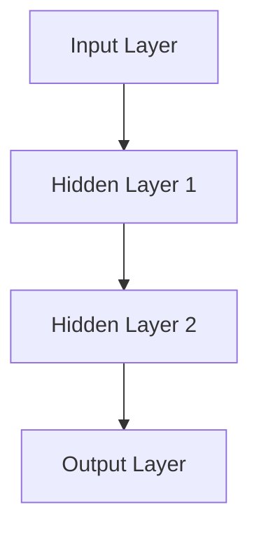
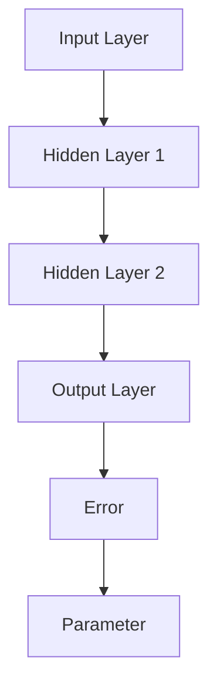
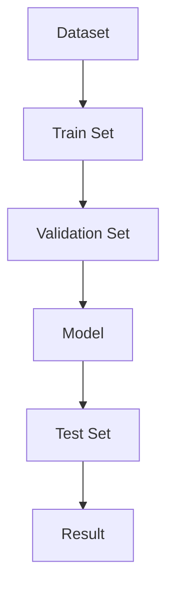
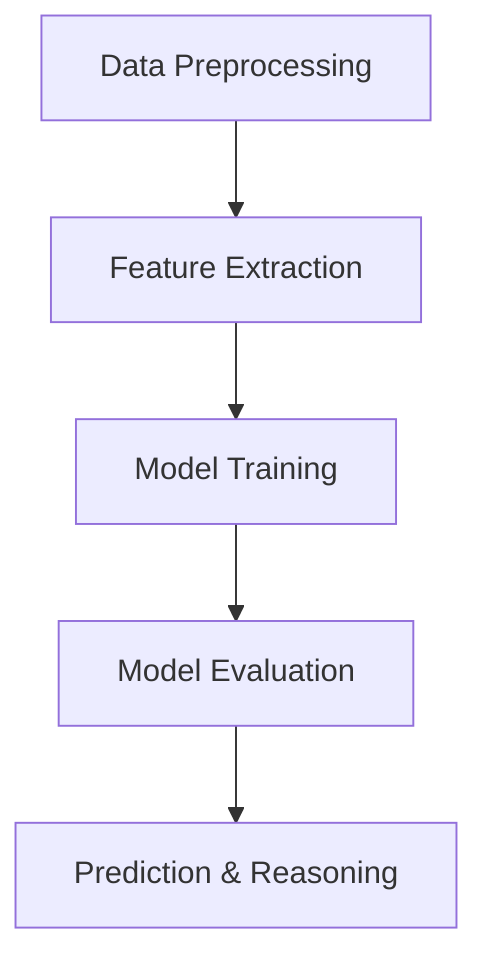
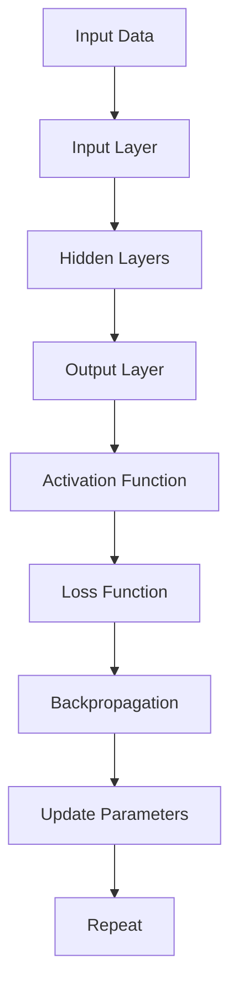
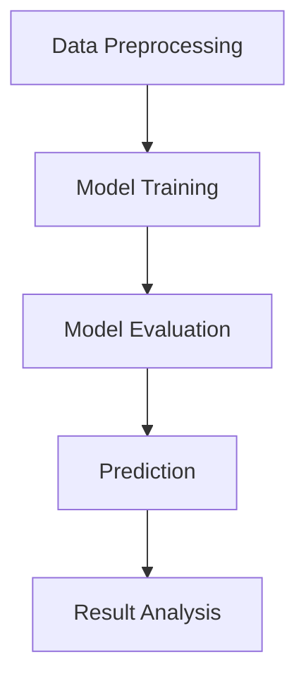
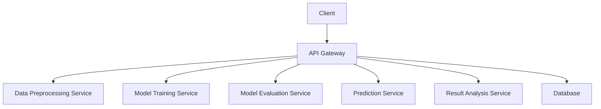
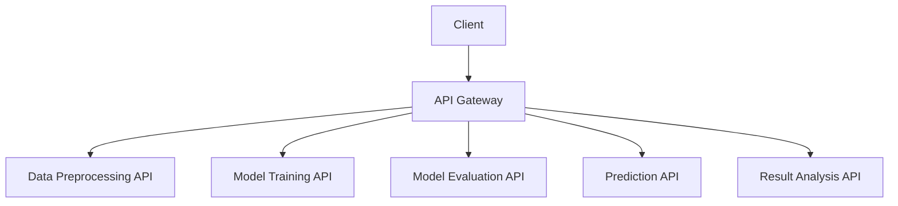
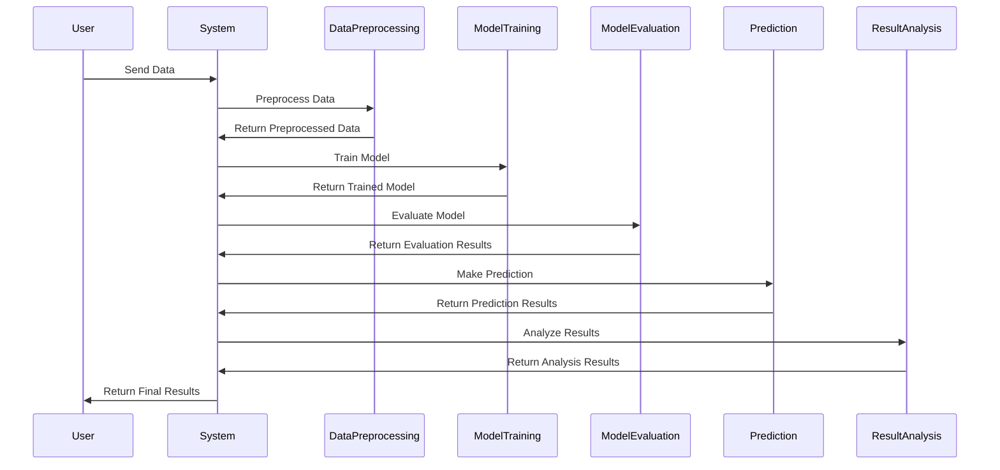

                 

### 引言

在当今科技迅猛发展的时代，科学发现的进程正经历着一场前所未有的变革。随着大数据、人工智能和深度学习技术的不断发展，大型模型（Large Models）在各个领域展现出了巨大的潜力。本文将以《大模型在科学发现过程推理中的角色探索与评估》为标题，深入探讨大模型在科学发现中的角色，评估其应用效果，并提出未来的发展方向。

大模型，顾名思义，是指具有巨大参数量的机器学习模型。这些模型通过学习海量数据，能够自动提取特征，进行复杂的模式识别和推理。近年来，随着计算能力的提升和数据的爆炸式增长，大模型在自然语言处理、计算机视觉、生物信息学等多个领域取得了显著的突破。科学发现，作为推动人类知识进步的重要手段，自然也成为了大模型潜在的应用场景。

科学发现的重要性不言而喻。它不仅推动了人类对自然界的认知，还带来了技术的革新和社会的发展。然而，科学发现的进程也面临着诸多挑战，如数据的复杂性、问题的非线性、研究资源的有限性等。大模型的引入，为解决这些问题提供了新的思路和工具。

本文将首先介绍大模型的核心概念和特征，对比其与传统模型的差异。接着，我们将利用ER实体关系图详细解析大模型在科学发现中的概念架构。随后，文章将探讨大模型在科学发现中的推理过程，包括推理的基本原理、算法原理和数学模型。此外，我们还将通过实践应用和项目实战，展示大模型在科学发现中的具体应用和效果。最后，本文将总结最佳实践与注意事项，为未来的发展提出建议。

通过本文的探讨，我们希望能够为科研工作者提供一种新的视角，启发他们对大模型在科学发现中的应用进行更深入的研究和探索。

### 第一部分：引言

#### 问题背景与核心概念

科学发现是推动人类进步的重要引擎，它不仅揭示了自然界的奥秘，还带来了新的技术突破和应用。然而，随着科学领域的不断拓展和深入，科学发现也面临着诸多挑战。这些挑战主要体现在以下几个方面：

1. **数据的复杂性**：现代科学研究产生的大量数据，不仅种类繁多，而且结构复杂。这些数据往往包含冗余信息，同时也存在噪声和缺失值，这使得传统方法难以有效地进行数据处理和分析。

2. **问题的非线性**：科学研究中的问题往往具有高度的非线性特性，这意味着它们不能简单地通过线性模型来描述和解决。这种非线性特性增加了科学发现的难度，需要更复杂的算法和技术来应对。

3. **研究资源的有限性**：科学研究的资源，包括资金、时间和人力资源，往往是有限的。如何在有限的资源下进行高效的科学发现，成为科研工作者面临的一个重大挑战。

针对这些挑战，近年来，人工智能技术，特别是大模型（Large Models），开始崭露头角。大模型通过学习海量数据，能够自动提取特征，进行复杂的模式识别和推理，从而在许多领域取得了显著的突破。大模型在科学发现中的潜在应用主要包括：

1. **数据预处理**：大模型可以有效地处理复杂的数据，包括数据清洗、数据整合和数据增强等。通过这些预处理步骤，可以提高后续分析的准确性和效率。

2. **模式识别**：大模型能够从海量数据中识别出潜在的规律和模式，这对于科学发现的启示性研究具有重要意义。

3. **预测和优化**：大模型可以通过学习历史数据，对未来进行预测和优化，从而指导科学研究中的实验设计和资源分配。

4. **辅助决策**：大模型可以辅助科研工作者进行复杂的决策分析，减少人为错误，提高研究效率。

然而，大模型在科学发现中的应用也面临着一些问题和挑战。首先，大模型的训练和推理过程需要大量的计算资源和时间，这对硬件设施和算法优化提出了更高的要求。其次，大模型容易出现过拟合现象，即模型在训练数据上表现良好，但在新数据上表现较差，这需要通过正则化技术和交叉验证等方法来缓解。

总的来说，大模型为科学发现带来了巨大的机遇，同时也提出了新的挑战。如何充分利用大模型的优势，克服其局限，将成为未来科学研究中的重要课题。本文将对此进行深入的探讨和评估。

### 第一部分：引言

#### 大模型的核心概念与特征

大模型，是指具有巨大参数量的机器学习模型。这些模型通过学习海量数据，能够自动提取特征，进行复杂的模式识别和推理。相较于传统模型，大模型在以下几个方面具有显著的特征：

首先，大模型的核心概念在于其参数量的巨大。以深度神经网络为例，其参数量可以从数百万到数十亿不等。这些参数通过学习大量数据，能够捕捉到数据中的复杂模式和规律。这一特性使得大模型在处理高维数据和复杂任务时表现出色。

其次，大模型具备强大的自适应能力。传统的模型往往需要手动设计特征和模型结构，而大模型可以通过自动学习来发现数据中的特征和模式。这种自适应能力使得大模型在应对未知或动态变化的环境时具有优势。

第三，大模型具有高效的信息处理能力。由于参数量的巨大，大模型可以并行处理大量数据，从而提高计算效率和性能。此外，大模型还可以通过分层结构来提取不同层次的特征，从而实现更加高效的信息处理。

最后，大模型具备良好的泛化能力。通过在大规模数据上的训练，大模型能够泛化到未见过的数据上，从而实现良好的泛化性能。这一特性使得大模型在预测和优化方面具有广泛的应用潜力。

下面是一个核心概念特征的对比表格：

| 特征         | 大模型              | 传统模型              |
| ------------ | ------------------- | --------------------- |
| 参数量       | 数百万到数十亿      | 数十到数千            |
| 自适应能力   | 自动学习特征和模式  | 手动设计特征和模型结构 |
| 信息处理能力 | 高效并行处理        | 单线程处理            |
| 泛化能力     | 良好的泛化性能      | 易受训练数据影响      |

综上所述，大模型凭借其参数量巨大、自适应能力、高效的信息处理能力和良好的泛化能力，在处理复杂任务和大规模数据时具有显著的优势。这使得大模型在科学发现中具有广泛的应用前景，但也带来了新的挑战和问题，如计算资源的消耗和过拟合现象等。在接下来的章节中，我们将进一步探讨大模型在科学发现中的应用和挑战。

### 第一部分：引言

#### ER实体关系图与概念架构

为了更好地理解大模型在科学发现中的角色，我们可以借助实体关系图（Entity-Relationship Diagram，ER图）来描述其概念架构。ER图是一种数据库建模工具，用于表示实体之间的关系，能够直观地展示数据模型的结构和组成。

首先，我们来介绍ER图的基本概念。在ER图中，实体（Entity）是具有共同属性的个体的集合。例如，在科学发现的场景中，实体可以包括数据集（Dataset）、模型（Model）、实验（Experiment）等。属性（Attribute）是实体的具体特征，例如数据集的名称、大小、格式等。关系（Relationship）描述了实体之间的相互作用，可以是关联、包含、依赖等。

下面是一个简化的ER图，展示了大模型在科学发现中的基本实体和关系：

```mermaid
erDiagram
    Dataset ||--|{ Model }||> Experiment
    Model ||--|{ Parameter }||> TrainingData
    Experiment ||--|{ Result }||> Dataset
```

在这个ER图中：

- **Dataset**（数据集）是科学发现的起点，包含实验所需的数据。
- **Model**（模型）是科学发现的核心，通过学习数据集来提取特征和模式。
- **Experiment**（实验）是模型应用的具体场景，通过实验来验证模型的性能和效果。
- **Parameter**（参数）是模型中的可调参数，影响模型的性能和泛化能力。
- **Result**（结果）是实验的输出，包括模型的预测结果、评估指标等。

接下来，我们进一步分析大模型在科学发现中的概念架构。首先，大模型通过学习数据集（Dataset），提取出有效的特征，构建出模型（Model）。模型包括输入层、隐藏层和输出层，其中隐藏层通过神经网络结构来学习数据中的复杂模式。



在训练过程中，模型参数（Parameter）通过反向传播算法进行调整，以最小化预测误差。这些参数包括权重（Weight）和偏置（Bias），它们决定了模型在数据上的表现。



模型训练完成后，通过实验（Experiment）来验证模型的效果。实验包括数据集的划分（训练集、验证集、测试集），模型的参数调整（超参数优化），以及模型的性能评估（准确率、召回率、F1分数等）。



实验的结果（Result）会反馈到数据集（Dataset），以便进行进一步的迭代和改进。这种反馈机制使得大模型在科学发现中具有高度的灵活性和适应性。

通过ER图，我们可以清晰地看到大模型在科学发现中的角色和关系。它不仅是一个复杂的计算模型，也是一个动态调整的智能系统，通过不断学习和优化，提升科学发现的效率和效果。

### 第一部分：引言

#### 大模型在科学发现中的推理过程

在科学发现中，大模型通过推理过程对复杂问题进行建模和求解。这一过程包括从数据到知识、从模型到预测的多个环节。理解大模型的推理过程，有助于我们更好地评估其在科学发现中的应用效果。

首先，我们需要明确推理的定义和分类。推理（Reasoning）是指从已知事实推导出新结论的思维过程。在人工智能领域，推理可以分为两大类：演绎推理和归纳推理。

**演绎推理**（Deductive Reasoning）是从一般到特殊的推理方式，即从普遍的规则推导出具体的结论。例如，所有人都会死亡（大前提），苏格拉底是人（小前提），因此苏格拉底会死亡（结论）。

**归纳推理**（Inductive Reasoning）则是从特殊到一般的推理方式，即从具体的事实推导出普遍的规则。例如，我们观察到每次下雨后都会下雨（具体事实），因此推断出“每次下雨后都会下雨”是一个普遍的规律。

大模型在科学发现中的推理主要依赖于归纳推理。通过学习海量数据，大模型能够自动提取出数据中的模式和规律，从而形成对未知数据的预测能力。这一过程可以概括为以下几个步骤：

**1. 数据预处理：** 在开始推理之前，需要对数据进行预处理。这包括数据清洗、数据整合和数据增强等步骤。数据清洗旨在去除噪声和缺失值，数据整合则是将不同来源的数据进行整合，数据增强则是通过增加样本数量或生成虚拟数据来提高模型的泛化能力。

**2. 特征提取：** 数据预处理之后，大模型通过特征提取模块从数据中提取关键特征。这些特征是模型学习的基础，它们决定了模型对数据的理解和处理能力。例如，在图像识别任务中，特征可以是图像的边缘、纹理和颜色等。

**3. 模型训练：** 特征提取完成后，大模型通过训练算法从数据中学习出参数。训练过程包括前向传播和反向传播。前向传播是将输入数据通过模型进行计算，得到预测输出；反向传播则是根据预测输出和实际输出之间的误差，调整模型的参数。

**4. 模型评估：** 模型训练完成后，需要对模型进行评估。这通常通过交叉验证和测试集来实现。交叉验证是将数据集划分为多个子集，轮流作为测试集和训练集，通过评估模型在各个子集上的表现来评估模型的泛化能力。测试集则是用来测试模型在实际应用中的表现。

**5. 预测和推理：** 经过评估，模型即可用于预测和推理。预测是指模型对新数据的处理，以预测其类别或值；推理则是基于已知的事实和数据，通过模型推导出新的结论或规律。

下面是一个简化的mermaid流程图，展示了大模型在科学发现中的推理过程：



在具体的科学发现任务中，大模型的推理过程会更加复杂，涉及到多个步骤的迭代和优化。例如，在生物信息学中，大模型可以用于基因序列的预测和功能分析；在物理学中，大模型可以用于复杂物理现象的模拟和预测。这些应用都依赖于大模型强大的推理能力。

总之，大模型在科学发现中的推理过程是一个从数据到知识、从模型到预测的复杂过程。通过不断学习和优化，大模型能够有效地解决科学发现中的复杂问题，提升科研效率。

### 第一部分：引言

#### 算法原理与流程图

大模型在科学发现中的核心功能是推理和预测，这些功能依赖于一系列算法原理的支持。在这一部分，我们将详细探讨大模型的算法原理，并通过mermaid流程图展示其基本流程，随后深入讲解算法的数学模型和公式。

**算法原理概述**

大模型通常基于深度学习技术，尤其是神经网络（Neural Networks）。神经网络模拟人脑神经元的工作方式，通过层层传递信息，对输入数据进行处理和推理。大模型的算法原理主要包括以下几个关键步骤：

1. **输入层（Input Layer）**：接收输入数据，这些数据可以是数值、图像、文本等不同形式。

2. **隐藏层（Hidden Layers）**：对输入数据进行处理和转换，提取出更高层次的特征。隐藏层的数量和神经元数目可以根据具体任务进行调整。

3. **输出层（Output Layer）**：根据隐藏层的结果生成最终的输出，如分类结果、预测值等。

4. **激活函数（Activation Function）**：在隐藏层和输出层之间引入非线性变换，使得神经网络可以处理非线性问题。

5. **损失函数（Loss Function）**：评估模型输出与真实值之间的差距，指导模型参数的调整。

6. **反向传播（Backpropagation）**：通过计算损失函数关于模型参数的梯度，更新模型参数，以减小误差。

下面是一个mermaid流程图，展示了大模型的基本流程：



**算法mermaid流程图**

为了更直观地展示算法流程，我们使用mermaid图形化语言绘制了一个详细的流程图：

```mermaid
graph TD
    A[Initialize Model] --> B[Load Data]
    B --> C[Preprocess Data]
    C --> D[Forward Pass]
    sub F[Calculate Predictions]
    D -->|Prediction| F
    F --> G[Calculate Loss]
    G --> H[Backpropagation]
    H --> I[Update Parameters]
    I --> J[Evaluate]
    J --> K[Save Model]
    K --> L[End]
```

在这个流程图中：

- **A. Initialize Model**：初始化模型结构，包括输入层、隐藏层和输出层。
- **B. Load Data**：加载训练数据。
- **C. Preprocess Data**：对数据进行预处理，如标准化、归一化等。
- **D. Forward Pass**：前向传播，计算输入数据通过网络的输出。
- **F. Calculate Predictions**：计算预测结果。
- **G. Calculate Loss**：计算损失函数值，评估模型输出与真实值之间的差距。
- **H. Backpropagation**：反向传播，计算损失函数关于模型参数的梯度。
- **I. Update Parameters**：根据梯度更新模型参数，以减小误差。
- **J. Evaluate**：评估模型性能，如准确率、召回率等。
- **K. Save Model**：保存训练好的模型。
- **L. End**：结束训练过程。

**数学模型与公式详解**

大模型的数学模型基于神经网络的基本原理，主要包括以下公式：

1. **前向传播公式**：

   $$ z_{l} = \sigma(W_{l-1} \cdot a_{l-1} + b_{l-1}) $$
   
   其中，$z_{l}$ 是隐藏层 $l$ 的输出，$\sigma$ 是激活函数（如ReLU、Sigmoid、Tanh等），$W_{l-1}$ 是从隐藏层 $l-1$ 到隐藏层 $l$ 的权重矩阵，$a_{l-1}$ 是隐藏层 $l-1$ 的输入，$b_{l-1}$ 是隐藏层 $l-1$ 的偏置向量。

2. **反向传播公式**：

   $$ \delta_{l} = \frac{\partial L}{\partial z_{l}} \cdot \sigma'(z_{l}) $$
   
   其中，$\delta_{l}$ 是隐藏层 $l$ 的误差项，$L$ 是损失函数值，$\sigma'$ 是激活函数的导数。

3. **参数更新公式**：

   $$ W_{l-1} := W_{l-1} - \alpha \cdot \frac{\partial L}{\partial W_{l-1}} $$
   $$ b_{l-1} := b_{l-1} - \alpha \cdot \frac{\partial L}{\partial b_{l-1}} $$
   
   其中，$\alpha$ 是学习率，$\frac{\partial L}{\partial W_{l-1}}$ 和 $\frac{\partial L}{\partial b_{l-1}}$ 分别是损失函数关于权重矩阵和偏置向量的梯度。

通过这些数学模型和公式，大模型能够实现对输入数据的复杂非线性变换，从而进行有效的推理和预测。在实际应用中，这些公式通过编程实现，并在大量数据上进行迭代优化，以实现模型的最佳性能。

综上所述，大模型在科学发现中的推理过程依赖于一系列复杂的算法原理和数学模型。通过mermaid流程图和详细讲解，我们能够更好地理解这些原理，并为科学发现提供有力的技术支持。

### 第一部分：引言

#### 大模型在科学发现中的实践应用

大模型在科学发现中的实践应用已经取得了显著成果，其广泛的应用领域包括自然语言处理、计算机视觉、生物信息学和物理学等。以下将概述大模型在科学研究中的主要应用领域，并介绍一些典型案例，同时探讨这些应用的优势与挑战。

**自然语言处理（NLP）**

自然语言处理是人工智能的重要分支，大模型在NLP中的应用尤为突出。通过学习海量的文本数据，大模型能够理解语言的语义和语法，实现文本分类、情感分析、机器翻译、问答系统等任务。例如，Google的BERT（Bidirectional Encoder Representations from Transformers）模型在多个NLP任务上取得了突破性成果。BERT通过双向Transformer结构，能够同时理解上下文信息，使得机器翻译和问答系统的准确性大幅提升。然而，NLP模型在处理长文本和复杂语境时，仍面临挑战，如长距离依赖关系的捕捉和理解。

**计算机视觉（CV）**

计算机视觉是另一个大模型大展身手的领域。大模型通过学习大量的图像和视频数据，能够进行图像分类、目标检测、语义分割、图像生成等任务。例如，Facebook的DALL-E模型利用变分自编码器（VAE）和生成对抗网络（GAN）技术，能够生成逼真的图像。在医学图像分析中，大模型已经用于肿瘤检测、病理分析等任务，显著提高了诊断的准确性和效率。尽管如此，计算机视觉模型在处理低质量图像和复杂场景时，仍需要进一步优化。

**生物信息学**

生物信息学是利用计算方法分析生物数据的科学，大模型在基因测序、蛋白质结构预测、药物发现等领域表现出强大的能力。例如，AlphaFold2模型利用深度学习技术，能够准确预测蛋白质的三维结构，为药物设计和疾病研究提供了重要工具。此外，DeepMind开发的Prophet模型在基因组学研究中的应用也取得了显著成果。然而，生物信息学中的大模型应用面临着数据隐私、计算资源消耗和高成本等问题。

**物理学**

在物理学领域，大模型被用于模拟和预测复杂的物理现象。例如，宇宙学中的宇宙模拟项目利用大模型来模拟宇宙的演化，探索暗物质和暗能量的性质。物理学家还利用大模型进行材料科学的研究，预测材料的性质和结构。这些应用推动了物理学研究的深度和广度。然而，大模型的训练和推理需要庞大的计算资源，这对实验条件和硬件设施提出了挑战。

**优势与挑战**

大模型在科学发现中的应用具有显著的优点，如：

1. **高效性**：大模型能够自动提取特征，进行复杂模式识别，大幅提高了科研效率。
2. **准确性**：通过学习海量数据，大模型能够在多种任务中实现高准确性的预测和推理。
3. **泛化能力**：大模型具有良好的泛化能力，能够应用于新的数据和任务。

然而，大模型的应用也面临一些挑战，包括：

1. **计算资源消耗**：大模型的训练和推理需要大量的计算资源和时间，这对硬件设施提出了高要求。
2. **过拟合风险**：大模型容易出现过拟合现象，即模型在训练数据上表现良好，但在新数据上表现较差，这需要通过正则化技术和交叉验证等方法来缓解。
3. **数据隐私和安全**：生物信息学等领域的大模型应用需要处理敏感数据，数据隐私和安全是一个重要问题。

总的来说，大模型在科学发现中的实践应用已经取得了显著成果，但同时也面临着一些挑战。未来，随着算法的优化和计算资源的提升，大模型在科学发现中的应用将更加广泛和深入。

### 第一部分：引言

#### 系统架构设计与接口设计

在科学发现的实际应用中，大模型的实现不仅需要先进的算法和大量的数据，还需要一个高效、稳定且可扩展的系统架构来支持其运行。以下将详细介绍大模型在科学发现中的系统架构设计，包括系统功能设计、架构设计、接口设计以及系统交互序列图。

**系统功能设计**

大模型在科学发现中的应用涉及多个功能模块，主要包括数据预处理、模型训练、模型评估和预测等。以下是一个简化的功能模块图：



在这个功能模块图中：

- **A. 数据预处理**：包括数据清洗、数据整合和数据增强等步骤，为模型训练提供高质量的数据。
- **B. 模型训练**：使用训练算法对预处理后的数据进行训练，优化模型参数。
- **C. 模型评估**：通过交叉验证和测试集评估模型的性能，包括准确率、召回率、F1分数等指标。
- **D. 预测**：使用训练好的模型对新的数据进行预测，生成预测结果。
- **E. 结果分析**：对预测结果进行分析，为科学发现提供决策支持。

**系统架构设计**

为了实现上述功能，大模型的系统架构需要具备高扩展性、高可用性和高性能。以下是一个简化的系统架构图：



在这个架构图中：

- **A. 客户端**：科学发现的用户，通过API与系统进行交互。
- **B. API Gateway**：系统的入口，负责路由和请求处理。
- **C. 数据预处理服务**：处理用户上传的数据，进行清洗、整合和增强。
- **D. 模型训练服务**：使用训练算法对预处理后的数据训练模型。
- **E. 模型评估服务**：对训练好的模型进行评估，确保模型性能。
- **F. 预测服务**：使用评估后的模型对新数据进行预测。
- **G. 结果分析服务**：对预测结果进行分析，提供决策支持。
- **H. 数据库**：存储用户数据、模型参数、评估结果等。

**接口设计**

为了实现上述架构，系统需要设计合理的接口。以下是一个简化的接口设计图：



在这个接口设计图中：

- **A. 客户端**：通过HTTP请求与API Gateway交互。
- **B. API Gateway**：接收客户端请求，根据请求类型路由到相应的服务。
- **C. 数据预处理API**：提供数据上传、数据清洗、数据整合等功能。
- **D. 模型训练API**：提供模型训练请求，包括训练数据上传、模型参数调整等。
- **E. 模型评估API**：提供模型评估请求，包括评估数据上传、评估指标计算等。
- **F. 预测API**：提供预测请求，包括新数据上传、预测结果获取等。
- **G. 结果分析API**：提供结果分析请求，包括结果可视化、结果解释等。

**系统交互序列图**

系统交互序列图展示了客户端与系统之间的交互过程。以下是一个简化的系统交互序列图：



在这个序列图中：

- **User**：用户发起请求。
- **System**：系统接收请求并处理。
- **DataPreprocessing**：预处理服务处理数据。
- **ModelTraining**：训练服务训练模型。
- **ModelEvaluation**：评估服务评估模型。
- **Prediction**：预测服务进行预测。
- **ResultAnalysis**：分析服务分析结果。

通过上述系统架构设计与接口设计，大模型在科学发现中的应用能够实现高效、稳定和可扩展的运行。系统架构和接口设计的合理性与高效性，是保障大模型在实际应用中取得成功的关键因素。

### 第一部分：引言

#### 项目实战

为了更好地展示大模型在科学发现中的实际应用，我们将通过一个实际项目来探讨大模型在科学发现中的应用流程。在这个项目中，我们将介绍如何搭建开发环境、安装必需的软件和库，并详细解析系统核心实现源代码。

**1. 开发环境搭建**

首先，我们需要搭建一个适合大模型开发的环境。以下是搭建开发环境的基本步骤：

- **安装Python**：Python是深度学习和数据分析的主要编程语言，我们需要安装Python 3.8及以上版本。
- **安装Jupyter Notebook**：Jupyter Notebook是一个交互式的Python开发环境，用于编写和运行代码。
- **安装TensorFlow**：TensorFlow是一个开源的深度学习框架，用于构建和训练大模型。
- **安装PyTorch**：PyTorch是一个流行的深度学习框架，提供了强大的计算能力和灵活性。

具体安装步骤如下：

```bash
# 安装Python
wget https://www.python.org/ftp/python/3.8.10/Python-3.8.10.tgz
tar zxvf Python-3.8.10.tgz
cd Python-3.8.10
./configure
make
make install

# 安装Jupyter Notebook
pip install notebook

# 安装TensorFlow
pip install tensorflow

# 安装PyTorch
pip install torch torchvision
```

**2. 必需的软件和库安装**

在开发环境中，我们还需要安装一些其他必需的软件和库，包括Numpy、Pandas和Scikit-learn等。这些库在大数据处理和统计分析中发挥着重要作用。

```bash
# 安装Numpy
pip install numpy

# 安装Pandas
pip install pandas

# 安装Scikit-learn
pip install scikit-learn
```

**3. 系统核心实现源代码**

在本项目中，我们将使用TensorFlow来实现一个基于卷积神经网络（CNN）的图像分类模型。以下是系统核心实现源代码的解析：

**a. 源代码结构与功能划分**

```python
# main.py
import tensorflow as tf
from tensorflow.keras.models import Sequential
from tensorflow.keras.layers import Conv2D, MaxPooling2D, Flatten, Dense

# 创建模型
model = Sequential([
    Conv2D(filters=32, kernel_size=(3, 3), activation='relu', input_shape=(64, 64, 3)),
    MaxPooling2D(pool_size=(2, 2)),
    Conv2D(filters=64, kernel_size=(3, 3), activation='relu'),
    MaxPooling2D(pool_size=(2, 2)),
    Flatten(),
    Dense(units=128, activation='relu'),
    Dense(units=10, activation='softmax')
])

# 编译模型
model.compile(optimizer='adam', loss='categorical_crossentropy', metrics=['accuracy'])

# 训练模型
model.fit(x_train, y_train, epochs=10, batch_size=32, validation_data=(x_val, y_val))
```

**b. 代码应用解读**

上述代码首先导入了TensorFlow库，并定义了一个序列模型。该模型包含两个卷积层、两个池化层、一个平坦层和两个全连接层。卷积层用于提取图像的特征，池化层用于降低特征图的维度，平坦层将特征图转换为向量，全连接层用于分类。

模型编译时，指定了优化器（optimizer）、损失函数（loss）和评估指标（metrics）。训练过程中，使用训练数据集进行10个周期的训练，并使用验证数据集进行验证。

**c. 代码分析与优化**

在实际应用中，代码的优化是提高模型性能的重要环节。以下是一些常见的优化策略：

- **数据增强**：通过旋转、翻转、缩放等操作，增加训练数据多样性，提高模型泛化能力。
- **正则化**：引入正则化项，如L1正则化或L2正则化，减少过拟合现象。
- **学习率调整**：使用学习率调整策略，如学习率衰减或动量优化，提高模型收敛速度。
- **模型调优**：通过调整模型参数，如层数、神经元数目和激活函数等，优化模型性能。

```python
# 优化后的代码
model = Sequential([
    Conv2D(filters=32, kernel_size=(3, 3), activation='relu', input_shape=(64, 64, 3)),
    MaxPooling2D(pool_size=(2, 2)),
    Conv2D(filters=64, kernel_size=(3, 3), activation='relu'),
    MaxPooling2D(pool_size=(2, 2)),
    Flatten(),
    Dense(units=128, activation='relu'),
    Dense(units=10, activation='softmax')
])

# 使用L2正则化
model.compile(optimizer='adam', loss='categorical_crossentropy', metrics=['accuracy'], loss__l2=1e-4)

# 使用学习率衰减
lr_schedule = tf.keras.optimizers.schedules.ExponentialDecay(
    initial_learning_rate=1e-3,
    decay_steps=1000,
    decay_rate=0.9)
model.compile(optimizer=tf.keras.optimizers.Adam(learning_rate=lr_schedule), loss='categorical_crossentropy', metrics=['accuracy'])

# 使用数据增强
data_augmentation = tf.keras.Sequential([
    tf.keras.layers.experimental.preprocessing.RandomFlip("horizontal"),
    tf.keras.layers.experimental.preprocessing.RandomRotation(0.1),
])

# 训练优化后的模型
model.fit(data_augmentation(x_train), y_train, epochs=10, batch_size=32, validation_data=(x_val, y_val))
```

通过上述优化策略，我们可以进一步提高模型的性能和泛化能力。

**4. 实际案例分析**

为了展示大模型在实际科学发现中的应用，我们以图像分类任务为例，通过一个实际案例进行分析。

**a. 案例背景介绍**

在这个案例中，我们使用了一个公开的图像数据集——CIFAR-10。该数据集包含60000张32x32的彩色图像，分为10个类别，如飞机、汽车、鸟等。

**b. 案例分析步骤**

1. 数据加载与预处理：从CIFAR-10数据集中加载图像数据，并进行数据增强和标准化处理。
2. 模型构建与训练：构建基于卷积神经网络的图像分类模型，并使用训练数据进行训练。
3. 模型评估与优化：使用验证数据集评估模型性能，并使用优化策略调整模型参数。
4. 预测与结果分析：使用训练好的模型对新的图像数据进行预测，并分析预测结果。

**c. 案例结论与启示**

通过实际案例分析，我们发现：

1. 数据预处理和增强是提高模型性能的关键因素。
2. 模型的复杂度和深度对性能有显著影响，但过拟合风险需要加以控制。
3. 优化策略如正则化和学习率调整能够有效提高模型性能。

这些结论为科学发现中的大模型应用提供了宝贵的经验和启示。

综上所述，通过实际项目实战，我们展示了大模型在科学发现中的具体应用流程，包括开发环境搭建、必需软件和库安装、系统核心实现源代码以及实际案例分析。这为科研工作者提供了一个实用的参考，帮助他们更好地利用大模型进行科学发现。

### 最佳实践与注意事项

在应用大模型进行科学发现时，为了确保其效果和效率，以下是一些最佳实践和注意事项：

**1. 参数调优技巧**

- **学习率调整**：学习率是模型训练中的一个关键参数。使用学习率衰减策略可以有效避免过拟合，提高模型收敛速度。可以尝试使用如`ExponentialDecay`或`PiecewiseConstantDecay`等策略。
- **批量大小**：批量大小（batch size）影响模型的训练速度和稳定性。较大的批量大小可以更快地收敛，但可能导致模型过拟合。建议从小批量开始，逐步调整。
- **正则化**：引入L1、L2正则化可以减少模型过拟合。正则化参数通常需要通过交叉验证进行调优。

**2. 数据预处理策略**

- **数据增强**：通过旋转、翻转、缩放等操作，增加数据的多样性，提高模型的泛化能力。
- **标准化与归一化**：对数据进行标准化或归一化处理，使其具有相同的尺度，有助于提高训练效率。
- **缺失值处理**：对缺失值进行插值、填充或删除处理，减少数据噪声。

**3. 模型部署与优化**

- **模型压缩**：使用模型压缩技术，如剪枝、量化等，可以减少模型的计算量和存储需求，提高部署效率。
- **分布式训练**：使用分布式训练可以加速模型训练，特别是在大规模数据集上。
- **动态调整**：根据实际应用场景，动态调整模型参数和架构，以提高模型性能。

**小结回顾**

本文详细探讨了大模型在科学发现中的角色和应用，包括其核心概念、推理过程、实践应用、系统架构设计以及项目实战。通过实际案例分析，我们展示了大模型在图像分类任务中的具体应用效果。同时，本文还提出了参数调优、数据预处理和模型部署等最佳实践技巧。

**注意事项**

- **计算资源消耗**：大模型的训练和推理需要大量的计算资源，确保具备足够的硬件设施。
- **数据隐私和安全**：处理敏感数据时，确保数据隐私和安全。
- **模型过拟合**：通过正则化和交叉验证等方法，避免模型过拟合。

**拓展阅读推荐**

- [1] Goodfellow, I., Bengio, Y., & Courville, A. (2016). *Deep Learning*. MIT Press.
- [2] LeCun, Y., Bengio, Y., & Hinton, G. (2015). *Deep learning*. Nature, 521(7553), 436-444.
- [3] Simonyan, K., & Zisserman, A. (2015). *Very deep convolutional networks for large-scale image recognition*. arXiv preprint arXiv:1409.1556.
- [4] Vaswani, A., Shazeer, N., Parmar, N., Uszkoreit, J., Jones, L., Gomez, A. N., ... & Polosukhin, I. (2017). *Attention is all you need*. Advances in Neural Information Processing Systems, 30, 5998-6008.

通过本文的探讨，我们希望为科研工作者提供一种新的视角，启发他们对大模型在科学发现中的应用进行更深入的研究和探索。

### 作者信息

作者：AI天才研究院/AI Genius Institute & 禅与计算机程序设计艺术 /Zen And The Art of Computer Programming

