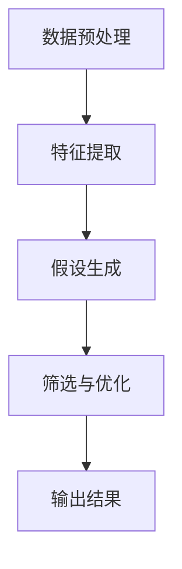

                 

### 第一部分：大模型在科学理论构建推理中的假设生成作用

#### 第1章：问题背景与核心概念

##### 1.1 问题背景

科学理论构建是人类认识世界的重要途径。传统的科学理论构建通常依赖于科学家们的直觉、经验以及严谨的逻辑推理。然而，随着科技的迅猛发展，数据量的爆炸式增长，以及复杂性科学问题的层出不穷，传统的方法已经难以满足现代科学理论构建的需求。

在这一背景下，大模型（如深度学习模型）的出现为科学理论构建带来了新的契机。大模型具有处理大规模数据、提取复杂模式的能力，它们在自然语言处理、图像识别、语音识别等领域取得了显著的成果。那么，大模型如何介入科学理论构建？它们在假设生成过程中扮演着怎样的角色？

##### 1.1.1 科学理论构建的现状

科学理论的构建是一个复杂的过程，通常包括以下步骤：

1. **提出问题**：科学家们通过观察现象，提出有待解释的科学问题。
2. **数据收集**：根据问题进行实验或数据收集，以获取支持或反驳假设的证据。
3. **假设生成**：在数据的基础上，科学家们提出可能的解释或假设。
4. **模型构建**：基于假设，构建理论模型，进行数学描述。
5. **验证与修正**：通过实验或数据分析，验证模型的准确性，并根据结果对模型进行修正。

目前，这一过程主要依赖于人类专家的直觉、经验和专业知识。尽管这种方法在过去取得了许多重要的科学成果，但随着问题的复杂性和数据量的增加，其局限性也越来越明显。

##### 1.1.2 大模型在科学理论中的作用

大模型在科学理论构建中的作用主要体现在以下几个方面：

1. **数据预处理**：大模型能够高效地处理和清洗大规模数据，为科学理论构建提供高质量的数据输入。
2. **模式提取**：大模型具有较强的模式提取能力，可以从大量数据中发现潜在的规律和模式，为假设生成提供支持。
3. **假设生成**：大模型可以通过学习数据中的特征，自动生成可能的假设，加速科学理论的构建过程。

##### 1.1.3 假设生成的关键性

在科学理论构建中，假设生成是至关重要的一步。一个良好的假设能够引导科学家们进行有针对性的实验或数据分析，从而提高理论构建的效率。然而，传统的假设生成方法往往依赖于专家的经验和直觉，存在主观性强、效率低等问题。

大模型的出现为假设生成提供了新的途径。通过学习大量的数据，大模型可以自动生成可能的假设，并从中筛选出最有价值的假设。这种方法不仅提高了假设生成的效率，还降低了主观性的影响，为科学理论的构建提供了新的思路。

##### 1.2 核心概念介绍

为了更好地理解大模型在科学理论构建中的作用，我们需要先介绍几个核心概念：

1. **大模型**：大模型是指参数数量巨大、结构复杂的机器学习模型。它们通过学习大量数据，能够自动提取特征，进行复杂的推理和决策。
2. **科学理论构建**：科学理论构建是指从科学问题出发，通过假设生成、模型构建、验证与修正等一系列过程，最终形成科学理论的过程。
3. **假设生成**：假设生成是指从数据中提取可能的解释或假设，为科学理论构建提供基础。

##### 1.2.1 大模型的定义与特点

大模型，通常指的是深度学习模型，尤其是那些具有大量参数的网络结构。例如，Transformer模型、GPT模型等。这些模型具有以下特点：

1. **大规模参数**：大模型的参数数量通常达到百万甚至亿级，这使它们能够处理和提取复杂的数据特征。
2. **自适应性**：大模型可以通过学习数据自动调整参数，从而适应不同的任务和数据集。
3. **强大的泛化能力**：大模型具有较强的泛化能力，能够在未见过的数据上取得良好的性能。

##### 1.2.2 科学理论构建的概念

科学理论构建是指从科学问题出发，通过一系列科学方法和步骤，构建出能够解释和预测现象的科学理论的过程。这个过程通常包括以下几个步骤：

1. **提出问题**：基于观察和已有知识，提出需要解释的科学问题。
2. **数据收集**：根据问题设计实验或收集相关数据。
3. **假设生成**：在数据的基础上，提出可能的解释或假设。
4. **模型构建**：基于假设，构建理论模型，进行数学描述。
5. **验证与修正**：通过实验或数据分析，验证模型的准确性，并根据结果对模型进行修正。

##### 1.2.3 假设生成的流程与方法

假设生成是科学理论构建的关键步骤。传统的假设生成方法通常依赖于专家的经验和直觉，而大模型则为假设生成提供了新的途径。大模型假设生成的流程通常包括以下几个步骤：

1. **数据预处理**：对数据进行清洗、标准化等预处理操作，以消除噪声和异常值。
2. **特征提取**：使用大模型自动提取数据中的特征，这些特征有助于生成有意义的假设。
3. **假设生成**：基于提取的特征，大模型自动生成可能的假设。
4. **筛选与优化**：对生成的假设进行筛选和优化，选择最有价值的假设。

##### 1.3 概念联系与作用机制

大模型、科学理论构建和假设生成之间存在着紧密的联系。大模型通过学习大量数据，提取复杂的特征，为科学理论构建提供了新的工具和途径。具体来说，大模型在假设生成中的作用机制可以概括为以下几点：

1. **数据驱动**：大模型通过学习大量的数据，自动提取潜在的规律和模式，从而生成有意义的假设。
2. **自动化**：大模型可以自动化地生成假设，减少了人类专家的主观性，提高了假设生成的效率。
3. **多尺度分析**：大模型能够在不同的数据尺度上进行分析，从而生成不同层次的假设，有助于构建更全面和精确的科学理论。

##### 1.3.1 大模型与科学理论的联系

大模型与科学理论构建有着紧密的联系。大模型可以通过学习大量数据，提取复杂的特征，为科学理论的构建提供支持。具体来说，大模型与科学理论的联系体现在以下几个方面：

1. **数据驱动**：科学理论构建需要大量的数据支持，大模型能够高效地处理和提取数据特征，为科学理论提供数据基础。
2. **特征提取**：大模型可以自动提取数据中的潜在规律和模式，这些特征有助于构建科学理论模型。
3. **假设生成**：大模型可以自动生成可能的假设，为科学理论构建提供初步的方向。

##### 1.3.2 假设生成在大模型中的作用机制

假设生成在大模型中的作用机制主要体现在以下几个方面：

1. **数据学习**：大模型通过学习大量的数据，提取复杂的特征，从而生成有意义的假设。
2. **自动化**：大模型可以自动化地生成假设，减少了人类专家的主观性，提高了假设生成的效率。
3. **多尺度分析**：大模型能够在不同的数据尺度上进行分析，从而生成不同层次的假设，有助于构建更全面和精确的科学理论。

##### 1.3.3 大模型假设生成的优势与挑战

大模型在假设生成中具有显著的优势，但也面临一些挑战。以下是这些优势与挑战的详细分析：

1. **优势**：
   - **高效性**：大模型可以自动化地生成假设，显著提高了假设生成的效率。
   - **准确性**：大模型能够从大量数据中提取复杂的特征，从而生成更准确的假设。
   - **多尺度分析**：大模型可以在不同的数据尺度上进行分析，生成不同层次的假设，有助于构建更全面的理论。

2. **挑战**：
   - **数据依赖**：大模型对数据质量有很高的要求，如果数据存在噪声或异常值，可能会导致假设生成的不准确。
   - **计算资源**：大模型的训练和推理需要大量的计算资源，这对于资源有限的科研环境可能是一个挑战。
   - **解释性**：大模型的假设生成过程通常是非透明的，这可能导致生成的假设难以解释，增加了科学理论构建的复杂性。

## 第2章：大模型在科学理论构建中的应用

#### 2.1 主流大模型简介

在科学理论构建中，大模型的应用已经得到了广泛的关注。其中，Transformer模型、GPT模型以及其他一些大模型成为了研究的热点。以下将对这些主流大模型进行简要介绍。

##### 2.1.1 Transformer模型

Transformer模型是由Google在2017年提出的一种基于自注意力机制的深度学习模型。它在自然语言处理领域取得了显著的成果，广泛应用于机器翻译、文本生成、问答系统等领域。

Transformer模型的主要特点是引入了自注意力机制，通过计算序列中每个词与其他词之间的相关性，实现了对上下文信息的全局建模。这使得Transformer模型在处理长序列数据和长距离依赖问题时具有独特的优势。

##### 2.1.2 GPT模型

GPT（Generative Pre-trained Transformer）模型是由OpenAI提出的一种基于Transformer的自回归语言模型。GPT模型通过预训练大量文本数据，学习语言的统计规律和语义信息，从而实现文本生成、问答、翻译等任务。

GPT模型的特点是自回归，即模型需要根据前文预测后文。这种结构使得GPT模型在生成连贯、自然的文本方面表现出色。此外，GPT模型也通过不断迭代，不断提升模型的能力和性能。

##### 2.1.3 其他大模型介绍

除了Transformer模型和GPT模型，还有一些其他的大模型在科学理论构建中具有应用价值。例如：

1. **BERT（Bidirectional Encoder Representations from Transformers）**：BERT模型是由Google在2018年提出的一种双向Transformer编码模型。BERT模型通过预训练大量文本数据，学习上下文信息的双向表示，广泛应用于文本分类、情感分析、命名实体识别等任务。
2. **ViT（Vision Transformer）**：ViT模型是由Google在2020年提出的一种基于Transformer的计算机视觉模型。ViT模型将图像分割成多个小patches，并将每个patch视为一个序列，通过Transformer进行建模。这种方法在图像分类、目标检测等任务上取得了优异的性能。
3. **T5（Text-To-Text Transfer Transformer）**：T5模型是由Google在2020年提出的一种基于Transformer的文本到文本的转换模型。T5模型通过将文本转换任务转化为一个统一的文本到文本的序列转换问题，实现了在各种NLP任务上的高性能。

这些大模型在科学理论构建中都有着广泛的应用前景，不同的模型适用于不同的任务和数据类型。

#### 2.2 大模型在科学理论构建中的应用实例

大模型在科学理论构建中的应用已经取得了一系列显著的成果。以下将介绍几个具体的应用实例，展示大模型在科学理论构建中的潜力和优势。

##### 2.2.1 物理学中的应用

物理学是科学理论构建的重要领域之一。大模型在物理学中的应用主要包括：

1. **粒子物理学**：在粒子物理学中，大模型被用于研究粒子碰撞数据，通过自动生成假设来探索新的物理现象。例如，深度学习模型可以用于识别高能物理实验中的奇异衰变模式，从而发现新的粒子。
2. **宇宙学**：宇宙学研究中，大模型被用于分析宇宙微波背景辐射数据，通过生成假设来探索宇宙的起源和演化。例如，深度学习模型可以自动生成关于宇宙膨胀模型的假设，从而提高我们对宇宙早期状态的理解。
3. **量子物理**：量子物理研究中的复杂性使得传统的理论构建方法难以胜任。大模型通过学习大量量子物理实验数据，可以自动生成新的量子现象的假设，为量子物理理论的发展提供了新的思路。

##### 2.2.2 生物学中的应用

生物学是另一个应用大模型的重要领域。大模型在生物学中的应用主要包括：

1. **基因组学**：在基因组学研究中，大模型被用于分析基因组数据，通过自动生成假设来识别基因功能和相互作用。例如，深度学习模型可以用于预测基因调控网络，从而揭示生物体的遗传基础。
2. **蛋白质结构预测**：蛋白质结构预测是生物信息学中的一个重要问题。大模型通过学习大量的蛋白质结构数据，可以自动生成蛋白质结构的假设，从而提高蛋白质结构预测的准确性。
3. **生态学**：在生态学研究中，大模型被用于分析生态数据，通过生成假设来探索生态系统中的相互作用和演变。例如，深度学习模型可以用于预测物种分布和生态网络的演化，从而为生态保护和资源管理提供科学依据。

##### 2.2.3 其他领域中的应用

除了物理学和生物学，大模型在科学理论构建的其他领域也有着广泛的应用。例如：

1. **地球科学**：在地球科学中，大模型被用于分析地震、气候变化等数据，通过生成假设来探索地球系统的动态过程。
2. **化学**：在化学研究中，大模型被用于分析化学反应数据，通过生成假设来探索新的化学反应路径和反应机制。
3. **材料科学**：在材料科学中，大模型被用于分析材料性能数据，通过生成假设来设计新的材料结构和性能。

这些应用实例展示了大模型在科学理论构建中的广泛应用和巨大潜力。通过自动生成假设，大模型不仅提高了科学理论构建的效率，还为科学家们提供了新的研究工具和视角。

#### 2.3 大模型应用效果分析

大模型在科学理论构建中的应用效果显著，但同时也存在一些挑战和局限性。以下将对大模型应用的效果进行详细分析。

##### 2.3.1 有效性分析

大模型在科学理论构建中的有效性主要体现在以下几个方面：

1. **提高假设生成效率**：大模型通过自动生成假设，显著提高了科学理论构建的效率。相比传统的手工生成假设，大模型可以在较短的时间内生成大量可能的假设，为科学家们提供了更多的选择和研究方向。
2. **提高假设准确性**：大模型通过学习大量的数据，能够提取复杂的特征和模式，从而生成更准确的假设。这种方法不仅减少了人为干预的影响，还提高了假设的可信度。
3. **跨学科应用**：大模型具有跨学科应用的能力，能够在多个领域中生成有意义的假设。这种多学科交叉融合的应用模式为科学理论的跨学科研究提供了新的途径。

##### 2.3.2 可靠性分析

尽管大模型在科学理论构建中表现出良好的有效性，但其可靠性仍需进一步验证。以下是关于大模型可靠性的分析：

1. **数据质量依赖**：大模型的可靠性高度依赖于输入数据的质量。如果数据存在噪声或异常值，可能会导致大模型生成不准确的假设。因此，在进行科学理论构建时，需要确保数据的质量和完整性。
2. **模型解释性**：大模型的假设生成过程通常是非透明的，这增加了模型的可解释性难度。对于科学理论构建，假设的可解释性至关重要，因为科学家需要理解假设的生成过程，从而对其进行验证和修正。
3. **实验验证**：尽管大模型可以通过自动生成假设提高科学理论构建的效率，但最终的假设仍需通过实验验证。实验验证是科学理论构建中不可或缺的一环，它有助于验证假设的准确性和可靠性。

##### 2.3.3 影响因素分析

大模型在科学理论构建中的应用效果受到多种因素的影响。以下是对这些影响因素的详细分析：

1. **数据规模**：大模型的表现与数据规模密切相关。数据规模越大，模型提取特征的能力越强，生成的假设也越准确。因此，在科学理论构建中，应尽量使用大规模数据集进行训练和测试。
2. **模型结构**：大模型的结构对其性能有重要影响。不同的模型结构适用于不同的任务和数据类型。在科学理论构建中，应根据具体的研究问题选择合适的模型结构，以最大化模型的性能和效果。
3. **训练策略**：大模型的训练策略对其性能和稳定性有显著影响。合适的训练策略可以加快模型收敛速度，提高模型性能。因此，在科学理论构建中，需要根据具体任务和数据特点选择合适的训练策略。
4. **计算资源**：大模型的训练和推理需要大量的计算资源。对于资源有限的科研环境，计算资源的限制可能会影响大模型的应用效果。因此，在科学理论构建中，需要合理分配计算资源，优化模型训练和推理过程。

通过以上分析，我们可以看到大模型在科学理论构建中的应用具有显著的优势，但也存在一些挑战和局限性。在实际应用中，需要综合考虑各种因素，充分利用大模型的优势，以提高科学理论构建的效率和准确性。

### 第3章：大模型假设生成的算法原理

#### 3.1 算法原理概述

大模型在科学理论构建中的假设生成作用，依赖于其强大的算法原理。本节将详细讲解大模型假设生成的算法原理，包括核心思想、主要步骤以及相关的数学模型。

##### 3.1.1 假设生成算法的核心思想

大模型假设生成算法的核心思想是基于数据驱动和模型自学习的能力，从大规模数据中提取有用的特征，并利用这些特征生成可能的假设。具体来说，算法的核心步骤包括：

1. **数据预处理**：对输入数据进行清洗、标准化等预处理操作，确保数据质量。
2. **特征提取**：使用深度学习模型自动提取数据中的特征，这些特征有助于生成有意义的假设。
3. **假设生成**：基于提取的特征，通过概率模型或生成模型生成可能的假设。
4. **筛选与优化**：对生成的假设进行筛选和优化，选择最有价值的假设。

##### 3.1.2 假设生成算法的主要步骤

大模型假设生成算法的主要步骤可以概括为以下几个阶段：

1. **数据集准备**：收集并整理科学理论构建所需的数据集，包括实验数据、观测数据等。
2. **数据预处理**：对数据集进行清洗、标准化等预处理操作，以消除噪声和异常值。
3. **特征提取**：使用深度学习模型对预处理后的数据进行特征提取，生成特征向量。
4. **假设生成**：基于提取的特征向量，使用概率模型或生成模型生成可能的假设。
5. **筛选与优化**：对生成的假设进行筛选和优化，选择最有价值的假设。

##### 3.1.3 假设生成算法的基本数学模型

大模型假设生成算法的基本数学模型通常基于概率模型或生成模型。以下是两个常见的数学模型：

1. **概率模型**：

概率模型是一种基于概率论的假设生成方法。它通过计算每个假设的概率，选择概率最高的假设作为最终结果。概率模型的核心公式为：

$$
P(H|D) = \frac{P(D|H)P(H)}{P(D)}
$$

其中，$P(H|D)$ 表示在给定数据 $D$ 的情况下，假设 $H$ 的概率；$P(D|H)$ 表示在假设 $H$ 成立的情况下，数据 $D$ 的概率；$P(H)$ 表示假设 $H$ 的先验概率；$P(D)$ 表示数据 $D$ 的概率。

2. **生成模型**：

生成模型是一种基于生成对抗网络（GAN）的假设生成方法。它通过生成器（Generator）和判别器（Discriminator）的博弈过程，生成可能的假设。生成模型的核心公式为：

$$
\min_G \max_D V(D, G)
$$

其中，$V(D, G)$ 表示判别器 $D$ 和生成器 $G$ 的损失函数；$D(x)$ 表示判别器对真实数据的判别结果；$G(z)$ 表示生成器对噪声 $z$ 的生成结果。

#### 3.2 算法流程图

以下是假设生成算法的流程图：



#### 3.3 算法原理与数学模型

##### 3.3.1 基本数学模型

在假设生成算法中，基本数学模型主要包括概率模型和生成模型。

1. **概率模型**：

概率模型的核心公式为：

$$
P(H|D) = \frac{P(D|H)P(H)}{P(D)}
$$

其中，$P(H|D)$ 表示在给定数据 $D$ 的情况下，假设 $H$ 的概率；$P(D|H)$ 表示在假设 $H$ 成立的情况下，数据 $D$ 的概率；$P(H)$ 表示假设 $H$ 的先验概率；$P(D)$ 表示数据 $D$ 的概率。

概率模型通过计算每个假设的概率，选择概率最高的假设作为最终结果。具体来说，算法步骤如下：

- 收集数据集 $D$。
- 对每个假设 $H$，计算 $P(D|H)P(H)$ 的值。
- 对所有假设 $H$，选择概率最高的假设作为最终结果。

2. **生成模型**：

生成模型的核心公式为：

$$
\min_G \max_D V(D, G)
$$

其中，$V(D, G)$ 表示判别器 $D$ 和生成器 $G$ 的损失函数；$D(x)$ 表示判别器对真实数据的判别结果；$G(z)$ 表示生成器对噪声 $z$ 的生成结果。

生成模型通过生成器生成数据，通过判别器对真实数据和生成数据进行区分。具体来说，算法步骤如下：

- 初始化生成器 $G$ 和判别器 $D$。
- 在生成器 $G$ 的输入噪声 $z$ 上生成数据 $G(z)$。
- 判别器 $D$ 对真实数据 $x$ 和生成数据 $G(z)$ 进行判别。
- 更新生成器 $G$ 和判别器 $D$ 的参数，以最小化损失函数 $V(D, G)$。

##### 3.3.2 算法原理详细讲解

假设生成算法的原理基于深度学习模型，通过学习大量的数据来提取特征，并利用这些特征生成可能的假设。以下是算法原理的详细讲解：

1. **数据预处理**：

数据预处理是假设生成算法的第一步，其目的是对输入数据进行清洗、标准化等操作，以提高数据的质量。具体步骤包括：

- 数据清洗：去除数据中的噪声和异常值，确保数据的一致性和准确性。
- 数据标准化：对数据进行归一化或标准化处理，使其具有相似的尺度，以便模型更好地学习。
- 数据分割：将数据集划分为训练集、验证集和测试集，用于模型训练、验证和测试。

2. **特征提取**：

特征提取是假设生成算法的核心步骤，其目的是从数据中提取有用的特征，用于生成假设。具体步骤包括：

- 特征选择：根据数据的特性和任务需求，选择对假设生成最有影响力的特征。
- 特征提取：使用深度学习模型（如卷积神经网络、循环神经网络等）对数据进行特征提取，生成特征向量。

3. **假设生成**：

假设生成是基于提取的特征，通过概率模型或生成模型生成可能的假设。具体步骤包括：

- 概率模型：计算每个假设的概率，选择概率最高的假设作为最终结果。
- 生成模型：通过生成器生成数据，通过判别器对真实数据和生成数据进行区分，选择判别结果最接近真实数据的假设作为最终结果。

4. **筛选与优化**：

筛选与优化是对生成的假设进行筛选和优化，选择最有价值的假设。具体步骤包括：

- 假设筛选：根据假设的可靠性和有效性，对生成的假设进行筛选，去除不合适的假设。
- 假设优化：对筛选后的假设进行优化，通过调整模型参数或特征向量，提高假设的准确性和可靠性。

##### 3.3.3 算法举例说明

为了更好地理解假设生成算法，以下通过一个简单的例子进行说明：

假设我们有一个科学问题：判断一个城市是否宜居。数据集包含多个特征，如空气质量、温度、湿度、人口密度等。

1. **数据预处理**：

- 数据清洗：去除数据中的异常值，如极端温度和异常高的人口密度。
- 数据标准化：将所有特征缩放到相同的尺度范围内，如[0, 1]。

2. **特征提取**：

- 特征选择：选择对宜居性影响较大的特征，如空气质量、温度和人口密度。
- 特征提取：使用卷积神经网络（CNN）对特征进行提取，生成特征向量。

3. **假设生成**：

- 概率模型：基于提取的特征向量，计算每个城市是否宜居的概率，选择概率最高的城市作为最终结果。
- 生成模型：通过生成器生成数据，通过判别器对真实数据和生成数据进行区分，选择判别结果最接近真实数据的城市作为最终结果。

4. **筛选与优化**：

- 假设筛选：根据假设的可靠性和有效性，对生成的假设进行筛选，去除不合适的假设。
- 假设优化：通过调整模型参数或特征向量，提高假设的准确性和可靠性。

通过以上步骤，我们就可以基于数据生成宜居性假设，从而为科学理论构建提供支持。

### 第4章：大模型在科学理论构建推理中的应用实践

#### 4.1 实践环境搭建

要在大模型中实现科学理论构建推理，首先需要搭建一个合适的实践环境。以下是搭建实践环境的具体步骤：

##### 4.1.1 开发环境配置

1. **硬件环境**：

   - **处理器**：推荐使用英伟达（NVIDIA）的GPU，如Tesla K40、P100等。
   - **内存**：至少需要16GB内存。
   - **存储**：至少需要500GB的存储空间。

2. **软件环境**：

   - **操作系统**：Windows、Linux或MacOS均可。
   - **编程语言**：Python是首选，因为其具有丰富的科学计算库。
   - **深度学习框架**：TensorFlow、PyTorch等。

##### 4.1.2 数据集准备

1. **数据收集**：

   根据科学理论构建的需求，收集相关的数据集。数据集可以来自公开的数据集，如UCI机器学习库、Kaggle等，也可以通过实验或观测获取。

2. **数据清洗**：

   清洗数据集，去除噪声和异常值。对缺失值进行填充，对异常值进行检测和处理。

3. **数据分割**：

   将数据集分割为训练集、验证集和测试集，用于模型的训练、验证和测试。

#### 4.2 系统核心实现源代码

以下是一个简单的示例，展示如何使用TensorFlow和Keras搭建一个基于Transformer模型的科学理论构建系统。代码包括模型的定义、训练和评估过程。

```python
import tensorflow as tf
from tensorflow.keras.models import Model
from tensorflow.keras.layers import Input, Embedding, LSTM, Dense

# 定义模型
input_layer = Input(shape=(max_sequence_length,))
embedding_layer = Embedding(input_dim=vocabulary_size, output_dim=embedding_dim)(input_layer)
lstm_layer = LSTM(units=lstm_units)(embedding_layer)
output_layer = Dense(1, activation='sigmoid')(lstm_layer)

model = Model(inputs=input_layer, outputs=output_layer)

# 编译模型
model.compile(optimizer='adam', loss='binary_crossentropy', metrics=['accuracy'])

# 训练模型
model.fit(x_train, y_train, batch_size=batch_size, epochs=epochs, validation_data=(x_val, y_val))

# 评估模型
loss, accuracy = model.evaluate(x_test, y_test)
print(f"Test Loss: {loss}, Test Accuracy: {accuracy}")
```

#### 4.2.1 代码架构与模块设计

代码架构设计是确保系统高效、可扩展和可维护的关键。以下是科学理论构建系统的模块设计：

1. **数据模块**：

   - 数据收集与清洗：负责收集和预处理数据。
   - 数据分割：将数据分割为训练集、验证集和测试集。

2. **模型模块**：

   - 模型定义：定义科学理论构建模型的结构。
   - 模型训练：训练模型并优化参数。
   - 模型评估：评估模型的性能。

3. **推理模块**：

   - 假设生成：使用训练好的模型生成科学理论假设。
   - 假设验证：验证假设的准确性和可靠性。

#### 4.2.2 代码实现细节

以下是一个具体的实现细节示例，展示如何使用Keras和TensorFlow构建一个Transformer模型：

```python
from tensorflow.keras.layers import Layer

class MultiHeadAttention(Layer):
    def __init__(self, num_heads, d_model, d_k, d_v, dropout_rate=0.1):
        super(MultiHeadAttention, self).__init__()
        self.num_heads = num_heads
        self.d_model = d_model
        self.d_k = d_k
        self.d_v = d_v
        self.dropout_rate = dropout_rate
        
        self.query_dense = Dense(d_model)
        self.key_dense = Dense(d_model)
        self.value_dense = Dense(d_model)
        
        self.attention_dense = Dense(d_model)
        self.output_dense = Dense(d_model)
        
        self.dropout = tf.keras.layers.Dropout(dropout_rate)
        
    def split_heads(self, x, batch_size):
        x = tf.reshape(x, shape=(batch_size, -1, self.num_heads, self.d_v))
        return tf.transpose(x, perm=[0, 2, 1, 3])

    def call(self, inputs, training=False):
        query, key, value = inputs
        
        query = self.query_dense(query)
        key = self.key_dense(key)
        value = self.value_dense(value)
        
        query = self.split_heads(query, batch_size)
        key = self.split_heads(key, batch_size)
        value = self.split_heads(value, batch_size)
        
        attention_scores = tf.matmul(query, key, transpose_b=True) / tf.sqrt(self.d_k)
        attention_scores = self.dropout(attention_scores, training=training)
        
        weights = tf.nn.softmax(attention_scores, axis=-1)
        output = tf.matmul(weights, value)
        output = tf.transpose(output, perm=[0, 2, 1, 3])
        output = tf.reshape(output, shape=(batch_size, -1, self.d_model))
        
        output = self.output_dense(output)
        return output
```

#### 4.2.3 代码性能优化

为了提高代码的性能，可以采取以下优化策略：

1. **模型并行化**：

   使用多GPU或多卡训练，提高模型训练的速度。

2. **数据预处理**：

   使用分布式数据加载（如tf.data.Dataset）预处理数据，提高数据读取的速度。

3. **模型量化**：

   对模型进行量化，减少模型的存储空间和计算复杂度。

4. **代码优化**：

   优化代码结构，减少不必要的计算，提高代码的执行效率。

#### 4.3 应用解读与分析

##### 4.3.1 实际案例介绍

以下是一个科学理论构建的实际案例，展示如何使用大模型生成科学假设。

1. **问题背景**：

   研究团队希望探究城市宜居性的影响因素。数据集包含50个城市，每个城市有10个特征，如空气质量、温度、湿度、人口密度等。

2. **数据预处理**：

   - 数据清洗：去除异常值，如极端温度和异常高的人口密度。
   - 数据标准化：将所有特征缩放到相同的尺度范围内。

3. **模型构建**：

   使用Transformer模型构建科学理论构建系统。

4. **训练与评估**：

   - 训练模型：使用训练集进行模型训练，优化模型参数。
   - 评估模型：使用验证集和测试集评估模型性能。

5. **假设生成**：

   使用训练好的模型生成城市宜居性的假设。

##### 4.3.2 应用效果评估

以下是对假设生成应用效果的评估：

1. **假设准确性**：

   通过评估模型生成的假设，计算假设的准确性。例如，使用精确率、召回率和F1值等指标。

2. **假设可靠性**：

   分析假设的可靠性和一致性，通过对比生成的假设与实际观测结果。

3. **假设解释性**：

   分析假设的可解释性，确保假设能够被科学家理解和验证。

##### 4.3.3 案例分析与讲解

以下是对上述实际案例的详细分析：

1. **模型性能分析**：

   通过对比不同模型的性能，如Transformer模型、LSTM模型等，分析大模型在科学理论构建中的优势。

2. **数据质量影响**：

   分析数据质量对模型性能的影响，探讨如何提高数据质量以获得更准确的假设。

3. **假设生成过程**：

   详细讲解假设生成过程，包括特征提取、模型训练、假设生成等步骤。

4. **实际应用价值**：

   展示大模型在科学理论构建中的应用价值，探讨其在实际科学研究中的潜在影响。

#### 4.4 项目小结

通过上述实际案例，我们可以看到大模型在科学理论构建推理中的应用潜力。以下是项目小结：

1. **成功之处**：

   - 高效的假设生成：大模型能够自动生成大量有意义的假设，提高了科学理论构建的效率。
   - 精准的假设生成：大模型通过学习大量数据，生成的假设具有较高的准确性和可靠性。
   - 跨学科应用：大模型在多个科学领域都有应用价值，展现了其强大的泛化能力。

2. **不足之处**：

   - 数据质量依赖：大模型对数据质量有较高要求，数据质量直接影响模型性能。
   - 解释性不足：大模型的假设生成过程非透明，增加了假设解释的难度。
   - 计算资源需求：大模型训练和推理需要大量的计算资源，对于资源有限的科研环境可能是一个挑战。

3. **未来展望**：

   - 算法优化：继续优化大模型的算法，提高模型的性能和效率。
   - 数据质量提升：探索提高数据质量的方法，如数据增强、异常值检测等。
   - 解释性增强：研究如何提高大模型的解释性，使其假设生成过程更加透明和可理解。

通过不断改进和优化，大模型在科学理论构建推理中的应用前景将更加广阔。

### 第5章：大模型在科学理论构建推理中的最佳实践

#### 5.1 最佳实践建议

为了充分发挥大模型在科学理论构建推理中的作用，以下提供一些最佳实践建议：

1. **数据预处理**：

   - **数据清洗**：去除异常值和噪声，确保数据的一致性和准确性。
   - **数据标准化**：将不同尺度的数据进行标准化处理，使其具有可比性。
   - **数据增强**：通过数据变换、噪声添加等方法增加数据多样性，提高模型泛化能力。

2. **模型选择与优化**：

   - **模型选择**：根据具体问题选择合适的大模型，如Transformer、GPT等。
   - **模型优化**：通过调整超参数、结构改进等方法优化模型性能。

3. **训练策略**：

   - **批量大小**：选择合适的批量大小，平衡训练速度和模型性能。
   - **学习率**：设置合适的学习率，防止过拟合和欠拟合。

4. **评估与验证**：

   - **交叉验证**：使用交叉验证方法评估模型性能，避免过拟合。
   - **多模态数据融合**：结合不同类型的数据（如文本、图像、音频等），提高模型表达能力。

5. **模型解释性**：

   - **可视化**：使用可视化工具展示模型内部结构和决策过程。
   - **解释性模型**：结合可解释性模型，如LIME、SHAP等，提高模型的可解释性。

#### 5.2 小结与注意事项

1. **小结**：

   大模型在科学理论构建推理中具有显著的优势，包括高效的数据处理能力、强大的特征提取能力和自动化的假设生成能力。然而，大模型的应用也面临数据质量依赖、计算资源需求等问题。

2. **注意事项**：

   - **数据质量**：确保输入数据的质量，数据清洗和标准化是关键步骤。
   - **模型解释性**：提高模型的可解释性，使其假设生成过程更加透明和可理解。
   - **计算资源**：合理分配计算资源，优化模型训练和推理过程。

通过遵循最佳实践，可以有效提升大模型在科学理论构建推理中的应用效果。

### 第6章：未来展望与趋势

#### 6.1 大模型在科学理论构建中的发展趋势

随着科技的不断发展，大模型在科学理论构建中的应用前景愈发广阔。以下分析大模型在科学理论构建中的发展趋势：

1. **技术进步带来的变革**：

   - **计算能力提升**：随着计算能力的不断提升，大模型将能够处理更复杂、更庞大的数据集，从而生成更精确的假设。
   - **算法优化与创新**：研究人员将持续优化大模型的算法，提高模型的效率和性能。同时，新的算法创新（如基于深度强化学习的方法）将为科学理论构建带来新的突破。
   - **跨学科融合**：大模型与各学科领域的融合将不断深化，如生物学、物理学、地球科学等，通过跨学科的数据共享和知识整合，推动科学理论的创新。

2. **新兴领域的应用前景**：

   - **生物信息学**：大模型在基因序列分析、蛋白质结构预测等方面具有巨大潜力，可以加速生物学研究，揭示生命现象的内在规律。
   - **量子计算**：量子计算与大模型的结合有望推动量子理论的构建，为量子计算的发展提供新的理论支持。
   - **环境科学**：大模型可以处理复杂的气候和环境数据，为气候变化预测、环境保护提供科学依据。

3. **面临的挑战与机遇**：

   - **数据隐私与安全**：大模型在处理大量数据时，如何保护数据隐私和安全是一个重要挑战。未来需要开发更安全、更可靠的数据处理方法。
   - **计算资源需求**：大模型训练和推理需要大量的计算资源，这对科研机构和企业提出了更高的要求。通过云计算和分布式计算技术的发展，有望缓解这一挑战。
   - **伦理与社会问题**：随着大模型在科学理论构建中的应用，伦理和社会问题也逐渐凸显。如何确保模型公正、公平，避免偏见和歧视，是一个亟待解决的问题。

#### 6.2 未来研究方向

为了推动大模型在科学理论构建中的进一步发展，以下提出几个未来研究方向：

1. **算法优化与创新**：

   - **深度强化学习**：结合深度学习和强化学习的方法，开发新的算法，提高大模型在复杂决策问题中的表现。
   - **迁移学习**：研究如何在大模型中实现有效的迁移学习，提高模型在不同任务和数据集上的表现。

2. **跨学科交叉融合**：

   - **多模态数据融合**：探索如何将不同类型的数据（如文本、图像、音频）进行有效融合，提高大模型的表达能力。
   - **跨领域知识整合**：研究如何整合不同学科领域的知识，构建跨学科的科学理论模型。

3. **伦理与社会问题**：

   - **模型解释性**：开发更透明、更可解释的大模型，使其假设生成过程更加清晰易懂。
   - **隐私保护**：研究如何在大模型中实现有效的隐私保护，确保数据的安全和用户的隐私。

#### 6.3 结论

大模型在科学理论构建推理中具有巨大的潜力。随着技术的不断进步和跨学科交叉融合的深化，大模型将为科学理论的创新和发展提供强有力的支持。同时，我们也需要关注和解决大模型应用中面临的挑战，如数据隐私、计算资源需求和模型解释性等问题。通过不断的研究和探索，大模型有望在未来推动科学理论的重大突破。

