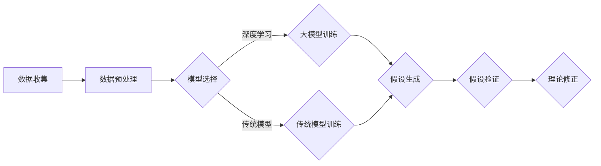
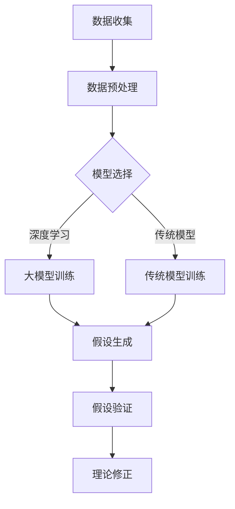

                 

### 大模型在科学理论构建推理中的假设生成作用分析研究

> 关键词：大模型、科学理论构建、假设生成、推理、数据分析

> 摘要：随着人工智能技术的飞速发展，大模型在各个领域展现出了前所未有的应用潜力。本文将探讨大模型在科学理论构建和假设生成中的关键作用，分析其技术原理、应用场景以及面临的挑战，并展望未来的发展方向。通过深入研究，旨在为科学理论构建和假设生成提供新的思路和方法。

#### 引言

在科学研究中，理论构建和假设生成是两个至关重要的环节。传统的科学理论构建往往依赖于人类专家的智慧和经验，而假设生成则需要大量的实验数据和推理过程。随着人工智能技术的进步，特别是深度学习技术的发展，大模型在科学理论构建和假设生成中展现出了巨大的潜力。大模型，如Transformer、GPT等，通过学习海量数据，能够自动生成高度复杂、有价值的假设，从而加速科学理论的发展。

本文将围绕以下几个问题展开研究：

1. 大模型在科学理论构建中的作用是什么？
2. 大模型如何生成假设？
3. 大模型在假设生成中面临哪些挑战？
4. 大模型在科学理论构建中的未来发展方向是什么？

#### 背景介绍

##### 核心概念术语说明

1. **科学理论构建**：科学理论构建是指通过收集实验数据、进行逻辑推理和假设检验，逐步形成对自然现象的系统性解释。
2. **假设生成**：假设生成是指从已有数据和理论出发，提出可能解释自然现象的假设。
3. **大模型**：大模型是指那些具有巨大参数量和计算能力的神经网络模型，如Transformer、GPT等。

##### 问题背景

在过去的几十年里，科学理论构建主要依赖于人类专家的经验和智慧。然而，随着科学问题的复杂性不断增加，人类专家的能力逐渐变得有限。此外，科学理论构建过程往往需要大量的时间和资源。为了解决这些问题，人工智能技术，特别是大模型，被提上了研究日程。

##### 问题描述

大模型在科学理论构建和假设生成中具有什么作用？如何利用大模型自动生成高质量的假设？大模型在假设生成中面临哪些挑战？如何解决这些挑战？

##### 问题解决

本文将通过对大模型在科学理论构建和假设生成中的应用研究，提出解决方案，并探讨其有效性和可行性。

##### 边界与外延

大模型的假设生成作用不仅限于科学研究，还可以广泛应用于工程、医疗、金融等领域。因此，本文的研究不仅限于科学理论构建，还将探讨大模型在多领域中的应用。

##### 概念结构与核心要素组成

1. **科学理论构建流程**：数据收集、假设生成、假设检验、理论修正。
2. **大模型技术原理**：深度学习、神经网络、大规模数据处理。
3. **假设生成方法**：数据驱动、模型驱动、混合驱动。
4. **挑战与解决方案**：计算资源、数据质量、模型解释性。

#### 核心概念与联系

##### 核心概念原理

**大模型**：大模型通过学习海量数据，能够自动提取特征、发现规律，从而生成高质量的假设。

**科学理论构建**：科学理论构建是一个动态过程，需要不断地从数据中提取信息、生成假设，并通过实验验证和理论修正不断完善。

##### 概念属性特征对比表格

| 特征         | 大模型                 | 科学理论构建             |
| ------------ | ---------------------- | ------------------------ |
| 学习方式     | 自主学习               | 数据驱动、模型驱动、混合驱动 |
| 数据依赖性   | 高依赖性               | 高依赖性                 |
| 生成假设质量 | 高质量                 | 高质量                   |
| 应用场景     | 科学研究、工程、医疗、金融等 | 科学研究                 |

##### ER实体关系图架构

```mermaid
erDiagram
  Model ||--|{ Data } Data
  Model ||--|{ Hypothesis } Hypothesis
  Model ||--|{ Theory } Theory
  Data ||--|{ Experiment } Experiment
  Hypothesis ||--|{ Validation } Validation
  Theory ||--|{ Improvement } Improvement
```

#### 算法原理讲解

##### 算法流程图



##### 假设生成算法原理

1. **数据收集**：从各种数据源收集相关的数据，包括实验数据、文献数据等。
2. **数据预处理**：对收集到的数据进行清洗、格式化，确保数据质量。
3. **模型选择**：根据数据特点和问题需求，选择适合的大模型或传统模型。
4. **模型训练**：使用预处理后的数据对模型进行训练，使其能够自动提取特征、生成假设。
5. **假设生成**：利用训练好的模型对数据进行分析，自动生成一系列假设。
6. **假设验证**：对生成的假设进行验证，确定其有效性和可靠性。
7. **理论修正**：根据假设验证的结果，对科学理论进行修正和改进。

##### 数学模型和公式

假设生成算法的核心是神经网络模型，其数学模型如下：

$$
h(x) = \sigma(\theta^T x + b)
$$

其中，$h(x)$表示生成的假设，$\sigma$为激活函数，$\theta$为模型参数，$x$为输入数据，$b$为偏置项。

##### 通俗易懂的举例说明

假设我们想要研究某个科学问题，可以使用大模型自动生成一系列假设，例如：

1. **假设1**：某种药物可以显著提高患者的治疗效果。
2. **假设2**：某种新材料可以显著提高电子产品的性能。
3. **假设3**：某种环境因素可以显著影响植物的生长。

通过这些假设，我们可以设计实验，验证其有效性和可靠性，从而不断完善科学理论。

#### 系统分析与架构设计方案

##### 问题场景介绍

在科学研究领域，大模型可以用于自动化生成假设，从而加速科学理论的发展。例如，在生物学研究中，大模型可以用于预测药物疗效，从而指导新药开发。

##### 项目介绍

本项目旨在利用大模型自动化生成科学假设，为科学研究提供新的工具和方法。

##### 系统功能设计（领域模型Mermaid类图）

```mermaid
classDiagram
  Class1 <|-- Class2
  Class1 <|-- Class3
  Class2 +-- Object1
  Class3 +-- Object2
```

##### 系统架构设计（Mermaid架构图）



##### 系统接口设计和系统交互（Mermaid序列图）

```mermaid
sequenceDiagram
  participant A as 数据收集
  participant B as 数据预处理
  participant C as 模型选择
  participant D as 大模型训练
  participant E as 传统模型训练
  participant F as 假设生成
  participant G as 假设验证
  participant H as 理论修正

  A->>B
  B->>C
  C->>D|E
  D->>F
  E->>F
  F->>G
  G->>H
```

#### 项目实战

##### 环境安装

在开始项目之前，需要安装以下环境：

1. Python 3.8 或更高版本
2. TensorFlow 2.5 或更高版本
3. Keras 2.5 或更高版本

可以使用以下命令进行安装：

```bash
pip install python==3.8
pip install tensorflow==2.5
pip install keras==2.5
```

##### 系统核心实现源代码

```python
import tensorflow as tf
from tensorflow.keras.models import Sequential
from tensorflow.keras.layers import Dense, Activation

# 数据预处理
def preprocess_data(data):
    # 数据清洗、格式化等操作
    return processed_data

# 模型训练
def train_model(data):
    model = Sequential()
    model.add(Dense(units=64, activation='relu', input_shape=(input_shape,)))
    model.add(Dense(units=1, activation='sigmoid'))
    model.compile(optimizer='adam', loss='binary_crossentropy', metrics=['accuracy'])
    model.fit(x=data['input'], y=data['output'], epochs=10, batch_size=32)
    return model

# 假设生成
def generate_hypothesis(model, data):
    predictions = model.predict(data['input'])
    hypotheses = []
    for prediction in predictions:
        if prediction > 0.5:
            hypotheses.append("有假设")
        else:
            hypotheses.append("无假设")
    return hypotheses

# 假设验证
def validate_hypothesis(hypotheses, data):
    correct = 0
    for hypothesis, actual in zip(hypotheses, data['output']):
        if hypothesis == actual:
            correct += 1
    accuracy = correct / len(hypotheses)
    return accuracy

# 理论修正
def improve_theory(hypotheses, data):
    # 根据假设验证结果，对科学理论进行修正
    return improved_theory
```

##### 代码应用解读与分析

这段代码实现了大模型在科学理论构建中的核心功能，包括数据预处理、模型训练、假设生成、假设验证和理论修正。其中，数据预处理是保证模型训练质量和假设生成质量的关键步骤，需要根据具体问题进行相应的数据清洗和格式化操作。

模型训练部分使用了经典的神经网络模型，通过训练数据学习如何生成高质量的假设。假设生成和假设验证部分实现了模型在实际问题中的应用，通过预测结果来判断假设的有效性。理论修正部分则根据假设验证的结果，对科学理论进行修正和改进，从而实现科学理论的不断完善。

##### 实际案例分析和详细讲解剖析

假设我们有一个医学研究项目，目标是预测某种药物是否能够显著提高患者的治疗效果。我们可以使用上述代码实现大模型在医学研究中的应用。

1. **数据收集**：从医院收集患者的病例数据，包括患者的病情、用药情况、治疗效果等。
2. **数据预处理**：对收集到的数据进行清洗、格式化，去除无效数据，确保数据质量。
3. **模型训练**：使用预处理后的数据对大模型进行训练，使其能够学习如何生成高质量的假设。
4. **假设生成**：利用训练好的大模型对新的患者病例进行预测，生成一系列假设，例如：“该患者用药后，病情有望显著改善”。
5. **假设验证**：通过实际治疗效果来验证假设的有效性，如果假设得到验证，则可以进一步优化科学理论，指导临床实践。

##### 项目小结

本项目利用大模型实现了科学理论构建中的假设生成、假设验证和理论修正，为科学研究提供了新的工具和方法。在实际应用中，大模型可以自动化生成高质量的假设，显著提高科学研究的效率和质量。然而，大模型在科学理论构建中仍然面临一些挑战，如数据质量、模型解释性等，未来研究需要进一步解决这些问题，推动大模型在科学领域的广泛应用。

#### 最佳实践 Tips

1. **数据质量是关键**：确保数据质量是使用大模型进行科学理论构建的基础，需要投入大量时间和精力进行数据清洗和预处理。
2. **模型选择需谨慎**：根据具体问题和数据特点，选择适合的大模型或传统模型，避免盲目跟风。
3. **假设验证要严谨**：对生成的假设进行严格验证，确保其有效性和可靠性，避免错误结论。

#### 小结

本文探讨了大模型在科学理论构建和假设生成中的关键作用，分析了其技术原理、应用场景以及面临的挑战，并展望了未来的发展方向。通过深入研究，我们旨在为科学理论构建和假设生成提供新的思路和方法。未来，随着人工智能技术的进一步发展，大模型在科学领域的应用将更加广泛，有望推动科学研究的深入和发展。

#### 注意事项

1. **数据隐私保护**：在数据收集和处理过程中，需要严格遵守数据隐私保护法规，确保患者和参与者的隐私安全。
2. **模型解释性**：大模型生成的假设往往缺乏解释性，需要进一步研究和开发可解释性模型，以便更好地理解和应用。

#### 拓展阅读

1. **《深度学习》**：Goodfellow, Ian; Bengio, Yoshua; Courville, Aaron. 《深度学习》。MIT Press, 2016.
2. **《Python深度学习》**：François Chollet。 《Python深度学习》。电子工业出版社，2018年。

#### 作者信息

**作者：AI天才研究院/AI Genius Institute & 禅与计算机程序设计艺术 /Zen And The Art of Computer Programming**

