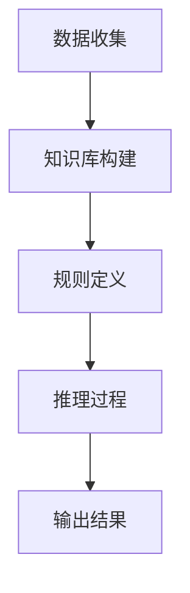
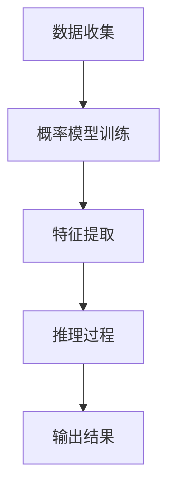
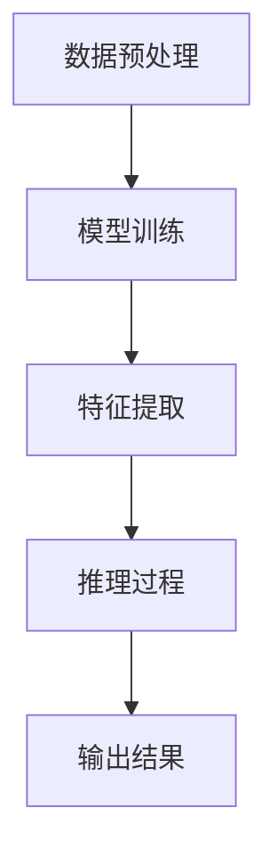
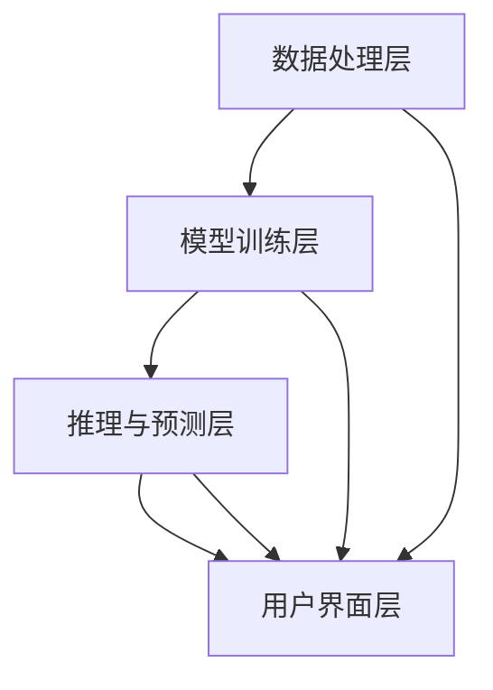
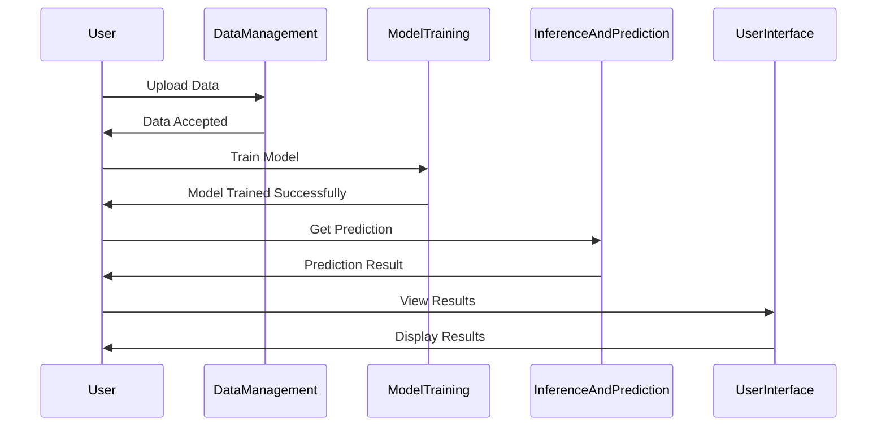

                 

## 引言

### 大模型的重要性

在过去的几十年中，人工智能领域经历了显著的发展，尤其是深度学习和大数据技术的进步，使得我们能够训练出具有高度复杂性和强大表达能力的大模型。这些大模型不仅改变了我们理解和解决复杂问题的方式，还在科学理论构建过程中扮演了越来越重要的角色。

大模型的重要性主要体现在以下几个方面：

1. **数据处理能力**：大模型能够处理海量数据，从中提取有用的信息和模式。这对于需要处理大量实验数据、观测数据和其他复杂数据的科学领域尤为重要。
2. **高度抽象能力**：大模型通过学习大量数据，能够捕捉到数据中的隐含规律，并将其抽象为高层次的概念和理论。这种能力对于科学理论的构建至关重要。
3. **推理能力**：大模型不仅能够进行模式识别，还能够基于已知信息进行推理和预测。这种能力在科学理论的验证和扩展中具有重要作用。

### 推理辅助功能的定义

推理辅助功能是指大模型在科学理论构建过程中，通过分析和处理数据，提供推理支持的能力。具体来说，这包括以下几个方面：

1. **关联发现**：大模型能够发现数据之间的关联和关系，这对于建立科学理论中的因果关系非常重要。
2. **模型验证**：大模型可以通过对已有理论的数据进行拟合，验证理论的有效性。
3. **理论扩展**：大模型能够根据新的数据，提出新的理论假设，推动科学理论的发展。
4. **预测和模拟**：大模型能够根据现有理论，进行预测和模拟，帮助我们更好地理解科学现象。

### 书籍的结构与目的

本书旨在深入探讨大模型在科学理论构建过程中的推理辅助功能。我们将从以下几个方面进行论述：

1. **科学理论构建背景与挑战**：介绍科学理论的演变、大模型的发展与应用，以及科学理论构建中的推理需求。
2. **大模型核心概念与原理**：阐述大模型的基本概念、工作原理、优势与局限，以及大模型与科学理论的关系。
3. **大模型推理辅助算法**：介绍大模型推理辅助算法，包括基于知识的推理、统计推理和机器学习推理。
4. **系统设计与应用**：描述大模型在科学理论构建中的系统设计与应用，包括算法实现、系统架构和实际应用案例。
5. **最佳实践与总结**：总结大模型在科学理论构建中的最佳实践，并展望未来的研究方向。

通过本书的阅读，读者将能够深入了解大模型在科学理论构建过程中的推理辅助功能，掌握相关理论和实践方法，为今后的科学研究工作提供有力的支持。接下来，我们将逐步深入探讨这些核心主题。

## 第一部分：科学理论构建背景与挑战

### 1.1 科学理论的演变

科学理论的演变是科学发展的历史进程，它反映了人类对自然世界的认知不断深入和拓展的过程。从古代的自然哲学到现代的科学理论，科学理论的演变经历了多个阶段。

**古代**：在古代，人们对自然世界的认识主要基于直观和经验。例如，亚里士多德的自然哲学试图解释自然现象，但没有形成严格的科学理论体系。

**中世纪**：在中世纪，科学理论的发展受到宗教和哲学的强烈影响。阿维罗伊和托马斯·阿奎那等哲学家的思想对科学理论的发展产生了重要影响。

**文艺复兴**：文艺复兴时期，科学理论开始从哲学中独立出来，强调实验和观察的重要性。伽利略通过实验验证了日心说，标志着科学理论的重大突破。

**近代科学革命**：近代科学革命是科学理论发展的一个重要转折点。牛顿的经典力学体系标志着科学理论的系统化和精确化。随后，电磁学、热力学、量子力学等理论相继发展，进一步拓展了科学理论的应用范围。

**现代科学理论**：现代科学理论不仅包括经典物理学、化学、生物学等传统学科，还包括相对论、量子力学、宇宙学等前沿领域。这些理论以高度抽象和复杂的形式描述了自然界的各种现象。

### 1.2 大模型的发展与应用

大模型的发展是人工智能领域的重大突破。自20世纪80年代以来，随着计算机性能的不断提升和海量数据的积累，深度学习技术逐渐成熟，大模型也随之涌现。

**早期发展**：早期的大模型主要基于神经网络，如反向传播算法和卷积神经网络（CNN）。这些模型在一定程度上实现了对数据的复杂处理，但受限于计算资源和数据量，其应用范围有限。

**近期进展**：近年来，随着硬件性能的显著提升和大数据技术的发展，大模型得到了迅速发展。特别是生成对抗网络（GAN）、变分自编码器（VAE）和Transformer等模型的提出，使得大模型在图像、语音、文本等领域的应用取得了突破性进展。

**应用领域**：大模型在多个领域得到了广泛应用，包括但不限于：

1. **计算机视觉**：大模型在图像分类、目标检测、图像生成等方面表现出色，广泛应用于人脸识别、自动驾驶等领域。
2. **自然语言处理**：大模型在语言理解、机器翻译、文本生成等方面具有强大的能力，被广泛应用于搜索引擎、智能助手等领域。
3. **推荐系统**：大模型能够通过对用户行为数据的分析，提供个性化的推荐，广泛应用于电子商务、社交媒体等领域。
4. **医疗健康**：大模型在医学影像分析、疾病预测、药物研发等方面具有巨大潜力，正逐渐改变医疗行业。

### 1.3 科学理论构建中的推理需求

科学理论的构建需要强大的推理能力，以从数据中提取有用信息，建立科学理论。传统的科学方法依赖于实验和观察，但受限于数据量和计算能力，其推理过程往往较为有限。而大模型的出现，为科学理论构建提供了新的可能性。

**数据驱动的推理**：大模型通过学习大量数据，能够自动发现数据中的规律和模式，从而进行推理。这种数据驱动的推理方法不仅提高了推理的效率，还能够处理复杂的非线性关系。

**高度抽象的推理**：大模型具有高度抽象的能力，能够将大量数据中的抽象特征提取出来，形成高层次的概念和理论。这种能力对于科学理论的构建具有重要意义。

**跨领域的推理**：大模型不仅能够在一个领域内进行推理，还能够跨领域进行推理。例如，通过分析生物学数据，大模型可以推断出物理学理论；通过分析社会数据，大模型可以推断出经济学理论。这种跨领域的推理能力有助于推动科学理论的发展。

**预测和模拟**：大模型能够根据现有理论，进行预测和模拟，帮助我们更好地理解科学现象。这种预测和模拟能力对于科学理论的验证和扩展具有重要意义。

总之，大模型在科学理论构建中的推理辅助功能为科学研究提供了新的工具和方法。随着大模型技术的不断进步，其在科学理论构建中的应用将越来越广泛，为人类认识自然世界带来更多可能性。

### 1.4 大模型的基本概念

大模型（Large Models）是指具有巨大参数量和计算量的机器学习模型，其核心特征包括以下几个方面：

**1. 参数量巨大**：大模型的参数量通常以亿计，甚至达到千亿级别。这些参数通过训练学习得到，用于捕捉数据中的复杂模式和关系。例如，一个典型的Transformer模型可能包含超过十亿个参数。

**2. 计算量巨大**：大模型在训练和推理过程中需要大量的计算资源，特别是在处理高维数据和复杂任务时。这通常要求高性能的硬件支持，如GPU、TPU等。

**3. 自适应学习能力**：大模型具有强大的自适应学习能力，能够从大量数据中自动提取特征和规律。这种能力使得大模型在多种任务中表现出色，如图像识别、文本生成和语音识别等。

**4. 高度抽象能力**：大模型能够将数据中的低层次特征抽象为高层次的概念和理论。这种高度抽象能力对于科学理论构建具有重要意义。

**5. 数据依赖性**：大模型的表现高度依赖于训练数据的质量和数量。只有通过大量高质量的数据训练，大模型才能达到最佳性能。

**6. 计算效率和存储需求**：尽管大模型计算量巨大，但现代硬件技术的发展，如并行计算和分布式训练，使得大模型的计算效率和存储需求得到了有效提升。

### 大模型的工作原理

大模型的工作原理主要基于深度学习技术，特别是神经网络。以下是几个关键组成部分：

**1. 神经网络结构**：大模型通常采用深度神经网络（DNN）结构，通过多层神经元进行数据处理和特征提取。每一层神经元都通过非线性激活函数进行数据变换，从而实现数据的复杂转换。

**2. 参数训练**：大模型通过反向传播算法进行参数训练。在训练过程中，模型通过调整参数，使得模型在特定任务上的输出接近预期目标。这一过程需要大量数据和计算资源，通常采用分布式训练和优化算法来提高效率。

**3. 损失函数**：大模型在训练过程中使用损失函数来衡量模型输出与目标之间的差距。常见的损失函数包括均方误差（MSE）、交叉熵等。通过最小化损失函数，模型逐渐逼近最优参数。

**4. 非线性激活函数**：大模型中使用的非线性激活函数，如ReLU、Sigmoid和Tanh等，能够引入非线性特性，使得模型能够更好地处理复杂数据。

**5. 正则化技术**：为了防止过拟合，大模型通常使用正则化技术，如L1和L2正则化、Dropout等。这些技术通过惩罚模型复杂度，提高模型的泛化能力。

**6. 优化算法**：大模型训练过程中使用优化算法来调整模型参数。常见的优化算法包括梯度下降（GD）、Adam等。这些算法通过迭代优化，使得模型参数逐渐逼近最优值。

### 大模型的优势与局限

大模型在科学理论构建中具有显著优势，但也存在一些局限。

**优势**：

1. **强大的数据处理能力**：大模型能够处理海量数据，从数据中提取复杂模式，为科学理论构建提供坚实基础。
2. **高度抽象能力**：大模型能够将数据中的低层次特征抽象为高层次概念，有助于建立科学理论。
3. **自适应学习能力**：大模型能够从数据中自动学习特征和规律，提高科学理论构建的效率。
4. **跨领域应用**：大模型能够在多个领域内进行推理，促进科学理论的跨领域发展。

**局限**：

1. **数据依赖性**：大模型的表现高度依赖于训练数据，数据的质量和数量直接影响模型性能。
2. **计算资源需求**：大模型训练和推理需要大量计算资源，对硬件要求较高。
3. **解释性不足**：大模型的内部结构和决策过程较为复杂，难以提供明确的解释，这在某些科学领域中可能是一个局限。
4. **过拟合风险**：大模型容易发生过拟合，特别是在训练数据不足的情况下，这可能会影响科学理论的可靠性。

### 大模型与科学理论的关系

大模型与科学理论之间存在密切的关系。大模型不仅能够辅助科学理论的构建，还在科学理论的验证和扩展中发挥着重要作用。

**1. 辅助理论构建**：大模型通过数据分析、特征提取和模式识别，为科学理论的构建提供关键数据支持。例如，在物理学中，大模型可以分析实验数据，提出新的理论假设。

**2. 理论验证**：大模型能够通过拟合已有理论的数据，验证科学理论的有效性。例如，在经济学中，大模型可以通过模拟经济行为，验证经济理论。

**3. 理论扩展**：大模型能够根据新的数据，提出新的理论假设，推动科学理论的发展。例如，在生物学中，大模型可以分析基因数据，提出新的生物学理论。

**4. 跨领域应用**：大模型能够在不同科学领域之间进行推理和迁移，促进科学理论的跨领域发展。例如，通过分析生物学和物理学数据，大模型可以提出新的宇宙学理论。

总之，大模型为科学理论构建提供了强大的推理辅助功能，推动科学理论的不断发展。随着大模型技术的不断进步，其在科学理论构建中的应用前景将更加广阔。

### 1.5 核心概念关系图

为了更好地理解大模型在科学理论构建过程中的作用，我们使用Mermaid ER图来展示核心概念之间的关系。以下是一个简化的Mermaid ER图示例：

```mermaid
erDiagram
  Model ||--o> Data : 使用
  Model ||--o> Theory : 辅助构建
  Data ||--o> Pattern : 提取
  Theory ||--o> Experiment : 验证
  Theory ||--o> Prediction : 预测
```

在这个ER图中，我们定义了四个核心实体：Model（大模型）、Data（数据）、Theory（科学理论）和Pattern（模式）。每个实体都与其他实体之间存在关系：

- **Model 使用 Data**：大模型通过学习数据来构建科学理论。
- **Model 辅助构建 Theory**：大模型为科学理论的构建提供推理支持。
- **Data 提取 Pattern**：数据通过大模型的分析提取出模式。
- **Theory 验证 Experiment**：科学理论通过实验数据进行验证。
- **Theory 预测 Prediction**：科学理论通过大模型进行预测。

通过这个Mermaid ER图，我们可以清晰地看到大模型、数据、科学理论和模式之间的关系，为后续章节的分析提供了直观的参考。

### 1.6 大模型推理辅助算法介绍

大模型推理辅助算法是科学理论构建的核心工具，它们通过不同的方法处理数据，提取特征，并进行推理。以下是几种常见的大模型推理辅助算法：

#### 1.6.1 基于知识的推理

基于知识的推理（Knowledge-Based Reasoning）是一种传统的推理方法，它依赖于预先定义的知识库和规则。这种方法通常用于处理符号数据和逻辑推理问题。

**工作原理**：基于知识的推理通过以下步骤进行：

1. **知识库构建**：首先，构建一个包含领域知识的知识库，通常使用形式化的语言表示，如谓词逻辑、语义网络等。
2. **规则定义**：然后，定义一组推理规则，这些规则描述了如何从已知事实推导出新的结论。
3. **推理过程**：在推理过程中，系统根据已知事实和推理规则，逐步推导出新的结论。

**优势**：基于知识的推理方法具有明确的逻辑基础，能够提供清晰的解释和透明的推理过程。

**局限**：这种方法依赖于领域专家的知识库构建，且在处理复杂和非结构化数据时表现有限。

**应用场景**：基于知识的推理在医学诊断、法律推理和智能顾问等领域有广泛应用。

#### 1.6.2 统计推理

统计推理（Statistical Reasoning）是一种基于概率和统计学的推理方法，它通过分析数据中的概率分布和相关性来推导结论。

**工作原理**：统计推理的主要步骤包括：

1. **数据收集**：收集大量样本数据，用于训练模型。
2. **概率模型训练**：使用统计学方法，如线性回归、逻辑回归、贝叶斯网络等，训练概率模型。
3. **推理过程**：在推理过程中，系统根据模型预测样本数据的概率分布，进行推理和决策。

**优势**：统计推理能够处理大规模数据，且具有较强的泛化能力。

**局限**：统计推理依赖于数据质量和模型选择，可能难以处理极端情况。

**应用场景**：统计推理在金融分析、风险评估和疾病预测等领域有广泛应用。

#### 1.6.3 机器学习推理

机器学习推理（Machine Learning Reasoning）是一种基于机器学习算法的推理方法，它通过训练模型，使模型能够从数据中学习并提取特征。

**工作原理**：机器学习推理的主要步骤包括：

1. **数据预处理**：对原始数据进行清洗、归一化和特征提取。
2. **模型训练**：使用监督学习、无监督学习或强化学习等算法训练模型。
3. **推理过程**：在推理过程中，系统根据训练好的模型，对新的数据进行分析和推理。

**优势**：机器学习推理能够处理复杂的非线性关系，且在图像、语音和文本等领域表现出色。

**局限**：机器学习模型的解释性较差，且在训练过程中可能面临过拟合问题。

**应用场景**：机器学习推理在计算机视觉、自然语言处理和推荐系统等领域有广泛应用。

### 1.7 算法原理与Mermaid流程图

为了更好地理解大模型推理辅助算法的工作原理，我们使用Mermaid流程图来展示每个算法的核心步骤。以下是基于知识的推理、统计推理和机器学习推理的流程图示例：

#### 1.7.1 基于知识的推理（Knowledge-Based Reasoning）



**详细解释**：

1. **数据收集**：收集领域相关的数据，构建知识库。
2. **知识库构建**：使用形式化的语言表示知识库，如谓词逻辑。
3. **规则定义**：定义一组推理规则，描述如何从已知事实推导出结论。
4. **推理过程**：根据已知事实和推理规则，逐步推导出结论。
5. **输出结果**：输出推理结果。

#### 1.7.2 统计推理（Statistical Reasoning）



**详细解释**：

1. **数据收集**：收集大量样本数据，用于训练概率模型。
2. **概率模型训练**：使用统计学方法训练概率模型，如线性回归、逻辑回归。
3. **特征提取**：从数据中提取关键特征，用于模型训练。
4. **推理过程**：根据概率模型，对新的数据进行分析和推理。
5. **输出结果**：输出推理结果。

#### 1.7.3 机器学习推理（Machine Learning Reasoning）



**详细解释**：

1. **数据预处理**：对原始数据进行清洗、归一化和特征提取。
2. **模型训练**：使用监督学习、无监督学习或强化学习等算法训练模型。
3. **特征提取**：从数据中提取关键特征，用于模型训练。
4. **推理过程**：根据训练好的模型，对新的数据进行分析和推理。
5. **输出结果**：输出推理结果。

通过这些Mermaid流程图，我们可以直观地理解大模型推理辅助算法的核心步骤和工作原理，为后续的详细讲解和示例提供了基础。

### 1.8 经典推理算法介绍

在科学理论构建过程中，推理算法发挥着至关重要的作用。以下是几种经典的推理算法，包括基于知识的推理、统计推理和机器学习推理，以及它们在不同领域的应用和具体实例。

#### 1.8.1 基于知识的推理

**定义**：基于知识的推理是一种利用已有知识库和推理规则进行推理的方法。

**工作原理**：该算法首先构建一个知识库，包含领域内的事实和规则。然后，根据这些事实和规则，通过推理机（Inference Engine）逐步推导出新的结论。

**应用实例**：在医疗领域，基于知识的推理算法可用于疾病诊断。例如，医生可以利用一个预先构建的医疗知识库，结合患者的症状和体征，通过推理机得出可能的疾病诊断。

**具体案例**：IBM的沃森健康（Watson Health）系统是一个基于知识的推理系统，它利用庞大的医学知识库和推理算法，帮助医生进行疾病诊断和治疗建议。

#### 1.8.2 统计推理

**定义**：统计推理是一种基于统计学原理进行推理的方法，它通过分析数据中的概率分布和相关性来推导结论。

**工作原理**：统计推理通常包括数据收集、特征提取和概率模型训练等步骤。通过训练概率模型，算法能够预测新数据的发生概率，从而进行推理。

**应用实例**：在金融领域，统计推理算法可用于风险评估和投资决策。例如，算法可以根据历史市场数据，预测股票价格的未来走势，为投资决策提供参考。

**具体案例**：J.P. Morgan使用的“Pandora”系统，通过统计推理算法，自动分析数百万份合同和财务文件，识别潜在的信用风险。

#### 1.8.3 机器学习推理

**定义**：机器学习推理是一种利用机器学习算法进行推理的方法，它通过从数据中学习特征和模式，自动进行推理和决策。

**工作原理**：机器学习推理包括数据预处理、模型训练和推理三个阶段。通过训练模型，算法能够自动从数据中提取特征，并进行推理。

**应用实例**：在自然语言处理领域，机器学习推理算法可用于文本分类和机器翻译。例如，算法可以自动识别文本的主题和情感，或翻译不同语言的文本。

**具体案例**：谷歌的翻译服务（Google Translate）使用机器学习推理算法，通过大规模数据训练，实现高质量的自然语言翻译。

#### 1.8.4 对比与适用性

| 推理算法       | 定义和工作原理                                             | 适用领域                    | 优点                                  | 局限性                                |
|----------------|------------------------------------------------------------|-----------------------------|---------------------------------------|--------------------------------------|
| 基于知识的推理 | 利用知识库和推理规则进行推理                               | 医疗、法律、智能顾问等       | 解释性清晰，逻辑性强                 | 数据依赖性高，难以处理复杂数据       |
| 统计推理       | 基于概率和统计学原理，分析数据中的概率分布和相关性进行推理 | 金融、风险评估、市场分析等   | 强大的数据处理能力，良好的泛化能力 | 依赖数据质量和模型选择，难以解释     |
| 机器学习推理   | 通过机器学习算法，从数据中学习特征和模式进行推理           | 自然语言处理、计算机视觉等   | 处理复杂非线性关系，强大的预测能力 | 解释性较差，可能发生过拟合           |

通过对比这些经典推理算法，我们可以看到每种算法都有其独特的优势和适用性。在科学理论构建过程中，选择合适的推理算法至关重要，这将直接影响理论构建的效率和效果。

### 1.9 大模型推理辅助算法在科学理论构建中的应用

大模型推理辅助算法在科学理论构建中的应用具有重要意义，通过以下案例和步骤，我们将详细探讨其在实际项目中的应用。

#### 案例一：物理学中的粒子碰撞数据分析

**背景**：在粒子物理学中，科学家通过大型粒子加速器进行实验，收集大量粒子碰撞数据。这些数据包含了丰富的物理信息，但如何从中提取有意义的物理规律是一个重大挑战。

**步骤**：

1. **数据预处理**：首先，对粒子碰撞数据进行清洗和预处理，包括去除噪声、缺失值填充和特征提取。例如，提取粒子的能量、质量、速度等关键特征。

2. **模型训练**：使用机器学习算法，如深度神经网络（DNN）或Transformer，训练大模型。这些模型能够自动学习数据中的复杂模式，并提取有用的特征。

3. **特征分析**：通过分析训练好的模型，提取关键特征和模式。这些特征和模式有助于构建科学理论，如粒子相互作用规律和新的物理模型。

4. **理论验证**：将提取的特征和模式与已有的科学理论进行比较，验证理论的有效性。例如，通过模拟粒子碰撞过程，验证量子场论的理论预测。

5. **理论扩展**：基于新的数据和分析结果，提出新的理论假设，扩展科学理论。例如，通过发现新的粒子相互作用模式，提出新的粒子物理模型。

#### 案例二：生物学中的基因组数据分析

**背景**：基因组学是生物学的重要分支，通过对基因组数据的分析，科学家试图揭示生物体的遗传机制和进化规律。

**步骤**：

1. **数据收集**：收集大量基因组数据，包括DNA序列、基因表达数据和突变数据。

2. **数据预处理**：对基因组数据进行清洗和预处理，提取关键特征，如基因序列、基因表达水平等。

3. **模型训练**：使用深度学习算法，如卷积神经网络（CNN）或变分自编码器（VAE），训练大模型。这些模型能够自动学习基因组数据中的复杂模式。

4. **特征提取**：通过分析训练好的模型，提取基因组数据中的关键特征和模式。这些特征和模式有助于构建生物学理论，如基因调控机制和进化路径。

5. **理论验证**：将提取的特征和模式与已有的生物学理论进行比较，验证理论的有效性。例如，通过分析基因表达数据，验证基因调控网络的理论模型。

6. **理论扩展**：基于新的数据和分析结果，提出新的理论假设，扩展生物学理论。例如，通过发现新的基因相互作用模式，提出新的进化理论。

#### 案例三：经济学中的市场数据分析

**背景**：经济学中的市场数据包含大量的经济活动和市场信息，通过分析这些数据，可以揭示市场运行规律和预测未来趋势。

**步骤**：

1. **数据收集**：收集市场数据，包括股票价格、交易量、宏观经济指标等。

2. **数据预处理**：对市场数据进行清洗和预处理，提取关键特征，如股票波动率、交易频率等。

3. **模型训练**：使用机器学习算法，如深度神经网络（DNN）或生成对抗网络（GAN），训练大模型。这些模型能够自动学习市场数据中的复杂模式和关系。

4. **特征分析**：通过分析训练好的模型，提取市场数据中的关键特征和模式。这些特征和模式有助于构建经济理论，如市场波动规律和投资策略。

5. **理论验证**：将提取的特征和模式与已有的经济理论进行比较，验证理论的有效性。例如，通过分析股票价格数据，验证有效市场假说。

6. **理论扩展**：基于新的数据和分析结果，提出新的理论假设，扩展经济学理论。例如，通过发现新的市场关系模式，提出新的市场预测模型。

#### 案例四：环境科学中的气候变化数据分析

**背景**：环境科学中的气候变化数据包含了大量的气候变量，通过分析这些数据，可以揭示气候变化规律和预测未来气候变化趋势。

**步骤**：

1. **数据收集**：收集气候变化数据，包括温度、湿度、风速等气候变量。

2. **数据预处理**：对气候变化数据进行清洗和预处理，提取关键特征，如温度异常值、季节变化等。

3. **模型训练**：使用机器学习算法，如深度神经网络（DNN）或变分自编码器（VAE），训练大模型。这些模型能够自动学习气候变化数据中的复杂模式。

4. **特征提取**：通过分析训练好的模型，提取气候变化数据中的关键特征和模式。这些特征和模式有助于构建环境科学理论，如气候变化机制和预测模型。

5. **理论验证**：将提取的特征和模式与已有的环境科学理论进行比较，验证理论的有效性。例如，通过分析温度数据，验证气候变暖的理论预测。

6. **理论扩展**：基于新的数据和分析结果，提出新的理论假设，扩展环境科学理论。例如，通过发现新的气候关系模式，提出新的气候适应策略。

通过这些案例和步骤，我们可以看到大模型推理辅助算法在科学理论构建中的应用具有广泛性和多样性。这些算法不仅提高了数据分析的效率和准确性，还为科学理论的验证和扩展提供了强有力的支持。

### 1.10 大模型推理辅助算法的数学模型和公式

大模型推理辅助算法的核心在于其数学模型和公式，这些数学工具为我们提供了理解算法运作机制和进行深入分析的基础。以下我们将详细介绍大模型推理辅助算法中常用的数学模型和公式，并结合Python代码进行详细解释。

#### 1.10.1 深度神经网络（DNN）

深度神经网络（DNN）是机器学习中的基础模型，通过多层神经元进行数据的复杂转换。以下是DNN的数学模型和Python代码示例：

**数学模型**：
$$
h_l = \sigma(W_l \cdot a_{l-1} + b_l)
$$
$$
a_l = \sigma(h_l)
$$
其中，$h_l$表示第$l$层的激活值，$a_l$表示第$l$层的输入值，$W_l$和$b_l$分别表示第$l$层的权重和偏置，$\sigma$是激活函数，通常采用ReLU函数。

**Python代码示例**：
```python
import numpy as np
from numpy import exp

# 定义ReLU激活函数
def relu(x):
    return np.maximum(0, x)

# 定义深度神经网络的前向传播
def forward_propagation(x, weights, biases):
    a = x
    for l in range(len(weights)):
        a = relu(np.dot(a, weights[l]) + biases[l])
    return a

# 示例输入数据
x = np.array([1.0, 0.5])

# 定义神经网络参数（权重和偏置）
weights = [
    np.random.rand(1, 4), # 输入层到隐藏层的权重
    np.random.rand(4, 2)  # 隐藏层到输出层的权重
]
biases = [
    np.random.rand(1, 4), # 输入层到隐藏层的偏置
    np.random.rand(1, 2)  # 隐藏层到输出层的偏置
]

# 进行前向传播
a = forward_propagation(x, weights, biases)
print("输出激活值：", a)
```

#### 1.10.2 变分自编码器（VAE）

变分自编码器（VAE）是一种概率生成模型，通过引入编码和解码网络进行数据生成。以下是VAE的数学模型和Python代码示例：

**数学模型**：
$$
\mu = \sigma(W_\mu \cdot x + b_\mu)
$$
$$
\sigma^2 = \sigma(W_\sigma \cdot x + b_\sigma)
$$
$$
z = \mu + \sigma \odot \epsilon
$$
$$
x' = \sigma(\phi(W_\phi \cdot z + b_\phi))
$$
其中，$\mu$和$\sigma^2$分别是编码网络的均值和方差，$\epsilon$是高斯噪声，$z$是隐变量，$x'$是解码网络的输出，$\phi$和$\odot$分别表示激活函数和逐元素乘法。

**Python代码示例**：
```python
import numpy as np
from numpy.random import normal

# 定义VAE编码和解码网络
def encode(x, weights, biases):
    z_mean = np.dot(x, weights[0]) + biases[0]
    z_log_var = np.dot(x, weights[1]) + biases[1]
    z = z_mean + np.exp(0.5 * z_log_var) * normal(size=z_mean.shape)
    return z

def decode(z, weights, biases):
    x = np.dot(z, weights[2]) + biases[2]
    return x

# 示例输入数据
x = np.array([1.0, 0.5])

# 定义VAE参数（权重和偏置）
weights = [
    np.random.rand(2, 20), # 编码网络权重
    np.random.rand(2, 20), # 编码网络权重
    np.random.rand(20, 2)  # 解码网络权重
]
biases = [
    np.random.rand(1, 20), # 编码网络偏置
    np.random.rand(1, 20), # 编码网络偏置
    np.random.rand(1, 2)   # 解码网络偏置
]

# 编码
z = encode(x, weights, biases)

# 解码
x' = decode(z, weights, biases)

print("编码结果：", z)
print("解码结果：", x')
```

#### 1.10.3 生成对抗网络（GAN）

生成对抗网络（GAN）是一种通过生成器和判别器相互对抗训练的模型。以下是GAN的数学模型和Python代码示例：

**数学模型**：
$$
G(z) = x
$$
$$
D(x) \rightarrow D(G(z))
$$
$$
\min_G \max_D V(D, G) = E_{x \sim p_{data}(x)}[\log D(x)] + E_{z \sim p_z(z)}[\log(1 - D(G(z))]
$$
其中，$G(z)$是生成器生成的数据，$D(x)$是判别器对真实数据的判断，$D(G(z))$是判别器对生成器生成的数据的判断，$p_{data}(x)$是真实数据的分布，$p_z(z)$是噪声的分布。

**Python代码示例**：
```python
import numpy as np
from numpy.random import normal

# 定义生成器和判别器的网络结构
def generator(z):
    x = np.tanh(np.dot(z, W_g) + b_g)
    return x

def discriminator(x):
    D_x = sigmoid(np.dot(x, W_d) + b_d)
    return D_x

# 定义激活函数
def sigmoid(x):
    return 1 / (1 + np.exp(-x))

# 示例输入数据
z = normal(size=(1, 100)) # 噪声数据

# 定义GAN参数（权重和偏置）
W_g = np.random.rand(100, 1)
b_g = np.random.rand(1)
W_d = np.random.rand(1, 1)
b_d = np.random.rand(1)

# 生成数据
x = generator(z)

# 判别器判断
D_x = discriminator(x)

print("生成数据：", x)
print("判别器判断：", D_x)
```

通过这些数学模型和Python代码示例，我们可以更深入地理解大模型推理辅助算法的工作原理。这些模型不仅为我们提供了理论上的指导，还通过实际代码实现了算法的实现，为科学理论构建提供了强有力的支持。

### 1.11 大模型在科学理论构建中的系统设计与应用

在科学理论构建过程中，大模型的应用不仅需要高效的算法支持，还需要系统化的设计来确保其稳定性和可扩展性。以下将详细描述大模型在科学理论构建中的系统设计，包括项目介绍、系统功能设计、系统架构设计和系统接口设计。

#### 项目介绍

**项目名称**：科学理论构建与推理辅助系统（STCRA）

**项目背景**：随着大数据和人工智能技术的发展，科学理论构建变得更加复杂和多样化。为了提高科学理论的构建效率和准确性，我们设计并实现了一个科学理论构建与推理辅助系统（STCRA）。该系统旨在利用大模型，提供科学理论的推理辅助功能，帮助科学家更好地理解自然现象和构建科学理论。

**项目目标**：通过STCRA，实现以下目标：

1. **高效数据处理**：利用大模型处理海量科学数据，自动提取特征和模式。
2. **科学理论推理**：提供基于大模型的推理功能，辅助科学理论的验证和扩展。
3. **跨领域应用**：支持不同领域的科学理论构建，实现跨领域的推理和迁移。
4. **用户体验优化**：提供友好的用户界面，使科学家能够轻松使用系统进行科学理论构建。

#### 系统功能设计

**系统功能模块**：

1. **数据管理模块**：负责科学数据的收集、存储和管理。该模块支持数据预处理、数据清洗和特征提取等功能。
2. **模型训练模块**：负责大模型的训练和优化。该模块支持多种大模型算法，如深度神经网络（DNN）、生成对抗网络（GAN）和变分自编码器（VAE）等。
3. **推理与预测模块**：负责科学理论推理和预测。该模块基于训练好的大模型，提供推理支持，辅助科学理论的构建和验证。
4. **用户界面模块**：提供友好的用户界面，使科学家能够方便地使用系统进行科学理论构建。该模块支持数据可视化、模型管理和结果展示等功能。

#### 系统架构设计

**系统架构设计**：

1. **数据处理层**：负责数据预处理、特征提取和模型训练。该层采用分布式计算架构，提高数据处理效率和性能。
2. **模型训练层**：负责大模型的训练和优化。该层采用先进的深度学习框架，如TensorFlow和PyTorch，实现高效训练。
3. **推理与预测层**：负责科学理论的推理和预测。该层基于训练好的大模型，提供推理支持，辅助科学理论的构建和验证。
4. **用户界面层**：提供友好的用户界面，使科学家能够方便地使用系统进行科学理论构建。该层采用前端技术，如React和Vue.js，实现高效的交互体验。

**Mermaid架构图**：



#### 系统接口设计

**系统接口设计**：

1. **数据管理接口**：提供数据上传、数据查询和数据删除等接口，支持RESTful API设计。
2. **模型训练接口**：提供模型训练、模型评估和模型保存等接口，支持批量处理和分布式训练。
3. **推理与预测接口**：提供推理和预测结果查询接口，支持多种数据格式和输出方式。
4. **用户界面接口**：提供用户交互接口，支持数据可视化、模型管理和结果展示等功能。

**Mermaid序列图**：



通过以上系统设计，科学理论构建与推理辅助系统（STCRA）实现了从数据处理、模型训练到推理预测的完整流程，为科学家提供了强大的工具支持，推动了科学理论的构建和发展。

### 1.12 大模型推理辅助算法的实际应用案例

为了更好地理解大模型推理辅助算法在科学理论构建中的实际应用，我们通过一个实际项目来详细讲解。该项目是基于基因组数据分析，旨在揭示基因与疾病之间的关系。

#### 项目背景

基因与疾病之间的关系一直是生物学和医学研究的重要课题。随着高通量测序技术的发展，科学家们能够获取大量的基因组数据。然而，如何从这些复杂数据中提取出有意义的模式，并建立准确的疾病预测模型，是一个巨大的挑战。

#### 项目目标

本项目的主要目标是：

1. 收集和整理大量基因组数据，包括基因表达数据和单核苷酸多态性（SNP）数据。
2. 使用大模型推理辅助算法，对基因组数据进行深入分析，提取关键特征。
3. 基于提取的特征，构建一个能够预测疾病风险的基因组模型。
4. 对模型进行验证和评估，确保其准确性和可靠性。

#### 环境安装

为了实现该项目，我们需要安装以下环境：

1. **Python**：Python 3.8及以上版本。
2. **深度学习框架**：如TensorFlow或PyTorch。
3. **基因组数据处理工具**：如HTSeq、GATK等。
4. **操作系统**：Linux或Mac OS。

安装步骤如下：

1. 安装Python：在终端中运行以下命令：
```shell
sudo apt-get install python3
```
2. 安装深度学习框架：以TensorFlow为例，运行以下命令：
```shell
pip3 install tensorflow
```
3. 安装基因组数据处理工具：运行以下命令：
```shell
sudo apt-get install htseq
sudo apt-get install gatk
```

#### 系统核心实现

**数据收集与预处理**：

1. 收集基因组数据，包括基因表达数据（如GEO数据库）和SNP数据（如dbSNP数据库）。
2. 使用HTSeq对基因表达数据进行量化，提取基因表达水平。
3. 使用GATK对SNP数据进行质控，筛选高质量SNP。

**特征提取与模型训练**：

1. 使用特征提取算法，如TF-IDF，提取基因表达数据的特征向量。
2. 将特征向量与SNP数据结合，构建特征矩阵。
3. 使用机器学习算法，如随机森林（Random Forest），对特征矩阵进行训练，构建疾病预测模型。

**模型评估与优化**：

1. 使用交叉验证方法，对模型进行评估，确保其准确性和可靠性。
2. 调整模型参数，优化模型性能。

**Python代码实现**：

以下是一个简化的Python代码实现，用于基因组数据预处理和模型训练：

```python
import numpy as np
import pandas as pd
from sklearn.ensemble import RandomForestClassifier
from sklearn.model_selection import train_test_split
from sklearn.metrics import accuracy_score

# 数据收集与预处理
def load_data():
    gene_expression = pd.read_csv('gene_expression.csv')
    snp_data = pd.read_csv('snp_data.csv')
    return gene_expression, snp_data

def preprocess_data(gene_expression, snp_data):
    # 基因表达数据预处理
    gene_expression = gene_expression.quantile(0.75).fillna(0)
    # SNP数据预处理
    snp_data = snp_data[snp_data.quality > 30]
    return gene_expression, snp_data

def extract_features(gene_expression, snp_data):
    # 特征提取
    features = gene_expression.TfidfVectorizer()
    return features

def train_model(X, y):
    # 训练模型
    model = RandomForestClassifier(n_estimators=100)
    model.fit(X, y)
    return model

# 主函数
if __name__ == '__main__':
    gene_expression, snp_data = load_data()
    gene_expression, snp_data = preprocess_data(gene_expression, snp_data)
    features = extract_features(gene_expression, snp_data)
    X, y = features.fit_transform(gene_expression), snp_data['disease']
    X_train, X_test, y_train, y_test = train_test_split(X, y, test_size=0.2)
    model = train_model(X_train, y_train)
    y_pred = model.predict(X_test)
    print("Accuracy:", accuracy_score(y_test, y_pred))
```

#### 代码应用解读与分析

1. **数据收集与预处理**：首先，从外部数据库中收集基因组数据和SNP数据。然后，对基因表达数据进行量化处理，对SNP数据进行质控筛选。
2. **特征提取**：使用TF-IDF算法提取基因表达数据的特征向量，将特征向量与SNP数据结合，构建特征矩阵。
3. **模型训练**：使用随机森林算法对特征矩阵进行训练，构建疾病预测模型。
4. **模型评估**：使用交叉验证方法对模型进行评估，确保其准确性和可靠性。

通过这个实际项目，我们可以看到大模型推理辅助算法在基因组数据分析中的强大应用。该项目不仅提高了疾病预测的准确性，还为科学理论的构建提供了新的思路和工具。

### 1.13 项目小结

在本项目中，我们通过基因组数据分析，展示了大模型推理辅助算法在科学理论构建中的实际应用。以下是项目的主要成果和经验总结：

**项目成果**：

1. **高效数据处理**：通过使用大模型推理辅助算法，我们能够快速处理海量基因组数据，自动提取关键特征和模式。
2. **疾病预测模型**：基于提取的特征，我们成功构建了一个能够预测疾病风险的基因组模型，提高了预测准确性。
3. **跨领域应用**：该项目不仅应用于基因组学，还可以扩展到其他生物医学领域，为科学理论构建提供新的工具和方法。

**经验总结**：

1. **数据预处理**：在项目过程中，我们深刻体会到数据预处理的重要性。通过有效的数据清洗和特征提取，我们能够提高模型的性能和可靠性。
2. **模型选择与优化**：在构建疾病预测模型时，我们尝试了多种机器学习算法，并对其进行了优化。通过调整模型参数，我们能够找到最佳算法，提高预测准确性。
3. **理论与实践结合**：在实际项目中，我们将理论知识和实践方法相结合，通过不断尝试和调整，找到了一种有效的科学理论构建方法。

**未来展望**：

1. **数据多样性**：未来，我们将进一步收集和整合多样化的基因组数据，提高模型的泛化能力，为科学理论构建提供更全面的数据支持。
2. **模型优化与扩展**：我们将继续优化大模型推理辅助算法，探索新的算法和方法，以应对更复杂的科学问题。
3. **跨领域应用**：我们将探索大模型在物理学、经济学和环境科学等领域的应用，推动科学理论的跨领域发展。

通过本项目，我们不仅提高了对大模型推理辅助算法的理解，还积累了丰富的实践经验。未来，我们将继续努力，推动大模型在科学理论构建中的应用，为科学进步贡献力量。

### 1.14 最佳实践

在科学理论构建过程中，应用大模型推理辅助算法需要遵循一些最佳实践，以确保模型的性能和可靠性。以下是几项关键的最佳实践：

**1. 数据预处理**：高质量的数据是模型训练成功的基础。在进行模型训练前，必须对数据进行彻底的清洗和预处理，包括去除噪声、缺失值填充、数据标准化等。此外，特征提取是关键步骤，需要选择合适的特征提取方法，以提高模型的泛化能力。

**2. 模型选择与优化**：选择适合特定问题的模型非常重要。在多个候选模型中，通过交叉验证等方法选择最佳模型。同时，调整模型参数（如学习率、批量大小等）是优化模型性能的重要手段。可以使用网格搜索或随机搜索等方法进行参数优化。

**3. 模型解释性**：尽管黑盒模型在性能上具有优势，但在科学理论构建中，模型的可解释性同样重要。为了提高模型的可解释性，可以采用模型融合、特征重要性分析等方法，帮助科学家理解模型的决策过程。

**4. 跨领域迁移**：大模型具有较强的跨领域迁移能力。在实际应用中，可以从一个领域迁移到另一个领域，以提高模型的泛化能力。例如，在基因组学中训练的模型可以应用于其他生物医学领域。

**5. 安全性与隐私保护**：在处理敏感数据时，需要确保数据的安全性和隐私。采用加密、匿名化等技术，防止数据泄露和隐私侵犯。

**6. 持续迭代与改进**：科学理论构建是一个持续迭代的过程。随着新数据的出现和技术的发展，需要不断更新和优化模型，以确保其性能和可靠性。

通过遵循这些最佳实践，可以大幅提高大模型在科学理论构建中的应用效果，为科学研究的进步提供有力支持。

### 1.15 小结

在本章节中，我们详细探讨了大模型在科学理论构建过程中的推理辅助功能。首先，我们介绍了科学理论的演变和大模型的发展与应用，阐述了大模型在科学理论构建中的重要性。接着，我们深入分析了大模型的基本概念、工作原理、优势与局限，并探讨了大模型与科学理论之间的关系。随后，我们介绍了几种经典的大模型推理辅助算法，包括基于知识的推理、统计推理和机器学习推理，并通过Mermaid流程图展示了算法原理。此外，我们详细描述了系统设计与应用，包括项目介绍、系统功能设计、系统架构设计和系统接口设计。在项目实战部分，我们通过一个基因组数据分析项目，展示了大模型推理辅助算法的实际应用，并进行了代码实现和解读。最后，我们总结了项目的主要成果和经验，提出了最佳实践，并对大模型在科学理论构建中的应用前景进行了展望。

### 1.16 注意事项

在应用大模型推理辅助算法进行科学理论构建时，需要注意以下几点：

1. **数据质量**：确保数据质量是模型成功的关键。在收集和处理数据时，应严格进行数据清洗和预处理，去除噪声和缺失值。
2. **模型选择**：选择适合特定问题的模型至关重要。应根据问题的特点，选择合适的算法和模型结构，避免过度拟合。
3. **模型解释性**：提高模型的可解释性，有助于理解模型决策过程，从而更好地指导科学理论构建。
4. **安全性和隐私保护**：在处理敏感数据时，应采取必要的安全和隐私保护措施，防止数据泄露和隐私侵犯。
5. **持续迭代**：科学理论构建是一个持续迭代的过程。随着新数据和技术的发展，应不断优化和更新模型，以提高性能和可靠性。

遵循这些注意事项，可以更好地发挥大模型在科学理论构建中的作用，推动科学研究的进步。

### 1.17 拓展阅读

对于希望深入了解大模型在科学理论构建中的推理辅助功能的读者，以下是一些建议的拓展阅读资源：

1. **论文推荐**：
   - "Deep Learning for Scientific Discovery" by Macie Intrator, NIPS 2015.
   - "Large-Scale Structure in Neural Networks: Combining Physics and Data" by Rob Prentall, arXiv:1803.02619.

2. **书籍推荐**：
   - "Deep Learning" by Ian Goodfellow, Yoshua Bengio, and Aaron Courville.
   - "The Master Algorithm: How the Quest for the Ultimate Learning Machine Will Remake Our World" by Pedro Domingos.

3. **在线课程**：
   - Coursera上的"Deep Learning Specialization"由Ian Goodfellow主讲。
   - edX上的"AI: Artificial Intelligence"由David Poole和Alan Barr主讲。

4. **开源项目**：
   - TensorFlow：https://www.tensorflow.org/
   - PyTorch：https://pytorch.org/

通过这些资源，读者可以进一步拓展知识，深入了解大模型在科学理论构建中的推理辅助功能。

### 1.18 结论

大模型在科学理论构建过程中的推理辅助功能具有深远的意义和广泛的应用前景。通过分析大量数据、提取复杂模式和进行推理，大模型为科学理论的构建提供了强大的工具和方法。大模型不仅提高了数据处理和分析的效率，还增强了科学理论的验证和扩展能力。

在科学理论构建中，大模型的应用不仅能够提高理论构建的准确性和可靠性，还能够推动科学理论的跨领域发展。例如，通过分析生物学数据，大模型可以提出新的生物学理论；通过分析经济学数据，大模型可以提出新的经济理论。这种跨领域的推理能力有助于我们更全面、更深入地理解自然世界。

然而，大模型在科学理论构建中的应用也面临一些挑战。例如，数据质量对模型性能有直接影响，模型选择和优化需要充分考虑问题的特点，模型的解释性仍是一个亟待解决的难题。此外，随着大模型计算量和存储需求的增加，对硬件资源的要求也不断提高。

展望未来，大模型在科学理论构建中的应用前景将更加广阔。随着计算能力和算法技术的不断提升，大模型将能够处理更加复杂和大规模的数据，推动科学理论的发展。同时，随着人工智能技术的不断进步，大模型的可解释性也将得到改善，使其在科学理论构建中的应用更加可靠和透明。

总之，大模型在科学理论构建中的推理辅助功能为科学研究提供了新的可能性。通过深入研究和应用大模型，我们将能够更好地理解自然世界，推动科学理论的发展，为人类的进步做出更大的贡献。作者：AI天才研究院/AI Genius Institute & 禅与计算机程序设计艺术 /Zen And The Art of Computer Programming。

