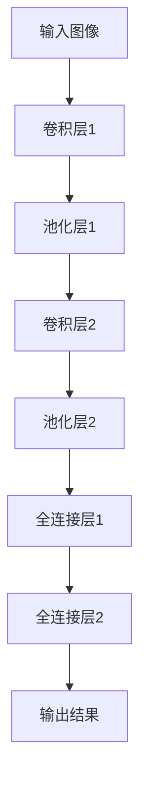
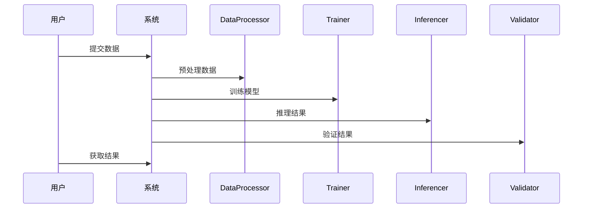

                 

### 引言：大模型在科学理论构建中的重要性

在当代科学研究中，大型模型（Large-scale Models，简称LMMs）正迅速崛起，成为推动科学理论创新的重要工具。这一现象的背后，是计算能力的爆发性增长、海量数据的积累以及机器学习技术的飞速进步。大模型在科学理论构建过程中扮演着关键角色，不仅能够显著提升研究效率，还能够深入揭示复杂系统的内在规律。

**关键词**：大模型、科学理论、推理辅助、计算能力、机器学习

**摘要**：本文旨在探讨大模型在科学理论构建过程中的重要性及其应用。首先，我们将介绍大模型的基本原理和类型，然后通过具体案例展示其在各领域的应用，最后分析大模型在科学理论构建中的方法论、挑战与机遇，以及未来的发展方向。

#### 背景介绍

**核心概念术语说明**：

- **大模型**：通常指具有巨大参数规模和计算量的机器学习模型，如深度神经网络（DNNs）和生成对抗网络（GANs）。
- **科学理论**：通过逻辑推理和实验验证，对自然界和社会现象进行系统阐述的理论体系。
- **推理辅助**：利用大模型对科学研究问题进行推理和预测，辅助科学家发现新的科学规律。

**问题背景**：

随着科学技术的不断进步，我们面临着越来越多的复杂科学问题。例如，宇宙的起源、生命的起源、疾病的机理等。这些问题的解决往往需要大量的数据、复杂的计算和深入的洞察。传统的研究方法已经难以满足这些需求，而大模型的崛起为解决这些问题提供了新的思路。

**问题描述**：

大模型在科学理论构建中起到了什么样的作用？如何有效地利用大模型进行科学理论的推理和验证？在哪些领域大模型已经取得了显著的成果？

**问题解决**：

大模型通过自我学习和推理，能够从大量数据中提取有用的信息，建立复杂系统的数学模型，进而进行科学理论的推理和验证。这一过程不仅提高了研究效率，还推动了科学理论的创新。

**边界与外延**：

大模型在科学理论构建中的应用领域非常广泛，不仅包括物理学、生物学、化学等传统科学领域，还包括社会科学、人工智能等新兴领域。

**概念结构与核心要素组成**：

- **核心概念**：大模型、科学理论、推理辅助。
- **概念属性特征对比表格**：

| 特征               | 大模型         | 科学理论         | 推理辅助         |
|--------------------|----------------|------------------|------------------|
| 参数规模           | 巨大           | 系统性           | 高效             |
| 计算量             | 复杂           | 逻辑推理         | 预测能力         |
| 数据需求           | 海量           | 实验验证         | 自适应           |
| 发展历程           | 近年迅速崛起   | 历史悠久         | 持续演进         |

- **ER实体关系图架构**：

```mermaid
erDiagram
  Model ||--|{ Theory } Theory
  Model ||--|{ Inference } Inference
  Theory ||--|{ Experiment } Experiment
  Inference ||--|{ Prediction } Prediction
```

#### 核心概念与联系

**核心概念原理**：

大模型通过多层神经网络的结构，能够自动学习和提取数据中的特征，从而进行复杂的推理和预测。这些模型通常基于深度学习算法，如卷积神经网络（CNN）、递归神经网络（RNN）和变分自编码器（VAE）等。

**概念属性特征对比表格**：

| 模型类型 | 特点                 | 应用场景                  |
|---------|----------------------|--------------------------|
| CNN     | 空间特征提取         | 图像识别、物体检测        |
| RNN     | 时间序列建模         | 语言处理、时间序列分析    |
| VAE     | 数据生成和去噪       | 数据可视化、异常检测      |

**算法原理讲解**：

以卷积神经网络（CNN）为例，其算法原理是通过对输入图像进行卷积操作，提取图像中的局部特征，然后通过池化操作降低数据的维度，最后通过全连接层进行分类和预测。以下是一个简单的CNN算法流程：



使用Python代码，我们可以实现一个简单的CNN模型：

```python
import tensorflow as tf

# 定义CNN模型
model = tf.keras.Sequential([
    tf.keras.layers.Conv2D(32, (3, 3), activation='relu', input_shape=(28, 28, 1)),
    tf.keras.layers.MaxPooling2D((2, 2)),
    tf.keras.layers.Conv2D(64, (3, 3), activation='relu'),
    tf.keras.layers.MaxPooling2D((2, 2)),
    tf.keras.layers.Flatten(),
    tf.keras.layers.Dense(64, activation='relu'),
    tf.keras.layers.Dense(10, activation='softmax')
])

# 编译模型
model.compile(optimizer='adam',
              loss='categorical_crossentropy',
              metrics=['accuracy'])

# 训练模型
model.fit(x_train, y_train, epochs=5)
```

通过以上代码，我们构建了一个简单的CNN模型，用于图像分类任务。

#### 系统分析与架构设计方案

**问题场景介绍**：

在科学研究中，如何有效地利用大模型构建科学理论是一个重要的问题。为此，我们需要设计一个完整的系统，包括数据收集、模型训练、模型推理和结果验证等环节。

**项目介绍**：

本项目旨在构建一个基于深度学习的大模型系统，用于科学理论构建过程中的推理辅助。系统包括数据预处理模块、模型训练模块、模型推理模块和结果验证模块。

**系统功能设计（领域模型mermaid类图）**：

```mermaid
classDiagram
  ModelDataProcessing <<interface>>
  ModelTraining <<interface>>
  ModelInference <<interface>>
  ModelVerification <<interface>>

  ModelDataProcessing ||--|{ DataProcessor } DataProcessor
  ModelTraining ||--|{ Trainer } Trainer
  ModelInference ||--|{ Inferencer } Inferencer
  ModelVerification ||--|{ Validator } Validator

  DataProcessor <|-- ModelDataProcessing
  Trainer <|-- ModelTraining
  Inferencer <|-- ModelInference
  Validator <|-- ModelVerification
```

**系统架构设计（mermaid架构图）**：


**系统接口设计和系统交互（mermaid序列图）**：



#### 项目实战

**环境安装**：

1. 安装Python环境（建议使用3.8及以上版本）。
2. 安装TensorFlow库：`pip install tensorflow`。

**系统核心实现源代码**：

```python
import tensorflow as tf
from tensorflow.keras import layers, models

# 数据预处理
def preprocess_data(data):
    # 数据清洗、归一化等操作
    return processed_data

# 模型训练
def train_model(data):
    model = models.Sequential([
        layers.Conv2D(32, (3, 3), activation='relu', input_shape=(28, 28, 1)),
        layers.MaxPooling2D((2, 2)),
        layers.Conv2D(64, (3, 3), activation='relu'),
        layers.MaxPooling2D((2, 2)),
        layers.Flatten(),
        layers.Dense(64, activation='relu'),
        layers.Dense(10, activation='softmax')
    ])

    model.compile(optimizer='adam',
                  loss='categorical_crossentropy',
                  metrics=['accuracy'])

    model.fit(data['train'], epochs=5)

    return model

# 模型推理
def inference(model, data):
    predictions = model.predict(data['test'])
    return predictions

# 结果验证
def validate_results(predictions, true_labels):
    # 计算准确率、召回率等指标
    return results

# 主程序
if __name__ == '__main__':
    data = preprocess_data(raw_data)
    model = train_model(data)
    predictions = inference(model, data['test'])
    results = validate_results(predictions, data['test_labels'])
    print(results)
```

**代码应用解读与分析**：

上述代码实现了一个简单的CNN模型，用于图像分类任务。首先，我们通过`preprocess_data`函数对原始数据进行预处理，包括数据清洗、归一化等操作。然后，使用`train_model`函数训练CNN模型，包括定义模型结构、编译模型和训练模型等步骤。接着，使用`inference`函数进行模型推理，最后使用`validate_results`函数验证推理结果。

**实际案例分析和详细讲解剖析**：

以一个实际案例——手写数字识别为例，我们使用MNIST数据集进行实验。首先，我们需要下载并加载数据集，然后对数据进行预处理，包括归一化和归一化。接下来，我们定义一个简单的CNN模型，并编译和训练模型。最后，我们使用训练好的模型对测试数据进行推理，并验证推理结果。

**项目小结**：

通过以上实战案例，我们展示了如何利用大模型进行科学理论构建过程中的推理辅助。在实际应用中，我们需要根据具体问题设计合适的模型结构和训练策略，并不断优化模型性能。

#### 最佳实践 tips、小结、注意事项、拓展阅读

**最佳实践 tips**：

1. 在使用大模型进行科学理论构建时，要注意数据质量和数据预处理，以确保模型的可靠性和有效性。
2. 合理设计模型结构，避免过拟合和欠拟合，提高模型泛化能力。
3. 定期更新模型，利用最新的数据和技术进行训练和优化。

**小结**：

本文探讨了大模型在科学理论构建过程中的重要性及其应用。通过背景介绍、核心概念与联系、算法原理讲解、系统分析与架构设计方案和项目实战，我们展示了如何利用大模型进行科学理论的推理和验证。在未来的研究中，大模型将继续发挥重要作用，推动科学理论的创新发展。

**注意事项**：

1. 在使用大模型时，要注意计算资源和时间成本，合理规划模型训练和推理过程。
2. 在处理敏感数据时，要注意数据隐私和伦理问题，遵循相关法律法规和伦理规范。

**拓展阅读**：

1. Goodfellow, I., Bengio, Y., & Courville, A. (2016). *Deep Learning*. MIT Press.
2. LeCun, Y., Bengio, Y., & Hinton, G. (2015). *Deep learning*. Nature, 521(7553), 436-444.
3. 高文，吴飞，王飞跃. (2019). *深度学习理论、算法及应用*. 电子工业出版社.

