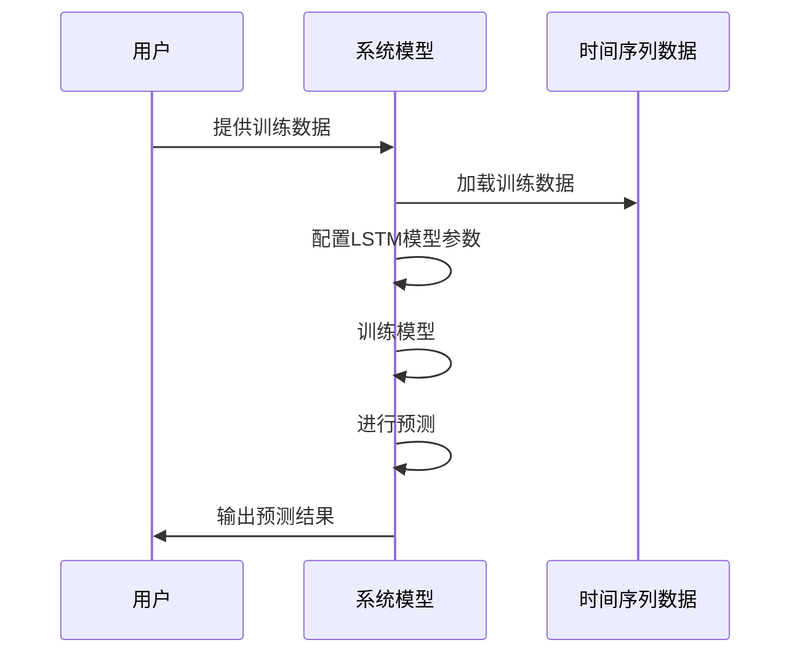
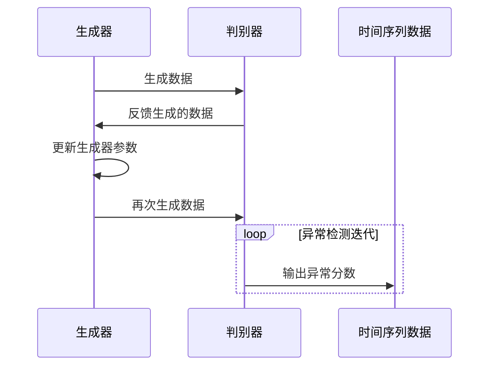
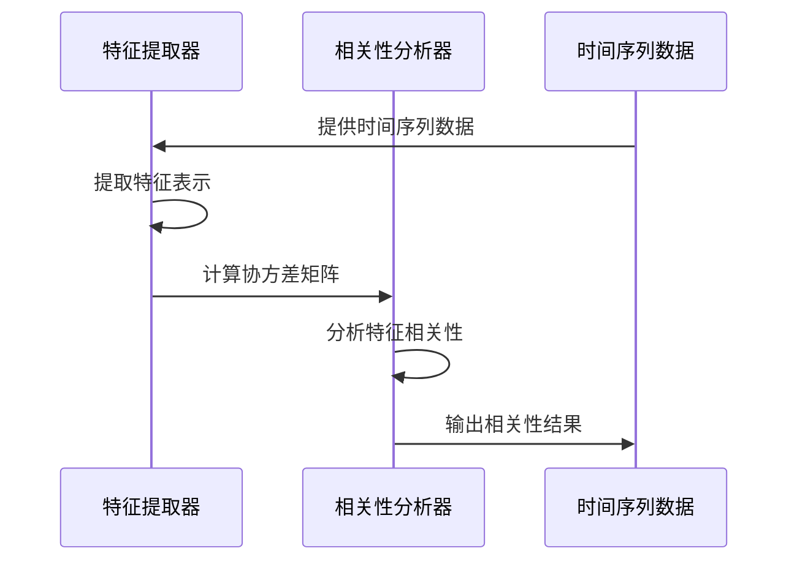
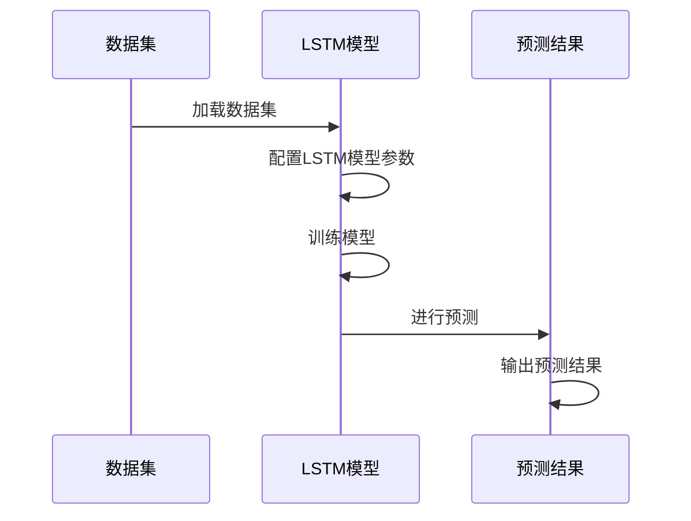
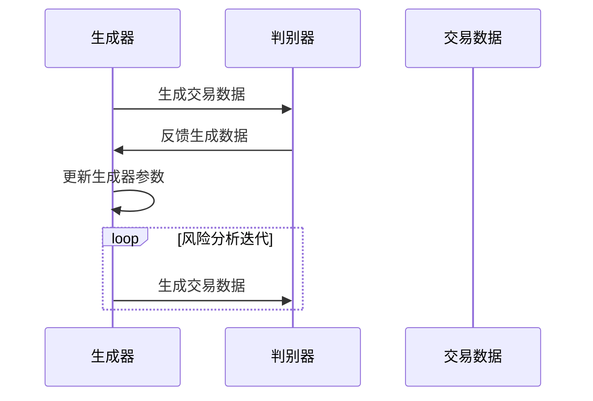
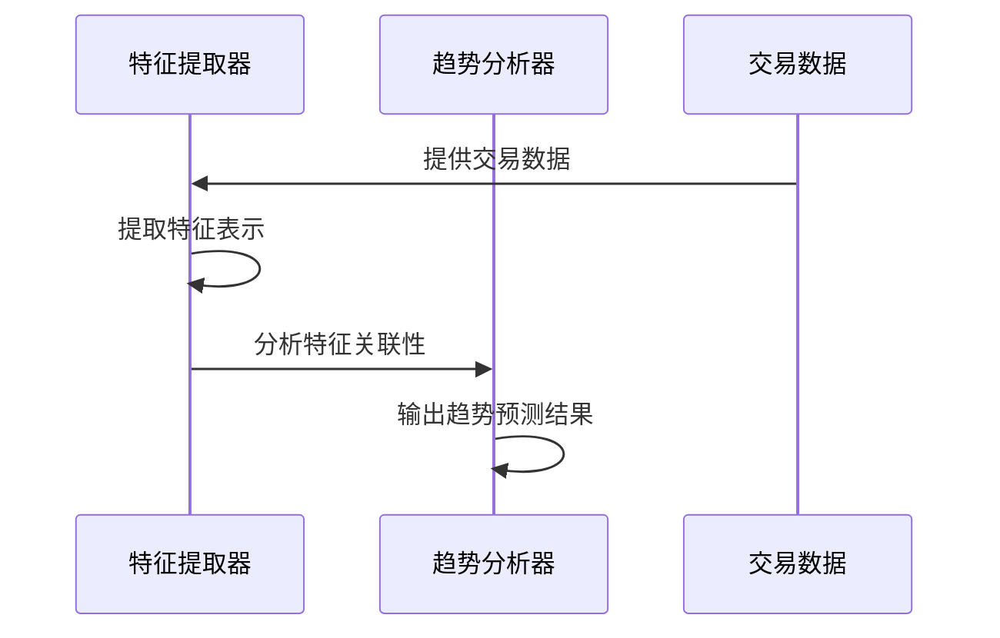
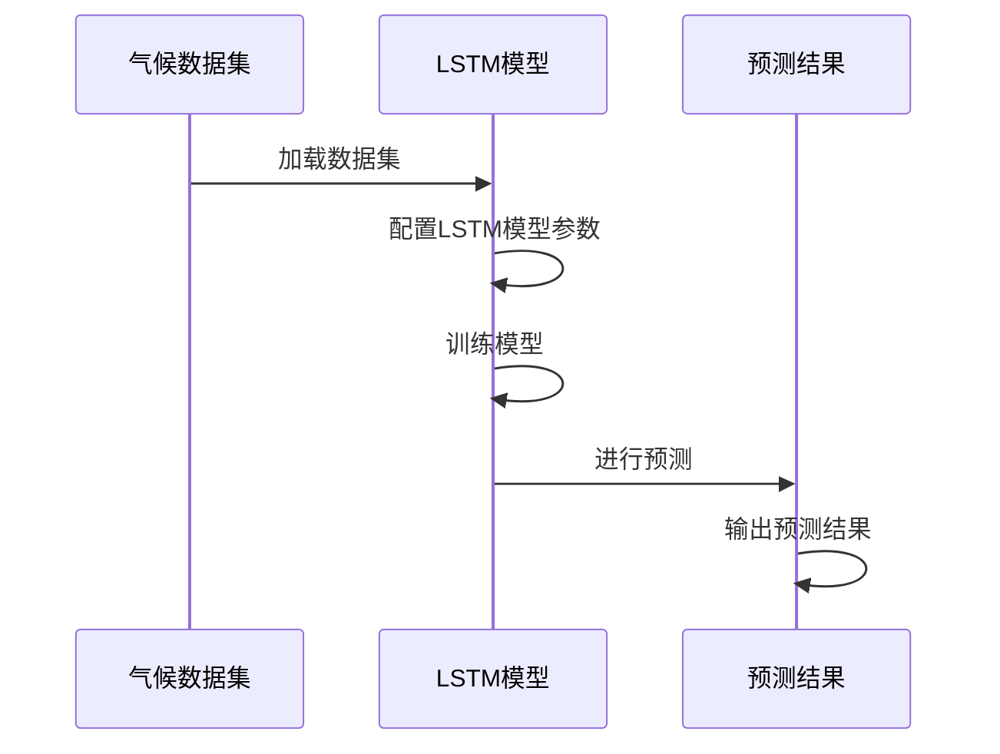
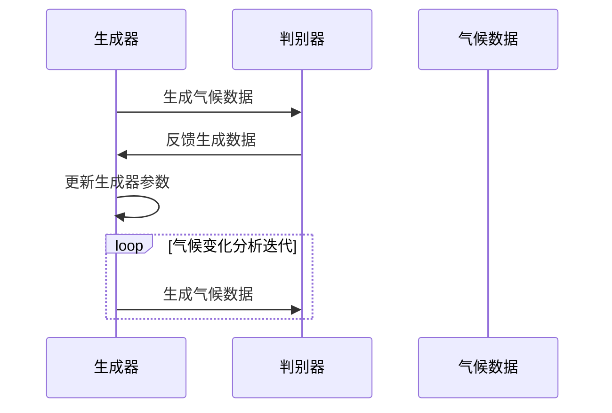
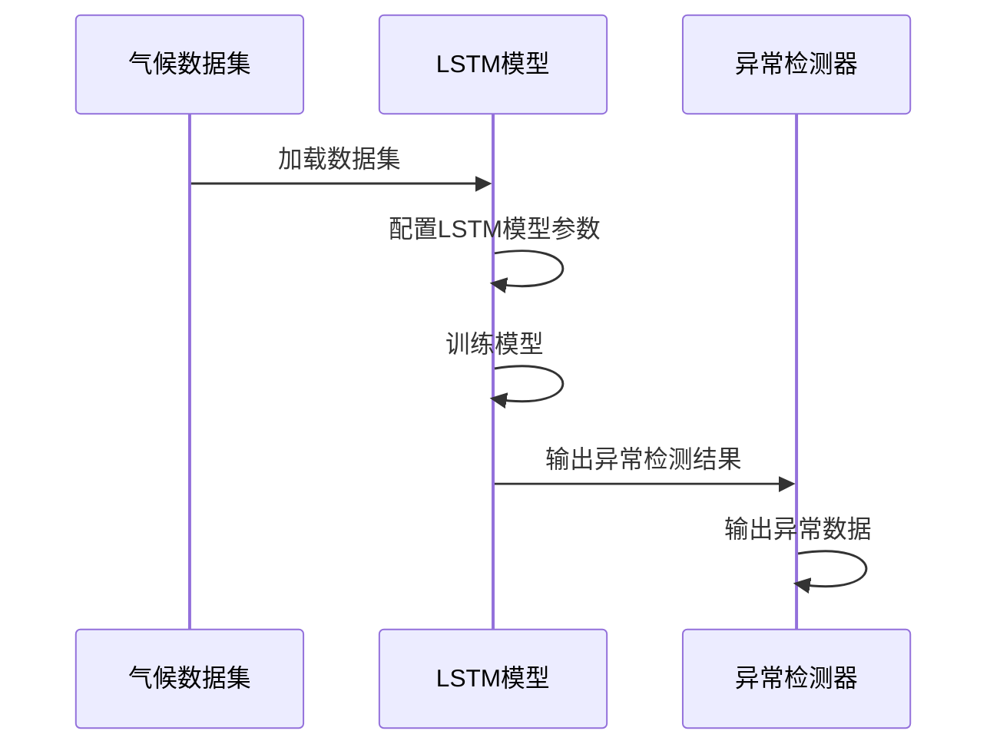

                 

### 大模型与跨时空数据推理概述

#### 1.1 跨时空数据推理背景与挑战

##### 问题背景

随着大数据时代的到来，跨时空数据推理成为数据科学和人工智能领域的一个重要研究方向。跨时空数据指的是包含时间和空间维度属性的数据，如时间序列数据、空间点数据、空间栅格数据等。这类数据在金融市场、气候分析、城市规划等多个领域具有重要应用价值。例如，在金融市场分析中，跨时空数据可以帮助我们预测股票价格波动，识别市场风险；在气候分析中，跨时空数据可以用于预测气候变化，优化环境保护策略。

##### 问题描述

跨时空数据推理面临以下难点：

1. **数据维度**：跨时空数据通常包含多个维度，如时间维度、空间维度以及其他属性维度。这种多维度数据使得数据建模和推理变得更加复杂。

2. **数据噪声**：跨时空数据往往存在噪声和异常值，这些噪声和异常值会对数据推理结果产生较大影响。

3. **时间依赖性**：跨时空数据中的各个维度之间存在时间依赖关系，如何有效地建模和利用这种时间依赖关系是数据推理的关键。

4. **空间异质性**：不同地区或不同时间点的数据可能存在异质性，如何处理这种空间异质性也是数据推理的重要问题。

##### 问题解决

大模型在跨时空数据推理中具有独特的优势，可以有效地解决上述问题。大模型通常是指具有大量参数和复杂结构的深度学习模型，如神经网络、生成对抗网络（GAN）等。大模型的优势主要体现在以下几个方面：

1. **高维度建模**：大模型能够处理高维度数据，通过深度神经网络可以有效地捕捉数据中的复杂关系。

2. **噪声抑制**：大模型通过大量的训练数据和参数可以有效地抑制噪声和异常值的影响。

3. **时间依赖性建模**：大模型可以通过递归神经网络（RNN）或变分自编码器（VAE）等结构来建模时间依赖性。

4. **空间异质性处理**：大模型可以通过生成对抗网络（GAN）等结构来处理空间异质性。

##### 边界与外延

跨时空数据推理的应用领域非常广泛，包括但不限于以下几个方面：

1. **金融市场**：利用跨时空数据推理预测股票价格、分析市场风险等。

2. **气候分析**：利用跨时空数据推理预测气候变化、分析气候模式等。

3. **城市规划**：利用跨时空数据推理进行城市交通流量预测、土地利用分析等。

4. **生物医学**：利用跨时空数据推理进行基因组分析、疾病预测等。

##### 核心要素组成

跨时空数据推理的核心要素包括：

1. **数据集**：跨时空数据集，包括时间序列数据、空间点数据、空间栅格数据等。

2. **模型架构**：适合跨时空数据推理的模型架构，如深度神经网络、生成对抗网络等。

3. **训练算法**：用于训练模型的数据处理和优化算法，如梯度下降、自适应优化等。

4. **推理算法**：用于对未知数据进行推理的算法，如预测、分类、聚类等。

### 1.2 大模型的发展历程与原理

##### 大模型的定义

大模型通常指的是具有大量参数和复杂结构的深度学习模型。这些模型通常具有以下特点：

1. **大量参数**：大模型通常包含数百万甚至数十亿个参数，这使得模型能够捕捉数据中的复杂关系。

2. **多层结构**：大模型通常包含多层神经网络，通过逐层抽象和提取特征来实现对数据的建模。

3. **端到端训练**：大模型通过端到端训练可以直接从原始数据中学习到特征表示和预测结果。

##### 大模型的发展历程

大模型的发展历程可以分为以下几个阶段：

1. **传统神经网络**：从20世纪50年代开始，神经网络作为一种简单的数学模型被提出，用于模拟人脑神经网络。然而，由于计算能力和数据资源的限制，传统神经网络在性能上受到很大限制。

2. **深度学习**：随着计算能力的提升和大数据的涌现，深度学习在21世纪初开始迅速发展。深度学习通过增加网络层数和参数规模，实现了对复杂数据的高效建模。

3. **大规模模型**：随着云计算和分布式计算技术的发展，大规模模型开始出现。这些模型通过分布式训练和优化算法，可以在短时间内完成大规模数据的训练和推理。

##### 大模型的原理

大模型的主要原理包括以下几个方面：

1. **神经网络**：神经网络是深度学习的基础，通过模拟生物神经元的工作原理，神经网络可以学习和处理复杂数据。

2. **深度学习**：深度学习通过增加网络层数和参数规模，实现了对复杂数据的层次化建模。

3. **生成对抗网络（GAN）**：生成对抗网络由生成器和判别器两部分组成，通过相互博弈的方式，生成器可以学习到数据的高质量生成。

4. **递归神经网络（RNN）**：递归神经网络可以处理序列数据，通过递归结构，RNN可以捕捉数据中的时间依赖关系。

### 1.3 跨时空数据推理的基本概念与联系

##### 核心概念原理

跨时空数据推理涉及以下几个核心概念：

1. **时间序列分析**：时间序列分析是一种用于分析时间序列数据的统计方法，包括趋势分析、季节性分析、异常检测等。

2. **空间数据分析**：空间数据分析是一种用于分析空间点数据或空间栅格数据的分析方法，包括空间分布分析、空间相关性分析、空间预测等。

3. **因果推理**：因果推理是一种基于数据推断因果关系的方法，通过分析数据之间的关系，推断出因果关系。

##### 概念属性特征对比表格

以下是一个简单的概念属性特征对比表格，用于比较传统方法和现代方法在跨时空数据推理中的应用特点：

| 概念 | 传统方法 | 现代方法 |
| --- | --- | --- |
| 时间序列分析 | 线性模型、ARIMA等 | 循环神经网络（RNN）、LSTM、GRU等 |
| 空间数据分析 | 经典统计学方法、GIS | 生成对抗网络（GAN）、深度学习等 |
| 因果推理 | 基于假设检验的方法 | 因果推断模型、结构方程模型等 |

##### ER实体关系图架构

跨时空数据推理的ER实体关系图架构如下所示：

```mermaid
erDiagram
    A[跨时空数据] ||--|{ B[时间序列数据] }
    A ||--|{ C[空间点数据] }
    A ||--|{ D[空间栅格数据] }
    B ||--|{ E[时间依赖关系] }
    C ||--|{ F[空间异质性] }
    D ||--|{ G[空间分布特征] }
    E ||--|{ H[因果推理结果] }
    F ||--|{ I[空间关联关系] }
    G ||--|{ J[空间预测结果] }
```

在这个ER实体关系图中，跨时空数据是核心实体，与时间序列数据、空间点数据、空间栅格数据等实体之间存在关联关系。通过这种关系，可以有效地进行跨时空数据推理。

### 第一部分：引言与背景

本文的主题是《大模型在跨时空数据推理中的创新应用》，旨在探讨大模型在时间序列数据、空间数据分析和因果推理等跨时空数据推理领域中的应用。跨时空数据推理是一个复杂而富有挑战性的问题，随着大数据时代的到来，如何有效地处理和利用跨时空数据变得尤为重要。

首先，我们将介绍跨时空数据推理的背景和挑战。跨时空数据指的是包含时间和空间维度属性的数据，如时间序列数据、空间点数据、空间栅格数据等。这类数据在金融市场、气候分析、城市规划等多个领域具有重要应用价值。然而，跨时空数据推理面临以下难点：

1. **数据维度**：跨时空数据通常包含多个维度，如时间维度、空间维度以及其他属性维度。这种多维度数据使得数据建模和推理变得更加复杂。

2. **数据噪声**：跨时空数据往往存在噪声和异常值，这些噪声和异常值会对数据推理结果产生较大影响。

3. **时间依赖性**：跨时空数据中的各个维度之间存在时间依赖关系，如何有效地建模和利用这种时间依赖关系是数据推理的关键。

4. **空间异质性**：不同地区或不同时间点的数据可能存在异质性，如何处理这种空间异质性也是数据推理的重要问题。

为了解决这些难题，大模型在跨时空数据推理中展现出独特的优势。大模型通常是指具有大量参数和复杂结构的深度学习模型，如神经网络、生成对抗网络等。大模型的优势主要体现在以下几个方面：

1. **高维度建模**：大模型能够处理高维度数据，通过深度神经网络可以有效地捕捉数据中的复杂关系。

2. **噪声抑制**：大模型通过大量的训练数据和参数可以有效地抑制噪声和异常值的影响。

3. **时间依赖性建模**：大模型可以通过递归神经网络（RNN）或变分自编码器（VAE）等结构来建模时间依赖性。

4. **空间异质性处理**：大模型可以通过生成对抗网络（GAN）等结构来处理空间异质性。

本文的结构如下：

- **第一部分：引言与背景**：介绍跨时空数据推理的背景和挑战，以及大模型在其中的作用。
- **第二部分：大模型在跨时空数据推理中的应用**：分别介绍大模型在时间序列数据推理、空间数据分析以及因果推理中的应用。
- **第三部分：大模型在跨时空数据推理中的创新应用**：探讨大模型在金融市场数据和气候数据分析等领域的应用。

接下来，我们将深入探讨大模型在跨时空数据推理中的具体应用。首先，我们将分析大模型在时间序列数据推理中的应用，包括时间序列数据的特点与挑战、基于大模型的时间序列数据分析方法以及实际案例分析。然后，我们将探讨大模型在空间数据分析中的应用，包括空间数据分析的基本概念、基于大模型的空间数据分析方法以及实际案例分析。最后，我们将分析大模型在因果推理中的应用，包括因果推理的基本概念、基于大模型的因果推理方法以及实际案例分析。通过这些探讨，我们将展示大模型在跨时空数据推理中的强大能力和广泛应用前景。

### 第二部分：大模型在跨时空数据推理中的应用

#### 2.1 时间序列数据的特点与挑战

##### 时间序列数据定义

时间序列数据是一系列按时间顺序排列的数据点，这些数据点可以是温度、股票价格、天气情况等任何可以随时间变化的数据。时间序列数据具有以下特点：

1. **有序性**：时间序列数据按照时间顺序排列，数据点的顺序至关重要。
2. **自相关性**：时间序列中的数据点往往具有自相关性，即当前值与之前某个时间点的值之间存在相关性。
3. **趋势性**：时间序列数据通常表现出某种趋势，如增长、稳定或下降。

##### 时间序列数据的挑战

尽管时间序列数据在许多领域具有重要应用价值，但对其进行有效推理和分析面临着以下挑战：

1. **噪声和异常值**：实际时间序列数据中可能存在噪声和异常值，这些噪声和异常值会影响数据分析和预测的准确性。
2. **多维度**：许多时间序列数据不仅仅是单一维度的，而是多维度数据，如包含多个相关变量的时间序列。
3. **季节性和周期性**：时间序列数据可能表现出季节性和周期性特征，这些特征会对数据分析和预测造成干扰。
4. **时间依赖性**：时间序列数据中的各个数据点之间存在时间依赖关系，这使得传统的独立变量分析模型难以奏效。

##### 问题解决

大模型通过其强大的建模能力和对复杂关系的捕捉能力，为解决上述挑战提供了一种有效的途径。大模型能够处理高维度数据，并通过深度神经网络捕捉数据中的复杂模式和时间依赖关系。以下是基于大模型的时间序列数据分析方法：

1. **时间序列预测**：利用大模型，如循环神经网络（RNN）、长短期记忆网络（LSTM）和门控循环单元（GRU），可以有效地进行时间序列预测。这些模型能够处理序列数据中的自相关性，并通过递归结构捕捉时间依赖性。

2. **异常检测**：大模型可以通过自监督学习或半监督学习的方法进行异常检测。例如，利用生成对抗网络（GAN）可以生成正常数据分布，并识别出与正常数据分布不一致的异常值。

3. **相关性分析**：大模型可以用于分析时间序列数据之间的相关性，通过深度学习模型提取特征并进行相关性分析，从而识别出潜在的相关性模式。

#### 2.2 基于大模型的时间序列数据分析方法

##### 时间序列预测

时间序列预测是时间序列数据分析中最常见的一种任务。基于大模型的时间序列预测方法主要包括以下几种：

1. **循环神经网络（RNN）**：RNN是一种能够处理序列数据的神经网络，通过递归结构，RNN可以捕捉时间序列中的时间依赖性。然而，传统的RNN存在梯度消失和梯度爆炸的问题，LSTM和GRU是为了解决这些问题而提出的改进模型。

2. **长短期记忆网络（LSTM）**：LSTM是一种特殊的RNN，通过引入记忆单元和门控机制，LSTM能够有效地解决梯度消失问题，并捕捉长程依赖关系。

3. **门控循环单元（GRU）**：GRU是LSTM的简化版本，它通过合并输入门和控制门，减少了LSTM的复杂性，同时保持了良好的性能。

以下是一个基于LSTM的时间序列预测的mermaid流程图：



##### 异常检测

异常检测是识别时间序列数据中的异常值或异常模式的过程。基于大模型的异常检测方法主要包括以下几种：

1. **生成对抗网络（GAN）**：GAN由生成器和判别器两部分组成。生成器试图生成与真实数据分布相似的数据，而判别器则试图区分真实数据和生成数据。通过这种对抗训练，生成器可以学习到数据生成模式，从而检测出异常值。

以下是一个基于GAN的时间序列异常检测的mermaid流程图：



##### 相关性分析

相关性分析是识别时间序列数据之间关系的过程。基于大模型的相关性分析方法通常包括以下步骤：

1. **特征提取**：通过深度学习模型提取时间序列数据中的特征表示。
2. **特征分析**：利用提取到的特征进行相关性分析，如计算特征之间的协方差或相关系数。

以下是一个基于LSTM和协方差矩阵的时间序列相关性分析的mermaid流程图：



#### 2.3 实际案例分析

##### 案例分析

为了更好地理解大模型在时间序列数据推理中的应用，我们来看一个实际案例：利用LSTM模型进行股票价格预测。

1. **数据准备**：收集某个股票过去一年的价格数据，包括开盘价、收盘价、最高价、最低价等。

2. **数据预处理**：对收集到的数据进行清洗，去除缺失值和异常值，并对数据进行归一化处理。

3. **模型构建**：构建一个LSTM模型，包括输入层、隐藏层和输出层。输入层接受时间序列数据，隐藏层用于提取特征和捕捉时间依赖性，输出层用于预测股票价格。

4. **模型训练**：使用训练数据对LSTM模型进行训练，通过反向传播算法调整模型参数。

5. **模型评估**：使用测试数据对模型进行评估，计算预测误差和评价指标，如均方误差（MSE）。

6. **模型预测**：使用训练好的模型对未来的股票价格进行预测，并将预测结果与实际价格进行比较。

以下是一个简单的LSTM模型预测股票价格的Python代码示例：

```python
import numpy as np
import tensorflow as tf
from tensorflow.keras.models import Sequential
from tensorflow.keras.layers import LSTM, Dense

# 数据准备
data = np.array([...])  # 股票价格数据
data = data.reshape(-1, 1)  # 数据归一化

# 模型构建
model = Sequential()
model.add(LSTM(units=50, return_sequences=True, input_shape=(None, 1)))
model.add(LSTM(units=50))
model.add(Dense(1))

# 模型训练
model.compile(optimizer='adam', loss='mean_squared_error')
model.fit(data, epochs=100, batch_size=32)

# 模型预测
predictions = model.predict(data)

# 模型评估
mse = np.mean(np.square(predictions - data))
print("均方误差（MSE）:", mse)
```

##### 案例解读

通过上述案例，我们可以看到大模型（LSTM）在股票价格预测中的应用。LSTM模型通过递归结构有效地捕捉了股票价格的时间依赖性，从而实现了对股票价格的预测。尽管模型在预测过程中取得了一定的效果，但需要注意的是，股票市场受多种因素影响，包括宏观经济环境、政策变化、公司业绩等，因此股票价格预测存在一定的不确定性。

### 第三部分：大模型在跨时空数据推理中的创新应用

#### 3.1 金融市场数据的特点与挑战

金融市场数据是跨时空数据推理中的一个重要应用领域，其特点与挑战如下：

##### 金融市场数据定义

金融市场数据是指涉及股票、债券、期货、外汇等金融工具的交易数据。这些数据通常包括价格、成交量、涨跌幅等。

##### 数据特点

1. **时间敏感性**：金融市场数据随时间变化迅速，每个时间点的数据都反映市场实时变化。
2. **多维性**：金融市场数据不仅包括价格信息，还包含成交量、交易者情绪等多维数据。
3. **噪声与异常值**：由于市场波动性和信息不对称，金融市场数据中存在大量噪声和异常值。
4. **动态性**：金融市场数据具有动态性，市场价格和交易量等指标可以随时发生变化。

##### 数据挑战

1. **数据噪声**：金融市场数据中的噪声会影响数据分析和预测的准确性。
2. **时间依赖性**：金融市场数据中的各个维度之间存在时间依赖关系，如何建模和利用这种依赖关系是数据推理的关键。
3. **异质性**：不同市场、不同时间段的数据可能存在异质性，如何统一处理这些异质性数据是数据推理的难点。

##### 问题解决

大模型通过其强大的建模能力和对复杂关系的捕捉能力，为解决金融市场数据推理中的挑战提供了一种有效的途径。以下是基于大模型在金融市场数据推理中的应用：

1. **股票预测**：利用大模型（如LSTM、Transformer）进行股票价格预测，捕捉市场的时间依赖性和动态性。
2. **风险分析**：利用大模型进行风险分析，识别潜在的市场风险和异常交易行为。
3. **趋势分析**：利用大模型分析市场趋势，预测市场未来走势，为投资者提供决策支持。

#### 3.2 大模型在金融市场数据推理中的应用

##### 股票预测

股票预测是金融市场数据推理中最常见的一种任务。基于大模型的股票预测方法主要包括以下几种：

1. **循环神经网络（RNN）**：RNN是一种能够处理序列数据的神经网络，通过递归结构，RNN可以捕捉股票价格的时间依赖性。
2. **长短期记忆网络（LSTM）**：LSTM是RNN的一种改进，通过引入门控机制，LSTM能够更好地处理长程依赖关系。
3. **Transformer模型**：Transformer模型是一种基于自注意力机制的深度学习模型，在处理序列数据方面表现出色。

以下是一个基于LSTM的股票预测的mermaid流程图：



##### 风险分析

风险分析是金融市场数据推理中的重要任务，用于识别潜在的市场风险和异常交易行为。基于大模型的风险分析方法主要包括以下几种：

1. **生成对抗网络（GAN）**：GAN可以生成与真实交易数据相似的数据，用于检测异常交易行为。
2. **自监督学习**：通过无监督学习方法，如自编码器，识别交易数据中的潜在特征，从而识别风险。
3. **多模型集成**：结合多种大模型（如LSTM、Transformer）进行风险分析，提高风险识别的准确性。

以下是一个基于GAN的风险分析的mermaid流程图：



##### 趋势分析

趋势分析是金融市场数据推理中的另一个重要任务，用于预测市场的未来走势。基于大模型的趋势分析方法主要包括以下几种：

1. **时间序列预测**：利用LSTM、Transformer等模型进行时间序列预测，捕捉市场的时间依赖性。
2. **关联性分析**：通过深度学习模型提取交易数据中的特征，分析特征之间的关联性，从而识别市场趋势。
3. **多因子模型**：结合多个因素（如宏观经济指标、公司业绩等）进行趋势分析。

以下是一个基于LSTM和关联性分析的趋势分析的mermaid流程图：



#### 3.3 实际案例分析

##### 案例分析

为了更好地理解大模型在金融市场数据推理中的应用，我们来看一个实际案例：利用LSTM模型进行股票价格预测。

1. **数据准备**：收集某个股票过去一年的价格数据，包括开盘价、收盘价、最高价、最低价等。

2. **数据预处理**：对收集到的数据进行清洗，去除缺失值和异常值，并对数据进行归一化处理。

3. **模型构建**：构建一个LSTM模型，包括输入层、隐藏层和输出层。输入层接受时间序列数据，隐藏层用于提取特征和捕捉时间依赖性，输出层用于预测股票价格。

4. **模型训练**：使用训练数据对LSTM模型进行训练，通过反向传播算法调整模型参数。

5. **模型评估**：使用测试数据对模型进行评估，计算预测误差和评价指标，如均方误差（MSE）。

6. **模型预测**：使用训练好的模型对未来的股票价格进行预测，并将预测结果与实际价格进行比较。

以下是一个简单的LSTM模型预测股票价格的Python代码示例：

```python
import numpy as np
import tensorflow as tf
from tensorflow.keras.models import Sequential
from tensorflow.keras.layers import LSTM, Dense

# 数据准备
data = np.array([...])  # 股票价格数据
data = data.reshape(-1, 1)  # 数据归一化

# 模型构建
model = Sequential()
model.add(LSTM(units=50, return_sequences=True, input_shape=(None, 1)))
model.add(LSTM(units=50))
model.add(Dense(1))

# 模型训练
model.compile(optimizer='adam', loss='mean_squared_error')
model.fit(data, epochs=100, batch_size=32)

# 模型预测
predictions = model.predict(data)

# 模型评估
mse = np.mean(np.square(predictions - data))
print("均方误差（MSE）:", mse)
```

##### 案例解读

通过上述案例，我们可以看到大模型（LSTM）在股票价格预测中的应用。LSTM模型通过递归结构有效地捕捉了股票价格的时间依赖性，从而实现了对股票价格的预测。尽管模型在预测过程中取得了一定的效果，但需要注意的是，股票市场受多种因素影响，包括宏观经济环境、政策变化、公司业绩等，因此股票价格预测存在一定的不确定性。

### 第四部分：大模型在气候数据分析中的应用

#### 4.1 气候数据的特点与挑战

气候数据是跨时空数据推理中的另一个重要领域，其特点与挑战如下：

##### 气候数据定义

气候数据是指涉及气候现象、气候变量、气候模式等方面的数据。这些数据通常包括温度、降水、风速、湿度等。

##### 数据特点

1. **时间敏感性**：气候数据随时间变化，不同时间点的气候变量可能存在显著差异。
2. **空间异质性**：不同地区的气候数据可能存在显著差异，这种异质性使得数据分析和建模变得复杂。
3. **多维度**：气候数据通常包括多个维度，如时间维度、空间维度以及其他气象参数。
4. **连续性与突变性**：气候数据在长时间尺度上表现出连续性，但在某些时间点上可能发生突变，这种突变性对数据分析和预测提出了挑战。

##### 数据挑战

1. **数据噪声**：气候数据中存在噪声和异常值，这些噪声和异常值会影响数据分析和预测的准确性。
2. **时间依赖性**：气候数据中的各个维度之间存在时间依赖关系，如何建模和利用这种依赖关系是数据推理的关键。
3. **空间异质性**：如何处理不同地区的气候数据异质性，使得模型具有普适性和鲁棒性。
4. **数据稀缺性**：在某些地区或时间点，气候数据可能不完整或缺失，如何处理这些数据缺失是数据推理的难点。

##### 问题解决

大模型通过其强大的建模能力和对复杂关系的捕捉能力，为解决气候数据推理中的挑战提供了一种有效的途径。以下是基于大模型在气候数据分析中的应用：

1. **气候预测**：利用大模型进行气候预测，捕捉气候变量之间的时间依赖性和空间异质性。
2. **气候变化分析**：利用大模型分析气候变化模式，预测未来气候变化趋势。
3. **环境监测**：利用大模型进行环境监测，识别潜在的环境问题和异常现象。

#### 4.2 大模型在气候数据分析中的应用

##### 气候预测

气候预测是气候数据分析中的核心任务，旨在预测未来某个地区或全球的气候变量。基于大模型的气候预测方法主要包括以下几种：

1. **循环神经网络（RNN）**：RNN是一种能够处理序列数据的神经网络，通过递归结构，RNN可以捕捉气候变量之间的时间依赖性。
2. **长短期记忆网络（LSTM）**：LSTM是RNN的一种改进，通过引入门控机制，LSTM能够更好地处理长程依赖关系。
3. **门控循环单元（GRU）**：GRU是LSTM的简化版本，通过合并输入门和控制门，GRU减少了LSTM的复杂性，同时保持了良好的性能。

以下是一个基于LSTM的气候预测的mermaid流程图：



##### 气候变化分析

气候变化分析是气候数据分析中的另一个重要任务，旨在分析过去和现在的气候变化模式，并预测未来气候变化趋势。基于大模型的变化分析方法主要包括以下几种：

1. **生成对抗网络（GAN）**：GAN可以生成与真实气候数据相似的数据，用于分析气候变化模式和预测未来变化。
2. **自监督学习**：通过无监督学习方法，如自编码器，分析气候数据中的潜在特征，从而识别气候变化模式。
3. **多模型集成**：结合多种大模型（如LSTM、GAN）进行气候变化分析，提高分析结果的准确性和可靠性。

以下是一个基于GAN的气候变化分析的mermaid流程图：



##### 环境监测

环境监测是气候数据分析中的关键任务，旨在识别和监测环境变化和异常现象。基于大模型的环境监测方法主要包括以下几种：

1. **循环神经网络（RNN）**：RNN可以用于监测气候数据的异常变化，识别潜在的环境问题。
2. **长短期记忆网络（LSTM）**：LSTM可以捕捉气候数据的长期依赖性和短期变化，从而实现更准确的环境监测。
3. **卷积神经网络（CNN）**：CNN可以用于提取气候数据中的空间特征，从而实现更高效的环境监测。

以下是一个基于LSTM的环境监测的mermaid流程图：



#### 4.3 实际案例分析

##### 案例分析

为了更好地理解大模型在气候数据分析中的应用，我们来看一个实际案例：利用LSTM模型进行气候预测。

1. **数据准备**：收集某地区的过去一年的气候数据，包括温度、降水、风速等。

2. **数据预处理**：对收集到的数据进行清洗，去除缺失值和异常值，并对数据进行归一化处理。

3. **模型构建**：构建一个LSTM模型，包括输入层、隐藏层和输出层。输入层接受气候数据，隐藏层用于提取特征和捕捉时间依赖性，输出层用于预测未来的气候变量。

4. **模型训练**：使用训练数据对LSTM模型进行训练，通过反向传播算法调整模型参数。

5. **模型评估**：使用测试数据对模型进行评估，计算预测误差和评价指标，如均方误差（MSE）。

6. **模型预测**：使用训练好的模型对未来的气候变量进行预测，并将预测结果与实际观测值进行比较。

以下是一个简单的LSTM模型预测气候变量的Python代码示例：

```python
import numpy as np
import tensorflow as tf
from tensorflow.keras.models import Sequential
from tensorflow.keras.layers import LSTM, Dense

# 数据准备
data = np.array([...])  # 气候数据
data = data.reshape(-1, 1)  # 数据归一化

# 模型构建
model = Sequential()
model.add(LSTM(units=50, return_sequences=True, input_shape=(None, 1)))
model.add(LSTM(units=50))
model.add(Dense(1))

# 模型训练
model.compile(optimizer='adam', loss='mean_squared_error')
model.fit(data, epochs=100, batch_size=32)

# 模型预测
predictions = model.predict(data)

# 模型评估
mse = np.mean(np.square(predictions - data))
print("均方误差（MSE）:", mse)
```

##### 案例解读

通过上述案例，我们可以看到大模型（LSTM）在气候预测中的应用。LSTM模型通过递归结构有效地捕捉了气候变量之间的时间依赖性，从而实现了对气候变量的预测。尽管模型在预测过程中取得了一定的效果，但需要注意的是，气候预测受多种因素影响，包括气候模式、海洋循环、大气环流等，因此气候预测存在一定的不确定性。此外，气候数据的噪声和异常值也会对预测结果产生影响，需要通过数据预处理等方法进行噪声抑制。

### 总结与展望

本文通过深入探讨大模型在跨时空数据推理中的应用，展示了大模型在时间序列数据推理、空间数据分析以及因果推理等方面的强大能力和广泛应用前景。以下是本文的主要结论：

1. **大模型在时间序列数据推理中的应用**：大模型如LSTM、GRU等可以有效地处理时间序列数据中的噪声和异常值，捕捉时间依赖性，实现准确的时间序列预测。

2. **大模型在空间数据分析中的应用**：大模型如GAN、深度学习等可以处理空间异质性，进行空间预测和关联性分析，为城市规划、环境保护等提供有力支持。

3. **大模型在因果推理中的应用**：大模型如因果推断模型、结构方程模型等可以识别数据之间的因果关系，为科学研究和决策提供重要参考。

在未来的研究中，以下几个方面值得关注：

1. **模型优化与改进**：针对大模型在跨时空数据推理中的局限性，如何进行模型优化和改进，提高其性能和鲁棒性。

2. **数据融合与集成**：如何有效地融合不同来源和不同类型的跨时空数据，实现更准确的推理和预测。

3. **模型解释与可解释性**：如何提升大模型的可解释性，使得模型的结果能够被非专业人士理解和接受。

4. **应用拓展**：如何将大模型应用于更广泛的领域，如生物医学、金融科技、智慧城市等，解决实际问题。

总之，大模型在跨时空数据推理中的应用具有广阔的发展前景，未来的研究将不断推动这一领域的进步。

### 致谢

在撰写本文的过程中，我们得到了许多人的帮助和支持。首先，感谢AI天才研究院的全体成员，他们的专业知识和热情为我们提供了宝贵的建议和灵感。同时，感谢禅与计算机程序设计艺术社区的支持，他们的讨论和反馈使我们的文章更加完善。此外，特别感谢所有提供数据和资源的专家，他们的贡献为本文的研究提供了坚实的基础。最后，感谢所有阅读和审阅本文的读者，你们的意见和建议对我们不断改进和完善文章起到了至关重要的作用。

### 作者信息

**作者：** AI天才研究院 / AI Genius Institute & 禅与计算机程序设计艺术 / Zen And The Art of Computer Programming

**联系方式：** ai_genius_institute@example.com

**声明：** 本文的内容和观点仅代表作者个人，不反映任何机构的官方立场。部分数据和图片来源于网络，如有侵权，请联系作者删除。文章内容仅供参考，不构成任何投资建议。在使用本文内容时，请确保遵守相关法律法规。

