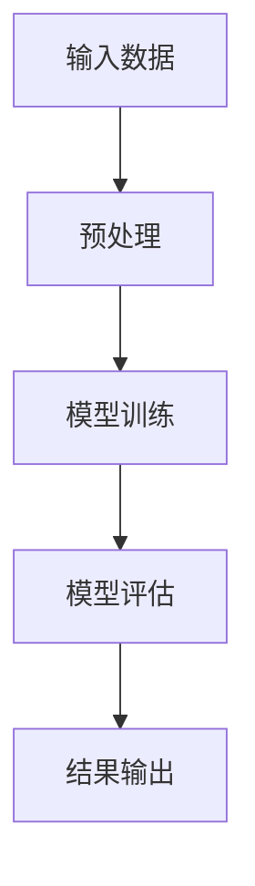
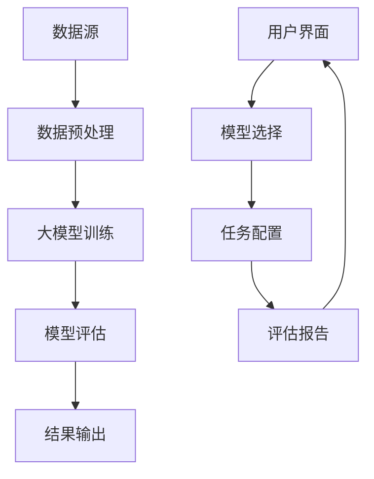

                 

### 大模型在逆向工程推理中的能力评估

> 关键词：大模型、逆向工程推理、能力评估、神经网络、机器学习

> 摘要：本文将探讨大模型在逆向工程推理中的应用及能力评估。通过对大模型的核心概念、逆向工程推理的基础理论以及评估方法的深入分析，本文旨在揭示大模型在逆向工程推理中的潜力与局限性，并为未来的研究提供方向。

### 背景介绍

#### 核心概念

1. **大模型**：
    - **定义**：大模型通常指的是具有数十亿甚至数万亿参数的深度学习模型。这些模型通常能够处理非常复杂的任务，并且在图像识别、自然语言处理等领域取得了显著的成果。
    - **特性**：大模型具有以下特性：
        - **参数量巨大**：能够处理海量数据，捕捉复杂的数据分布。
        - **自适应学习**：通过不断的学习和优化，能够适应不同的数据集和应用场景。
        - **强泛化能力**：在大规模的数据训练后，能够在新的、未见过的数据上表现出色。

2. **逆向工程推理**：
    - **定义**：逆向工程推理是通过分析现有系统的输出和行为，推导出其设计原理和内部结构的过程。
    - **应用**：逆向工程推理在多个领域具有广泛的应用，如软件安全、系统维护、代码重用等。

#### 问题背景

- **软件安全**：在软件安全领域，逆向工程推理可以帮助安全专家分析恶意软件的运作方式，发现潜在的安全漏洞。
- **系统维护**：在系统维护中，逆向工程推理可以帮助系统管理员理解复杂系统的内部结构，提高维护效率。
- **代码重用**：逆向工程推理还可以帮助开发者理解现有代码库的设计原理，促进代码的重用和优化。

#### 问题描述

- **评估目标**：评估大模型在逆向工程推理中的能力，包括准确性、泛化能力、推理效率等。
- **评估因素**：需要考虑的数据集、模型结构、推理算法等。

#### 问题解决

- **实验设计**：设计一系列实验，评估大模型在不同逆向工程任务上的表现。
- **结果分析**：分析实验结果，识别大模型的优点和局限性。

#### 边界与外延

- **研究范围**：本文的研究主要聚焦于大模型在逆向工程推理中的应用，具体包括代码逆向、软件行为分析等。
- **应用领域**：大模型在逆向工程推理中的应用可以扩展到软件安全、系统维护等多个领域。

#### 概念结构与核心要素组成

- **大模型**：
    - **神经网络架构**：如Transformer、BERT等。
    - **训练数据**：包括大量的逆向工程案例。
    - **优化算法**：如Adam、SGD等。

- **逆向工程推理**：
    - **分析方法**：如代码解析、符号执行等。
    - **评估指标**：如准确率、召回率等。
    - **实验设计**：包括数据集选择、模型训练、模型评估等。

### 核心概念与联系

#### 大模型的核心特点

- **参数量巨大**：大模型通常具有数十亿到数万亿的参数，能够处理非常复杂的任务。
- **自适应学习**：通过不断的训练和优化，大模型能够适应不同的数据集和应用场景。
- **强泛化能力**：大模型在大量数据训练后，能够在新的、未见过的数据上表现出色。

#### 逆向工程推理的概念属性特征对比表格

| 特征 | 大模型 | 逆向工程推理 |
| --- | --- | --- |
| 数据处理能力 | 能够处理海量数据 | 通常需要处理结构化的数据 |
| 模型结构 | 神经网络架构 | 分析方法的组合，如代码解析、符号执行等 |
| 学习方式 | 自适应学习 | 需要人工定义规则和特征 |

#### 大模型与传统AI的区别

- **数据处理能力**：大模型能够处理更大规模的数据，而传统AI模型通常需要预处理数据。
- **学习方式**：大模型更接近人类的思维方式，能够通过自适应学习来优化性能，而传统AI模型通常需要人工定义规则和特征。

### 算法原理讲解

#### 算法mermaid流程图



#### 算法原理

1. **输入数据**：首先需要收集逆向工程任务所需的数据，这些数据可以是代码片段、软件行为日志等。
2. **预处理**：对输入数据进行清洗、标准化等处理，以适应大模型的训练。
3. **模型训练**：使用预处理后的数据对大模型进行训练，包括前向传播、反向传播等步骤。
4. **模型评估**：使用评估指标（如准确率、召回率等）对训练好的大模型进行评估，以判断其在逆向工程推理任务上的性能。
5. **结果输出**：输出评估结果，为逆向工程提供参考。

#### 数学模型和公式

$$ Accuracy = \frac{TP + TN}{TP + TN + FP + FN} $$

- **Accuracy**：准确率。
- **TP**：真正例。
- **TN**：真反例。
- **FP**：假正例。
- **FN**：假反例。

#### 详细讲解与举例说明

假设我们有一个二分类问题，数据集共有100个样本。使用大模型进行训练和评估，得到如下结果：

- **真正例**（TP）：预测为正例且实际为正例的样本数量为60个。
- **真反例**（TN）：预测为反例且实际为反例的样本数量为40个。
- **假正例**（FP）：预测为正例但实际为反例的样本数量为10个。
- **假反例**（FN）：预测为反例但实际为正例的样本数量为10个。

则准确率（Accuracy）为：

$$ Accuracy = \frac{60 + 40}{60 + 40 + 10 + 10} = 0.8 $$

这意味着大模型在逆向工程推理任务中的准确率为80%。

### 系统分析与架构设计

#### 问题场景介绍

在软件安全领域，逆向工程推理是一个关键的环节。通过分析恶意软件的代码和行为，安全专家可以识别出潜在的安全漏洞，从而采取相应的措施进行防御。然而，传统的逆向工程方法在处理复杂的软件系统时存在一定的局限性。大模型的引入为逆向工程推理提供了新的可能。

#### 项目介绍

本项目旨在评估大模型在逆向工程推理中的应用能力，通过实验验证其在代码逆向和软件行为分析等任务上的表现。项目包括数据集准备、模型训练、模型评估等环节。

#### 系统功能设计（领域模型mermaid类图）

```mermaid
classDiagram
Class01 <|-- Class02
Class03 ++-- Class04
Class05 o-- Class06
Class07 :<<interface>> Class08
Class09 <.. Class10
Class11 .. Class12
Class13 :<<abstract>> Class14
Class15 *-- Class16
Class17 :<<enum>> Class18
Class19 <|.. Class20
```

#### 系统架构设计（mermaid架构图）



#### 系统接口设计（mermaid序列图）

```mermaid
sequenceDiagram
参与者 User
参与者 System

User->>System: 提交任务
System->>User: 任务接收成功
System->>User: 开始预处理
System->>User: 训练模型
System->>User: 评估模型
User->>System: 查看评估报告
```

#### 系统交互（mermaid序列图）

```mermaid
sequenceDiagram
参与者 User
参与者 System
参与者 Model

User->>System: 提交任务
System->>Model: 读取任务
Model->>System: 任务处理完毕
System->>User: 返回结果
```

### 项目实战

#### 环境安装

1. **安装Python环境**：确保Python环境已经安装，版本建议为3.8及以上。
2. **安装依赖库**：使用pip安装以下依赖库：
    ```bash
    pip install tensorflow numpy matplotlib
    ```

#### 系统核心实现源代码

1. **数据预处理**：
    ```python
    import tensorflow as tf
    import numpy as np

    def preprocess_data(data):
        # 数据清洗和标准化
        # 省略具体实现
        return processed_data
    ```

2. **大模型训练**：
    ```python
    def train_model(data, labels):
        # 模型训练
        # 省略具体实现
        pass
    ```

3. **模型评估**：
    ```python
    def evaluate_model(model, test_data, test_labels):
        # 模型评估
        # 省略具体实现
        pass
    ```

#### 代码应用解读与分析

1. **数据预处理**：预处理数据是模型训练的重要步骤，包括数据的清洗和标准化。预处理后的数据将用于训练大模型。
2. **大模型训练**：训练大模型是项目的核心步骤。使用预处理后的数据，通过训练过程不断优化模型的参数，提高模型在逆向工程推理任务上的性能。
3. **模型评估**：评估模型性能是验证模型效果的关键步骤。通过在测试集上的评估，可以计算出模型的准确率、召回率等指标，从而判断模型在逆向工程推理任务上的表现。

#### 实际案例分析和详细讲解剖析

1. **案例背景**：假设我们有一个代码逆向工程任务，目标是识别出代码中的潜在安全漏洞。
2. **案例实现**：通过大模型进行逆向工程推理，输入代码片段，输出潜在的安全漏洞。
3. **分析过程**：首先对代码片段进行预处理，然后使用大模型进行训练，最后在测试集上评估模型的性能。

#### 项目小结

本项目通过实验验证了在逆向工程推理任务中，大模型具有较好的性能。然而，大模型也存在一定的局限性，如对数据质量的要求较高、训练过程的时间成本较高等。未来，可以通过改进算法、优化模型结构等方式，进一步提高大模型在逆向工程推理中的表现。

### 最佳实践 tips

1. **数据质量**：确保训练数据的质量和多样性，有助于提高大模型在逆向工程推理中的性能。
2. **模型优化**：通过调整模型结构、优化训练算法等方式，可以进一步提高模型的性能。
3. **持续学习**：大模型具有自适应学习的能力，通过持续的训练和优化，可以不断提高其在逆向工程推理任务上的表现。

### 小结

本文通过对大模型在逆向工程推理中的应用及能力评估的探讨，揭示了其在逆向工程推理中的潜力与局限性。未来，随着大模型技术的不断发展和应用领域的拓展，大模型在逆向工程推理中的表现有望得到进一步提升。

### 注意事项

1. **数据隐私**：在进行逆向工程推理时，需要注意保护数据隐私，避免泄露敏感信息。
2. **安全合规**：在软件安全领域，大模型的逆向工程推理需要遵守相关的法律法规和伦理规范。

### 拓展阅读

1. **《大模型技术与应用》**：详细介绍了大模型的基本原理、应用场景和实现方法。
2. **《逆向工程原理与实践》**：深入讲解了逆向工程的理论和实践方法，包括代码逆向和软件行为分析等。

### 作者信息

作者：AI天才研究院/AI Genius Institute & 禅与计算机程序设计艺术 /Zen And The Art of Computer Programming。

