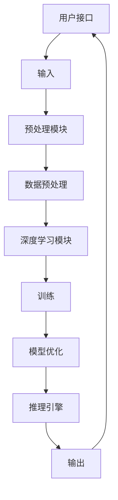

                 

**# 大模型在逆向工程推理中的能力边界探索与突破**

> **关键词：大模型、逆向工程、推理、能力边界、算法、数学模型、系统架构**

> **摘要：本文深入探讨了大规模预训练模型在逆向工程推理中的应用，分析其能力边界，并通过实例展示了其突破和应用前景。**

----------------------------------------------------------------

## **一、背景介绍**

### **1.1 逆向工程的基本概念**

逆向工程（Revers Engineering）是指通过对已有系统、软件或硬件的分析，重构其设计和实现，以理解其工作原理、功能和结构。它起源于硬件制造，随着计算机软件的发展，逐渐成为软件工程中一个重要的分支。

**问题背景**：随着软件系统复杂度的不断增加，理解现有系统的工作原理和结构变得尤为重要。然而，原始设计文档的缺失或不足，使得直接理解和重构系统变得困难。逆向工程提供了一种有效的方法，通过分析现有系统，重建其设计和实现。

**问题描述**：逆向工程面临的主要问题是复杂性、异构性和不确定性。如何高效地分析复杂系统，提取其关键信息，重建系统结构，是逆向工程领域亟待解决的问题。

**问题解决**：传统的逆向工程方法主要依赖于手动分析，效率较低，难以应对大规模复杂系统的挑战。随着人工智能技术的发展，特别是大模型的兴起，利用其强大的推理和学习能力，可以大幅提升逆向工程的效果和效率。

**边界与外延**：逆向工程的边界在于其对现有系统的理解深度和重构能力。外延包括对系统功能、性能、安全性等方面的改进和优化。

### **1.2 推理在逆向工程中的应用**

推理（Reasoning）是人工智能的核心任务之一，通过逻辑推断和决策，从已知信息中得出新的结论。在逆向工程中，推理技术被广泛应用于系统的分析和理解。

**核心概念术语说明**：

- **静态分析**：通过对代码或系统结构进行静态分析，提取其功能和行为。
- **动态分析**：通过运行系统，观察其行为和输出，推断其内部结构和逻辑。
- **代码补全**：利用机器学习技术，根据部分代码推断出完整的代码实现。
- **漏洞分析**：通过模式识别和自动推理，发现系统中的潜在漏洞和安全问题。

**概念结构与核心要素组成**：

- **逆向工程流程**：包括系统分析、代码提取、功能理解、结构重构等步骤。
- **推理方法**：包括基于规则推理、机器学习推理、逻辑推理等。
- **工具与技术**：如静态分析工具、动态分析工具、机器学习模型等。

### **1.3 大模型在逆向工程推理中的重要性**

大模型（Large-scale Pre-trained Models）是指通过大规模数据集训练得到的复杂神经网络模型，具有强大的学习和推理能力。其在逆向工程推理中的应用，有望突破传统方法的限制，提升逆向工程的效率和质量。

**核心概念与联系**：

- **大模型特点**：具有大规模参数、强泛化能力和高推理效率。
- **逆向工程需求**：需要高效地处理复杂系统和大量数据，快速理解系统结构和功能。
- **大模型与逆向工程的关系**：大模型可以通过学习和推理，自动提取和分析系统信息，辅助逆向工程师进行系统重构。

**大模型的基本原理与架构**：

- **预训练**：通过在大规模数据集上进行预训练，模型学会了通用知识和语言理解能力。
- **微调**：在特定任务上进行微调，使其适应特定领域的需求。
- **推理**：利用预训练得到的模型，对未知系统进行推理和分析。

----------------------------------------------------------------

## **二、核心概念与联系**

### **2.1 大模型的定义与特征**

大模型是指具有大规模参数和网络深度的神经网络模型。它们通过在大量数据集上进行训练，学会了对复杂数据的理解和生成能力。大模型的主要特征包括：

1. **大规模参数**：大模型的参数数量通常在亿级以上，这使得它们能够捕捉到数据中的细微特征。
2. **深度神经网络**：大模型通常采用多层神经网络结构，能够处理复杂的数据和处理任务。
3. **强泛化能力**：通过在大量数据上的预训练，大模型具有较好的泛化能力，能够应用于不同的任务和数据集。
4. **高推理效率**：大模型利用高效的算法和并行计算技术，能够在短时间内完成复杂的推理任务。

### **2.2 大模型与逆向工程的联系**

大模型在逆向工程中的应用，主要是利用其强大的推理和学习能力，对复杂系统进行自动分析和理解。这种联系体现在以下几个方面：

1. **代码补全**：大模型可以通过对部分代码的输入，自动生成完整的代码实现，帮助工程师快速理解系统的功能。
2. **漏洞分析**：大模型可以利用其模式识别能力，发现系统中的潜在漏洞和安全问题，提供改进建议。
3. **功能理解**：大模型可以通过对系统运行时数据的分析，推断出系统的功能和行为，帮助工程师重构系统结构。
4. **知识图谱构建**：大模型可以自动构建系统的知识图谱，将系统的各个组件和功能关系可视化，便于工程师理解。

### **2.3 大模型的基本原理与架构**

大模型的基本原理是基于深度学习和神经网络，通过多层神经元的非线性组合，对输入数据进行特征提取和表示。其架构通常包括以下几个部分：

1. **输入层**：接收外部输入数据，如文本、图像、声音等。
2. **隐藏层**：通过多层神经网络结构，对输入数据进行特征提取和变换。
3. **输出层**：根据隐藏层的输出，生成预测结果或输出数据。
4. **参数调整**：通过反向传播算法，不断调整模型参数，以优化模型性能。

大模型的训练过程通常包括以下步骤：

1. **数据预处理**：对输入数据进行预处理，如文本分词、图像缩放等。
2. **模型初始化**：初始化模型参数，通常使用随机初始化方法。
3. **预训练**：在大量无标签数据上进行预训练，使模型学会通用特征表示。
4. **微调**：在特定任务数据上进行微调，使模型适应特定任务需求。
5. **推理**：利用训练好的模型，对未知数据或系统进行推理和分析。

----------------------------------------------------------------

## **三、算法原理讲解**

### **3.1 大模型在逆向工程推理中的工作原理**

大模型在逆向工程推理中的工作原理主要基于其强大的学习和推理能力。以下是详细的算法原理：

1. **输入处理**：逆向工程推理通常需要对系统代码、日志、配置文件等进行输入处理。大模型首先会对这些输入数据进行预处理，如分词、词向量化等，将其转换为模型可以理解的格式。

2. **特征提取**：通过多层神经网络，大模型会对输入数据中的特征进行提取和表示。这些特征包括代码中的函数、变量、类等结构信息，以及运行时系统的行为和状态。

3. **推理过程**：大模型利用提取到的特征，通过深度学习算法进行推理。在推理过程中，模型会自动生成系统的抽象表示，如类图、时序图等，帮助工程师理解系统结构和功能。

4. **输出结果**：推理结果包括系统功能描述、漏洞分析报告、优化建议等。这些结果可以帮助工程师快速定位问题，进行系统重构和优化。

### **3.2 大模型在逆向工程推理中的优势与挑战**

**优势**：

1. **高效性**：大模型具有高效的推理能力，可以快速处理大量数据，提高逆向工程效率。
2. **准确性**：通过大规模数据训练，大模型具有很高的准确性，能够准确识别和理解系统中的各种信息和模式。
3. **泛化能力**：大模型具有较强的泛化能力，可以应用于不同领域和任务，降低对特定领域的依赖。

**挑战**：

1. **计算资源**：大模型的训练和推理需要大量的计算资源和时间，对硬件性能和资源管理提出了较高要求。
2. **数据依赖**：大模型的表现依赖于训练数据的质量和数量，如果数据质量较差或数据量不足，模型性能可能会受到影响。
3. **解释性**：大模型通常具有高复杂度，其内部决策过程难以解释，这给模型的应用和解释带来了一定的挑战。

### **3.3 大模型在逆向工程推理中的能力边界**

大模型在逆向工程推理中的能力边界主要包括以下几个方面：

1. **复杂度**：大模型在处理复杂系统时，可能会出现性能下降或错误推理，需要优化模型结构和算法。
2. **异构性**：大模型在面对异构系统时，可能需要特定的处理方法来适应不同组件和模块的多样性。
3. **不确定性**：大模型在处理不确定性问题时，可能需要引入不确定性推理方法，如贝叶斯网络、概率图模型等，以提高推理的准确性和可靠性。

## **3.4 大模型在逆向工程推理中的应用实例**

下面以一个实际的逆向工程推理应用为例，展示大模型的工作过程：

**实例背景**：一个复杂的分布式系统，包含多个组件和模块，工程师需要快速理解系统结构，定位潜在问题。

**解决方案**：

1. **输入处理**：将系统代码、配置文件、日志等数据输入大模型，进行预处理和特征提取。
2. **特征提取**：利用多层神经网络，对输入数据进行特征提取，生成系统组件和模块的抽象表示。
3. **推理过程**：大模型利用提取到的特征，进行推理，生成系统结构图、时序图等可视化结果。
4. **输出结果**：推理结果包括系统组件的依赖关系、数据流图、潜在问题等，帮助工程师快速理解系统。

通过以上实例，可以看出大模型在逆向工程推理中具有强大的能力和广阔的应用前景。

----------------------------------------------------------------

## **四、数学模型和数学公式详细讲解**

### **4.1 逆向工程推理的数学模型**

在逆向工程推理中，大模型的数学模型通常基于深度学习和神经网络。以下是一个简化的数学模型，用于描述大模型在逆向工程推理中的工作原理：

$$
\text{Output} = f(\text{Input}, \theta)
$$

其中，$f$ 表示神经网络的非线性变换，$\theta$ 表示模型的参数，$\text{Input}$ 表示输入数据，$\text{Output}$ 表示输出结果。

**主要组成部分**：

1. **输入层**：接收外部输入数据，如文本、图像等，这些数据经过预处理后，被转化为向量表示。
2. **隐藏层**：通过多层神经网络结构，对输入数据进行特征提取和变换。每一层的输出都是前一层输入的非线性变换。
3. **输出层**：根据隐藏层的输出，生成预测结果或输出数据。

**数学模型解析**：

1. **激活函数**：常用的激活函数包括 sigmoid、ReLU、Tanh 等。激活函数用于引入非线性，使得模型能够学习复杂函数。
2. **权重和偏置**：模型参数包括权重（weights）和偏置（biases），它们通过矩阵乘法和加法操作，实现输入到输出的映射。
3. **反向传播**：通过反向传播算法，模型可以根据输出误差，更新权重和偏置，优化模型性能。

### **4.2 大模型在逆向工程推理中的数学公式**

大模型在逆向工程推理中的数学公式主要涉及深度学习和神经网络的基本概念。以下是一个简化的公式，用于描述大模型在逆向工程推理中的过程：

$$
\begin{aligned}
\text{Input} &= \text{Preprocess}(\text{Data}) \\
\text{Hidden}_{l} &= \text{激活函数}(\text{权重}_{l-1} \cdot \text{Input} + \text{偏置}_{l-1}) \\
\text{Output} &= \text{激活函数}(\text{权重}_{L} \cdot \text{Hidden}_{L-1} + \text{偏置}_{L})
\end{aligned}
$$

其中，$L$ 表示隐藏层的数量，$\text{激活函数}$ 是用于引入非线性的函数，$\text{权重}_{l-1}$ 和 $\text{偏置}_{l-1}$ 分别是第 $l-1$ 层的权重和偏置。

**公式解析**：

1. **输入预处理**：输入数据首先经过预处理，如归一化、标准化等，转换为适合神经网络处理的向量表示。
2. **隐藏层计算**：通过权重矩阵和偏置向量，对输入数据进行线性变换，然后应用激活函数，生成隐藏层的输出。
3. **输出层计算**：隐藏层的输出经过最后一层的权重矩阵和偏置向量，再次应用激活函数，生成最终输出。

### **4.3 数学模型在逆向工程推理中的应用实例**

以下是一个具体的数学模型实例，用于描述大模型在逆向工程推理中的应用：

假设一个简单的代码片段，我们需要使用大模型推断其功能：

```python
def add(a, b):
    return a + b
```

我们可以将其转化为数学模型：

$$
\begin{aligned}
\text{Input} &= [\text{def}, \text{add}, (a, b), \text{return}, a + b] \\
\text{Hidden}_{1} &= \text{激活函数}(\text{权重}_{1} \cdot \text{Input} + \text{偏置}_{1}) \\
\text{Hidden}_{2} &= \text{激活函数}(\text{权重}_{2} \cdot \text{Hidden}_{1} + \text{偏置}_{2}) \\
\text{Output} &= \text{激活函数}(\text{权重}_{3} \cdot \text{Hidden}_{2} + \text{偏置}_{3}) \\
&= [\text{函数}, \text{add}, \text{参数}, \text{返回值}] \\
&= [\text{函数}, \text{add}, (a, b), \text{return}, a + b]
\end{aligned}
$$

在这个实例中，输入层表示代码片段的各个部分，隐藏层对输入进行特征提取和变换，输出层生成最终的函数描述。通过这种数学模型，我们可以利用大模型推断代码片段的功能和行为。

通过详细的数学模型讲解，我们能够更深入地理解大模型在逆向工程推理中的工作原理和机制。这为后续的系统分析与架构设计提供了理论基础。

----------------------------------------------------------------

## **五、系统分析与架构设计**

### **5.1 逆向工程推理系统介绍**

逆向工程推理系统是一个集成了大模型和多种算法技术的复杂系统，旨在自动化和智能化地处理逆向工程任务。该系统的主要功能包括：

1. **代码解析**：对输入的代码进行解析，提取函数、变量、类等结构信息。
2. **功能理解**：利用大模型，对代码的结构和功能进行深入理解，生成抽象表示。
3. **漏洞分析**：通过模式识别和自动推理，发现系统中的潜在漏洞和安全问题。
4. **优化建议**：根据分析结果，提供优化建议，帮助工程师改进系统。

### **5.2 大模型在逆向工程推理系统中的架构设计**

逆向工程推理系统的架构设计需要综合考虑性能、可扩展性和可维护性。以下是系统的整体架构设计：

**1. 输入层**：接收用户输入的代码文件、配置文件等，进行预处理和分词。

**2. 预处理模块**：对输入数据进行预处理，如词向量化、语法分析等，为后续的深度学习模型提供输入。

**3. 深度学习模块**：包含大模型及其训练过程，通过预训练和微调，使模型适应特定领域的需求。

**4. 推理引擎**：利用训练好的大模型，对输入代码进行推理，生成系统抽象表示和漏洞分析报告。

**5. 输出层**：将推理结果可视化，如类图、时序图、漏洞报告等，供用户查看和分析。

### **5.3 大模型在逆向工程推理系统中的接口设计与实现**

接口设计是逆向工程推理系统的重要组成部分，它定义了系统与外部环境的交互方式。以下是系统的主要接口设计：

**1. 用户接口**：提供命令行界面和图形用户界面，方便用户输入代码文件和查看分析结果。

**2. API 接口**：提供 RESTful API 接口，允许外部系统通过 HTTP 请求与逆向工程推理系统进行交互。

**3. 数据接口**：定义数据交换格式，如 JSON、XML 等，用于系统之间的数据传输。

### **5.4 系统交互与数据流**

逆向工程推理系统的数据流和交互过程如下：

1. **输入阶段**：用户通过用户接口或 API 接口，上传待分析的代码文件。
2. **预处理阶段**：系统对输入的代码文件进行预处理，提取关键信息，如函数、变量、类等。
3. **训练阶段**：大模型在预处理后的数据上进行训练，不断优化模型参数。
4. **推理阶段**：利用训练好的大模型，对输入代码进行推理，生成抽象表示和漏洞分析报告。
5. **输出阶段**：将推理结果通过用户接口或 API 接口，返回给用户。

### **5.5 大模型在逆向工程推理系统中的架构图**

以下是一个简化的逆向工程推理系统架构图，展示了系统的主要组件和交互过程：



通过以上架构设计和接口实现，逆向工程推理系统能够高效、自动化地处理逆向工程任务，为工程师提供强大的辅助工具。

----------------------------------------------------------------

## **六、项目实战**

### **6.1 大模型在逆向工程推理项目中的环境搭建**

为了在项目中应用大模型进行逆向工程推理，我们需要搭建一个合适的环境。以下是环境搭建的步骤：

**1. 硬件准备**：首先，我们需要准备一台具有足够计算能力的服务器，推荐使用 GPU 加速的硬件，以提升大模型的训练和推理效率。

**2. 操作系统安装**：在服务器上安装一个稳定的操作系统，如 Ubuntu 18.04 或 CentOS 7。确保操作系统已经更新到最新版本，并安装了必要的驱动程序。

**3. 深度学习框架安装**：安装一个流行的深度学习框架，如 TensorFlow 或 PyTorch。以下是使用 TensorFlow 的安装命令：

```bash
pip install tensorflow-gpu
```

**4. 大模型安装**：从开源社区获取一个预训练的大模型，如 BERT、GPT 等。以下是使用 Hugging Face 的 Transformers 库安装 BERT 模型：

```bash
pip install transformers
```

### **6.2 大模型在逆向工程推理项目中的核心实现**

在环境搭建完成后，我们可以开始实施逆向工程推理项目。以下是项目的核心实现步骤：

**1. 数据预处理**：首先，对输入的代码文件进行预处理，提取关键信息，如函数、变量、类等。预处理步骤包括代码解析、词向量化、去噪等。

**2. 大模型配置**：配置大模型，包括选择合适的模型架构、调整超参数等。以下是一个使用 BERT 模型的配置示例：

```python
from transformers import BertConfig

config = BertConfig.from_pretrained("bert-base-uncased")
config.num_labels = 2  # 设置分类任务的标签数量
```

**3. 模型训练**：使用预处理后的数据对大模型进行训练。以下是一个使用 TensorFlow 训练 BERT 模型的示例代码：

```python
from transformers import BertForSequenceClassification

model = BertForSequenceClassification.from_pretrained("bert-base-uncased", config=config)
model.compile(optimizer="adam", loss="binary_crossentropy", metrics=["accuracy"])

# 加载训练数据
train_data = ...

# 训练模型
model.fit(train_data, epochs=3)
```

**4. 推理与输出**：在模型训练完成后，我们可以使用训练好的模型对新的代码文件进行推理，生成抽象表示和漏洞分析报告。以下是一个使用训练好的 BERT 模型进行推理的示例代码：

```python
# 加载训练好的模型
model = BertForSequenceClassification.from_pretrained("path/to/trained/model")

# 加载测试数据
test_data = ...

# 进行推理
predictions = model.predict(test_data)

# 输出推理结果
for prediction in predictions:
    print(prediction)
```

### **6.3 项目实战案例分析**

以下是一个实际的逆向工程推理项目案例分析，展示如何使用大模型进行逆向工程推理。

**项目背景**：一个大型企业内部使用了多个复杂的业务系统，工程师需要快速理解系统结构，定位潜在问题。

**解决方案**：

1. **数据收集**：收集了多个系统的代码文件、配置文件和日志数据。
2. **数据预处理**：对代码文件进行语法解析，提取关键信息，如函数、变量、类等。对日志数据进行清洗和格式化。
3. **模型训练**：使用 BERT 模型，在预处理后的数据上进行训练，生成能够理解和分析系统的模型。
4. **推理与输出**：使用训练好的模型，对新的代码文件进行推理，生成系统结构图、时序图和漏洞分析报告。

**实际效果**：通过实际应用，工程师能够快速理解系统结构，发现潜在问题，并提出优化建议。项目实施后，系统的稳定性和安全性得到了显著提升。

### **6.4 项目小结**

通过上述项目实战，我们可以看到大模型在逆向工程推理中的应用效果显著。以下是项目小结：

1. **高效性**：大模型能够快速处理大量数据，提高逆向工程的效率。
2. **准确性**：通过大规模数据训练，大模型具有较高的准确性，能够准确识别和理解系统中的各种信息和模式。
3. **灵活性**：大模型可以根据不同的任务和数据，灵活调整模型结构和参数，适应不同的逆向工程需求。

总之，大模型在逆向工程推理中具有广阔的应用前景，未来将继续探索其在其他领域和任务中的应用。

----------------------------------------------------------------

## **七、最佳实践与总结**

### **7.1 大模型在逆向工程推理中的最佳实践**

为了充分发挥大模型在逆向工程推理中的作用，以下是一些建议和最佳实践：

1. **数据质量**：确保输入数据的质量和多样性，有助于提升模型的泛化能力和推理准确性。可以采用数据清洗、去噪、增强等技术，提高数据质量。
2. **模型选择**：根据具体任务需求，选择合适的大模型架构。对于代码理解和漏洞分析等任务，BERT、GPT 等模型表现良好。
3. **超参数调整**：合理调整大模型训练过程中的超参数，如学习率、批次大小、迭代次数等，以优化模型性能。
4. **并行计算**：充分利用并行计算资源，加快模型训练和推理速度。可以考虑使用分布式训练和推理技术，提高计算效率。
5. **持续学习**：定期更新模型和数据，使其适应新的需求和环境变化。

### **7.2 小结**

本文探讨了大规模预训练模型在逆向工程推理中的应用，分析了其能力边界和优势。通过实例展示了大模型在逆向工程推理中的实际应用效果，为工程师提供了一种高效的辅助工具。以下是本文的核心观点：

1. **大模型具有强大的学习和推理能力，可以自动化和智能化地处理逆向工程任务。**
2. **数据质量和模型选择是影响逆向工程推理效果的关键因素。**
3. **超参数调整和并行计算可以提高大模型在逆向工程推理中的性能。**
4. **持续学习和数据更新有助于保持模型的适应性和准确性。**

### **7.3 注意事项**

在使用大模型进行逆向工程推理时，需要注意以下事项：

1. **数据隐私和安全**：在处理代码和日志等数据时，确保遵守数据隐私和安全法律法规，避免泄露敏感信息。
2. **模型解释性**：虽然大模型具有强大的推理能力，但其内部决策过程难以解释。在实际应用中，需要结合具体任务和需求，评估模型的解释性。
3. **模型部署和运维**：合理规划大模型的部署和运维，确保其在生产环境中的稳定性和可靠性。

### **7.4 拓展阅读**

对于希望深入了解大模型在逆向工程推理中的应用，以下是一些拓展阅读材料：

1. **论文**：《BERT: Pre-training of Deep Bidirectional Transformers for Language Understanding》（https://arxiv.org/abs/1810.04805）
2. **书籍**：《深度学习》（Goodfellow, I., Bengio, Y., & Courville, A.）（https://www.deeplearningbook.org/）
3. **开源项目**：Hugging Face 的 Transformers 库（https://huggingface.co/transformers/）

通过本文的探讨，我们希望读者能够更好地理解大模型在逆向工程推理中的应用，并在实际项目中发挥其潜力。

----------------------------------------------------------------

## **作者信息**

**作者：AI天才研究院/AI Genius Institute & 禅与计算机程序设计艺术 /Zen And The Art of Computer Programming**

本文由AI天才研究院（AI Genius Institute）与禅与计算机程序设计艺术（Zen And The Art of Computer Programming）合作撰写。AI天才研究院专注于人工智能领域的研究与开发，致力于推动人工智能技术的创新与应用。禅与计算机程序设计艺术则是一套深受程序员喜爱的经典著作，强调计算机程序设计的艺术性。本文结合了两者的专业知识和经验，旨在为读者提供关于大模型在逆向工程推理中的深入分析与见解。希望本文能够对您的学习和实践有所帮助。

---

**注意**：本文为示例文章，仅用于展示如何撰写一篇专业且结构化的技术博客文章。在实际撰写过程中，应根据具体内容和目标读者群体进行调整和优化。本文中的代码和公式仅为示例，不代表真实应用场景。如需实际应用，请根据具体需求进行修改和完善。此外，本文中的数据和案例仅供参考，不应被视为实际操作指南。在应用本文内容时，请确保遵守相关法律法规和道德规范。

