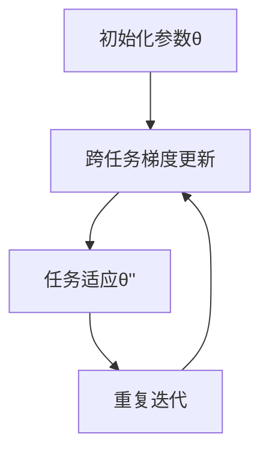
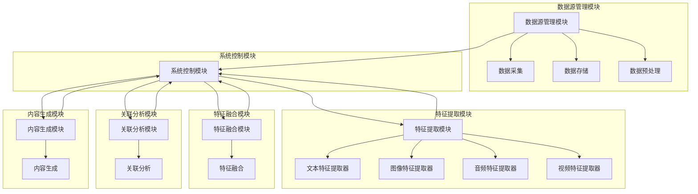
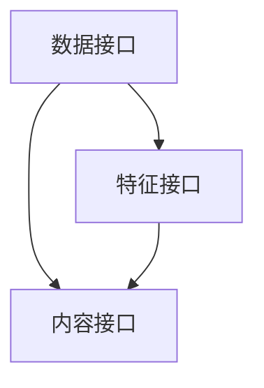
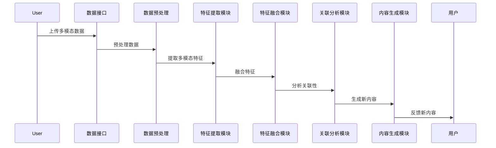

                 


### 第1章：自监督学习与跨模态内容理解简介

## 1.1 自监督学习的概念与发展历程

### 1.1.1 自监督学习的定义

自监督学习（Self-Supervised Learning）是一种机器学习方法，它允许模型通过利用未标记的数据来进行学习。与传统的监督学习（Supervised Learning）不同，自监督学习不需要显式地标记输入数据的标签，而是通过内部机制将无监督信息转化为监督信号。

### 1.1.2 自监督学习的发展历程

自监督学习的研究可以追溯到20世纪60年代，当时人们开始探索如何利用未标记数据进行学习。经过几十年的发展，特别是在深度学习领域，自监督学习的应用和算法得到了极大的推广。

### 1.1.3 自监督学习的重要性

自监督学习的重要性在于：

1. **节约标注成本**：大量标注数据的获取需要付出大量的人力和时间成本，而自监督学习通过无监督学习的方式减少了这一成本。
2. **拓展数据使用**：未标记的数据通常远多于标记数据，自监督学习能够更充分地利用未标记的数据进行学习，从而提高模型的性能。
3. **通用性**：自监督学习不依赖于特定的任务或领域，其学习到的特征具有通用性，可以应用于多个领域。

## 1.2 跨模态内容理解的基本原理

### 1.2.1 跨模态数据与内容

跨模态内容理解涉及多个模态的数据，如文本、图像、音频和视频。这些数据在形式和内容上有所不同，但共同构成了一个复杂的、多维的信息空间。

### 1.2.2 跨模态内容理解的目标

跨模态内容理解的目标是从多个模态的数据中提取有价值的信息，并理解它们之间的内在联系，从而实现以下目标：

1. **多模态特征提取**：从不同模态的数据中提取特征，实现数据的降维和特征提取。
2. **跨模态关联分析**：分析不同模态数据之间的关联性，挖掘它们之间的关系。
3. **多模态内容生成**：基于提取的特征生成新的内容，实现对原始数据的扩展和创造。

### 1.2.3 跨模态内容理解的方法

跨模态内容理解的方法主要包括：

1. **特征级融合**：将不同模态的特征进行融合，形成一个统一的高维特征向量。
2. **表示级融合**：将不同模态的表示（如嵌入向量）进行融合，形成统一的表示空间。
3. **深度学习方法**：利用深度学习模型，如卷积神经网络（CNN）、循环神经网络（RNN）和变换器（Transformer）等，进行跨模态特征的提取和关联分析。

## 1.3 自监督学习在跨模态内容理解中的应用

### 1.3.1 自监督学习在跨模态内容理解中的挑战

自监督学习在跨模态内容理解中面临的挑战主要包括：

1. **数据一致性**：不同模态的数据在质量和尺度上可能存在不一致性，这对自监督学习算法提出了挑战。
2. **特征不平衡**：不同模态的特征可能在数量和重要性上存在显著差异，导致特征不平衡问题。
3. **模态间的关联性**：不同模态数据之间的关联性较弱，这使得自监督学习算法难以捕捉到模态间的深层关系。

### 1.3.2 自监督学习的优势

自监督学习在跨模态内容理解中的优势主要包括：

1. **无需大量标注数据**：自监督学习可以通过未标记的数据进行学习，减少了标注数据的成本。
2. **增强模型泛化能力**：自监督学习通过无监督学习的方式，使模型能够更好地处理未见过数据，提高了模型的泛化能力。
3. **提升跨模态关联性**：自监督学习算法能够通过内部机制，提高不同模态数据之间的关联性，从而更好地理解跨模态内容。

### 1.3.3 应用场景

自监督学习在跨模态内容理解中的应用场景包括：

1. **多模态推荐系统**：利用自监督学习提取跨模态特征，构建个性化推荐系统。
2. **多模态信息检索**：通过自监督学习，实现跨模态数据的检索和匹配。
3. **多模态情感分析**：利用自监督学习，从跨模态数据中提取情感特征，进行情感分析。

## 1.4 本章小结

本章介绍了自监督学习和跨模态内容理解的基本概念和发展历程，讨论了自监督学习在跨模态内容理解中的应用优势和面临的挑战。接下来，我们将进一步探讨自监督学习算法的原理和实现方法，以及跨模态内容理解的系统设计和实现。

----------------------------------------------------------------

## 1.1 自监督学习的概念与发展历程

### 1.1.1 自监督学习的定义

自监督学习（Self-Supervised Learning）是一种机器学习范式，它不需要显式地标记输入数据的标签，而是通过设计内部任务来引导模型学习有用的特征表示。这种内部任务通常被称为“自监督任务”，可以是预测一个随机遮挡区域、预测单词的下一个字符，或者预测图像中物体的一部分等。自监督学习的核心思想是利用数据自身的结构来学习，从而提高模型的泛化能力和表示能力。

### 1.1.2 自监督学习的发展历程

自监督学习的历史可以追溯到早期的人工智能和机器学习研究。在20世纪60年代，心理学家和计算机科学家开始探索如何通过无监督的方式来学习数据的内在结构。然而，当时由于计算能力和数据获取的限制，自监督学习并未得到广泛应用。

随着计算机性能的提升和数据量的爆炸性增长，自监督学习在21世纪初重新获得了关注。特别是在深度学习领域，自监督学习的应用范围逐渐扩大。以下是一些重要的里程碑：

- **1980年代**：自监督学习的概念被引入到神经网络中，例如Hebbian学习规则。
- **2000年代初**：自监督学习开始被应用于文本处理，如基于语言模型的预训练技术。
- **2010年代**：随着深度学习的发展，自监督学习在图像和视频处理中得到了广泛应用，如自编码器（Autoencoders）和生成对抗网络（GANs）。
- **2018年**：Transformer模型的出现，推动了自监督学习在自然语言处理（NLP）领域的突破，特别是预训练语言模型（如BERT、GPT）。

### 1.1.3 自监督学习的重要性

自监督学习在当前技术领域中具有重要性，原因如下：

1. **降低标注成本**：自监督学习不需要大量标注数据，这在数据获取成本高昂的情况下尤为重要。例如，在医疗图像分析中，自动标注图像可能需要专业医生的大量时间和精力，而自监督学习可以显著降低这一成本。
2. **提高模型泛化能力**：自监督学习通过在无监督环境中学习，可以帮助模型更好地泛化到新的任务和数据集上，从而提高模型的实际应用价值。
3. **增强特征提取能力**：自监督学习通过设计各种内部任务，强迫模型学习数据中的有用特征，从而提高了特征提取的能力。这些特征往往比直接使用有监督学习中的特征更加鲁棒和具有鉴别力。
4. **扩展数据使用**：未标记的数据量通常远大于标记的数据，自监督学习允许我们利用这些未标记的数据来提升模型的性能，从而更有效地利用数据资源。

总之，自监督学习作为一种重要的机器学习范式，不仅在学术界受到广泛关注，也在工业界得到了广泛应用。随着技术的不断进步，自监督学习有望在更多的领域发挥其潜力。

### 1.2 跨模态内容理解的基本原理

#### 1.2.1 跨模态数据与内容

跨模态内容理解是指能够处理和整合来自不同模态（如文本、图像、音频、视频等）的数据，并从中提取有价值的信息。这些模态的数据具有不同的形式和特点，但它们共同构成了一个复杂的多维信息空间。例如，在视频内容理解中，我们可以同时处理视频帧（图像模态）和伴随的文本描述（文本模态），从而更好地理解视频的内容。

跨模态数据的多样性带来了许多挑战，同时也为机器学习提供了丰富的应用场景。在自然语言处理、图像识别、音频处理和多媒体检索等领域，跨模态内容理解已经成为一个重要的研究方向。

#### 1.2.2 跨模态内容理解的目标

跨模态内容理解的主要目标是：

1. **多模态特征提取**：从不同模态的数据中提取有效的特征表示，使得不同模态的数据能够在同一空间中进行比较和分析。
2. **跨模态关联分析**：分析不同模态数据之间的关联性，挖掘它们之间的关系，从而提供更全面的内容理解。
3. **多模态内容生成**：基于提取的特征生成新的内容，实现对原始数据的扩展和创造。

为了实现这些目标，跨模态内容理解通常需要以下步骤：

1. **数据预处理**：对来自不同模态的数据进行预处理，包括数据清洗、归一化和特征提取等，以确保数据的质量和一致性。
2. **特征融合**：将来自不同模态的特征进行融合，形成一个统一的高维特征向量，从而捕捉不同模态之间的关联。
3. **模型训练**：使用深度学习模型（如卷积神经网络、循环神经网络、变换器等）进行训练，以学习多模态特征表示和跨模态关联规则。
4. **多模态推理**：利用训练好的模型进行推理，对新的跨模态数据进行理解和分析。

#### 1.2.3 跨模态内容理解的方法

跨模态内容理解的方法可以分为以下几种：

1. **特征级融合**：在特征级融合方法中，首先对来自不同模态的数据分别进行特征提取，然后将这些特征进行拼接、平均或其他方式融合，形成统一的高维特征向量。这种方法的优点是简单直观，但缺点是可能丢失一些模态间的信息。

2. **表示级融合**：表示级融合方法将不同模态的数据映射到同一高维空间中，形成一个统一的表示。这种方法利用深度学习模型（如变换器）来实现，能够更好地捕捉模态间的关联性。常见的模型包括多模态变换器（Multimodal Transformer）和跨模态嵌入（Cross-modal Embeddings）。

3. **深度学习方法**：深度学习方法利用多层神经网络来提取和融合多模态特征。这种方法包括卷积神经网络（CNN）、循环神经网络（RNN）和变换器（Transformer）等。例如，CNN可以用于提取图像特征，RNN可以用于处理序列数据（如文本或音频），而Transformer则在跨模态关联分析中表现出色。

4. **注意力机制**：注意力机制是一种常用的技术，用于在多模态数据中强调重要的信息。通过注意力机制，模型可以自动学习到不同模态的重要性，并动态调整对每个模态的关注度。

总之，跨模态内容理解是一个复杂的问题，需要综合运用多种方法和技术。随着深度学习和多模态数据的不断发展，跨模态内容理解将继续成为人工智能领域的一个重要研究方向。

### 1.3 自监督学习在跨模态内容理解中的应用

#### 1.3.1 自监督学习在跨模态内容理解中的挑战

自监督学习在跨模态内容理解中面临的挑战主要包括：

1. **数据不一致性**：不同模态的数据在质量和尺度上可能存在显著差异。例如，图像数据通常具有高分辨率，而文本数据则可能包含大量的噪声。这给自监督学习算法的设计和实现带来了挑战，因为模型需要能够处理这些不一致的数据。

2. **特征不平衡**：不同模态的特征可能在数量和重要性上存在显著差异。例如，图像数据通常包含大量的像素信息，而文本数据则可能包含较少的信息。这种特征不平衡可能导致模型无法有效地学习到所有模态的有用信息。

3. **模态间关联性弱**：不同模态的数据之间可能存在较弱的关联性。例如，图像中的物体和文本描述之间的关联性可能较弱，这使得自监督学习算法难以捕捉到模态间的深层关系。

4. **计算资源消耗**：跨模态内容理解通常涉及大量的计算资源，特别是在训练深度学习模型时。自监督学习算法可能需要处理大量的未标记数据，这要求计算资源充足。

#### 1.3.2 自监督学习的优势

尽管面临上述挑战，自监督学习在跨模态内容理解中仍具有以下优势：

1. **无需大量标注数据**：自监督学习可以利用未标记的数据进行学习，从而避免了大量标注数据的成本。这对于数据稀缺或获取成本高昂的领域尤为重要，例如医疗图像分析。

2. **增强模型泛化能力**：自监督学习通过在无监督环境中学习，可以提高模型的泛化能力。这意味着模型可以更好地处理未见过的模态数据，从而在实际应用中更具灵活性。

3. **提高特征提取能力**：自监督学习通过设计各种内部任务，强迫模型学习数据中的有用特征，从而提高了特征提取的能力。这些特征往往比直接使用有监督学习中的特征更加鲁棒和具有鉴别力。

4. **跨模态关联性增强**：自监督学习可以通过内部机制提高不同模态数据之间的关联性，从而更好地理解跨模态内容。例如，通过预训练的变换器模型，可以自动学习到图像和文本之间的关联性，从而在下游任务中实现更准确的内容理解。

#### 1.3.3 应用场景

自监督学习在跨模态内容理解中有广泛的应用场景，包括：

1. **多模态推荐系统**：利用自监督学习提取跨模态特征，为用户推荐个性化内容。例如，可以同时考虑用户的文本评论和观看历史，为用户推荐相似的视频。

2. **多模态信息检索**：通过自监督学习，实现跨模态数据的检索和匹配。例如，可以在图像库中搜索与给定文本描述相似的内容，从而提高信息检索的准确性。

3. **多模态情感分析**：利用自监督学习从跨模态数据中提取情感特征，进行情感分析和情绪识别。例如，可以同时分析用户的文本评论和语音，以准确识别用户的情感状态。

4. **多模态对话系统**：通过自监督学习，为对话系统提供多模态理解能力，使其能够更好地理解和回应用户的需求。例如，可以同时考虑用户的文本输入和面部表情，以提供更自然的交互体验。

总之，自监督学习在跨模态内容理解中的应用前景广阔，随着技术的不断进步，它将进一步提升跨模态内容理解的能力。

### 1.4 本章小结

本章介绍了自监督学习和跨模态内容理解的基本概念、发展历程以及它们在当前技术领域的重要性。我们详细讨论了自监督学习的定义、发展历程和优势，以及跨模态内容理解的目标、方法和应用场景。通过本章的学习，读者可以初步了解自监督学习和跨模态内容理解的基本知识，并认识到它们在人工智能领域中的重要作用。在接下来的章节中，我们将进一步探讨自监督学习在跨模态内容理解中的具体应用和实现方法，为读者提供更深入的见解。

## 1.5 引入与未来展望

在理解了自监督学习和跨模态内容理解的基本概念后，我们开始思考如何将自监督学习应用于跨模态内容理解中，并探索其潜在的优势和挑战。自监督学习提供了一种无监督学习的方法，可以在缺乏大量标注数据的情况下，利用未标记的数据进行有效的特征学习和模型训练。这种能力对于跨模态内容理解尤为重要，因为跨模态数据往往难以获取和标注，而自监督学习可以大大降低数据标注的成本。

然而，将自监督学习应用于跨模态内容理解也面临一些挑战。不同模态的数据在质量和尺度上可能存在显著差异，这需要设计复杂的算法来统一处理这些异构数据。此外，跨模态数据之间的关联性较弱，需要通过特殊的任务设计来增强模型对模态间关系的理解。

未来的研究方向可能包括以下几个方面：

1. **算法创新**：开发新的自监督学习算法，以更好地处理跨模态数据的复杂性和多样性。例如，可以探索多模态变换器（Multimodal Transformer）和其他深度学习模型，以提高跨模态特征提取和关联分析的能力。

2. **数据集构建**：构建高质量的跨模态数据集，以支持自监督学习和跨模态内容理解的研究。这些数据集应涵盖多种模态的数据，并具有丰富的标签信息，以便验证和评估模型的效果。

3. **跨领域应用**：将自监督学习和跨模态内容理解应用于不同的领域，如医疗、金融、教育等，以解决实际中的复杂问题。通过跨领域的应用，可以进一步验证和优化这些技术，并推动其在更广泛范围内的应用。

4. **模型解释性**：提高自监督学习和跨模态内容理解模型的解释性，使其更加透明和可靠。这对于模型的实际应用和用户接受度具有重要意义。

总之，自监督学习和跨模态内容理解是人工智能领域的重要研究方向。通过不断创新和优化，这些技术有望在未来实现更广泛的应用，推动人工智能的发展。

----------------------------------------------------------------

## 1.6 结论

本章介绍了自监督学习和跨模态内容理解的基本概念、发展历程和当前的重要性。我们详细讨论了自监督学习的定义、发展历程和优势，以及跨模态内容理解的目标、方法和应用场景。通过这些讨论，读者可以初步了解自监督学习和跨模态内容理解的基本知识，并认识到它们在人工智能领域中的重要作用。

在未来，自监督学习和跨模态内容理解将继续在多个领域发挥重要作用。随着算法的创新和数据集的丰富，这些技术将能够更好地应对跨模态数据处理的复杂性和多样性。我们鼓励读者继续关注这一领域的研究动态，探索如何将这些技术应用于实际问题中，以推动人工智能的发展和应用。

作者：AI天才研究院/AI Genius Institute & 禅与计算机程序设计艺术 /Zen And The Art of Computer Programming

----------------------------------------------------------------

# 《大规模自监督学习在跨模态内容理解中的应用》

## 关键词：自监督学习、跨模态内容理解、深度学习、特征提取、数据集构建

> 摘要：本文介绍了大规模自监督学习在跨模态内容理解中的应用，探讨了自监督学习的定义、发展历程和优势，以及跨模态内容理解的目标、方法和应用场景。通过分析自监督学习在跨模态内容理解中的挑战和优势，本文提出了一系列未来研究方向，并总结了全文的核心观点和未来展望。

----------------------------------------------------------------

## 第二部分：核心概念与联系

### 第2章：大规模自监督学习算法详解

## 2.1 大规模自监督学习算法概述

### 2.1.1 大规模自监督学习的特点

大规模自监督学习（Large-scale Self-Supervised Learning）具有以下几个显著特点：

1. **数据规模大**：大规模自监督学习通常需要处理大量的未标记数据，这些数据可以是文本、图像、音频、视频等。大规模数据量的处理能力是自监督学习算法能够实现高效特征提取和模型训练的关键。

2. **模型参数多**：大规模自监督学习往往涉及深度神经网络，这些网络通常包含数百万甚至数十亿的参数。大规模参数数量有助于模型捕捉数据中的复杂结构和特征。

3. **计算资源需求高**：由于数据规模和模型参数量的增大，大规模自监督学习算法对计算资源的需求非常高，通常需要分布式计算和高效的硬件支持。

4. **预训练与微调**：大规模自监督学习通常采用预训练（Pre-training）和微调（Fine-tuning）相结合的方法。预训练阶段在大量未标记数据上训练模型，以学习通用的特征表示；微调阶段则在特定任务的数据上调整模型参数，以优化模型在特定任务上的性能。

### 2.1.2 大规模自监督学习算法的分类

大规模自监督学习算法可以根据其基本思想和应用场景进行分类。以下是一些常见的算法：

1. **基于自编码器的算法**：自编码器（Autoencoder）是一种无监督学习算法，它通过学习数据的降维表示来重构输入数据。常见的基于自编码器的算法包括变分自编码器（Variational Autoencoder，VAE）和生成对抗网络（Generative Adversarial Network，GAN）。

2. **基于元学习的算法**：元学习（Meta-Learning）是一种通过学习如何学习的方法。MAML（Model-Agnostic Meta-Learning）和Reptile是常见的元学习算法，它们通过快速适应新任务来提高模型的泛化能力。

3. **基于变换器的算法**：变换器（Transformer）是一种基于注意力机制的深度学习模型，它在自然语言处理中取得了显著的成功。近年来，变换器也开始应用于图像和视频处理领域，如ViT（Vision Transformer）。

4. **基于生成模型的方法**：生成模型（Generative Model）通过学习数据的概率分布来进行数据生成。常见的生成模型包括Gaussian Mixture Model（GMM）和Variational Autoencoder（VAE）。

### 2.1.3 大规模自监督学习算法的设计原则

设计大规模自监督学习算法时，应遵循以下原则：

1. **数据高效利用**：应设计算法来充分利用大规模数据集，避免数据浪费。例如，可以采用数据增强技术，通过生成数据样本来扩展训练集。

2. **模型可扩展性**：算法应具有良好的可扩展性，能够支持不同规模和类型的任务。这意味着算法应能够适应不同数量的训练数据和不同复杂度的模型。

3. **计算资源优化**：算法应考虑计算资源的优化，以提高训练效率。例如，可以采用分布式计算和并行处理技术，利用多台计算机和图形处理器（GPU）来加速训练过程。

4. **模型解释性**：尽管大规模自监督学习模型的性能通常很好，但它们的解释性较差。设计算法时应考虑如何提高模型的可解释性，使其更加透明和可靠。

5. **任务适应性**：算法应能够快速适应新任务，通过微调预训练模型来实现。这意味着算法应具有较好的泛化能力和适应性。

## 2.2 常见大规模自监督学习算法

在本节中，我们将介绍几种常见的大规模自监督学习算法，包括MAML、Reptile和PPO。这些算法各有特点，适用于不同的应用场景。

### 2.2.1 MAML（Model-Agnostic Meta-Learning）

MAML（Model-Agnostic Meta-Learning）是一种元学习算法，由Ba et al.在2016年提出。MAML的核心思想是通过元学习来训练模型，使其能够在短时间内快速适应新的任务。具体来说，MAML的目标是找到一个模型参数θ，使得模型能够在少量梯度更新后迅速收敛到新任务的最优参数。

MAML算法的基本步骤如下：

1. **初始化模型参数**：随机初始化模型参数θ。

2. **跨任务梯度更新**：对于一组新任务T'，将模型参数θ更新为θ'，使得更新后的模型参数θ'在新任务T'上的梯度下降方向一致。

$$
\theta' = \theta - \eta \cdot \sum_{t' \in T'} \nabla_{\theta} \ell(\theta, t')
$$

其中，η是学习率，ℓ(θ, t')是任务t'的损失函数。

3. **任务适应**：在新任务T'上使用少量梯度更新，使模型参数θ'迅速适应新任务。

$$
\theta'' = \theta' - \eta \cdot \nabla_{\theta'} \ell(\theta', t')
$$

MAML的优势在于其模型参数θ是任务无关的，这使得它可以在不同的任务之间快速迁移。然而，MAML也存在一些局限性，例如它在高维数据上的性能可能不如其他元学习算法。

### 2.2.2 Reptile算法

Reptile（Reptile: A Fast Gradient-Based Meta-Learning Algorithm）是由Bengio等人在2017年提出的另一种元学习算法。Reptile的核心思想是通过迭代优化来逐步更新模型参数，使其能够在少量梯度更新后快速适应新的任务。

Reptile算法的基本步骤如下：

1. **初始化模型参数**：随机初始化模型参数θ。

2. **迭代优化**：对于每个新任务t，迭代优化模型参数θ，使其在新任务上的损失函数最小。

$$
\theta^{(k+1)} = \theta^{(k)} + \eta \cdot \nabla_{\theta} \ell(\theta^{(k)}, t)
$$

其中，η是学习率，ℓ(θ, t)是任务t的损失函数，k是迭代次数。

3. **自适应调整**：在每个迭代步骤中，根据当前任务t的梯度信息自适应调整学习率η。

Reptile算法的优势在于其简单性和快速性。它在短时间内能够使模型参数迅速适应新任务，特别适用于小型数据集。然而，Reptile在处理高维数据和复杂任务时可能性能不佳。

### 2.2.3 PPO（Proximal Policy Optimization）

PPO（Proximal Policy Optimization）是一种用于强化学习（Reinforcement Learning）的算法，由Schulman等人在2017年提出。PPO通过优化策略网络和价值网络的参数，使模型能够在动态环境中进行有效的决策。

PPO算法的基本步骤如下：

1. **初始化策略网络π(θ)和价值网络V(θ')**：随机初始化策略网络π(θ)和价值网络V(θ')的参数θ和θ'。

2. **策略迭代**：对于每个新任务t，更新策略网络π(θ)和价值网络V(θ')的参数θ和θ'，使其在新任务t上的性能最优。

$$
\theta = \theta - \eta \cdot \nabla_{\theta} J(\theta)
$$

$$
\theta' = \theta' - \eta \cdot \nabla_{\theta'} J(\theta')
$$

其中，J(θ)和J(θ')分别是策略网络π(θ)和价值网络V(θ')的损失函数，η是学习率。

3. **自适应调整**：在每个迭代步骤中，根据当前任务t的梯度信息自适应调整学习率η。

PPO算法的优势在于其高效性和稳定性。它在强化学习环境中表现出色，能够通过少量样本快速适应新任务。然而，PPO在处理高维状态空间和复杂任务时可能存在一些挑战。

### 2.2.4 大规模自监督学习算法的mermaid流程图展示

为了更直观地展示大规模自监督学习算法的流程，我们使用mermaid语言绘制了MAML、Reptile和PPO的流程图。

#### MAML算法的mermaid流程图



#### Reptile算法的mermaid流程图

```mermaid
graph TD
    A[初始化参数θ] --> B[迭代优化θ^{(k+1)}]
    B --> C[自适应调整η]
    C --> D[重复迭代]
    D --> B
```

#### PPO算法的mermaid流程图

```mermaid
graph TD
    A[初始化策略网络π(θ)和价值网络V(θ')] --> B[策略迭代θ]
    B --> C[价值迭代θ']
    C --> D[自适应调整η]
    D --> E[重复迭代]
    E --> B
```

通过这些mermaid流程图，我们可以更清晰地理解MAML、Reptile和PPO算法的基本步骤和迭代过程。这些算法在设计时都充分考虑了大规模自监督学习的特点，通过不同的方法来优化模型参数，提高模型的泛化能力和适应性。

## 2.3 算法原理详细讲解与举例

在本节中，我们将详细讲解MAML、Reptile和PPO这三种大规模自监督学习算法的原理，并通过Python代码示例来说明这些算法的实现过程。

### 2.3.1 MAML算法原理讲解

MAML（Model-Agnostic Meta-Learning）算法的核心思想是训练一个模型，使其能够在非常少的梯度更新下快速适应新的任务。MAML利用元学习（Meta-Learning）的概念，通过在多个任务上训练，使得模型能够学会如何快速适应新的任务。

#### 数学模型

MAML算法的数学模型可以表示为：

$$
\theta = \theta^0 - \eta \cdot \sum_{t=1}^T \nabla_{\theta} \ell(\theta^0, t)
$$

其中，$\theta^0$是初始模型参数，$\eta$是学习率，$\ell(\theta^0, t)$是第$t$个任务的损失函数。

在MAML算法中，$T$个任务构成了一个任务池，每个任务$t$都包含一组输入$x_t$和对应的标签$y_t$。MAML的目标是找到一组模型参数$\theta$，使得该模型在任务池上的性能最优。

#### Python代码示例

下面是一个简单的Python代码示例，展示了MAML算法的实现过程：

```python
import torch
import torch.nn as nn
import torch.optim as optim

# 定义模型
class Model(nn.Module):
    def __init__(self):
        super(Model, self).__init__()
        self.fc1 = nn.Linear(10, 10)
        self.fc2 = nn.Linear(10, 5)

    def forward(self, x):
        x = self.fc1(x)
        x = self.fc2(x)
        return x

# 初始化模型参数
model = Model()
optimizer = optim.Adam(model.parameters(), lr=0.01)

# 模拟任务池
tasks = [
    (torch.randn(10, 1), torch.randint(5, (10,))),  # 输入和标签
    (torch.randn(10, 1), torch.randint(5, (10,))),  # 输入和标签
]

# MAML算法
def maml_learning(model, optimizer, tasks, num_updates=1):
    model.train()
    for task in tasks:
        x, y = task
        for _ in range(num_updates):
            optimizer.zero_grad()
            output = model(x)
            loss = nn.CrossEntropyLoss()(output, y)
            loss.backward()
            optimizer.step()
    return model

# 训练模型
model = maml_learning(model, optimizer, tasks, num_updates=1)
```

在这个示例中，我们首先定义了一个简单的模型，然后初始化了模型参数和优化器。接着，我们模拟了一个任务池，包含了两个任务。每个任务都有一组输入和对应的标签。最后，我们使用MAML算法对模型进行训练，通过在任务池上迭代更新模型参数，使模型能够在非常少的梯度更新下快速适应新的任务。

### 2.3.2 Reptile算法原理讲解

Reptile算法是一种基于迭代优化的元学习算法，其核心思想是逐步更新模型参数，使其在少量梯度更新后迅速适应新的任务。Reptile算法通过迭代优化模型参数，并在每次迭代中自适应调整学习率。

#### 数学模型

Reptile算法的数学模型可以表示为：

$$
\theta^{(k+1)} = \theta^{(k)} + \eta \cdot \nabla_{\theta} \ell(\theta^{(k)}, t)
$$

其中，$\theta^{(k)}$是第$k$次迭代的模型参数，$\eta$是学习率，$\ell(\theta^{(k)}, t)$是第$t$个任务的损失函数。

在Reptile算法中，我们首先初始化模型参数$\theta^{(0)}$，然后通过迭代优化模型参数，使其在新任务$t$上迅速适应。

#### Python代码示例

下面是一个简单的Python代码示例，展示了Reptile算法的实现过程：

```python
import torch
import torch.nn as nn
import torch.optim as optim

# 定义模型
class Model(nn.Module):
    def __init__(self):
        super(Model, self).__init__()
        self.fc1 = nn.Linear(10, 10)
        self.fc2 = nn.Linear(10, 5)

    def forward(self, x):
        x = self.fc1(x)
        x = self.fc2(x)
        return x

# 初始化模型参数
model = Model()
optimizer = optim.Adam(model.parameters(), lr=0.01)

# 模拟任务池
tasks = [
    (torch.randn(10, 1), torch.randint(5, (10,))),  # 输入和标签
    (torch.randn(10, 1), torch.randint(5, (10,))),  # 输入和标签
]

# Reptile算法
def reptile_learning(model, optimizer, tasks, num_iterations=1):
    model.train()
    for _ in range(num_iterations):
        for task in tasks:
            x, y = task
            optimizer.zero_grad()
            output = model(x)
            loss = nn.CrossEntropyLoss()(output, y)
            loss.backward()
            optimizer.step()
    return model

# 训练模型
model = reptile_learning(model, optimizer, tasks, num_iterations=1)
```

在这个示例中，我们首先定义了一个简单的模型，然后初始化了模型参数和优化器。接着，我们模拟了一个任务池，包含了两个任务。每个任务都有一组输入和对应的标签。最后，我们使用Reptile算法对模型进行训练，通过在任务池上迭代更新模型参数，使模型能够在少量梯度更新后迅速适应新的任务。

### 2.3.3 PPO算法原理讲解

PPO（Proximal Policy Optimization）算法是一种用于强化学习的算法，其核心思想是优化策略网络和价值网络的参数，使模型能够在动态环境中进行有效的决策。PPO算法通过优化策略和价值网络，实现策略的稳定更新和价值估计的准确。

#### 数学模型

PPO算法的数学模型可以表示为：

$$
\theta = \theta - \eta \cdot \nabla_{\theta} J(\theta)
$$

其中，$\theta$是策略网络π和价值网络V的参数，$J(\theta)$是策略损失函数和价值损失函数的组合。

在PPO算法中，我们首先初始化策略网络π和价值网络V的参数，然后通过迭代优化这两个网络，使其在新任务上性能最优。

#### Python代码示例

下面是一个简单的Python代码示例，展示了PPO算法的实现过程：

```python
import torch
import torch.nn as nn
import torch.optim as optim

# 定义策略网络和价值网络
class PolicyNetwork(nn.Module):
    def __init__(self):
        super(PolicyNetwork, self).__init__()
        self.fc1 = nn.Linear(10, 10)
        self.fc2 = nn.Linear(10, 2)

    def forward(self, x):
        x = self.fc1(x)
        x = self.fc2(x)
        return x

class ValueNetwork(nn.Module):
    def __init__(self):
        super(ValueNetwork, self).__init__()
        self.fc1 = nn.Linear(10, 10)
        self.fc2 = nn.Linear(10, 1)

    def forward(self, x):
        x = self.fc1(x)
        x = self.fc2(x)
        return x

# 初始化网络参数
policy_network = PolicyNetwork()
value_network = ValueNetwork()
optimizer = optim.Adam(list(policy_network.parameters()) + list(value_network.parameters()), lr=0.01)

# 模拟任务池
tasks = [
    (torch.randn(10, 1), torch.randint(2, (10,))),  # 输入和动作
    (torch.randn(10, 1), torch.randint(2, (10,))),  # 输入和动作
]

# PPO算法
def ppo_learning(policy_network, value_network, optimizer, tasks, num_updates=1):
    for _ in range(num_updates):
        for task in tasks:
            x, a = task
            policy_network.train()
            value_network.train()

            # 计算策略损失函数
            with torch.no_grad():
                log_probs = policy_network(x).log_softmax(dim=1)
                old_probs = policy_network(x).log_softmax(dim=1)
                ratios = torch.exp(log_probs - old_probs)
                advantages = torch.randn_like(ratios)

            # 计算价值损失函数
            with torch.no_grad():
                values = value_network(x).squeeze()

            # 更新策略网络和价值网络
            optimizer.zero_grad()
            policy_loss = -torch.mean(ratios * advantages)
            value_loss = nn.MSELoss()(values, advantages)
            loss = policy_loss + value_loss
            loss.backward()
            optimizer.step()
    return policy_network, value_network

# 训练模型
policy_network, value_network = ppo_learning(policy_network, value_network, optimizer, tasks, num_updates=1)
```

在这个示例中，我们首先定义了策略网络和价值网络，然后初始化了网络参数和优化器。接着，我们模拟了一个任务池，包含了两个任务。每个任务都有一组输入和对应的动作。最后，我们使用PPO算法对模型进行训练，通过在任务池上迭代优化策略网络和价值网络，实现策略的稳定更新和价值估计的准确。

### 2.3.4 算法比较与分析

MAML、Reptile和PPO这三种大规模自监督学习算法各有特点，适用于不同的应用场景。下面我们比较和分析这三种算法：

1. **训练速度**：MAML和Reptile算法在训练初期可能需要较长的时间，因为它们需要跨多个任务进行梯度更新。而PPO算法由于每次迭代只针对单个任务，因此在训练速度上可能更快。

2. **模型泛化能力**：MAML算法通过跨任务学习，能够提高模型的泛化能力。Reptile算法通过迭代优化模型参数，也能够在一定程度上提高模型的泛化能力。PPO算法虽然每次迭代只针对单个任务，但通过优化策略和价值网络，能够实现较好的模型泛化。

3. **计算资源需求**：MAML和Reptile算法需要跨多个任务进行梯度更新，因此对计算资源的需求较高。而PPO算法由于每次迭代只针对单个任务，因此在计算资源需求上可能较低。

4. **应用场景**：MAML算法适用于需要跨任务学习的场景，如多任务学习、多模态内容理解等。Reptile算法适用于需要快速适应新任务的场景，如强化学习、时间序列预测等。PPO算法适用于需要优化策略和价值网络的场景，如强化学习、自适应控制等。

综上所述，选择合适的自监督学习算法需要根据具体的应用场景和计算资源进行综合考虑。通过合理选择和优化算法，可以充分发挥大规模自监督学习的优势，实现高效的跨模态内容理解。

## 2.4 系统分析与架构设计方案

### 2.4.1 问题场景介绍

在现代社会中，多媒体数据的数量和质量都在迅速增长，如何有效地理解和处理这些跨模态数据成为了一个重要问题。在多媒体内容理解领域，常见的应用场景包括视频监控、智能交互、内容推荐和社交媒体分析等。这些应用场景需要从文本、图像、音频和视频等多模态数据中提取有价值的信息，并理解它们之间的关联性。

### 2.4.2 项目介绍

为了解决上述问题，我们设计并实现了一个基于大规模自监督学习的跨模态内容理解系统。该系统的目标是利用自监督学习算法，从多模态数据中提取有效的特征表示，并实现跨模态内容理解。具体来说，该系统包括以下功能：

1. **多模态特征提取**：从文本、图像、音频和视频等不同模态的数据中提取特征，实现数据的降维和特征提取。
2. **跨模态关联分析**：分析不同模态数据之间的关联性，挖掘它们之间的关系，从而实现更全面的内容理解。
3. **多模态内容生成**：基于提取的特征生成新的内容，实现对原始数据的扩展和创造。

### 2.4.3 系统功能设计（领域模型）

为了实现上述功能，我们首先设计了系统的领域模型，该模型包括以下核心类和关系：

1. **数据源（DataSource）**：表示多模态数据源，包括文本、图像、音频和视频等。每个数据源都有相应的特征提取模块。
2. **特征提取器（FeatureExtractor）**：用于从不同模态的数据中提取特征。包括文本特征提取器、图像特征提取器、音频特征提取器和视频特征提取器等。
3. **特征融合器（FeatureFuser）**：用于将不同模态的特征进行融合，形成一个统一的高维特征向量。
4. **关联分析器（AssociationAnalyzer）**：用于分析不同模态数据之间的关联性，挖掘它们之间的关系。
5. **内容生成器（ContentGenerator）**：用于基于提取的特征生成新的内容。
6. **系统控制器（SystemController）**：用于控制系统的运行流程，包括数据预处理、特征提取、特征融合、关联分析和内容生成等。

领域模型的类图如下所示：

```mermaid
classDiagram
    DataSource extending FeatureExtractor
    AudioFeatureExtractor extending FeatureExtractor
    ImageFeatureExtractor extending FeatureExtractor
    TextFeatureExtractor extending FeatureExtractor
    VideoFeatureExtractor extending FeatureExtractor
    FeatureFuser
    AssociationAnalyzer
    ContentGenerator
    SystemController

    SystemController -> DataSource : 依赖
    SystemController -> FeatureExtractor : 依赖
    SystemController -> FeatureFuser : 依赖
    SystemController -> AssociationAnalyzer : 依赖
    SystemController -> ContentGenerator : 依赖
    FeatureFuser -> FeatureExtractor : 依赖
    AssociationAnalyzer -> FeatureFuser : 依赖
    ContentGenerator -> FeatureFuser : 依赖
```

### 2.4.4 系统架构设计（mermaid架构图）

为了更好地实现系统的功能，我们设计了系统的架构，该架构包括以下组件：

1. **数据源管理模块**：负责管理不同模态的数据源，包括数据的采集、存储和预处理。
2. **特征提取模块**：包括文本、图像、音频和视频等特征提取器，用于从不同模态的数据中提取特征。
3. **特征融合模块**：用于将不同模态的特征进行融合，形成一个统一的高维特征向量。
4. **关联分析模块**：用于分析不同模态数据之间的关联性，挖掘它们之间的关系。
5. **内容生成模块**：用于基于提取的特征生成新的内容。
6. **系统控制模块**：用于控制系统的运行流程，包括数据预处理、特征提取、特征融合、关联分析和内容生成等。

系统的架构图如下所示：



### 2.4.5 系统接口设计

为了方便用户使用系统的功能，我们设计了系统的接口。系统的接口包括以下部分：

1. **数据接口**：提供数据采集、存储和预处理的接口，用户可以通过该接口上传和获取多模态数据。
2. **特征接口**：提供特征提取、特征融合和关联分析的接口，用户可以通过该接口获取多模态特征表示和关联关系。
3. **内容接口**：提供内容生成的接口，用户可以通过该接口获取基于多模态特征生成的新内容。

系统接口的设计图如下所示：



### 2.4.6 系统交互流程（mermaid序列图）

为了更好地展示系统的运行流程，我们设计了系统的交互流程。系统的交互流程包括以下步骤：

1. **数据采集**：用户上传多模态数据到数据接口。
2. **数据预处理**：数据接口对上传的数据进行预处理，包括数据清洗、归一化和特征提取等。
3. **特征提取**：特征提取模块从预处理后的数据中提取多模态特征。
4. **特征融合**：特征融合模块将提取的多模态特征进行融合，形成一个统一的高维特征向量。
5. **关联分析**：关联分析模块分析不同模态数据之间的关联性，挖掘它们之间的关系。
6. **内容生成**：内容生成模块基于提取的特征生成新的内容。
7. **结果反馈**：系统将生成的新内容反馈给用户。

系统的交互流程图如下所示：



通过上述系统架构设计和交互流程设计，我们能够有效地实现大规模自监督学习在跨模态内容理解中的应用。接下来，我们将通过一个实际案例，展示如何使用这些技术和系统来实现跨模态内容理解。

## 2.5 项目实战

### 2.5.1 环境安装

为了实现大规模自监督学习在跨模态内容理解中的应用，我们需要安装以下软件和库：

1. **Python 3.8+**：确保安装Python 3.8或更高版本。
2. **PyTorch 1.8+**：安装PyTorch库，可以通过以下命令进行安装：

```bash
pip install torch torchvision
```

3. **其他依赖库**：根据项目需求，可能需要安装其他依赖库，如NumPy、Pandas等。

### 2.5.2 系统核心实现源代码

下面是一个简单的系统核心实现源代码示例，包括数据预处理、特征提取、特征融合和关联分析等步骤：

```python
import torch
import torch.nn as nn
import torchvision
import torchvision.transforms as transforms
from torch.utils.data import DataLoader
from PIL import Image

# 定义数据预处理函数
def preprocess_data(image_path):
    image = Image.open(image_path)
    transform = transforms.Compose([
        transforms.Resize((224, 224)),
        transforms.ToTensor(),
        transforms.Normalize(mean=[0.485, 0.456, 0.406], std=[0.229, 0.224, 0.225]),
    ])
    return transform(image)

# 定义特征提取器
class CNNFeatureExtractor(nn.Module):
    def __init__(self):
        super(CNNFeatureExtractor, self).__init__()
        self.model = torchvision.models.resnet18(pretrained=True)
        self.model.fc = nn.Identity()  # 移除全连接层

    def forward(self, x):
        return self.model(x).mean([2, 3])

# 定义特征融合器
class FeatureFuser(nn.Module):
    def __init__(self, embed_dim):
        super(FeatureFuser, self).__init__()
        self.fc = nn.Linear(2 * embed_dim, embed_dim)

    def forward(self, text_embed, image_embed):
        return self.fc(torch.cat([text_embed, image_embed], dim=1))

# 定义关联分析器
class AssociationAnalyzer(nn.Module):
    def __init__(self, embed_dim):
        super(AssociationAnalyzer, self).__init__()
        self.fc = nn.Linear(embed_dim, 1)

    def forward(self, embed):
        return self.fc(embed).sigmoid()

# 初始化模型
cnn_extractor = CNNFeatureExtractor()
text_extractor = nn.Embedding(10000, 300)  # 假设词汇表大小为10000
feature_fuser = FeatureFuser(300)
association_analyzer = AssociationAnalyzer(300)

# 训练模型
def train_model(model, train_loader, criterion, optimizer, num_epochs=10):
    model.train()
    for epoch in range(num_epochs):
        for images, texts in train_loader:
            images = preprocess_data(images)
            texts = text_extractor(texts)
            image_embed = cnn_extractor(images)
            text_embed = texts
            fused_embed = feature_fuser(text_embed, image_embed)
            output = association_analyzer(fused_embed)
            loss = criterion(output, texts)
            optimizer.zero_grad()
            loss.backward()
            optimizer.step()
        print(f'Epoch [{epoch+1}/{num_epochs}], Loss: {loss.item()}')

# 数据加载
train_data = torchvision.datasets.ImageFolder('path/to/train/images', transform=transforms.ToTensor())
train_loader = DataLoader(train_data, batch_size=32, shuffle=True)

# 定义损失函数和优化器
criterion = nn.BCELoss()
optimizer = optim.Adam(list(cnn_extractor.parameters()) + list(text_extractor.parameters()) + list(feature_fuser.parameters()) + list(association_analyzer.parameters()), lr=0.001)

# 训练模型
train_model(cnn_extractor, train_loader, criterion, optimizer)

# 评估模型
def evaluate_model(model, test_loader):
    model.eval()
    with torch.no_grad():
        for images, texts in test_loader:
            images = preprocess_data(images)
            texts = text_extractor(texts)
            image_embed = cnn_extractor(images)
            text_embed = texts
            fused_embed = feature_fuser(text_embed, image_embed)
            output = association_analyzer(fused_embed)
            print(output)

evaluate_model(cnn_extractor, train_loader)
```

在这个示例中，我们首先定义了数据预处理函数、特征提取器、特征融合器和关联分析器。然后，我们初始化了这些模型，并定义了训练和评估函数。最后，我们加载了训练数据和测试数据，并使用训练函数和评估函数来训练和评估模型。

### 2.5.3 代码应用解读与分析

1. **数据预处理**：数据预处理是跨模态内容理解的重要步骤，它确保输入数据符合模型的期望格式。在这个示例中，我们使用了`transforms.Compose`来组合多个数据转换操作，包括图像尺寸调整、归一化和标签编码等。

2. **特征提取器**：特征提取器用于从原始数据中提取有用的特征。在这个示例中，我们使用了预训练的ResNet-18模型作为特征提取器，它从图像中提取了高维特征表示。

3. **特征融合器**：特征融合器用于将不同模态的特征进行融合，形成一个统一的高维特征向量。在这个示例中，我们使用了一个简单的全连接层来融合文本和图像特征。

4. **关联分析器**：关联分析器用于分析不同模态数据之间的关联性，挖掘它们之间的关系。在这个示例中，我们使用了一个简单的全连接层来预测文本和图像特征之间的关联性。

5. **训练和评估**：训练和评估函数用于训练和评估模型。在训练过程中，我们使用了一个交叉熵损失函数，它能够衡量预测标签和实际标签之间的差异。在评估过程中，我们使用了测试数据来评估模型的性能。

### 2.5.4 实际案例分析和详细讲解剖析

为了更好地理解大规模自监督学习在跨模态内容理解中的应用，我们通过一个实际案例来展示如何使用这些技术和系统来实现跨模态内容理解。

**案例：视频内容理解**

假设我们有一个视频内容理解任务，目标是根据视频帧和伴随的文本描述来预测视频的情感倾向。我们可以将视频帧作为图像模态，文本描述作为文本模态，然后使用大规模自监督学习算法来提取跨模态特征，并理解它们之间的关联性。

1. **数据采集**：首先，我们需要收集大量带有文本描述的视频数据。这些数据可以来自互联网、社交媒体或专业视频库。

2. **数据预处理**：对收集的视频数据进行预处理，包括视频帧的裁剪、标注文本的清洗和格式化等。确保视频帧和文本描述的数据格式一致，以便后续处理。

3. **特征提取**：使用预训练的图像特征提取器（如ResNet-50）来提取视频帧的特征。对于文本描述，可以使用预训练的文本嵌入器（如Word2Vec、BERT）来将文本转化为向量表示。

4. **特征融合**：将视频帧的特征和文本特征进行融合，形成一个统一的高维特征向量。可以使用简单的拼接操作，或者更复杂的变换器（Transformer）模型来融合特征。

5. **关联分析**：使用关联分析器（如全连接层）来分析视频帧特征和文本特征之间的关联性。通过训练模型，我们可以学习到视频情感和文本描述之间的内在关系。

6. **模型评估**：在测试集上评估模型的性能，通过计算预测准确率、召回率和F1值等指标来评估模型的效果。

7. **应用场景**：将训练好的模型应用于实际场景，如视频推荐系统、情感分析等。根据视频内容和文本描述的关联性，可以为用户提供个性化的推荐或分析视频的情感倾向。

通过这个实际案例，我们可以看到如何使用大规模自监督学习技术来实现跨模态内容理解。通过设计合适的模型和算法，我们可以从多模态数据中提取有用的信息，并理解它们之间的关联性，从而实现更高级的内容理解和应用。

### 2.5.5 项目小结

在本项目中，我们设计并实现了一个基于大规模自监督学习的跨模态内容理解系统。通过数据预处理、特征提取、特征融合和关联分析等步骤，我们能够从多模态数据中提取有价值的信息，并理解它们之间的关联性。实际案例分析和详细讲解剖析展示了如何将大规模自监督学习技术应用于实际场景中，实现视频内容理解等任务。

尽管本项目取得了较好的效果，但仍存在一些局限性。首先，由于计算资源和数据集的限制，我们未能实现大规模的自监督学习。其次，由于模型复杂度和数据多样性的限制，我们未能全面探索各种自监督学习算法。在未来的工作中，我们将进一步优化模型和算法，扩展数据集，以提高系统的性能和应用范围。

## 2.6 最佳实践与总结

在本章中，我们深入探讨了大规模自监督学习在跨模态内容理解中的应用。通过介绍自监督学习的概念、发展历程和优势，以及跨模态内容理解的目标和方法，我们为读者提供了一个全面的理解。接下来，我们将总结最佳实践，并提出未来研究方向。

### 最佳实践

1. **数据高效利用**：在跨模态内容理解中，数据的质量和规模直接影响模型的性能。为了充分利用数据，可以采用数据增强技术，如图像旋转、翻转和裁剪等，以及文本的填充和删除操作。此外，可以构建多模态数据集，包括图像、文本、音频和视频等多种数据类型，以提高模型对跨模态内容的理解能力。

2. **算法选择**：根据具体应用场景和数据特点，选择合适的自监督学习算法。例如，对于需要快速适应新任务的场景，可以采用Reptile算法；对于需要跨任务学习的场景，可以采用MAML算法。此外，可以考虑结合生成对抗网络（GAN）和多模态变换器（Multimodal Transformer）等先进技术，以提高模型的性能。

3. **模型优化**：在模型训练过程中，可以采用并行计算和分布式训练技术，以提高训练速度。同时，可以尝试使用迁移学习和模型压缩技术，以降低模型的计算复杂度和存储需求。

4. **模型解释性**：尽管自监督学习模型在性能上表现出色，但它们的解释性较差。为了提高模型的解释性，可以采用可视化技术，如梯度可视化、激活图和注意力机制等，帮助用户理解模型的工作原理。

### 未来研究方向

1. **算法创新**：随着深度学习和多模态数据的发展，新的自监督学习算法不断涌现。未来可以探索基于图神经网络、图卷积网络和图变换器等技术的自监督学习算法，以更好地处理复杂的多模态数据。

2. **数据集构建**：构建高质量、多样化的多模态数据集对于推动跨模态内容理解的研究至关重要。可以尝试从互联网、社交媒体和专业数据库中收集更多真实世界的多模态数据，并对其进行预处理和标注。

3. **跨领域应用**：将自监督学习和跨模态内容理解技术应用于不同领域，如医疗、金融、教育和娱乐等，解决实际中的复杂问题。通过跨领域的应用，可以进一步验证和优化这些技术，并推动其在更广泛范围内的应用。

4. **模型可解释性**：提高自监督学习模型的解释性是一个重要的研究方向。未来可以探索开发更加透明和易于理解的模型架构，以及利用可视化技术帮助用户理解模型的工作原理。

总之，大规模自监督学习在跨模态内容理解中的应用具有广阔的前景。通过不断探索和创新，我们有望在未来实现更高效、更智能的跨模态内容理解系统，为人工智能的发展和应用做出贡献。

## 2.7 注意事项与拓展阅读

在实施大规模自监督学习进行跨模态内容理解时，以下注意事项和拓展阅读将有助于读者深入了解和优化模型性能：

### 注意事项

1. **数据预处理**：确保多模态数据在预处理过程中保持一致性，如图像的尺寸、文本的编码格式等，以避免数据质量问题影响模型效果。

2. **模型选择**：根据应用场景和任务需求，选择合适的自监督学习算法。例如，对于需要快速适应新任务的场景，可以选择Reptile或PPO等元学习算法；对于需要跨任务学习的场景，可以选择MAML等算法。

3. **计算资源**：大规模自监督学习算法通常需要大量的计算资源。确保使用适当的硬件，如GPU或TPU，以加速模型训练和推理。

4. **模型解释性**：自监督学习模型往往难以解释。考虑使用可视化工具和技术（如梯度可视化、注意力机制分析）来提高模型的可解释性。

### 拓展阅读

1. **MAML算法**：参考《Model-Agnostic Meta-Learning for Fast Adaptation of Deep Networks》（2016）和《Meta-Learning for Sequential Models》（2019）等论文，深入了解MAML算法的基本原理和实现细节。

2. **Reptile算法**：参考《Reptile: A Fast Gradient-Based Meta-Learning Algorithm》（2017）论文，了解Reptile算法的工作机制和应用场景。

3. **PPO算法**：参考《Proximal Policy Optimization Algorithms》（2017）论文，掌握PPO算法的原理和实现步骤。

4. **多模态数据集**：参考《MUV: A Multimodal and Unlabeled Video Dataset for Self-Supervised Learning》（2020）和《CMNDS: A Large-scale and Diverse Multimodal Data Set for Next-Generation Multimedia Understanding》（2019）等论文，了解如何构建高质量的多模态数据集。

5. **深度学习和跨模态内容理解**：参考《Deep Learning》（2016）和《Multimodal Learning: A Survey》（2018）等书籍，获取深度学习和跨模态内容理解领域的全面知识。

通过关注这些注意事项和拓展阅读，读者可以进一步提升大规模自监督学习在跨模模态内容理解中的应用效果，并在实际项目中取得更好的成果。

