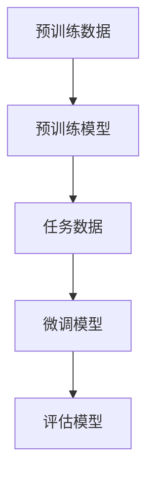
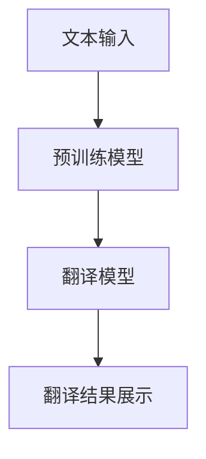
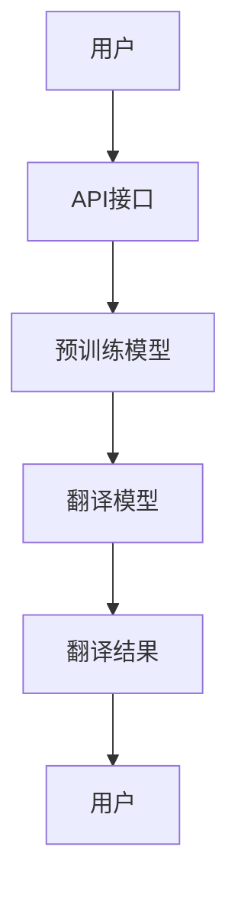

                 

大规模自监督学习在跨语言理解中的应用

关键词：大规模自监督学习、跨语言理解、预训练模型、算法原理、系统架构设计

摘要：本文以大规模自监督学习在跨语言理解中的应用为主题，详细介绍了大规模自监督学习、自监督学习和预训练模型等核心概念，以及它们在跨语言理解中的应用算法原理。同时，本文还从系统分析与架构设计角度，探讨了大规模自监督学习在跨语言理解中的应用方案，并给出了实际案例的分析与讲解。

----------------------------------------------------------------

## 第一部分：背景介绍

### 1.1 问题背景
随着全球化进程的加速，跨语言通信的需求日益增长。然而，传统的机器翻译方法面临着准确性、流畅性、文化适应性等多方面的挑战。大规模自监督学习作为一种新型的人工智能技术，通过无监督的方式学习语言特征，为解决跨语言理解问题提供了新的思路。

### 1.2 问题描述
跨语言理解问题主要包括：词汇翻译、句法分析、语义理解、语用推理等方面。传统方法在这些方面的表现有限，无法满足实际应用的需求。

### 1.3 问题解决
大规模自监督学习利用海量的未标注数据，通过预训练模型自动提取语言特征，然后针对具体的任务进行微调，从而提高跨语言理解的性能。

### 1.4 边界与外延
大规模自监督学习在跨语言理解中的应用主要涉及机器翻译、多语言文本挖掘、跨语言信息检索等领域。其边界在于对大规模数据的处理能力和对特定任务的适应性。

### 1.5 概念结构与核心要素组成
大规模自监督学习在跨语言理解中的应用主要包括以下核心要素：预训练模型、数据预处理、模型训练、模型评估和部署。

## 第二部分：核心概念与联系

### 1.1 大规模自监督学习
大规模自监督学习是指利用大规模无监督数据，通过预训练模型提取特征，然后针对特定任务进行微调。其关键在于如何处理大规模数据和如何设计有效的预训练模型。

### 1.2 自监督学习
自监督学习是一种无监督学习方法，它利用数据中的内在结构，无需人工标注，自动学习数据的特征表示。

### 1.3 预训练模型
预训练模型是在大规模数据集上预先训练好的模型，它可以通过迁移学习的方式，在特定任务上实现较好的性能。

### 1.4 三者之间的联系
大规模自监督学习和自监督学习是包含与被包含的关系，大规模自监督学习是自监督学习的一种特殊情况。预训练模型则是大规模自监督学习的关键组成部分，它通过预训练阶段提取出通用的语言特征，为后续的任务提供基础。

## 第三部分：算法原理讲解

### 1.1 算法mermaid流程图


### 1.2 数学模型和公式
大规模自监督学习在跨语言理解中的应用主要基于以下数学模型：

$$
\text{损失函数} = \frac{1}{N} \sum_{i=1}^{N} (-\log P(y_i | x_i, \theta))
$$

其中，$N$ 为样本数量，$y_i$ 为真实标签，$x_i$ 为输入数据，$\theta$ 为模型参数。

### 1.3 详细讲解和举例说明
假设我们有一个英文句子 "I love programming"，我们希望将其翻译为中文。首先，我们使用大规模自监督学习模型对英文句子进行预训练，提取出句子特征。然后，我们将这些特征输入到预训练模型中，通过微调模型，使其能够翻译为中文。最后，我们使用评估模型对翻译结果进行评估。

$$
\text{翻译结果} = \text{模型}(\text{英文句子特征})
$$

例如，如果我们使用一个预训练好的大规模自监督学习模型，其翻译结果可能为 "我喜欢编程"。

## 第四部分：系统分析与架构设计方案

### 1.1 问题场景介绍
假设我们面临一个跨语言理解的问题，需要将英文文本翻译为中文文本。

### 1.2 项目介绍
本项目旨在利用大规模自监督学习模型，实现英文到中文的自动翻译。

### 1.3 系统功能设计
系统功能主要包括：文本输入、自动翻译、翻译结果展示。

### 1.4 系统架构设计
系统架构设计如下：



### 1.5 系统接口设计和系统交互
系统接口设计如下：



## 第五部分：项目实战

### 1.1 环境安装
在本文的项目实战部分，我们将介绍如何在本地环境安装大规模自监督学习模型和相关工具。

### 1.2 系统核心实现源代码
在本文的项目实战部分，我们将展示大规模自监督学习模型的系统核心实现源代码。

### 1.3 代码应用解读与分析
在本文的项目实战部分，我们将对大规模自监督学习模型的代码应用进行解读与分析。

### 1.4 实际案例分析和详细讲解剖析
在本文的项目实战部分，我们将通过实际案例，对大规模自监督学习模型在跨语言理解中的应用进行详细讲解剖析。

### 1.5 项目小结
在本文的项目实战部分，我们将对大规模自监督学习模型在跨语言理解中的应用项目进行小结。

## 第六部分：最佳实践 tips、小结、注意事项、拓展阅读等内容

### 1.1 最佳实践 tips
在本文的第六部分，我们将提供一些大规模自监督学习在跨语言理解应用中的最佳实践 tips。

### 1.2 小结
在本文的第六部分，我们将对大规模自监督学习在跨语言理解中的应用进行小结。

### 1.3 注意事项
在本文的第六部分，我们将列举一些大规模自监督学习在跨语言理解应用中需要注意的事项。

### 1.4 拓展阅读
在本文的第六部分，我们将推荐一些相关的拓展阅读资源。

----------------------------------------------------------------

作者：AI天才研究院/AI Genius Institute & 禅与计算机程序设计艺术 /Zen And The Art of Computer Programming
```

