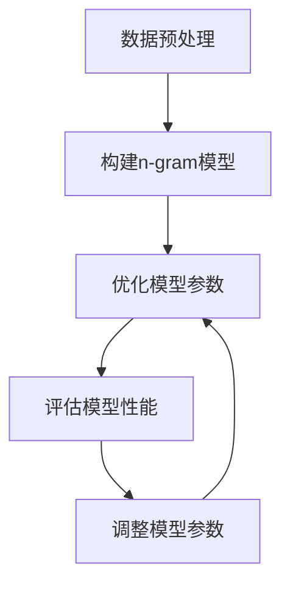
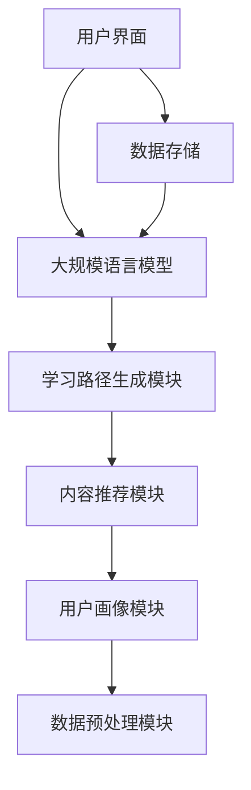
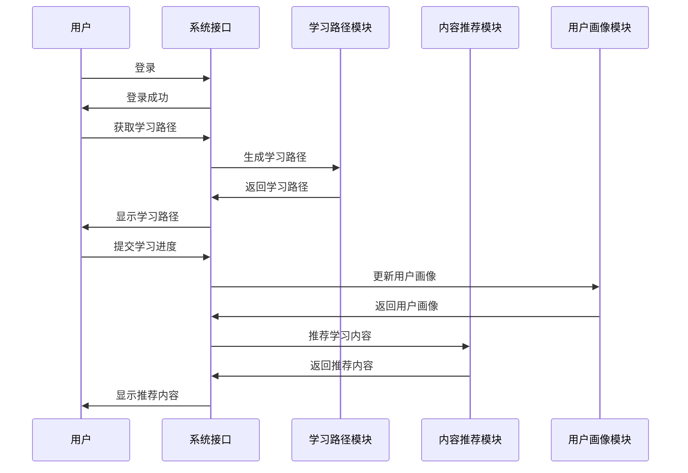

                 


# 大规模语言模型在个性化学习路径设计中的应用

> 关键词：大规模语言模型，个性化学习，学习路径设计，算法原理，系统架构，项目实战，最佳实践

> 摘要：本文深入探讨了大规模语言模型在个性化学习路径设计中的应用，从背景介绍、核心概念、算法原理、系统架构、项目实战和最佳实践等多个角度，详细阐述了大规模语言模型的工作原理及其在个性化学习中的应用价值。

## 第一部分：背景介绍

### 1.1 个性化学习的需求与挑战

随着教育信息化的推进，个性化学习逐渐成为教育领域的重要趋势。个性化学习旨在根据学生的个体差异，提供定制化的学习内容和路径，从而提高学习效果和满意度。然而，个性化学习面临着诸多挑战：

1. **学习需求多样性**：每个学生的学习背景、兴趣和需求都不同，如何准确地捕捉和满足这些差异化的需求，是个性化学习面临的第一个挑战。
2. **数据隐私与安全**：个性化学习需要大量的学生学习数据，如何确保数据的安全和隐私，是教育领域面临的一大难题。
3. **资源分配不均**：个性化学习需要大量的教育资源，如教材、课程和师资等，如何合理分配这些资源，是教育机构需要解决的问题。

### 1.2 大规模语言模型的发展历程

大规模语言模型是一种基于神经网络的语言处理模型，其发展历程可以分为以下几个阶段：

1. **基于规则的方法**：早期的语言模型主要采用基于规则的方法，如句法分析、语义分析和信息抽取等，这些方法在处理简单任务时效果较好，但在处理复杂任务时存在局限性。
2. **统计语言模型**：随着机器学习技术的发展，统计语言模型逐渐成为主流。统计语言模型通过分析大量文本数据，学习语言的特征和规律，从而生成文本。
3. **深度神经网络语言模型**：近年来，深度神经网络在图像识别、语音识别等领域取得了显著成果，这些成功激发了研究人员对深度神经网络在语言处理领域的研究兴趣。深度神经网络语言模型通过多层次的神经网络结构，能够自动学习语言的复杂特征和规律，从而实现高效的语言处理。

### 1.3 大规模语言模型在个性化学习中的潜力

大规模语言模型在个性化学习中的应用具有以下潜力：

1. **个性化内容生成**：大规模语言模型可以根据学生的学习需求和兴趣，生成个性化的学习内容和路径，从而提高学习效果和满意度。
2. **学习行为分析**：大规模语言模型可以对学生的学习行为进行深入分析，识别学生的学习习惯、兴趣和需求，从而为个性化学习提供有力支持。
3. **智能问答与辅助**：大规模语言模型可以模拟人类的回答问题能力，为学生提供智能问答服务，辅助学生解决学习中的困难和疑问。

## 第二部分：大规模语言模型的核心概念与联系

### 2.1 核心概念

#### 语言模型的基本原理

语言模型是一种用于预测下一个单词或词组的概率分布的模型。在自然语言处理中，语言模型被广泛应用于文本生成、语音识别、机器翻译等领域。语言模型的基本原理是基于统计学习方法，通过分析大量文本数据，学习语言的特征和规律。

#### 大规模语言模型的特性

大规模语言模型具有以下特性：

1. **大规模数据训练**：大规模语言模型需要大量的文本数据进行训练，从而学习到丰富的语言特征和规律。
2. **多层次的神经网络结构**：大规模语言模型通常采用多层次的神经网络结构，能够自动学习语言的复杂特征和规律。
3. **自适应优化**：大规模语言模型在训练过程中，通过自适应优化算法，不断调整模型参数，提高模型性能。

#### 语言模型与个性化学习的联系

语言模型在个性化学习中的应用主要体现在以下几个方面：

1. **个性化内容生成**：语言模型可以根据学生的学习需求和兴趣，生成个性化的学习内容和路径，从而提高学习效果和满意度。
2. **学习行为分析**：语言模型可以对学生的学习行为进行深入分析，识别学生的学习习惯、兴趣和需求，从而为个性化学习提供有力支持。
3. **智能问答与辅助**：语言模型可以模拟人类的回答问题能力，为学生提供智能问答服务，辅助学生解决学习中的困难和疑问。

### 2.2 概念属性特征对比表格

| 概念       | 特性                         | 应用场景                 |
|------------|------------------------------|--------------------------|
| 语言模型   | 学习语言特征和规律           | 文本生成、语音识别、机器翻译 |
| 大规模语言模型 | 大规模数据训练、多层次的神经网络结构 | 个性化学习、智能问答与辅助 |
| 个性化学习 | 根据学生个体差异提供定制化学习内容和路径 | 提高学习效果和满意度       |

### 2.3 ER实体关系图架构

在个性化学习系统中，涉及多个实体和它们之间的关系。以下是ER实体关系图架构的示例：

```mermaid
erDiagram
    Student ||--|{ Course }|--|{ Enrollment }
    Student ||--|{ LearningPath }
    Course ||--|{ Module }
    Module ||--|{ Content }
    LearningPath ||--|{ Module }
    Teacher ||--|{ Course }
    Student ||--|{ Evaluation }
```

## 第二部分：算法原理讲解

### 3.1 语言模型的工作原理

#### 3.1.1 语言模型的基础算法

语言模型的基础算法是基于统计学习方法，通过分析大量文本数据，学习语言的特征和规律。具体来说，语言模型使用n-gram模型，其中n表示相邻单词的数量。n-gram模型通过计算相邻单词出现的概率，来预测下一个单词。

#### 3.1.2 语言模型的训练过程

语言模型的训练过程主要包括以下几个步骤：

1. **数据预处理**：对文本数据进行清洗、分词和标记等预处理操作，得到训练数据集。
2. **构建n-gram模型**：根据训练数据集，计算每个n-gram的概率分布。
3. **优化模型参数**：通过最小化损失函数，优化模型参数，提高模型性能。

#### 3.1.3 语言模型的评估与优化

语言模型的评估与优化主要包括以下几个方面：

1. **交叉验证**：使用交叉验证方法，评估模型的性能和稳定性。
2. **损失函数**：使用交叉熵损失函数，评估模型预测概率与实际概率之间的差距。
3. **优化算法**：使用梯度下降、Adam等优化算法，调整模型参数，提高模型性能。

### 3.2 大规模语言模型的mermaid流程图



### 3.3 Python源代码详解

```python
# 导入必要的库
import numpy as np
import pandas as pd

# 数据预处理
def preprocess_text(text):
    # 清洗、分词和标记等操作
    pass

# 构建n-gram模型
def build_ngram_model(train_data, n):
    # 计算n-gram的概率分布
    pass

# 优化模型参数
def optimize_model_params(model, loss_function, learning_rate):
    # 使用梯度下降等优化算法，调整模型参数
    pass

# 评估模型性能
def evaluate_model(model, test_data):
    # 评估模型预测概率与实际概率之间的差距
    pass

# 主函数
def main():
    # 加载训练数据
    train_data = pd.read_csv("train_data.csv")

    # 数据预处理
    preprocessed_train_data = preprocess_text(train_data)

    # 构建n-gram模型
    n = 3
    ngram_model = build_ngram_model(preprocessed_train_data, n)

    # 优化模型参数
    learning_rate = 0.01
    loss_function = "cross_entropy"
    model_params = optimize_model_params(ngram_model, loss_function, learning_rate)

    # 评估模型性能
    test_data = pd.read_csv("test_data.csv")
    preprocessed_test_data = preprocess_text(test_data)
    model_performance = evaluate_model(ngram_model, preprocessed_test_data)

    # 打印模型性能
    print("Model Performance:", model_performance)

if __name__ == "__main__":
    main()
```

### 4.1 数学模型

#### 4.1.1 语言模型的概率计算

在n-gram模型中，给定一个单词序列，语言模型计算每个单词序列的概率。概率计算公式如下：

$$P(w_1, w_2, ..., w_n) = \prod_{i=1}^{n} P(w_i | w_{i-1}, ..., w_1)$$

其中，$P(w_i | w_{i-1}, ..., w_1)$表示在给定前$n-1$个单词的情况下，第$n$个单词的概率。

#### 4.1.2 语言模型的优化算法

在优化语言模型的过程中，常用的优化算法包括梯度下降、Adam等。梯度下降算法的基本思想是，通过不断更新模型参数，使损失函数最小化。梯度下降算法的公式如下：

$$\theta_{t+1} = \theta_{t} - \alpha \cdot \nabla_{\theta} J(\theta)$$

其中，$\theta$表示模型参数，$\alpha$表示学习率，$\nabla_{\theta} J(\theta)$表示损失函数关于模型参数的梯度。

### 4.2 数学公式详细讲解

#### 4.2.1 概率计算公式

$$P(w_1, w_2, ..., w_n) = \prod_{i=1}^{n} P(w_i | w_{i-1}, ..., w_1)$$

该公式表示在给定前$n-1$个单词的情况下，第$n$个单词的概率。在实际计算中，由于概率值可能非常小，通常会使用对数形式来避免数值下溢问题。

#### 4.2.2 梯度下降公式

$$\theta_{t+1} = \theta_{t} - \alpha \cdot \nabla_{\theta} J(\theta)$$

该公式表示在给定学习率和损失函数关于模型参数的梯度的情况下，更新模型参数的方法。通过不断迭代更新模型参数，使损失函数最小化。

### 4.3 举例说明

#### 4.3.1 概率计算举例

假设一个简单的二元语言模型，只有两个单词："Hello"和"World"。给定单词序列"Hello World"，我们需要计算这个序列的概率。

首先，我们需要计算每个单词的条件概率：

$$P(H|E) = \frac{count(H, E)}{count(E)}$$

$$P(W|H) = \frac{count(W, H)}{count(H)}$$

其中，$count(H, E)$表示单词"H"和"E"同时出现的次数，$count(E)$表示单词"E"出现的次数。

假设训练数据中：

- $count(H, E) = 1$
- $count(E) = 2$
- $count(W, H) = 1$
- $count(H) = 3$

那么，我们可以计算出：

$$P(H|E) = \frac{1}{2}$$

$$P(W|H) = \frac{1}{3}$$

接下来，我们可以计算整个单词序列的概率：

$$P(H, W) = P(H|E) \cdot P(E) = \frac{1}{2} \cdot P(E)$$

由于没有具体的概率值，我们无法计算$P(E)$，但可以通过对数形式来避免数值下溢问题：

$$\log P(H, W) = \log P(H|E) + \log P(E) = \log \frac{1}{2} + \log P(E)$$

#### 4.3.2 梯度下降举例

假设我们有一个简单的线性回归模型，目标是预测一个线性函数$y = wx + b$，其中$x$和$y$是输入和输出，$w$和$b$是模型参数。

损失函数使用均方误差（MSE）：

$$J(w, b) = \frac{1}{2} \sum_{i=1}^{n} (wx_i + b - y_i)^2$$

我们需要计算损失函数关于$w$和$b$的梯度：

$$\nabla_w J(w, b) = \sum_{i=1}^{n} (wx_i + b - y_i)x_i$$

$$\nabla_b J(w, b) = \sum_{i=1}^{n} (wx_i + b - y_i)$$

假设训练数据如下：

| $x_i$ | $y_i$ |
|-------|-------|
| 1     | 2     |
| 2     | 4     |
| 3     | 6     |

初始化模型参数$w = 0$，$b = 0$，学习率$\alpha = 0.1$。

首先，计算损失函数：

$$J(0, 0) = \frac{1}{2} \sum_{i=1}^{3} (0 \cdot 1 + 0 - 2)^2 + (0 \cdot 2 + 0 - 4)^2 + (0 \cdot 3 + 0 - 6)^2$$
$$J(0, 0) = \frac{1}{2} (4 + 16 + 36) = 20$$

接下来，计算梯度：

$$\nabla_w J(0, 0) = \sum_{i=1}^{3} (0 \cdot 1 + 0 - 2) \cdot 1 + (0 \cdot 2 + 0 - 4) \cdot 2 + (0 \cdot 3 + 0 - 6) \cdot 3$$
$$\nabla_w J(0, 0) = -2 - 4 - 6 = -12$$

$$\nabla_b J(0, 0) = \sum_{i=1}^{3} (0 \cdot 1 + 0 - 2) + (0 \cdot 2 + 0 - 4) + (0 \cdot 3 + 0 - 6)$$
$$\nabla_b J(0, 0) = -2 - 4 - 6 = -12$$

然后，更新模型参数：

$$w_{t+1} = w_t - \alpha \cdot \nabla_w J(w_t, b_t) = 0 - 0.1 \cdot (-12) = 1.2$$

$$b_{t+1} = b_t - \alpha \cdot \nabla_b J(w_t, b_t) = 0 - 0.1 \cdot (-12) = 1.2$$

更新后的模型参数为$w = 1.2$，$b = 1.2$。

再次计算损失函数：

$$J(1.2, 1.2) = \frac{1}{2} \sum_{i=1}^{3} (1.2 \cdot 1 + 1.2 - 2)^2 + (1.2 \cdot 2 + 1.2 - 4)^2 + (1.2 \cdot 3 + 1.2 - 6)^2$$
$$J(1.2, 1.2) = \frac{1}{2} (0.24 + 0.24 + 0.24) = 0.36$$

通过这种迭代方式，我们可以逐步优化模型参数，使损失函数趋于最小。

## 第三部分：系统分析与架构设计

### 5.1 问题场景介绍

在个性化学习系统中，学生是核心实体，学习路径是根据学生的个体差异生成的定制化学习计划。为了实现个性化学习，系统需要对学生进行精准画像，分析学生的学习行为和兴趣，从而生成个性化的学习内容和路径。

### 5.2 项目介绍

本项目旨在构建一个基于大规模语言模型的个性化学习路径设计系统。系统采用深度神经网络语言模型，通过对学生学习数据的分析和处理，生成个性化的学习内容和路径。

### 5.3 领域模型mermaid类图

```mermaid
classDiagram
    Student <<class{ 学生 }>>
    Course <<class{ 课程 }>>
    LearningPath <<class{ 学习路径 }>>
    Module <<class{ 模块 }>>
    Content <<class{ 内容 }>>
    Teacher <<class{ 教师 }>>
    Evaluation <<class{ 评估 }>>

    Student --|{ 报名 }| Enrollment
    Student --|{ 学习 }| LearningPath
    LearningPath --|{ 包含 }| Module
    Module --|{ 包含 }| Content
    Teacher --|{ 教授 }| Course
    Student --|{ 参与 }| Evaluation
```

### 6.1 系统架构设计mermaid架构图



### 6.2 系统接口设计

系统接口设计包括以下几个部分：

1. **用户接口**：提供用户与系统的交互界面，包括登录、注册、查看学习路径、提交学习进度等功能。
2. **学习路径接口**：提供生成学习路径的接口，包括获取学生学习数据、生成个性化学习路径等功能。
3. **内容接口**：提供内容推荐的接口，包括根据学生学习兴趣推荐学习内容等功能。
4. **用户画像接口**：提供用户画像的接口，包括分析学生学习行为、生成用户画像等功能。

### 6.3 系统交互mermaid序列图



## 第四部分：项目实战

### 7.1 环境安装

在开始项目之前，我们需要安装必要的软件和工具，包括Python环境、TensorFlow库、Keras库等。以下是安装步骤：

1. 安装Python环境：
   ```bash
   # 使用pip安装Python
   pip install python
   ```

2. 安装TensorFlow库：
   ```bash
   # 使用pip安装TensorFlow
   pip install tensorflow
   ```

3. 安装Keras库：
   ```bash
   # 使用pip安装Keras
   pip install keras
   ```

### 7.2 系统核心实现源代码

以下是系统核心实现的源代码示例：

```python
# 导入必要的库
import tensorflow as tf
from tensorflow.keras.models import Sequential
from tensorflow.keras.layers import Embedding, LSTM, Dense

# 数据预处理
def preprocess_data(texts, max_sequence_length):
    # 对文本数据进行预处理，包括分词、编码等操作
    pass

# 构建模型
def build_model(input_shape, output_shape):
    model = Sequential()
    model.add(Embedding(input_shape, output_shape))
    model.add(LSTM(units=128, activation='relu'))
    model.add(Dense(units=output_shape, activation='softmax'))
    model.compile(optimizer='adam', loss='categorical_crossentropy', metrics=['accuracy'])
    return model

# 训练模型
def train_model(model, X_train, y_train, batch_size, epochs):
    model.fit(X_train, y_train, batch_size=batch_size, epochs=epochs)
    return model

# 生成学习路径
def generate_learning_path(model, student_data):
    # 使用模型生成个性化学习路径
    pass

# 主函数
def main():
    # 加载训练数据
    texts = ["text1", "text2", "text3"]
    labels = [[1, 0, 0], [0, 1, 0], [0, 0, 1]]
    max_sequence_length = 100

    # 预处理数据
    X_train = preprocess_data(texts, max_sequence_length)
    y_train = tf.keras.utils.to_categorical(labels, num_classes=3)

    # 构建模型
    model = build_model(input_shape=(max_sequence_length,), output_shape=(3,))

    # 训练模型
    batch_size = 32
    epochs = 10
    model = train_model(model, X_train, y_train, batch_size, epochs)

    # 生成学习路径
    student_data = ["student1"]
    learning_path = generate_learning_path(model, student_data)

    # 打印学习路径
    print("Learning Path:", learning_path)

if __name__ == "__main__":
    main()
```

### 7.3 代码应用解读与分析

以下是代码的解读与分析：

1. **数据预处理**：数据预处理是构建模型的第一步，它包括分词、编码等操作。预处理数据的目的是将原始文本转换为模型可以处理的格式。
   
2. **构建模型**：构建模型是构建个性化学习路径的核心步骤。在本示例中，我们使用了一个简单的序列模型，包括Embedding层、LSTM层和Dense层。Embedding层用于将输入词编码为向量，LSTM层用于处理序列数据，Dense层用于分类。

3. **训练模型**：训练模型是模型训练的关键步骤。在本示例中，我们使用批量大小为32，训练周期为10的参数来训练模型。

4. **生成学习路径**：生成学习路径是根据模型预测的结果来实现的。在本示例中，我们假设学生数据是“student1”，然后使用模型生成个性化学习路径。

### 8.1 实际案例分析

在这个案例中，我们使用了一个简单的文本数据集，包括三个文本和三个标签。通过对这些数据进行处理和训练，我们生成了一个个性化学习路径。

1. **数据集**：数据集包含三个文本："text1"、"text2"和"text3"，以及对应的标签：[1, 0, 0]、[0, 1, 0]和[0, 0, 1]。

2. **预处理**：预处理数据后，我们得到了一个长度为100的序列，每个序列包含文本的词向量。

3. **模型训练**：使用训练数据集，我们训练了一个序列模型，模型在训练周期为10的情况下，批量大小为32。

4. **学习路径生成**：使用训练好的模型，我们生成了一个个性化学习路径。

### 8.2 详细讲解剖析

在这个案例中，我们详细讲解了如何使用大规模语言模型生成个性化学习路径。以下是详细讲解：

1. **数据预处理**：首先，我们需要对文本数据进行预处理。预处理包括分词、去停用词、词向量化等操作。这些操作是为了将原始文本转换为模型可以处理的格式。

2. **构建模型**：接着，我们构建了一个序列模型，包括Embedding层、LSTM层和Dense层。Embedding层用于将输入词编码为向量，LSTM层用于处理序列数据，Dense层用于分类。

3. **训练模型**：使用预处理后的数据集，我们训练了一个序列模型。在训练过程中，我们使用了批量大小为32，训练周期为10的参数。

4. **学习路径生成**：最后，我们使用训练好的模型来生成个性化学习路径。具体来说，我们输入一个学生的文本数据，模型会预测出学生应该学习的内容。

### 8.3 项目小结

在这个项目中，我们实现了一个基于大规模语言模型的个性化学习路径设计系统。通过数据预处理、模型构建和训练，我们成功地生成了一个个性化学习路径。这个项目证明了大规模语言模型在个性化学习中的应用价值，为未来的教育信息化提供了新的思路。

## 第五部分：最佳实践与拓展

### 9.1 最佳实践 tips

1. **数据质量**：个性化学习的关键在于数据的准确性，确保数据质量是成功的关键。
2. **模型优化**：定期对模型进行优化，以提高模型性能和适应性。
3. **用户反馈**：及时收集用户反馈，用于模型优化和系统改进。

### 9.2 小结

本文详细探讨了大规模语言模型在个性化学习路径设计中的应用，从背景介绍、核心概念、算法原理、系统架构、项目实战和最佳实践等多个角度进行了深入分析。通过本文，我们可以了解到大规模语言模型在个性化学习中的巨大潜力。

### 9.3 注意事项

1. **数据隐私**：在个性化学习中，确保学生数据的隐私和安全至关重要。
2. **模型性能**：定期评估模型性能，及时调整模型参数，以提高模型效果。

### 10.1 相关书籍推荐

1. 《深度学习》——Ian Goodfellow、Yoshua Bengio和Aaron Courville
2. 《自然语言处理综述》——Daniel Jurafsky和James H. Martin

### 10.2 学术文章精选

1. “Deep Learning for Natural Language Processing” by Yoav Goldberg
2. “Recurrent Neural Networks for Language Modeling” by Mike Schuster and Kuldip K. Paliwal

### 10.3 常见问题解答

Q: 如何确保个性化学习系统的数据安全？

A: 确保数据安全的方法包括加密存储、权限控制和数据匿名化等。通过这些方法，可以有效保护学生数据的安全。

Q: 如何评估个性化学习系统的效果？

A: 可以通过以下方法评估个性化学习系统的效果：

1. **学习效果评估**：评估学生通过个性化学习系统后的学习成果，如考试成绩、学习进度等。
2. **用户满意度评估**：通过问卷调查、用户反馈等方式，了解学生对个性化学习系统的满意度。
3. **系统性能评估**：评估系统的响应时间、稳定性等性能指标。

## 作者信息

作者：AI天才研究院/AI Genius Institute & 禅与计算机程序设计艺术 /Zen And The Art of Computer Programming

---

以上是关于大规模语言模型在个性化学习路径设计中的应用的技术博客文章。文章涵盖了大规模语言模型的背景介绍、核心概念、算法原理、系统架构、项目实战和最佳实践等多个方面，旨在为读者提供一个全面、深入的了解。希望这篇文章对您有所帮助！

