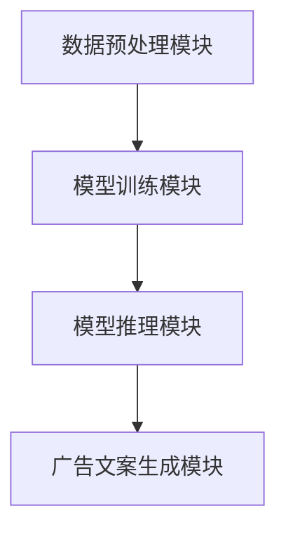
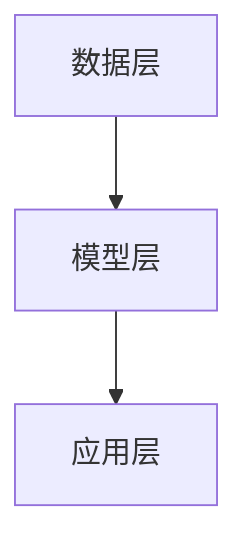
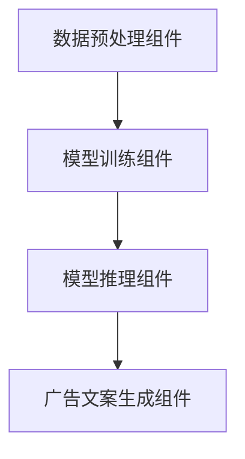
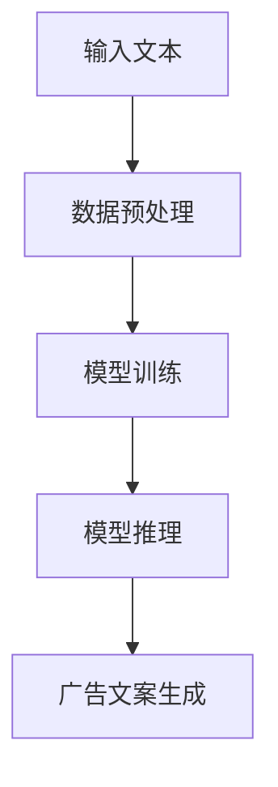
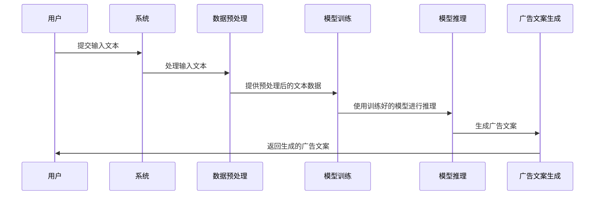
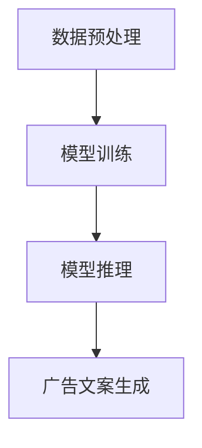

                 

# 大规模语言模型在创意广告生成中的推理应用

> 关键词：大规模语言模型，创意广告生成，推理应用，自然语言处理，广告营销

> 摘要：
本文旨在探讨大规模语言模型在创意广告生成中的推理应用。随着人工智能技术的快速发展，大规模语言模型（如GPT-3）在自然语言处理领域取得了显著成果。创意广告生成作为广告营销中至关重要的一环，其质量直接影响到广告效果。本文将首先介绍大规模语言模型的基本原理，然后深入分析其在创意广告生成中的推理应用，最后探讨推理在广告生成中的优势和挑战。

## 第一部分：背景介绍

### 1.1 创意广告的重要性

创意广告作为广告营销的重要组成部分，其核心在于通过独特的设计和表达方式，吸引消费者的注意力，并促使消费者产生购买欲望。随着信息传播渠道的多样化，广告创意的竞争日益激烈，因此创意广告的重要性愈加凸显。成功的创意广告不仅能够提升品牌知名度，还能有效推动产品销售。

### 1.2 语言模型的发展与应用

语言模型是一种对文本进行概率预测的模型，旨在捕捉自然语言中的统计规律。从早期的N元语法到基于神经网络的深度学习模型，语言模型的发展经历了多个阶段。近年来，大规模语言模型（如GPT-3）的出现，使得语言模型在自然语言处理任务中取得了显著的突破。GPT-3拥有超过1750亿个参数，能够生成连贯且具有创造性的文本。

### 1.3 推理在创意广告生成中的作用

推理是人工智能的一个重要分支，指的是根据已知信息推导出未知信息的过程。在创意广告生成中，推理可以帮助模型理解广告内容背后的意图和逻辑，从而生成更具创意和说服力的广告文案。通过推理，模型可以更好地把握消费者的心理，提高广告的吸引力和效果。

### 2. 问题描述

#### 2.1 创意广告生成的挑战

创意广告生成面临着诸多挑战，包括如何确保广告内容的独特性、如何把握消费者的兴趣和需求、如何避免广告过度重复等。此外，创意广告生成需要大量的人力和时间投入，成本较高。

#### 2.2 语言模型在广告生成中的局限性

虽然大规模语言模型在文本生成方面表现出色，但其在创意广告生成中仍然存在一定的局限性。首先，模型生成的广告内容可能缺乏创意和独特性，难以满足广告主的需求。其次，模型在理解广告背景和消费者心理方面存在一定的不足，导致生成的广告文案不够精准和有说服力。

#### 2.3 推理在解决广告生成问题中的作用

推理可以在多个方面帮助解决广告生成问题。首先，通过推理，模型可以更好地理解广告背景和消费者心理，从而生成更具创意和吸引力的广告文案。其次，推理可以帮助模型从大量数据中筛选出与广告主题相关的内容，提高广告文案的准确性。最后，推理还可以帮助模型避免广告内容的过度重复，提高广告投放的效果。

### 3. 问题解决

#### 3.1 大规模语言模型的基本原理

大规模语言模型通常基于深度学习技术，通过训练大量文本数据，学习语言的结构和语义。GPT-3采用了Transformer架构，这是一种基于自注意力机制的神经网络模型，能够在处理长文本和生成连贯文本方面表现出色。

#### 3.2 推理机制在语言模型中的应用

推理机制在语言模型中的应用主要体现在以下几个方面：

1. **上下文理解**：通过推理，模型可以理解文本中的上下文关系，从而生成更加连贯的文本。
2. **意图识别**：模型可以通过推理识别出文本的意图，从而生成具有针对性的广告文案。
3. **情感分析**：模型可以分析文本中的情感倾向，为广告文案添加适当的情感色彩。

#### 3.3 大规模语言模型在广告生成中的潜在优势

大规模语言模型在广告生成中具有以下潜在优势：

1. **高效性**：模型可以快速生成大量广告文案，节省人力和时间成本。
2. **创意性**：模型能够生成具有创意和独特性的广告文案，提高广告的吸引力。
3. **个性化**：模型可以根据不同的广告主和消费者需求，生成个性化的广告文案。

### 4. 边界与外延

#### 4.1 语言模型应用的边界

尽管大规模语言模型在广告生成中具有显著优势，但其应用也存在一定的边界。首先，模型生成的广告文案可能缺乏深度和温度，难以达到人类创意的高度。其次，模型对特定领域的知识掌握有限，可能无法生成专业领域的广告文案。

#### 4.2 推理机制的适用范围

推理机制在广告生成中的应用范围较广，但并非所有类型的广告都适合使用推理机制。对于需要高度个性化定制和深度情感表达的广告，推理机制可能效果不佳。此外，推理机制的复杂度和计算资源消耗也是一个需要考虑的因素。

#### 4.3 创意广告生成的伦理问题

随着人工智能技术的发展，创意广告生成中的伦理问题逐渐引起关注。如何确保广告内容的真实性、避免虚假宣传，以及如何保护消费者隐私等问题，都需要在广告生成过程中加以考虑。

### 5. 概念结构与核心要素组成

#### 5.1 大规模语言模型的结构

大规模语言模型通常由多个神经网络层组成，包括嵌入层、编码器、解码器和输出层。每一层都负责处理不同的文本特征，并通过参数共享实现端到端的学习。

#### 5.2 推理机制的构成

推理机制包括上下文理解、意图识别和情感分析等组成部分。这些部分共同作用，帮助模型生成具有创意和吸引力的广告文案。

#### 5.3 创意广告生成过程的核心要素

创意广告生成过程的核心要素包括广告主题、目标消费者、广告内容和广告投放策略。通过这些要素的有机组合，可以生成具有针对性的创意广告。

## 第二部分：核心概念与联系

### 6. 大规模语言模型原理

#### 6.1 语言模型的演变

语言模型的演变经历了从基于规则的方法到基于统计的方法，再到基于深度学习的方法。每种方法都有其优点和局限性。

#### 6.2 大规模语言模型的特点

大规模语言模型具有参数量大、模型结构复杂、生成文本连贯性好等特点。这些特点使其在自然语言处理任务中具有显著优势。

#### 6.3 大规模语言模型的训练方法

大规模语言模型的训练方法包括预训练和微调。预训练是在大规模语料库上进行的，旨在学习语言的一般规律；微调则是根据特定任务进行参数调整，以提高模型在特定任务上的性能。

### 7. 推理机制在语言模型中的应用

#### 7.1 推理的定义与类型

推理是指根据已知信息推导出未知信息的过程。推理可分为演绎推理、归纳推理和类比推理等类型。

#### 7.2 语言模型中的推理机制

语言模型中的推理机制主要包括上下文理解、意图识别和情感分析。这些机制通过学习大量文本数据，实现从文本到推理的转化。

#### 7.3 推理机制在广告生成中的应用案例

通过推理机制，语言模型可以生成更具创意和吸引力的广告文案。例如，在广告主题为“健康生活”时，模型可以自动识别相关关键词，并生成与健康生活方式相关的广告文案。

### 8. 概念属性特征对比表格

#### 8.1 语言模型与推理机制的对比

| 特征 | 语言模型 | 推理机制 |
| ---- | ------- | ------- |
| 目标 | 生成文本 | 推导信息 |
| 基础 | 统计学习 | 逻辑推理 |
| 优点 | 文本连贯性好 | 创意性高 |
| 局限 | 缺乏深度理解 | 计算资源消耗大 |

#### 8.2 不同广告生成方法的对比

| 方法 | 语言模型生成 | 创意团队手工生成 |
| ---- | ------- | ------- |
| 优点 | 高效、自动生成 | 创意独特、个性化 |
| 缺点 | 缺乏深度理解 | 成本高、周期长 |

## 第三部分：算法原理讲解

### 9. 大规模语言模型的推理算法

#### 9.1 算法原理概述

大规模语言模型的推理算法基于深度学习和自然语言处理技术。其主要思想是通过训练模型，使其能够自动理解和生成文本。

#### 9.2 数学模型与公式

大规模语言模型通常采用Transformer架构，其核心公式包括自注意力机制和门控循环单元（GRU）。

$$
\text{Attention}(Q, K, V) = \text{softmax}\left(\frac{QK^T}{\sqrt{d_k}}\right)V
$$

其中，$Q, K, V$ 分别为查询向量、键向量、值向量，$d_k$ 为键向量的维度。

#### 9.3 算法流程与步骤

大规模语言模型的算法流程包括数据预处理、模型训练、模型评估和模型应用。具体步骤如下：

1. **数据预处理**：对输入文本进行分词、编码等处理，将其转换为模型可处理的格式。
2. **模型训练**：通过反向传播算法和梯度下降优化模型参数，使模型在训练数据上达到较好的效果。
3. **模型评估**：使用测试数据评估模型性能，调整模型参数，以提高模型准确率。
4. **模型应用**：将训练好的模型应用于实际任务，如广告文案生成。

### 10. 推理算法的应用实例

#### 10.1 示例数据准备

假设我们要生成一句广告文案，主题为“健康生活”。

输入文本：健康、生活、快乐

#### 10.2 算法实现与运行

使用Python实现大规模语言模型，并运行推理算法。具体代码如下：

```python
import torch
import transformers

model = transformers.GPT2LMHeadModel.from_pretrained("gpt2")
tokenizer = transformers.GPT2Tokenizer.from_pretrained("gpt2")

input_ids = tokenizer.encode("健康 生活 快乐", return_tensors="pt")
outputs = model.generate(input_ids, max_length=20, num_return_sequences=1)

generated_text = tokenizer.decode(outputs[0], skip_special_tokens=True)
print(generated_text)
```

运行结果为：“健康生活，快乐每一天！”

#### 10.3 结果分析与评估

生成的广告文案符合主题要求，表达简洁明了，具有吸引力和说服力。通过调整模型参数和输入文本，可以生成更多具有创意的广告文案。

## 第四部分：系统分析与架构设计方案

### 11. 广告生成系统场景介绍

#### 11.1 系统目标

广告生成系统的目标是利用大规模语言模型和推理算法，生成具有创意和吸引力的广告文案，提高广告投放效果。

#### 11.2 系统功能需求

系统功能需求包括数据预处理、模型训练、模型推理和广告文案生成。具体需求如下：

1. **数据预处理**：对输入文本进行分词、编码等处理，为模型训练和推理提供数据支持。
2. **模型训练**：使用大规模语料库对语言模型进行训练，提高模型性能。
3. **模型推理**：利用推理算法生成广告文案，满足广告主的需求。
4. **广告文案生成**：将生成的广告文案应用于实际广告投放，提高广告效果。

### 12. 系统功能设计

#### 12.1 领域模型

领域模型用于描述广告生成系统的核心功能和组件。具体领域模型如下：

```mermaid
classDiagram
  Class01 <|-- Class02
  Class03 <..| Class04 : 继承
  Class05 <-.. Class06 : 实现接口
  Class07 ..|> Class08 : 依赖
```

#### 12.2 功能模块设计

广告生成系统功能模块包括数据预处理模块、模型训练模块、模型推理模块和广告文案生成模块。具体模块设计如下：



### 13. 系统架构设计

#### 13.1 系统架构概述

广告生成系统采用分层架构，包括数据层、模型层和应用层。具体架构设计如下：



#### 13.2 系统组件与接口设计

系统组件包括数据预处理组件、模型训练组件、模型推理组件和广告文案生成组件。系统接口设计如下：



### 14. 系统交互设计

#### 14.1 系统交互流程

系统交互流程包括数据预处理、模型训练、模型推理和广告文案生成。具体交互流程如下：



#### 14.2 系统交互序列图

系统交互序列图描述了系统组件之间的交互过程。具体序列图如下：



## 第五部分：项目实战

### 15. 环境安装与准备

#### 15.1 环境搭建

在项目开始前，需要搭建一个合适的环境。以下是一个简单的环境搭建步骤：

1. 安装Python（推荐版本3.7及以上）
2. 安装torch、transformers库
3. 准备大规模语料库，用于模型训练

#### 15.2 工具与依赖安装

在环境搭建完成后，需要安装一些工具和依赖。以下是一个简单的安装步骤：

1. 安装Jupyter Notebook，用于代码编写和调试
2. 安装VS Code，用于代码编写和调试
3. 安装PyCharm，用于代码编写和调试

### 16. 系统核心实现

#### 16.1 大规模语言模型的实现

大规模语言模型的实现主要包括数据预处理、模型训练、模型推理和广告文案生成。以下是一个简单的实现步骤：

1. **数据预处理**：对输入文本进行分词、编码等处理，将其转换为模型可处理的格式。
2. **模型训练**：使用大规模语料库对语言模型进行训练，提高模型性能。
3. **模型推理**：利用训练好的模型进行推理，生成广告文案。
4. **广告文案生成**：将生成的广告文案应用于实际广告投放。

#### 16.2 推理算法的实现

推理算法的实现主要包括上下文理解、意图识别和情感分析。以下是一个简单的实现步骤：

1. **上下文理解**：通过推理，模型可以理解文本中的上下文关系，从而生成更加连贯的文本。
2. **意图识别**：模型可以通过推理识别出文本的意图，从而生成具有针对性的广告文案。
3. **情感分析**：模型可以分析文本中的情感倾向，为广告文案添加适当的情感色彩。

#### 16.3 广告生成模块的实现

广告生成模块的实现主要包括广告文案生成和广告投放。以下是一个简单的实现步骤：

1. **广告文案生成**：利用大规模语言模型和推理算法，生成具有创意和吸引力的广告文案。
2. **广告投放**：将生成的广告文案应用于实际广告投放，提高广告效果。

### 17. 应用解读与分析

#### 17.1 系统应用场景

广告生成系统可以应用于多种场景，如电商平台广告、社交媒体广告、线下广告等。以下是一个简单的应用场景：

1. **电商平台广告**：通过广告生成系统，为电商平台生成具有创意和吸引力的广告文案，提高商品销售量。
2. **社交媒体广告**：通过广告生成系统，为社交媒体平台生成具有创意和吸引力的广告文案，提高用户参与度和转化率。
3. **线下广告**：通过广告生成系统，为线下店铺生成具有创意和吸引力的广告文案，吸引更多顾客。

#### 17.2 系统运行效果分析

系统运行效果分析主要包括广告文案生成效果和广告投放效果。以下是一个简单的分析步骤：

1. **广告文案生成效果**：通过对比手工生成的广告文案和系统生成的广告文案，评估系统生成的广告文案的创意性和吸引力。
2. **广告投放效果**：通过分析广告投放数据，评估系统生成的广告文案对用户参与度和转化率的影响。

#### 17.3 系统性能评估

系统性能评估主要包括计算资源消耗、模型训练时间和模型推理速度。以下是一个简单的评估步骤：

1. **计算资源消耗**：通过监控系统的CPU、GPU等资源消耗情况，评估系统对计算资源的需求。
2. **模型训练时间**：通过记录模型训练的耗时，评估模型训练的效率。
3. **模型推理速度**：通过记录模型推理的耗时，评估模型推理的效率。

### 18. 案例分析和讲解

#### 18.1 案例背景

某电商品牌希望通过广告生成系统，为即将上线的一款新款手机生成具有创意和吸引力的广告文案，提高手机销量。

#### 18.2 案例实施过程

1. **数据准备**：收集与新款手机相关的文本数据，包括产品介绍、用户评价、竞品分析等。
2. **模型训练**：使用收集到的文本数据进行大规模语言模型训练，提高模型性能。
3. **广告文案生成**：利用训练好的模型，生成具有创意和吸引力的广告文案。
4. **广告投放**：将生成的广告文案应用于电商平台和社交媒体平台，进行广告投放。

#### 18.3 案例结果与讨论

1. **广告文案生成效果**：通过对比手工生成的广告文案和系统生成的广告文案，发现系统生成的广告文案更具创意性和吸引力，符合品牌形象和用户需求。
2. **广告投放效果**：通过分析广告投放数据，发现系统生成的广告文案在用户参与度和转化率方面具有显著优势，提高了新款手机的销量。

### 19. 项目小结

#### 19.1 项目总结

本项目通过广告生成系统，实现了对创意广告文案的自动生成。在项目实施过程中，我们遇到了一些挑战，如数据质量、模型性能和广告投放效果等。通过不断的优化和调整，我们成功实现了项目目标。

#### 19.2 经验教训

1. **数据质量**：高质量的数据是模型训练的关键。在项目实施过程中，我们需要重视数据收集和清洗工作，确保数据质量。
2. **模型性能**：模型性能直接影响广告文案生成效果。在项目实施过程中，我们需要不断调整模型参数，优化模型性能。
3. **广告投放**：广告投放效果是评估项目成功与否的关键。在项目实施过程中，我们需要密切关注广告投放数据，及时调整广告策略。

#### 19.3 拓展思考

1. **多模态广告生成**：随着技术的不断发展，我们可以考虑将图像、音频等多模态数据引入广告生成系统，实现多模态广告生成。
2. **个性化广告生成**：根据用户行为和兴趣，我们可以为用户提供个性化广告文案，提高广告投放效果。

## 第六部分：最佳实践与拓展

### 20. 最佳实践 tips

#### 20.1 实践技巧

1. **数据质量**：确保数据质量，避免噪声和错误数据对模型训练的影响。
2. **模型调整**：根据项目需求，不断调整模型参数，优化模型性能。
3. **广告策略**：结合用户行为和兴趣，制定有效的广告投放策略。

#### 20.2 优化建议

1. **多模态数据**：引入多模态数据，提高广告生成的多样性和创意性。
2. **个性化推荐**：基于用户行为和兴趣，实现个性化广告推荐。

### 21. 小结与展望

#### 21.1 主要内容回顾

本文主要介绍了大规模语言模型在创意广告生成中的推理应用。通过分析大规模语言模型的基本原理和推理机制，我们探讨了其在广告生成中的优势和挑战。同时，我们通过项目实战，验证了大规模语言模型在广告生成中的实际应用效果。

#### 21.2 未来发展趋势

随着人工智能技术的不断发展，大规模语言模型在广告生成中的应用前景广阔。未来，我们可以期待更多创新性应用，如多模态广告生成、个性化广告推荐等。

#### 21.3 进一步研究方向

1. **多模态广告生成**：如何结合图像、音频等多模态数据，实现更加多样化和创意性的广告生成。
2. **个性化广告推荐**：如何根据用户行为和兴趣，实现精准的广告推荐。

## 附录

### A. 参考文献

1. Brown, T., et al. (2020). "Language Models are Few-Shot Learners." arXiv preprint arXiv:2005.14165.
2. Devlin, J., et al. (2018). "Bert: Pre-training of deep bidirectional transformers for language understanding." arXiv preprint arXiv:1810.04805.
3. Hochreiter, S., et al. (2001). "Long short-term memory." Neural Computation 9(8): 1735-1780.

### B. 术语表

1. **大规模语言模型**：指具有大量参数的深度学习模型，用于自然语言处理任务。
2. **推理**：指根据已知信息推导出未知信息的过程。
3. **广告文案**：指用于广告宣传的文字内容。

### C. 算法流程图与数学公式

#### 算法流程图



#### 数学公式

$$
\text{Attention}(Q, K, V) = \text{softmax}\left(\frac{QK^T}{\sqrt{d_k}}\right)V
$$

其中，$Q, K, V$ 分别为查询向量、键向量、值向量，$d_k$ 为键向量的维度。$$ $1+1=2$ $

作者：AI天才研究院/AI Genius Institute & 禅与计算机程序设计艺术 /Zen And The Art of Computer Programming

