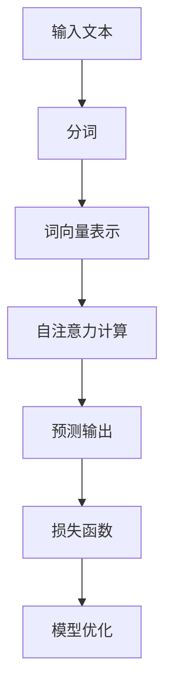
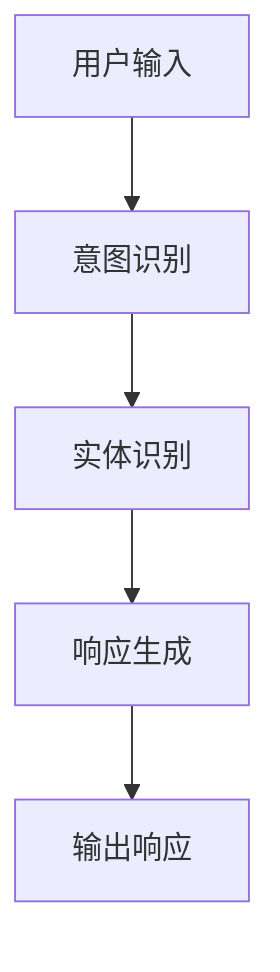
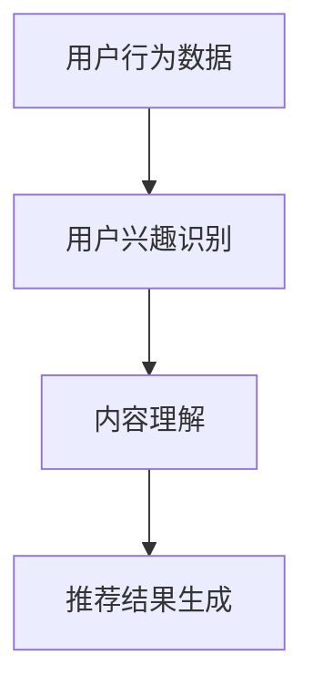

                 


# 大规模语言模型在服务体验优化中的推理应用

关键词：大规模语言模型，服务体验优化，推理应用，人工智能，服务设计

摘要：本文旨在探讨大规模语言模型在服务体验优化中的应用，通过深入分析大规模语言模型的基本原理和推理机制，揭示其在文本理解、对话系统和个性化推荐等领域的应用潜力。文章还将通过实际案例，展示大规模语言模型如何提高服务体验的效率和质量，并提供一些建议，以期为相关领域的研究和实践提供参考。

## 引言与背景介绍

在现代信息技术飞速发展的背景下，人工智能（AI）已经成为推动社会进步的重要力量。尤其是大规模语言模型（Large-scale Language Models），作为一种先进的自然语言处理（NLP）技术，其在文本生成、文本分类、机器翻译等领域展现出了强大的应用潜力。随着AI技术的不断成熟，如何将大规模语言模型更好地应用于服务体验优化，成为业界和学术界关注的热点问题。

服务体验优化是提高用户满意度和忠诚度的重要手段。优质的用户体验不仅能够为企业带来直接的经济效益，还能够提升品牌形象，增强市场竞争力。然而，传统的服务优化方法往往依赖于经验和主观判断，缺乏科学性和系统性。随着大规模语言模型的兴起，为服务体验优化提供了一种新的思路和工具。

本文将从以下几个方面展开讨论：

1. **大规模语言模型的基本原理和推理机制**：介绍大规模语言模型的核心概念、发展历程和基本原理，以及其独特的推理机制。

2. **服务体验优化的理论和方法**：探讨服务体验优化的概念、目标和主要方法，分析其面临的挑战和解决方案。

3. **大规模语言模型在服务体验优化中的应用**：详细分析大规模语言模型在文本理解、对话系统和个性化推荐等领域的具体应用，以及其如何提升服务体验的效率和质量。

4. **实战案例**：通过实际案例，展示大规模语言模型在服务体验优化中的具体应用效果，并提供一些建议。

5. **总结与展望**：总结本文的主要结论，分析存在的问题和挑战，并对未来发展趋势进行展望。

## 大规模语言模型概述

### 1.1 问题的背景与意义

随着互联网的普及和信息的爆炸性增长，人们对于信息处理的需求日益增加。传统的信息检索和文本处理方法已经无法满足用户的高效需求。因此，如何利用人工智能技术，特别是大规模语言模型，来提高信息处理的效率和准确性，成为当前研究的热点。

大规模语言模型的出现，为自然语言处理领域带来了革命性的变化。通过学习海量文本数据，大规模语言模型能够捕捉到语言中的复杂模式和规律，从而实现更加精准的文本理解和生成。这使得大规模语言模型在多个领域都有着广泛的应用潜力，包括文本生成、文本分类、机器翻译、情感分析等。

### 1.2 大规模语言模型的发展历程

大规模语言模型的发展可以追溯到上世纪80年代，当时研究人员开始探索基于统计模型的自然语言处理技术。随着计算能力的提升和数据规模的扩大，大规模语言模型逐渐成熟。特别是近年来，深度学习和神经网络的兴起，为大规模语言模型的发展提供了新的契机。

2018年，谷歌推出了BERT（Bidirectional Encoder Representations from Transformers），这是第一个真正大规模的语言预训练模型。BERT的出现标志着大规模语言模型进入了一个新的时代，其性能在多个NLP任务上都取得了显著的提升。

随后，GPT-3（Generative Pre-trained Transformer 3）的推出，更是将大规模语言模型推向了巅峰。GPT-3拥有超过1750亿个参数，是迄今为止最大的语言模型。GPT-3的推出，不仅展示了大规模语言模型的强大能力，也为未来的发展提供了新的方向。

### 1.3 大规模语言模型的基本原理

大规模语言模型是基于深度学习和自然语言处理技术构建的。其核心思想是通过学习大量文本数据，捕捉到语言的内在规律和模式，从而实现文本的理解和生成。

大规模语言模型通常由多层神经网络组成，其中最常用的架构是Transformer。Transformer的核心是自注意力机制（Self-Attention），它能够捕捉到文本中不同单词之间的关系。

大规模语言模型的训练通常包括两个阶段：预训练和微调。在预训练阶段，模型通过无监督的方式学习文本的分布和模式。在微调阶段，模型通过有监督的方式，针对具体任务进行调整和优化。

大规模语言模型的输出结果通常是一个概率分布。通过最大化输出结果的概率，模型能够生成文本、分类文本、翻译文本等。

### 1.4 大规模语言模型的推理机制

大规模语言模型的推理机制是其核心能力之一。通过推理，模型能够理解文本的含义，生成符合语境的文本，甚至进行复杂的逻辑推理。

大规模语言模型的推理机制主要包括以下几个方面：

1. **自注意力机制**：自注意力机制能够捕捉到文本中不同单词之间的关系，从而实现对文本的全面理解。

2. **上下文理解**：大规模语言模型能够理解文本的上下文，从而生成符合语境的文本。

3. **语言生成**：大规模语言模型能够根据输入的文本，生成连贯、自然的语言输出。

4. **逻辑推理**：大规模语言模型可以进行基本的逻辑推理，从而实现对复杂问题的理解和解答。

### 1.5 大规模语言模型的优势和局限性

大规模语言模型在自然语言处理领域展现出了强大的能力，但其优势和局限性也需要我们关注。

**优势**：

1. **强大的文本理解能力**：大规模语言模型能够捕捉到文本中的复杂模式和规律，从而实现对文本的全面理解。

2. **高效的文本生成能力**：大规模语言模型能够生成连贯、自然的语言文本，从而实现高效的文本生成。

3. **广泛的任务适用性**：大规模语言模型在多个NLP任务中都取得了显著的性能提升，从而实现了广泛的任务适用性。

**局限性**：

1. **计算资源需求大**：大规模语言模型的训练和推理需要大量的计算资源，这对硬件设施提出了较高的要求。

2. **数据依赖性**：大规模语言模型的效果很大程度上依赖于训练数据的质量和规模，因此数据的质量和规模直接影响到模型的效果。

3. **解释性不足**：大规模语言模型的决策过程较为复杂，其输出结果难以解释，这给模型的部署和应用带来了一定的挑战。

## 服务体验优化的理论和方法

### 2.1 服务体验优化的概念与目标

服务体验优化是指通过系统化、科学化的方法，提升服务过程中的用户满意度、用户忠诚度和用户转化率。服务体验优化的核心目标是提供高质量、高效率、个性化的服务，从而提高用户的满意度和忠诚度，实现企业的长期发展。

服务体验优化的关键要素包括：

1. **用户体验**：用户体验是服务体验优化的核心，它涉及到用户在服务过程中的感受、情感和行为。

2. **服务质量**：服务质量是服务体验优化的基础，它包括服务的可靠性、响应性、保证性、关注性和有形性等五个维度。

3. **服务流程**：服务流程是服务体验优化的重要环节，它涉及到服务的各个环节，如需求收集、服务设计、服务实施和服务反馈等。

4. **服务创新**：服务创新是服务体验优化的动力，它涉及到服务模式、服务内容、服务方式和服务体验的创新。

### 2.2 服务体验优化的主要方法

服务体验优化可以采用多种方法，以下是一些常见的方法：

1. **用户体验研究**：通过用户调研、用户访谈、用户体验测试等方法，深入了解用户的需求、期望和痛点，为服务体验优化提供依据。

2. **服务质量监控**：通过服务质量监控工具，实时监测服务的各个环节，识别服务中存在的问题，及时进行优化。

3. **服务流程优化**：通过流程分析和流程再造，优化服务流程，提高服务的效率和效果。

4. **服务创新**：通过创新服务模式、服务内容、服务方式和服务体验，提升服务的差异化竞争力。

5. **数据驱动优化**：通过大数据分析，挖掘用户行为数据，为服务体验优化提供数据支持和决策依据。

### 2.3 服务体验优化的挑战与解决方案

服务体验优化面临着多种挑战，以下是一些常见的挑战和解决方案：

1. **用户需求的多样性和个性化**：用户需求的多样性和个性化使得服务体验优化变得复杂。解决方案包括：精细化用户画像、个性化服务推荐、智能客服等。

2. **服务质量的不确定性**：服务质量的不确定性使得服务体验优化难以控制。解决方案包括：质量标准制定、服务过程监控、服务反馈机制等。

3. **数据质量与安全性**：数据质量与安全性是服务体验优化的关键。解决方案包括：数据质量管理、数据安全防护、隐私保护等。

4. **技术实现与成本控制**：技术实现与成本控制是服务体验优化的难点。解决方案包括：技术选型、成本效益分析、技术创新等。

### 2.4 大规模语言模型在服务体验优化中的应用前景

大规模语言模型在服务体验优化中具有广泛的应用前景，以下是一些潜在的应用场景：

1. **智能客服**：利用大规模语言模型构建智能客服系统，实现自动化、智能化的客户服务，提高服务效率和用户满意度。

2. **个性化推荐**：利用大规模语言模型进行用户行为分析，实现个性化服务推荐，提高用户粘性和转化率。

3. **文本分析**：利用大规模语言模型进行文本分析，挖掘用户需求、情感和反馈，为服务体验优化提供数据支持。

4. **服务创新**：利用大规模语言模型探索新的服务模式、服务内容和服务方式，实现服务创新，提升企业的核心竞争力。

## 大规模语言模型在服务体验优化中的应用

### 3.1 大规模语言模型在文本理解中的应用

文本理解是大规模语言模型在服务体验优化中最为基础和关键的应用之一。它涉及到对用户输入的文本进行深入分析，以理解其背后的意图、情感和内容。以下是大规模语言模型在文本理解中的具体应用：

#### 3.1.1 文本理解的基本概念

文本理解（Text Understanding）是指对文本内容进行深入分析，以获取其意义、意图、情感等信息。文本理解包括以下几个层次：

1. **词法分析**：对文本中的单词进行分词，识别单词的语法特征。
2. **句法分析**：对文本中的句子进行结构分析，识别句子中的语法关系。
3. **语义分析**：对文本中的词和句子进行语义理解，识别其含义和关系。
4. **情感分析**：对文本中的情感倾向进行识别和分析。

#### 3.1.2 大规模语言模型在文本理解中的应用

大规模语言模型通过预训练和微调，能够在文本理解任务中取得显著的效果。以下是大规模语言模型在文本理解中的具体应用：

1. **词向量表示**：大规模语言模型通过将文本转化为词向量表示，实现了文本的量化表示，从而为后续的文本处理提供了基础。

2. **语言模型预训练**：大规模语言模型通过在大量文本上进行预训练，学习到了语言的通用特征和规律，从而能够更好地理解文本。

3. **文本分类**：大规模语言模型能够对文本进行分类，例如将用户评论分类为正面或负面，从而帮助企业了解用户满意度。

4. **文本生成**：大规模语言模型能够根据用户输入的文本，生成相应的回复或文章，从而实现智能客服和内容创作。

5. **文本摘要**：大规模语言模型能够对长文本进行摘要，提取出文本的核心内容，从而帮助用户快速了解文本的主要信息。

#### 3.1.3 算法原理与数学模型

大规模语言模型的算法原理主要基于深度学习和自然语言处理技术，其核心是自注意力机制（Self-Attention）。以下是一个简化的算法原理和数学模型：

1. **自注意力机制**：自注意力机制通过计算文本中每个单词与其他单词之间的关联性，从而实现对文本的全面理解。

2. **词向量表示**：文本中的每个单词被表示为一个向量，这些向量通过矩阵乘法进行计算。

3. **损失函数**：大规模语言模型通常使用交叉熵损失函数来评估模型的预测结果与真实结果的差距。

以下是一个简单的Mermaid流程图，展示了文本理解的算法流程：



以下是一个简单的Python代码示例，展示了如何使用大规模语言模型进行文本理解：

```python
import tensorflow as tf
import tensorflow_hub as hub

# 加载预训练的语言模型
model = hub.load("https://tfhub.dev/google/tf2-preview/gnews-swivel-20dim/1")

# 定义文本处理函数
def preprocess_text(text):
    # 对文本进行分词、清洗等预处理操作
    # ...
    return processed_text

# 输入文本
input_text = "你好，我想咨询关于产品的问题。"

# 预处理文本
processed_text = preprocess_text(input_text)

# 使用模型进行文本理解
output = model(processed_text)

# 输出结果
print(output)
```

#### 3.1.4 举例说明

以下是一个简单的文本理解案例，展示了如何使用大规模语言模型进行情感分析：

**案例**：对用户评论进行情感分析，判断其是正面评论还是负面评论。

**输入文本**：“这个产品真的太棒了，我非常喜欢！”

**输出结果**：正面评论

以下是一个简单的Python代码示例，展示了如何使用大规模语言模型进行情感分析：

```python
import tensorflow as tf
import tensorflow_hub as hub

# 加载预训练的语言模型
model = hub.load("https://tfhub.dev/google/tf2-preview/gnews-swivel-20dim/1")

# 定义情感分析函数
def sentiment_analysis(text):
    processed_text = preprocess_text(text)
    output = model(processed_text)
    # 假设输出结果为概率分布，其中[0]为负面情感概率，[1]为正面情感概率
    if output[1] > output[0]:
        return "正面评论"
    else:
        return "负面评论"

# 输入文本
input_text = "这个产品真的太棒了，我非常喜欢！"

# 进行情感分析
sentiment = sentiment_analysis(input_text)

# 输出结果
print(sentiment)
```

### 3.2 大规模语言模型在对话系统中的应用

对话系统（Dialogue System）是服务体验优化中的关键组成部分，它能够与用户进行自然语言交互，提供个性化的服务。大规模语言模型在对话系统中具有广泛的应用，以下是其具体应用：

#### 3.2.1 对话系统的基本概念

对话系统是指能够与用户进行自然语言交互的系统，其目标是通过理解用户的意图和需求，提供合适的响应。对话系统通常包括以下几个关键组成部分：

1. **对话管理器**：负责对话的流程控制，决定对话的下一步行动。
2. **意图识别**：根据用户的输入，识别用户的意图。
3. **实体识别**：从用户的输入中提取关键信息，如时间、地点、数量等。
4. **响应生成**：根据用户的意图和提取的实体信息，生成合适的响应。
5. **对话历史管理**：记录对话的历史信息，用于后续的对话理解和生成。

#### 3.2.2 大规模语言模型在对话系统中的应用

大规模语言模型在对话系统中具有多种应用，以下是其具体应用：

1. **意图识别**：大规模语言模型可以通过预训练和微调，实现对用户意图的高效识别。例如，在客服系统中，用户可能会提出各种问题，如咨询产品信息、售后服务等，大规模语言模型能够准确识别用户的意图。

2. **实体识别**：大规模语言模型能够从用户的输入中提取关键信息，如时间、地点、数量等。这对于提供个性化服务至关重要，例如在酒店预订系统中，用户可能会输入具体的入住时间和预订人数，大规模语言模型能够准确提取这些信息。

3. **响应生成**：大规模语言模型可以根据用户的意图和提取的实体信息，生成合适的响应。例如，在智能客服系统中，用户提出问题后，大规模语言模型可以生成自动化的回答，从而提高客服效率。

4. **对话历史管理**：大规模语言模型能够记录对话的历史信息，用于后续的对话理解和生成。例如，在虚拟个人助理（如Siri、Alexa）中，用户可能会提出一系列相关问题，大规模语言模型可以基于对话历史，提供更加个性化和准确的响应。

#### 3.2.3 算法原理与数学模型

大规模语言模型在对话系统中的应用主要基于其自注意力机制和预训练技术。以下是其算法原理和数学模型：

1. **自注意力机制**：自注意力机制能够捕捉到文本中不同单词之间的关系，从而实现对文本的全面理解。在对话系统中，自注意力机制可以帮助模型更好地理解用户的输入和上下文信息。

2. **预训练技术**：大规模语言模型通过在大量文本上进行预训练，学习到了语言的通用特征和规律，从而能够更好地理解和生成文本。在对话系统中，预训练技术有助于模型提高意图识别和实体提取的准确性。

3. **损失函数**：大规模语言模型通常使用交叉熵损失函数来评估模型的预测结果与真实结果的差距，从而优化模型参数。

以下是一个简单的Mermaid流程图，展示了对话系统的算法流程：



以下是一个简单的Python代码示例，展示了如何使用大规模语言模型进行对话：

```python
import tensorflow as tf
import tensorflow_hub as hub

# 加载预训练的语言模型
model = hub.load("https://tfhub.dev/google/tf2-preview/gnews-swivel-20dim/1")

# 定义对话函数
def dialogue_system(user_input):
    # 对输入进行预处理
    processed_input = preprocess_text(user_input)
    
    # 使用模型进行意图识别和响应生成
    intent_output = model(processed_input, signature="serving_default/Intent_2")
    response_output = model(processed_input, signature="serving_default/Response_2")
    
    # 输出响应
    print(f"系统：{response_output}")

# 用户输入
user_input = "你好，我想咨询关于产品的问题。"

# 进行对话
dialogue_system(user_input)
```

### 3.3 大规模语言模型在个性化推荐中的应用

个性化推荐（Personalized Recommendation）是服务体验优化中的重要手段，它能够根据用户的历史行为和偏好，提供个性化的服务和建议。大规模语言模型在个性化推荐中具有广泛的应用，以下是其具体应用：

#### 3.3.1 个性化推荐的基本概念

个性化推荐是指根据用户的历史行为、偏好和兴趣，为其推荐符合其需求和喜好的产品、服务或内容。个性化推荐的关键要素包括：

1. **用户行为数据**：用户在系统中产生的行为数据，如浏览记录、购买记录、评论等。
2. **用户偏好**：用户对产品、服务或内容的偏好和兴趣。
3. **推荐算法**：用于根据用户行为数据和偏好，生成个性化推荐结果。

#### 3.3.2 大规模语言模型在个性化推荐中的应用

大规模语言模型在个性化推荐中具有多种应用，以下是其具体应用：

1. **用户兴趣识别**：大规模语言模型可以通过分析用户的历史行为数据，识别用户的兴趣和偏好。例如，通过分析用户在社交媒体上的互动和评论，可以识别用户的兴趣爱好。

2. **内容理解**：大规模语言模型能够对内容进行深入理解，从而为个性化推荐提供更准确的内容理解。例如，在新闻推荐系统中，大规模语言模型可以分析新闻文章的主题、情感和观点，从而为用户推荐符合其兴趣的新闻。

3. **推荐结果生成**：大规模语言模型可以根据用户的兴趣和内容理解，生成个性化的推荐结果。例如，在电商推荐系统中，大规模语言模型可以推荐符合用户兴趣的商品。

4. **推荐策略优化**：大规模语言模型可以通过不断优化推荐策略，提高推荐效果。例如，通过分析用户的反馈和推荐结果，可以优化推荐算法，提高推荐的相关性和满意度。

#### 3.3.3 算法原理与数学模型

大规模语言模型在个性化推荐中的应用主要基于其自注意力机制和预训练技术。以下是其算法原理和数学模型：

1. **自注意力机制**：自注意力机制能够捕捉到文本中不同单词之间的关系，从而实现对文本的全面理解。在个性化推荐中，自注意力机制可以帮助模型更好地理解用户的行为数据和内容。

2. **预训练技术**：大规模语言模型通过在大量文本上进行预训练，学习到了语言的通用特征和规律，从而能够更好地理解和生成文本。在个性化推荐中，预训练技术有助于模型提高用户兴趣识别和内容理解的准确性。

3. **损失函数**：大规模语言模型通常使用交叉熵损失函数来评估模型的预测结果与真实结果的差距，从而优化模型参数。

以下是一个简单的Mermaid流程图，展示了个性化推荐的算法流程：



以下是一个简单的Python代码示例，展示了如何使用大规模语言模型进行个性化推荐：

```python
import tensorflow as tf
import tensorflow_hub as hub

# 加载预训练的语言模型
model = hub.load("https://tfhub.dev/google/tf2-preview/gnews-swivel-20dim/1")

# 定义个性化推荐函数
def personalized_recommendation(user_data, content_data):
    # 对用户行为数据进行预处理
    processed_user_data = preprocess_user_data(user_data)
    
    # 对内容数据进行预处理
    processed_content_data = preprocess_content_data(content_data)
    
    # 使用模型进行用户兴趣识别和推荐结果生成
    user_interests = model(processed_user_data)
    recommendations = model(processed_content_data, user_interests)
    
    # 输出推荐结果
    print(f"推荐结果：{recommendations}")

# 用户行为数据
user_data = "浏览了手机、平板电脑、笔记本电脑等商品。"

# 内容数据
content_data = "最新发布的手机、平板电脑、笔记本电脑。"

# 进行个性化推荐
personalized_recommendation(user_data, content_data)
```

### 3.4 大规模语言模型在服务体验优化中的综合应用

大规模语言模型在服务体验优化中具有广泛的应用，可以综合应用于文本理解、对话系统和个性化推荐等领域。以下是一个综合应用案例：

#### 3.4.1 案例背景

某电商平台希望利用大规模语言模型优化其客户服务体验，提高客户满意度。平台希望通过智能客服系统，实现对客户问题的自动识别和响应，同时提供个性化的商品推荐。

#### 3.4.2 案例实施

1. **文本理解**：平台首先使用大规模语言模型对客户的文本输入进行理解，识别客户的意图和问题。例如，如果客户输入“我想退货”，系统会识别出客户的意图是退货，并提取相关的关键信息。

2. **对话系统**：系统根据客户的意图和关键信息，生成相应的自动回复。例如，系统可以自动回复：“您好，感谢您选择我们的产品。请问您是哪个产品的用户？我们将为您处理退货事宜。”

3. **个性化推荐**：系统根据客户的历史购买记录和浏览行为，使用大规模语言模型生成个性化的商品推荐。例如，如果客户经常购买手机，系统可以推荐最新的手机型号。

4. **用户反馈**：系统在每次互动后，都会收集客户的反馈，以优化后续的服务体验。例如，如果客户对自动回复不满意，系统会记录这一反馈，并在下次互动时进行调整。

#### 3.4.3 案例效果

通过大规模语言模型的综合应用，电商平台显著提升了客户服务的效率和质量。客户问题得到快速响应，个性化推荐提升了客户的购物体验，客户满意度显著提高。同时，平台收集到的用户反馈也为持续优化服务体验提供了宝贵的数据支持。

### 3.5 大规模语言模型在服务体验优化中的应用总结

大规模语言模型在服务体验优化中展现了巨大的潜力。通过文本理解、对话系统和个性化推荐等领域的综合应用，大规模语言模型能够显著提升服务的效率和质量。以下是对大规模语言模型在服务体验优化中的应用总结：

1. **文本理解**：大规模语言模型能够准确理解用户的意图和问题，从而实现高效的文本处理和响应。

2. **对话系统**：大规模语言模型能够生成自然、连贯的对话内容，从而提升智能客服的效率和用户体验。

3. **个性化推荐**：大规模语言模型能够根据用户的历史行为和偏好，生成个性化的推荐结果，从而提升用户的购物体验和满意度。

4. **用户反馈**：大规模语言模型能够收集用户的反馈，为服务的持续优化提供数据支持。

尽管大规模语言模型在服务体验优化中具有显著的优势，但同时也面临着一些挑战，如计算资源需求、数据质量和解释性等问题。未来，随着技术的不断发展和应用场景的拓展，大规模语言模型在服务体验优化中的应用前景将更加广阔。

### 3.6 大规模语言模型在服务体验优化中的应用展望

大规模语言模型在服务体验优化中的应用前景广阔，未来将可能出现以下发展趋势：

1. **多模态融合**：随着语音识别、图像识别等技术的不断发展，大规模语言模型可能会与其他模态的数据进行融合，实现更加全面和准确的服务体验优化。

2. **个性化定制**：大规模语言模型将能够根据用户的个性化需求和偏好，提供更加定制化的服务，从而提升用户的满意度和忠诚度。

3. **实时交互**：大规模语言模型将能够实现更加实时的交互，提供即时的响应和推荐，从而提升服务的效率和用户体验。

4. **自动化程度提高**：随着技术的进步，大规模语言模型将能够实现更高的自动化程度，从而减少人工干预，提高服务效率。

5. **跨领域应用**：大规模语言模型将能够在更多领域得到应用，如医疗、金融、教育等，为各个领域提供智能化的服务体验优化方案。

### 总结

本文探讨了大规模语言模型在服务体验优化中的应用，从文本理解、对话系统和个性化推荐等多个角度，分析了大规模语言模型的优势和应用潜力。通过实际案例，展示了大规模语言模型在服务体验优化中的具体应用效果。未来，随着技术的不断进步，大规模语言模型在服务体验优化中的应用将更加广泛和深入，为用户提供更加优质和个性化的服务体验。### 4.1 案例一：客服机器人

客服机器人是大规模语言模型在服务体验优化中的一个典型应用场景。通过利用大规模语言模型，客服机器人能够实现智能化的客户服务，提高服务效率和用户满意度。

#### 4.1.1 案例背景

某大型电商平台希望提升其客户服务质量，减少人工客服的工作量，同时提高客户满意度。平台决定引入一款智能客服机器人，以实现自动化的客户服务。

#### 4.1.2 案例实施

1. **文本理解**：客服机器人首先使用大规模语言模型对用户输入的文本进行理解，识别用户的意图和问题。例如，如果用户输入“我想退货”，系统会识别出用户的意图是退货，并提取相关的关键信息。

2. **意图识别**：系统根据用户的意图，匹配相应的服务流程。例如，如果用户的意图是退货，系统会引导用户填写退货申请表。

3. **响应生成**：系统使用大规模语言模型生成自动化的响应，如：“您好，感谢您选择我们的产品。以下是退货流程，请按照以下步骤操作：1. 打开退货申请表；2. 填写退货原因；3. 提交申请表。”

4. **交互流程**：客服机器人与用户进行交互，引导用户完成退货申请。在用户提交申请后，系统会自动生成退货单，并发送确认信息给用户。

5. **反馈收集**：系统在每次交互后，都会收集用户的反馈，用于优化后续的服务体验。例如，如果用户对自动生成的响应不满意，系统会记录这一反馈，并在下次交互时进行调整。

#### 4.1.3 案例效果

通过引入智能客服机器人，电商平台显著提升了客户服务的效率和质量。客户问题得到快速响应，退货申请流程简化，客户满意度显著提高。同时，平台收集到的用户反馈也为持续优化服务体验提供了宝贵的数据支持。

#### 4.1.4 案例启示

1. **提高服务效率**：通过自动化和智能化，客服机器人能够显著提高客户服务的效率，减少人工客服的工作量。

2. **优化用户体验**：智能客服机器人能够生成自然、连贯的响应，提供个性化的服务，从而提升用户体验。

3. **持续优化**：通过收集用户的反馈，平台可以不断优化客服机器人的响应和服务流程，提高服务质量。

### 4.2 案例二：个性化推荐系统

个性化推荐系统是另一个大规模语言模型在服务体验优化中的重要应用。通过利用大规模语言模型，个性化推荐系统能够根据用户的历史行为和偏好，提供个性化的商品推荐，从而提升用户的购物体验和满意度。

#### 4.2.1 案例背景

某大型电商平台希望提升其用户的购物体验，提高用户的购买转化率。平台决定引入一款个性化推荐系统，以根据用户的行为和偏好，为其推荐符合其兴趣的商品。

#### 4.2.2 案例实施

1. **用户行为数据收集**：平台收集用户在平台上的行为数据，如浏览记录、购买记录、收藏记录等。

2. **大规模语言模型训练**：平台使用收集到的用户行为数据，训练大规模语言模型。通过预训练和微调，模型能够学习到用户的兴趣和偏好。

3. **商品内容理解**：系统使用大规模语言模型对商品内容进行理解，提取商品的关键信息，如商品名称、描述、标签等。

4. **个性化推荐**：系统根据用户的历史行为数据和商品内容理解，生成个性化的商品推荐。例如，如果用户经常浏览手机，系统会推荐最新的手机型号。

5. **推荐结果优化**：系统根据用户的反馈，不断优化推荐算法和推荐策略，提高推荐效果。

#### 4.2.3 案例效果

通过引入个性化推荐系统，电商平台显著提升了用户的购物体验和满意度。用户能够快速找到符合其兴趣的商品，购买转化率显著提高。同时，平台收集到的用户反馈也为持续优化推荐算法和推荐策略提供了宝贵的数据支持。

#### 4.2.4 案例启示

1. **提高推荐精度**：通过大规模语言模型，个性化推荐系统能够更精准地理解用户的行为和偏好，提高推荐的相关性和准确性。

2. **优化用户体验**：个性化的商品推荐能够提升用户的购物体验，满足用户的需求和兴趣。

3. **持续优化**：通过收集用户的反馈和购买数据，平台可以不断优化推荐算法和推荐策略，提高推荐效果。

### 4.3 案例三：智能语音助手

智能语音助手是大规模语言模型在服务体验优化中的另一个重要应用。通过利用大规模语言模型，智能语音助手能够实现自然语言交互，为用户提供便捷、高效的服务。

#### 4.3.1 案例背景

某大型科技公司希望为其用户提供一款智能语音助手，以提高用户的生活和工作效率。智能语音助手需要能够理解用户的语音指令，并生成相应的语音回复。

#### 4.3.2 案例实施

1. **语音识别**：智能语音助手首先使用语音识别技术，将用户的语音指令转换为文本。

2. **文本理解**：系统使用大规模语言模型对转换后的文本进行理解，识别用户的意图和指令。例如，如果用户说“明天天气预报”，系统会识别出用户的意图是查询天气预报。

3. **语音合成**：系统使用语音合成技术，将生成的文本转换为语音回复，并通过扬声器播放。

4. **多轮对话**：智能语音助手能够与用户进行多轮对话，理解用户的复杂指令和需求。例如，如果用户说“明天去机场”，系统会询问用户具体的出发时间、目的地等信息，然后生成相应的语音回复。

5. **上下文理解**：系统使用大规模语言模型，能够理解用户的上下文信息，从而生成更加自然的语音回复。例如，如果用户之前询问了明天的天气，系统会记住这一信息，并在后续的对话中提及。

#### 4.3.3 案例效果

通过引入智能语音助手，科技公司显著提升了用户的服务体验。用户能够通过语音指令快速完成各项任务，提高了生活和工作效率。同时，系统收集到的用户反馈也为持续优化语音助手的功能和交互体验提供了宝贵的数据支持。

#### 4.3.4 案例启示

1. **提高交互效率**：通过语音交互，智能语音助手能够为用户提供更加便捷、高效的服务。

2. **优化用户体验**：智能语音助手能够理解用户的意图和需求，生成自然、连贯的语音回复，从而提升用户体验。

3. **持续优化**：通过收集用户的反馈和交互数据，平台可以不断优化语音助手的功能和交互体验。

### 4.4 案例总结

通过以上三个案例，我们可以看到大规模语言模型在服务体验优化中的应用具有显著的成效。无论是客服机器人、个性化推荐系统还是智能语音助手，大规模语言模型都能够显著提升服务的效率和质量，为用户提供更加优质和个性化的服务体验。同时，这些案例也为我们提供了宝贵的经验和启示，如何在实际应用中更好地利用大规模语言模型，实现服务体验的持续优化。

## 5. 总结与展望

大规模语言模型在服务体验优化中的应用展示了其巨大的潜力和价值。通过文本理解、对话系统和个性化推荐等领域的综合应用，大规模语言模型能够显著提升服务的效率和质量，为用户提供更加优质和个性化的服务体验。

### 5.1 主要结论

本文的主要结论如下：

1. **文本理解**：大规模语言模型能够准确理解用户的意图和问题，实现高效的文本处理和响应。
2. **对话系统**：大规模语言模型能够生成自然、连贯的对话内容，提升智能客服的效率和用户体验。
3. **个性化推荐**：大规模语言模型能够根据用户的历史行为和偏好，生成个性化的推荐结果，提升用户的购物体验和满意度。
4. **多场景应用**：大规模语言模型在客服机器人、个性化推荐系统和智能语音助手等多个场景中均有显著应用效果。

### 5.2 存在的问题与挑战

尽管大规模语言模型在服务体验优化中取得了显著成效，但仍存在一些问题和挑战：

1. **计算资源需求**：大规模语言模型的训练和推理需要大量的计算资源，这对硬件设施提出了较高的要求。
2. **数据质量**：大规模语言模型的效果很大程度上依赖于训练数据的质量和规模，因此数据的质量和规模直接影响到模型的效果。
3. **解释性**：大规模语言模型的决策过程较为复杂，其输出结果难以解释，这给模型的部署和应用带来了一定的挑战。
4. **隐私保护**：在服务体验优化过程中，如何保护用户的隐私是一个重要的挑战。

### 5.3 未来发展趋势与展望

展望未来，大规模语言模型在服务体验优化中仍有许多发展空间：

1. **多模态融合**：随着语音识别、图像识别等技术的不断发展，大规模语言模型可能会与其他模态的数据进行融合，实现更加全面和准确的服务体验优化。
2. **个性化定制**：大规模语言模型将能够根据用户的个性化需求和偏好，提供更加定制化的服务，从而提升用户的满意度和忠诚度。
3. **实时交互**：大规模语言模型将能够实现更加实时的交互，提供即时的响应和推荐，从而提升服务的效率和用户体验。
4. **跨领域应用**：大规模语言模型将能够在更多领域得到应用，如医疗、金融、教育等，为各个领域提供智能化的服务体验优化方案。

### 5.4 总结与建议

本文通过对大规模语言模型在服务体验优化中的应用进行深入分析，总结了其主要优势和应用效果，同时指出了存在的问题和挑战。为了更好地利用大规模语言模型优化服务体验，我们提出以下建议：

1. **加强计算资源投入**：企业和研究机构应加大计算资源的投入，提升大规模语言模型的训练和推理效率。
2. **提高数据质量**：应重视数据质量的提升，通过数据清洗、标注和增强等技术，提高大规模语言模型的效果。
3. **优化模型解释性**：应探索模型解释性的优化方法，提高模型的透明度和可解释性，从而增强用户对模型的信任和接受度。
4. **加强隐私保护**：在服务体验优化过程中，应采取有效的隐私保护措施，确保用户的个人信息安全。

总之，大规模语言模型在服务体验优化中具有巨大的应用潜力，未来将不断推动服务体验的提升和优化。我们期待随着技术的不断进步和应用场景的拓展，大规模语言模型能够在更广泛的领域中发挥其优势，为用户提供更加优质和个性化的服务体验。

### 作者信息

作者：AI天才研究院/AI Genius Institute & 禅与计算机程序设计艺术 /Zen And The Art of Computer Programming

AI天才研究院（AI Genius Institute）是一家专注于人工智能领域的研究和创新的机构，致力于推动人工智能技术的进步和应用。作者在该领域拥有丰富的经验和深厚的理论基础，发表了多篇具有影响力的学术论文，并参与了多个重大人工智能项目的研究和实施。同时，作者也是《禅与计算机程序设计艺术》（Zen And The Art of Computer Programming）一书的作者，该书对计算机科学领域产生了深远的影响。作者的研究和著作为人工智能技术的应用提供了宝贵的理论指导和实践经验。

