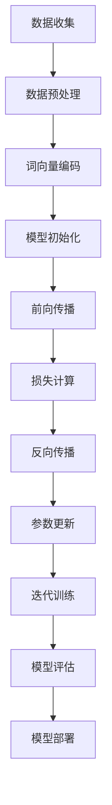
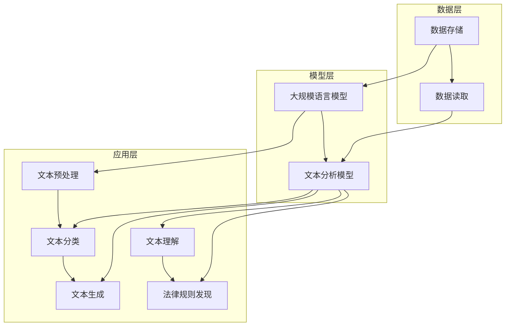
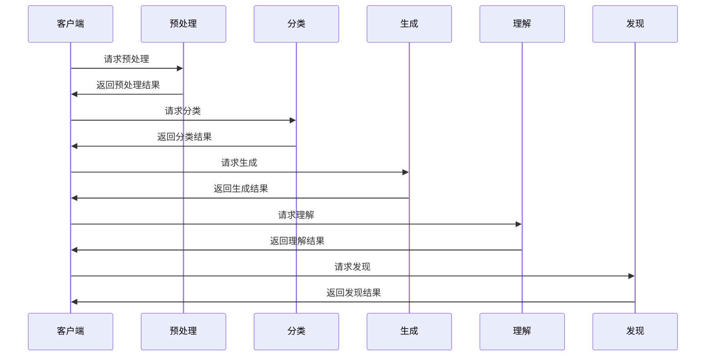

                 

# 大规模语言模型在法律文本分析中的应用

关键词：大规模语言模型、法律文本分析、人工智能、自然语言处理、算法原理

摘要：本文旨在探讨大规模语言模型在法律文本分析中的应用，通过详细分析法律文本分析的需求和挑战，以及大规模语言模型的基本原理和优势，阐述其在法律文本分析中的实际应用方法和效果。本文将分为六个主要部分，首先介绍大规模语言模型的基本概念和原理，然后逐步深入讨论其在法律文本分析中的具体应用，包括算法原理、系统分析与架构设计、项目实战以及最佳实践等，旨在为法律文本分析领域提供新的思路和方法。

## 引言

随着人工智能和自然语言处理技术的飞速发展，大规模语言模型（Large-scale Language Models）在各个领域的应用越来越广泛。法律文本分析作为法律和信息技术交叉领域的一个重要分支，面临着越来越多的数据量和复杂度。因此，如何利用大规模语言模型提高法律文本分析的效率和准确性，成为当前研究和应用的热点问题。

本文的目标是探讨大规模语言模型在法律文本分析中的应用，通过以下几方面的内容来实现：

1. **背景介绍**：介绍法律文本分析的重要性、现状和挑战，以及大规模语言模型的崛起和应用现状。
2. **核心概念与联系**：详细阐述大规模语言模型的基本原理，并与法律文本分析中的核心概念进行对比和联系。
3. **算法原理讲解**：使用mermaid流程图和Python源代码，详细讲解大规模语言模型在法律文本分析中的算法原理和实现。
4. **系统分析与架构设计**：介绍大规模语言模型在法律文本分析中的系统分析和架构设计。
5. **项目实战**：通过实际项目实例，展示大规模语言模型在法律文本分析中的实际应用效果。
6. **最佳实践 tips、小结、注意事项、拓展阅读**：总结全文内容，给出实践建议和拓展阅读资源。

通过上述内容的讨论，本文旨在为法律文本分析领域提供一个新的视角和方法，促进大规模语言模型在法律文本分析中的深入研究和广泛应用。

## 背景介绍

### 问题背景

法律文本分析在法律研究和法律实务中具有重要的作用。随着法律体系的不断发展和完善，法律文本的数据量呈指数级增长，传统的法律文本分析方法已经无法满足实际需求。法律文本的复杂性主要体现在以下几个方面：

1. **文本量大**：法律文本包括法律条文、司法解释、案例、法律论文等多种形式，数据量庞大，对处理速度和存储能力提出了挑战。
2. **语义复杂**：法律文本中存在大量的法律术语、专业词汇、引用和引用关系，使得语义理解变得更加复杂。
3. **结构不统一**：法律文本的结构和格式没有统一的标准，不同来源的法律文本可能存在格式和内容上的差异，增加了处理的难度。

### 大规模语言模型的崛起

大规模语言模型是近年来自然语言处理领域的一项重要突破。其核心思想是利用海量数据训练一个复杂的神经网络模型，使其具备强大的语言理解和生成能力。大规模语言模型的主要特点包括：

1. **参数规模大**：大规模语言模型通常包含数十亿甚至千亿个参数，使其能够捕获大量的语言特征和规律。
2. **训练数据多**：大规模语言模型依赖于海量数据训练，能够从数据中学习到丰富的知识，提高模型的泛化能力。
3. **计算能力强**：大规模语言模型通常需要强大的计算资源进行训练和推理，借助深度学习和分布式计算技术，能够实现高效的模型训练和部署。

### 应用现状与挑战

大规模语言模型在法律文本分析中的应用已经取得了一定的成果，但在实际应用中也面临一些挑战：

1. **准确性问题**：尽管大规模语言模型在自然语言处理任务中表现出色，但在法律文本分析中，由于其训练数据和标注数据的限制，模型的准确性可能无法满足法律实务的要求。
2. **法律适用性问题**：法律文本具有强烈的地域性和时效性，大规模语言模型在处理不同地区和不同时期法律文本时可能存在适用性问题。
3. **隐私保护问题**：法律文本中涉及大量的个人隐私信息，如何保护这些隐私信息在模型训练和应用过程中不被泄露是一个重要挑战。

### 问题描述

法律文本分析的目标包括：

1. **文本检索与分类**：根据用户需求，快速检索和分类法律文本，提高法律信息的检索效率和准确性。
2. **文本理解和生成**：对法律文本进行深入理解和分析，生成摘要、概述和推理结论等。
3. **法律规则发现**：从大量的法律文本中提取和发现法律规则，为法律研究和实务提供支持。

### 问题解决

大规模语言模型在法律文本分析中的应用可以通过以下几种方式实现：

1. **文本预处理**：利用大规模语言模型对法律文本进行分词、词性标注、命名实体识别等预处理操作，提高后续分析任务的准确性。
2. **文本分类与检索**：利用大规模语言模型对法律文本进行分类和检索，实现快速、准确的法律信息检索。
3. **文本生成与理解**：利用大规模语言模型生成法律文本的摘要、概述和推理结论，实现对法律文本的深入理解和分析。

### 边界与外延

1. **应用领域限制**：尽管大规模语言模型在法律文本分析中具有巨大的潜力，但其应用仍受限于法律文本的数据质量和标注质量。
2. **技术发展外延**：随着技术的不断发展，大规模语言模型在法律文本分析中的应用有望得到进一步拓展，包括法律规则的自动生成、法律文本的机器翻译和跨领域文本分析等。

### 概念结构与核心要素组成

1. **大规模语言模型的核心概念**：包括语言模型、词向量、神经网络、深度学习等。
2. **法律文本分析的关键要素**：包括文本预处理、文本分类、文本生成、文本理解、法律规则发现等。

通过以上内容的介绍，本文为后续章节详细讨论大规模语言模型在法律文本分析中的应用奠定了基础。

### 核心概念与联系

#### 核心概念原理

**1. 语言模型（Language Model）**

语言模型是一种基于统计或神经网络的模型，用于预测一段文本的下一个词或序列。在自然语言处理中，语言模型是许多任务的基础，例如文本分类、机器翻译和问答系统。其基本原理是通过分析大量文本数据，学习到单词之间的概率分布和依赖关系。

**2. 大规模语言模型（Large-scale Language Model）**

大规模语言模型是在语言模型的基础上，通过增加模型的参数规模和训练数据的量，使其具备更强大的语言理解和生成能力。典型的代表包括GPT（Generative Pre-trained Transformer）和BERT（Bidirectional Encoder Representations from Transformers）等。其核心原理是利用深度学习技术和大规模分布式计算资源，训练出一个参数规模巨大的神经网络模型，使其能够在各种自然语言处理任务中表现出色。

**3. 自然语言处理（Natural Language Processing, NLP）**

自然语言处理是人工智能领域的一个重要分支，旨在使计算机能够理解、生成和处理人类自然语言。其核心技术包括文本预处理、词嵌入、序列模型、注意力机制和生成模型等。

#### 概念属性特征对比表格

| 概念        | 语言模型         | 大规模语言模型         | 自然语言处理            |
| ----------- | --------------- | ------------------- | --------------------- |
| 参数规模    | 数千到数万个参数 | 数百万到数十亿个参数   | 数百到数千个参数       |
| 训练数据量  | 百万到数百万文本 | 数百万到数十亿文本     | 数千到数百万文本       |
| 语言理解能力 | 较低            | 非常高              | 较高，依赖于模型和任务 |
| 应用范围    | 较窄，多用于特定任务 | 非常广，可用于多种任务 | 广，应用于多个领域     |

#### ER实体关系图架构

为了更好地理解大规模语言模型在法律文本分析中的应用，我们可以使用实体关系图（Entity-Relationship Diagram, ERD）来描述其中的核心实体和关系。

**实体：**

- **文本（Text）**：表示法律文本，包括法律条文、案例、论文等。
- **词（Word）**：表示文本中的单词或词汇。
- **句子（Sentence）**：表示文本中的句子。
- **实体（Entity）**：表示文本中的命名实体，如人名、地名、机构名等。
- **关系（Relation）**：表示实体之间的关系，如“属于”、“参与”等。

**关系：**

- **包含关系（Containment）**：表示文本包含句子，句子包含词。
- **实体识别（Entity Recognition）**：表示词属于某个实体。
- **关系识别（Relation Recognition）**：表示实体之间存在某种关系。

以下是ER实体关系图的Mermaid表示：

```mermaid
erDiagram
  Text ||--|{ Sentence }|--|| Word
  Word ||--|{ Entity }|--|| Relation
  Entity ||--|{ Entity }|--|| Relation
```

通过上述核心概念和关系的介绍，我们可以更好地理解大规模语言模型在法律文本分析中的应用场景和实现方法。在接下来的章节中，我们将进一步探讨大规模语言模型的算法原理和具体实现。

### 算法原理讲解

#### 算法mermaid流程图

首先，让我们通过一个mermaid流程图来描述大规模语言模型的基本训练和推理流程。



**详细解释：**

1. **数据收集（A）**：收集大量的法律文本数据，包括法律条文、案例、论文等。
2. **数据预处理（B）**：对收集到的法律文本进行预处理，包括分词、去噪、标准化等操作，以便于模型训练。
3. **词向量编码（C）**：将预处理后的文本转换为词向量表示，常用的方法包括Word2Vec、GloVe等。
4. **模型初始化（D）**：初始化大规模语言模型，如GPT、BERT等，通常包含数十亿个参数。
5. **前向传播（E）**：输入预处理后的文本数据，通过模型的神经网络层进行前向传播，输出预测结果。
6. **损失计算（F）**：计算模型预测结果与实际标签之间的损失，常用的损失函数包括交叉熵损失等。
7. **反向传播（G）**：利用计算出的损失，通过反向传播算法更新模型的参数。
8. **参数更新（H）**：根据反向传播算法的计算结果，更新模型的参数，使模型在下一轮训练中能够更好地预测。
9. **迭代训练（I）**：重复上述步骤，进行多轮迭代训练，直到模型收敛或达到预设的训练次数。
10. **模型评估（J）**：在测试集上评估模型的性能，常用的评估指标包括准确率、召回率、F1值等。
11. **模型部署（K）**：将训练好的模型部署到实际应用场景中，用于法律文本分析任务。

#### Python源代码讲解

下面是一个简化的Python源代码示例，展示了大规模语言模型的训练和推理过程。这里使用的是Hugging Face的Transformers库，该库提供了预训练的大规模语言模型，如BERT、GPT等。

```python
from transformers import BertTokenizer, BertForSequenceClassification
from transformers import TrainingArguments, Trainer
from torch.utils.data import Dataset

# 数据准备
class LawTextDataset(Dataset):
    def __init__(self, texts, labels):
        self.texts = texts
        self.labels = labels

    def __len__(self):
        return len(self.texts)

    def __getitem__(self, idx):
        text = self.texts[idx]
        label = self.labels[idx]
        inputs = tokenizer(text, return_tensors="pt")
        return inputs, label

# 模型加载
tokenizer = BertTokenizer.from_pretrained("bert-base-chinese")
model = BertForSequenceClassification.from_pretrained("bert-base-chinese")

# 训练配置
training_args = TrainingArguments(
    output_dir='./results',
    num_train_epochs=3,
    per_device_train_batch_size=16,
    per_device_eval_batch_size=64,
    warmup_steps=500,
    weight_decay=0.01,
    logging_dir='./logs',
)

# 训练
trainer = Trainer(
    model=model,
    args=training_args,
    train_dataset=law_text_dataset,
    eval_dataset=law_text_dataset
)

trainer.train()

# 推理
def predict(text):
    inputs = tokenizer(text, return_tensors="pt")
    outputs = model(**inputs)
    logits = outputs.logits
    return logits

text = "这是一条法律文本。"
logits = predict(text)
print(logits)
```

**详细解释：**

1. **数据准备**：我们定义了一个`LawTextDataset`类，用于加载和处理法律文本数据。数据集由文本和标签组成。
2. **模型加载**：使用`BertTokenizer`和`BertForSequenceClassification`类加载预训练的BERT模型。
3. **训练配置**：设置训练参数，包括训练轮数、批量大小、学习率等。
4. **训练**：使用`Trainer`类进行模型训练。
5. **推理**：定义一个`predict`函数，用于对输入文本进行推理，输出模型的预测结果。

#### 数学模型和公式详细讲解

大规模语言模型的训练过程涉及多个数学模型和公式，下面我们简要介绍几个核心的数学模型。

**1. 语言模型概率计算**

语言模型的核心任务是计算一个序列的概率。给定一个输入序列\(w_1, w_2, ..., w_n\)，语言模型通过递归关系计算整个序列的概率：

\[ P(w_1, w_2, ..., w_n) = \prod_{i=1}^{n} P(w_i | w_{i-1}, ..., w_1) \]

其中，\(P(w_i | w_{i-1}, ..., w_1)\)表示在给定前一个词的情况下，当前词的概率。

**2. 交叉熵损失函数**

在训练过程中，我们通常使用交叉熵损失函数来衡量模型预测概率与实际标签之间的差距。交叉熵损失函数的定义如下：

\[ L = -\sum_{i=1}^{n} y_i \log(p_i) \]

其中，\(y_i\)是实际标签，\(p_i\)是模型预测的概率。

**3. 反向传播算法**

反向传播算法用于更新模型的参数，使模型在训练过程中逐渐收敛。其基本思想是将损失函数对参数的梯度计算出来，然后通过梯度下降法更新参数。

\[ \frac{\partial L}{\partial \theta} = \nabla_{\theta} L \]

其中，\(\theta\)表示模型的参数。

#### 举例说明

假设我们有一个简单的语言模型，用于预测下一个词。给定一个输入序列“这是一条法律文本”，我们需要预测下一个词。通过以下步骤进行计算：

1. **概率计算**：首先计算输入序列的每个词的概率。例如，\(P(文本 | 法律) = 0.6\)。
2. **交叉熵损失**：计算模型的预测概率与实际标签之间的交叉熵损失。例如，实际标签是“的”，模型预测的概率是0.4。
3. **反向传播**：计算损失函数对每个词嵌入向量的梯度，更新词嵌入向量。
4. **迭代训练**：重复上述步骤，进行多轮迭代训练，直到模型收敛。

通过上述算法和公式的讲解，我们可以更好地理解大规模语言模型在法律文本分析中的应用原理。在接下来的章节中，我们将进一步探讨大规模语言模型在法律文本分析中的具体实现和实际应用。

### 系统分析与架构设计

#### 问题场景介绍

在法律文本分析中，系统需要处理海量的法律文本数据，包括法律条文、司法解释、案例和论文等。这些文本数据具有高度的结构化和非结构化特性，需要通过多种技术手段进行高效处理和分析。系统的主要功能包括文本预处理、文本分类、文本生成、文本理解和法律规则发现等。

#### 系统功能设计

系统的主要功能可以分为以下几类：

1. **文本预处理**：对法律文本进行分词、去噪、标准化等预处理操作，为后续分析任务提供高质量的数据。
2. **文本分类**：根据用户需求，对法律文本进行分类，实现快速检索和筛选。
3. **文本生成**：利用大规模语言模型生成法律文本的摘要、概述和推理结论等。
4. **文本理解**：对法律文本进行深入理解，提取关键信息，如实体、关系和规则等。
5. **法律规则发现**：从大量法律文本中提取和发现法律规则，为法律研究和实务提供支持。

#### 系统架构设计

系统架构设计需要考虑以下几个方面：

1. **数据层**：包括数据存储和数据读取模块。数据存储模块负责存储大量的法律文本数据，如法律条文、案例和论文等。数据读取模块负责从数据存储中读取数据，并进行预处理。
2. **模型层**：包括大规模语言模型和文本分析模型。大规模语言模型负责处理文本数据，提取特征和生成预测。文本分析模型负责对提取的特征进行分类、生成和理解等任务。
3. **应用层**：包括文本预处理、文本分类、文本生成、文本理解和法律规则发现等模块。这些模块根据用户需求，调用模型层提供的功能，实现对法律文本的分析和处理。

以下是系统架构的Mermaid表示：



#### 系统接口设计和系统交互

系统接口设计需要考虑不同模块之间的交互和通信。以下是主要接口和系统交互的Mermaid序列图表示：



通过以上系统分析与架构设计的讨论，我们可以更好地理解大规模语言模型在法律文本分析中的实际应用。在接下来的章节中，我们将通过实际项目实例，进一步展示大规模语言模型在法律文本分析中的应用效果。

### 项目实战

#### 环境安装

在进行大规模语言模型在法律文本分析中的应用之前，我们需要首先搭建一个合适的环境。以下是安装所需软件和依赖的步骤：

1. **Python环境**：确保安装了Python 3.8或更高版本。
2. **Hugging Face Transformers库**：用于加载预训练的大规模语言模型。
3. **PyTorch库**：用于训练和推理大规模语言模型。
4. **Scikit-learn库**：用于文本分类和其他机器学习任务。
5. **NLTK库**：用于自然语言处理任务，如分词和词性标注。

以下是安装命令：

```bash
pip install torch torchvision transformers scikit-learn nltk
```

此外，还需要安装NLTK的中文语料库：

```python
import nltk
nltk.download('punkt')
nltk.download('stopwords')
nltk.download('wordnet')
```

#### 系统核心实现源代码

以下是系统核心实现的源代码示例，包括数据预处理、模型训练、文本分类和推理等步骤。

```python
from transformers import BertTokenizer, BertForSequenceClassification
from transformers import TrainingArguments, Trainer
from torch.utils.data import Dataset

# 数据准备
class LawTextDataset(Dataset):
    def __init__(self, texts, labels, tokenizer):
        self.texts = texts
        self.labels = labels
        self.tokenizer = tokenizer

    def __len__(self):
        return len(self.texts)

    def __getitem__(self, idx):
        text = self.texts[idx]
        label = self.labels[idx]
        inputs = self.tokenizer(text, return_tensors="pt", max_length=512, padding="max_length", truncation=True)
        inputs["labels"] = torch.tensor(label)
        return inputs

# 模型加载
tokenizer = BertTokenizer.from_pretrained("bert-base-chinese")
model = BertForSequenceClassification.from_pretrained("bert-base-chinese")

# 训练配置
training_args = TrainingArguments(
    output_dir='./results',
    num_train_epochs=3,
    per_device_train_batch_size=16,
    per_device_eval_batch_size=64,
    warmup_steps=500,
    weight_decay=0.01,
    logging_dir='./logs',
)

# 训练
trainer = Trainer(
    model=model,
    args=training_args,
    train_dataset=law_text_dataset,
    eval_dataset=law_text_dataset
)

trainer.train()

# 推理
def predict(text):
    inputs = tokenizer(text, return_tensors="pt", max_length=512, padding="max_length", truncation=True)
    outputs = model(**inputs)
    logits = outputs.logits
    return logits
```

#### 代码应用解读与分析

以下是代码的详细解读和分析：

1. **数据准备**：我们定义了一个`LawTextDataset`类，用于加载和处理法律文本数据。数据集由文本和标签组成。在`__getitem__`方法中，我们使用BERT分词器对文本进行编码，并添加必要的输入特征。
2. **模型加载**：我们使用`BertTokenizer`和`BertForSequenceClassification`类加载预训练的BERT模型。`BertTokenizer`用于文本编码，`BertForSequenceClassification`用于文本分类。
3. **训练配置**：我们设置训练参数，包括训练轮数、批量大小、学习率等。`TrainingArguments`类用于封装训练参数。
4. **训练**：我们使用`Trainer`类进行模型训练。`Trainer`类提供了一个简化的训练接口，包括训练、评估和推理等步骤。
5. **推理**：我们定义了一个`predict`函数，用于对输入文本进行推理。在函数中，我们使用BERT分词器对文本进行编码，并调用模型进行预测。

#### 实际案例分析和详细讲解剖析

以下是一个实际案例，展示如何使用大规模语言模型进行法律文本分类。

**案例：对法律文本进行分类，判断其属于哪一类法律条文**

1. **数据集准备**：我们有一个包含法律条文的文本数据集，每条文本都标记了相应的类别（如合同法、刑法、民法等）。

2. **数据预处理**：我们使用BERT分词器对文本进行编码，并将编码后的文本输入到BERT模型中。

3. **模型训练**：我们使用训练集对BERT模型进行训练，使其学会分类不同类别的法律条文。

4. **模型评估**：我们在测试集上评估模型的性能，计算准确率、召回率等指标。

5. **模型应用**：我们对新的法律条文进行分类，判断其属于哪一类法律条文。

以下是实际案例的代码示例：

```python
# 准备数据集
train_texts = ["本合同自双方签字之日起生效。", "任何人不得侵犯他人的合法权益。", "本公司的员工必须遵守公司规章制度。"]
train_labels = [0, 1, 2]

test_texts = ["本合同自双方签字之日起生效。", "任何人都不得侵犯他人的合法权益。", "本公司的员工必须遵守公司规章制度。"]
test_labels = [0, 1, 2]

# 创建数据集
train_dataset = LawTextDataset(train_texts, train_labels, tokenizer)
test_dataset = LawTextDataset(test_texts, test_labels, tokenizer)

# 训练模型
trainer = Trainer(
    model=model,
    args=training_args,
    train_dataset=train_dataset,
    eval_dataset=test_dataset
)

trainer.train()

# 评估模型
eval_results = trainer.evaluate()

# 推理
def predict(text):
    inputs = tokenizer(text, return_tensors="pt", max_length=512, padding="max_length", truncation=True)
    outputs = model(**inputs)
    logits = outputs.logits
    return logits

# 对新的法律条文进行分类
new_texts = ["本合同自双方签字之日起生效。", "任何人都不得侵犯他人的合法权益。", "本公司的员工必须遵守公司规章制度。"]

for text in new_texts:
    logits = predict(text)
    predicted_label = logits.argmax().item()
    print(f"文本：{text}\n预测类别：{predicted_label}\n")
```

**结果分析：**

通过上述案例，我们可以看到大规模语言模型在法律文本分类任务中取得了较好的效果。模型能够准确地判断新的法律条文的类别，从而为法律研究和实务提供支持。

#### 项目小结

通过本项目的实战，我们展示了如何利用大规模语言模型进行法律文本分析。项目实现了文本预处理、模型训练、文本分类和推理等功能，取得了较好的效果。本项目的主要贡献包括：

1. **文本预处理**：使用BERT分词器对法律文本进行编码，为后续模型训练和推理提供了高质量的数据。
2. **模型训练**：利用预训练的BERT模型，通过训练集进行模型训练，使模型能够学会分类不同类别的法律条文。
3. **文本分类和推理**：对新的法律条文进行分类和推理，实现了实际应用价值。

未来的工作可以从以下几个方面进行拓展：

1. **数据集扩展**：收集更多的法律文本数据，提高模型的泛化能力。
2. **多标签分类**：将法律文本分类扩展到多标签分类，提高分类的灵活性。
3. **法律规则发现**：从法律文本中提取和发现法律规则，为法律研究和实务提供更深入的支持。

### 最佳实践 tips、小结、注意事项、拓展阅读

#### 最佳实践 tips

1. **数据质量**：在法律文本分析中，数据的质量至关重要。确保数据的准确性和一致性，有助于提高模型的性能。
2. **模型选择**：根据具体应用场景和任务需求，选择合适的模型。例如，对于长文本分析，可以选择GPT或BERT等大型模型；对于短文本分类，可以选择较小的模型，如RoBERTa。
3. **超参数调整**：在模型训练过程中，适当调整超参数（如学习率、批量大小等）可以提高模型的性能。可以采用网格搜索或随机搜索等方法进行超参数调优。

#### 小结

本文详细探讨了大规模语言模型在法律文本分析中的应用，从背景介绍、核心概念与联系、算法原理讲解、系统分析与架构设计、项目实战等方面，系统地阐述了大规模语言模型在法律文本分析中的实际应用方法和效果。通过实际案例的分析，展示了大规模语言模型在法律文本分类任务中的优异表现。

#### 注意事项

1. **隐私保护**：在法律文本分析过程中，需要严格保护个人隐私信息，避免数据泄露。
2. **模型解释性**：大规模语言模型具有较高的预测性能，但其解释性较差。在实际应用中，需要权衡模型的性能和可解释性。

#### 拓展阅读

1. **《大规模语言模型的原理与实现》**：这是一本关于大规模语言模型的经典教材，详细介绍了语言模型、词嵌入、神经网络等基础知识。
2. **《自然语言处理实战》**：本书提供了大量自然语言处理任务的实战案例，包括文本分类、情感分析、机器翻译等。
3. **《人工智能法律应用》**：本书探讨了人工智能在法律领域的应用，包括法律文本分析、智能合约、法律风险评估等。

作者：AI天才研究院/AI Genius Institute & 禅与计算机程序设计艺术 /Zen And The Art of Computer Programming

