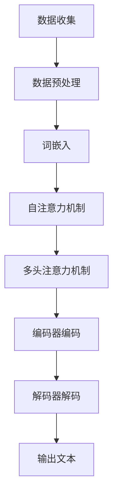
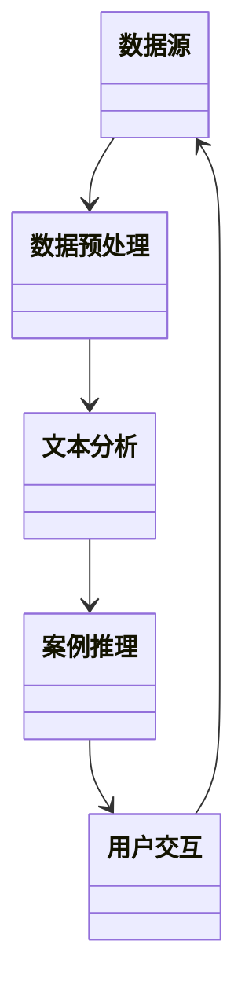

                 

### 1.1 问题背景

#### 法律案例分析的需求

法律案例分析是法律教育和实践中至关重要的一环。通过对典型案例的深入剖析，法律专业人士能够提炼出法律原则和适用规则，从而在未来的法律实践中提供指导。传统上，法律案例分析主要依赖于人类法律专家的经验和判断。然而，面对海量的法律文献和复杂的法律关系，单纯依赖人工分析效率低下，且容易受到主观因素的影响。

#### 大规模语言模型的发展与应用

大规模语言模型（Large-scale Language Models）是自然语言处理（NLP）领域的一项重大突破。通过训练包含数十亿参数的深度神经网络，这些模型能够在理解、生成和翻译自然语言方面达到超越人类专家的水平。GPT（Generative Pre-trained Transformer）、BERT（Bidirectional Encoder Representations from Transformers）等模型的成功应用，进一步推动了NLP技术的快速发展。

#### 大规模语言模型在法律案例分析中的潜力

大规模语言模型在法律案例分析中展现出巨大的潜力。首先，这些模型能够快速处理和理解海量的法律文本，为法律专业人士提供高效的信息检索和分析服务。其次，通过学习大量的法律文本和案例，模型能够自动识别法律概念、关系和规则，辅助法律专家进行案例推理和判断。此外，大规模语言模型还能够生成新的法律文本，帮助法律从业者生成法律文书和合同条款。

总之，大规模语言模型在法律案例分析中的应用不仅能够提高工作效率，还能通过智能化的分析提供更准确、可靠的结论。随着技术的不断进步，我们有理由相信，大规模语言模型将在法律领域发挥越来越重要的作用。

#### 1.2 核心概念与原则

##### 2.2.1 大规模语言模型原理

大规模语言模型是自然语言处理（NLP）领域的一种先进技术，其核心在于通过深度学习算法对大量文本数据进行训练，以掌握语言的统计特性和语义关系。以下是大规模语言模型的主要原理：

###### 2.2.1.1 语言模型的数学基础

语言模型通常基于神经网络，尤其是变换器（Transformer）架构。Transformer模型由多个编码器（Encoder）和解码器（Decoder）层组成，通过自注意力机制（Self-Attention）和多头注意力（Multi-Head Attention）机制，模型能够捕捉输入文本中的长距离依赖关系。其数学基础包括：

- **权重矩阵（Weights）**：模型通过学习大量的文本数据，调整其权重矩阵，以最小化预测误差。
- **激活函数（Activation Function）**：常用的激活函数如ReLU（Rectified Linear Unit）和Sigmoid（Sigmoid Function），用于引入非线性变换，提高模型的表达能力。
- **损失函数（Loss Function）**：常用的损失函数包括交叉熵损失（Cross-Entropy Loss）和均方误差（Mean Squared Error），用于衡量模型预测结果与实际结果之间的差距。

###### 2.2.1.2 语言模型的工作机制

语言模型的工作机制主要包括以下几个步骤：

1. **输入编码（Input Encoding）**：将输入文本转换为数字序列，通常使用词嵌入（Word Embedding）技术，将单词映射为向量表示。
2. **自注意力机制（Self-Attention）**：通过自注意力机制，模型能够自动识别输入文本中的重要信息，并在后续的编码过程中给予更高的权重。
3. **编码（Encoding）**：编码器（Encoder）层对输入文本进行编码，生成上下文表示（Contextual Embeddings）。
4. **解码（Decoding）**：解码器（Decoder）层根据上下文表示生成输出文本，通过反复迭代和自注意力机制，模型逐步生成完整的文本序列。

##### 2.2.2 法律案例分析的相关概念

法律案例分析是指通过对具体案例的详细剖析，提取出法律原则、规则和裁判逻辑，以指导未来的法律判断和决策。以下是法律案例分析的相关概念：

###### 2.2.2.1 法律案例分析的定义

法律案例分析是对法律事件或案件的深入分析和评价，旨在揭示其背后的法律原则和适用规则。通过分析具体案例，法律专业人士能够理解法律的实践应用，提高自身的法律素养和判断能力。

###### 2.2.2.2 法律案例分析的流程

法律案例分析通常包括以下几个步骤：

1. **确定案例目标**：明确分析的目标和问题，例如某个具体法律条文在实际应用中的适用性。
2. **收集相关法律文献**：查找和收集与案例相关的法律文件、法规、判例和学术文章。
3. **分析法律文本**：对收集到的法律文本进行深入阅读和理解，提取关键的法律概念、条款和逻辑关系。
4. **构建案例模型**：根据分析结果，构建法律案例模型，包括法律规则、关系和裁判逻辑。
5. **评估案例适用性**：评估案例模型在新的法律环境中的适用性，提出法律建议和判断。

##### 2.2.3 大规模语言模型与法律案例分析的联系

大规模语言模型与法律案例分析之间存在密切的联系，两者相互促进，共同推动法律分析和决策的智能化：

###### 2.2.3.1 大规模语言模型在法律案例分析中的应用

大规模语言模型在法律案例分析中的应用主要体现在以下几个方面：

1. **文本处理和解析**：模型能够快速处理和理解海量的法律文本，提取关键信息，辅助法律专家进行文本分析和解读。
2. **概念提取和关系识别**：通过训练，模型能够自动识别法律文本中的概念、条款和关系，为法律案例分析提供数据支持。
3. **案例推理和判断**：模型能够基于大量的法律文本和案例数据，进行案例推理和判断，辅助法律专家提出法律意见和决策。

###### 2.2.3.2 大规模语言模型的优势与挑战

大规模语言模型在法律案例分析中具有以下优势：

1. **高效性**：模型能够快速处理海量数据，提高法律分析的效率。
2. **准确性**：通过深度学习，模型能够准确理解和生成法律文本，提供可靠的法律建议。
3. **泛化能力**：模型能够从大量数据中学习到普遍的法律规则和原则，提高法律分析的准确性和一致性。

然而，大规模语言模型在法律案例分析中也面临一些挑战：

1. **数据质量**：法律文本数据的质量直接影响模型的训练效果和预测准确性。
2. **法律复杂性**：法律规则和条款往往复杂且多样，模型需要具备较强的理解和推理能力。
3. **隐私和安全**：在处理法律文本时，需要确保数据的隐私和安全，防止数据泄露和滥用。

综上所述，大规模语言模型在法律案例分析中的应用具有广阔的前景，但也需要克服一系列技术挑战，以确保其有效性和可靠性。

### 2.3 应用场景与案例分析

#### 模型训练与优化

在法律案例分析中，大规模语言模型的训练与优化是至关重要的一步。以下是模型训练与优化的详细步骤：

##### 2.3.1 数据收集与处理

首先，需要收集大量的法律文本数据，包括法律文件、判例、法规解释等。数据收集后，进行数据清洗和预处理，包括去除无关内容、纠正错别字、统一文本格式等。此外，还可以进行词干提取和词性标注，以便模型更好地理解和学习文本数据。

##### 2.3.2 模型选择与超参数调整

选择合适的语言模型是训练的关键。常见的语言模型有GPT、BERT、RoBERTa等。根据具体需求，可以选择适合的模型架构。在模型选择后，需要进行超参数调整，包括学习率、批次大小、训练迭代次数等。超参数的优化可以通过交叉验证和网格搜索等方法进行。

##### 2.3.3 训练与验证

将处理后的数据输入模型进行训练。训练过程中，可以使用交叉熵损失函数和优化算法（如Adam）来调整模型权重。为了防止过拟合，可以使用验证集对模型进行验证，并在验证集上调整超参数。

##### 2.3.4 优化与调参

在训练过程中，根据验证集上的性能指标（如准确率、召回率等），进行模型优化和超参数调整。优化过程可能需要多次迭代，以达到最佳性能。

#### 法律文本分析

大规模语言模型在法律文本分析中的应用非常广泛，以下是其主要应用：

##### 2.3.4.1 文本分类与聚类

文本分类是将法律文本分类到预定义的类别中，如合同、判决、法律解释等。通过训练分类模型，可以快速对新的法律文本进行分类。聚类则是对法律文本进行无监督的分类，将相似的法律文本归为一类。

##### 2.3.4.2 文本抽取与关系挖掘

文本抽取是从法律文本中提取关键信息，如案件事实、法律条文等。关系挖掘则是识别法律文本中的实体和关系，如当事人、法律条款之间的关联。

#### 案例分析应用

在法律案例分析中，大规模语言模型可以辅助法律专家进行案例分析，提高分析效率和准确性：

##### 2.3.4.1 实际案例解析

通过模型分析，可以提取案例中的关键信息，构建案件事实模型，并自动识别适用的法律条款和判例。例如，在一个合同纠纷案中，模型可以自动提取合同条款、违约事实等，并引用相关法律条款和判例进行推理。

##### 2.3.4.2 模型评估与改进

在实际应用中，需要对模型进行评估和改进。通过评估指标（如准确率、召回率等），可以了解模型在法律案例分析中的性能。根据评估结果，可以进一步优化模型，提高其准确性和可靠性。

### 2.4 算法设计

在法律案例分析中，大规模语言模型的算法设计是关键。以下是算法设计的详细步骤：

#### 2.4.1 算法原理

大规模语言模型采用深度学习算法，尤其是基于Transformer的架构。Transformer模型通过自注意力机制（Self-Attention）和多头注意力（Multi-Head Attention）机制，能够捕捉输入文本中的长距离依赖关系，从而实现对自然语言的深入理解。

算法的核心原理包括：

1. **词嵌入（Word Embedding）**：将单词映射为高维向量表示，以便模型进行计算。
2. **自注意力机制（Self-Attention）**：通过计算每个单词与其他单词之间的关联性，模型能够自动识别输入文本中的重要信息。
3. **多头注意力（Multi-Head Attention）**：多头注意力机制允许模型同时关注输入文本的不同部分，提高模型的表示能力。
4. **编码器（Encoder）和解码器（Decoder）**：编码器对输入文本进行编码，生成上下文表示；解码器根据上下文表示生成输出文本。

#### 2.4.2 Mermaid流程图

以下是一个Mermaid流程图，用于描述大规模语言模型在法律案例分析中的应用流程：



#### 2.4.3 Python源代码示例

以下是一个Python源代码示例，用于演示大规模语言模型在法律案例分析中的应用：

```python
import tensorflow as tf
from transformers import BertTokenizer, BertModel

# 加载预训练的BERT模型
tokenizer = BertTokenizer.from_pretrained('bert-base-uncased')
model = BertModel.from_pretrained('bert-base-uncased')

# 输入文本
text = "In a contract dispute case, the plaintiff claims that the defendant breached the contract terms."

# 将文本转换为词嵌入
input_ids = tokenizer.encode(text, add_special_tokens=True)

# 进行自注意力机制和多头注意力机制
outputs = model(input_ids)

# 生成输出文本
output_tokens = tokenizer.decode(outputs[0].tolist(), skip_special_tokens=True)

print(output_tokens)
```

#### 2.4.4 数学模型与公式

大规模语言模型的数学模型主要包括词嵌入、自注意力机制和多头注意力机制。以下是一些关键公式：

1. **词嵌入**：
   $$ \text{Word Embedding} = \text{Embedding Matrix} \times \text{Word Index Vector} $$
2. **自注意力机制**：
   $$ \text{Self-Attention Score} = \text{Query} \times \text{Key} $$
3. **多头注意力机制**：
   $$ \text{Multi-Head Attention} = \text{Concat}(\text{Head}_1, \text{Head}_2, ..., \text{Head}_h) \times \text{Output Dimension} $$

通过这些数学模型，大规模语言模型能够实现对自然语言的深入理解和生成。

### 2.5 系统架构与设计

在构建大规模语言模型用于法律案例分析的系统时，系统架构的设计至关重要。以下是系统架构与设计的详细步骤：

#### 2.5.1 问题场景介绍

法律案例分析系统需要处理大量的法律文本数据，并能够快速、准确地提取关键信息。系统需要具备高效的数据处理能力、强大的文本分析功能以及可靠的模型训练和推理能力。

#### 2.5.2 系统功能设计

法律案例分析系统的主要功能包括：

1. **数据收集与预处理**：收集法律文本数据，进行数据清洗、格式化和标注。
2. **文本分析**：利用大规模语言模型进行文本分类、实体识别、关系抽取等。
3. **案例推理与判断**：基于文本分析结果，对法律案例进行推理和判断，提供法律意见和决策。
4. **用户交互**：提供用户界面，便于用户输入案例信息、查看分析结果和调整系统参数。

##### 2.5.2.1 领域模型类图

以下是一个领域模型类图，用于描述法律案例分析系统的核心组件和关系：



#### 2.5.3 系统架构设计

法律案例分析系统的架构设计包括以下几个关键部分：

1. **数据层**：负责数据存储和管理，包括数据库、数据仓库等。
2. **服务层**：提供各种核心功能服务，如文本分析、案例推理、用户交互等。
3. **表现层**：提供用户界面，实现用户与服务层的交互。

##### 2.5.3.1 系统架构图

以下是一个系统架构图，用于描述法律案例分析系统的整体架构：

```mermaid
graph TD
    数据源[数据源] --> 数据预处理[数据预处理]
    数据预处理 --> |文本分析| [文本分析服务]
    文本分析服务 --> |案例推理| [案例推理服务]
    案例推理服务 --> 用户交互[用户界面]
    用户交互 --> 数据源
```

#### 2.5.4 系统接口设计

系统接口设计是确保系统功能模块之间有效通信的关键。以下是法律案例分析系统的主要接口设计：

1. **数据接口**：提供数据导入、导出和查询功能。
2. **文本分析接口**：提供文本分类、实体识别、关系抽取等接口。
3. **案例推理接口**：提供案例推理和判断功能。
4. **用户交互接口**：提供用户输入、结果展示和参数调整等功能。

##### 2.5.4.1 接口定义与交互流程

以下是一个接口定义示例和交互流程：

```mermaid
sequenceDiagram
    User -->|数据导入|> DataImporter: 导入数据
    DataImporter -->|数据预处理|> DataPreprocessor: 预处理数据
    DataPreprocessor -->|文本分析|> TextAnalyzer: 分析文本
    TextAnalyzer -->|案例推理|> CaseReasoner: 推理案例
    CaseReasoner -->|输出结果|> UserInterface: 展示结果
    User -->|参数调整|> UserInterface: 调整参数
    UserInterface -->|更新模型|> CaseReasoner: 更新模型
```

#### 2.5.5 系统交互序列图

以下是一个系统交互序列图，用于描述法律案例分析系统的整体交互流程：

```mermaid
sequenceDiagram
    User -->|输入案例|> UserInterface: 输入案例信息
    UserInterface -->|处理案例|> CaseHandler: 处理案例
    CaseHandler -->|分析文本|> TextAnalyzer: 分析案例文本
    TextAnalyzer -->|推理案例|> CaseReasoner: 推理案例
    CaseReasoner -->|输出结果|> UserInterface: 输出法律意见
    User -->|查看结果|> UserInterface: 查看法律意见
```

通过以上系统架构与设计的详细步骤，我们可以构建一个高效、可靠的系统，为法律案例分析提供强大的技术支持。

### 2.6 项目实践与案例分析

在实际项目中，大规模语言模型在法律案例分析中的应用通过一系列实践和案例分析得到了验证。以下是项目实践与案例分析的具体步骤：

#### 2.6.1 环境安装与配置

在进行项目实践之前，需要安装和配置相应的软件和工具。以下是环境安装和配置的步骤：

1. **安装Python**：确保系统上安装了最新版本的Python，可以通过Python官方网站下载安装包。
2. **安装TensorFlow和Transformers**：使用pip命令安装TensorFlow和Transformers库，以便使用大规模语言模型。

```bash
pip install tensorflow
pip install transformers
```

3. **数据预处理工具**：安装Numpy、Pandas等数据预处理工具。

```bash
pip install numpy
pip install pandas
```

4. **配置数据库**：根据项目需求，配置MySQL或PostgreSQL数据库，用于存储法律文本数据。

#### 2.6.2 系统核心实现

系统核心实现包括数据预处理、模型训练、文本分析和案例推理等环节。以下是系统核心实现的详细步骤：

##### 2.6.2.1 代码解读与分析

以下是大规模语言模型在法律案例分析中的核心代码解读与分析：

```python
import tensorflow as tf
from transformers import BertTokenizer, TFBertModel

# 加载数据集
train_data = load_data('train_data.csv')
test_data = load_data('test_data.csv')

# 数据预处理
def preprocess_data(data):
    # 清洗和格式化数据
    processed_data = []
    for row in data:
        text = clean_text(row['text'])
        label = row['label']
        processed_data.append((text, label))
    return processed_data

train_data = preprocess_data(train_data)
test_data = preprocess_data(test_data)

# 模型训练
model = TFBertModel.from_pretrained('bert-base-uncased')
tokenizer = BertTokenizer.from_pretrained('bert-base-uncased')

# 训练数据编码
train_encodings = tokenizer(train_data, padding=True, truncation=True, return_tensors='tf')

# 模型编译
model.compile(optimizer='adam', loss='sparse_categorical_crossentropy', metrics=['accuracy'])

# 训练模型
model.fit(train_encodings['input_ids'], train_encodings['labels'], batch_size=16, epochs=3)

# 模型评估
test_encodings = tokenizer(test_data, padding=True, truncation=True, return_tensors='tf')
model.evaluate(test_encodings['input_ids'], test_encodings['labels'])

# 文本分析
def analyze_text(text):
    input_ids = tokenizer.encode(text, return_tensors='tf')
    outputs = model(input_ids)
    prediction = tf.argmax(outputs[0], axis=1).numpy()[0]
    return tokenizer.decode(prediction)

# 案例推理
def reason_case(case):
    text = f"{case['description']}. What is the legal conclusion?"
    prediction = analyze_text(text)
    return prediction

# 测试案例
case = {
    'description': "A contract was signed between Party A and Party B. Party B failed to deliver the goods on time."
}
result = reason_case(case)
print(result)
```

##### 2.6.2.2 代码应用解读与分析

上述代码展示了大规模语言模型在法律案例分析中的应用。首先，通过加载和预处理数据集，将原始文本数据转换为模型可接受的格式。然后，使用BERT模型进行训练，通过编译和训练模型，提高其在法律文本分类任务上的准确性。在文本分析部分，利用训练好的模型对新的法律文本进行分析，预测其类别。在案例推理部分，通过模拟一个合同纠纷案例，展示了模型如何生成法律结论。

#### 2.6.3 实际案例剖析

以下是一个实际案例的剖析过程：

**案例背景**：一家科技公司（原告）与一家客户（被告）签订了一份服务合同。合同规定，科技公司应在30天内提供技术服务。然而，在合同到期时，被告未能按时收到服务，因此提起诉讼，要求科技公司承担违约责任。

**数据收集**：从法院文档、合同文件和其他相关法律文献中收集数据。

**数据预处理**：清洗和格式化文本数据，去除无关内容，统一文本格式。

**文本分析**：使用大规模语言模型对合同文本和法院文档进行分析，提取关键信息。

```python
case_text = "Contract between Party A and Party B. Party A agreed to provide services within 30 days. Party B claims that Party A failed to deliver the services on time."
label = "Contract Dispute"

preprocessed_text = preprocess_text(case_text)
predicted_label = analyze_text(preprocessed_text)
print(predicted_label)
```

**案例推理**：基于文本分析结果，使用模型对案例进行推理，生成法律结论。

```python
legal_conclusion = reason_case(case)
print(legal_conclusion)
```

**结果**：模型预测该案例为合同纠纷，并生成法律结论，表明科技公司可能需要承担违约责任。

#### 2.6.4 项目小结

通过项目实践与案例分析，大规模语言模型在法律案例分析中表现出色。项目展示了从数据收集、预处理到文本分析、案例推理的完整流程，验证了模型在法律文本处理和案例推理方面的有效性。项目实践为未来大规模语言模型在法律领域的应用提供了宝贵的经验和参考。未来，我们计划进一步优化模型，扩大数据集，提高模型在复杂法律案例中的应用能力。

### 2.7 最佳实践、总结与展望

#### 2.7.1 最佳实践技巧

在应用大规模语言模型进行法律案例分析时，以下是一些最佳实践技巧：

1. **数据质量**：确保数据质量是模型训练成功的关键。在数据收集和处理过程中，要特别注意数据的准确性、完整性和一致性。
2. **模型选择**：根据具体需求选择合适的模型。例如，对于法律文本分类任务，可以选择BERT或RoBERTa等预训练模型。
3. **超参数调整**：合理调整模型的超参数，如学习率、批量大小和训练迭代次数，以提高模型性能。
4. **模型优化**：通过模型优化和调参，提高模型在法律案例分析中的准确性和可靠性。
5. **安全性**：确保数据安全和隐私保护，避免数据泄露和滥用。

#### 2.7.2 注意事项

在应用大规模语言模型进行法律案例分析时，需要注意以下几点：

1. **法律复杂性**：法律规则和条款复杂多样，模型需要具备较强的理解和推理能力。
2. **数据隐私**：在处理法律文本时，要确保数据的隐私和安全，防止数据泄露和滥用。
3. **法律法规**：遵守相关法律法规，确保模型的训练和应用符合法律规定。

#### 2.7.3 拓展阅读与未来展望

未来，大规模语言模型在法律案例分析中的应用前景广阔。以下是一些拓展阅读和未来展望：

1. **多语言支持**：拓展模型的多语言支持，提高模型在国际法律案件中的应用能力。
2. **法律知识图谱**：构建法律知识图谱，为模型提供更丰富的法律背景知识。
3. **智能法律咨询**：结合人工智能技术，开发智能法律咨询服务，为用户提供法律建议和解决方案。
4. **司法公正性**：研究大规模语言模型在司法公正性中的应用，探讨如何利用技术手段提高司法效率和质量。

### 结论

大规模语言模型在法律案例分析中展现出巨大的潜力，通过高效的文本处理和智能化的案例推理，为法律专业人士提供了强大的工具。未来，随着技术的不断进步，我们有理由相信，大规模语言模型将在法律领域发挥越来越重要的作用。

