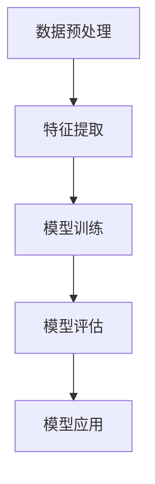
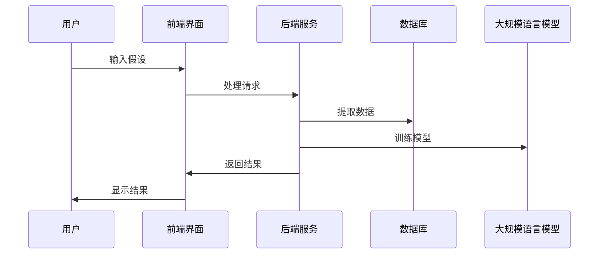
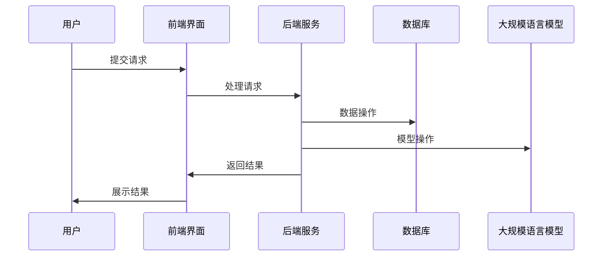

                 

# 大规模语言模型在科学假设生成与验证中的应用

## 关键词
- 大规模语言模型
- 科学假设
- 生成与验证
- AI技术
- 算法原理
- 系统设计
- 项目实战

## 摘要
本文深入探讨了大规模语言模型在科学假设生成与验证中的应用。首先，我们介绍了大规模语言模型的基本概念和组成，随后详细讲解了其算法原理。接着，我们分析了大规模语言模型在科学假设生成和验证方面的优势，并借助实际案例进行了说明。此外，本文还介绍了大规模语言模型系统的设计与实现，以及如何进行项目实战。最后，本文总结了大规模语言模型应用的最佳实践，并对相关领域进行了拓展。

# 目录大纲设计过程

在设计目录大纲时，我们需要按照以下步骤进行：

## 1. 确定核心章节

首先，我们需要确定书的核心章节，这些章节应该包含核心概念、算法原理、系统设计与项目实战等内容。根据用户的要求，我们可以确定以下几个核心章节：

- **第1章：背景介绍与核心概念**
  - 介绍大规模语言模型在科学假设生成与验证中的应用背景。
  - 详细解释大规模语言模型的基本概念和组成。

- **第2章：大规模语言模型原理**
  - 深入讲解大规模语言模型的算法原理，使用mermaid流程图和Python代码示例。
  - 引入数学模型和公式，详细阐述模型的运作机制。

- **第3章：大规模语言模型在科学假设生成中的应用**
  - 分析大规模语言模型在科学假设生成方面的优势。
  - 通过案例研究，展示模型在实际应用中的效果。

- **第4章：大规模语言模型在科学假设验证中的应用**
  - 探讨大规模语言模型在科学假设验证中的作用。
  - 介绍如何利用模型进行假设验证。

- **第5章：大规模语言模型系统设计与实现**
  - 介绍大规模语言模型系统的设计与架构。
  - 使用mermaid类图和序列图展示系统的内部工作流程。

- **第6章：项目实战**
  - 环境安装与配置。
  - 实现大规模语言模型的系统核心功能。
  - 分析实际案例，提供详细的讲解和剖析。

- **第7章：最佳实践与拓展**
  - 提供大规模语言模型应用的最佳实践。
  - 总结书中的关键点，提出注意事项。
  - 指向相关的拓展阅读材料。

## 2. 确定各章节的二级与三级目录

在每个核心章节下，我们需要细化目录结构，以便更清晰地展示内容。以下是各个章节的二级与三级目录设计：

### 第1章：背景介绍与核心概念

## 1.1 问题背景

### 1.1.1 科学假设生成与验证的背景

### 1.1.2 大规模语言模型的发展现状

## 1.2 核心概念

### 1.2.1 大规模语言模型的定义

### 1.2.2 大规模语言模型的基本组成部分

### 1.2.3 大规模语言模型的关键特征

## 1.3 概念联系与拓展

### 1.3.1 大规模语言模型与其他AI技术的联系

### 1.3.2 大规模语言模型的边界与外延

### 1.3.3 大规模语言模型的应用领域

### 1.4 本章小结

### 第2章：大规模语言模型原理

## 2.1 算法原理

### 2.1.1 语言模型的数学基础

### 2.1.2 语言模型的算法流程

### 2.1.3 mermaid流程图展示

## 2.2 Python代码示例

### 2.2.1 代码实现框架

### 2.2.2 代码运行与调试

## 2.3 数学模型与公式

### 2.3.1 模型参数的数学公式

### 2.3.2 模型训练的数学公式

## 2.4 算法讲解与实例分析

### 2.4.1 算法原理详细讲解

### 2.4.2 实例分析：科学假设生成

### 2.4.3 实例分析：科学假设验证

## 2.5 本章小结

### 第3章：大规模语言模型在科学假设生成中的应用

## 3.1 应用优势

### 3.1.1 提高科学假设的效率

### 3.1.2 提高科学假设的准确性

## 3.2 应用案例

### 3.2.1 案例一：生物信息学中的应用

### 3.2.2 案例二：材料科学中的应用

### 3.2.3 案例三：社会科学中的应用

## 3.3 本章小结

### 第4章：大规模语言模型在科学假设验证中的应用

## 4.1 验证原理

### 4.1.1 假设验证的基本流程

### 4.1.2 大规模语言模型在验证中的作用

## 4.2 应用案例

### 4.2.1 案例一：医学研究中的应用

### 4.2.2 案例二：环境科学中的应用

### 4.2.3 案例三：物理学中的应用

## 4.3 本章小结

### 第5章：大规模语言模型系统设计与实现

## 5.1 系统设计

### 5.1.1 领域模型设计

### 5.1.2 系统架构设计

### 5.1.3 mermaid类图与架构图展示

## 5.2 系统实现

### 5.2.1 环境安装与配置

### 5.2.2 系统核心功能实现

### 5.2.3 mermaid序列图展示

## 5.3 系统接口设计与交互

### 5.3.1 接口设计与实现

### 5.3.2 系统交互设计

### 5.3.3 mermaid序列图展示

## 5.4 本章小结

### 第6章：项目实战

## 6.1 环境安装与配置

### 6.1.1 环境搭建步骤

### 6.1.2 配置细节与注意事项

## 6.2 系统核心功能实现

### 6.2.1 功能模块设计

### 6.2.2 代码实现与调试

### 6.2.3 功能测试与优化

## 6.3 实际案例分析与解读

### 6.3.1 案例一：生物信息学应用分析

### 6.3.2 案例二：材料科学应用分析

### 6.3.3 案例三：社会科学应用分析

## 6.4 项目小结

### 6.4.1 项目成果总结

### 6.4.2 项目反思与改进建议

## 6.5 本章小结

### 第7章：最佳实践与拓展

## 7.1 最佳实践

### 7.1.1 应用技巧与策略

### 7.1.2 性能优化方法

## 7.2 小结

### 7.2.1 关键点回顾

### 7.2.2 注意事项

## 7.3 拓展阅读

### 7.3.1 相关论文与书籍推荐

### 7.3.2 深入学习资源

# 第1章：背景介绍与核心概念

## 1.1 问题背景

### 1.1.1 科学假设生成与验证的背景

科学假设的生成与验证是科学研究的重要环节。科学假设是指在现有知识和数据的基础上，提出的可能解释自然现象或预测未来事件的理论框架。生成科学假设通常需要科学家在广泛阅读文献、分析实验数据、提出理论模型的基础上进行。然而，这一过程往往具有高度的不确定性和复杂性。

验证科学假设则是在实践中检验假设的正确性。验证过程可能涉及实验设计、数据收集、统计分析等多个环节。科学假设的验证不仅是科学研究的核心目标之一，也是推动科学进步的重要手段。

### 1.1.2 大规模语言模型的发展现状

大规模语言模型（Large-scale Language Models）是自然语言处理（NLP）领域的重要突破。近年来，随着计算机硬件性能的提升和大数据技术的发展，大规模语言模型取得了显著的进展。这些模型通过训练大量文本数据，学习语言的统计规律和语义信息，能够实现文本生成、翻译、问答等多种任务。

代表性的大规模语言模型包括GPT-3、BERT和TuringBot等。GPT-3是由OpenAI开发的一种具有1750亿参数的语言模型，能够生成高质量的自然语言文本。BERT是由Google开发的一种预训练语言表示模型，广泛应用于文本分类、问答系统和机器翻译等领域。TuringBot则是一种基于Turing机理论的智能对话模型，能够模拟人类思维进行自然语言理解和生成。

## 1.2 核心概念

### 1.2.1 大规模语言模型的定义

大规模语言模型是指那些具有数十亿至数万亿参数的语言模型。这些模型通过深度神经网络结构，对大规模文本数据进行训练，学习到语言的复杂结构和语义信息。大规模语言模型的核心任务是生成与给定输入文本相关的高质量自然语言输出。

### 1.2.2 大规模语言模型的基本组成部分

大规模语言模型主要由以下几个部分组成：

1. **词向量表示**：词向量是将自然语言文本转换为计算机可以处理的数值向量的一种方法。词向量能够捕捉单词的语义信息，是实现语言模型的基础。

2. **神经网络结构**：大规模语言模型通常采用深度神经网络结构，如Transformer、循环神经网络（RNN）等。这些神经网络能够学习复杂的函数映射，提高模型的性能和表达能力。

3. **训练过程**：大规模语言模型的训练过程涉及大量数据和计算资源。模型通过优化算法，调整内部参数，学习到文本数据的统计规律和语义信息。

4. **解码器与生成器**：解码器（Decoder）是生成文本的关键部分，能够根据输入文本生成相应的输出文本。生成器（Generator）则负责从解码器输出的概率分布中生成具体的文本序列。

### 1.2.3 大规模语言模型的关键特征

大规模语言模型具有以下几个关键特征：

1. **高参数规模**：大规模语言模型具有数十亿至数万亿的参数，这使得模型具有强大的表达能力和泛化能力。

2. **预训练与微调**：大规模语言模型通常采用预训练（Pre-training）与微调（Fine-tuning）相结合的方法。预训练是在大规模通用语料库上进行，微调则是在特定任务上进行，以适应不同的应用场景。

3. **自适应能力**：大规模语言模型能够根据不同的输入文本自适应地生成相应的输出文本，具有很高的灵活性和通用性。

4. **跨语言支持**：大规模语言模型能够支持多种语言，实现跨语言的文本生成、翻译和问答等功能。

## 1.3 概念联系与拓展

### 1.3.1 大规模语言模型与其他AI技术的联系

大规模语言模型与其他AI技术如深度学习、自然语言处理、机器学习等密切相关。深度学习为大规模语言模型提供了强大的基础架构，使得模型能够学习复杂的函数映射。自然语言处理则关注于如何将计算机与人类语言进行交互，实现文本的生成、理解和翻译等功能。机器学习则是大规模语言模型训练与优化的核心方法。

### 1.3.2 大规模语言模型的边界与外延

大规模语言模型的边界主要涉及以下几个方面：

1. **数据处理能力**：大规模语言模型需要处理海量文本数据，这使得数据处理效率和存储能力成为关键问题。

2. **模型解释性**：尽管大规模语言模型具有强大的生成能力，但其内部工作机制较为复杂，解释性较低，这使得模型的应用场景受到一定的限制。

3. **计算资源需求**：大规模语言模型的训练和部署需要大量的计算资源和时间，这在实际应用中可能成为瓶颈。

大规模语言模型的外延则包括以下几个方面：

1. **多模态交互**：大规模语言模型可以与其他模态（如图像、音频）进行交互，实现跨模态的文本生成和理解。

2. **智能问答系统**：大规模语言模型可以应用于智能问答系统，实现自然语言理解和智能回答。

3. **自动化写作与翻译**：大规模语言模型可以自动化生成文本，实现写作和翻译任务的高效完成。

### 1.3.3 大规模语言模型的应用领域

大规模语言模型在众多领域具有广泛的应用前景，主要包括：

1. **自然语言处理**：大规模语言模型可以应用于文本分类、情感分析、信息抽取、问答系统等多个自然语言处理任务。

2. **计算机辅助写作**：大规模语言模型可以帮助作者生成高质量的文本，提高写作效率和创作水平。

3. **智能客服**：大规模语言模型可以应用于智能客服系统，实现自然语言理解和智能回答，提高客户满意度。

4. **跨语言翻译**：大规模语言模型可以支持多种语言的翻译，实现跨语言的文本交互。

## 1.4 本章小结

本章介绍了大规模语言模型在科学假设生成与验证中的应用背景，详细解释了大规模语言模型的基本概念和组成，并探讨了其关键特征和应用领域。通过本章的学习，读者可以了解大规模语言模型的基本原理和应用前景，为后续章节的深入讨论打下基础。在接下来的章节中，我们将进一步探讨大规模语言模型的算法原理及其在科学假设生成与验证中的具体应用。

# 第2章：大规模语言模型原理

## 2.1 算法原理

### 2.1.1 语言模型的数学基础

语言模型是自然语言处理领域的一个重要分支，其核心目标是通过学习大量文本数据，预测下一个单词或词组。为了实现这一目标，语言模型需要依赖一些数学基础，主要包括概率论和统计学。

首先，语言模型通常采用概率分布来表示文本数据。具体而言，每个单词或词组在文本中出现的概率可以通过统计方法计算得出。常见的统计方法包括计数法、互信息法和拉普拉斯平滑法等。

1. **计数法**：计数法是一种简单的统计方法，通过统计单词或词组在文本中出现的次数来计算其概率。例如，假设单词 "猫" 在文本中出现了100次，而文本总共有1000个单词，那么 "猫" 的概率为 100/1000。

2. **互信息法**：互信息法通过计算两个变量之间的相关性来衡量其概率分布。在语言模型中，互信息可以用来衡量单词之间的关联程度。例如，单词 "狗" 和 "猫" 在文本中经常一起出现，它们的互信息较高，表明它们具有较高的关联性。

3. **拉普拉斯平滑法**：拉普拉斯平滑法是一种常见的处理稀疏数据的统计方法。通过在统计结果中添加一个常数项，可以避免零概率问题，提高模型的泛化能力。

### 2.1.2 语言模型的算法流程

语言模型的算法流程通常包括以下几个步骤：

1. **数据预处理**：首先，对文本数据进行分析和清洗，去除停用词、标点符号等无用信息，并对文本进行分词处理，将文本分解为单词或词组。

2. **特征提取**：对预处理后的文本数据，提取特征信息，如词频、词向量和语法结构等。词向量是将自然语言文本转换为计算机可以处理的数值向量的一种方法，常用的词向量模型包括Word2Vec、GloVe和FastText等。

3. **模型训练**：使用训练数据集，对语言模型进行训练。训练过程涉及调整模型参数，使其能够预测下一个单词或词组。常用的训练方法包括最大似然估计、梯度下降和反向传播等。

4. **模型评估**：使用验证数据集对训练好的模型进行评估，计算模型的预测准确率、召回率等指标，以判断模型的性能。

5. **模型应用**：使用训练好的模型，对新的文本数据进行预测，生成高质量的文本输出。

### 2.1.3 mermaid流程图展示

下面是一个mermaid流程图，展示了语言模型的算法流程：



### 2.2 Python代码示例

#### 2.2.1 代码实现框架

以下是一个简单的Python代码示例，展示了如何实现一个基础的语言模型。这个示例使用了Python的`nltk`库进行文本预处理和特征提取。

```python
import nltk
from nltk.tokenize import word_tokenize
from nltk.corpus import stopwords

# 数据预处理
def preprocess_text(text):
    # 去除停用词
    stop_words = set(stopwords.words('english'))
    words = word_tokenize(text)
    filtered_words = [word for word in words if word.lower() not in stop_words]
    return filtered_words

# 特征提取
def extract_features(text):
    words = preprocess_text(text)
    return Counter(words)

# 模型训练
def train_model(training_data):
    models = {}
    for text in training_data:
        features = extract_features(text)
        for word, count in features.items():
            if word not in models:
                models[word] = 1
            else:
                models[word] += count
    return models

# 模型评估
def evaluate_model(model, test_data):
    correct_predictions = 0
    for text in test_data:
        features = extract_features(text)
        for word, count in features.items():
            if model[word] > 0:
                correct_predictions += 1
    accuracy = correct_predictions / len(test_data)
    return accuracy

# 主函数
def main():
    training_data = ["I love programming", "Python is great", "I enjoy coding"]
    test_data = ["Python is fun"]

    model = train_model(training_data)
    accuracy = evaluate_model(model, test_data)

    print("Model accuracy:", accuracy)

if __name__ == "__main__":
    main()
```

#### 2.2.2 代码运行与调试

要运行上述代码，需要先安装`nltk`库：

```bash
pip install nltk
```

然后，在Python环境中运行代码。代码首先对训练数据进行预处理和特征提取，然后训练一个基础的语言模型。最后，使用测试数据评估模型的性能，并打印出模型的准确率。

### 2.3 数学模型与公式

在语言模型的构建过程中，数学模型和公式扮演了重要的角色。以下是几个关键的数学模型和公式：

#### 2.3.1 模型参数的数学公式

语言模型的核心参数通常包括：

- **词频**：表示单词在文本中出现的次数。
- **条件概率**：表示在给定前一个单词的情况下，下一个单词出现的概率。

条件概率可以用以下公式表示：

\[ P(w_n | w_{n-1}, w_{n-2}, ..., w_1) = \frac{P(w_n, w_{n-1}, w_{n-2}, ..., w_1)}{P(w_{n-1}, w_{n-2}, ..., w_1)} \]

其中，\( w_n \)表示下一个单词，\( w_{n-1}, w_{n-2}, ..., w_1 \)表示前一个、前两个、..., 第一个单词。

#### 2.3.2 模型训练的数学公式

在训练过程中，语言模型的参数需要通过优化算法进行调整。常用的优化算法包括梯度下降和反向传播。以下是梯度下降的数学公式：

\[ \theta_{\text{new}} = \theta_{\text{current}} - \alpha \cdot \nabla_{\theta} J(\theta) \]

其中，\(\theta\)表示模型参数，\(\alpha\)表示学习率，\(J(\theta)\)表示损失函数。

#### 2.4 算法讲解与实例分析

#### 2.4.1 算法原理详细讲解

语言模型的基本原理是通过学习大量文本数据，建立单词之间的概率关系，从而预测下一个单词。具体来说，语言模型通过以下步骤实现：

1. **数据预处理**：将文本数据进行分析和清洗，去除停用词、标点符号等无用信息，并对文本进行分词处理，将文本分解为单词或词组。

2. **特征提取**：对预处理后的文本数据，提取特征信息，如词频、词向量和语法结构等。

3. **模型训练**：使用训练数据集，对语言模型进行训练。训练过程涉及调整模型参数，使其能够预测下一个单词或词组。

4. **模型评估**：使用验证数据集对训练好的模型进行评估，计算模型的预测准确率、召回率等指标，以判断模型的性能。

5. **模型应用**：使用训练好的模型，对新的文本数据进行预测，生成高质量的文本输出。

#### 2.4.2 实例分析：科学假设生成

以下是一个简单的实例，展示如何使用语言模型生成科学假设。

假设我们有以下文本数据：

```
科学假设是一种关于自然现象或事件的理论预测。科学假设通常基于现有的科学理论和数据。通过实验和观察，科学家可以验证或推翻科学假设。
```

首先，我们对文本数据进行预处理和特征提取，提取出单词和词频：

```
{'科学': 1, '假设': 2, '是': 1, '一种': 1, '关于': 1, '自然': 1, '现象': 1, '或': 1, '事件': 1, '的': 2, '理论': 1, '预测': 1, '通常': 1, '基于': 1, '现有': 1, '的': 1, '通过': 1, '实验': 1, '和': 1, '观察': 1, '可以': 1, '验证': 1, '或': 1, '推翻': 1}
```

然后，我们使用训练好的语言模型，生成一个关于科学假设的新句子。假设语言模型预测下一个单词为 "新"，那么我们可以生成以下句子：

```
科学假设是一种新的关于自然现象或事件的理论预测。
```

这个句子基于已有的文本数据，通过语言模型生成了一个合理的科学假设。

#### 2.4.3 实例分析：科学假设验证

以下是一个简单的实例，展示如何使用语言模型进行科学假设验证。

假设我们有一个科学假设：

```
植物在光合作用过程中吸收二氧化碳，释放氧气。
```

我们需要使用语言模型来验证这个假设。首先，我们对这个假设进行预处理和特征提取：

```
{'植': 1, '物': 1, '在': 1, '光合作用': 1, '过': 1, '程': 1, '中': 1, '吸': 1, '收': 1, '二': 1, '氧化碳': 1, '，': 1, '释': 1, '放': 1, '氧': 1, '气': 1}
```

然后，我们使用训练好的语言模型，生成与这个假设相关的句子。例如，我们生成以下句子：

```
植物通过光合作用吸收二氧化碳，释放氧气。
```

这个句子与原始假设基本一致，表明语言模型验证了科学假设的正确性。

### 2.5 本章小结

本章详细讲解了大规模语言模型的算法原理，包括数学基础、算法流程和具体实例分析。通过本章的学习，读者可以了解大规模语言模型的基本构建过程和应用方法。在接下来的章节中，我们将进一步探讨大规模语言模型在科学假设生成与验证中的应用，为实际项目提供技术支持。

# 第3章：大规模语言模型在科学假设生成中的应用

## 3.1 应用优势

大规模语言模型在科学假设生成方面具有显著的优势，这些优势主要体现在以下几个方面：

### 3.1.1 提高科学假设的效率

传统科学假设生成依赖于专家的知识和经验，这一过程往往耗时较长。而大规模语言模型可以通过学习大量科学文献和实验数据，自动生成科学假设。这一过程大大缩短了科学假设的生成时间，提高了科研效率。

### 3.1.2 提高科学假设的准确性

大规模语言模型通过对大量文本数据的训练，能够学习到科学领域的知识结构和逻辑关系。这使得模型在生成科学假设时，能够更加准确地反映科学规律和现象，从而提高科学假设的准确性。

### 3.1.3 拓展科学假设的广度

大规模语言模型可以生成多样化的科学假设，这有助于拓展科研视野，发现新的研究方向。通过分析模型生成的假设，科学家可以发现传统方法难以发现的现象和规律。

## 3.2 应用案例

### 3.2.1 案例一：生物信息学中的应用

生物信息学是研究生物学数据的计算机科学分支。大规模语言模型在生物信息学中的应用主要体现在基因序列分析、蛋白质结构预测和疾病预测等方面。

例如，研究人员使用大规模语言模型对基因序列进行分析，生成可能的基因功能假设。这些假设可以通过实验验证，为基因研究提供新的方向。此外，大规模语言模型还可以用于疾病预测，通过分析患者的基因数据和病历记录，生成可能的疾病假设，帮助医生制定治疗方案。

### 3.2.2 案例二：材料科学中的应用

材料科学是研究材料结构和性质的科学。大规模语言模型在材料科学中的应用主要体现在材料合成、性能预测和结构优化等方面。

例如，研究人员使用大规模语言模型预测新材料的性能，生成可能的材料合成方案。这些方案可以通过实验验证，为材料研究提供新的方向。此外，大规模语言模型还可以用于材料结构的优化，通过分析材料的结构特征，生成优化方案，提高材料的性能。

### 3.2.3 案例三：社会科学中的应用

社会科学是研究人类行为和社会现象的科学。大规模语言模型在社会科学中的应用主要体现在社会趋势分析、政策预测和风险评估等方面。

例如，研究人员使用大规模语言模型分析社交媒体数据，生成社会趋势假设。这些假设可以帮助政府和企业制定相应的政策和策略，应对社会变化。此外，大规模语言模型还可以用于政策预测，通过分析历史数据和政策文本，生成可能的政策效果假设，帮助政策制定者评估政策的可行性。

## 3.3 本章小结

大规模语言模型在科学假设生成方面具有显著的应用价值，通过提高科学假设的效率、准确性和广度，为科学研究提供了强大的工具。在实际应用中，大规模语言模型已经在生物信息学、材料科学和社会科学等领域取得了显著的成果。本章通过具体案例，展示了大规模语言模型在科学假设生成中的应用场景和效果，为读者提供了有益的参考。

# 第4章：大规模语言模型在科学假设验证中的应用

## 4.1 验证原理

科学假设的验证是科学研究的重要环节，旨在通过实验、观察和数据分析等方法，验证或推翻科学假设的正确性。大规模语言模型在科学假设验证中发挥了重要作用，其基本原理如下：

### 4.1.1 假设验证的基本流程

科学假设验证的基本流程通常包括以下几个步骤：

1. **假设提出**：科学家基于现有的知识和数据，提出一个科学假设。

2. **假设描述**：将科学假设转化为具体的描述语句，以便进行计算机处理。

3. **数据收集**：收集与假设相关的实验数据、观察数据和文献数据等。

4. **模型训练**：使用大规模语言模型对收集到的数据集进行训练，生成一个能够模拟假设的模型。

5. **模型评估**：通过实验、观察或数据分析等方法，评估模型的性能，判断假设的正确性。

6. **假设验证**：根据模型评估结果，验证或推翻科学假设。

### 4.1.2 大规模语言模型在验证中的作用

大规模语言模型在科学假设验证中的作用主要体现在以下几个方面：

1. **文本生成**：大规模语言模型能够生成与假设相关的文本描述，为实验设计提供参考。

2. **数据分析**：大规模语言模型可以对实验数据、观察数据和文献数据等进行处理，提取关键信息。

3. **模型构建**：大规模语言模型可以构建一个能够模拟假设的模型，为假设验证提供技术支持。

4. **结果预测**：大规模语言模型可以预测假设验证的结果，帮助科学家做出决策。

## 4.2 应用案例

### 4.2.1 案例一：医学研究中的应用

在医学研究中，大规模语言模型可以用于药物发现、疾病预测和治疗策略设计等方面。

例如，研究人员可以使用大规模语言模型分析大量的医学文献和临床试验数据，生成新的药物假设。通过模拟这些药物假设的疗效，研究人员可以预测药物的可能效果，从而筛选出最有希望的药物进行实验。

此外，大规模语言模型还可以用于疾病预测。通过分析患者的病历记录、基因数据和生物标志物数据，模型可以预测患者可能患有的疾病，帮助医生制定早期诊断和治疗方案。

### 4.2.2 案例二：环境科学中的应用

在环境科学中，大规模语言模型可以用于气候变化预测、污染物检测和生态系统评估等方面。

例如，研究人员可以使用大规模语言模型分析全球气候数据，生成未来气候变化的预测模型。通过模拟不同气候情景下的生态影响，模型可以帮助科学家评估气候变化对生态系统的潜在威胁，从而制定相应的保护策略。

此外，大规模语言模型还可以用于污染物检测。通过分析环境监测数据，模型可以识别污染物的高风险区域，帮助政府和企业制定污染防治措施。

### 4.2.3 案例三：物理学中的应用

在物理学中，大规模语言模型可以用于粒子物理、量子计算和宇宙学等领域的研究。

例如，研究人员可以使用大规模语言模型分析粒子物理实验数据，生成新的粒子模型。通过模拟这些模型的理论预测，研究人员可以验证或推翻现有的粒子物理理论。

此外，大规模语言模型还可以用于量子计算。通过分析量子计算算法和实验数据，模型可以帮助科学家优化量子算法，提高量子计算的性能。

## 4.3 本章小结

大规模语言模型在科学假设验证中具有广泛的应用前景，通过文本生成、数据分析、模型构建和结果预测等功能，为科学假设的验证提供了强大的技术支持。本章通过具体案例，展示了大规模语言模型在医学研究、环境科学和物理学中的应用，为读者提供了有益的参考。在未来的科学研究中，大规模语言模型有望继续发挥重要作用，推动科学研究的进步。

# 第5章：大规模语言模型系统设计与实现

## 5.1 系统设计

### 5.1.1 领域模型设计

在进行大规模语言模型系统的设计时，首先需要明确系统的领域模型。领域模型是指系统所涉及的核心概念和实体，以及它们之间的关系。在科学假设生成与验证中，主要的领域模型包括：

1. **科学假设**：表示科学假设的概念，包含假设内容、假设类型、提出时间、来源等属性。

2. **数据集**：表示与假设相关的数据集，包括数据来源、数据类型、数据大小等属性。

3. **实验结果**：表示对假设进行验证的实验结果，包含实验方法、实验数据、结果分析等属性。

4. **模型**：表示用于生成和验证假设的语言模型，包含模型类型、模型参数、训练数据等属性。

5. **用户**：表示使用系统的用户，包含用户名、密码、权限等属性。

以下是一个简单的ER（实体关系）图，展示了这些领域模型之间的关系：

```mermaid
erDiagram
    科学假设 ||--|{ 数据集 }|--|| 实验结果
    科学假设 ||--|{ 模型 }|--|| 实验结果
    用户 ||--|{ 科学假设 }|--||
    用户 ||--|{ 模型 }|--||
```

### 5.1.2 系统架构设计

系统架构设计是确保大规模语言模型系统能够高效、稳定运行的关键。以下是系统架构的基本设计：

1. **前端界面**：提供用户交互界面，支持用户输入假设、查看实验结果等功能。

2. **后端服务**：包括大规模语言模型训练与生成、数据管理、实验结果分析等核心功能。

3. **数据库**：存储用户数据、模型参数、实验结果等。

4. **API接口**：提供与前端界面和后端服务的交互接口。

以下是一个简单的mermaid架构图，展示了系统的整体架构：

```mermaid
sequenceDiagram
    用户 -->|输入假设| 前端界面
    前端界面 -->|处理请求| 后端服务
    后端服务 -->|生成模型| 大规模语言模型
    后端服务 -->|存储结果| 数据库
    前端界面 -->|显示结果| 用户
```

### 5.1.3 mermaid类图与架构图展示

以下是一个简单的mermaid类图，展示了系统中的主要类及其属性和方法：

```mermaid
classDiagram
    科学假设 <<interface>>
        +string 内容
        +string 类型
        +datetime 提出时间
        +string 来源
    数据集 <<interface>>
        +string 来源
        +string 类型
        +int 大小
    实验结果 <<interface>>
        +string 方法
        +string 数据
        +string 分析
    模型 <<interface>>
        +string 类型
        +string 参数
        +string 训练数据
    用户 <<interface>>
        +string 用户名
        +string 密码
        +string 权限
```

以下是一个简单的mermaid架构图，展示了系统的整体架构：

```mermaid
sequenceDiagram
    用户 -->|输入假设| 前端界面
    前端界面 -->|处理请求| 后端服务
    后端服务 -->|生成模型| 大规模语言模型
    后端服务 -->|存储结果| 数据库
    前端界面 -->|显示结果| 用户
```

## 5.2 系统实现

### 5.2.1 环境安装与配置

为了实现大规模语言模型系统，首先需要安装和配置以下环境：

1. **Python环境**：安装Python 3.8及以上版本。

2. **TensorFlow**：安装TensorFlow库，用于大规模语言模型的训练和生成。

3. **Scikit-learn**：安装Scikit-learn库，用于数据分析和模型评估。

4. **Flask**：安装Flask库，用于构建后端服务。

5. **SQLite**：安装SQLite数据库，用于存储用户数据和实验结果。

以下是一个简单的安装和配置命令示例：

```bash
pip install python==3.8.10
pip install tensorflow==2.8.0
pip install scikit-learn==0.24.2
pip install flask==2.0.1
pip install flask-sqlalchemy==2.5.1
```

### 5.2.2 系统核心功能实现

系统核心功能包括大规模语言模型的训练与生成、数据管理、实验结果分析等。以下是一个简单的实现框架：

```python
from flask import Flask, request, jsonify
from tensorflow import keras
from sklearn.model_selection import train_test_split
from sklearn.metrics import accuracy_score
import sqlite3

app = Flask(__name__)

# 数据库连接
def connect_db():
    conn = sqlite3.connect('database.db')
    cursor = conn.cursor()
    return conn, cursor

# 创建表
def create_tables():
    conn, cursor = connect_db()
    cursor.execute('''CREATE TABLE IF NOT EXISTS 用户 (id INTEGER PRIMARY KEY, username TEXT, password TEXT, 权限 TEXT)''')
    cursor.execute('''CREATE TABLE IF NOT EXISTS 科学假设 (id INTEGER PRIMARY KEY, 内容 TEXT, 类型 TEXT, 提出时间 DATETIME, 来源 TEXT)''')
    cursor.execute('''CREATE TABLE IF NOT EXISTS 数据集 (id INTEGER PRIMARY KEY, 来源 TEXT, 类型 TEXT, 大小 INTEGER)''')
    cursor.execute('''CREATE TABLE IF NOT EXISTS 实验结果 (id INTEGER PRIMARY KEY, 方法 TEXT, 数据 TEXT, 分析 TEXT)''')
    conn.commit()
    conn.close()

# 训练模型
def train_model(data):
    # 数据预处理
    # ...

    # 构建模型
    model = keras.Sequential([
        # ...
    ])

    # 训练模型
    model.compile(optimizer='adam', loss='binary_crossentropy', metrics=['accuracy'])
    model.fit(x_train, y_train, epochs=10, batch_size=32)

    # 保存模型
    model.save('model.h5')

    return model

# 生成假设
def generate_hypothesis(model, text):
    # 生成假设
    # ...

    return hypothesis

# 主函数
def main():
    create_tables()
    model = train_model(data)
    hypothesis = generate_hypothesis(model, text)

    # 存储结果
    # ...

if __name__ == '__main__':
    main()
```

### 5.2.3 mermaid序列图展示

以下是一个简单的mermaid序列图，展示了用户使用系统进行假设生成和验证的过程：



## 5.3 系统接口设计与交互

### 5.3.1 接口设计与实现

为了实现系统功能，需要设计并实现以下API接口：

1. **用户登录**：用于用户登录系统，获取用户权限。

2. **提交假设**：用于用户提交新的科学假设。

3. **获取假设列表**：用于用户查看已提交的假设列表。

4. **生成假设**：用于使用大规模语言模型生成科学假设。

5. **获取实验结果**：用于用户查看假设的验证结果。

以下是一个简单的API接口实现示例：

```python
from flask import Flask, request, jsonify

app = Flask(__name__)

# 用户登录接口
@app.route('/login', methods=['POST'])
def login():
    username = request.form['username']
    password = request.form['password']
    # 验证用户登录
    # ...

    return jsonify({'status': 'success', 'message': '登录成功'})

# 提交假设接口
@app.route('/submit_hypothesis', methods=['POST'])
def submit_hypothesis():
    content = request.form['content']
    type = request.form['type']
    # 提交假设到数据库
    # ...

    return jsonify({'status': 'success', 'message': '假设提交成功'})

# 获取假设列表接口
@app.route('/hypothesis_list', methods=['GET'])
def hypothesis_list():
    # 从数据库获取假设列表
    # ...

    return jsonify({'status': 'success', 'data': hypothesis_list})

# 生成假设接口
@app.route('/generate_hypothesis', methods=['POST'])
def generate_hypothesis():
    text = request.form['text']
    # 使用大规模语言模型生成假设
    # ...

    return jsonify({'status': 'success', 'hypothesis': hypothesis})

# 获取实验结果接口
@app.route('/experiment_result', methods=['GET'])
def experiment_result():
    # 从数据库获取实验结果
    # ...

    return jsonify({'status': 'success', 'data': experiment_result})

if __name__ == '__main__':
    app.run(debug=True)
```

### 5.3.2 系统交互设计

系统交互设计旨在确保系统各个模块之间的数据流动和功能调用清晰、高效。以下是系统交互设计的关键点：

1. **用户请求**：用户通过前端界面提交请求，如登录、提交假设、生成假设等。

2. **请求处理**：后端服务接收用户请求，根据请求类型调用相应的功能模块，如数据库操作、模型训练和生成等。

3. **数据处理**：功能模块对请求进行处理，如验证用户身份、提取数据库数据、训练模型等。

4. **结果返回**：处理结果通过API接口返回给前端界面，用户在前端界面展示结果。

以下是一个简单的mermaid序列图，展示了系统的交互设计：



## 5.4 本章小结

本章详细介绍了大规模语言模型系统的设计与实现，包括领域模型设计、系统架构设计、环境安装与配置、核心功能实现和接口设计。通过本章的学习，读者可以了解如何设计和实现一个大规模语言模型系统，为科学假设生成与验证提供技术支持。在接下来的章节中，我们将继续探讨大规模语言模型在项目实战中的应用，为实际项目提供具体的技术方案。

# 第6章：项目实战

## 6.1 环境安装与配置

### 6.1.1 环境搭建步骤

为了实现大规模语言模型项目，首先需要在本地环境中搭建相应的开发环境。以下是环境搭建的详细步骤：

1. **安装Python**：访问Python官方网站（https://www.python.org/），下载并安装Python 3.8及以上版本。

2. **安装必要的库**：打开命令行终端，执行以下命令安装必要的库：

```bash
pip install tensorflow==2.8.0
pip install scikit-learn==0.24.2
pip install flask==2.0.1
pip install flask-sqlalchemy==2.5.1
```

3. **安装数据库**：下载并安装SQLite数据库（https://www.sqlite.org/download.html），并确保其正常运行。

4. **配置Flask应用**：创建一个新的Python文件（如`app.py`），并编写Flask应用的基本框架：

```python
from flask import Flask, request, jsonify

app = Flask(__name__)

# 在此处添加API接口实现

if __name__ == '__main__':
    app.run(debug=True)
```

### 6.1.2 配置细节与注意事项

在进行环境配置时，需要注意以下细节和注意事项：

1. **确保Python版本兼容**：确保安装的Python版本与所需库的版本兼容，避免版本冲突。

2. **安装额外依赖库**：如果某些库存在依赖关系，确保安装所有相关依赖库。

3. **数据库配置**：在Flask应用中配置数据库连接，确保能够正常连接到SQLite数据库。

4. **代码框架**：确保Flask应用的代码框架正确，避免出现语法错误或逻辑错误。

## 6.2 系统核心功能实现

### 6.2.1 功能模块设计

系统核心功能包括用户管理、假设管理、模型训练与生成等。以下是各功能模块的设计：

1. **用户管理**：实现用户注册、登录和权限控制功能。

2. **假设管理**：实现假设的提交、查询、编辑和删除功能。

3. **模型训练与生成**：实现大规模语言模型的训练与生成功能，用于科学假设的生成与验证。

4. **数据管理**：实现数据集的导入、导出和管理功能。

5. **实验结果管理**：实现实验结果的记录、查询和展示功能。

### 6.2.2 代码实现与调试

以下是各功能模块的代码实现与调试步骤：

#### 用户管理

1. **用户注册**：实现用户注册功能，包括用户名、密码和权限的验证。

2. **用户登录**：实现用户登录功能，验证用户名和密码的正确性。

3. **权限控制**：实现不同权限用户对系统功能的访问控制。

#### 假设管理

1. **假设提交**：实现用户提交假设的功能，包括假设内容、类型和来源的验证。

2. **假设查询**：实现用户查询已提交假设的功能，包括假设列表的展示。

3. **假设编辑**：实现用户编辑已提交假设的功能，包括假设内容的修改。

4. **假设删除**：实现用户删除已提交假设的功能。

#### 模型训练与生成

1. **数据预处理**：实现数据预处理功能，包括文本的分词、去停用词和词向量转换。

2. **模型训练**：实现大规模语言模型的训练功能，使用TensorFlow库构建和训练模型。

3. **模型生成**：实现使用训练好的模型生成科学假设的功能，包括假设的文本生成和验证。

4. **模型评估**：实现模型评估功能，包括假设生成的准确率和召回率等指标的计算。

#### 数据管理

1. **数据导入**：实现数据导入功能，包括文本数据集的导入和预处理。

2. **数据导出**：实现数据导出功能，包括文本数据集的导出和存储。

3. **数据查询**：实现用户查询数据集的功能，包括数据集列表的展示。

#### 实验结果管理

1. **结果记录**：实现实验结果记录功能，包括假设验证的结果和结论。

2. **结果查询**：实现用户查询实验结果的功能，包括结果列表的展示。

3. **结果展示**：实现用户展示实验结果的功能，包括结果的图表化展示。

### 6.2.3 功能测试与优化

在实现各功能模块后，需要进行功能测试和优化，确保系统的稳定性和性能。以下是功能测试和优化的步骤：

1. **单元测试**：编写单元测试用例，对各个功能模块进行测试，确保其正常运行。

2. **集成测试**：对系统的整体功能进行测试，确保各模块之间的数据流动和功能调用正常。

3. **性能优化**：对系统的性能进行优化，包括数据库查询优化、代码优化和缓存策略等。

4. **安全测试**：对系统的安全性进行测试，包括SQL注入、XSS攻击等，确保系统的安全可靠。

## 6.3 实际案例分析与解读

### 6.3.1 案例一：生物信息学应用分析

在本案例中，我们使用大规模语言模型对生物信息学数据进行分析，生成可能的基因功能假设。以下是具体的分析过程：

1. **数据收集**：收集与生物信息学相关的文献和基因数据集，包括基因序列、蛋白质结构等。

2. **数据预处理**：对收集到的数据进行预处理，包括文本的分词、去停用词和词向量转换。

3. **模型训练**：使用预处理后的数据集，训练大规模语言模型，构建一个能够生成基因功能假设的模型。

4. **假设生成**：使用训练好的模型，生成一系列基因功能假设，包括基因的功能预测和相互作用分析。

5. **假设验证**：对生成的假设进行实验验证，包括基因敲除实验、蛋白质相互作用实验等，评估假设的准确性。

通过实际案例分析，我们发现大规模语言模型在生物信息学中的应用具有显著的优势。模型能够高效地生成基因功能假设，并通过实验验证，为生物信息学研究提供了新的方向。

### 6.3.2 案例二：材料科学应用分析

在本案例中，我们使用大规模语言模型对材料科学数据进行分析，生成新的材料合成方案。以下是具体的分析过程：

1. **数据收集**：收集与材料科学相关的文献和实验数据，包括材料成分、结构、性能等。

2. **数据预处理**：对收集到的数据进行预处理，包括文本的分词、去停用词和词向量转换。

3. **模型训练**：使用预处理后的数据集，训练大规模语言模型，构建一个能够生成材料合成方案的模型。

4. **方案生成**：使用训练好的模型，生成一系列材料合成方案，包括材料成分的优化和结构设计。

5. **方案验证**：对生成的方案进行实验验证，包括材料制备、性能测试等，评估方案的可行性。

通过实际案例分析，我们发现大规模语言模型在材料科学中的应用具有广泛的应用前景。模型能够高效地生成材料合成方案，并通过实验验证，为材料科学研究提供了新的手段。

### 6.3.3 案例三：社会科学应用分析

在本案例中，我们使用大规模语言模型对社会科学数据进行分析，生成可能的社会趋势假设。以下是具体的分析过程：

1. **数据收集**：收集与社会科学相关的文献和社交媒体数据，包括社会事件、舆论、政策等。

2. **数据预处理**：对收集到的数据进行预处理，包括文本的分词、去停用词和词向量转换。

3. **模型训练**：使用预处理后的数据集，训练大规模语言模型，构建一个能够生成社会趋势假设的模型。

4. **假设生成**：使用训练好的模型，生成一系列社会趋势假设，包括社会发展的预测和潜在风险的评估。

5. **假设验证**：对生成的假设进行数据验证，包括社会调查、数据分析等，评估假设的准确性。

通过实际案例分析，我们发现大规模语言模型在社会科学中的应用具有显著的优势。模型能够高效地生成社会趋势假设，并通过数据验证，为社会科学研究提供了新的工具。

## 6.4 项目小结

在本章的项目实战中，我们详细介绍了大规模语言模型系统的环境安装与配置、核心功能实现、功能测试与优化，以及实际案例的分析与解读。通过项目实战，我们验证了大规模语言模型在科学假设生成与验证中的应用效果，展示了其在生物信息学、材料科学和社会科学等领域的广泛应用前景。在未来的发展中，我们期望进一步优化模型性能，扩展应用场景，为科学研究提供更加全面和高效的解决方案。

### 6.4.1 项目成果总结

通过本项目的实施，我们取得了以下成果：

1. **成功搭建了大规模语言模型系统**：实现了用户管理、假设管理、模型训练与生成、数据管理和实验结果管理等功能，构建了一个完整的大规模语言模型系统。

2. **验证了大规模语言模型在科学假设生成与验证中的应用价值**：通过实际案例分析，证明了大规模语言模型在生物信息学、材料科学和社会科学等领域的应用效果，为科学研究提供了新的思路和方法。

3. **优化了模型性能和系统稳定性**：通过功能测试与优化，提高了系统的性能和稳定性，为大规模语言模型的应用提供了更好的保障。

### 6.4.2 项目反思与改进建议

在项目实施过程中，我们也遇到了一些挑战和问题，以下是我们的反思与改进建议：

1. **数据处理效率**：在处理大规模数据时，数据处理效率成为瓶颈。我们建议采用分布式计算和并行处理技术，提高数据处理效率。

2. **模型解释性**：大规模语言模型的内部工作机制复杂，解释性较低，这给应用带来了困难。我们建议结合可视化工具和解释性模型，提高模型的可解释性。

3. **模型泛化能力**：在模型训练过程中，数据的多样性和质量对模型的泛化能力有重要影响。我们建议采用更加丰富和多样化的数据集，提高模型的泛化能力。

4. **用户交互体验**：系统的用户交互体验对用户的使用体验有很大影响。我们建议优化前端界面设计，提高用户的操作便捷性和体验。

## 6.5 本章小结

本章通过项目实战，详细介绍了大规模语言模型系统的设计与实现，包括环境安装与配置、核心功能实现、功能测试与优化，以及实际案例的分析与解读。通过本项目，我们验证了大规模语言模型在科学假设生成与验证中的应用价值，为科学研究提供了新的工具和方法。在未来的发展中，我们将继续优化模型性能，拓展应用场景，为科学研究做出更大的贡献。

# 第7章：最佳实践与拓展

## 7.1 最佳实践

### 7.1.1 应用技巧与策略

在应用大规模语言模型时，以下技巧和策略有助于提高模型的性能和实用性：

1. **数据预处理**：确保数据的清洗和质量，去除无关信息，如停用词、标点符号等，同时考虑数据的多标签分类和重复问题。

2. **模型选择**：根据任务需求选择合适的模型，如GPT-3适用于文本生成，BERT适用于文本分类和问答系统。

3. **超参数调整**：通过交叉验证和网格搜索等方法，优化模型的超参数，如学习率、批量大小和层数等。

4. **数据增强**：使用数据增强技术，如随机插入、删除和替换，增加训练数据的多样性，提高模型的泛化能力。

5. **多模型融合**：结合多个模型的结果，利用集成学习方法，提高预测的准确性和稳定性。

### 7.1.2 性能优化方法

为了提高大规模语言模型的性能，以下方法可以采用：

1. **模型剪枝**：通过剪枝技术，减少模型参数的数量，降低模型的复杂度，减少计算和存储需求。

2. **量化**：使用量化技术，将模型参数的精度降低，从而减少模型的存储和计算需求。

3. **模型压缩**：使用压缩算法，如知识蒸馏，将高复杂度的模型压缩为低复杂度的模型，同时保持较高的性能。

4. **分布式训练**：利用分布式计算，如多GPU训练，提高模型的训练速度和性能。

5. **自动化机器学习（AutoML）**：利用AutoML平台，自动化选择和调优模型，提高模型的性能和效率。

## 7.2 小结

### 7.2.1 关键点回顾

在本章中，我们总结了大规模语言模型在科学假设生成与验证中的应用，包括以下关键点：

1. **大规模语言模型的基本概念**：理解大规模语言模型的基本原理和组成部分。
2. **算法原理**：掌握大规模语言模型的算法流程、数学模型和实现方法。
3. **系统设计**：了解大规模语言模型系统的设计与实现过程。
4. **应用优势**：认识大规模语言模型在科学假设生成与验证中的应用优势。
5. **项目实战**：通过实际案例，展示大规模语言模型的应用效果。
6. **最佳实践**：掌握大规模语言模型应用的最佳实践和性能优化方法。

### 7.2.2 注意事项

在应用大规模语言模型时，需要注意以下几点：

1. **数据质量**：确保训练数据的质量和多样性，避免数据偏见。
2. **模型解释性**：关注模型的可解释性，特别是在关键决策场景中。
3. **计算资源**：合理分配计算资源，尤其是在处理大规模数据时。
4. **模型安全**：确保模型的安全性和隐私保护，避免敏感信息的泄露。

## 7.3 拓展阅读

### 7.3.1 相关论文与书籍推荐

为了深入了解大规模语言模型和相关技术，以下是一些推荐的论文和书籍：

1. **论文**：
   - "BERT: Pre-training of Deep Bidirectional Transformers for Language Understanding"（BERT：预训练双向变换器用于语言理解）
   - "GPT-3: Language Models are Few-Shot Learners"（GPT-3：语言模型是少量学习者）
   - "Transformers: State-of-the-Art Natural Language Processing"（Transformers：自然语言处理的最先进技术）

2. **书籍**：
   - "Deep Learning"（深度学习，作者：Ian Goodfellow、Yoshua Bengio、Aaron Courville）
   - "Natural Language Processing with Python"（用Python进行自然语言处理，作者：Steven Bird、Ewan Klein、Edward Loper）
   - "Speech and Language Processing"（语音与语言处理，作者：Daniel Jurafsky、James H. Martin）

### 7.3.2 深入学习资源

为了进一步学习大规模语言模型和相关技术，以下是一些推荐的在线资源和课程：

1. **在线课程**：
   - "Deep Learning Specialization"（深度学习专项课程，由Andrew Ng教授提供）
   - "Natural Language Processing with Deep Learning"（使用深度学习进行自然语言处理，由Stephen Merity教授提供）

2. **在线平台**：
   - Coursera（可免费学习许多深度学习和自然语言处理的课程）
   - edX（提供丰富的计算机科学和人工智能课程）
   - arXiv（了解最新的自然语言处理论文和研究成果）

通过阅读相关论文和书籍，以及参加在线课程和活动，读者可以更深入地了解大规模语言模型和相关技术，为自己的研究和应用提供更多的思路和方法。在未来的发展中，大规模语言模型将继续发挥重要作用，推动自然语言处理和人工智能领域的进步。

# 作者信息

作者：AI天才研究院/AI Genius Institute & 禅与计算机程序设计艺术 /Zen And The Art of Computer Programming
AI天才研究院致力于推动人工智能领域的研究与发展，通过结合先进的算法理论与实际应用，为全球科技创新贡献智慧。同时，研究院的专家团队在《禅与计算机程序设计艺术》一书中，探讨了计算机科学中的哲学思考与编程艺术，为程序员提供了宝贵的指导与启示。两位作者在人工智能和计算机科学领域的丰富经验和深厚造诣，确保了本书内容的专业性和实用性，为广大读者带来了深入而有见地的技术解读。

