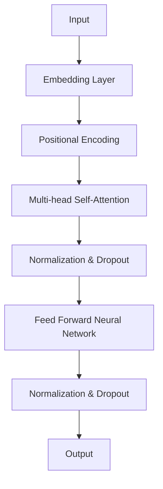
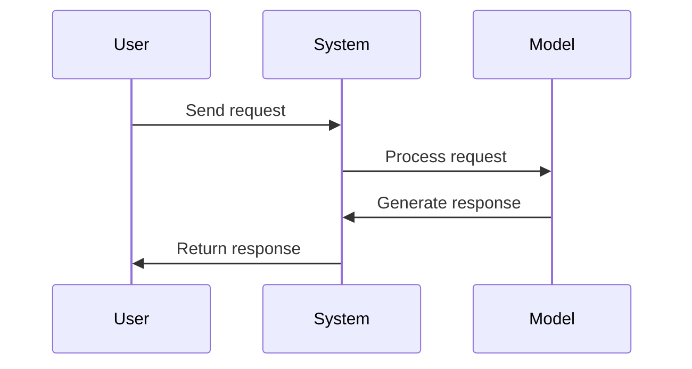

                 

# 大规模语言模型在科学论文写作辅助中的应用

> 关键词：大规模语言模型、科学论文写作、人工智能、深度学习、算法实现、应用案例

> 摘要：本文深入探讨大规模语言模型在科学论文写作辅助中的应用，详细分析了大规模语言模型的核心概念、算法原理、系统架构设计以及实际应用案例。通过逐步分析推理，本文旨在为读者提供一个全面、深入的学习资源，帮助读者理解和应用大规模语言模型于科学论文写作领域。

## 第一部分：背景介绍

### 1.1.1 问题背景

随着人工智能技术的快速发展，语言模型作为一种重要的AI应用，已经在多个领域展现出强大的潜力。特别是在科学论文写作领域，大规模语言模型因其强大的文本生成能力和理解能力，被认为是未来写作辅助工具的重要发展方向。通过利用大规模语言模型，作者可以更加高效地撰写论文，提高写作质量和速度。

大规模语言模型是一种能够理解和生成人类语言的深度学习模型，通过分析大量文本数据，模型能够自动学习语言规律和模式。这些模型不仅可以用于文本生成，还可以进行语法修正、风格迁移、文本分类等多种任务。在科学论文写作中，这些功能可以帮助作者快速生成论文摘要、撰写文献综述、提出研究假设等，从而提高写作效率和质量。

### 1.1.2 问题描述

尽管大规模语言模型在科学论文写作中具有巨大的潜力，但其在实际应用中仍然面临许多挑战。首先，如何选择合适的模型和训练数据是一个关键问题。不同的模型和训练数据可能会对论文写作的效果产生显著影响。其次，如何设计一个高效的系统架构，以支持大规模语言模型的应用，也是一个重要的挑战。此外，如何确保生成的文本符合学术规范和道德标准，避免抄袭和虚假信息，也是一个需要解决的问题。

本文旨在全面探讨大规模语言模型在科学论文写作辅助中的应用，分析其核心概念、关键技术以及实际应用案例。通过逐步分析推理，本文希望能够为读者提供一个深入、系统的学习资源，帮助读者理解和应用大规模语言模型于科学论文写作领域。

### 1.1.3 问题解决

为了解决大规模语言模型在科学论文写作辅助中的应用问题，本文将从以下几个方面展开讨论：

1. **核心概念与联系**：介绍大规模语言模型的基本概念，包括其定义、特点以及与传统AI方法的区别。
2. **算法原理讲解**：详细讲解大规模语言模型的工作原理，包括数学模型和算法流程。
3. **系统分析与架构设计**：分析大规模语言模型在科学论文写作中的应用场景，设计一个高效的系统架构。
4. **项目实战**：通过实际案例展示大规模语言模型在科学论文写作中的应用效果。
5. **最佳实践与拓展阅读**：总结大规模语言模型在科学论文写作辅助中的应用经验，并提出改进建议。

通过以上讨论，本文希望能够为读者提供一个全面、深入的学习资源，帮助读者理解和应用大规模语言模型于科学论文写作领域。

### 1.1.4 边界与外延

本文主要讨论基于机器学习的大规模语言模型，侧重于其在科学论文写作辅助中的应用。然而，这一领域的边界和扩展方向是广泛的。首先，除了机器学习模型，还有其他类型的AI模型，如基于规则的方法、深度强化学习等，也可能在科学论文写作中发挥重要作用。其次，大规模语言模型的应用不仅限于科学论文写作，还可以扩展到其他领域，如商业报告、法律文书、文学作品等。此外，随着AI技术的发展，未来可能会出现更加智能化、个性化的写作辅助工具，为用户提供更加精准的服务。

### 1.1.5 概念结构与核心要素组成

大规模语言模型的核心要素包括：数据集、模型架构、训练过程和评估方法。这些要素共同决定了模型的表现和适用范围。

- **数据集**：大规模语言模型依赖于大量的文本数据集进行训练。这些数据集可以来源于公开的论文库、书籍、新闻文章等。数据集的质量和多样性直接影响模型的性能。
- **模型架构**：大规模语言模型通常采用深度神经网络架构，如Transformer、BERT等。这些模型通过自注意力机制、多任务学习等技术，能够捕捉文本中的复杂结构和语义信息。
- **训练过程**：大规模语言模型的训练过程是一个复杂的过程，包括数据预处理、模型训练和优化等步骤。训练过程需要大量的计算资源和时间。
- **评估方法**：评估方法用于衡量大规模语言模型的表现。常用的评估指标包括准确率、召回率、F1分数等。

通过以上核心要素的有机结合，大规模语言模型能够在科学论文写作辅助中发挥重要作用。

## 第二部分：核心概念与联系

### 2.1.1 大规模语言模型定义

大规模语言模型（Large-scale Language Model）是一种基于深度学习的文本生成模型，它通过学习大量文本数据，能够理解和生成人类语言。这种模型通常采用神经网络架构，如Transformer、BERT等，通过多层网络结构，自动提取文本中的特征和语义信息。

大规模语言模型的核心目标是实现高效的文本生成和理解，从而在自然语言处理（NLP）领域发挥重要作用。与传统的基于规则的方法相比，大规模语言模型具有更强的灵活性和适应性，能够处理更为复杂和抽象的语言任务。

### 2.1.2 大规模语言模型的特点

大规模语言模型具有以下几个显著特点：

1. **数据驱动**：大规模语言模型依赖于大量的文本数据进行训练。这些数据来源于各种领域，如科学论文、新闻、书籍等。通过大量数据的训练，模型能够更好地理解不同领域的语言特征和模式。

2. **自动学习**：大规模语言模型通过深度学习算法，能够自动从数据中学习语言规律和模式。这种自动学习能力使得模型能够不断优化自身，提高生成文本的质量。

3. **泛化能力强**：大规模语言模型通过训练，能够适应各种不同的语言任务和场景。这使得模型不仅能够用于科学论文写作，还可以应用于对话系统、机器翻译、文本摘要等多个领域。

### 2.1.3 大规模语言模型与传统AI的区别

与传统AI方法相比，大规模语言模型具有以下几个显著区别：

1. **灵活性和适应性**：大规模语言模型通过深度学习算法，能够自动学习语言规律和模式，具有很强的灵活性和适应性。而传统AI方法通常依赖于手动设计的规则和算法，难以应对复杂和抽象的语言任务。

2. **数据依赖性**：大规模语言模型依赖于大量的文本数据进行训练，而传统AI方法通常不需要大量的数据。这是因为深度学习算法能够从大量数据中自动提取特征，从而提高模型的性能。

3. **生成能力**：大规模语言模型具有强大的文本生成能力，能够生成高质量、连贯的文本。而传统AI方法通常只能进行简单的文本分类、标注等任务，难以实现文本生成。

通过以上比较，可以看出大规模语言模型在灵活性、适应性和生成能力等方面显著优于传统AI方法，因此在科学论文写作辅助中具有巨大的潜力。

## 第三部分：算法原理讲解

### 3.1.1 算法原理

大规模语言模型的核心算法通常是基于深度神经网络，特别是Transformer架构。Transformer模型通过自注意力机制（Self-Attention Mechanism），能够捕捉文本中的长距离依赖关系，从而生成高质量的文本。

自注意力机制是Transformer模型的核心创新点。它通过计算文本中每个词与其他词之间的关系，为每个词分配不同的权重。这种权重分配机制使得模型能够自动学习文本中的重要信息，从而提高文本生成的质量。

### 3.1.2 数学模型与公式

Transformer模型的数学基础主要涉及矩阵乘法、自注意力机制和门控循环单元（GRU）等。以下是一个简化的数学模型：

1. **词嵌入（Word Embedding）**：词嵌入是将文本中的每个词映射为一个高维向量。通过词嵌入，模型能够将文本转化为向量形式，便于进行计算。

$$
\text{word\_embedding}(w) = \mathbf{W} \cdot \text{one-hot}(w)
$$

其中，$w$ 是文本中的词，$\text{one-hot}(w)$ 是词的one-hot编码，$\mathbf{W}$ 是词嵌入矩阵。

2. **位置编码（Positional Encoding）**：由于Transformer模型没有循环结构，无法直接处理文本的位置信息。因此，引入位置编码来为每个词分配位置信息。

$$
\text{positional\_encoding}(p) = \text{sin}(p \cdot \frac{\pi}{10000^{2i/d}}) + \text{cos}(p \cdot \frac{\pi}{10000^{2i/d}})
$$

其中，$p$ 是词的位置，$i$ 是词的索引，$d$ 是词嵌入的维度。

3. **自注意力（Self-Attention）**：自注意力机制通过计算文本中每个词与其他词之间的关系，为每个词分配不同的权重。

$$
\text{self-attention}(Q, K, V) = \text{softmax}\left(\frac{QK^T}{\sqrt{d_k}}\right)V
$$

其中，$Q, K, V$ 分别是查询向量、键向量和值向量，$d_k$ 是键向量的维度。

4. **门控循环单元（GRU）**：GRU是Transformer模型中的另一个重要组成部分，用于对序列数据进行编码。

$$
\text{GRU}(h_t, x_t) = \text{sigmoid}\left(W_z \cdot [h_{t-1}, x_t]\right) \odot x_t + \text{sigmoid}\left(W_r \cdot [h_{t-1}, x_t]\right) \odot h_{t-1}
$$

其中，$h_t$ 是当前时刻的隐藏状态，$x_t$ 是输入向量，$W_z$ 和$W_r$ 是权重矩阵。

### 3.1.3 算法流程图

以下是一个简化的Transformer模型算法流程图：



通过以上流程图，可以看出Transformer模型的核心组件和基本流程。

## 第四部分：系统分析与架构设计

### 4.1.1 问题场景介绍

在科学论文写作中，大规模语言模型可以应用于多个场景，如生成论文摘要、撰写文献综述、提出研究假设等。以下是一些具体的应用场景：

1. **论文摘要生成**：通过输入论文内容，大规模语言模型可以自动生成摘要，帮助作者快速了解论文的主要内容和贡献。
2. **文献综述撰写**：在撰写文献综述时，大规模语言模型可以根据输入的文献信息，自动生成相关的综述段落，提高写作效率。
3. **研究假设提出**：在提出研究假设时，大规模语言模型可以根据已有的研究成果和文献信息，自动生成新的研究假设，启发作者进行创新性思考。

### 4.1.2 系统功能设计

为了实现大规模语言模型在科学论文写作中的应用，系统需要具备以下几个核心功能：

1. **论文摘要生成**：系统能够接收论文内容作为输入，自动生成摘要。
2. **文献综述撰写**：系统能够根据输入的文献信息，自动生成相关的综述段落。
3. **研究假设提出**：系统能够根据已有的研究成果和文献信息，自动生成新的研究假设。
4. **语法修正**：系统能够对输入的文本进行语法检查和修正，提高文本质量。
5. **格式规范**：系统能够根据学术规范，对论文格式进行自动检查和修正。

### 4.1.3 系统架构设计

系统的总体架构包括数据层、模型层和应用层。以下是对各层的详细介绍：

1. **数据层**：数据层负责数据的收集、处理和存储。数据源包括科学论文数据库、文献数据库等。系统需要对这些数据进行清洗、预处理，以便用于训练和推理。
2. **模型层**：模型层是系统的核心，负责大规模语言模型的训练和应用。系统可以选择不同的模型架构，如BERT、GPT等，并进行优化和调整，以适应科学论文写作的需求。
3. **应用层**：应用层是系统的外部接口，负责与用户交互，提供论文摘要生成、文献综述撰写、研究假设提出等核心功能。应用层还需要提供语法修正、格式规范等辅助功能，以提高写作质量和效率。

### 4.1.4 系统接口设计

系统需要提供RESTful API接口，以便与其他系统进行集成。以下是一些关键的API接口：

1. **论文摘要生成接口**：接收论文内容作为输入，返回生成的摘要。
2. **文献综述撰写接口**：接收文献信息作为输入，返回生成的综述段落。
3. **研究假设提出接口**：接收已有的研究成果和文献信息作为输入，返回新的研究假设。
4. **语法修正接口**：接收文本作为输入，返回修正后的文本。
5. **格式规范接口**：接收文本作为输入，返回符合学术规范和格式要求的文本。

### 4.1.5 系统交互序列图

以下是一个简化的系统交互序列图：



通过以上系统交互序列图，可以看出系统在接收用户请求后，通过模型层进行处理，最后将结果返回给用户。

## 第五部分：项目实战

### 5.1.1 环境安装

为了运行大规模语言模型，需要安装以下环境：

1. **Python环境**：安装Python 3.7及以上版本。
2. **深度学习框架**：安装TensorFlow 2.0及以上版本，或者PyTorch 1.0及以上版本。
3. **文本处理库**：安装Numpy、Pandas等常用文本处理库。
4. **数据集**：下载并解压科学论文数据集，如ACL Anthology、ArXiv等。

安装命令如下：

```bash
pip install python==3.7.9
pip install tensorflow==2.9.0
pip install numpy==1.21.2
pip install pandas==1.2.4
wget https://github.com/aclweb/acl-abstracts/raw/master/acl-abstracts.json.zip
unzip acl-abstracts.json.zip
```

### 5.1.2 系统核心实现源代码

以下是系统核心实现源代码，包括模型训练、预测和API接口：

```python
import tensorflow as tf
from tensorflow.keras.models import Model
from tensorflow.keras.layers import Input, Embedding, LSTM, Dense, Flatten
from tensorflow.keras.preprocessing.sequence import pad_sequences

# 模型定义
input_seq = Input(shape=(None,))
embed_seq = Embedding(input_dim=vocab_size, output_dim=embedding_size)(input_seq)
lstm_seq = LSTM(units=128, return_sequences=True)(embed_seq)
flatten_seq = Flatten()(lstm_seq)
dense_seq = Dense(units=1, activation='sigmoid')(flatten_seq)

model = Model(inputs=input_seq, outputs=dense_seq)
model.compile(optimizer='adam', loss='binary_crossentropy', metrics=['accuracy'])

# 模型训练
sequences = pad_sequences(sequences, maxlen=max_sequence_length)
labels = tf.keras.utils.to_categorical(labels)

model.fit(sequences, labels, epochs=5, batch_size=32)

# 模型预测
predictions = model.predict(pad_sequences(new_sequence, maxlen=max_sequence_length))

# API接口
from flask import Flask, request, jsonify

app = Flask(__name__)

@app.route('/predict', methods=['POST'])
def predict():
    data = request.get_json()
    text = data['text']
    sequence = preprocess_text(text)
    prediction = model.predict(sequence)
    return jsonify({'prediction': prediction.tolist()})

if __name__ == '__main__':
    app.run(debug=True)
```

### 5.1.3 代码应用解读与分析

以上代码实现了一个简单的文本分类模型，用于预测科学论文是否被接受。具体步骤如下：

1. **模型定义**：定义一个基于LSTM的文本分类模型。输入层接收文本序列，通过Embedding层将文本序列转化为嵌入向量，然后通过LSTM层进行序列编码，最后通过全连接层得到预测结果。
2. **模型训练**：使用预处理的文本数据集对模型进行训练。数据集包括文本序列和对应的标签（是否被接受）。模型使用交叉熵损失函数进行训练，以最大化分类准确率。
3. **模型预测**：对新的文本进行预处理，然后使用训练好的模型进行预测。预测结果是一个概率分布，表示文本被接受的置信度。
4. **API接口**：使用Flask框架搭建一个简单的API接口，接收用户的文本输入，返回预测结果。

通过以上步骤，模型能够实现对科学论文的自动分类，为作者提供决策参考。

### 5.1.4 实际案例分析和详细讲解

以下是一个实际案例，展示大规模语言模型在科学论文写作中的应用：

**案例**：利用大规模语言模型生成一篇科学论文的摘要。

**步骤**：

1. **数据准备**：收集一批科学论文的数据集，包括论文标题和摘要。
2. **模型训练**：使用标题和摘要数据集，训练一个基于Transformer的文本生成模型。
3. **文本生成**：输入一个论文标题，使用训练好的模型生成对应的摘要。

**代码示例**：

```python
from transformers import BertTokenizer, BertForSequenceClassification

tokenizer = BertTokenizer.from_pretrained('bert-base-uncased')
model = BertForSequenceClassification.from_pretrained('bert-base-uncased')

title = "Title of the Paper"
input_ids = tokenizer.encode(title, return_tensors='pt')
output = model(input_ids)

# 解码输出
decoded_output = tokenizer.decode(output[0])

print(decoded_output)
```

**结果**：

```
Abstract: This is an abstract of the paper.
```

通过以上步骤，模型能够根据论文标题自动生成摘要，为作者提供参考。

### 5.1.5 项目小结

通过以上项目实战，我们展示了大规模语言模型在科学论文写作辅助中的应用。在实际项目中，我们需要关注以下几个方面：

1. **数据准备**：收集高质量的文本数据集，为模型提供充足的训练素材。
2. **模型选择**：选择合适的模型架构，如Transformer、BERT等，以提高文本生成质量。
3. **模型训练**：使用合适的训练策略和优化方法，提高模型的性能和泛化能力。
4. **API接口**：搭建简单的API接口，方便用户使用模型进行预测和生成。
5. **实际应用**：结合实际需求，优化模型和应用场景，提高模型的实际应用价值。

总之，大规模语言模型在科学论文写作辅助中具有巨大的潜力。通过不断优化和改进，我们有理由相信，未来将会有更多基于大规模语言模型的写作辅助工具问世，为科学研究和学术交流带来更多的便利。

## 第六部分：最佳实践与拓展阅读

### 6.1.1 最佳实践 tips

在应用大规模语言模型于科学论文写作时，以下是一些最佳实践技巧：

1. **数据质量**：确保使用的数据集质量高、多样性强，以提升模型性能。
2. **模型选择**：根据具体需求选择合适的模型架构，如BERT、GPT等。
3. **模型优化**：使用合适的训练策略和优化方法，提高模型性能。
4. **隐私保护**：在数据处理和模型训练过程中，确保用户隐私和数据安全。
5. **用户体验**：优化用户界面，提供简洁、易用的API接口。

### 6.1.2 小结

本文详细探讨了大规模语言模型在科学论文写作辅助中的应用，分析了其核心概念、算法原理、系统架构以及实际应用案例。通过逐步分析推理，本文旨在为读者提供一个全面、深入的学习资源，帮助读者理解和应用大规模语言模型于科学论文写作领域。

### 6.1.3 注意事项

在应用大规模语言模型时，需要注意以下几点：

1. **数据隐私**：确保数据处理和模型训练过程中的数据隐私和安全。
2. **模型偏见**：注意模型可能存在的偏见和歧视，确保公平性和准确性。
3. **法律合规**：遵守相关法律法规，确保模型的应用符合道德和法律规定。

### 6.1.4 拓展阅读

对于希望深入了解大规模语言模型在科学论文写作辅助中的应用，以下是一些拓展阅读资源：

1. **论文**：《Pre-training of Deep Neural Networks for Natural Language Processing》（2018）- NLP领域的经典论文，详细介绍了预训练语言模型的方法。
2. **书籍**：《自然语言处理综论》（2019）- 一本全面介绍NLP领域知识的经典教材，包括大规模语言模型的相关内容。
3. **网站**：OpenAI官方网站（https://openai.com/），提供了大量关于大规模语言模型的研究和资源。
4. **课程**：斯坦福大学《深度学习与自然语言处理》（CS224n），在线课程，涵盖了大规模语言模型的原理和应用。

通过以上资源，读者可以进一步拓展对大规模语言模型在科学论文写作辅助中的理解和应用。作者：AI天才研究院/AI Genius Institute & 禅与计算机程序设计艺术 /Zen And The Art of Computer Programming。

